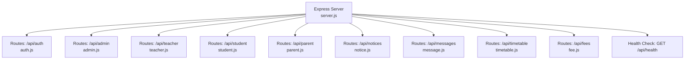
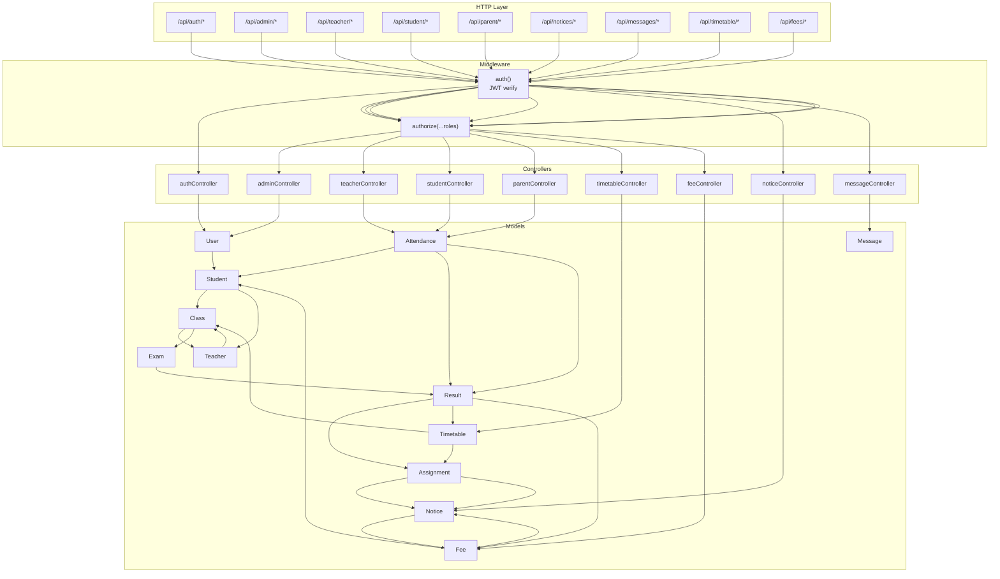
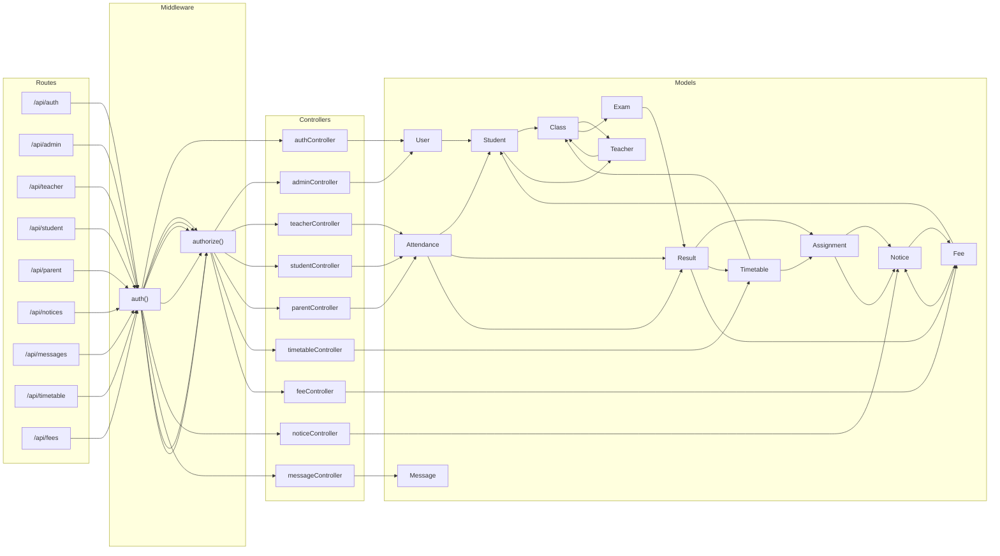

# API Documentation

<cite>
**Referenced Files in This Document**
- [server.js](file://server/server.js)
- [auth.js](file://server/routes/auth.js)
- [admin.js](file://server/routes/admin.js)
- [teacher.js](file://server/routes/teacher.js)
- [student.js](file://server/routes/student.js)
- [parent.js](file://server/routes/parent.js)
- [notice.js](file://server/routes/notice.js)
- [message.js](file://server/routes/message.js)
- [timetable.js](file://server/routes/timetable.js)
- [fee.js](file://server/routes/fee.js)
- [auth.js](file://server/middleware/auth.js)
- [authController.js](file://server/controllers/authController.js)
- [adminController.js](file://server/controllers/adminController.js)
- [teacherController.js](file://server/controllers/teacherController.js)
- [studentController.js](file://server/controllers/studentController.js)
- [parentController.js](file://server/controllers/parentController.js)
- [noticeController.js](file://server/controllers/noticeController.js)
- [messageController.js](file://server/controllers/messageController.js)
- [timetableController.js](file://server/controllers/timetableController.js)
- [feeController.js](file://server/controllers/feeController.js)
- [User.js](file://server/models/User.js)
- [Student.js](file://server/models/Student.js)
- [Teacher.js](file://server/models/Teacher.js)
- [Class.js](file://server/models/Class.js)
- [Attendance.js](file://server/models/Attendance.js)
- [Result.js](file://server/models/Result.js)
- [Exam.js](file://server/models/Exam.js)
- [Assignment.js](file://server/models/Assignment.js)
- [Notice.js](file://server/models/Notice.js)
- [Message.js](file://server/models/Message.js)
- [Timetable.js](file://server/models/Timetable.js)
- [Fee.js](file://server/models/Fee.js)
</cite>

## Table of Contents
1. [Introduction](#introduction)
2. [Project Structure](#project-structure)
3. [Core Components](#core-components)
4. [Architecture Overview](#architecture-overview)
5. [Detailed Component Analysis](#detailed-component-analysis)
6. [Dependency Analysis](#dependency-analysis)
7. [Performance Considerations](#performance-considerations)
8. [Troubleshooting Guide](#troubleshooting-guide)
9. [Conclusion](#conclusion)
10. [Appendices](#appendices)

## Introduction
This document provides comprehensive API documentation for the Educational Management System RESTful APIs. It covers authentication, user management, class management, attendance tracking, grade reporting, fee management, notice board, messaging, and timetable systems. For each endpoint, you will find HTTP methods, URL patterns, request/response schemas, authentication requirements, and error handling. Example requests and responses, parameter descriptions, and status codes are included. API versioning, rate limiting, and security considerations are also documented.

## Project Structure
The backend is an Express.js server exposing multiple API groups under the base path /api. Each group corresponds to a functional domain and is mounted under a dedicated route module. Authentication and authorization are enforced via middleware.

**Diagram sources**
- [server.js:18-32](file://server/server.js#L18-L32)

**Section sources**
- [server.js:18-32](file://server/server.js#L18-L32)

## Core Components
- Authentication and Authorization Middleware
  - Token extraction from Authorization header (Bearer).
  - JWT verification and user loading.
  - Role-based authorization enforcement.
- Controllers
  - Implement business logic for each domain (auth, admin, teacher, student, parent, notices, messages, timetable, fees).
- Models
  - MongoDB Mongoose models represent entities such as User, Student, Teacher, Class, Attendance, Result, Exam, Assignment, Notice, Message, Timetable, and Fee.

Security and Access Control
- All protected endpoints require a valid Bearer token.
- Some endpoints restrict access by role using the authorize middleware.

Rate Limiting
- Not implemented in the current codebase. Consider adding rate limiting at the application or reverse proxy level.

API Versioning
- No explicit versioning scheme is implemented. Consider using a path-based version (e.g., /api/v1) or Accept header negotiation.

**Section sources**
- [auth.js:1-31](file://server/middleware/auth.js#L1-L31)
- [auth.js:19-28](file://server/middleware/auth.js#L19-L28)

## Architecture Overview
The system follows a layered architecture:
- HTTP Layer: Express routes define endpoints.
- Middleware Layer: Authentication and authorization.
- Controller Layer: Request handling and orchestration.
- Model Layer: Data persistence and queries.
- CORS and JSON parsing are enabled globally.

**Diagram sources**
- [server.js:18-27](file://server/server.js#L18-L27)
- [auth.js:1-31](file://server/middleware/auth.js#L1-L31)
- [admin.js:1-20](file://server/routes/admin.js#L1-L20)
- [teacher.js:1-20](file://server/routes/teacher.js#L1-L20)
- [student.js:1-14](file://server/routes/student.js#L1-L14)
- [parent.js:1-13](file://server/routes/parent.js#L1-L13)
- [notice.js:1-12](file://server/routes/notice.js#L1-L12)
- [message.js:1-11](file://server/routes/message.js#L1-L11)
- [timetable.js:1-12](file://server/routes/timetable.js#L1-L12)
- [fee.js:1-13](file://server/routes/fee.js#L1-L13)

## Detailed Component Analysis

### Authentication API
- Base Path: /api/auth
- Security: Requires Authorization header with Bearer token for protected routes.

Endpoints
- POST /api/auth/register
  - Description: Register a new user.
  - Authentication: None.
  - Request Body: name, email, password, role, phone, address.
  - Response: _id, name, email, role, token.
  - Status Codes: 201 on success, 400 on duplicate email, 500 on error.
  - Example Request: POST /api/auth/register with JSON body containing fields above.
  - Example Response: { "_id": "...", "name": "...", "email": "...", "role": "...", "token": "..." }.

- POST /api/auth/login
  - Description: Authenticate user and return token.
  - Authentication: None.
  - Request Body: email, password.
  - Response: _id, name, email, role, phone, address, profileImage, token.
  - Status Codes: 200 on success, 401 on invalid credentials or inactive account, 500 on error.
  - Example Request: POST /api/auth/login with JSON body containing email and password.
  - Example Response: { "token": "..." }.

- GET /api/auth/me
  - Description: Get current user profile with role-specific details.
  - Authentication: Required (Bearer).
  - Response: User fields and role-specific profile (e.g., studentProfile or teacherProfile).
  - Status Codes: 200 on success, 500 on error.

- PUT /api/auth/profile
  - Description: Update profile (name, phone, address).
  - Authentication: Required (Bearer).
  - Request Body: name, phone, address.
  - Response: Updated user object.
  - Status Codes: 200 on success, 500 on error.

- PUT /api/auth/change-password
  - Description: Change password after verifying current password.
  - Authentication: Required (Bearer).
  - Request Body: currentPassword, newPassword.
  - Response: Success message.
  - Status Codes: 200 on success, 400 on incorrect current password, 500 on error.

Security Notes
- Tokens are signed with a secret and expire after a configured period.
- Passwords are hashed by the model/controller logic.

**Section sources**
- [auth.js:1-13](file://server/routes/auth.js#L1-L13)
- [authController.js:10-107](file://server/controllers/authController.js#L10-L107)
- [auth.js:4-19](file://server/middleware/auth.js#L4-L19)

### Admin API
- Base Path: /api/admin
- Roles Authorized: admin.

Endpoints
- GET /api/admin/dashboard
  - Description: Retrieve dashboard statistics (counts and role distribution).
  - Authentication: Required (Bearer), Role: admin.
  - Response: { totalStudents, totalTeachers, totalClasses, totalUsers, usersByRole }.
  - Status Codes: 200 on success, 500 on error.

- GET /api/admin/users
  - Description: List users with filtering and pagination.
  - Authentication: Required (Bearer), Role: admin.
  - Query Params: role, search, page, limit.
  - Response: { users[], total, page, pages }.
  - Status Codes: 200 on success, 500 on error.

- GET /api/admin/users/:id
  - Description: Get user by ID with role-specific profile.
  - Authentication: Required (Bearer), Role: admin.
  - Response: User with studentProfile or teacherProfile when applicable.
  - Status Codes: 200 on success, 404 if not found, 500 on error.

- POST /api/admin/users
  - Description: Create a new user and associated role profile (student or teacher).
  - Authentication: Required (Bearer), Role: admin.
  - Request Body: name, email, password, role, phone, address, subject, qualification, classId, rollNumber, parentId, dateOfBirth, gender.
  - Response: { message, user }.
  - Status Codes: 201 on success, 400 on duplicate email, 500 on error.

- PUT /api/admin/users/:id
  - Description: Update user and role-specific profile.
  - Authentication: Required (Bearer), Role: admin.
  - Request Body: name, email, phone, address, isActive, subject, qualification, classId, rollNumber.
  - Response: { message, user }.
  - Status Codes: 200 on success, 404 if not found, 500 on error.

- DELETE /api/admin/users/:id
  - Description: Delete user and associated role profile.
  - Authentication: Required (Bearer), Role: admin.
  - Response: { message }.
  - Status Codes: 200 on success, 404 if not found, 500 on error.

- GET /api/admin/classes
  - Description: List all classes with teacher populated.
  - Authentication: Required (Bearer), Role: admin.
  - Response: Array of classes.
  - Status Codes: 200 on success, 500 on error.

- POST /api/admin/classes
  - Description: Create a new class.
  - Authentication: Required (Bearer), Role: admin.
  - Request Body: Class fields.
  - Response: Created class.
  - Status Codes: 201 on success, 500 on error.

- PUT /api/admin/classes/:id
  - Description: Update a class.
  - Authentication: Required (Bearer), Role: admin.
  - Request Body: Class fields.
  - Response: Updated class.
  - Status Codes: 200 on success, 404 if not found, 500 on error.

- DELETE /api/admin/classes/:id
  - Description: Delete a class.
  - Authentication: Required (Bearer), Role: admin.
  - Response: { message }.
  - Status Codes: 200 on success, 404 if not found, 500 on error.

- GET /api/admin/classes/:id/students
  - Description: Get students in a class with user and parent info.
  - Authentication: Required (Bearer), Roles: admin, teacher.
  - Response: Array of students.
  - Status Codes: 200 on success, 500 on error.

- PUT /api/admin/classes/:id/assign-teacher
  - Description: Assign a teacher to a class.
  - Authentication: Required (Bearer), Role: admin.
  - Request Body: { teacherId }.
  - Response: Updated class with teacher populated.
  - Status Codes: 200 on success, 500 on error.

**Section sources**
- [admin.js:1-20](file://server/routes/admin.js#L1-L20)
- [adminController.js:6-158](file://server/controllers/adminController.js#L6-L158)

### Teacher API
- Base Path: /api/teacher
- Roles Authorized: teacher, admin.

Endpoints
- POST /api/teacher/attendance
  - Description: Mark attendance for multiple students.
  - Authentication: Required (Bearer), Roles: teacher.
  - Request Body: { records: [{ studentId, status, remarks }] }, optional date.
  - Response: { message, results }.
  - Status Codes: 201 on success, 404 if teacher profile not found, 500 on error.

- GET /api/teacher/attendance
  - Description: Get class attendance for a given date.
  - Authentication: Required (Bearer), Roles: teacher.
  - Query Params: classId, date.
  - Response: { students[], attendance[] }.
  - Status Codes: 200 on success, 500 on error.

- GET /api/teacher/attendance/monthly
  - Description: Monthly attendance summary per student.
  - Authentication: Required (Bearer), Roles: teacher, admin.
  - Query Params: classId, month, year.
  - Response: Array of summaries per student.
  - Status Codes: 200 on success, 500 on error.

- POST /api/teacher/exams
  - Description: Create an exam.
  - Authentication: Required (Bearer), Roles: teacher, admin.
  - Request Body: Exam fields.
  - Response: Created exam.
  - Status Codes: 201 on success, 500 on error.

- GET /api/teacher/exams/:classId
  - Description: List exams for a class.
  - Authentication: Required (Bearer), Roles: teacher, admin.
  - Response: Array of exams.
  - Status Codes: 200 on success, 500 on error.

- POST /api/teacher/results
  - Description: Upload results for an exam.
  - Authentication: Required (Bearer), Roles: teacher, admin.
  - Request Body: { examId, results: [{ studentId, marks, grade, remarks }] }.
  - Response: { message, results[] }.
  - Status Codes: 201 on success, 404 if exam not found, 500 on error.

- GET /api/teacher/results/:examId
  - Description: Get results for an exam with student names.
  - Authentication: Required (Bearer), Roles: teacher, admin.
  - Response: Array of results.
  - Status Codes: 200 on success, 500 on error.

- POST /api/teacher/assignments
  - Description: Create an assignment.
  - Authentication: Required (Bearer), Roles: teacher.
  - Request Body: Assignment fields.
  - Response: Created assignment.
  - Status Codes: 201 on success, 500 on error.

- GET /api/teacher/assignments/:classId
  - Description: List assignments for a class.
  - Authentication: Required (Bearer), Roles: teacher, admin, student.
  - Response: Array of assignments.
  - Status Codes: 200 on success, 500 on error.

- DELETE /api/teacher/assignments/:id
  - Description: Delete an assignment.
  - Authentication: Required (Bearer), Roles: teacher.
  - Response: { message }.
  - Status Codes: 200 on success, 500 on error.

- GET /api/teacher/classes
  - Description: List teacher’s assigned classes.
  - Authentication: Required (Bearer), Roles: teacher.
  - Response: Array of classes.
  - Status Codes: 200 on success, 404 if teacher profile not found, 500 on error.

- POST /api/teacher/notices
  - Description: Create a notice.
  - Authentication: Required (Bearer), Roles: teacher, admin.
  - Request Body: Notice fields.
  - Response: Created notice.
  - Status Codes: 201 on success, 500 on error.

**Section sources**
- [teacher.js:1-20](file://server/routes/teacher.js#L1-L20)
- [teacherController.js:10-181](file://server/controllers/teacherController.js#L10-L181)

### Student API
- Base Path: /api/student
- Roles Authorized: student.

Endpoints
- GET /api/student/attendance
  - Description: Get own attendance with optional month/year filter.
  - Authentication: Required (Bearer), Roles: student.
  - Query Params: month, year.
  - Response: { attendance[], summary: { totalDays, present, absent, late, percentage } }.
  - Status Codes: 200 on success, 404 if student profile not found, 500 on error.

- GET /api/student/results
  - Description: Get own results with class info.
  - Authentication: Required (Bearer), Roles: student.
  - Response: Array of results.
  - Status Codes: 200 on success, 404 if student profile not found, 500 on error.

- GET /api/student/timetable
  - Description: Get own timetable by class.
  - Authentication: Required (Bearer), Roles: student.
  - Response: Array of timetable entries.
  - Status Codes: 200 on success, 404 if student profile not found, 500 on error.

- GET /api/student/assignments
  - Description: Get class assignments.
  - Authentication: Required (Bearer), Roles: student.
  - Response: Array of assignments.
  - Status Codes: 200 on success, 404 if student profile not found, 500 on error.

- GET /api/student/notices
  - Description: Get notices targeting students or all.
  - Authentication: Required (Bearer), Roles: student.
  - Response: Array of notices.
  - Status Codes: 200 on success, 500 on error.

- GET /api/student/fees
  - Description: Get own fee records.
  - Authentication: Required (Bearer), Roles: student.
  - Response: Array of fees.
  - Status Codes: 200 on success, 404 if student profile not found, 500 on error.

**Section sources**
- [student.js:1-14](file://server/routes/student.js#L1-L14)
- [studentController.js:10-85](file://server/controllers/studentController.js#L10-L85)

### Parent API
- Base Path: /api/parent
- Roles Authorized: parent.

Endpoints
- GET /api/parent/child
  - Description: Get child information linked to parent.
  - Authentication: Required (Bearer), Roles: parent.
  - Response: Child profile with user and class info.
  - Status Codes: 200 on success, 404 if no child linked, 500 on error.

- GET /api/parent/attendance
  - Description: Get child’s attendance with optional month/year filter.
  - Authentication: Required (Bearer), Roles: parent.
  - Query Params: month, year.
  - Response: { student, attendance[], summary: { totalDays, present, absent, percentage } }.
  - Status Codes: 200 on success, 404 if no child linked, 500 on error.

- GET /api/parent/results
  - Description: Get child’s results with class info.
  - Authentication: Required (Bearer), Roles: parent.
  - Response: { student, results[] }.
  - Status Codes: 200 on success, 404 if no child linked, 500 on error.

- GET /api/parent/fees
  - Description: Get child’s fees and financial summary.
  - Authentication: Required (Bearer), Roles: parent.
  - Response: { student, fees[], summary: { totalFees, paidFees, unpaidFees } }.
  - Status Codes: 200 on success, 404 if no child linked, 500 on error.

- GET /api/parent/notices
  - Description: Get notices targeting parents or all.
  - Authentication: Required (Bearer), Roles: parent.
  - Response: Array of notices.
  - Status Codes: 200 on success, 500 on error.

**Section sources**
- [parent.js:1-13](file://server/routes/parent.js#L1-L13)
- [parentController.js:8-74](file://server/controllers/parentController.js#L8-L74)

### Notice Board API
- Base Path: /api/notices
- Roles Authorized: depends on endpoint.

Endpoints
- GET /api/notices/
  - Description: Get all notices (filtered by target roles internally).
  - Authentication: Required (Bearer).
  - Response: Array of notices.
  - Status Codes: 200 on success, 500 on error.

- POST /api/notices/
  - Description: Create a notice.
  - Authentication: Required (Bearer).
  - Request Body: Notice fields.
  - Response: Created notice.
  - Status Codes: 201 on success, 500 on error.

- PUT /api/notices/:id
  - Description: Update a notice.
  - Authentication: Required (Bearer).
  - Request Body: Notice fields.
  - Response: Updated notice.
  - Status Codes: 200 on success, 500 on error.

- DELETE /api/notices/:id
  - Description: Delete a notice.
  - Authentication: Required (Bearer).
  - Response: { message }.
  - Status Codes: 200 on success, 500 on error.

**Section sources**
- [notice.js:1-12](file://server/routes/notice.js#L1-L12)
- [noticeController.js](file://server/controllers/noticeController.js)

### Messaging API
- Base Path: /api/messages
- Roles Authorized: depends on endpoint.

Endpoints
- GET /api/messages/:receiverId
  - Description: Get messages exchanged with a receiver.
  - Authentication: Required (Bearer).
  - Response: Array of messages.
  - Status Codes: 200 on success, 500 on error.

- POST /api/messages/
  - Description: Send a message.
  - Authentication: Required (Bearer).
  - Request Body: Message fields.
  - Response: Created message.
  - Status Codes: 201 on success, 500 on error.

- GET /api/messages/unread/count
  - Description: Get unread message count for the logged-in user.
  - Authentication: Required (Bearer).
  - Response: { count }.
  - Status Codes: 200 on success, 500 on error.

**Section sources**
- [message.js:1-11](file://server/routes/message.js#L1-L11)
- [messageController.js](file://server/controllers/messageController.js)

### Timetable API
- Base Path: /api/timetable
- Roles Authorized: admin, teacher.

Endpoints
- GET /api/timetable/:classId
  - Description: Get timetable for a class.
  - Authentication: Required (Bearer), Roles: admin, teacher.
  - Response: Array of timetable entries.
  - Status Codes: 200 on success, 500 on error.

- POST /api/timetable/
  - Description: Create a timetable entry.
  - Authentication: Required (Bearer), Roles: admin, teacher.
  - Request Body: Timetable fields.
  - Response: Created timetable.
  - Status Codes: 201 on success, 500 on error.

- PUT /api/timetable/:id
  - Description: Update a timetable entry.
  - Authentication: Required (Bearer), Roles: admin, teacher.
  - Request Body: Timetable fields.
  - Response: Updated timetable.
  - Status Codes: 200 on success, 500 on error.

- DELETE /api/timetable/:id
  - Description: Delete a timetable entry.
  - Authentication: Required (Bearer), Roles: admin.
  - Response: { message }.
  - Status Codes: 200 on success, 500 on error.

**Section sources**
- [timetable.js:1-12](file://server/routes/timetable.js#L1-L12)
- [timetableController.js](file://server/controllers/timetableController.js)

### Fee Management API
- Base Path: /api/fees
- Roles Authorized: admin.

Endpoints
- POST /api/fees/
  - Description: Create a fee record.
  - Authentication: Required (Bearer), Roles: admin.
  - Request Body: Fee fields.
  - Response: Created fee.
  - Status Codes: 201 on success, 500 on error.

- GET /api/fees/student/:studentId
  - Description: Get fee records for a student.
  - Authentication: Required (Bearer), Roles: admin.
  - Response: Array of fees.
  - Status Codes: 200 on success, 500 on error.

- PUT /api/fees/:id
  - Description: Update a fee record.
  - Authentication: Required (Bearer), Roles: admin.
  - Request Body: Fee fields.
  - Response: Updated fee.
  - Status Codes: 200 on success, 500 on error.

- PUT /api/fees/:id/pay
  - Description: Mark a fee as paid.
  - Authentication: Required (Bearer), Roles: admin.
  - Response: { message }.
  - Status Codes: 200 on success, 500 on error.

- GET /api/fees/report
  - Description: Get a fee report (admin-only).
  - Authentication: Required (Bearer), Roles: admin.
  - Response: Report data.
  - Status Codes: 200 on success, 500 on error.

**Section sources**
- [fee.js:1-13](file://server/routes/fee.js#L1-L13)
- [feeController.js](file://server/controllers/feeController.js)

## Dependency Analysis
The following diagram shows key dependencies among routes, middleware, controllers, and models.

**Diagram sources**
- [server.js:18-27](file://server/server.js#L18-L27)
- [auth.js:1-31](file://server/middleware/auth.js#L1-L31)
- [admin.js:1-20](file://server/routes/admin.js#L1-L20)
- [teacher.js:1-20](file://server/routes/teacher.js#L1-L20)
- [student.js:1-14](file://server/routes/student.js#L1-L14)
- [parent.js:1-13](file://server/routes/parent.js#L1-L13)
- [notice.js:1-12](file://server/routes/notice.js#L1-L12)
- [message.js:1-11](file://server/routes/message.js#L1-L11)
- [timetable.js:1-12](file://server/routes/timetable.js#L1-L12)
- [fee.js:1-13](file://server/routes/fee.js#L1-L13)

**Section sources**
- [server.js:18-27](file://server/server.js#L18-L27)
- [auth.js:1-31](file://server/middleware/auth.js#L1-L31)

## Performance Considerations
- Pagination: The admin user listing endpoint supports pagination via page and limit query parameters.
- Filtering: Search and role filters reduce payload sizes for user listings.
- Population: Controllers populate related documents (e.g., user, class, teacher). Use lean queries or projections where appropriate to minimize bandwidth.
- Indexing: Ensure database indexes on frequently queried fields (e.g., email, studentId, classId) to improve query performance.
- Caching: Consider caching static or low-churn resources (e.g., class lists, notices) to reduce database load.

[No sources needed since this section provides general guidance]

## Troubleshooting Guide
Common Issues and Resolutions
- Authentication Failures
  - Symptom: 401 Unauthorized on protected endpoints.
  - Cause: Missing or invalid Bearer token.
  - Resolution: Ensure Authorization header is set to Bearer <token> and the token is valid.

- Role Authorization Errors
  - Symptom: 403 Forbidden when accessing an endpoint.
  - Cause: Insufficient role privileges.
  - Resolution: Verify the user’s role matches the required roles for the endpoint.

- Entity Not Found
  - Symptom: 404 Not Found for GET /api/admin/users/:id or similar.
  - Cause: Resource does not exist or user is not linked to requested entity.
  - Resolution: Confirm the ID exists and the requester has permission to access it.

- Validation Errors
  - Symptom: 400 Bad Request during registration or updates.
  - Cause: Duplicate email or missing required fields.
  - Resolution: Ensure unique email and provide required fields.

- Internal Server Errors
  - Symptom: 500 Internal Server Error.
  - Cause: Unhandled exceptions in controller logic.
  - Resolution: Check server logs and ensure proper error handling.

Security Considerations
- Always transmit tokens over HTTPS.
- Store tokens securely on the client.
- Enforce CORS policies appropriately.
- Validate and sanitize all inputs on the server.

**Section sources**
- [auth.js:4-19](file://server/middleware/auth.js#L4-L19)
- [auth.js:21-28](file://server/middleware/auth.js#L21-L28)
- [adminController.js:39-52](file://server/controllers/adminController.js#L39-L52)
- [studentController.js:12-13](file://server/controllers/studentController.js#L12-L13)
- [parentController.js:10-12](file://server/controllers/parentController.js#L10-L12)

## Conclusion
This API documentation outlines the complete set of endpoints for the Educational Management System, including authentication, user and class administration, attendance, results, timetable, fees, notices, and messaging. Each endpoint specifies HTTP methods, URL patterns, authentication requirements, and typical responses. The system enforces authentication via JWT and role-based authorization. For production deployment, consider implementing rate limiting, API versioning, and robust input validation.

[No sources needed since this section summarizes without analyzing specific files]

## Appendices

### Endpoint Reference Summary
- Authentication: /api/auth/*
- Admin: /api/admin/*
- Teacher: /api/teacher/*
- Student: /api/student/*
- Parent: /api/parent/*
- Notices: /api/notices/*
- Messages: /api/messages/*
- Timetable: /api/timetable/*
- Fees: /api/fees/*

**Section sources**
- [server.js:18-27](file://server/server.js#L18-L27)

### Example Request/Response Patterns
- Authentication
  - POST /api/auth/register
    - Request: { name, email, password, role, phone, address }
    - Response: { _id, name, email, role, token }
  - POST /api/auth/login
    - Request: { email, password }
    - Response: { token }

- Admin User Management
  - POST /api/admin/users
    - Request: { name, email, password, role, phone, address, subject, qualification, classId, rollNumber, parentId, dateOfBirth, gender }
    - Response: { message, user }

- Teacher Attendance
  - POST /api/teacher/attendance
    - Request: { records: [{ studentId, status, remarks }], date }
    - Response: { message, results }

- Student Reports
  - GET /api/student/results
    - Response: Array of results with populated exam and class info

- Parent Dashboard
  - GET /api/parent/fees
    - Response: { student, fees[], summary: { totalFees, paidFees, unpaidFees } }

**Section sources**
- [authController.js:10-59](file://server/controllers/authController.js#L10-L59)
- [adminController.js:55-70](file://server/controllers/adminController.js#L55-L70)
- [teacherController.js:11-41](file://server/controllers/teacherController.js#L11-L41)
- [studentController.js:33-42](file://server/controllers/studentController.js#L33-L42)
- [parentController.js:42-54](file://server/controllers/parentController.js#L42-L54)