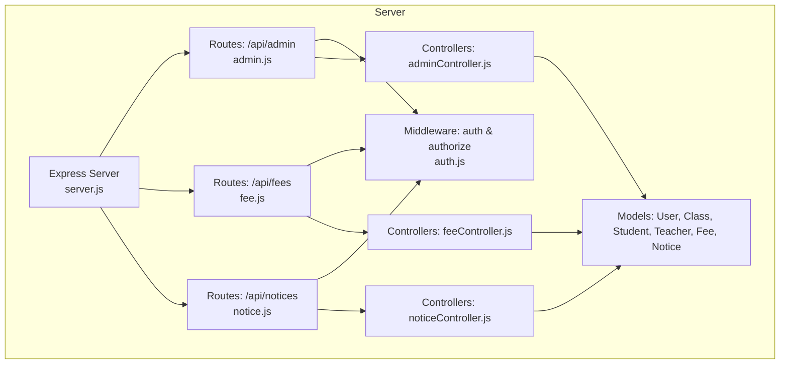
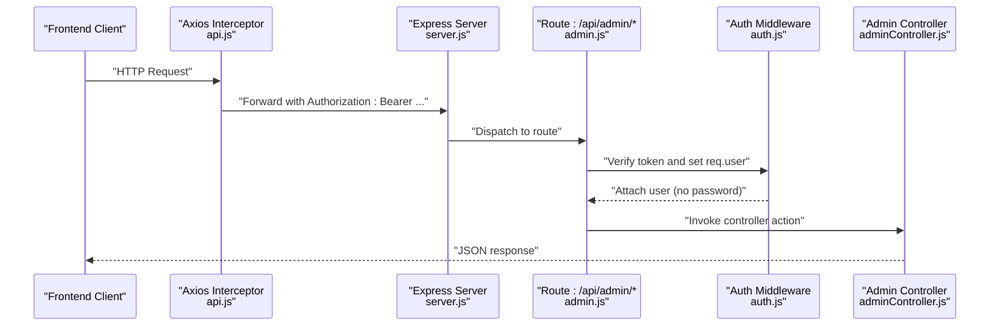
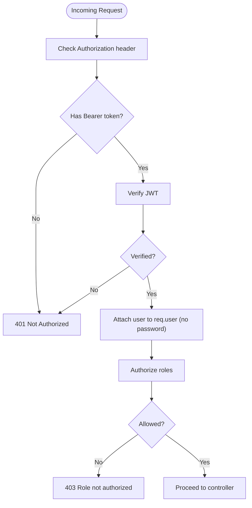
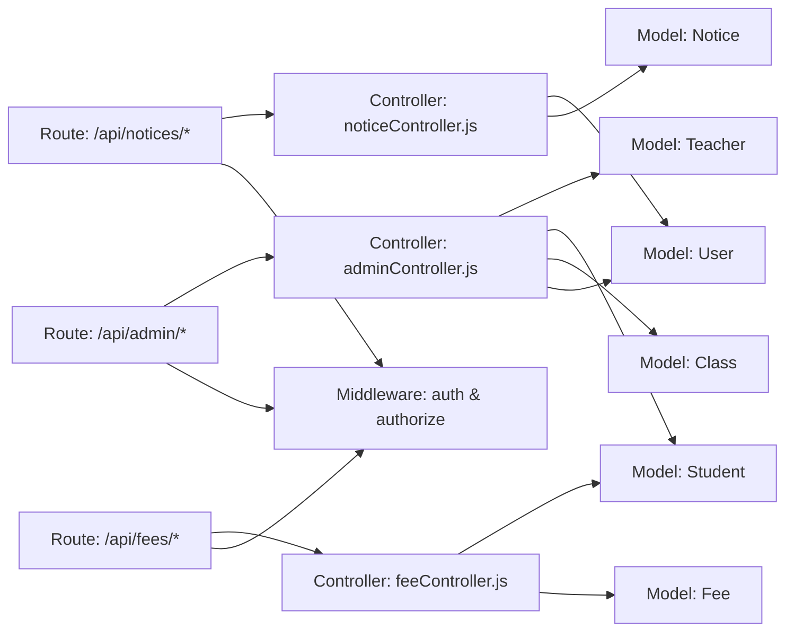

# Admin API

<cite>
**Referenced Files in This Document**
- [server.js](file://server/server.js)
- [admin.js](file://server/routes/admin.js)
- [adminController.js](file://server/controllers/adminController.js)
- [fee.js](file://server/routes/fee.js)
- [feeController.js](file://server/controllers/feeController.js)
- [notice.js](file://server/routes/notice.js)
- [noticeController.js](file://server/controllers/noticeController.js)
- [auth.js](file://server/middleware/auth.js)
- [User.js](file://server/models/User.js)
- [Class.js](file://server/models/Class.js)
- [Student.js](file://server/models/Student.js)
- [Teacher.js](file://server/models/Teacher.js)
- [Fee.js](file://server/models/Fee.js)
- [Notice.js](file://server/models/Notice.js)
- [api.js](file://client/src/api.js)
</cite>

## Table of Contents
1. [Introduction](#introduction)
2. [Project Structure](#project-structure)
3. [Core Components](#core-components)
4. [Architecture Overview](#architecture-overview)
5. [Detailed Component Analysis](#detailed-component-analysis)
6. [Dependency Analysis](#dependency-analysis)
7. [Performance Considerations](#performance-considerations)
8. [Troubleshooting Guide](#troubleshooting-guide)
9. [Conclusion](#conclusion)

## Introduction
This document provides comprehensive API documentation for the Admin API endpoints. It covers administrative functions including user management, class administration, fee processing, notice creation, and administrative reporting. For each endpoint, you will find HTTP methods, URL patterns, request/response schemas, authentication and authorization requirements, and example requests/responses. Role-based access control and admin-specific security measures are also documented.

## Project Structure
The Admin API is exposed under the base path /api/admin and integrates with shared authentication and authorization middleware. The backend is structured by routes, controllers, and models, with the Express server wiring routes and middleware.

**Diagram sources**
- [server.js:18-27](file://server/server.js#L18-L27)
- [admin.js:1-20](file://server/routes/admin.js#L1-L20)
- [fee.js:1-13](file://server/routes/fee.js#L1-L13)
- [notice.js:1-12](file://server/routes/notice.js#L1-L12)
- [auth.js:1-31](file://server/middleware/auth.js#L1-L31)
- [adminController.js:1-158](file://server/controllers/adminController.js#L1-L158)
- [feeController.js:1-119](file://server/controllers/feeController.js#L1-L119)
- [noticeController.js:1-43](file://server/controllers/noticeController.js#L1-L43)
- [User.js:1-27](file://server/models/User.js#L1-L27)
- [Class.js:1-11](file://server/models/Class.js#L1-L11)
- [Student.js:1-16](file://server/models/Student.js#L1-L16)
- [Teacher.js:1-13](file://server/models/Teacher.js#L1-L13)
- [Fee.js:1-17](file://server/models/Fee.js#L1-L17)
- [Notice.js:1-14](file://server/models/Notice.js#L1-L14)

**Section sources**
- [server.js:18-27](file://server/server.js#L18-L27)

## Core Components
- Authentication: JWT-based bearer tokens validated via Authorization header.
- Authorization: Role-based enforcement with a dedicated authorize middleware.
- Admin routes: Under /api/admin, secured with auth and authorize('admin').
- Additional admin-secured routes: Fee management (/api/fees) and notices (/api/notices) endpoints are protected for admin use.

Key security controls:
- Token verification failure returns 401.
- Missing token returns 401.
- Non-admin access returns 403.
- Password hashing is enforced at model level for User.

**Section sources**
- [auth.js:4-28](file://server/middleware/auth.js#L4-L28)
- [User.js:15-24](file://server/models/User.js#L15-L24)
- [admin.js:6-17](file://server/routes/admin.js#L6-L17)
- [fee.js:6-10](file://server/routes/fee.js#L6-L10)
- [notice.js:6-9](file://server/routes/notice.js#L6-L9)

## Architecture Overview
The Admin API follows a layered architecture:
- Route handlers enforce auth and roles.
- Controllers implement business logic and interact with models.
- Models define schemas and pre-save hooks (e.g., password hashing).
- Frontend communicates via Axios with automatic Bearer token injection.

**Diagram sources**
- [api.js:8-14](file://client/src/api.js#L8-L14)
- [server.js:18-27](file://server/server.js#L18-L27)
- [admin.js:6-17](file://server/routes/admin.js#L6-L17)
- [auth.js:4-28](file://server/middleware/auth.js#L4-L28)
- [adminController.js:6-17](file://server/controllers/adminController.js#L6-L17)

## Detailed Component Analysis

### Authentication and Authorization
- Authentication: Validates Authorization: Bearer <token>, verifies JWT, attaches user to request, excludes password.
- Authorization: Enforces role-based access; admin-only routes use authorize('admin'); class student listing allows 'teacher' as well.

**Diagram sources**
- [auth.js:4-28](file://server/middleware/auth.js#L4-L28)

**Section sources**
- [auth.js:4-28](file://server/middleware/auth.js#L4-L28)
- [api.js:8-14](file://client/src/api.js#L8-L14)

### Admin Dashboard Statistics
- Endpoint: GET /api/admin/dashboard
- Auth: Bearer token required
- Role: admin
- Response: Aggregate counts and role distribution

Example request:
- Headers: Authorization: Bearer <token>
- Response keys: totalStudents, totalTeachers, totalClasses, totalUsers, usersByRole

**Section sources**
- [admin.js:6](file://server/routes/admin.js#L6)
- [adminController.js:6-17](file://server/controllers/adminController.js#L6-L17)

### User Management
Endpoints:
- GET /api/admin/users
  - Query params: role (optional), search (text), page (default 1), limit (default 20)
  - Response: users array, pagination metadata
- GET /api/admin/users/:id
  - Response: user object; includes studentProfile or teacherProfile when applicable
- POST /api/admin/users
  - Body: name, email, password, role, phone, address, plus role-specific fields
  - Behavior: Creates User; creates Student or Teacher profile accordingly
- PUT /api/admin/users/:id
  - Body: updates for user and role-specific fields
  - Behavior: Updates User and related Student/Teacher profile
- DELETE /api/admin/users/:id
  - Behavior: Deletes User and associated Student/Teacher profile

Authorization: admin

Example request (POST):
- Headers: Authorization: Bearer <token>
- Body: { name, email, password, role, phone, address, classId/rollNumber/parentId for student, subject/qualification for teacher }

Example response (GET /:id):
- Includes user-level fields and either studentProfile or teacherProfile populated

**Section sources**
- [admin.js:7-11](file://server/routes/admin.js#L7-L11)
- [adminController.js:19-98](file://server/controllers/adminController.js#L19-L98)
- [User.js:4-13](file://server/models/User.js#L4-L13)
- [Student.js:3-13](file://server/models/Student.js#L3-L13)
- [Teacher.js:3-10](file://server/models/Teacher.js#L3-L10)

### Class Administration
Endpoints:
- GET /api/admin/classes
  - Response: array of classes with teacher populated
- POST /api/admin/classes
  - Body: class fields (e.g., name, section, academicYear)
- PUT /api/admin/classes/:id
  - Body: updates class fields
- DELETE /api/admin/classes/:id
  - Response: success message
- GET /api/admin/classes/:id/students
  - Roles allowed: admin, teacher
  - Response: students in class with userId and parentId populated
- PUT /api/admin/classes/:id/assign-teacher
  - Body: { teacherId }
  - Response: updated class with teacher populated

Authorization: admin except class student listing which allows teacher

**Section sources**
- [admin.js:12-17](file://server/routes/admin.js#L12-L17)
- [adminController.js:100-146](file://server/controllers/adminController.js#L100-L146)
- [Class.js:3-8](file://server/models/Class.js#L3-L8)
- [Student.js:3-13](file://server/models/Student.js#L3-L13)

### Fee Processing
Endpoints:
- POST /api/fees
  - Body: studentId, amount, feeType, dueDate, month, academicYear, receiptNumber (optional)
  - Response: created fee
- GET /api/fees/student/:studentId
  - Response: fees for student sorted by dueDate desc
- PUT /api/fees/:id
  - Body: updates to fee fields
  - Response: updated fee
- PUT /api/fees/:id/pay
  - Body: paidAmount (optional; defaults to amount)
  - Response: fee marked paid with paidDate set
- GET /api/fees/report
  - Query: classId (optional), status (optional), month (optional)
  - Response: studentSummaries with aggregated totals and overall status; summary totals

Authorization: admin for all fee endpoints

**Section sources**
- [fee.js:6-10](file://server/routes/fee.js#L6-L10)
- [feeController.js:4-118](file://server/controllers/feeController.js#L4-L118)
- [Fee.js:3-14](file://server/models/Fee.js#L3-L14)
- [Student.js:3-13](file://server/models/Student.js#L3-L13)

### Notice Creation and Management
Endpoints:
- GET /api/notices
  - Query: category (optional)
  - Response: notices sorted by pinned desc, then newest first
- POST /api/notices
  - Body: title, message, category, targetRoles[], isPinned, attachments[]
  - Response: created notice; postedBy set to current user
- PUT /api/notices/:id
  - Body: updates to notice fields
  - Response: updated notice
- DELETE /api/notices/:id
  - Response: success message

Authorization: authenticated user; admin privileges may be required for broader targets depending on policy

**Section sources**
- [notice.js:6-9](file://server/routes/notice.js#L6-L9)
- [noticeController.js:3-42](file://server/controllers/noticeController.js#L3-L42)
- [Notice.js:3-11](file://server/models/Notice.js#L3-L11)

## Dependency Analysis
Admin API endpoints depend on:
- Shared auth middleware for token verification and role checks
- Admin controller actions for business logic
- Models for data persistence and relationships

**Diagram sources**
- [admin.js:1-20](file://server/routes/admin.js#L1-L20)
- [fee.js:1-13](file://server/routes/fee.js#L1-L13)
- [notice.js:1-12](file://server/routes/notice.js#L1-L12)
- [auth.js:1-31](file://server/middleware/auth.js#L1-L31)
- [adminController.js:1-158](file://server/controllers/adminController.js#L1-L158)
- [feeController.js:1-119](file://server/controllers/feeController.js#L1-L119)
- [noticeController.js:1-43](file://server/controllers/noticeController.js#L1-L43)
- [User.js:1-27](file://server/models/User.js#L1-L27)
- [Class.js:1-11](file://server/models/Class.js#L1-L11)
- [Student.js:1-16](file://server/models/Student.js#L1-L16)
- [Teacher.js:1-13](file://server/models/Teacher.js#L1-L13)
- [Fee.js:1-17](file://server/models/Fee.js#L1-L17)
- [Notice.js:1-14](file://server/models/Notice.js#L1-L14)

**Section sources**
- [admin.js:1-20](file://server/routes/admin.js#L1-L20)
- [fee.js:1-13](file://server/routes/fee.js#L1-L13)
- [notice.js:1-12](file://server/routes/notice.js#L1-L12)
- [auth.js:1-31](file://server/middleware/auth.js#L1-L31)

## Performance Considerations
- Pagination: User listing supports page and limit parameters to avoid large payloads.
- Aggregation: Dashboard statistics use aggregation for counts and role distribution.
- Population: Controllers populate related documents (e.g., teacher, user profiles) to reduce round trips but consider projection to minimize payload size.
- Sorting: Queries sort by createdAt or dueDate to optimize retrieval order.

[No sources needed since this section provides general guidance]

## Troubleshooting Guide
Common errors and resolutions:
- 401 Not authorized, no token or token failed: Ensure Authorization header includes a valid Bearer token.
- 403 Role not authorized: Confirm the user has role admin; some class endpoints additionally allow teacher.
- 404 User/Class/Fee/Notice not found: Verify resource ID correctness.
- 400 Email already exists: When creating a user, ensure email uniqueness.

Frontend token handling:
- Axios interceptor automatically injects Authorization header from localStorage.
- On 401 response, the client clears user and redirects to login.

**Section sources**
- [auth.js:10-18](file://server/middleware/auth.js#L10-L18)
- [auth.js:21-28](file://server/middleware/auth.js#L21-L28)
- [adminController.js:57-59](file://server/controllers/adminController.js#L57-L59)
- [api.js:16-25](file://client/src/api.js#L16-L25)

## Conclusion
The Admin API provides a secure, role-based interface for managing users, classes, fees, and notices. Authentication via JWT and authorization via role checks protect endpoints, while controllers encapsulate business logic and models define data structures. Use the provided request/response schemas and examples to integrate administrative workflows effectively.