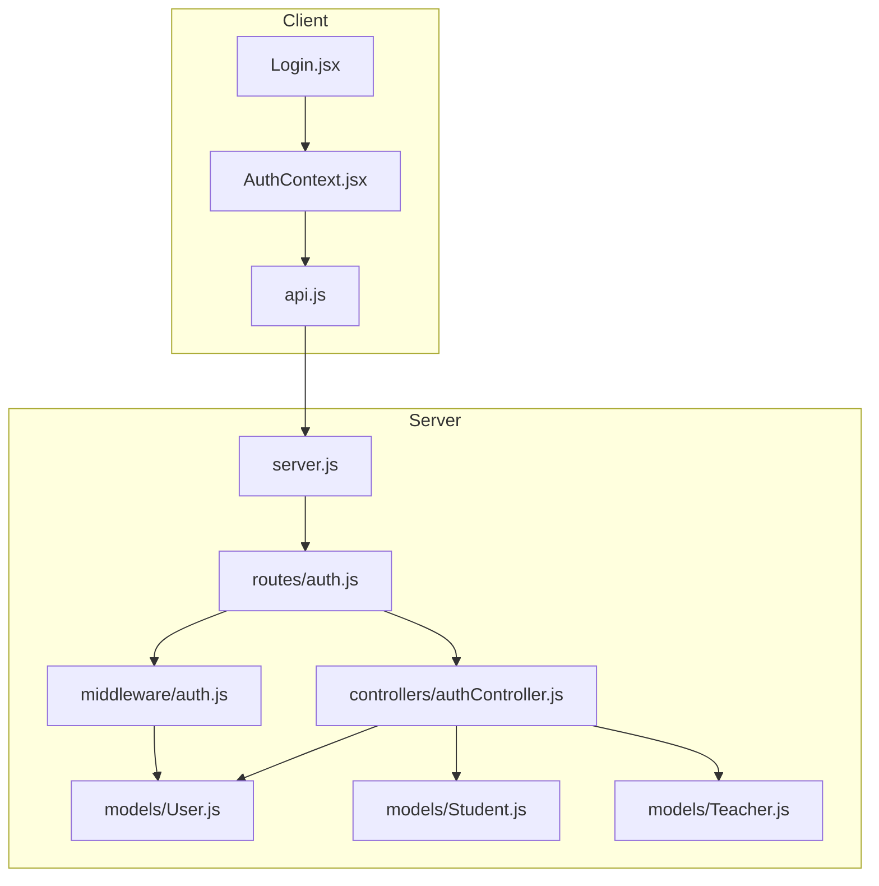
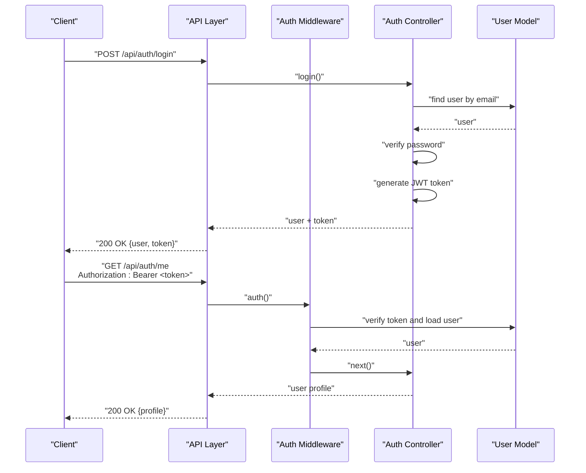
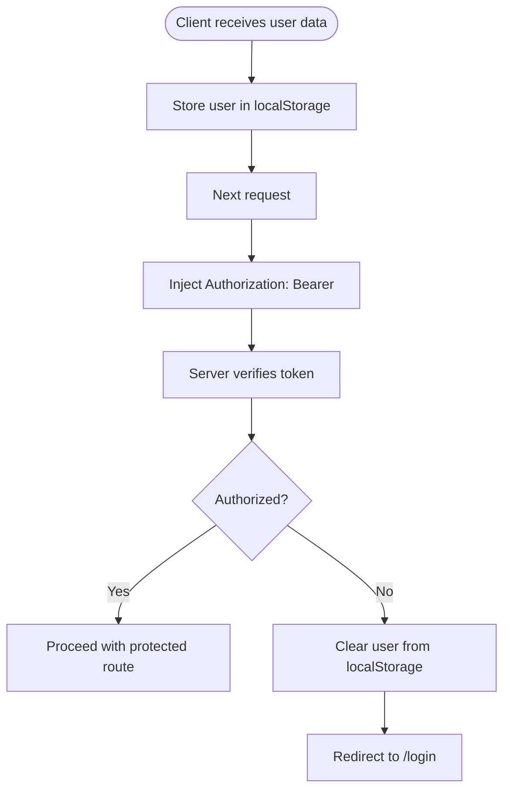
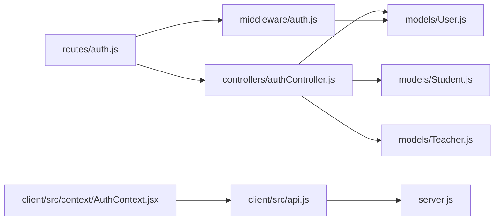

# Authentication API

<cite>
**Referenced Files in This Document**
- [server.js](file://server/server.js)
- [auth.js](file://server/routes/auth.js)
- [authController.js](file://server/controllers/authController.js)
- [auth.js](file://server/middleware/auth.js)
- [User.js](file://server/models/User.js)
- [Student.js](file://server/models/Student.js)
- [Teacher.js](file://server/models/Teacher.js)
- [AuthContext.jsx](file://client/src/context/AuthContext.jsx)
- [api.js](file://client/src/api.js)
- [Login.jsx](file://client/src/pages/auth/Login.jsx)
- [seed.js](file://server/seed.js)
</cite>

## Table of Contents
1. [Introduction](#introduction)
2. [Project Structure](#project-structure)
3. [Core Components](#core-components)
4. [Architecture Overview](#architecture-overview)
5. [Detailed Component Analysis](#detailed-component-analysis)
6. [Dependency Analysis](#dependency-analysis)
7. [Performance Considerations](#performance-considerations)
8. [Troubleshooting Guide](#troubleshooting-guide)
9. [Conclusion](#conclusion)

## Introduction
This document provides comprehensive API documentation for the Authentication API endpoints. It covers registration, login, profile management, and password change endpoints. For each endpoint, you will find HTTP methods, URL patterns, request/response schemas, authentication requirements, and error handling. It also documents JWT token handling, session management, security considerations, middleware usage, and common error scenarios. Example requests and responses are described with concrete paths to the relevant source files.

## Project Structure
The authentication system spans the backend server and the frontend client:
- Backend routes define the API endpoints under /api/auth.
- Controllers implement the business logic for authentication operations.
- Middleware enforces authentication and authorization.
- Models define the data structures for users, students, and teachers.
- Frontend context and API module handle client-side authentication state and HTTP requests.

**Diagram sources**
- [server.js:19](file://server/server.js#L19)
- [auth.js:1-13](file://server/routes/auth.js#L1-L13)
- [authController.js:1-107](file://server/controllers/authController.js#L1-L107)
- [auth.js:1-31](file://server/middleware/auth.js#L1-L31)
- [User.js:1-27](file://server/models/User.js#L1-L27)
- [Student.js:1-16](file://server/models/Student.js#L1-L16)
- [Teacher.js:1-13](file://server/models/Teacher.js#L1-L13)
- [AuthContext.jsx:1-53](file://client/src/context/AuthContext.jsx#L1-L53)
- [api.js:1-28](file://client/src/api.js#L1-L28)
- [Login.jsx:1-100](file://client/src/pages/auth/Login.jsx#L1-L100)

**Section sources**
- [server.js:19](file://server/server.js#L19)
- [auth.js:1-13](file://server/routes/auth.js#L1-L13)

## Core Components
- Authentication routes: Define endpoints for registration, login, profile retrieval, profile update, and password change.
- Authentication controller: Implements business logic for user registration, login, profile retrieval, profile update, and password change.
- Authentication middleware: Validates JWT tokens and attaches user context to requests.
- User model: Defines user schema, hashing of passwords, and password comparison.
- Student and Teacher models: Extend user profiles for student and teacher roles.
- Client-side authentication context and API: Manages user state, persists tokens, and injects Authorization headers.

**Section sources**
- [auth.js:1-13](file://server/routes/auth.js#L1-L13)
- [authController.js:1-107](file://server/controllers/authController.js#L1-L107)
- [auth.js:1-31](file://server/middleware/auth.js#L1-L31)
- [User.js:1-27](file://server/models/User.js#L1-L27)
- [Student.js:1-16](file://server/models/Student.js#L1-L16)
- [Teacher.js:1-13](file://server/models/Teacher.js#L1-L13)
- [AuthContext.jsx:1-53](file://client/src/context/AuthContext.jsx#L1-L53)
- [api.js:1-28](file://client/src/api.js#L1-L28)

## Architecture Overview
The authentication flow integrates client and server components:
- Client sends credentials to the login endpoint and stores the returned JWT token.
- Subsequent requests include the Authorization header with the Bearer token.
- Server middleware validates the token and attaches the user to the request.
- Controllers perform operations scoped to the authenticated user.

**Diagram sources**
- [auth.js:6-10](file://server/routes/auth.js#L6-L10)
- [authController.js:31-59](file://server/controllers/authController.js#L31-L59)
- [auth.js:4-19](file://server/middleware/auth.js#L4-L19)
- [User.js:15-24](file://server/models/User.js#L15-L24)

## Detailed Component Analysis

### Authentication Endpoints

#### Registration
- Method: POST
- URL: /api/auth/register
- Purpose: Creates a new user account and returns a JWT token.
- Request body schema:
  - name: string, required
  - email: string, required, unique
  - password: string, required, min length 6
  - role: enum, required, one of admin, teacher, student, parent
  - phone: string, optional
  - address: string, optional
- Response schema:
  - _id: string
  - name: string
  - email: string
  - role: string
  - token: string
- Error responses:
  - 400: "User already exists"
  - 500: Error message
- Example request path: [authController.js:10-29](file://server/controllers/authController.js#L10-L29)

**Section sources**
- [auth.js:6](file://server/routes/auth.js#L6)
- [authController.js:10-29](file://server/controllers/authController.js#L10-L29)

#### Login
- Method: POST
- URL: /api/auth/login
- Purpose: Authenticates a user and returns a JWT token.
- Request body schema:
  - email: string, required
  - password: string, required
- Response schema:
  - _id: string
  - name: string
  - email: string
  - role: string
  - phone: string
  - address: string
  - profileImage: string
  - token: string
- Error responses:
  - 401: "Invalid credentials" or "Account is deactivated"
  - 500: Error message
- Example request path: [authController.js:31-59](file://server/controllers/authController.js#L31-L59)

**Section sources**
- [auth.js:7](file://server/routes/auth.js#L7)
- [authController.js:31-59](file://server/controllers/authController.js#L31-L59)

#### Get My Profile
- Method: GET
- URL: /api/auth/me
- Authentication: Required (Bearer token)
- Purpose: Retrieves the authenticated user’s profile. For student and teacher roles, includes role-specific profile data.
- Response schema:
  - For base user: _id, name, email, role, phone, address, profileImage, isActive
  - For student: includes studentProfile populated with class and parent info
  - For teacher: includes teacherProfile with subject, qualification, experience, etc.
- Error responses:
  - 401: Not authorized (no token or invalid token)
  - 500: Error message
- Example request path: [authController.js:61-76](file://server/controllers/authController.js#L61-L76)

**Section sources**
- [auth.js:8](file://server/routes/auth.js#L8)
- [authController.js:61-76](file://server/controllers/authController.js#L61-L76)

#### Update Profile
- Method: PUT
- URL: /api/auth/profile
- Authentication: Required (Bearer token)
- Purpose: Updates user profile fields (name, phone, address).
- Request body schema:
  - name: string, optional
  - phone: string, optional
  - address: string, optional
- Response schema: Updated user object without password
- Error responses:
  - 401: Not authorized (no token or invalid token)
  - 500: Error message
- Example request path: [authController.js:78-90](file://server/controllers/authController.js#L78-L90)

**Section sources**
- [auth.js:9](file://server/routes/auth.js#L9)
- [authController.js:78-90](file://server/controllers/authController.js#L78-L90)

#### Change Password
- Method: PUT
- URL: /api/auth/change-password
- Authentication: Required (Bearer token)
- Purpose: Changes the user’s password after verifying the current password.
- Request body schema:
  - currentPassword: string, required
  - newPassword: string, required
- Response schema:
  - message: string, success confirmation
- Error responses:
  - 400: "Current password is incorrect"
  - 401: Not authorized (no token or invalid token)
  - 500: Error message
- Example request path: [authController.js:92-106](file://server/controllers/authController.js#L92-L106)

**Section sources**
- [auth.js:10](file://server/routes/auth.js#L10)
- [authController.js:92-106](file://server/controllers/authController.js#L92-L106)

### JWT Token Handling and Session Management
- Token generation: The server generates a JWT using a secret and expiration configured via environment variables.
- Token verification: The middleware extracts the Bearer token from the Authorization header, verifies it, and attaches the user to the request.
- Client storage: The frontend stores the user object (including token) in localStorage and sets the Authorization header for subsequent requests.
- Unauthorized response handling: On receiving a 401, the client clears the stored user and redirects to the login page.

**Diagram sources**
- [AuthContext.jsx:20-37](file://client/src/context/AuthContext.jsx#L20-L37)
- [api.js:8-25](file://client/src/api.js#L8-L25)
- [auth.js:4-19](file://server/middleware/auth.js#L4-L19)

**Section sources**
- [authController.js:6-8](file://server/controllers/authController.js#L6-L8)
- [auth.js:4-19](file://server/middleware/auth.js#L4-L19)
- [AuthContext.jsx:20-37](file://client/src/context/AuthContext.jsx#L20-L37)
- [api.js:8-25](file://client/src/api.js#L8-L25)

### Security Considerations
- Password hashing: User passwords are hashed using bcrypt before saving to the database.
- Password comparison: Password verification uses bcrypt compare.
- Role-based access: Authorization middleware checks roles for protected routes.
- Token scope: Tokens are verified server-side; clients should not expose tokens.
- CORS and JSON parsing: Server enables CORS and parses JSON bodies.

**Section sources**
- [User.js:15-24](file://server/models/User.js#L15-L24)
- [auth.js:21-28](file://server/middleware/auth.js#L21-L28)
- [server.js:15-16](file://server/server.js#L15-L16)

### Authentication Middleware Usage
- Protecting routes: Apply the auth middleware to routes that require authentication.
- Role-based authorization: Use the authorize function to restrict access to specific roles.
- Error handling: Middleware returns 401 for missing or invalid tokens.

**Section sources**
- [auth.js:4-19](file://server/middleware/auth.js#L4-L19)
- [auth.js:21-28](file://server/middleware/auth.js#L21-L28)

### Example Requests and Responses

#### User Registration
- Endpoint: POST /api/auth/register
- Request body fields: name, email, password, role, phone, address
- Response fields: _id, name, email, role, token
- Example path: [authController.js:10-29](file://server/controllers/authController.js#L10-L29)

#### Login Credentials
- Endpoint: POST /api/auth/login
- Request body fields: email, password
- Response fields: _id, name, email, role, phone, address, profileImage, token
- Example path: [authController.js:31-59](file://server/controllers/authController.js#L31-L59)

#### Profile Updates
- Endpoint: PUT /api/auth/profile
- Request body fields: name, phone, address
- Response fields: Updated user object without password
- Example path: [authController.js:78-90](file://server/controllers/authController.js#L78-L90)

#### Password Changes
- Endpoint: PUT /api/auth/change-password
- Request body fields: currentPassword, newPassword
- Response fields: message confirming success
- Example path: [authController.js:92-106](file://server/controllers/authController.js#L92-L106)

### Demo Credentials
The seed script provides demo accounts for testing:
- Admin: admin@school.com / admin123
- Teacher: john.smith@school.com / teacher123
- Student: student1@school.com / student123
- Parent: parent1@school.com / parent123

**Section sources**
- [seed.js:288-293](file://server/seed.js#L288-L293)

## Dependency Analysis
The authentication system depends on:
- Express routing for endpoint definitions.
- JWT library for token signing and verification.
- Mongoose models for user and role-specific profiles.
- bcrypt for password hashing and comparison.
- Client-side axios for HTTP requests and interceptors for token injection.

**Diagram sources**
- [auth.js:1-13](file://server/routes/auth.js#L1-L13)
- [authController.js:1-107](file://server/controllers/authController.js#L1-L107)
- [User.js:1-27](file://server/models/User.js#L1-L27)
- [Student.js:1-16](file://server/models/Student.js#L1-L16)
- [Teacher.js:1-13](file://server/models/Teacher.js#L1-L13)
- [auth.js:1-31](file://server/middleware/auth.js#L1-L31)
- [api.js:1-28](file://client/src/api.js#L1-L28)
- [AuthContext.jsx:1-53](file://client/src/context/AuthContext.jsx#L1-L53)
- [server.js:19](file://server/server.js#L19)

**Section sources**
- [auth.js:1-13](file://server/routes/auth.js#L1-L13)
- [authController.js:1-107](file://server/controllers/authController.js#L1-L107)
- [auth.js:1-31](file://server/middleware/auth.js#L1-L31)
- [User.js:1-27](file://server/models/User.js#L1-L27)
- [Student.js:1-16](file://server/models/Student.js#L1-L16)
- [Teacher.js:1-13](file://server/models/Teacher.js#L1-L13)
- [api.js:1-28](file://client/src/api.js#L1-L28)
- [AuthContext.jsx:1-53](file://client/src/context/AuthContext.jsx#L1-L53)
- [server.js:19](file://server/server.js#L19)

## Performance Considerations
- Token verification overhead: Each protected request performs JWT verification and a database lookup for the user. Keep token expiration reasonable to balance security and performance.
- Password hashing cost: bcrypt hashing occurs during user creation/update. Consider adjusting salt rounds if performance becomes a concern.
- Middleware efficiency: The auth middleware performs minimal work beyond token verification and user lookup.

[No sources needed since this section provides general guidance]

## Troubleshooting Guide
Common issues and resolutions:
- 401 Not authorized, no token: Ensure the Authorization header is present with the Bearer token format.
- 401 Not authorized, token failed: Verify the JWT_SECRET environment variable and token validity.
- 401 Invalid credentials: Confirm email and password match a user record and that the account is active.
- 400 Current password is incorrect: Ensure the currentPassword matches the user’s stored password.
- 403 Role not authorized: Confirm the user’s role matches the required role for the route.
- 400 User already exists: Use a unique email address for registration.

**Section sources**
- [auth.js:4-19](file://server/middleware/auth.js#L4-L19)
- [authController.js:35-44](file://server/controllers/authController.js#L35-L44)
- [authController.js:98](file://server/controllers/authController.js#L98)
- [auth.js:21-28](file://server/middleware/auth.js#L21-L28)
- [authController.js:14](file://server/controllers/authController.js#L14)

## Conclusion
The Authentication API provides secure, role-aware endpoints for user registration, login, profile management, and password changes. JWT-based authentication ensures stateless session handling, while middleware enforces authorization. The frontend integrates seamlessly with the backend by storing tokens and injecting Authorization headers. Following the documented schemas and error handling patterns will help ensure robust integrations and reliable user experiences.