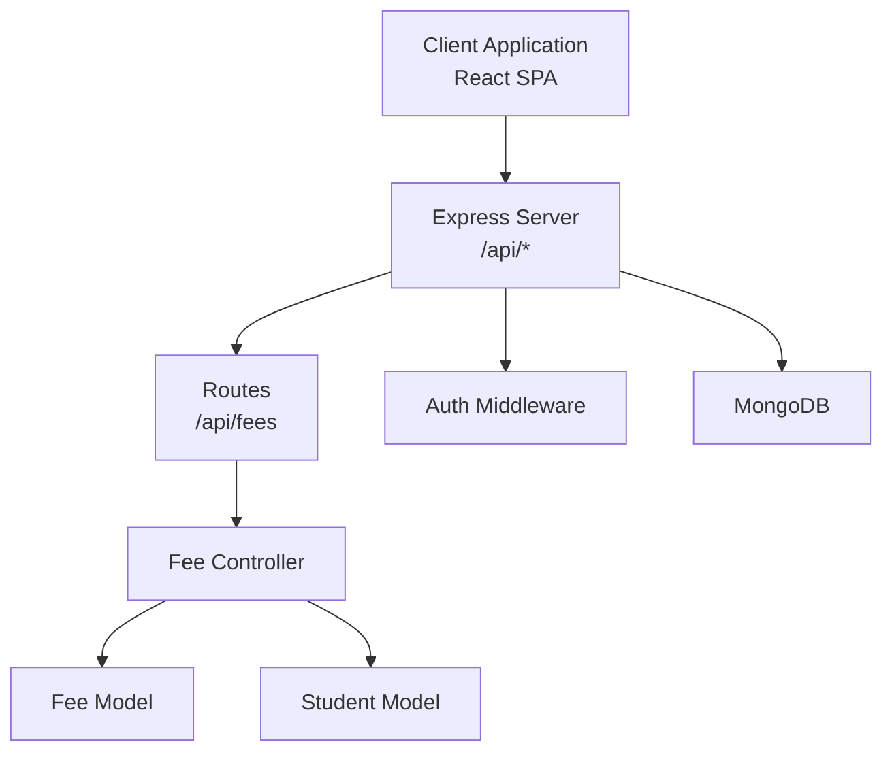
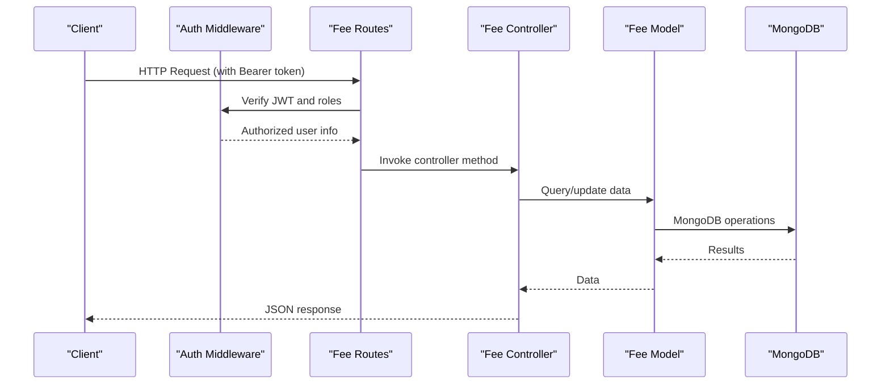
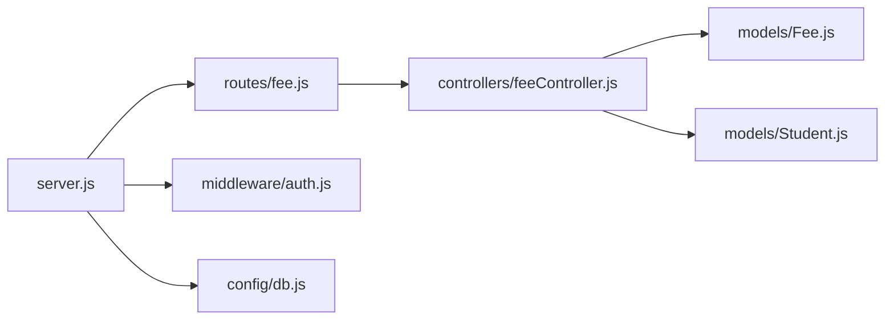

# Fee Management API

<cite>
**Referenced Files in This Document**
- [server.js](file://server/server.js)
- [fee.js](file://server/routes/fee.js)
- [feeController.js](file://server/controllers/feeController.js)
- [Fee.js](file://server/models/Fee.js)
- [auth.js](file://server/middleware/auth.js)
- [api.js](file://client/src/api.js)
- [FeesPage.jsx](file://client/src/pages/admin/FeesPage.jsx)
- [Student.js](file://server/models/Student.js)
- [Class.js](file://server/models/Class.js)
</cite>

## Table of Contents
1. [Introduction](#introduction)
2. [Project Structure](#project-structure)
3. [Core Components](#core-components)
4. [Architecture Overview](#architecture-overview)
5. [Detailed Component Analysis](#detailed-component-analysis)
6. [Dependency Analysis](#dependency-analysis)
7. [Performance Considerations](#performance-considerations)
8. [Troubleshooting Guide](#troubleshooting-guide)
9. [Conclusion](#conclusion)

## Introduction
This document provides comprehensive API documentation for the Fee Management system. It covers endpoints for creating fee structures, retrieving student fee records, updating fee details, marking payments, and generating financial reports. It also documents authentication requirements, request/response schemas, currency handling, payment validation, and financial audit trail considerations.

## Project Structure
The Fee Management API is implemented as part of a larger School Management System with separate client and server projects. The server exposes REST endpoints under `/api/fees`, while the client integrates with these endpoints to present fee management features.



**Diagram sources**
- [server.js:18-28](file://server/server.js#L18-L28)
- [fee.js:1-13](file://server/routes/fee.js#L1-L13)
- [feeController.js:1-119](file://server/controllers/feeController.js#L1-L119)
- [Fee.js:1-17](file://server/models/Fee.js#L1-L17)
- [Student.js:1-16](file://server/models/Student.js#L1-L16)

**Section sources**
- [server.js:18-28](file://server/server.js#L18-L28)
- [fee.js:1-13](file://server/routes/fee.js#L1-L13)

## Core Components
- Authentication and Authorization: JWT-based Bearer tokens are required for all protected endpoints. Admin role is required for administrative operations.
- Fee Data Model: Defines fee structure including amounts, types, statuses, due dates, and audit fields.
- Controllers: Implement business logic for creating, retrieving, updating, payment marking, and reporting.
- Client Integration: React components consume the API for fee management and reporting.

Key capabilities:
- Create fee structures for students
- Retrieve student-specific fee records
- Update fee details (amount, type, due date, status, paid amount)
- Mark fees as paid with automatic paid date and paid amount updates
- Generate financial summaries grouped by student with totals and status aggregation

**Section sources**
- [auth.js:4-28](file://server/middleware/auth.js#L4-L28)
- [Fee.js:3-14](file://server/models/Fee.js#L3-L14)
- [feeController.js:4-119](file://server/controllers/feeController.js#L4-L119)

## Architecture Overview
The Fee Management API follows a layered architecture:
- Presentation Layer: Client React components
- API Layer: Express routes and controllers
- Data Access Layer: Mongoose models
- Security Layer: JWT authentication and role-based authorization



**Diagram sources**
- [auth.js:4-28](file://server/middleware/auth.js#L4-L28)
- [fee.js:6-10](file://server/routes/fee.js#L6-L10)
- [feeController.js:4-119](file://server/controllers/feeController.js#L4-L119)
- [Fee.js:1-17](file://server/models/Fee.js#L1-L17)

## Detailed Component Analysis

### Authentication and Authorization
- Token format: Bearer token in Authorization header
- Required scopes: Admin role for administrative endpoints
- Unauthorized responses: 401 for missing/expired tokens; 403 for insufficient roles

**Section sources**
- [auth.js:4-28](file://server/middleware/auth.js#L4-L28)

### Fee Data Model
The Fee model defines the schema for fee records with the following fields:
- studentId: ObjectId referencing Student
- amount: Number (required)
- feeType: Enum [tuition, transport, exam, library, other]
- status: Enum [paid, unpaid, partial] with default unpaid
- paidAmount: Number default 0
- dueDate: Date (required)
- paidDate: Date
- month: String (required, e.g., "YYYY-MM")
- academicYear: String default "YYYY-YYYY"
- receiptNumber: String default empty
- timestamps: createdAt, updatedAt

```mermaid
erDiagram
FEE {
number amount
string feeType
string status
number paidAmount
date dueDate
date paidDate
string month
string academicYear
string receiptNumber
}
STUDENT {
string rollNumber
date admissionDate
date dateOfBirth
string gender
string bloodGroup
string emergencyContact
}
CLASS {
string name
string section
string academicYear
}
FEE }o--|| STUDENT : "belongs to"
STUDENT }o--|| CLASS : "enrolled in"
```

**Diagram sources**
- [Fee.js:3-14](file://server/models/Fee.js#L3-L14)
- [Student.js:3-13](file://server/models/Student.js#L3-L13)
- [Class.js:3-8](file://server/models/Class.js#L3-L8)

**Section sources**
- [Fee.js:3-14](file://server/models/Fee.js#L3-L14)
- [Student.js:3-13](file://server/models/Student.js#L3-L13)
- [Class.js:3-8](file://server/models/Class.js#L3-L8)

### API Endpoints

#### Create Fee Structure
- Method: POST
- URL: /api/fees
- Authentication: Bearer token required; Admin role required
- Request body: Fee document excluding ID and timestamps
- Response: Created fee document
- Notes: Creates a new fee record for a student

Example request body:
{
  "studentId": "ObjectId",
  "amount": 5000,
  "feeType": "tuition",
  "dueDate": "2024-06-30",
  "month": "2024-06",
  "academicYear": "2024-2025"
}

Example response:
{
  "id": "ObjectId",
  "studentId": "ObjectId",
  "amount": 5000,
  "feeType": "tuition",
  "status": "unpaid",
  "dueDate": "2024-06-30T00:00:00.000Z",
  "month": "2024-06",
  "academicYear": "2024-2025",
  "createdAt": "2024-06-01T00:00:00.000Z",
  "updatedAt": "2024-06-01T00:00:00.000Z"
}

**Section sources**
- [fee.js:6](file://server/routes/fee.js#L6)
- [feeController.js:4-11](file://server/controllers/feeController.js#L4-L11)
- [Fee.js:3-14](file://server/models/Fee.js#L3-L14)

#### Get Student Fees
- Method: GET
- URL: /api/fees/student/:studentId
- Authentication: Bearer token required
- Query parameters: None
- Response: Array of fee documents sorted by dueDate descending
- Notes: Retrieves all fee records for a given student

Example response:
[
  {
    "id": "ObjectId",
    "studentId": "studentId",
    "amount": 5000,
    "feeType": "tuition",
    "status": "unpaid",
    "dueDate": "2024-06-30T00:00:00.000Z",
    "month": "2024-06",
    "paidAmount": 0
  }
]

**Section sources**
- [fee.js:7](file://server/routes/fee.js#L7)
- [feeController.js:13-20](file://server/controllers/feeController.js#L13-L20)

#### Update Fee
- Method: PUT
- URL: /api/fees/:id
- Authentication: Bearer token required; Admin role required
- Path parameters: id (fee record ID)
- Request body: Partial fee document (amount, feeType, dueDate, month, status, paidAmount)
- Response: Updated fee document
- Notes: Updates existing fee record; returns 404 if not found

Example request body:
{
  "amount": 5500,
  "feeType": "tuition",
  "dueDate": "2024-06-30",
  "month": "2024-06",
  "status": "partial",
  "paidAmount": 2000
}

**Section sources**
- [fee.js:8](file://server/routes/fee.js#L8)
- [feeController.js:22-30](file://server/controllers/feeController.js#L22-L30)

#### Mark Fee Paid
- Method: PUT
- URL: /api/fees/:id/pay
- Authentication: Bearer token required; Admin role required
- Path parameters: id (fee record ID)
- Request body: Optional paidAmount; if omitted, defaults to amount
- Response: Updated fee document with status "paid", paidDate set to current time, paidAmount set
- Notes: Returns 404 if fee not found

Example request body:
{
  "paidAmount": 5000
}

Example response:
{
  "id": "ObjectId",
  "studentId": "studentId",
  "amount": 5000,
  "feeType": "tuition",
  "status": "paid",
  "paidAmount": 5000,
  "paidDate": "2024-06-15T10:30:00.000Z",
  "dueDate": "2024-06-30T00:00:00.000Z",
  "month": "2024-06"
}

**Section sources**
- [fee.js:9](file://server/routes/fee.js#L9)
- [feeController.js:32-40](file://server/controllers/feeController.js#L32-L40)

#### Get Fee Report
- Method: GET
- URL: /api/fees/report
- Authentication: Bearer token required; Admin role required
- Query parameters:
  - classId: Filter by class ID
  - status: Filter by fee status (paid, unpaid, partial)
  - month: Filter by month (YYYY-MM)
- Response: Object containing:
  - studentSummaries: Array of student-level summaries
  - summary: Aggregated totals (totalCollected, totalPending, totalStudents)
- Notes: Builds student-centric report with fee aggregations and status determination

Student summary structure:
{
  studentId: ObjectId,
  studentName: string,
  className: string,
  parentName: string,
  parentPhone: string,
  totalFee: number,
  totalPaid: number,
  totalPending: number,
  status: "paid" | "partial" | "unpaid",
  fees: Fee[]
}

Report summary structure:
{
  totalCollected: number,
  totalPending: number,
  totalStudents: number
}

**Section sources**
- [fee.js:10](file://server/routes/fee.js#L10)
- [feeController.js:42-119](file://server/controllers/feeController.js#L42-L119)

### Client Integration
The client integrates with the Fee Management API through:
- Axios instance with base URL "/api" and Bearer token injection
- FeesPage component consuming report endpoint and supporting actions
- Automatic token removal on 401 responses

Key client behaviors:
- Fetches report with optional filters (classId, status, month)
- Supports editing fee records via PUT /fees/:id
- Marks fees as paid via PUT /fees/:id/pay
- Displays currency using Indian Rupee formatting

**Section sources**
- [api.js:3-28](file://client/src/api.js#L3-L28)
- [FeesPage.jsx:16-23](file://client/src/pages/admin/FeesPage.jsx#L16-L23)
- [FeesPage.jsx:27-41](file://client/src/pages/admin/FeesPage.jsx#L27-L41)

## Dependency Analysis
The Fee Management API has the following dependencies:
- Express server with CORS and JSON middleware
- Mongoose models for Fee and Student
- JWT-based authentication middleware
- MongoDB database connection



**Diagram sources**
- [server.js:18-28](file://server/server.js#L18-L28)
- [fee.js:1-13](file://server/routes/fee.js#L1-L13)
- [feeController.js:1-119](file://server/controllers/feeController.js#L1-L119)
- [Fee.js:1-17](file://server/models/Fee.js#L1-L17)
- [Student.js:1-16](file://server/models/Student.js#L1-L16)
- [auth.js:1-31](file://server/middleware/auth.js#L1-L31)

**Section sources**
- [server.js:18-28](file://server/server.js#L18-L28)
- [fee.js:1-13](file://server/routes/fee.js#L1-L13)
- [feeController.js:1-119](file://server/controllers/feeController.js#L1-L119)

## Performance Considerations
- Query optimization: Fee report endpoint performs population and filtering; consider indexing studentId, status, and month fields for improved performance.
- Pagination: For large datasets, implement pagination in report queries.
- Currency handling: Store amounts as integers in smallest currency units (e.g., paise) to avoid floating-point precision issues.
- Batch operations: Group fee updates where possible to reduce database round trips.

## Troubleshooting Guide
Common issues and resolutions:
- 401 Unauthorized: Ensure Bearer token is present and valid in Authorization header.
- 403 Forbidden: Verify requesting user has admin role.
- 404 Not Found: Confirm fee ID exists before attempting updates or payment marking.
- Payment discrepancies: Check paidAmount against amount; ensure partial payments are recorded correctly.
- Report inconsistencies: Verify month formatting (YYYY-MM) and status values match expected enums.

Audit trail considerations:
- Track all fee modifications with timestamps
- Log payment transactions with paidDate and paidAmount
- Maintain receiptNumber for payment references
- Monitor status transitions for compliance reporting

**Section sources**
- [auth.js:10-18](file://server/middleware/auth.js#L10-L18)
- [feeController.js:24-26](file://server/controllers/feeController.js#L24-L26)
- [feeController.js:34-36](file://server/controllers/feeController.js#L34-L36)

## Conclusion
The Fee Management API provides a robust foundation for educational institution fee administration. It supports essential operations including fee creation, payment processing, reporting, and audit trail maintenance. The implementation leverages JWT authentication, structured data models, and clear separation of concerns. For production deployment, consider adding payment gateway integration, enhanced validation, and comprehensive logging for financial compliance.