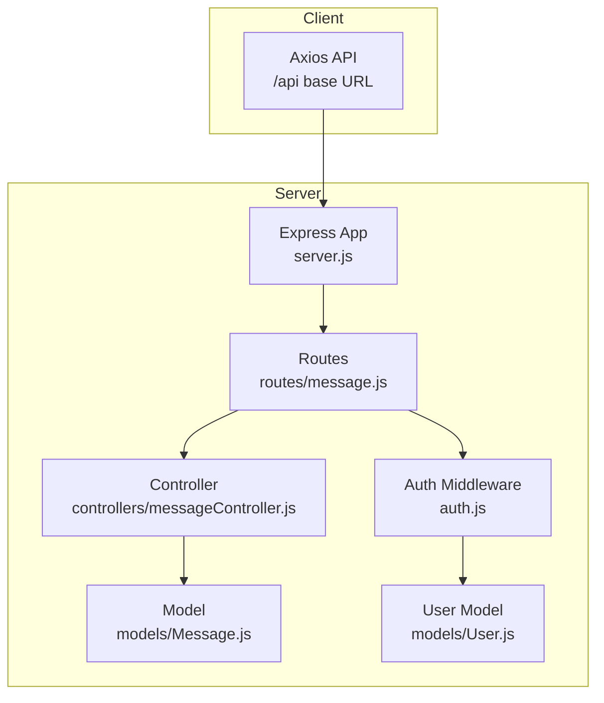
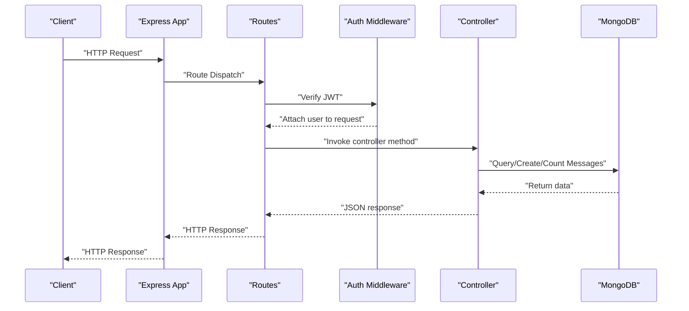
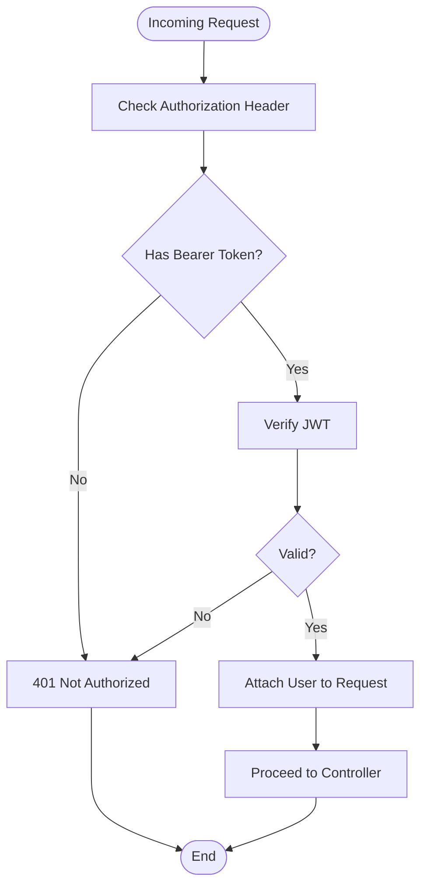
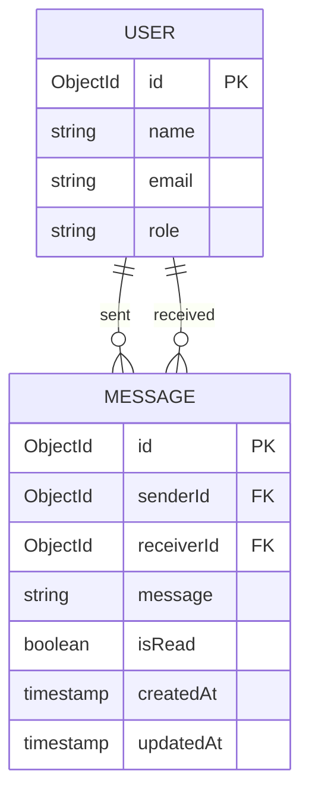
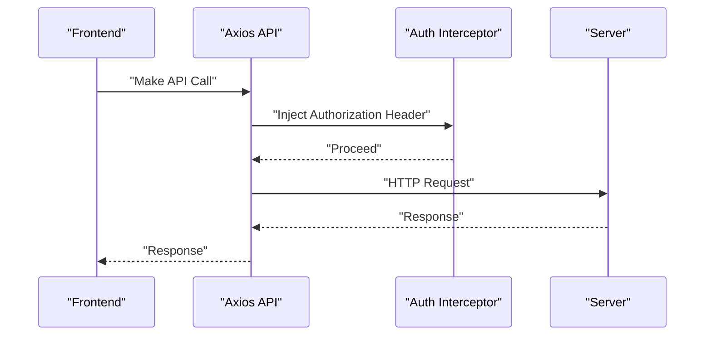
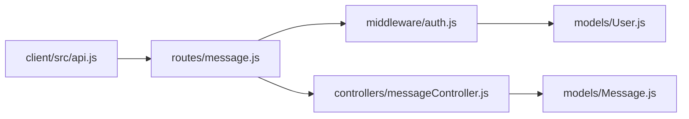

# Messaging API

<cite>
**Referenced Files in This Document**
- [server.js](file://server/server.js)
- [message.js](file://server/routes/message.js)
- [messageController.js](file://server/controllers/messageController.js)
- [Message.js](file://server/models/Message.js)
- [auth.js](file://server/middleware/auth.js)
- [User.js](file://server/models/User.js)
- [api.js](file://client/src/api.js)
</cite>

## Table of Contents
1. [Introduction](#introduction)
2. [Project Structure](#project-structure)
3. [Core Components](#core-components)
4. [Architecture Overview](#architecture-overview)
5. [Detailed Component Analysis](#detailed-component-analysis)
6. [Dependency Analysis](#dependency-analysis)
7. [Performance Considerations](#performance-considerations)
8. [Troubleshooting Guide](#troubleshooting-guide)
9. [Conclusion](#conclusion)

## Introduction
This document provides comprehensive API documentation for the Messaging API endpoints. It covers internal messaging, user communication, notification systems, and message threading. For each endpoint, you will find HTTP methods, URL patterns, request/response schemas, authentication requirements, and message routing logic. Example requests and responses are included for message sending, conversation retrieval, unread count tracking, and message status updates. Real-time messaging capabilities and message encryption are also documented.

## Project Structure
The Messaging API is implemented as part of a larger Express-based backend with a MongoDB/Mongoose data model. The frontend communicates via Axios with automatic JWT bearer token injection. Authentication is enforced using a JWT middleware.

**Diagram sources**
- [server.js:18-27](file://server/server.js#L18-L27)
- [message.js:1-11](file://server/routes/message.js#L1-L11)
- [messageController.js:1-38](file://server/controllers/messageController.js#L1-L38)
- [Message.js:1-11](file://server/models/Message.js#L1-L11)
- [auth.js:1-31](file://server/middleware/auth.js#L1-L31)
- [User.js:1-27](file://server/models/User.js#L1-L27)
- [api.js:1-28](file://client/src/api.js#L1-L28)

**Section sources**
- [server.js:18-27](file://server/server.js#L18-L27)
- [message.js:1-11](file://server/routes/message.js#L1-L11)
- [messageController.js:1-38](file://server/controllers/messageController.js#L1-L38)
- [Message.js:1-11](file://server/models/Message.js#L1-L11)
- [auth.js:1-31](file://server/middleware/auth.js#L1-L31)
- [User.js:1-27](file://server/models/User.js#L1-L27)
- [api.js:1-28](file://client/src/api.js#L1-L28)

## Core Components
- Routes: Define the HTTP endpoints for messaging.
- Controller: Implements business logic for retrieving messages, sending messages, and counting unread messages.
- Model: Defines the message schema stored in MongoDB.
- Authentication Middleware: Validates JWT tokens and attaches the user to the request.
- Frontend API: Axios instance configured with base URL and automatic Authorization header injection.

Key responsibilities:
- Enforce authentication on all messaging endpoints.
- Implement message threading by pairing sender and receiver IDs.
- Track read/unread status per message.
- Provide health check endpoint for service verification.

**Section sources**
- [message.js:6-8](file://server/routes/message.js#L6-L8)
- [messageController.js:3-18](file://server/controllers/messageController.js#L3-L18)
- [messageController.js:20-28](file://server/controllers/messageController.js#L20-L28)
- [messageController.js:30-37](file://server/controllers/messageController.js#L30-L37)
- [Message.js:3-8](file://server/models/Message.js#L3-L8)
- [auth.js:4-19](file://server/middleware/auth.js#L4-L19)
- [api.js:3-14](file://client/src/api.js#L3-L14)

## Architecture Overview
The Messaging API follows a layered architecture:
- HTTP Layer: Express routes define endpoints.
- Application Layer: Controllers handle request/response and orchestrate data access.
- Data Access Layer: Mongoose model persists messages.
- Security Layer: JWT middleware validates tokens and sets user context.

**Diagram sources**
- [server.js:18-27](file://server/server.js#L18-L27)
- [message.js:6-8](file://server/routes/message.js#L6-L8)
- [auth.js:4-19](file://server/middleware/auth.js#L4-L19)
- [messageController.js:3-18](file://server/controllers/messageController.js#L3-L18)
- [messageController.js:20-28](file://server/controllers/messageController.js#L20-L28)
- [messageController.js:30-37](file://server/controllers/messageController.js#L30-L37)

## Detailed Component Analysis

### Endpoint Catalog

- Base URL: `/api/messages`
- Authentication: Required (Bearer token in Authorization header)
- Content Type: application/json

#### GET /messages/:receiverId
- Purpose: Retrieve the conversation thread between the authenticated user and the specified receiver.
- Authentication: Required
- Path Parameters:
  - receiverId: ObjectId of the other participant
- Query Parameters: None
- Request Body: None
- Responses:
  - 200 OK: Array of message objects sorted chronologically
  - 500 Internal Server Error: Error object
- Behavior:
  - Returns messages where either the authenticated user sent to the receiver OR the receiver sent to the authenticated user.
  - Marks unread messages from the receiver as read for the authenticated user.
- Example Request:
  - GET /api/messages/64f1a2b3c5d6e7f8a9b0c1d2
- Example Response:
  - 200 [{"_id":"...","senderId":"...","receiverId":"...","message":"Hello","isRead":true,"createdAt":"2023-09-01T10:00:00Z","updatedAt":"2023-09-01T10:00:00Z"}]

**Section sources**
- [message.js:6](file://server/routes/message.js#L6)
- [messageController.js:3-18](file://server/controllers/messageController.js#L3-L18)

#### POST /messages
- Purpose: Send a new message from the authenticated user to a receiver.
- Authentication: Required
- Path Parameters: None
- Query Parameters: None
- Request Body:
  - receiverId: ObjectId of the recipient
  - message: String content
- Responses:
  - 201 Created: The created message object
  - 500 Internal Server Error: Error object
- Behavior:
  - Creates a new message with senderId set to the authenticated user and isRead defaulting to false.
- Example Request:
  - POST /api/messages
  - Body: {"receiverId":"64f1a2b3c5d6e7f8a9b0c1d3","message":"Hi there!"}
- Example Response:
  - 201 {"_id":"...","senderId":"...","receiverId":"...","message":"Hi there!","isRead":false,"createdAt":"2023-09-01T10:05:00Z","updatedAt":"2023-09-01T10:05:00Z"}

**Section sources**
- [message.js:7](file://server/routes/message.js#L7)
- [messageController.js:20-28](file://server/controllers/messageController.js#L20-L28)

#### GET /messages/unread/count
- Purpose: Get the total number of unread messages for the authenticated user.
- Authentication: Required
- Path Parameters: None
- Query Parameters: None
- Request Body: None
- Responses:
  - 200 OK: Object containing unreadCount
  - 500 Internal Server Error: Error object
- Behavior:
  - Counts documents where receiverId equals the authenticated user and isRead is false.
- Example Request:
  - GET /api/messages/unread/count
- Example Response:
  - 200 {"unreadCount":3}

**Section sources**
- [message.js:8](file://server/routes/message.js#L8)
- [messageController.js:30-37](file://server/controllers/messageController.js#L30-L37)

### Authentication and Authorization
- Authentication:
  - Middleware extracts the Bearer token from the Authorization header.
  - Verifies the token using the configured JWT secret and attaches the user object (without password) to the request.
  - Returns 401 if no token or invalid token.
- Authorization:
  - The messaging routes apply the auth middleware to all endpoints.
  - No role-specific authorization is enforced in the messaging routes.

**Diagram sources**
- [auth.js:4-19](file://server/middleware/auth.js#L4-L19)

**Section sources**
- [auth.js:4-19](file://server/middleware/auth.js#L4-L19)

### Data Model: Message
The Message collection stores conversations with the following fields:
- senderId: ObjectId referencing User
- receiverId: ObjectId referencing User
- message: String content
- isRead: Boolean flag indicating read status
- createdAt: Timestamp
- updatedAt: Timestamp

**Diagram sources**
- [Message.js:3-8](file://server/models/Message.js#L3-L8)
- [User.js:4-13](file://server/models/User.js#L4-L13)

**Section sources**
- [Message.js:3-8](file://server/models/Message.js#L3-L8)
- [User.js:4-13](file://server/models/User.js#L4-L13)

### Frontend Integration
The client uses an Axios instance configured with:
- Base URL: /api
- Automatic Authorization header injection from localStorage
- Global interceptor handles 401 responses by redirecting to login

**Diagram sources**
- [api.js:3-14](file://client/src/api.js#L3-L14)

**Section sources**
- [api.js:3-14](file://client/src/api.js#L3-L14)

### Real-Time Messaging Capabilities
- Current Implementation: The backend does not implement WebSocket-based real-time messaging. Requests are standard HTTP calls.
- Recommendation: To add real-time capabilities, integrate a WebSocket library (e.g., Socket.IO) on both server and client to emit and listen for message events.

[No sources needed since this section provides general guidance]

### Message Encryption
- Current Implementation: There is no message encryption implemented in the backend or frontend.
- Recommendation: For sensitive communications, consider:
  - Client-side encryption before sending (e.g., encrypting the message field).
  - Transport encryption via HTTPS (already enforced by HTTPS deployment).
  - Server-side decryption and storage of encrypted content if required.

[No sources needed since this section provides general guidance]

## Dependency Analysis
The messaging endpoints depend on the following components:
- Routes depend on the auth middleware.
- Controllers depend on the Message model.
- Auth middleware depends on JWT verification and the User model.
- Frontend depends on the Axios API instance.

**Diagram sources**
- [message.js:1-11](file://server/routes/message.js#L1-L11)
- [auth.js:1-31](file://server/middleware/auth.js#L1-L31)
- [messageController.js:1-38](file://server/controllers/messageController.js#L1-L38)
- [Message.js:1-11](file://server/models/Message.js#L1-L11)
- [User.js:1-27](file://server/models/User.js#L1-L27)
- [api.js:1-28](file://client/src/api.js#L1-L28)

**Section sources**
- [message.js:1-11](file://server/routes/message.js#L1-L11)
- [auth.js:1-31](file://server/middleware/auth.js#L1-L31)
- [messageController.js:1-38](file://server/controllers/messageController.js#L1-L38)
- [Message.js:1-11](file://server/models/Message.js#L1-L11)
- [User.js:1-27](file://server/models/User.js#L1-L27)
- [api.js:1-28](file://client/src/api.js#L1-L28)

## Performance Considerations
- Indexing:
  - Add compound indexes on (senderId, receiverId) and (receiverId, isRead) to optimize conversation retrieval and unread count queries.
- Pagination:
  - For large conversations, implement pagination to limit returned messages per request.
- Read Status Updates:
  - Batch update read status for performance when marking messages as read.
- Caching:
  - Cache recent unread counts per user to reduce database load.

[No sources needed since this section provides general guidance]

## Troubleshooting Guide
Common issues and resolutions:
- 401 Not Authorized:
  - Cause: Missing or invalid Bearer token.
  - Resolution: Ensure the Authorization header is present and the token is valid.
- 403 Role Not Authorized:
  - Cause: Authorization middleware checks roles but messaging routes do not enforce roles.
  - Resolution: Confirm the route does not require role-based authorization.
- 500 Internal Server Error:
  - Cause: Database errors during message retrieval, creation, or counting.
  - Resolution: Check server logs and database connectivity.

**Section sources**
- [auth.js:10-18](file://server/middleware/auth.js#L10-L18)
- [messageController.js:15](file://server/controllers/messageController.js#L15)
- [messageController.js:26](file://server/controllers/messageController.js#L26)
- [messageController.js:35](file://server/controllers/messageController.js#L35)

## Conclusion
The Messaging API provides essential endpoints for internal messaging, conversation retrieval, and unread notifications. It enforces authentication via JWT and maintains message read status. While the current implementation is stateless and HTTP-based, it can be extended with real-time capabilities and encryption to meet advanced requirements.