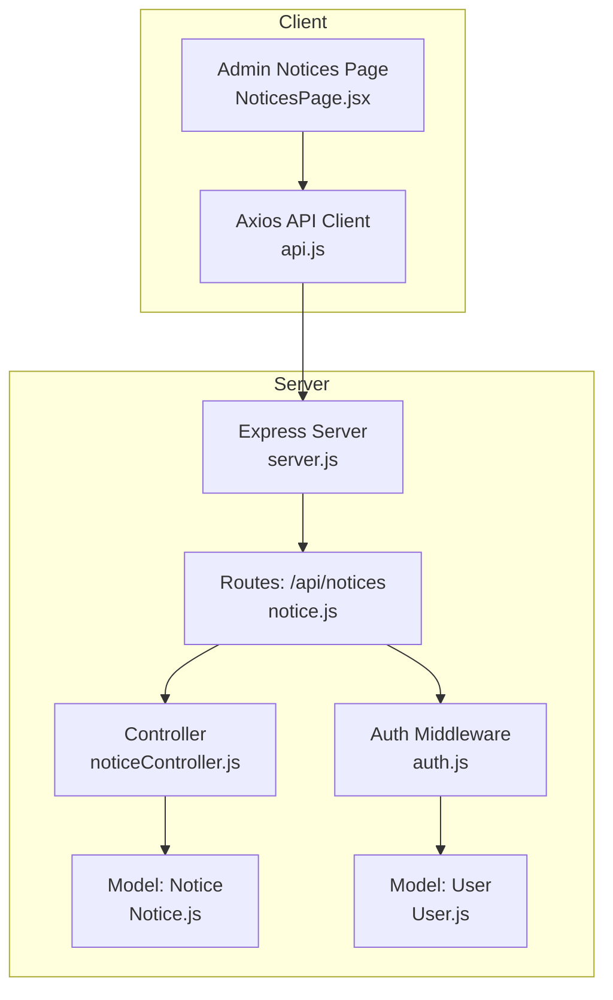
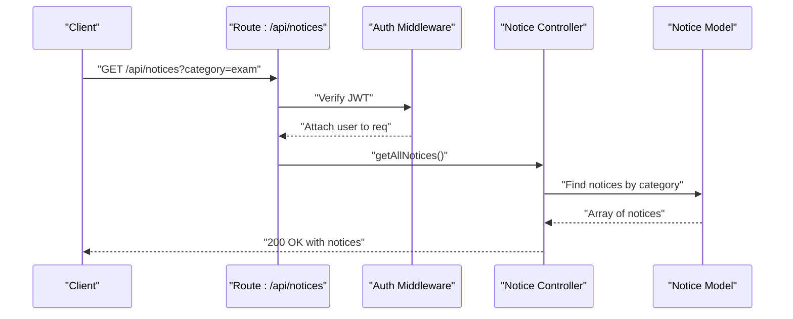
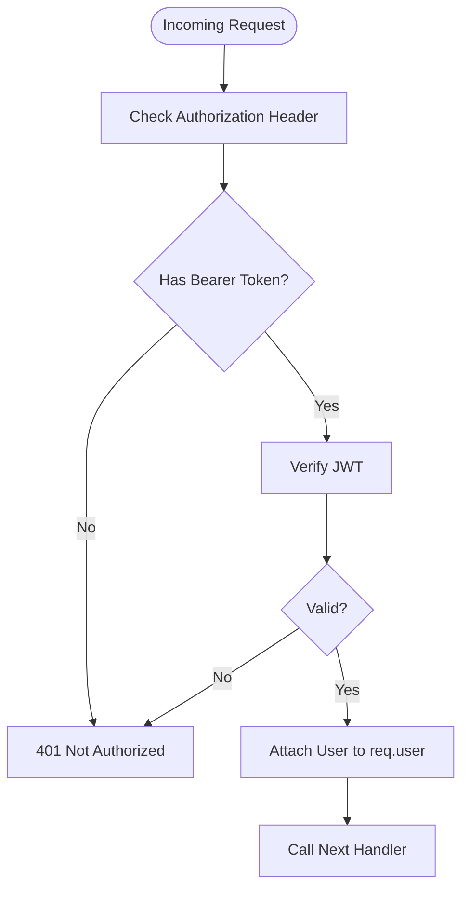
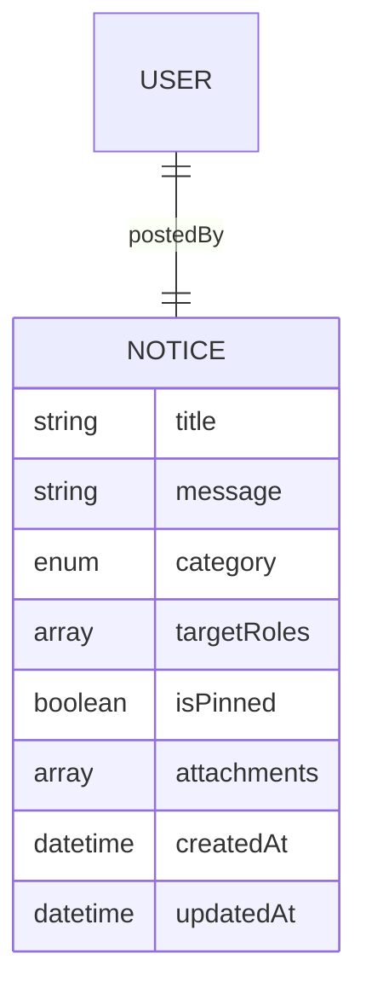
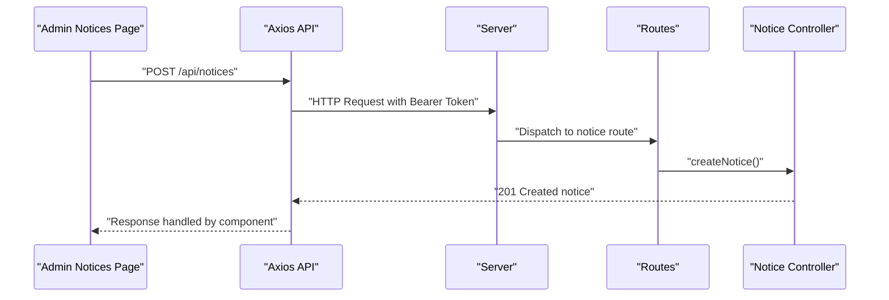
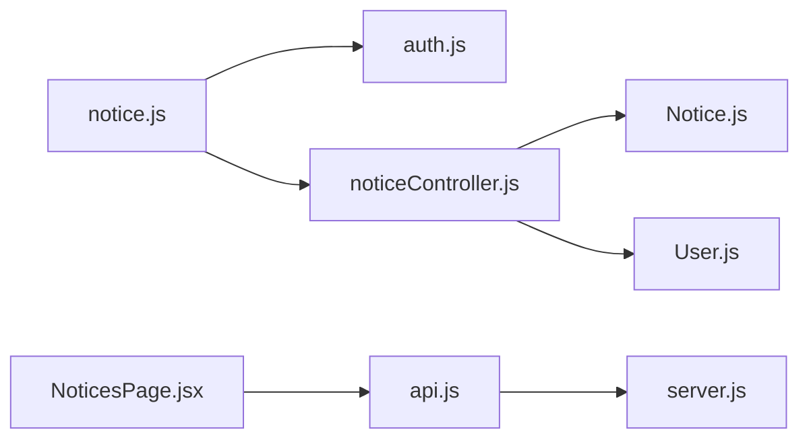

# Notice Board API

<cite>
**Referenced Files in This Document**
- [server.js](file://server/server.js)
- [notice.js](file://server/routes/notice.js)
- [noticeController.js](file://server/controllers/noticeController.js)
- [Notice.js](file://server/models/Notice.js)
- [auth.js](file://server/middleware/auth.js)
- [User.js](file://server/models/User.js)
- [api.js](file://client/src/api.js)
- [NoticesPage.jsx](file://client/src/pages/admin/NoticesPage.jsx)
</cite>

## Table of Contents
1. [Introduction](#introduction)
2. [Project Structure](#project-structure)
3. [Core Components](#core-components)
4. [Architecture Overview](#architecture-overview)
5. [Detailed Component Analysis](#detailed-component-analysis)
6. [Dependency Analysis](#dependency-analysis)
7. [Performance Considerations](#performance-considerations)
8. [Troubleshooting Guide](#troubleshooting-guide)
9. [Conclusion](#conclusion)

## Introduction
This document provides comprehensive API documentation for the Notice Board system. It covers endpoints for creating, retrieving, updating, and deleting notices, including filtering by category, pinning functionality, and audience targeting via roles. Authentication is mandatory for all notice endpoints. The document also outlines request/response schemas, authentication requirements, and practical examples for common workflows such as publishing notices, filtering by category, managing priorities, and tracking read status.

## Project Structure
The Notice Board API is part of a larger School Management System backend built with Express.js and MongoDB/Mongoose. The API surface for notices is exposed under `/api/notices` and is protected by an authentication middleware. The client-side React application communicates with the backend using a shared Axios instance that injects Authorization headers automatically.

**Diagram sources**
- [server.js:18-25](file://server/server.js#L18-L25)
- [notice.js:1-12](file://server/routes/notice.js#L1-L12)
- [noticeController.js:1-43](file://server/controllers/noticeController.js#L1-L43)
- [Notice.js:1-14](file://server/models/Notice.js#L1-L14)
- [auth.js:1-31](file://server/middleware/auth.js#L1-L31)
- [User.js:1-27](file://server/models/User.js#L1-L27)
- [api.js:1-28](file://client/src/api.js#L1-L28)
- [NoticesPage.jsx:1-86](file://client/src/pages/admin/NoticesPage.jsx#L1-L86)

**Section sources**
- [server.js:18-25](file://server/server.js#L18-L25)
- [notice.js:1-12](file://server/routes/notice.js#L1-L12)
- [noticeController.js:1-43](file://server/controllers/noticeController.js#L1-L43)
- [Notice.js:1-14](file://server/models/Notice.js#L1-L14)
- [auth.js:1-31](file://server/middleware/auth.js#L1-L31)
- [User.js:1-27](file://server/models/User.js#L1-L27)
- [api.js:1-28](file://client/src/api.js#L1-L28)
- [NoticesPage.jsx:1-86](file://client/src/pages/admin/NoticesPage.jsx#L1-L86)

## Core Components
- Authentication Middleware: Validates JWT tokens from the Authorization header and attaches the user object to the request.
- Notice Model: Defines the schema for notices including title, message, category, target roles, pinned state, attachments, and timestamps.
- Notice Controller: Implements handlers for listing notices (with optional category filter), creating notices, updating notices, and deleting notices.
- Routes: Exposes GET /, POST /, PUT /:id, DELETE /:id under /api/notices with authentication applied.

Key capabilities:
- Category filtering via query parameter.
- Audience targeting via targetRoles array.
- Priority management via isPinned flag.
- Read status tracking is not implemented in the current codebase; future enhancements could include per-user read receipts.

**Section sources**
- [auth.js:4-19](file://server/middleware/auth.js#L4-L19)
- [Notice.js:3-11](file://server/models/Notice.js#L3-L11)
- [noticeController.js:3-42](file://server/controllers/noticeController.js#L3-L42)
- [notice.js:6-9](file://server/routes/notice.js#L6-L9)

## Architecture Overview
The Notice Board API follows a layered architecture:
- HTTP Layer: Express routes define the endpoints.
- Authentication Layer: JWT verification ensures only authenticated users can access notice endpoints.
- Controller Layer: Handles business logic for notice CRUD operations.
- Data Access Layer: Mongoose model persists and retrieves notices.
- Client Layer: React UI interacts with the API through a shared Axios client configured with automatic Authorization headers.

**Diagram sources**
- [notice.js:6](file://server/routes/notice.js#L6)
- [auth.js:4-19](file://server/middleware/auth.js#L4-L19)
- [noticeController.js:3-13](file://server/controllers/noticeController.js#L3-L13)
- [Notice.js:3-11](file://server/models/Notice.js#L3-L11)

## Detailed Component Analysis

### Authentication and Authorization
- Purpose: Ensures all notice endpoints are protected by a valid JWT.
- Mechanism: Extracts Bearer token from Authorization header, verifies it, and attaches the user object to the request.
- Role-based access: Separate authorize helper supports restricting routes by role; currently, notice endpoints use the generic auth middleware.

**Diagram sources**
- [auth.js:4-19](file://server/middleware/auth.js#L4-L19)

**Section sources**
- [auth.js:4-19](file://server/middleware/auth.js#L4-L19)
- [auth.js:21-28](file://server/middleware/auth.js#L21-L28)

### Notice Model Schema
The Notice model defines the structure persisted in MongoDB:
- title: Required string.
- message: Required string.
- category: Enum with values general, exam, holiday, event, urgent; defaults to general.
- targetRoles: Array of role strings (admin, teacher, student, parent).
- postedBy: Reference to User who created the notice.
- isPinned: Boolean indicating priority display.
- attachments: Array of URLs or identifiers for files.
- timestamps: createdAt and updatedAt are automatically managed.

**Diagram sources**
- [Notice.js:3-11](file://server/models/Notice.js#L3-L11)
- [User.js:4-13](file://server/models/User.js#L4-L13)

**Section sources**
- [Notice.js:3-11](file://server/models/Notice.js#L3-L11)
- [User.js:4-13](file://server/models/User.js#L4-L13)

### API Endpoints

#### Base Path
- Base URL: `/api/notices`

#### Authentication
- All endpoints require a valid Bearer token in the Authorization header.

#### Endpoint Catalog

- Method: GET
- Path: `/api/notices`
- Description: Retrieve notices with optional category filter.
- Query Parameters:
  - category: String (optional). One of general, exam, holiday, event, urgent.
- Response: Array of notice objects.
- Example Request:
  - GET /api/notices?category=exam
- Example Response:
  - 200 OK with an array of notices matching the category filter.

- Method: POST
- Path: `/api/notices`
- Description: Create a new notice.
- Request Body: Notice payload excluding postedBy (automatically set from authenticated user).
- Response: Created notice object.
- Example Request:
  - POST /api/notices with JSON body containing title, message, category, targetRoles, isPinned, attachments.
- Example Response:
  - 201 Created with the newly created notice.

- Method: PUT
- Path: `/api/notices/:id`
- Description: Update an existing notice by ID.
- Path Parameters:
  - id: String (MongoDB ObjectId).
- Request Body: Partial notice fields to update.
- Response: Updated notice object.
- Example Request:
  - PUT /api/notices/{id} with fields like title, message, category, targetRoles, isPinned.
- Example Response:
  - 200 OK with the updated notice.

- Method: DELETE
- Path: `/api/notices/:id`
- Description: Delete a notice by ID.
- Path Parameters:
  - id: String (MongoDB ObjectId).
- Response: Deletion confirmation message.
- Example Request:
  - DELETE /api/notices/{id}
- Example Response:
  - 200 OK with a success message.

Notes:
- Category filtering is supported on GET /api/notices via the category query parameter.
- Priority management is supported via the isPinned field.
- Audience targeting is controlled via the targetRoles array.

**Section sources**
- [notice.js:6-9](file://server/routes/notice.js#L6-L9)
- [noticeController.js:3-42](file://server/controllers/noticeController.js#L3-L42)
- [Notice.js:3-11](file://server/models/Notice.js#L3-L11)

### Client-Side Integration
- The client uses a shared Axios instance that:
  - Sets base URL to /api.
  - Injects Authorization: Bearer token from localStorage.
  - Redirects to login on 401 responses.
- The Admin Notices page demonstrates:
  - Fetching notices from GET /api/notices.
  - Creating notices via POST /api/notices.
  - Updating notices via PUT /api/notices/:id.
  - Deleting notices via DELETE /api/notices/:id.
  - Form controls for category selection and pinning.

**Diagram sources**
- [api.js:8-14](file://client/src/api.js#L8-L14)
- [NoticesPage.jsx:13-20](file://client/src/pages/admin/NoticesPage.jsx#L13-L20)
- [notice.js:7](file://server/routes/notice.js#L7)
- [noticeController.js:15-22](file://server/controllers/noticeController.js#L15-L22)

**Section sources**
- [api.js:1-28](file://client/src/api.js#L1-L28)
- [NoticesPage.jsx:13-20](file://client/src/pages/admin/NoticesPage.jsx#L13-L20)

### Request/Response Schemas

- Notice Object (common fields):
  - title: string
  - message: string
  - category: enum general | exam | holiday | event | urgent
  - targetRoles: array of strings from ["admin","teacher","student","parent"]
  - postedBy: object with name and role
  - isPinned: boolean
  - attachments: array of strings
  - createdAt: ISO date string
  - updatedAt: ISO date string

- GET /api/notices
  - Query: category (optional)
  - Response: Array of notice objects

- POST /api/notices
  - Body: title, message, category, targetRoles, isPinned, attachments
  - Response: Single notice object

- PUT /api/notices/:id
  - Path: id (ObjectId)
  - Body: Partial notice fields
  - Response: Single notice object

- DELETE /api/notices/:id
  - Path: id (ObjectId)
  - Response: Success message

**Section sources**
- [Notice.js:3-11](file://server/models/Notice.js#L3-L11)
- [noticeController.js:3-42](file://server/controllers/noticeController.js#L3-L42)

### Examples

- Publishing a Notice
  - Endpoint: POST /api/notices
  - Request Body:
    - title: string
    - message: string
    - category: one of general, exam, holiday, event, urgent
    - targetRoles: array of roles
    - isPinned: boolean
    - attachments: array of strings
  - Response: 201 Created with the created notice object.

- Filtering by Category
  - Endpoint: GET /api/notices?category=exam
  - Response: 200 OK with notices matching the category.

- Managing Priority (Pinning)
  - Endpoint: PUT /api/notices/:id
  - Request Body: isPinned: true
  - Response: 200 OK with the updated notice.

- Read Status Tracking
  - Current Implementation: Not supported.
  - Recommended Enhancement: Add a readBy array on the Notice model to track which users have viewed the notice.

**Section sources**
- [noticeController.js:15-22](file://server/controllers/noticeController.js#L15-L22)
- [noticeController.js:3-13](file://server/controllers/noticeController.js#L3-L13)
- [noticeController.js:24-32](file://server/controllers/noticeController.js#L24-L32)

### Notification Delivery and User Preferences
- Current Implementation: No explicit notification delivery mechanism is present in the codebase.
- Recommended Enhancement:
  - Introduce a notification service triggered upon notice creation.
  - Deliver notifications via push/email/sms based on user preferences stored in the User model (e.g., a preferences object with channels and opt-in flags).
  - Ensure delivery respects targetRoles to avoid sending irrelevant notices.

[No sources needed since this section provides general guidance]

## Dependency Analysis
The notice module depends on the authentication middleware and the Notice model. The controller coordinates between routes and the model. The client integrates with the API through a shared Axios instance.

**Diagram sources**
- [notice.js:1-12](file://server/routes/notice.js#L1-L12)
- [auth.js:1-31](file://server/middleware/auth.js#L1-L31)
- [noticeController.js:1-43](file://server/controllers/noticeController.js#L1-L43)
- [Notice.js:1-14](file://server/models/Notice.js#L1-L14)
- [User.js:1-27](file://server/models/User.js#L1-L27)
- [api.js:1-28](file://client/src/api.js#L1-L28)
- [server.js:18-25](file://server/server.js#L18-L25)
- [NoticesPage.jsx:1-86](file://client/src/pages/admin/NoticesPage.jsx#L1-L86)

**Section sources**
- [notice.js:1-12](file://server/routes/notice.js#L1-L12)
- [noticeController.js:1-43](file://server/controllers/noticeController.js#L1-L43)
- [Notice.js:1-14](file://server/models/Notice.js#L1-L14)
- [auth.js:1-31](file://server/middleware/auth.js#L1-L31)
- [User.js:1-27](file://server/models/User.js#L1-L27)
- [api.js:1-28](file://client/src/api.js#L1-L28)
- [server.js:18-25](file://server/server.js#L18-L25)
- [NoticesPage.jsx:1-86](file://client/src/pages/admin/NoticesPage.jsx#L1-L86)

## Performance Considerations
- Indexing: Consider adding database indexes on category and targetRoles for efficient filtering and broadcasting.
- Pagination: For large datasets, implement pagination on GET /api/notices using page and limit query parameters.
- Sorting: The current sort order prioritizes pinned notices first, followed by recency; maintain this pattern for optimal UX.

[No sources needed since this section provides general guidance]

## Troubleshooting Guide
- 401 Not Authorized:
  - Cause: Missing or invalid Authorization header.
  - Resolution: Ensure a valid Bearer token is included in the Authorization header.
- 403 Forbidden:
  - Cause: Insufficient permissions (if role-based restrictions are introduced).
  - Resolution: Verify the user's role matches expected values.
- 404 Not Found:
  - Cause: Attempting to update or delete a notice that does not exist.
  - Resolution: Confirm the notice ID is correct.
- 500 Internal Server Error:
  - Cause: Unexpected server errors during processing.
  - Resolution: Check server logs for stack traces and model validation failures.

**Section sources**
- [auth.js:10-18](file://server/middleware/auth.js#L10-L18)
- [noticeController.js:24-32](file://server/controllers/noticeController.js#L24-L32)
- [noticeController.js:34-42](file://server/controllers/noticeController.js#L34-L42)

## Conclusion
The Notice Board API provides a solid foundation for managing notices with category filtering, role-based targeting, and priority pinning. Authentication is enforced across all endpoints. Future enhancements should focus on read status tracking and a notification delivery system aligned with user preferences to improve reach and engagement.