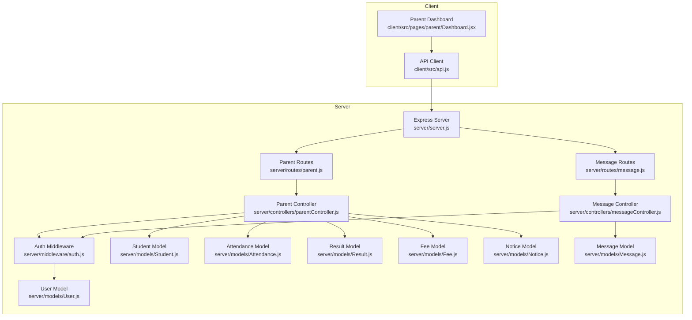
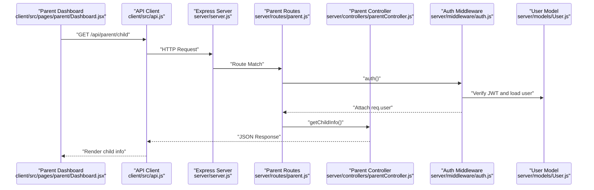
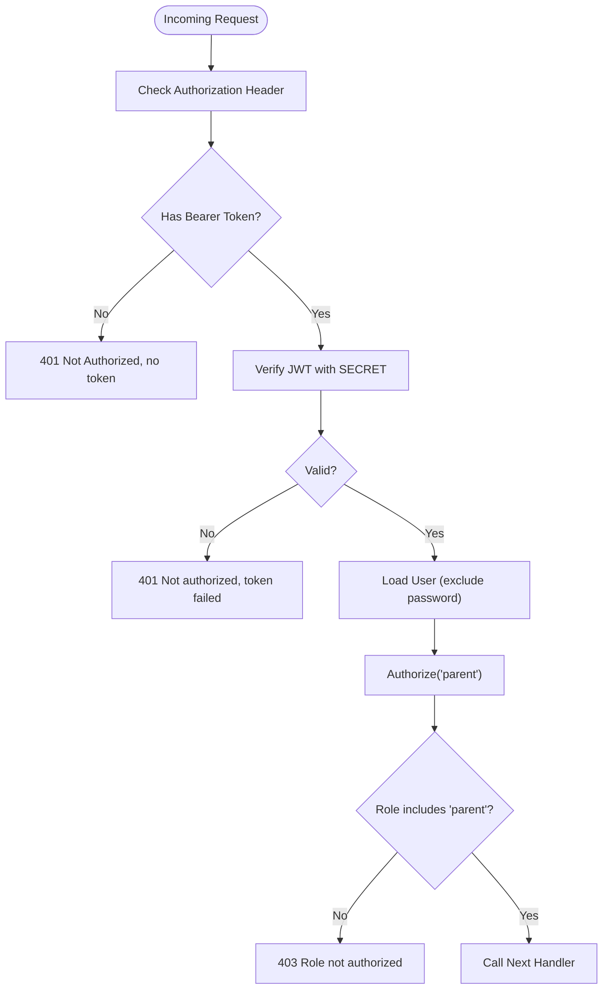
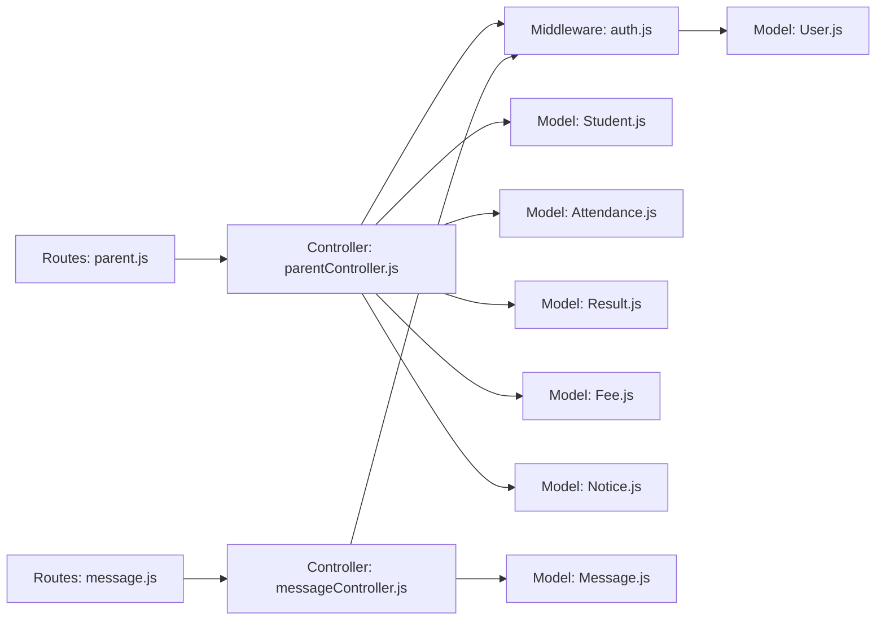
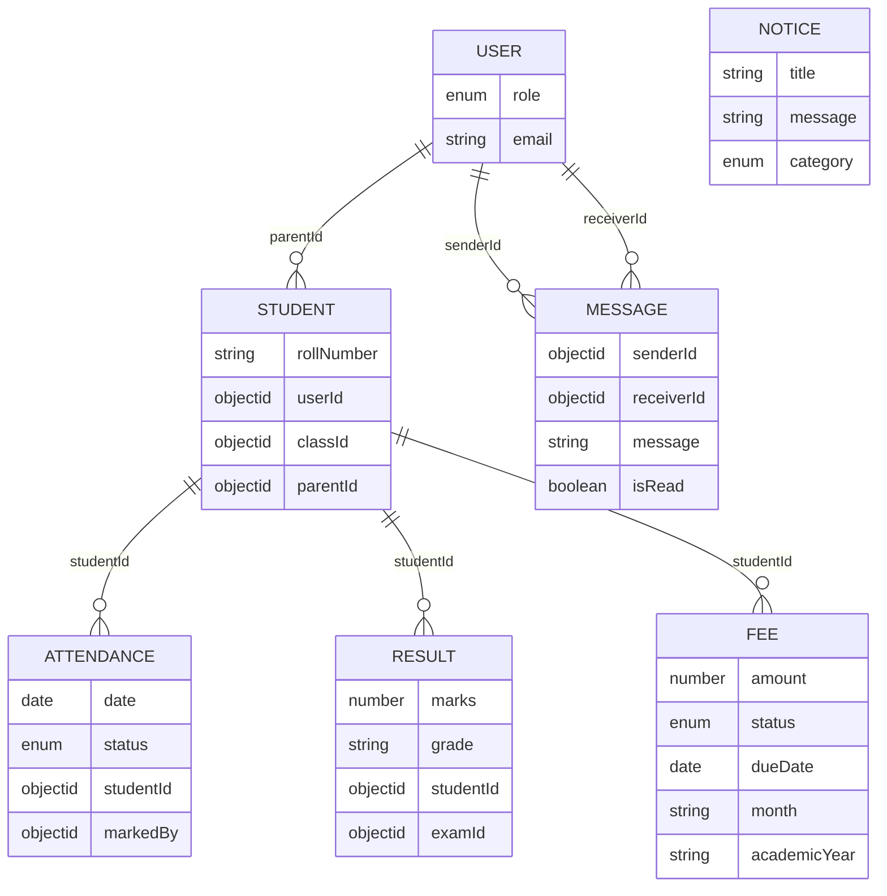

# Parent API

<cite>
**Referenced Files in This Document**
- [server.js](file://server/server.js)
- [parent.js](file://server/routes/parent.js)
- [parentController.js](file://server/controllers/parentController.js)
- [auth.js](file://server/middleware/auth.js)
- [User.js](file://server/models/User.js)
- [Student.js](file://server/models/Student.js)
- [Attendance.js](file://server/models/Attendance.js)
- [Result.js](file://server/models/Result.js)
- [Fee.js](file://server/models/Fee.js)
- [Notice.js](file://server/models/Notice.js)
- [message.js](file://server/routes/message.js)
- [messageController.js](file://server/controllers/messageController.js)
- [Message.js](file://server/models/Message.js)
- [api.js](file://client/src/api.js)
- [Dashboard.jsx](file://client/src/pages/parent/Dashboard.jsx)
</cite>

## Table of Contents
1. [Introduction](#introduction)
2. [Project Structure](#project-structure)
3. [Core Components](#core-components)
4. [Architecture Overview](#architecture-overview)
5. [Detailed Component Analysis](#detailed-component-analysis)
6. [Dependency Analysis](#dependency-analysis)
7. [Performance Considerations](#performance-considerations)
8. [Troubleshooting Guide](#troubleshooting-guide)
9. [Conclusion](#conclusion)
10. [Appendices](#appendices)

## Introduction
This document provides comprehensive API documentation for the Parent API endpoints. It covers the endpoints used by parents to monitor their child’s attendance, review academic results, check fee status, view notices, and communicate with teachers via messaging. For each endpoint, we specify HTTP methods, URL patterns, request and response schemas, authentication requirements, and role-based permissions. We also include example requests and responses for key scenarios and document parental controls and child data protection measures.

## Project Structure
The Parent API is implemented as part of a modular Express server with dedicated routes, controllers, and Mongoose models. The client-side dashboard consumes these endpoints to present aggregated views for parents.

**Diagram sources**
- [server.js:18-27](file://server/server.js#L18-L27)
- [parent.js:1-13](file://server/routes/parent.js#L1-L13)
- [parentController.js:1-74](file://server/controllers/parentController.js#L1-L74)
- [message.js:1-11](file://server/routes/message.js#L1-L11)
- [messageController.js:1-38](file://server/controllers/messageController.js#L1-L38)
- [auth.js:1-31](file://server/middleware/auth.js#L1-L31)
- [User.js:1-27](file://server/models/User.js#L1-L27)
- [Student.js:1-16](file://server/models/Student.js#L1-L16)
- [Attendance.js:1-14](file://server/models/Attendance.js#L1-L14)
- [Result.js:1-14](file://server/models/Result.js#L1-L14)
- [Fee.js:1-17](file://server/models/Fee.js#L1-L17)
- [Notice.js:1-14](file://server/models/Notice.js#L1-L14)
- [Message.js:1-11](file://server/models/Message.js#L1-L11)
- [api.js:1-28](file://client/src/api.js#L1-L28)
- [Dashboard.jsx:11-22](file://client/src/pages/parent/Dashboard.jsx#L11-L22)

**Section sources**
- [server.js:18-27](file://server/server.js#L18-L27)
- [parent.js:1-13](file://server/routes/parent.js#L1-L13)
- [message.js:1-11](file://server/routes/message.js#L1-L11)

## Core Components
- Parent Routes: Define GET endpoints for child info, attendance, results, fees, and notices.
- Parent Controller: Implements business logic to fetch and compute child-related data.
- Auth Middleware: Validates JWT and enforces role-based authorization for the parent role.
- Models: Represent data structures for Student, Attendance, Result, Fee, Notice, and Message.
- Client API: Axios-based client that injects Authorization headers and handles 401 responses.

Key endpoint coverage:
- GET /api/parent/child
- GET /api/parent/attendance
- GET /api/parent/results
- GET /api/parent/fees
- GET /api/parent/notices
- GET /api/messages/:receiverId
- POST /api/messages/
- GET /api/messages/unread/count

**Section sources**
- [parent.js:6-12](file://server/routes/parent.js#L6-L12)
- [parentController.js:8-63](file://server/controllers/parentController.js#L8-L63)
- [auth.js:4-28](file://server/middleware/auth.js#L4-L28)
- [User.js:8](file://server/models/User.js#L8)
- [message.js:6-8](file://server/routes/message.js#L6-L8)

## Architecture Overview
The Parent API follows a layered architecture:
- Presentation Layer: Client dashboard makes requests to the API.
- API Layer: Express routes expose endpoints under /api/parent and /api/messages.
- Business Logic Layer: Controllers orchestrate data retrieval and computation.
- Persistence Layer: Mongoose models define schemas and indexes.

**Diagram sources**
- [Dashboard.jsx:13-21](file://client/src/pages/parent/Dashboard.jsx#L13-L21)
- [api.js:8-14](file://client/src/api.js#L8-L14)
- [server.js:23](file://server/server.js#L23)
- [parent.js:6](file://server/routes/parent.js#L6)
- [auth.js:4-19](file://server/middleware/auth.js#L4-L19)
- [parentController.js:65-73](file://server/controllers/parentController.js#L65-L73)

## Detailed Component Analysis

### Authentication and Authorization
- Authentication: Extracts Bearer token from Authorization header, verifies JWT, loads user without password, and attaches to request.
- Authorization: Ensures the requesting user has the role "parent".

**Diagram sources**
- [auth.js:4-28](file://server/middleware/auth.js#L4-L28)
- [User.js:8](file://server/models/User.js#L8)

**Section sources**
- [auth.js:4-28](file://server/middleware/auth.js#L4-L28)
- [User.js:8](file://server/models/User.js#L8)

### Endpoint: GET /api/parent/child
- Purpose: Retrieve the logged-in parent’s child information.
- Authentication: Required.
- Authorization: Role "parent".
- Request: None.
- Response: Child record populated with userId and classId.
- Example request:
  - GET /api/parent/child
- Example response:
  - 200 OK with child object containing userId and classId.

**Section sources**
- [parent.js:6](file://server/routes/parent.js#L6)
- [parentController.js:65-73](file://server/controllers/parentController.js#L65-L73)

### Endpoint: GET /api/parent/attendance
- Purpose: Fetch child attendance records with optional month/year filtering and compute summary statistics.
- Authentication: Required.
- Authorization: Role "parent".
- Query parameters:
  - month (optional): numeric month (1-12)
  - year (optional): 4-digit year
- Response: Includes student, attendance array, and summary with totalDays, present, absent, and percentage.
- Example request:
  - GET /api/parent/attendance?month=1&year=2024
- Example response:
  - 200 OK with student, attendance, and summary.

**Section sources**
- [parent.js:7](file://server/routes/parent.js#L7)
- [parentController.js:8-29](file://server/controllers/parentController.js#L8-L29)
- [Attendance.js:4-8](file://server/models/Attendance.js#L4-L8)

### Endpoint: GET /api/parent/results
- Purpose: Retrieve academic results for the child.
- Authentication: Required.
- Authorization: Role "parent".
- Request: None.
- Response: Includes student and results array with exam class information.
- Example request:
  - GET /api/parent/results
- Example response:
  - 200 OK with student and results.

**Section sources**
- [parent.js:8](file://server/routes/parent.js#L8)
- [parentController.js:31-40](file://server/controllers/parentController.js#L31-L40)
- [Result.js:4-8](file://server/models/Result.js#L4-L8)

### Endpoint: GET /api/parent/fees
- Purpose: Get fee records for the child and compute totals.
- Authentication: Required.
- Authorization: Role "parent".
- Request: None.
- Response: Includes student, fees array sorted by dueDate descending, and summary with totalFees, paidFees, unpaidFees.
- Example request:
  - GET /api/parent/fees
- Example response:
  - 200 OK with student, fees, and summary.

**Section sources**
- [parent.js:9](file://server/routes/parent.js#L9)
- [parentController.js:42-54](file://server/controllers/parentController.js#L42-L54)
- [Fee.js:4-14](file://server/models/Fee.js#L4-L14)

### Endpoint: GET /api/parent/notices
- Purpose: Retrieve notices targeting "parent" or "all".
- Authentication: Required.
- Authorization: Role "parent".
- Request: None.
- Response: Array of notices sorted by pinned first, then by creation time.
- Example request:
  - GET /api/parent/notices
- Example response:
  - 200 OK with notices array.

**Section sources**
- [parent.js:10](file://server/routes/parent.js#L10)
- [parentController.js:56-63](file://server/controllers/parentController.js#L56-L63)
- [Notice.js:7](file://server/models/Notice.js#L7)

### Endpoint: GET /api/messages/:receiverId
- Purpose: Retrieve conversation history between the authenticated parent and a receiver (teacher or admin).
- Authentication: Required.
- Authorization: No role restriction in route; however, the controller logic ensures only permitted conversations are returned.
- Path parameters:
  - receiverId: ObjectId of the receiver (teacher/admin)
- Response: Array of messages ordered chronologically; unread messages for the parent are marked read.
- Example request:
  - GET /api/messages/6726ff19a3b2f12345678901
- Example response:
  - 200 OK with messages array.

**Section sources**
- [message.js:6](file://server/routes/message.js#L6)
- [messageController.js:3-18](file://server/controllers/messageController.js#L3-L18)
- [Message.js:4-7](file://server/models/Message.js#L4-L7)

### Endpoint: POST /api/messages/
- Purpose: Send a message to a receiver (teacher/admin).
- Authentication: Required.
- Authorization: No role restriction in route; controller creates message with senderId and receiverId.
- Request body:
  - receiverId: ObjectId of the receiver
  - message: String content
- Response: Created message object.
- Example request:
  - POST /api/messages/ with JSON payload containing receiverId and message.
- Example response:
  - 201 Created with the sent message.

**Section sources**
- [message.js:7](file://server/routes/message.js#L7)
- [messageController.js:20-28](file://server/controllers/messageController.js#L20-L28)
- [Message.js:4-7](file://server/models/Message.js#L4-L7)

### Endpoint: GET /api/messages/unread/count
- Purpose: Get the count of unread messages for the authenticated parent.
- Authentication: Required.
- Authorization: No role restriction in route.
- Request: None.
- Response: Object with unreadCount.
- Example request:
  - GET /api/messages/unread/count
- Example response:
  - 200 OK with unreadCount.

**Section sources**
- [message.js:8](file://server/routes/message.js#L8)
- [messageController.js:30-37](file://server/controllers/messageController.js#L30-L37)

### Client-Side Integration
- The parent dashboard performs concurrent requests to:
  - GET /api/parent/child
  - GET /api/parent/attendance?month=<current>&year=<current>
  - GET /api/parent/fees
- The API client injects Authorization: Bearer <token> and redirects to login on 401.

**Section sources**
- [Dashboard.jsx:13-21](file://client/src/pages/parent/Dashboard.jsx#L13-L21)
- [api.js:8-14](file://client/src/api.js#L8-L14)

## Dependency Analysis
The Parent API endpoints depend on:
- Route mounting under /api/parent and /api/messages
- Auth middleware for JWT verification and role checks
- Parent controller functions that query Student, Attendance, Result, Fee, and Notice collections
- Message controller functions that query Message collection
- Client API that forwards Authorization headers and handles 401

**Diagram sources**
- [parent.js:1-13](file://server/routes/parent.js#L1-L13)
- [parentController.js:1-74](file://server/controllers/parentController.js#L1-L74)
- [message.js:1-11](file://server/routes/message.js#L1-L11)
- [messageController.js:1-38](file://server/controllers/messageController.js#L1-L38)
- [auth.js:1-31](file://server/middleware/auth.js#L1-L31)
- [User.js:1-27](file://server/models/User.js#L1-L27)
- [Student.js:1-16](file://server/models/Student.js#L1-L16)
- [Attendance.js:1-14](file://server/models/Attendance.js#L1-L14)
- [Result.js:1-14](file://server/models/Result.js#L1-L14)
- [Fee.js:1-17](file://server/models/Fee.js#L1-L17)
- [Notice.js:1-14](file://server/models/Notice.js#L1-L14)
- [Message.js:1-11](file://server/models/Message.js#L1-L11)

**Section sources**
- [server.js:18-27](file://server/server.js#L18-L27)
- [auth.js:4-28](file://server/middleware/auth.js#L4-L28)

## Performance Considerations
- Indexing: Attendance and Result schemas include compound indexes on studentId with date/examId respectively, optimizing lookups for child-specific queries.
- Aggregation: Controllers compute summaries client-side after fetching arrays; consider precomputing aggregates at the database level for very large datasets.
- Pagination: For notices and messages, consider adding pagination parameters to limit response sizes.
- Caching: Intermittent caching of child info and static notices could reduce load.

**Section sources**
- [Attendance.js:11](file://server/models/Attendance.js#L11)
- [Result.js:11](file://server/models/Result.js#L11)

## Troubleshooting Guide
- 401 Unauthorized:
  - Cause: Missing or invalid Bearer token.
  - Resolution: Ensure Authorization header is present and valid; client automatically redirects to login on 401.
- 403 Forbidden:
  - Cause: User role is not "parent".
  - Resolution: Authenticate as a parent account.
- 404 Not Found:
  - Cause: No child linked to the authenticated parent account.
  - Resolution: Link a child to the parent account in the admin panel.
- 500 Internal Server Error:
  - Cause: Unexpected server errors during data retrieval.
  - Resolution: Check server logs and ensure database connectivity.

**Section sources**
- [auth.js:10-18](file://server/middleware/auth.js#L10-L18)
- [parentController.js:12](file://server/controllers/parentController.js#L12)
- [api.js:16-25](file://client/src/api.js#L16-L25)

## Conclusion
The Parent API provides secure, role-based access to child-related information and enables communication with teachers. It leverages JWT authentication, role authorization, and well-defined endpoints to support a robust parent dashboard experience. The documented endpoints, schemas, and examples serve as a reference for integrating client applications and extending functionality.

## Appendices

### API Reference Summary
- Base URL: /api
- Authentication: Bearer <token>
- Authorization: Role "parent" for parent endpoints; message endpoints rely on conversation ownership

Endpoints:
- GET /parent/child
- GET /parent/attendance?month=&year=
- GET /parent/results
- GET /parent/fees
- GET /parent/notices
- GET /messages/:receiverId
- POST /messages/
- GET /messages/unread/count

**Section sources**
- [server.js:23](file://server/server.js#L23)
- [parent.js:6-12](file://server/routes/parent.js#L6-L12)
- [message.js:6-8](file://server/routes/message.js#L6-L8)

### Data Models Overview

**Diagram sources**
- [User.js:8](file://server/models/User.js#L8)
- [Student.js:4-6](file://server/models/Student.js#L4-L6)
- [Attendance.js:4-7](file://server/models/Attendance.js#L4-L7)
- [Result.js:4-5](file://server/models/Result.js#L4-L5)
- [Fee.js:4-12](file://server/models/Fee.js#L4-L12)
- [Notice.js:4-7](file://server/models/Notice.js#L4-L7)
- [Message.js:4-7](file://server/models/Message.js#L4-L7)