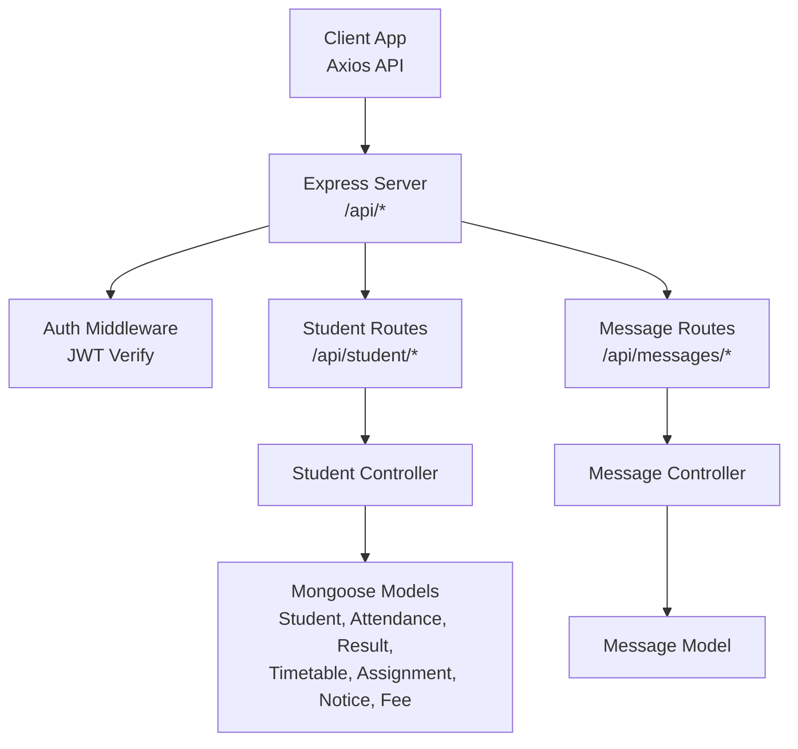
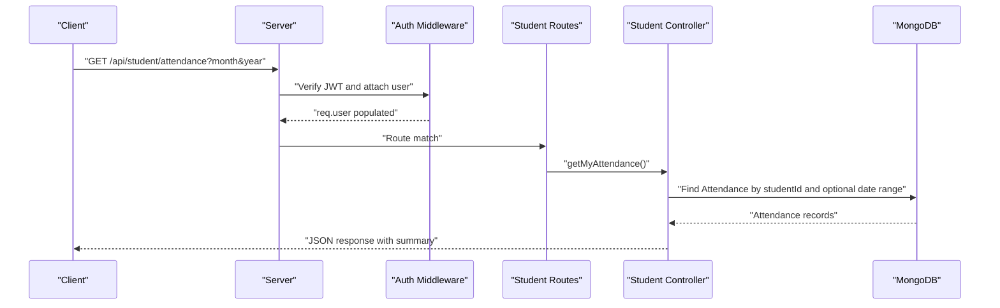
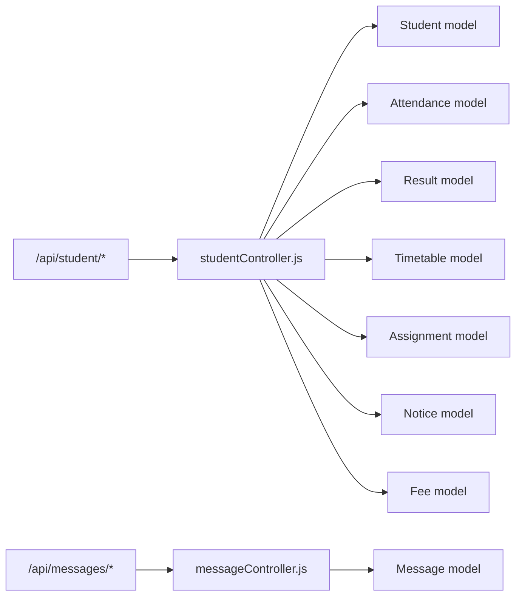

# Student API

<cite>
**Referenced Files in This Document**
- [server.js](file://server/server.js)
- [student.js](file://server/routes/student.js)
- [studentController.js](file://server/controllers/studentController.js)
- [auth.js](file://server/middleware/auth.js)
- [api.js](file://client/src/api.js)
- [Dashboard.jsx](file://client/src/pages/student/Dashboard.jsx)
- [AttendancePage.jsx](file://client/src/pages/student/AttendancePage.jsx)
- [ResultsPage.jsx](file://client/src/pages/student/ResultsPage.jsx)
- [message.js](file://server/routes/message.js)
- [messageController.js](file://server/controllers/messageController.js)
- [Student.js](file://server/models/Student.js)
- [Attendance.js](file://server/models/Attendance.js)
- [Result.js](file://server/models/Result.js)
- [Assignment.js](file://server/models/Assignment.js)
- [Notice.js](file://server/models/Notice.js)
- [Message.js](file://server/models/Message.js)
</cite>

## Table of Contents
1. [Introduction](#introduction)
2. [Project Structure](#project-structure)
3. [Core Components](#core-components)
4. [Architecture Overview](#architecture-overview)
5. [Detailed Component Analysis](#detailed-component-analysis)
6. [Dependency Analysis](#dependency-analysis)
7. [Performance Considerations](#performance-considerations)
8. [Troubleshooting Guide](#troubleshooting-guide)
9. [Conclusion](#conclusion)
10. [Appendices](#appendices)

## Introduction
This document provides comprehensive API documentation for the Student API endpoints. It covers student-specific functions including attendance viewing, grade access, assignment listing, timetable access, notices, and fee details. It also documents authentication and role-based authorization requirements, enrollment-based permissions, and client-side usage patterns. Communication channels among students, parents, and teachers are documented via the messaging API.

## Project Structure
The API is structured with Express routes under `/api/student`, backed by controllers that query Mongoose models. Authentication is enforced via JWT middleware, and authorization restricts endpoints to the "student" role. The client consumes these endpoints through a shared Axios instance that injects Authorization headers.

**Diagram sources**
- [server.js:18-27](file://server/server.js#L18-L27)
- [student.js:1-14](file://server/routes/student.js#L1-L14)
- [auth.js:4-28](file://server/middleware/auth.js#L4-L28)
- [api.js:3-28](file://client/src/api.js#L3-L28)

**Section sources**
- [server.js:18-27](file://server/server.js#L18-L27)
- [student.js:1-14](file://server/routes/student.js#L1-L14)
- [auth.js:4-28](file://server/middleware/auth.js#L4-L28)
- [api.js:3-28](file://client/src/api.js#L3-L28)

## Core Components
- Authentication and Authorization:
  - JWT-based authentication validates the Authorization header and attaches the user to the request.
  - Role-based authorization ensures only users with role "student" can access student endpoints.
- Student Controller:
  - Provides endpoints for attendance, results, timetable, assignments, notices, and fees.
  - Enforces enrollment-based filtering using the student’s classId and userId.
- Client Integration:
  - Axios instance sets Authorization header from local storage.
  - Student dashboard and pages consume the endpoints and render summaries.

**Section sources**
- [auth.js:4-28](file://server/middleware/auth.js#L4-L28)
- [studentController.js:10-84](file://server/controllers/studentController.js#L10-L84)
- [api.js:8-14](file://client/src/api.js#L8-L14)

## Architecture Overview
The Student API follows a layered architecture:
- Route handlers define endpoint contracts.
- Controllers encapsulate business logic and model queries.
- Models define schemas and indexes.
- Middleware enforces authentication and authorization.
- Client communicates via Axios with automatic bearer token injection.

**Diagram sources**
- [student.js:6](file://server/routes/student.js#L6)
- [studentController.js:10-31](file://server/controllers/studentController.js#L10-L31)
- [auth.js:4-19](file://server/middleware/auth.js#L4-L19)

## Detailed Component Analysis

### Authentication and Authorization
- Authentication:
  - Validates Bearer token from Authorization header.
  - Decodes JWT and attaches user object (without password) to request.
- Authorization:
  - Restricts access to roles array; student endpoints use authorize("student").

**Section sources**
- [auth.js:4-19](file://server/middleware/auth.js#L4-L19)
- [auth.js:21-28](file://server/middleware/auth.js#L21-L28)

### Student Routes and Endpoints
All student endpoints are mounted under /api/student and protected by auth and authorize("student").

- GET /api/student/attendance
  - Purpose: Retrieve attendance records and compute summary statistics for a given month/year.
  - Query parameters:
    - month (optional): numeric month (1-12)
    - year (optional): 4-digit year
  - Response:
    - attendance: array of attendance records
    - summary: totalDays, present, absent, late, percentage
  - Enrollment-based permission: Filters by studentId derived from req.user._id via Student model.
  - Example request:
    - GET /api/student/attendance?month=10&year=2024
  - Example response:
    - {
        "attendance": [...],
        "summary": {"totalDays": 20, "present": 18, "absent": 2, "late": 0, "percentage": "90.0"}
      }

- GET /api/student/results
  - Purpose: Fetch all exam results for the student.
  - Response: Array of result documents with populated examId and classId.
  - Enrollment-based permission: Filters by studentId.
  - Example request:
    - GET /api/student/results
  - Example response:
    - [
        {
          "_id": "...",
          "studentId": "...",
          "examId": {"_id": "...", "name": "Math Midterm", "subject": "Mathematics", "date": "...", "classId": "..."},
          "marks": 85,
          "grade": "A",
          "remarks": "Good performance"
        }
      ]

- GET /api/student/timetable
  - Purpose: Retrieve timetable entries for the student’s class.
  - Response: Timetable documents with populated teacher references.
  - Enrollment-based permission: Filters by student.classId.
  - Example request:
    - GET /api/student/timetable
  - Example response:
    - [
        {
          "_id": "...",
          "classId": "...",
          "day": "Monday",
          "periods": [
            {"subject": "Math", "teacherId": {"_id": "...", "name": "John Doe"}, "startTime": "...", "endTime": "..."}
          ]
        }
      ]

- GET /api/student/assignments
  - Purpose: List assignments for the student’s class.
  - Response: Array of assignments with teacherId populated.
  - Enrollment-based permission: Filters by student.classId.
  - Example request:
    - GET /api/student/assignments
  - Example response:
    - [
        {
          "_id": "...",
          "title": "Algebra Homework",
          "description": "Complete exercises 1-20",
          "subject": "Mathematics",
          "teacherId": {"_id": "...", "name": "Jane Smith"},
          "dueDate": "...",
          "totalMarks": 100
        }
      ]

- GET /api/student/notices
  - Purpose: Retrieve notices targeting students or all roles.
  - Response: Array of notices sorted by pinned first, then by creation time.
  - Example request:
    - GET /api/student/notices
  - Example response:
    - [
        {
          "_id": "...",
          "title": "Exam Schedule Released",
          "message": "Please check the attached schedule.",
          "category": "exam",
          "targetRoles": ["student", "parent"],
          "isPinned": true
        }
      ]

- GET /api/student/fees
  - Purpose: Retrieve fee records for the student.
  - Response: Array of fee records sorted by dueDate descending.
  - Enrollment-based permission: Filters by studentId.
  - Example request:
    - GET /api/student/fees
  - Example response:
    - [
        {
          "_id": "...",
          "studentId": "...",
          "description": "Tuition Fee",
          "amount": 5000,
          "dueDate": "...",
          "status": "pending"
        }
      ]

**Section sources**
- [student.js:6-11](file://server/routes/student.js#L6-L11)
- [studentController.js:10-84](file://server/controllers/studentController.js#L10-L84)
- [Student.js:4-6](file://server/models/Student.js#L4-L6)
- [Attendance.js:4-8](file://server/models/Attendance.js#L4-L8)
- [Result.js:4-8](file://server/models/Result.js#L4-L8)
- [Assignment.js:6](file://server/models/Assignment.js#L6)
- [Notice.js:7](file://server/models/Notice.js#L7)

### Client-Side Usage Patterns
- Axios configuration:
  - Base URL: /api
  - Authorization header injected from localStorage user.token
- Student Dashboard:
  - Calls attendance, results, and fees endpoints concurrently on load.
- Attendance Page:
  - Accepts month and year query parameters to filter attendance.
- Results Page:
  - Renders results with color-coded grades and remarks.

**Section sources**
- [api.js:3-28](file://client/src/api.js#L3-L28)
- [Dashboard.jsx:11-22](file://client/src/pages/student/Dashboard.jsx#L11-L22)
- [AttendancePage.jsx:12-14](file://client/src/pages/student/AttendancePage.jsx#L12-L14)
- [ResultsPage.jsx:8-10](file://client/src/pages/student/ResultsPage.jsx#L8-L10)

### Academic Support Systems and Communication Channels
- Messaging API:
  - Get messages between two users:
    - GET /api/messages/:receiverId
  - Send a message:
    - POST /api/messages with body { receiverId, message }
  - Unread message count:
    - GET /api/messages/unread/count
  - Behavior:
    - Messages are retrieved via a bidirectional filter (senderId and receiverId).
    - Unread messages for the current user are marked as read upon retrieval.
    - New messages are persisted with isRead=false initially.

**Section sources**
- [message.js:6-8](file://server/routes/message.js#L6-L8)
- [messageController.js:3-37](file://server/controllers/messageController.js#L3-L37)
- [Message.js:4-7](file://server/models/Message.js#L4-L7)

## Dependency Analysis

**Diagram sources**
- [student.js:1-14](file://server/routes/student.js#L1-L14)
- [studentController.js:1-8](file://server/controllers/studentController.js#L1-L8)
- [message.js:1-11](file://server/routes/message.js#L1-L11)
- [messageController.js:1](file://server/controllers/messageController.js#L1)

**Section sources**
- [studentController.js:1-8](file://server/controllers/studentController.js#L1-L8)
- [messageController.js:1](file://server/controllers/messageController.js#L1)

## Performance Considerations
- Indexing:
  - Attendance schema includes a compound index on studentId and date to optimize date-range queries.
  - Result schema includes a compound index on studentId and examId to prevent duplicates and speed up lookups.
- Population:
  - Controller queries populate related documents (e.g., examId, teacherId). Excessive population can increase payload size; consider pagination or selective projections for large datasets.
- Sorting:
  - Queries sort by date/time fields; ensure appropriate indexes exist for performance.

**Section sources**
- [Attendance.js:11](file://server/models/Attendance.js#L11)
- [Result.js:11](file://server/models/Result.js#L11)

## Troubleshooting Guide
- 401 Unauthorized:
  - Cause: Missing or invalid Bearer token.
  - Resolution: Ensure Authorization header is present and valid; client automatically handles removal on 401.
- 403 Forbidden:
  - Cause: User role is not "student".
  - Resolution: Authenticate as a student account.
- 404 Not Found:
  - Cause: Student profile not found for the authenticated user.
  - Resolution: Verify that the user has an associated Student record.
- 500 Internal Server Error:
  - Cause: Server-side exception during query execution.
  - Resolution: Check server logs and model queries.

**Section sources**
- [auth.js:10-18](file://server/middleware/auth.js#L10-L18)
- [auth.js:23-26](file://server/middleware/auth.js#L23-L26)
- [studentController.js:13](file://server/controllers/studentController.js#L13)
- [studentController.js:28-30](file://server/controllers/studentController.js#L28-L30)

## Conclusion
The Student API provides a focused set of endpoints for attendance, results, timetable, assignments, notices, and fees, all secured with JWT and role-based authorization. Client pages integrate these endpoints to deliver a responsive dashboard experience. The messaging API enables communication among students, parents, and teachers. Proper indexing and cautious population help maintain performance as the dataset grows.

## Appendices

### Endpoint Reference Summary
- GET /api/student/attendance
  - Query: month, year
  - Response: attendance[], summary
- GET /api/student/results
  - Response: results[]
- GET /api/student/timetable
  - Response: timetable[]
- GET /api/student/assignments
  - Response: assignments[]
- GET /api/student/notices
  - Response: notices[]
- GET /api/student/fees
  - Response: fees[]
- GET /api/messages/:receiverId
  - Response: messages[]
- POST /api/messages
  - Body: { receiverId, message }
  - Response: message
- GET /api/messages/unread/count
  - Response: { unreadCount }

**Section sources**
- [student.js:6-11](file://server/routes/student.js#L6-L11)
- [message.js:6-8](file://server/routes/message.js#L6-L8)
- [messageController.js:20-28](file://server/controllers/messageController.js#L20-L28)
- [messageController.js:30-37](file://server/controllers/messageController.js#L30-L37)