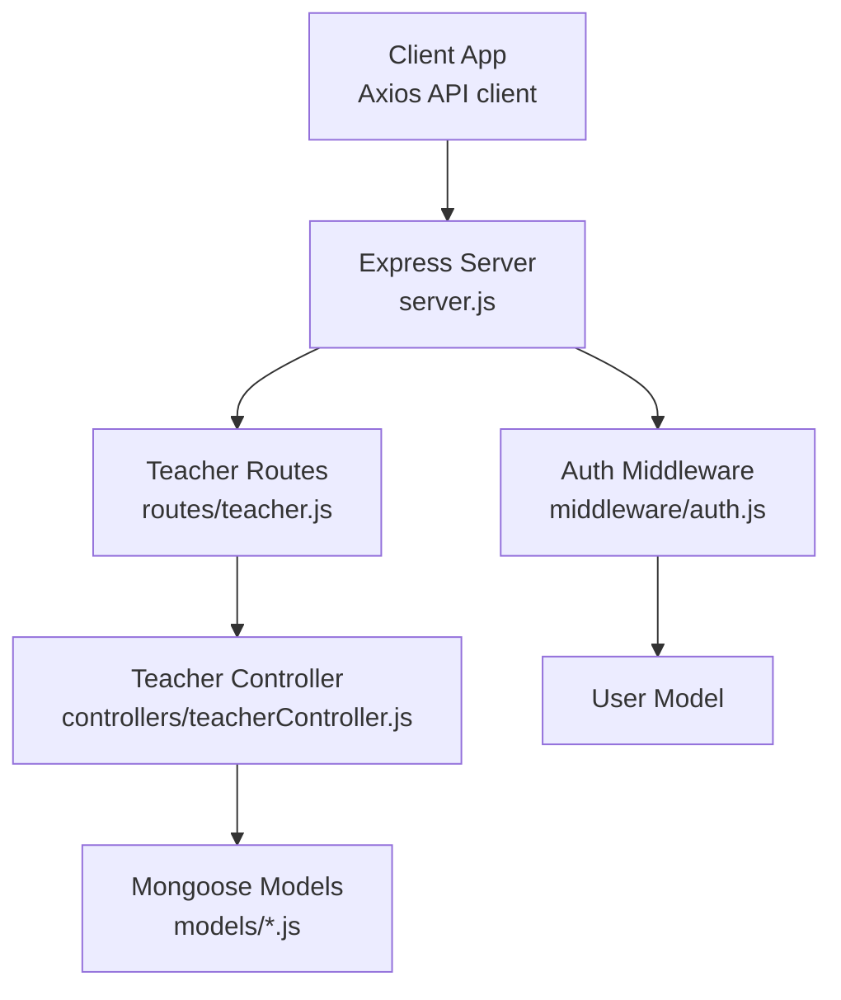
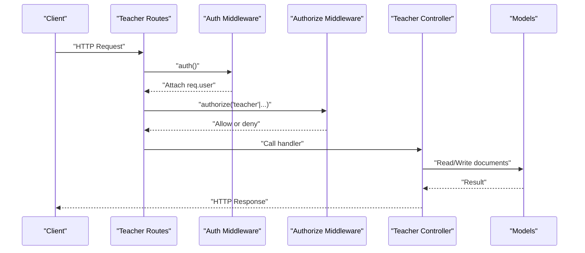
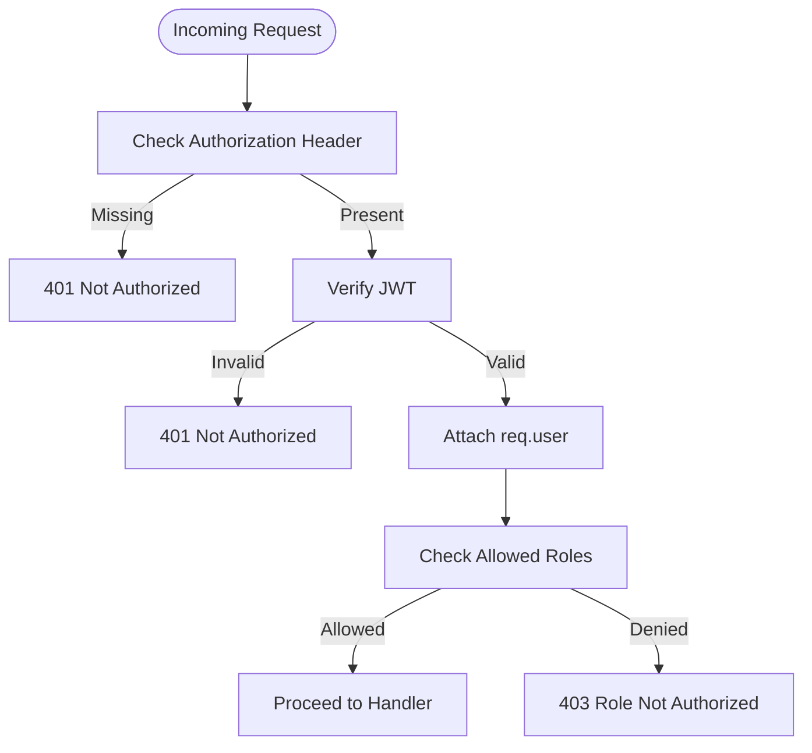
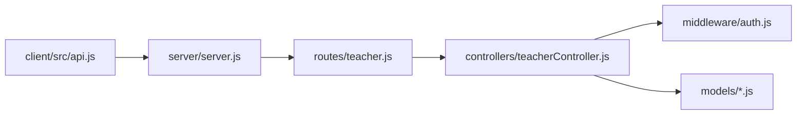

# Teacher API

<cite>
**Referenced Files in This Document**
- [server.js](file://server/server.js)
- [teacher.js](file://server/routes/teacher.js)
- [teacherController.js](file://server/controllers/teacherController.js)
- [auth.js](file://server/middleware/auth.js)
- [Teacher.js](file://server/models/Teacher.js)
- [Student.js](file://server/models/Student.js)
- [Class.js](file://server/models/Class.js)
- [Attendance.js](file://server/models/Attendance.js)
- [Assignment.js](file://server/models/Assignment.js)
- [Exam.js](file://server/models/Exam.js)
- [Result.js](file://server/models/Result.js)
- [Notice.js](file://server/models/Notice.js)
- [api.js](file://client/src/api.js)
- [Dashboard.jsx](file://client/src/pages/teacher/Dashboard.jsx)
- [AttendancePage.jsx](file://client/src/pages/teacher/AttendancePage.jsx)
</cite>

## Table of Contents
1. [Introduction](#introduction)
2. [Project Structure](#project-structure)
3. [Core Components](#core-components)
4. [Architecture Overview](#architecture-overview)
5. [Detailed Component Analysis](#detailed-component-analysis)
6. [Dependency Analysis](#dependency-analysis)
7. [Performance Considerations](#performance-considerations)
8. [Troubleshooting Guide](#troubleshooting-guide)
9. [Conclusion](#conclusion)
10. [Appendices](#appendices)

## Introduction
This document provides comprehensive API documentation for the Teacher API endpoints. It covers teacher-specific functions including attendance marking, student grade entry, assignment creation, and class management. For each endpoint, you will find HTTP methods, URL patterns, request/response schemas, authentication requirements, and role-based permissions. Example requests and responses are included for attendance recording, grade submission, assignment distribution, and academic report generation. The document also explains teacher-student relationships and academic workflow integration.

## Project Structure
The Teacher API is exposed under the base path /api/teacher and is mounted in the Express server. The routing layer delegates requests to controller functions, which interact with Mongoose models representing domain entities such as Attendance, Student, Class, Exam, Result, Assignment, and Notice. Authentication and authorization are enforced via middleware.

**Diagram sources**
- [server.js:18-27](file://server/server.js#L18-L27)
- [teacher.js:1-19](file://server/routes/teacher.js#L1-L19)
- [teacherController.js:1-181](file://server/controllers/teacherController.js#L1-L181)
- [auth.js:1-31](file://server/middleware/auth.js#L1-L31)

**Section sources**
- [server.js:18-27](file://server/server.js#L18-L27)
- [teacher.js:1-19](file://server/routes/teacher.js#L1-L19)

## Core Components
- Authentication: JWT-based bearer tokens validated by middleware. Tokens are expected in the Authorization header.
- Authorization: Role-based access control enforcing allowed roles per route.
- Teacher Controller: Implements endpoints for attendance, exams/results, assignments, class retrieval, and notices.
- Models: Define schemas for Teacher, Student, Class, Attendance, Assignment, Exam, Result, and Notice.

Key responsibilities:
- Attendance: Mark daily attendance for students and fetch class-level or monthly summaries.
- Exams & Results: Create exams, list class exams, upload results, and retrieve exam results.
- Assignments: Create, list, and delete assignments scoped to a class.
- Class Management: Retrieve teacher’s assigned classes.
- Notices: Post notices.

**Section sources**
- [auth.js:4-28](file://server/middleware/auth.js#L4-L28)
- [teacherController.js:10-181](file://server/controllers/teacherController.js#L10-L181)
- [Teacher.js:1-13](file://server/models/Teacher.js#L1-L13)
- [Student.js:1-16](file://server/models/Student.js#L1-L16)
- [Class.js:1-11](file://server/models/Class.js#L1-L11)
- [Attendance.js:1-14](file://server/models/Attendance.js#L1-L14)
- [Assignment.js:1-15](file://server/models/Assignment.js#L1-L15)
- [Exam.js:1-13](file://server/models/Exam.js#L1-L13)
- [Result.js:1-14](file://server/models/Result.js#L1-L14)
- [Notice.js:1-14](file://server/models/Notice.js#L1-L14)

## Architecture Overview
The Teacher API follows a layered architecture:
- Route handlers define endpoints and apply middleware.
- Controllers encapsulate business logic and orchestrate model interactions.
- Models define data structures and indexes.
- Middleware enforces authentication and authorization.

**Diagram sources**
- [teacher.js:6-17](file://server/routes/teacher.js#L6-L17)
- [auth.js:4-28](file://server/middleware/auth.js#L4-L28)
- [teacherController.js:11-181](file://server/controllers/teacherController.js#L11-L181)

## Detailed Component Analysis

### Authentication and Authorization
- Authentication: Validates JWT from Authorization: Bearer <token>.
- Authorization: Enforces allowed roles per route using a variadic role list.

**Diagram sources**
- [auth.js:4-28](file://server/middleware/auth.js#L4-L28)

**Section sources**
- [auth.js:4-28](file://server/middleware/auth.js#L4-L28)

### Attendance Endpoints
- Mark Attendance
  - Method: POST
  - URL: /api/teacher/attendance
  - Auth: Required, Role: teacher
  - Request body:
    - records: array of { studentId, status, remarks? }
    - date?: optional date (defaults to current date)
  - Response: { message, results: array of attendance records }
  - Notes:
    - Updates existing records for the same student and day; otherwise creates new records.
    - markedBy is set to the authenticated user ID.

- Get Class Attendance
  - Method: GET
  - URL: /api/teacher/attendance
  - Query params: classId, date
  - Auth: Required, Role: teacher
  - Response: { students: array of class students with user info, attendance: array of attendance records for the given date }

- Get Monthly Attendance Summary
  - Method: GET
  - URL: /api/teacher/attendance/monthly
  - Query params: classId, month, year
  - Auth: Required, Role: teacher, admin
  - Response: Array of { student, present, absent, late, total }

Example request (mark attendance):
- POST /api/teacher/attendance
- Headers: Authorization: Bearer <token>
- Body:
  - records: [
    { studentId: "...", status: "present", remarks: "" },
    { studentId: "...", status: "absent", remarks: "Unwell" }
  ]
  - date: "2025-06-01"

Example response:
- 201 Created
- Body: { message: "Attendance marked successfully", results: [...] }

**Section sources**
- [teacher.js:6-8](file://server/routes/teacher.js#L6-L8)
- [teacherController.js:11-74](file://server/controllers/teacherController.js#L11-L74)
- [Attendance.js:1-14](file://server/models/Attendance.js#L1-L14)
- [Student.js:1-16](file://server/models/Student.js#L1-L16)

### Exams and Results Endpoints
- Create Exam
  - Method: POST
  - URL: /api/teacher/exams
  - Auth: Required, Role: teacher, admin
  - Request body: fields from Exam schema (name, classId, subject, date, totalMarks?, passMarks?)
  - Response: Created Exam object

- Get Class Exams
  - Method: GET
  - URL: /api/teacher/exams/:classId
  - Auth: Required, Role: teacher, admin
  - Response: Array of exams sorted by date desc

- Upload Results
  - Method: POST
  - URL: /api/teacher/results
  - Auth: Required, Role: teacher, admin
  - Request body: { examId, results: array of { studentId, marks, grade?, remarks? } }
  - Response: { message, results: array of created/upserted Result objects }

- Get Exam Results
  - Method: GET
  - URL: /api/teacher/results/:examId
  - Auth: Required, Role: teacher, admin
  - Response: Array of Result objects populated with student roll number and user name

Example request (upload results):
- POST /api/teacher/results
- Headers: Authorization: Bearer <token>
- Body:
  - examId: "..."
  - results: [
    { studentId: "...", marks: 85, grade: "A", remarks: "" },
    { studentId: "...", marks: 42, grade: "E", remarks: "Needs improvement" }
  ]

Example response:
- 201 Created
- Body: { message: "Results uploaded successfully", results: [...] }

**Section sources**
- [teacher.js:9-12](file://server/routes/teacher.js#L9-L12)
- [teacherController.js:77-128](file://server/controllers/teacherController.js#L77-L128)
- [Exam.js:1-13](file://server/models/Exam.js#L1-L13)
- [Result.js:1-14](file://server/models/Result.js#L1-L14)

### Assignment Endpoints
- Create Assignment
  - Method: POST
  - URL: /api/teacher/assignments
  - Auth: Required, Role: teacher
  - Request body: fields from Assignment schema (title, description, classId, subject, dueDate, totalMarks?, attachments?)
  - Response: Created Assignment object
  - Notes: teacherId is derived from the authenticated teacher’s profile.

- Get Class Assignments
  - Method: GET
  - URL: /api/teacher/assignments/:classId
  - Auth: Required, Role: teacher, admin, student
  - Response: Array of assignments sorted by dueDate asc, populated with teacher info

- Delete Assignment
  - Method: DELETE
  - URL: /api/teacher/assignments/:id
  - Auth: Required, Role: teacher
  - Response: { message: "Assignment deleted successfully" }

Example request (create assignment):
- POST /api/teacher/assignments
- Headers: Authorization: Bearer <token>
- Body:
  - title: "Math Homework"
  - description: "Complete exercises 1-20"
  - classId: "..."
  - subject: "Mathematics"
  - dueDate: "2025-06-15T10:00:00Z"
  - totalMarks: 20

Example response:
- 201 Created
- Body: { ...Assignment }

**Section sources**
- [teacher.js:13-15](file://server/routes/teacher.js#L13-L15)
- [teacherController.js:131-158](file://server/controllers/teacherController.js#L131-L158)
- [Assignment.js:1-15](file://server/models/Assignment.js#L1-L15)
- [Teacher.js:1-13](file://server/models/Teacher.js#L1-L13)

### Class Management Endpoint
- Get Teacher Classes
  - Method: GET
  - URL: /api/teacher/classes
  - Auth: Required, Role: teacher
  - Response: Array of Class objects assigned to the teacher

Frontend usage:
- The teacher dashboard fetches the list of classes assigned to the logged-in teacher.

**Section sources**
- [teacher.js:16](file://server/routes/teacher.js#L16)
- [teacherController.js:161-170](file://server/controllers/teacherController.js#L161-L170)
- [Class.js:1-11](file://server/models/Class.js#L1-L11)
- [Dashboard.jsx:9-11](file://client/src/pages/teacher/Dashboard.jsx#L9-L11)

### Notice Posting Endpoint
- Create Notice
  - Method: POST
  - URL: /api/teacher/notices
  - Auth: Required, Role: teacher, admin
  - Request body: fields from Notice schema (title, message, category?, targetRoles?, isPinned?, attachments?)
  - Response: Created Notice object
  - Notes: postedBy is set to the authenticated user ID.

**Section sources**
- [teacher.js:17](file://server/routes/teacher.js#L17)
- [teacherController.js:173-180](file://server/controllers/teacherController.js#L173-L180)
- [Notice.js:1-14](file://server/models/Notice.js#L1-L14)

## Dependency Analysis
The Teacher API endpoints depend on:
- Route definitions in routes/teacher.js
- Controller logic in controllers/teacherController.js
- Authentication and authorization middleware
- Mongoose models for domain entities

**Diagram sources**
- [teacher.js:1-19](file://server/routes/teacher.js#L1-L19)
- [teacherController.js:1-181](file://server/controllers/teacherController.js#L1-L181)
- [auth.js:1-31](file://server/middleware/auth.js#L1-L31)
- [server.js:18-27](file://server/server.js#L18-L27)
- [api.js:1-28](file://client/src/api.js#L1-L28)

**Section sources**
- [teacher.js:1-19](file://server/routes/teacher.js#L1-L19)
- [teacherController.js:1-181](file://server/controllers/teacherController.js#L1-L181)
- [auth.js:1-31](file://server/middleware/auth.js#L1-L31)
- [server.js:18-27](file://server/server.js#L18-L27)
- [api.js:1-28](file://client/src/api.js#L1-L28)

## Performance Considerations
- Indexing:
  - Attendance: unique compound index on studentId+date to prevent duplicates and speed up lookups.
  - Result: unique compound index on studentId+examId to avoid duplicate entries.
- Population:
  - Controllers populate related documents (e.g., student/user, teacher) which can increase query cost. Use selective population and pagination for large datasets.
- Batch Operations:
  - Attendance marking loops through records sequentially. For large batches, consider batching or bulk operations to reduce round trips.
- Query Filtering:
  - Monthly attendance filters by date range; ensure proper date normalization to avoid partial matches.

**Section sources**
- [Attendance.js:11](file://server/models/Attendance.js#L11)
- [Result.js:11](file://server/models/Result.js#L11)
- [teacherController.js:24-36](file://server/controllers/teacherController.js#L24-L36)
- [teacherController.js:59-70](file://server/controllers/teacherController.js#L59-L70)

## Troubleshooting Guide
Common errors and resolutions:
- 401 Not Authorized
  - Cause: Missing or invalid JWT token.
  - Resolution: Ensure Authorization header includes a valid Bearer token.
- 403 Role Not Authorized
  - Cause: User role not permitted for the endpoint.
  - Resolution: Verify the user’s role matches the allowed roles for the route.
- 404 Teacher Profile Not Found
  - Cause: Authenticated user lacks a Teacher profile.
  - Resolution: Ensure the user has a Teacher record linked to their User ID.
- Attendance Duplicate Record
  - Cause: Attempting to mark attendance for the same student on the same day.
  - Resolution: The endpoint updates existing records; avoid sending duplicate studentId/date combinations.
- Exam Not Found
  - Cause: Provided examId does not exist.
  - Resolution: Validate examId before uploading results.
- Internal Server Error (500)
  - Cause: Unexpected exceptions in controller logic.
  - Resolution: Check server logs and ensure required fields are provided.

**Section sources**
- [auth.js:10-18](file://server/middleware/auth.js#L10-L18)
- [auth.js:21-28](file://server/middleware/auth.js#L21-L28)
- [teacherController.js:14-15](file://server/controllers/teacherController.js#L14-L15)
- [teacherController.js:98-99](file://server/controllers/teacherController.js#L98-L99)

## Conclusion
The Teacher API provides a focused set of endpoints for managing classroom activities, including attendance, assessments, assignments, and class administration. Robust authentication and role-based authorization protect resources, while clear request/response schemas enable reliable integrations. The documented examples and troubleshooting guidance support smooth development and deployment.

## Appendices

### API Reference Summary
- Base URL: /api/teacher
- Authentication: Bearer <token>
- Authorization roles per endpoint:
  - /attendance: teacher
  - /attendance/monthly: teacher, admin
  - /exams: teacher, admin
  - /results: teacher, admin
  - /assignments: teacher
  - /assignments/:classId: teacher, admin, student
  - /assignments/:id: teacher
  - /classes: teacher
  - /notices: teacher, admin

**Section sources**
- [teacher.js:6-17](file://server/routes/teacher.js#L6-L17)

### Frontend Integration Notes
- Axios client automatically attaches the Bearer token from local storage.
- The teacher dashboard fetches assigned classes.
- The attendance page allows selecting a class and date, marking statuses, and submitting attendance records.

**Section sources**
- [api.js:8-14](file://client/src/api.js#L8-L14)
- [Dashboard.jsx:9-11](file://client/src/pages/teacher/Dashboard.jsx#L9-L11)
- [AttendancePage.jsx:13-27](file://client/src/pages/teacher/AttendancePage.jsx#L13-L27)