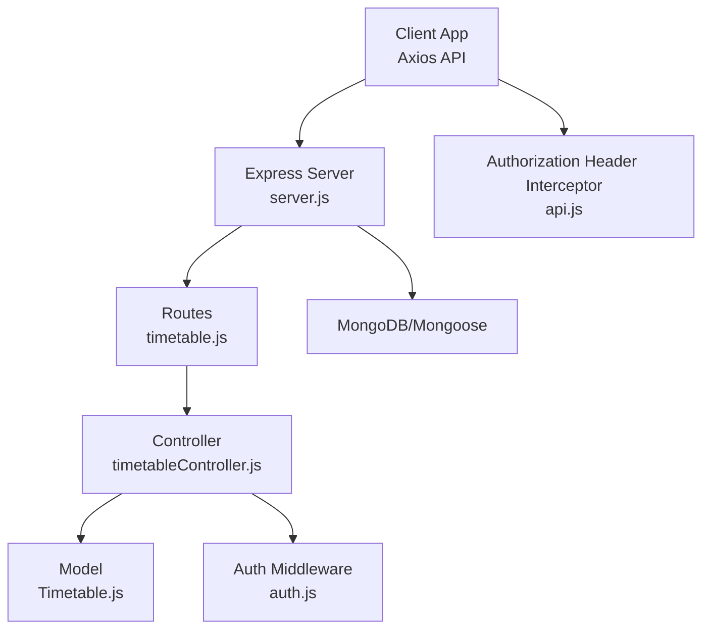
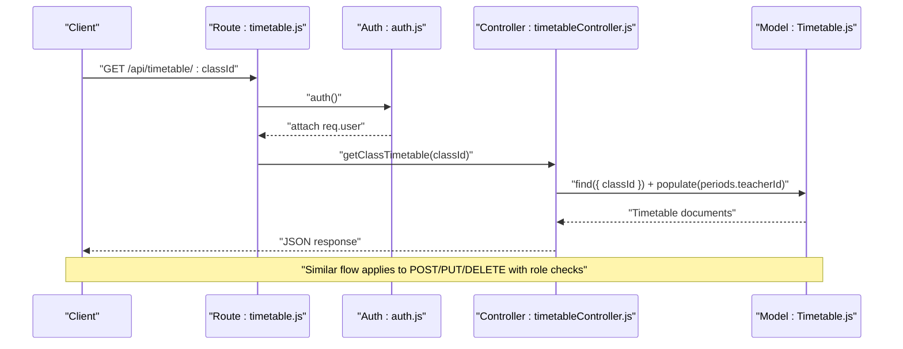
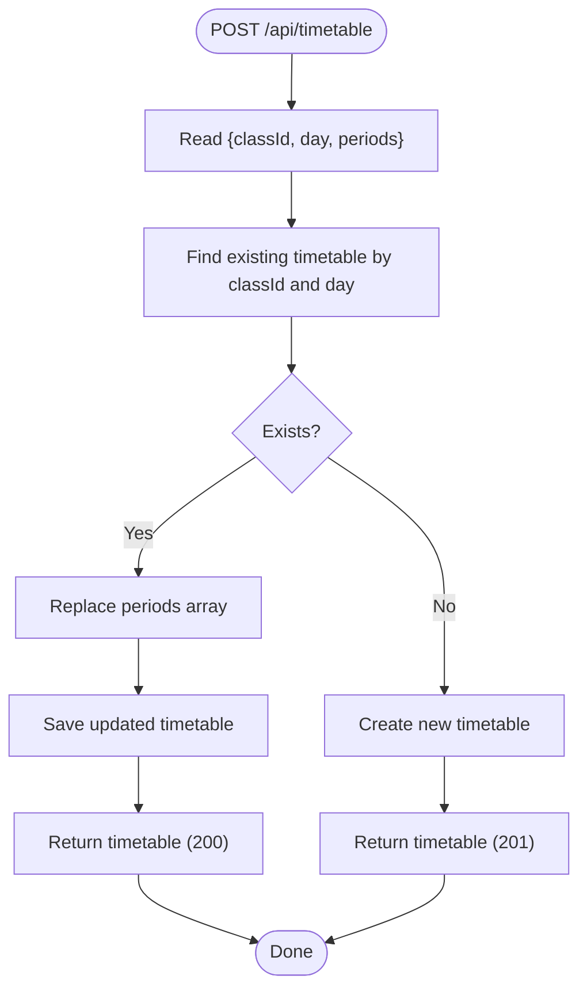
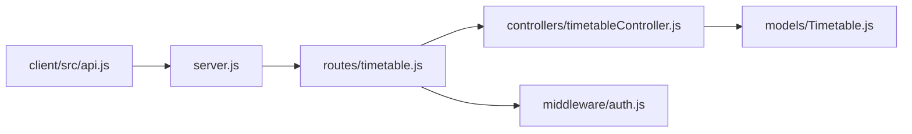

# Timetable API

<cite>
**Referenced Files in This Document**
- [server.js](file://server/server.js)
- [timetable.js](file://server/routes/timetable.js)
- [timetableController.js](file://server/controllers/timetableController.js)
- [Timetable.js](file://server/models/Timetable.js)
- [auth.js](file://server/middleware/auth.js)
- [Class.js](file://server/models/Class.js)
- [Teacher.js](file://server/models/Teacher.js)
- [seed.js](file://server/seed.js)
- [server-memory.js](file://server/server-memory.js)
- [api.js](file://client/src/api.js)
</cite>

## Table of Contents
1. [Introduction](#introduction)
2. [Project Structure](#project-structure)
3. [Core Components](#core-components)
4. [Architecture Overview](#architecture-overview)
5. [Detailed Component Analysis](#detailed-component-analysis)
6. [Dependency Analysis](#dependency-analysis)
7. [Performance Considerations](#performance-considerations)
8. [Troubleshooting Guide](#troubleshooting-guide)
9. [Conclusion](#conclusion)
10. [Appendices](#appendices)

## Introduction
This document provides comprehensive API documentation for the Timetable module of the School Management System. It covers schedule creation, class timetabling, resource allocation, and time slot management via dedicated endpoints. For each endpoint, we specify HTTP methods, URL patterns, request/response schemas, authentication and authorization requirements, and describe the scheduling logic implemented by the backend. We also include example requests and responses for timetable generation, schedule modification, room assignment, and academic calendar integration, along with guidance on time zone handling and scheduling constraints.

## Project Structure
The Timetable API is implemented as part of the Express server and integrates with MongoDB/Mongoose for persistence. The routing layer exposes endpoints under /api/timetable, while controllers handle business logic and models define the data schema. Authentication is enforced via JWT, and authorization roles restrict access to administrative and teaching staff.



**Diagram sources**
- [server.js:1-38](file://server/server.js#L1-L38)
- [timetable.js:1-12](file://server/routes/timetable.js#L1-L12)
- [timetableController.js:1-47](file://server/controllers/timetableController.js#L1-L47)
- [Timetable.js:1-16](file://server/models/Timetable.js#L1-L16)
- [auth.js:1-31](file://server/middleware/auth.js#L1-L31)
- [api.js:1-28](file://client/src/api.js#L1-L28)

**Section sources**
- [server.js:18-27](file://server/server.js#L18-L27)
- [timetable.js:1-12](file://server/routes/timetable.js#L1-L12)

## Core Components
- Route Layer: Defines GET, POST, PUT, DELETE endpoints for timetable management.
- Controller Layer: Implements timetable retrieval, creation/update, and deletion with population of teacher references.
- Model Layer: Defines the Timetable schema with class reference, weekday enumeration, and an array of period entries containing subject, teacher, start/end time, and room.
- Authentication and Authorization: JWT-based auth middleware enforces bearer tokens and role-based access control.
- Frontend Integration: Axios client injects Authorization header and handles 401 responses.

Key responsibilities:
- Retrieve a class timetable sorted by day.
- Upsert a timetable for a given class and day.
- Update an existing timetable entry.
- Delete a timetable entry.
- Populate teacher references for readable responses.

**Section sources**
- [timetable.js:6-9](file://server/routes/timetable.js#L6-L9)
- [timetableController.js:3-10](file://server/controllers/timetableController.js#L3-L10)
- [timetableController.js:12-27](file://server/controllers/timetableController.js#L12-L27)
- [timetableController.js:29-37](file://server/controllers/timetableController.js#L29-L37)
- [timetableController.js:39-46](file://server/controllers/timetableController.js#L39-L46)
- [Timetable.js:3-13](file://server/models/Timetable.js#L3-L13)
- [auth.js:4-19](file://server/middleware/auth.js#L4-L19)
- [auth.js:21-28](file://server/middleware/auth.js#L21-L28)
- [api.js:8-25](file://client/src/api.js#L8-L25)

## Architecture Overview
The Timetable API follows a layered architecture:
- HTTP Layer: Routes define endpoint contracts.
- Application Layer: Controllers orchestrate data access and transformations.
- Domain Layer: Models encapsulate data and relationships.
- Infrastructure Layer: Middleware handles authentication and authorization.



**Diagram sources**
- [timetable.js:6](file://server/routes/timetable.js#L6)
- [auth.js:4-19](file://server/middleware/auth.js#L4-L19)
- [timetableController.js:3-10](file://server/controllers/timetableController.js#L3-L10)
- [Timetable.js:3-13](file://server/models/Timetable.js#L3-L13)

## Detailed Component Analysis

### Endpoint Catalog

- Base Path: /api/timetable
- Authentication: Required for all endpoints via Bearer token.
- Authorization:
  - GET /:classId: Any authenticated user.
  - POST /: Requires admin or teacher.
  - PUT /:id: Requires admin or teacher.
  - DELETE /:id: Requires admin.

Endpoints:
- GET /:classId
  - Purpose: Retrieve all timetable entries for a given class, sorted by day.
  - Request
    - Headers: Authorization: Bearer <token>
    - Path Params: classId (ObjectId)
  - Response
    - 200 OK: Array of timetable documents with populated periods.teacherId.
    - 500 Internal Server Error: Error message on failure.
  - Example Request
    - curl -H "Authorization: Bearer <token>" https://host/api/timetable/<classId>
  - Example Response
    - [
        {
          "day": "Monday",
          "classId": "<classId>",
          "periods": [
            {
              "subject": "Mathematics",
              "teacherId": "<teacherId>",
              "startTime": "8:00",
              "endTime": "8:45",
              "room": "Room 100"
            }
          ]
        }
      ]

- POST /
  - Purpose: Create or update a timetable for a class on a specific day.
  - Request
    - Headers: Authorization: Bearer <token>
    - Body: { classId: ObjectId, day: string, periods: Array }
  - Behavior
    - If a timetable exists for the same classId and day, replace periods and save.
    - Otherwise, create a new timetable document.
  - Response
    - 201 Created: Newly created timetable.
    - 200 OK: Updated timetable.
    - 500 Internal Server Error: Error message on failure.
  - Example Request
    - curl -X POST -H "Authorization: Bearer <token>" -H "Content-Type: application/json" -d '{"classId":"<classId>","day":"Monday","periods":[{"subject":"Mathematics","teacherId":"<teacherId>","startTime":"8:00","endTime":"8:45","room":"Room 100"}]}' https://host/api/timetable/
  - Example Response
    - {
        "_id": "<timetableId>",
        "classId": "<classId>",
        "day": "Monday",
        "periods": [...],
        "createdAt": "2025-01-01T00:00:00Z",
        "updatedAt": "2025-01-01T00:00:00Z"
      }

- PUT /:id
  - Purpose: Modify an existing timetable entry by ID.
  - Request
    - Headers: Authorization: Bearer <token>
    - Path Params: id (ObjectId)
    - Body: Partial timetable fields (e.g., periods, day)
  - Response
    - 200 OK: Modified timetable.
    - 404 Not Found: If timetable does not exist.
    - 500 Internal Server Error: Error message on failure.
  - Example Request
    - curl -X PUT -H "Authorization: Bearer <token>" -H "Content-Type: application/json" -d '{"day":"Tuesday"}' https://host/api/timetable/<timetableId>
  - Example Response
    - {
        "_id": "<timetableId>",
        "classId": "<classId>",
        "day": "Tuesday",
        "periods": [...],
        "createdAt": "2025-01-01T00:00:00Z",
        "updatedAt": "2025-01-01T00:00:00Z"
      }

- DELETE /:id
  - Purpose: Remove a timetable entry by ID.
  - Request
    - Headers: Authorization: Bearer <token>
    - Path Params: id (ObjectId)
  - Response
    - 200 OK: Deletion confirmation.
    - 500 Internal Server Error: Error message on failure.
  - Example Request
    - curl -X DELETE -H "Authorization: Bearer <token>" https://host/api/timetable/<timetableId>
  - Example Response
    - { "message": "Timetable deleted successfully" }

**Section sources**
- [timetable.js:6-9](file://server/routes/timetable.js#L6-L9)
- [timetableController.js:3-10](file://server/controllers/timetableController.js#L3-L10)
- [timetableController.js:12-27](file://server/controllers/timetableController.js#L12-L27)
- [timetableController.js:29-37](file://server/controllers/timetableController.js#L29-L37)
- [timetableController.js:39-46](file://server/controllers/timetableController.js#L39-L46)
- [auth.js:4-19](file://server/middleware/auth.js#L4-L19)
- [auth.js:21-28](file://server/middleware/auth.js#L21-L28)

### Data Models and Schemas

```mermaid
erDiagram
CLASS {
ObjectId _id PK
string name
string section
ObjectId teacherId
string academicYear
}
TEACHER {
ObjectId _id PK
ObjectId userId
string subject
string qualification
number experience
date joinDate
number salary
}
TIMETABLE {
ObjectId _id PK
ObjectId classId FK
string day
}
PERIOD {
string subject
ObjectId teacherId FK
string startTime
string endTime
string room
}
CLASS ||--o{ TIMETABLE : "has many"
TEACHER ||--o{ TIMETABLE : "used in periods"
TIMETABLE ||--o{ PERIOD : "contains"
```

Notes:
- Days are constrained to a predefined set.
- Periods include subject, teacher reference, start/end time, and optional room.
- The controller populates teacher references for readable responses.

**Diagram sources**
- [Timetable.js:3-13](file://server/models/Timetable.js#L3-L13)
- [Class.js:3-8](file://server/models/Class.js#L3-L8)
- [Teacher.js:3-10](file://server/models/Teacher.js#L3-L10)

**Section sources**
- [Timetable.js:3-13](file://server/models/Timetable.js#L3-L13)
- [Class.js:3-8](file://server/models/Class.js#L3-L8)
- [Teacher.js:3-10](file://server/models/Teacher.js#L3-L10)

### Scheduling Algorithms and Constraints
- Upsert Logic
  - On POST, the system checks for an existing timetable for the same classId and day. If found, it replaces the periods array and saves; otherwise, it creates a new timetable.
- Sorting
  - GET returns results sorted by day to ensure predictable ordering.
- Population
  - GET populates teacher references within periods for human-readable responses.
- Constraints
  - Day enumeration is fixed; clients should use supported day values.
  - Period entries require subject, teacherId, startTime, and endTime; room is optional.
  - Authorization roles prevent unauthorized modifications.



**Diagram sources**
- [timetableController.js:12-27](file://server/controllers/timetableController.js#L12-L27)

**Section sources**
- [timetableController.js:12-27](file://server/controllers/timetableController.js#L12-L27)
- [Timetable.js:4-12](file://server/models/Timetable.js#L4-L12)

### Academic Calendar Integration
- Academic Year
  - Class model includes an academicYear field, enabling timetables to align with school terms or years.
- Seeding
  - Seed script generates sample timetables across multiple classes and days, demonstrating typical weekly schedules with fixed start times and rooms.

Example integration steps:
- Filter classes by academicYear during timetable generation.
- Use notices or external calendars to avoid scheduling during holidays or special events.

**Section sources**
- [Class.js:7](file://server/models/Class.js#L7)
- [seed.js:250-268](file://server/seed.js#L250-L268)

### Time Zone Handling
- Current Implementation
  - Time slots are stored as strings in HH:mm format. There is no explicit time zone conversion or UTC normalization in the schema or controller.
- Recommendations
  - Normalize all time inputs to a single time zone (e.g., UTC) at ingestion.
  - Store time zone offset alongside time values for accurate rendering per user locale.
  - Convert display times based on user’s local time zone in the client.

[No sources needed since this section provides general guidance]

### Room Booking Conflicts
- Current Behavior
  - Room is an optional string field in periods. No conflict detection is implemented in the controller or model.
- Recommendations
  - Add uniqueness constraints or conflict checks when assigning rooms to overlapping periods.
  - Introduce a Room model and enforce room availability per time slot/day.

**Section sources**
- [Timetable.js:11](file://server/models/Timetable.js#L11)

## Dependency Analysis
The Timetable API depends on:
- Express routes for endpoint exposure.
- Authentication middleware for bearer token verification.
- Authorization middleware for role enforcement.
- Mongoose models for data persistence and population.
- Client-side Axios interceptor for automatic Authorization header injection.



**Diagram sources**
- [server.js:18-27](file://server/server.js#L18-L27)
- [timetable.js:1-12](file://server/routes/timetable.js#L1-L12)
- [timetableController.js:1-47](file://server/controllers/timetableController.js#L1-L47)
- [Timetable.js:1-16](file://server/models/Timetable.js#L1-L16)
- [auth.js:1-31](file://server/middleware/auth.js#L1-L31)
- [api.js:1-28](file://client/src/api.js#L1-L28)

**Section sources**
- [server.js:18-27](file://server/server.js#L18-L27)
- [timetable.js:1-12](file://server/routes/timetable.js#L1-L12)
- [auth.js:1-31](file://server/middleware/auth.js#L1-L31)
- [api.js:1-28](file://client/src/api.js#L1-L28)

## Performance Considerations
- Indexing
  - Consider adding compound indexes on { classId, day } to optimize GET queries.
- Population
  - Populate only necessary fields; avoid unnecessary deep population for large datasets.
- Pagination
  - For classes with many timetable entries, implement pagination in future iterations.
- Time Parsing
  - Store times as Date objects or ISO strings for easier comparisons and sorting.

[No sources needed since this section provides general guidance]

## Troubleshooting Guide
Common issues and resolutions:
- 401 Unauthorized
  - Cause: Missing or invalid Bearer token.
  - Resolution: Ensure Authorization header is present and token is valid.
- 403 Forbidden
  - Cause: Insufficient role (admin or teacher required for write operations).
  - Resolution: Authenticate as an authorized user.
- 404 Not Found (PUT)
  - Cause: Timetable ID does not exist.
  - Resolution: Verify the timetable ID or recreate the entry.
- 500 Internal Server Error
  - Cause: Database or server errors.
  - Resolution: Check server logs and request payload validity.

**Section sources**
- [auth.js:10-18](file://server/middleware/auth.js#L10-L18)
- [auth.js:23-26](file://server/middleware/auth.js#L23-L26)
- [timetableController.js:31-33](file://server/controllers/timetableController.js#L31-L33)
- [timetableController.js:24-26](file://server/controllers/timetableController.js#L24-L26)

## Conclusion
The Timetable API provides a focused set of endpoints for managing class schedules, with clear authentication and authorization controls. The current implementation supports timetable creation/upsert, retrieval with teacher population, updates, and deletions. Future enhancements should address room conflict detection, time zone normalization, and improved scheduling constraints to support robust academic calendar integration.

## Appendices

### Example Requests and Responses

- Retrieve a class timetable
  - Request
    - GET /api/timetable/<classId>
    - Headers: Authorization: Bearer <token>
  - Response
    - 200 OK: Array of timetable entries sorted by day, with populated teacher references.

- Create or update a timetable
  - Request
    - POST /api/timetable
    - Headers: Authorization: Bearer <token>, Content-Type: application/json
    - Body: { classId: ObjectId, day: "Monday", periods: [{ subject, teacherId, startTime, endTime, room }] }
  - Response
    - 201 Created or 200 OK with the saved timetable.

- Update a timetable
  - Request
    - PUT /api/timetable/<timetableId>
    - Headers: Authorization: Bearer <token>, Content-Type: application/json
    - Body: Partial fields (e.g., day)
  - Response
    - 200 OK with updated timetable.

- Delete a timetable
  - Request
    - DELETE /api/timetable/<timetableId>
    - Headers: Authorization: Bearer <token>
  - Response
    - 200 OK with deletion confirmation.

**Section sources**
- [timetable.js:6-9](file://server/routes/timetable.js#L6-L9)
- [timetableController.js:3-10](file://server/controllers/timetableController.js#L3-L10)
- [timetableController.js:12-27](file://server/controllers/timetableController.js#L12-L27)
- [timetableController.js:29-37](file://server/controllers/timetableController.js#L29-L37)
- [timetableController.js:39-46](file://server/controllers/timetableController.js#L39-L46)