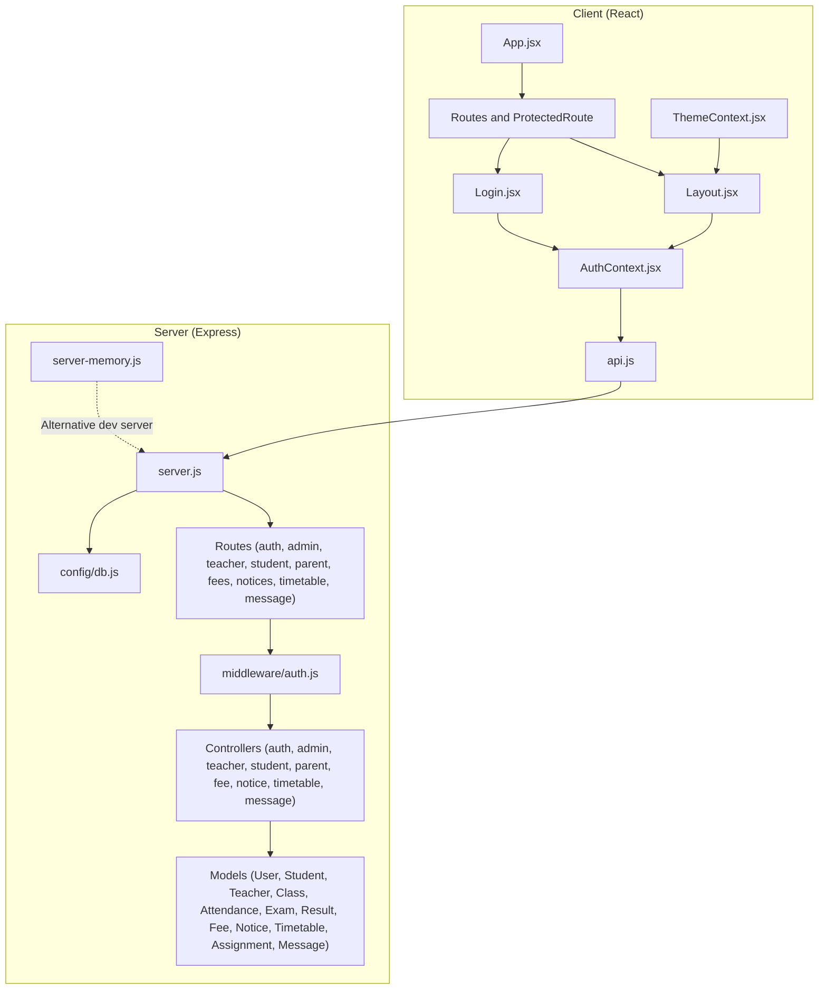
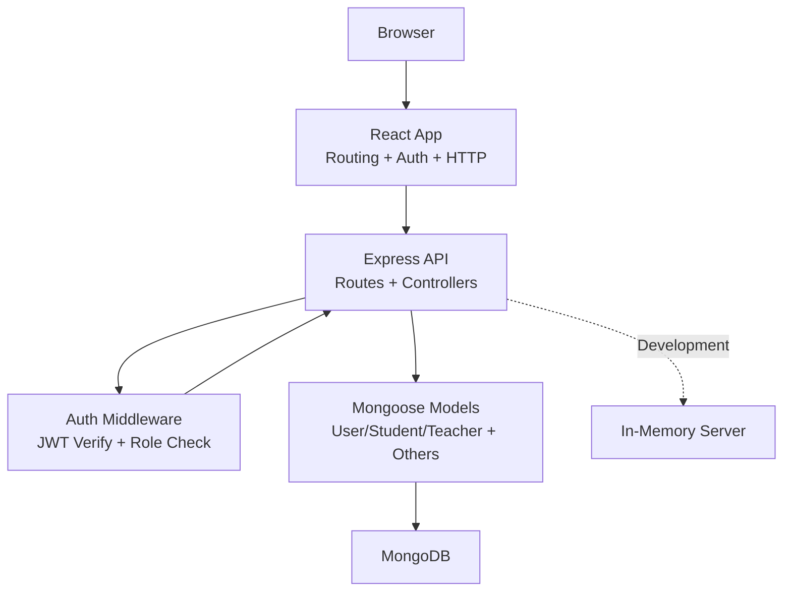
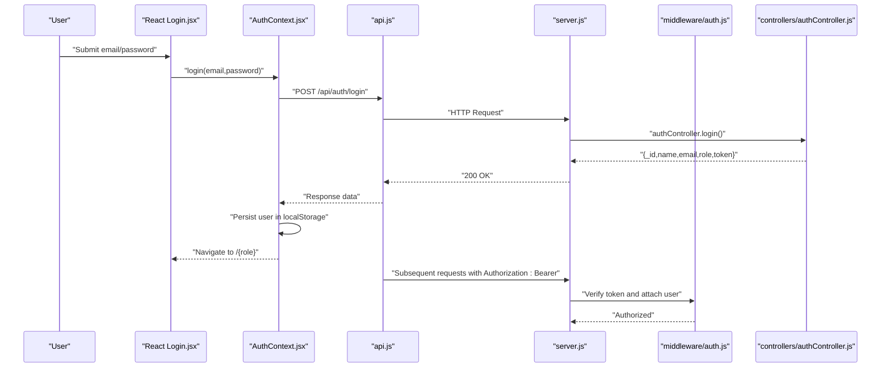
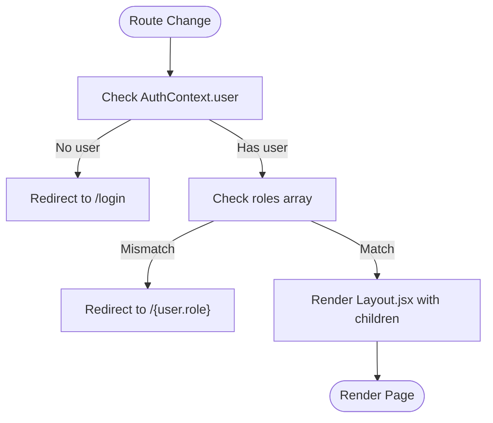
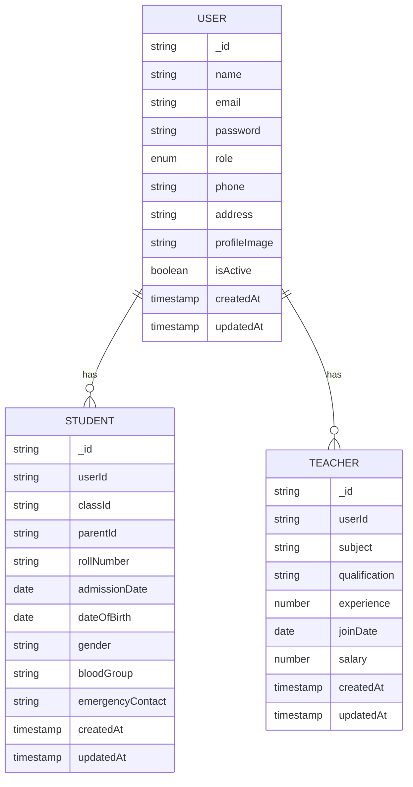
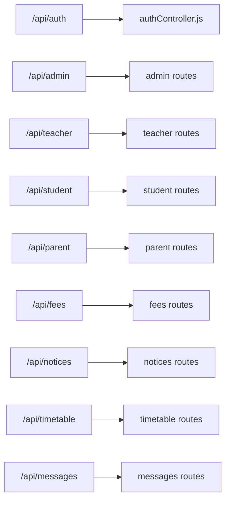
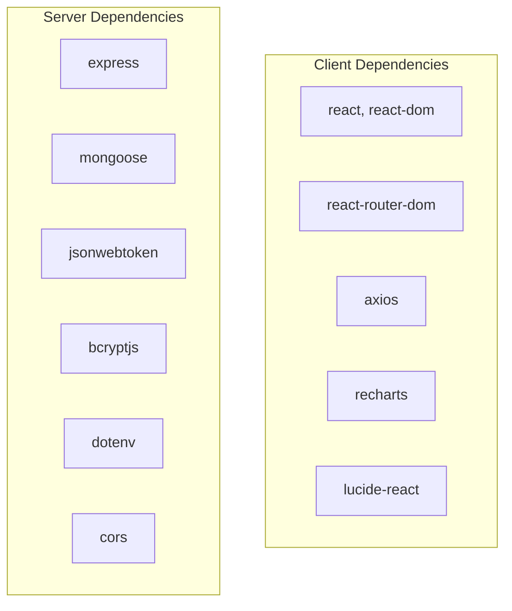

# Architecture Overview

<cite>
**Referenced Files in This Document**
- [client/package.json](file://client/package.json)
- [server/package.json](file://server/package.json)
- [client/src/App.jsx](file://client/src/App.jsx)
- [client/src/components/Layout.jsx](file://client/src/components/Layout.jsx)
- [client/src/pages/auth/Login.jsx](file://client/src/pages/auth/Login.jsx)
- [client/src/context/AuthContext.jsx](file://client/src/context/AuthContext.jsx)
- [client/src/context/ThemeContext.jsx](file://client/src/context/ThemeContext.jsx)
- [client/src/api.js](file://client/src/api.js)
- [server/server.js](file://server/server.js)
- [server/server-memory.js](file://server/server-memory.js)
- [server/config/db.js](file://server/config/db.js)
- [server/middleware/auth.js](file://server/middleware/auth.js)
- [server/controllers/authController.js](file://server/controllers/authController.js)
- [server/routes/auth.js](file://server/routes/auth.js)
- [server/routes/admin.js](file://server/routes/admin.js)
- [server/models/User.js](file://server/models/User.js)
- [server/models/Student.js](file://server/models/Student.js)
- [server/models/Teacher.js](file://server/models/Teacher.js)
</cite>

## Table of Contents
1. [Introduction](#introduction)
2. [Project Structure](#project-structure)
3. [Core Components](#core-components)
4. [Architecture Overview](#architecture-overview)
5. [Detailed Component Analysis](#detailed-component-analysis)
6. [Dependency Analysis](#dependency-analysis)
7. [Performance Considerations](#performance-considerations)
8. [Troubleshooting Guide](#troubleshooting-guide)
9. [Conclusion](#conclusion)

## Introduction
This document presents the architecture of the Educational Management System (EMS), a MERN-stack application designed to manage school operations across four user roles: admin, teacher, student, and parent. The system emphasizes a clean separation of concerns with a React-based frontend (client) and an Express-based backend (server). Authentication is JWT-based, with role-based access control enforced at the middleware level. Data persistence is supported via MongoDB using Mongoose in production and an in-memory mock for development and demos.

## Project Structure
The repository follows a clear front-end/back-end split:
- Client (React + Vite): Handles routing, UI, theme, authentication state, and HTTP requests.
- Server (Express + Node.js): Provides REST APIs, middleware for auth and roles, controllers, models, and routes.

**Diagram sources**
- [client/src/App.jsx:1-85](file://client/src/App.jsx#L1-L85)
- [client/src/components/Layout.jsx:1-143](file://client/src/components/Layout.jsx#L1-L143)
- [client/src/pages/auth/Login.jsx:1-100](file://client/src/pages/auth/Login.jsx#L1-L100)
- [client/src/context/AuthContext.jsx:1-53](file://client/src/context/AuthContext.jsx#L1-L53)
- [client/src/context/ThemeContext.jsx](file://client/src/context/ThemeContext.jsx)
- [client/src/api.js:1-28](file://client/src/api.js#L1-L28)
- [server/server.js:1-38](file://server/server.js#L1-L38)
- [server/server-memory.js:1-128](file://server/server-memory.js#L1-L128)
- [server/config/db.js:1-14](file://server/config/db.js#L1-L14)
- [server/middleware/auth.js:1-31](file://server/middleware/auth.js#L1-L31)
- [server/controllers/authController.js:1-107](file://server/controllers/authController.js#L1-L107)
- [server/routes/auth.js:1-13](file://server/routes/auth.js#L1-L13)
- [server/routes/admin.js:1-20](file://server/routes/admin.js#L1-L20)
- [server/models/User.js:1-27](file://server/models/User.js#L1-L27)
- [server/models/Student.js:1-16](file://server/models/Student.js#L1-L16)
- [server/models/Teacher.js:1-13](file://server/models/Teacher.js#L1-L13)

**Section sources**
- [client/package.json:1-34](file://client/package.json#L1-L34)
- [server/package.json:1-21](file://server/package.json#L1-L21)
- [client/src/App.jsx:1-85](file://client/src/App.jsx#L1-L85)
- [server/server.js:1-38](file://server/server.js#L1-L38)

## Core Components
- Client-side
  - Routing and protection: Centralized route configuration with a ProtectedRoute wrapper enforcing role-based navigation and layout injection.
  - Authentication context: Global state for user session, login/register/logout/update, persisted in localStorage.
  - HTTP client: Axios instance configured with base URL and automatic Authorization header injection; handles 401 redirects to login.
  - UI shell: Shared Layout component with role-specific menus, theme switching, and profile actions.
- Server-side
  - API bootstrap: Express app with CORS and JSON middleware; mounts routes under /api with base path.
  - Authentication middleware: Extracts Bearer tokens, verifies JWT, attaches user to request, and enforces role authorization.
  - Controllers: Implement business logic for auth, admin, teacher, student, parent, fees, notices, timetable, and messages.
  - Models: Define schemas for User, Student, Teacher, and related domain entities with pre-save hashing and helper methods.
  - Data layer: Production uses MongoDB via Mongoose; development/demo uses an in-memory server with deterministic IDs and token verification.

**Section sources**
- [client/src/App.jsx:18-84](file://client/src/App.jsx#L18-L84)
- [client/src/context/AuthContext.jsx:8-52](file://client/src/context/AuthContext.jsx#L8-L52)
- [client/src/api.js:3-28](file://client/src/api.js#L3-L28)
- [client/src/components/Layout.jsx:51-142](file://client/src/components/Layout.jsx#L51-L142)
- [server/server.js:14-37](file://server/server.js#L14-L37)
- [server/middleware/auth.js:4-30](file://server/middleware/auth.js#L4-L30)
- [server/controllers/authController.js:10-106](file://server/controllers/authController.js#L10-L106)
- [server/models/User.js:4-26](file://server/models/User.js#L4-L26)
- [server/models/Student.js:3-15](file://server/models/Student.js#L3-L15)
- [server/models/Teacher.js:3-12](file://server/models/Teacher.js#L3-L12)
- [server/server-memory.js:9-17](file://server/server-memory.js#L9-L17)

## Architecture Overview
The system adheres to a layered MERN architecture:
- Frontend (React)
  - Uses React Router for SPA navigation and protected routes.
  - Consumes REST endpoints via Axios with centralized interceptors.
  - Manages theme and authentication state globally.
- Backend (Express)
  - RESTful API organized by feature modules (/api/auth, /api/admin, etc.).
  - Middleware enforces authentication and role checks.
  - Controllers encapsulate business logic; models define data structures and validation hooks.
- Data Layer
  - Production: MongoDB/Mongoose for persistent storage.
  - Development: In-memory server simulating the same API surface for quick iteration.

**Diagram sources**
- [client/src/App.jsx:26-71](file://client/src/App.jsx#L26-L71)
- [client/src/api.js:8-25](file://client/src/api.js#L8-L25)
- [server/server.js:18-27](file://server/server.js#L18-L27)
- [server/middleware/auth.js:4-28](file://server/middleware/auth.js#L4-L28)
- [server/server-memory.js:23-89](file://server/server-memory.js#L23-L89)
- [server/config/db.js:3-11](file://server/config/db.js#L3-L11)

## Detailed Component Analysis

### Authentication and Session Flow
The authentication flow spans the client and server:
- Client
  - Login component posts credentials to /api/auth/login; on success, stores user payload and token in localStorage.
  - Axios interceptor injects Authorization: Bearer token for subsequent requests.
  - On 401 response, clears local storage and navigates to /login.
- Server
  - Auth controller validates credentials, checks activation, hashes passwords via bcrypt, and issues JWT.
  - Auth middleware extracts token from Authorization header, verifies signature, loads user without password, and enforces role-based authorization.

**Diagram sources**
- [client/src/pages/auth/Login.jsx:15-27](file://client/src/pages/auth/Login.jsx#L15-L27)
- [client/src/context/AuthContext.jsx:20-32](file://client/src/context/AuthContext.jsx#L20-L32)
- [client/src/api.js:8-25](file://client/src/api.js#L8-L25)
- [server/server.js:19-19](file://server/server.js#L19-L19)
- [server/middleware/auth.js:4-19](file://server/middleware/auth.js#L4-L19)
- [server/controllers/authController.js:31-59](file://server/controllers/authController.js#L31-L59)

**Section sources**
- [client/src/pages/auth/Login.jsx:15-27](file://client/src/pages/auth/Login.jsx#L15-L27)
- [client/src/context/AuthContext.jsx:20-45](file://client/src/context/AuthContext.jsx#L20-L45)
- [client/src/api.js:8-25](file://client/src/api.js#L8-L25)
- [server/controllers/authController.js:31-59](file://server/controllers/authController.js#L31-L59)
- [server/middleware/auth.js:4-19](file://server/middleware/auth.js#L4-L19)

### Role-Based Navigation and Layout
The client enforces role-based navigation and renders a shared layout per role. ProtectedRoute ensures unauthenticated users are redirected to /login and unauthorized roles are redirected to their own dashboard.

**Diagram sources**
- [client/src/App.jsx:18-24](file://client/src/App.jsx#L18-L24)
- [client/src/components/Layout.jsx:51-142](file://client/src/components/Layout.jsx#L51-L142)

**Section sources**
- [client/src/App.jsx:26-71](file://client/src/App.jsx#L26-L71)
- [client/src/components/Layout.jsx:11-49](file://client/src/components/Layout.jsx#L11-L49)

### Data Models and Relationships
The backend defines core entities and their relationships:
- User: Base entity with role enumeration and password hashing.
- Student: Links to User and Class; includes personal and enrollment details.
- Teacher: Links to User and includes professional details.

**Diagram sources**
- [server/models/User.js:4-13](file://server/models/User.js#L4-L13)
- [server/models/Student.js:3-13](file://server/models/Student.js#L3-L13)
- [server/models/Teacher.js:3-10](file://server/models/Teacher.js#L3-L10)

**Section sources**
- [server/models/User.js:4-26](file://server/models/User.js#L4-L26)
- [server/models/Student.js:3-15](file://server/models/Student.js#L3-L15)
- [server/models/Teacher.js:3-12](file://server/models/Teacher.js#L3-L12)

### API Surface and Module Boundaries
The server exposes feature-based modules under /api:
- Authentication: register, login, get profile, update profile, change password.
- Admin: dashboard stats, user CRUD, class CRUD, class-student listing, teacher assignment.
- Teacher: class listing, attendance marking and queries, exam/result management, assignments, notices.
- Student: attendance summary, results, fees, timetable, assignments, notices.
- Parent: child lookup, attendance summary, results, fees summary, notices.
- Fees: report filtering and payment marking.
- Notices: CRUD and listing.
- Timetable: listing and creation.
- Messages: unread count, chat history, send message.

**Diagram sources**
- [server/server.js:19-27](file://server/server.js#L19-L27)
- [server/routes/auth.js:1-13](file://server/routes/auth.js#L1-L13)
- [server/routes/admin.js:1-20](file://server/routes/admin.js#L1-L20)
- [server/server-memory.js:23-89](file://server/server-memory.js#L23-L89)

**Section sources**
- [server/server.js:19-27](file://server/server.js#L19-L27)
- [server/routes/auth.js:1-13](file://server/routes/auth.js#L1-L13)
- [server/routes/admin.js:1-20](file://server/routes/admin.js#L1-L20)
- [server/server-memory.js:23-89](file://server/server-memory.js#L23-L89)

## Dependency Analysis
- Client dependencies
  - React ecosystem and routing for SPA behavior.
  - Axios for HTTP requests and interceptors.
  - TailwindCSS via Vite plugin for styling.
- Server dependencies
  - Express for web server and routing.
  - Mongoose and MongoDB for production persistence.
  - jsonwebtoken for JWT signing/verification.
  - bcryptjs for password hashing.
  - dotenv for environment variables.
  - cors for cross-origin allowance.

**Diagram sources**
- [client/package.json:12-19](file://client/package.json#L12-L19)
- [server/package.json:11-19](file://server/package.json#L11-L19)

**Section sources**
- [client/package.json:12-32](file://client/package.json#L12-L32)
- [server/package.json:11-19](file://server/package.json#L11-L19)

## Performance Considerations
- Token-based stateless auth reduces server session overhead.
- Axios interceptors centralize auth logic and reduce repeated header handling.
- In-memory server simplifies local development but does not reflect production performance characteristics; use MongoDB for realistic benchmarks.
- Pagination and filtering are evident in admin user listing; similar patterns should be applied across other endpoints to avoid large payloads.

## Troubleshooting Guide
- 401 Unauthorized
  - Cause: Missing or invalid Bearer token.
  - Resolution: Re-authenticate; ensure Authorization header is set; verify token validity and expiration.
- 403 Forbidden
  - Cause: Insufficient role for requested endpoint.
  - Resolution: Verify user role; adjust navigation or route protection accordingly.
- Database connectivity
  - Cause: Incorrect MONGODB_URI or network issues.
  - Resolution: Confirm environment variable and connection string; switch to in-memory server for local testing.
- Demo accounts
  - Use the demo credentials provided in the Login component to quickly test role-based dashboards.

**Section sources**
- [client/src/api.js:16-25](file://client/src/api.js#L16-L25)
- [server/middleware/auth.js:10-18](file://server/middleware/auth.js#L10-L18)
- [server/server.js:7-10](file://server/server.js#L7-L10)
- [client/src/pages/auth/Login.jsx:87-94](file://client/src/pages/auth/Login.jsx#L87-L94)

## Conclusion
The Educational Management System employs a robust MERN architecture with clear separation between client and server, strong authentication and authorization, and modular API design. The use of JWT and role-based middleware ensures secure access, while the in-memory server enables rapid development and demonstration. Extending the system involves adding new routes, controllers, and models following the established patterns and maintaining consistent data flow and error handling.