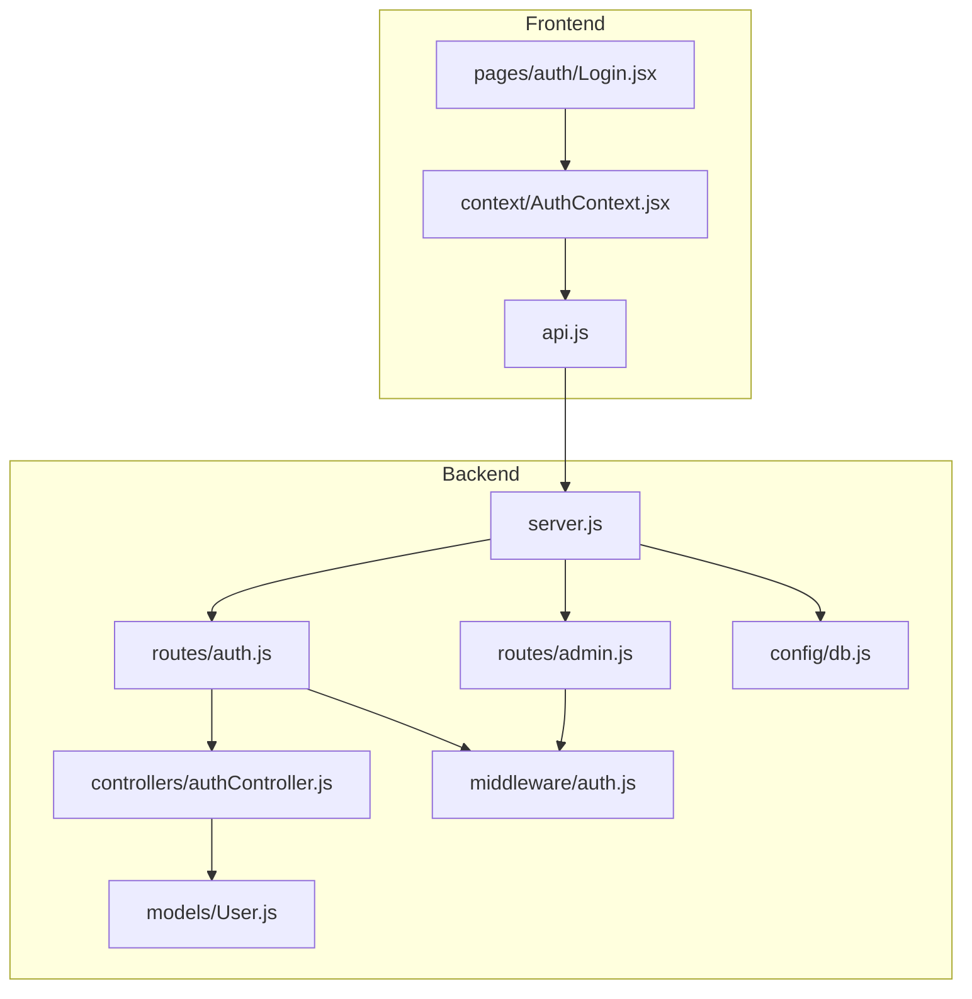
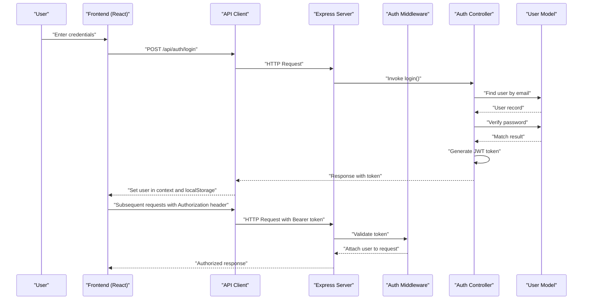
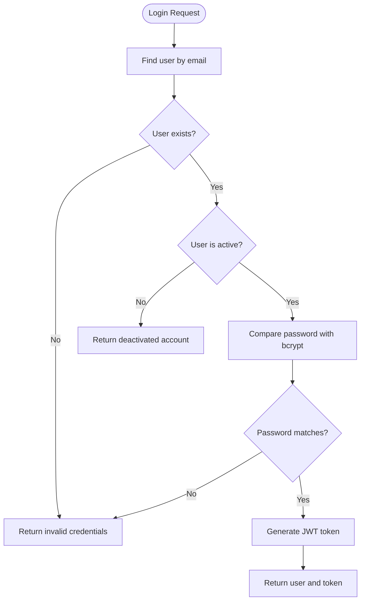
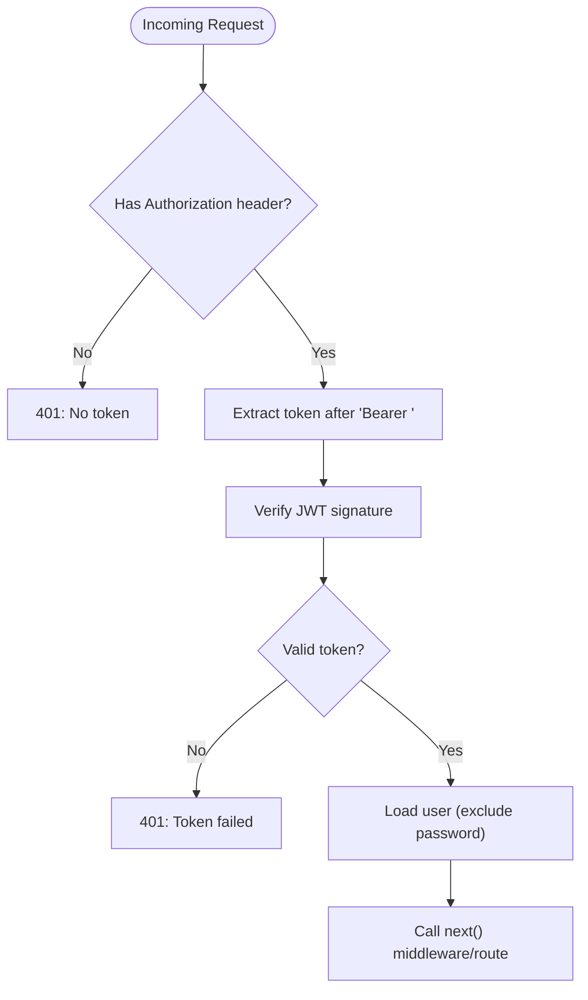
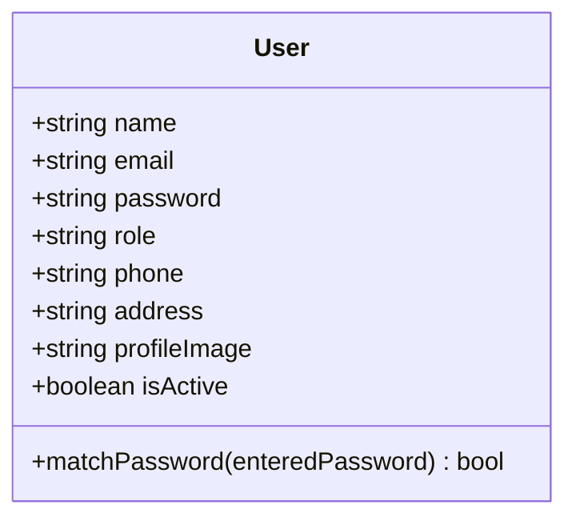
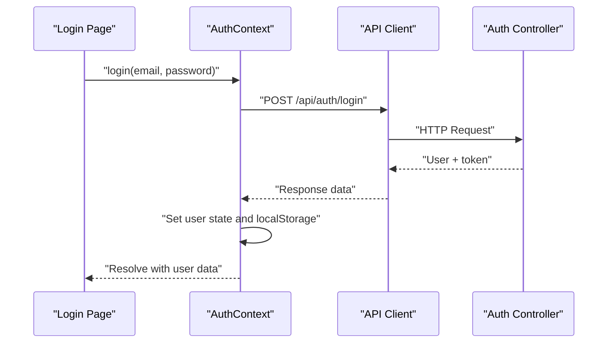
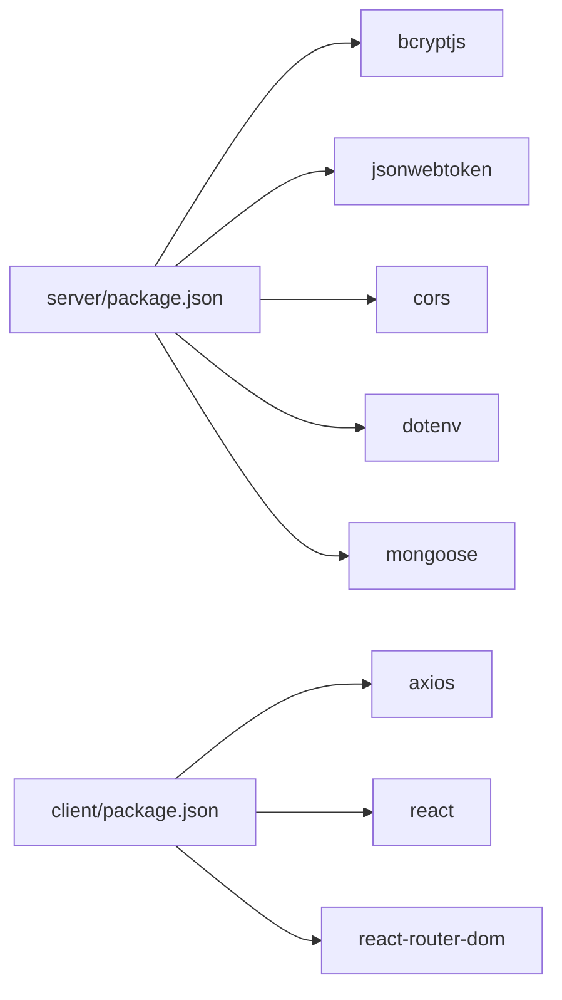

# Authentication System

<cite>
**Referenced Files in This Document**
- [authController.js](file://server/controllers/authController.js)
- [auth.js](file://server/middleware/auth.js)
- [User.js](file://server/models/User.js)
- [auth.js](file://server/routes/auth.js)
- [admin.js](file://server/routes/admin.js)
- [AuthContext.jsx](file://client/src/context/AuthContext.jsx)
- [api.js](file://client/src/api.js)
- [Login.jsx](file://client/src/pages/auth/Login.jsx)
- [server.js](file://server/server.js)
- [db.js](file://server/config/db.js)
- [package.json](file://server/package.json)
- [package.json](file://client/package.json)
</cite>

## Table of Contents
1. [Introduction](#introduction)
2. [Project Structure](#project-structure)
3. [Core Components](#core-components)
4. [Architecture Overview](#architecture-overview)
5. [Detailed Component Analysis](#detailed-component-analysis)
6. [Dependency Analysis](#dependency-analysis)
7. [Performance Considerations](#performance-considerations)
8. [Security Measures](#security-measures)
9. [Troubleshooting Guide](#troubleshooting-guide)
10. [Conclusion](#conclusion)

## Introduction
This document provides comprehensive authentication system documentation for the Educational Management System. It covers JWT-based authentication, token generation and validation, user session management, authentication middleware, protected route handling, role-based access control, login/logout workflows, password hashing strategies, and frontend state management. It also outlines security best practices, CSRF protection considerations, and secure communication protocols.

## Project Structure
The authentication system spans two primary areas:
- Backend (Node.js/Express): Controllers, middleware, models, routes, and server configuration
- Frontend (React): Authentication context, API client, and login page

**Diagram sources**
- [server.js:18-28](file://server/server.js#L18-L28)
- [auth.js:1-13](file://server/routes/auth.js#L1-L13)
- [admin.js:1-20](file://server/routes/admin.js#L1-L20)
- [authController.js:1-107](file://server/controllers/authController.js#L1-L107)
- [auth.js:1-31](file://server/middleware/auth.js#L1-L31)
- [User.js:1-27](file://server/models/User.js#L1-L27)
- [db.js:1-14](file://server/config/db.js#L1-L14)
- [AuthContext.jsx:1-53](file://client/src/context/AuthContext.jsx#L1-L53)
- [api.js:1-28](file://client/src/api.js#L1-L28)
- [Login.jsx:1-100](file://client/src/pages/auth/Login.jsx#L1-L100)

**Section sources**
- [server.js:18-28](file://server/server.js#L18-L28)
- [auth.js:1-13](file://server/routes/auth.js#L1-L13)
- [admin.js:1-20](file://server/routes/admin.js#L1-L20)
- [authController.js:1-107](file://server/controllers/authController.js#L1-L107)
- [auth.js:1-31](file://server/middleware/auth.js#L1-L31)
- [User.js:1-27](file://server/models/User.js#L1-L27)
- [db.js:1-14](file://server/config/db.js#L1-L14)
- [AuthContext.jsx:1-53](file://client/src/context/AuthContext.jsx#L1-L53)
- [api.js:1-28](file://client/src/api.js#L1-L28)
- [Login.jsx:1-100](file://client/src/pages/auth/Login.jsx#L1-L100)

## Core Components
- JWT Token Generation and Validation: Implemented in the authentication controller and middleware using JSON Web Tokens with secret and expiration configured via environment variables.
- Password Hashing: Uses bcryptjs to hash passwords during user creation and compare passwords during authentication.
- Authentication Middleware: Extracts Bearer tokens from Authorization headers, verifies JWT signatures, and attaches user information to requests.
- Role-Based Access Control: Middleware checks user roles against allowed roles for protected routes.
- Protected Routes: Authentication middleware wraps routes requiring login; authorization middleware restricts access by role.
- Frontend Authentication Context: Manages user state, persists to localStorage, and injects Authorization headers for API requests.
- API Client Interceptors: Automatically attaches JWT tokens to outgoing requests and handles 401 responses by clearing local state.

**Section sources**
- [authController.js:6-8](file://server/controllers/authController.js#L6-L8)
- [auth.js:4-19](file://server/middleware/auth.js#L4-L19)
- [auth.js:21-28](file://server/middleware/auth.js#L21-L28)
- [User.js:15-24](file://server/models/User.js#L15-L24)
- [auth.js:1-13](file://server/routes/auth.js#L1-L13)
- [admin.js:6-17](file://server/routes/admin.js#L6-L17)
- [AuthContext.jsx:20-37](file://client/src/context/AuthContext.jsx#L20-L37)
- [api.js:8-25](file://client/src/api.js#L8-L25)

## Architecture Overview
The authentication architecture follows a layered design:
- Client-side React application manages user sessions and sends authenticated requests.
- Express server exposes authentication endpoints and protected routes.
- Middleware validates tokens and enforces role-based access.
- MongoDB stores user records with hashed passwords.

**Diagram sources**
- [Login.jsx:15-27](file://client/src/pages/auth/Login.jsx#L15-L27)
- [api.js:8-14](file://client/src/api.js#L8-L14)
- [auth.js:4-19](file://server/middleware/auth.js#L4-L19)
- [authController.js:31-59](file://server/controllers/authController.js#L31-L59)
- [User.js:15-24](file://server/models/User.js#L15-L24)

## Detailed Component Analysis

### Backend Authentication Controller
Responsibilities:
- Register new users and issue JWT tokens
- Authenticate users, verify credentials, and issue JWT tokens
- Retrieve current user profile with role-specific data
- Update user profile and change password

Key behaviors:
- Token generation uses a secret and expiration from environment variables
- Password verification uses bcrypt comparison
- Profile retrieval augments base user info with role-specific profiles

**Diagram sources**
- [authController.js:31-59](file://server/controllers/authController.js#L31-L59)
- [User.js:22-24](file://server/models/User.js#L22-L24)

**Section sources**
- [authController.js:10-29](file://server/controllers/authController.js#L10-L29)
- [authController.js:31-59](file://server/controllers/authController.js#L31-L59)
- [authController.js:61-76](file://server/controllers/authController.js#L61-L76)
- [authController.js:78-106](file://server/controllers/authController.js#L78-L106)

### Authentication Middleware
Responsibilities:
- Extract Bearer token from Authorization header
- Verify JWT signature using shared secret
- Attach user object (without password) to request context
- Enforce role-based access via authorize higher-order function

**Diagram sources**
- [auth.js:4-19](file://server/middleware/auth.js#L4-L19)

**Section sources**
- [auth.js:4-19](file://server/middleware/auth.js#L4-L19)
- [auth.js:21-28](file://server/middleware/auth.js#L21-L28)

### User Model and Password Hashing
Responsibilities:
- Define user schema with role enumeration and validation
- Hash passwords before saving using bcrypt
- Provide method to compare entered passwords with stored hash

**Diagram sources**
- [User.js:4-24](file://server/models/User.js#L4-L24)

**Section sources**
- [User.js:4-24](file://server/models/User.js#L4-L24)

### Protected Routes and RBAC
- Authentication middleware protects routes under /api/auth/me, /api/auth/profile, and /api/auth/change-password
- Authorization middleware restricts administrative routes to 'admin' role
- Some routes additionally allow 'teacher' role (e.g., fetching class students)

**Section sources**
- [auth.js:1-13](file://server/routes/auth.js#L1-L13)
- [admin.js:6-17](file://server/routes/admin.js#L6-L17)

### Frontend Authentication Context
Responsibilities:
- Initialize user state from localStorage on mount
- Provide login, register, logout, and updateProfile functions
- Persist user state to localStorage after mutations
- Navigate to role-specific dashboards post-login

**Diagram sources**
- [Login.jsx:15-27](file://client/src/pages/auth/Login.jsx#L15-L27)
- [AuthContext.jsx:20-32](file://client/src/context/AuthContext.jsx#L20-L32)

**Section sources**
- [AuthContext.jsx:8-52](file://client/src/context/AuthContext.jsx#L8-L52)
- [Login.jsx:15-27](file://client/src/pages/auth/Login.jsx#L15-L27)

### API Client and Interceptors
Responsibilities:
- Configure base URL and content-type headers
- Inject Authorization header with Bearer token from localStorage
- On 401 response, clear user state and redirect to login

**Section sources**
- [api.js:3-6](file://client/src/api.js#L3-L6)
- [api.js:8-14](file://client/src/api.js#L8-L14)
- [api.js:16-25](file://client/src/api.js#L16-L25)

### Server Initialization and Routing
Responsibilities:
- Load environment variables
- Connect to MongoDB
- Enable CORS and JSON parsing
- Mount authentication and role-specific routes

**Section sources**
- [server.js:6-16](file://server/server.js#L6-L16)
- [server.js:18-28](file://server/server.js#L18-L28)
- [db.js:3-11](file://server/config/db.js#L3-L11)

## Dependency Analysis
External libraries and their roles:
- bcryptjs: Password hashing and verification
- jsonwebtoken: JWT signing and verification
- cors: Cross-origin resource sharing
- dotenv: Environment variable loading
- mongoose: MongoDB ODM
- axios: HTTP client for frontend
- express: Web framework

**Diagram sources**
- [package.json:11-19](file://server/package.json#L11-L19)
- [package.json:12-19](file://client/package.json#L12-L19)

**Section sources**
- [package.json:11-19](file://server/package.json#L11-L19)
- [package.json:12-19](file://client/package.json#L12-L19)

## Performance Considerations
- Token Expiration: Configure appropriate expiration to balance security and UX; shorter expirations reduce risk but increase re-authentication frequency.
- Password Hashing Cost: bcrypt cost factor is set internally; monitor database performance under load.
- Middleware Efficiency: Keep token verification minimal; avoid unnecessary database reads.
- Frontend Caching: Persist user state locally to prevent redundant fetches; invalidate on logout.
- Network Calls: Debounce login attempts and avoid repeated requests until previous ones resolve.

## Security Measures
- JWT Secret and Expiration: Ensure secrets are strong and stored securely; configure expiration appropriately.
- HTTPS Enforcement: Serve over HTTPS to protect tokens in transit.
- Secure Storage: Store tokens only in memory or secure, httpOnly cookies if backend supports it; the current implementation stores tokens in localStorage.
- CSRF Protection: Implement CSRF tokens for state-changing requests; consider SameSite cookies and Origin/CORS policies.
- Input Validation: Validate and sanitize all inputs on both client and server.
- Rate Limiting: Apply rate limiting on authentication endpoints to mitigate brute-force attacks.
- Audit Logs: Log authentication events for monitoring and incident response.
- Least Privilege: Enforce role-based access control strictly; avoid leaking sensitive data.

## Troubleshooting Guide
Common issues and resolutions:
- 401 Not Authorized (No Token): Ensure Authorization header is present and formatted as "Bearer <token>".
- 401 Token Failed: Verify JWT secret and expiration; confirm token was signed by the server.
- Invalid Credentials: Confirm email exists and password matches; check account activation status.
- 403 Role Not Authorized: Verify user role matches required role(s) for the route.
- Persistent Session Issues: Clear browser storage and re-login; ensure localStorage is not corrupted.
- CORS Errors: Confirm CORS configuration allows frontend origin and necessary headers.

**Section sources**
- [auth.js:10-18](file://server/middleware/auth.js#L10-L18)
- [authController.js:35-44](file://server/controllers/authController.js#L35-L44)
- [api.js:19-23](file://client/src/api.js#L19-L23)

## Conclusion
The Educational Management System implements a robust JWT-based authentication system with clear separation of concerns between frontend and backend. The backend provides secure token generation, validation, and role-based access control, while the frontend manages user state and request authorization seamlessly. By adhering to security best practices—such as HTTPS enforcement, CSRF protection, secure storage, and strict RBAC—the system maintains a strong security posture suitable for an educational environment.