# Backend Architecture

<cite>
**Referenced Files in This Document**
- [server.js](file://server/server.js)
- [package.json](file://server/package.json)
- [auth.js](file://server/middleware/auth.js)
- [db.js](file://server/config/db.js)
- [authController.js](file://server/controllers/authController.js)
- [auth.js](file://server/routes/auth.js)
- [admin.js](file://server/routes/admin.js)
- [teacher.js](file://server/routes/teacher.js)
- [student.js](file://server/routes/student.js)
- [parent.js](file://server/routes/parent.js)
- [server-memory.js](file://server/server-memory.js)
- [adminController.js](file://server/controllers/adminController.js)
- [User.js](file://server/models/User.js)
- [Student.js](file://server/models/Student.js)
- [Teacher.js](file://server/models/Teacher.js)
</cite>

## Table of Contents
1. [Introduction](#introduction)
2. [Project Structure](#project-structure)
3. [Core Components](#core-components)
4. [Architecture Overview](#architecture-overview)
5. [Detailed Component Analysis](#detailed-component-analysis)
6. [Dependency Analysis](#dependency-analysis)
7. [Performance Considerations](#performance-considerations)
8. [Troubleshooting Guide](#troubleshooting-guide)
9. [Conclusion](#conclusion)
10. [Appendices](#appendices)

## Introduction
This document describes the backend architecture of the Educational Management System built with Node.js and Express.js. It covers server initialization, middleware implementation, modular routing for distinct user roles (admin, teacher, student, parent), authentication and authorization mechanisms, request processing pipeline, error handling, server configuration, environment setup, development versus production differences, and API design patterns including request validation and response formatting.

## Project Structure
The server follows a layered architecture:
- Entry point initializes Express, loads environment variables, connects to the database, registers middleware, mounts routes, and starts the HTTP server.
- Modular routing organizes endpoints by functional domain and role.
- Controllers encapsulate business logic and coordinate model interactions.
- Middleware enforces authentication and role-based authorization.
- Models define data schemas and pre-save hooks for hashing passwords.
- Two server modes are supported: MongoDB-backed and in-memory for quick local development.

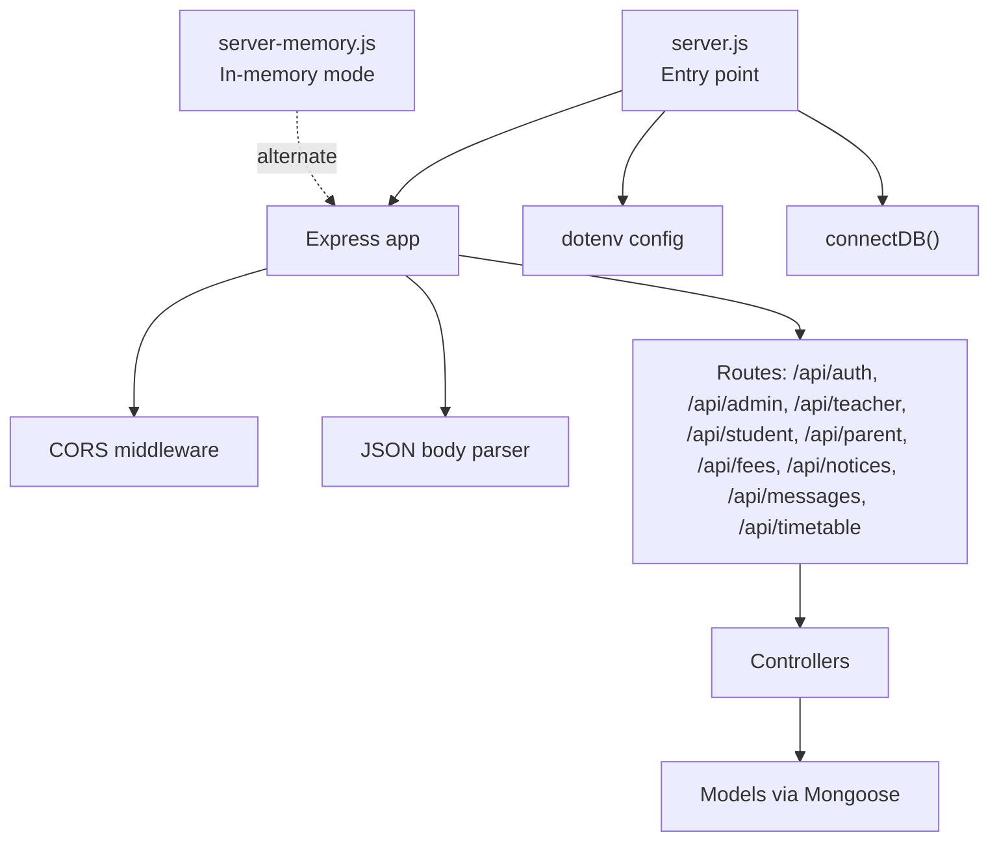

**Diagram sources**
- [server.js:1-38](file://server/server.js#L1-L38)
- [server-memory.js:1-128](file://server/server-memory.js#L1-L128)

**Section sources**
- [server.js:1-38](file://server/server.js#L1-L38)
- [package.json:1-21](file://server/package.json#L1-L21)

## Core Components
- Express server bootstrap and middleware stack
- Environment configuration and database connection
- Role-based authentication and authorization middleware
- Modular route registration per role/domain
- Controller functions implementing CRUD and domain logic
- Data models with password hashing and virtual profiles
- Dual server modes: MongoDB-backed and in-memory

Key implementation references:
- Server bootstrap and route mounting: [server.js:12-27](file://server/server.js#L12-L27)
- Environment loading and health endpoint: [server.js:6-32](file://server/server.js#L6-L32)
- Database connection: [db.js:3-11](file://server/config/db.js#L3-L11)
- Authentication middleware: [auth.js:4-19](file://server/middleware/auth.js#L4-L19)
- Authorization helper: [auth.js:21-28](file://server/middleware/auth.js#L21-L28)
- Auth controller actions: [authController.js:10-107](file://server/controllers/authController.js#L10-L107)
- Route definitions per module: [auth.js:6-10](file://server/routes/auth.js#L6-L10), [admin.js:6-17](file://server/routes/admin.js#L6-L17), [teacher.js:6-17](file://server/routes/teacher.js#L6-L17), [student.js:6-11](file://server/routes/student.js#L6-L11), [parent.js:6-10](file://server/routes/parent.js#L6-L10)
- In-memory server and token helpers: [server-memory.js:15-21](file://server/server-memory.js#L15-L21), [server-memory.js:24-27](file://server/server-memory.js#L24-L27)
- Models and password hashing: [User.js:15-24](file://server/models/User.js#L15-L24), [Student.js:3-13](file://server/models/Student.js#L3-L13), [Teacher.js:3-10](file://server/models/Teacher.js#L3-L10)

**Section sources**
- [server.js:1-38](file://server/server.js#L1-L38)
- [db.js:1-14](file://server/config/db.js#L1-L14)
- [auth.js:1-31](file://server/middleware/auth.js#L1-L31)
- [authController.js:1-107](file://server/controllers/authController.js#L1-L107)
- [auth.js:1-13](file://server/routes/auth.js#L1-L13)
- [admin.js:1-20](file://server/routes/admin.js#L1-L20)
- [teacher.js:1-20](file://server/routes/teacher.js#L1-L20)
- [student.js:1-14](file://server/routes/student.js#L1-L14)
- [parent.js:1-13](file://server/routes/parent.js#L1-L13)
- [server-memory.js:1-128](file://server/server-memory.js#L1-L128)
- [User.js:1-27](file://server/models/User.js#L1-L27)
- [Student.js:1-16](file://server/models/Student.js#L1-L16)
- [Teacher.js:1-13](file://server/models/Teacher.js#L1-L13)

## Architecture Overview
The system employs a clean separation of concerns:
- Entry point initializes the app, loads environment variables, connects to the database, and registers middleware.
- Routes are mounted under /api with role-specific prefixes (/api/auth, /api/admin, /api/teacher, /api/student, /api/parent) and domain-specific prefixes (/api/fees, /api/notices, /api/messages, /api/timetable).
- Controllers handle request logic and interact with models.
- Middleware enforces authentication via JWT and role-based authorization.
- Models define schemas and enforce data integrity and password hashing.

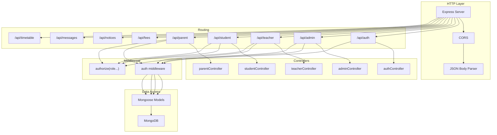

**Diagram sources**
- [server.js:12-27](file://server/server.js#L12-L27)
- [auth.js:3-4](file://server/routes/auth.js#L3-L4)
- [admin.js:3-4](file://server/routes/admin.js#L3-L4)
- [teacher.js:3-4](file://server/routes/teacher.js#L3-L4)
- [student.js:3-4](file://server/routes/student.js#L3-L4)
- [parent.js:3-4](file://server/routes/parent.js#L3-L4)
- [auth.js:4](file://server/middleware/auth.js#L4-L19)
- [auth.js:21-28](file://server/middleware/auth.js#L21-L28)
- [User.js:15-24](file://server/models/User.js#L15-L24)

## Detailed Component Analysis

### Authentication and Authorization Middleware
- Token extraction from Authorization header (Bearer scheme).
- JWT verification using a secret from environment variables.
- User lookup by decoded ID and population of user object without password.
- Role-based authorization guard that checks allowed roles against the authenticated user’s role.
- Error responses consistently return 401 for missing/invalid tokens and 403 for insufficient permissions.

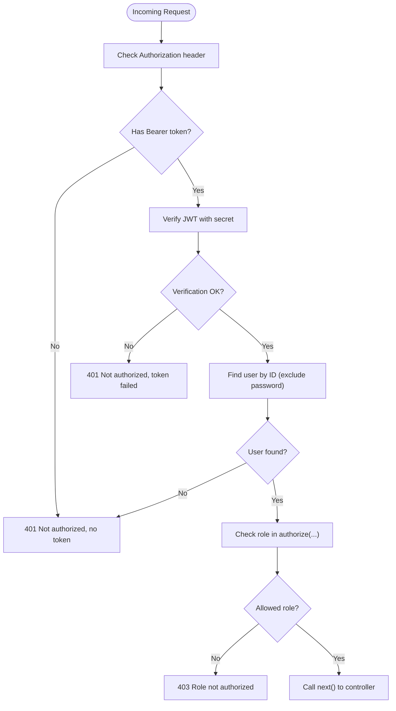

**Diagram sources**
- [auth.js:4-19](file://server/middleware/auth.js#L4-L19)
- [auth.js:21-28](file://server/middleware/auth.js#L21-L28)

**Section sources**
- [auth.js:1-31](file://server/middleware/auth.js#L1-L31)

### Authentication Controller
- Registers new users after checking uniqueness and saving with hashed password.
- Logs in users, verifies password, and returns a signed JWT.
- Retrieves authenticated user profile, augmenting with role-specific profiles for students and teachers.
- Updates profile fields and changes password with current password validation.

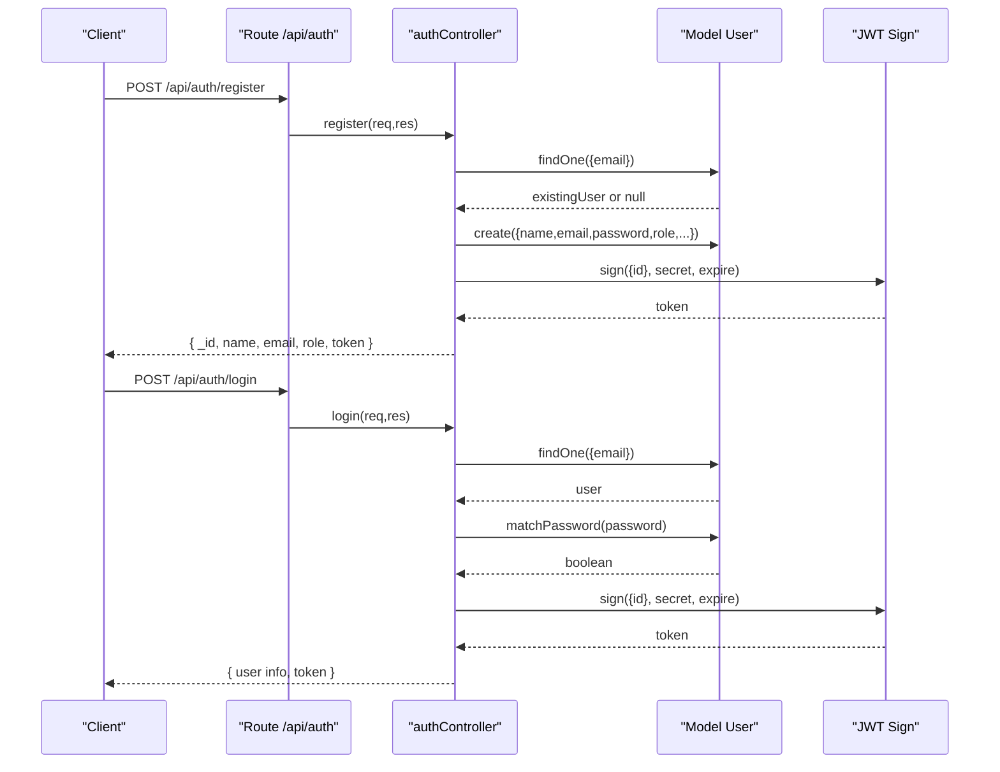

**Diagram sources**
- [authController.js:10-59](file://server/controllers/authController.js#L10-L59)
- [auth.js:3-4](file://server/routes/auth.js#L3-L4)

**Section sources**
- [authController.js:1-107](file://server/controllers/authController.js#L1-L107)
- [auth.js:1-13](file://server/routes/auth.js#L1-L13)

### Admin Module
- Dashboard statistics aggregation across users, classes, and counts grouped by role.
- User management: list with filtering/search/pagination, fetch by ID with role-specific profile augmentation, create with embedded student/teacher profiles, update, delete.
- Class management: list, create, update, delete, get class students, assign teacher to class.

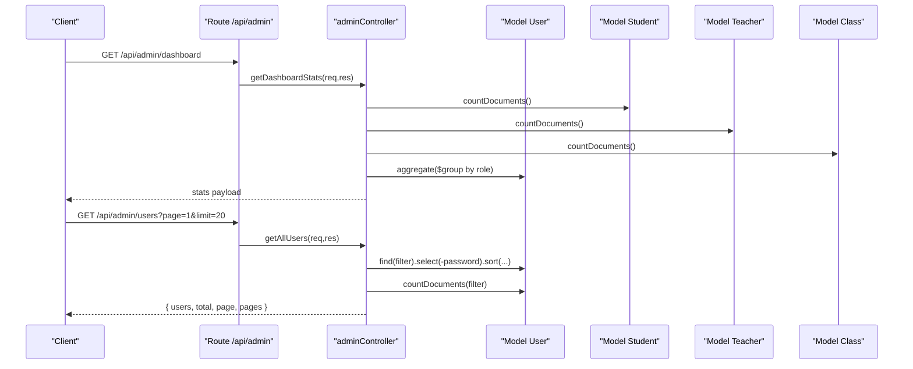

**Diagram sources**
- [adminController.js:6-37](file://server/controllers/adminController.js#L6-L37)
- [admin.js:6-17](file://server/routes/admin.js#L6-L17)

**Section sources**
- [adminController.js:1-158](file://server/controllers/adminController.js#L1-L158)
- [admin.js:1-20](file://server/routes/admin.js#L1-L20)

### Teacher Module
- Attendance: mark attendance records, fetch class attendance, monthly summary.
- Examinations: create exams, fetch class exams.
- Results: upload results, fetch exam results.
- Assignments: create, list by class, delete.
- Notices: create notices.
- Class enrollment: list teacher’s classes.

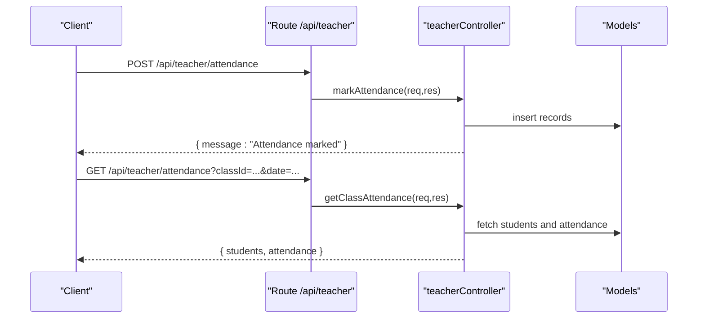

**Diagram sources**
- [teacher.js:6-17](file://server/routes/teacher.js#L6-L17)

**Section sources**
- [teacher.js:1-20](file://server/routes/teacher.js#L1-L20)

### Student Module
- View personal attendance, results, timetable, assignments, notices, and fees.

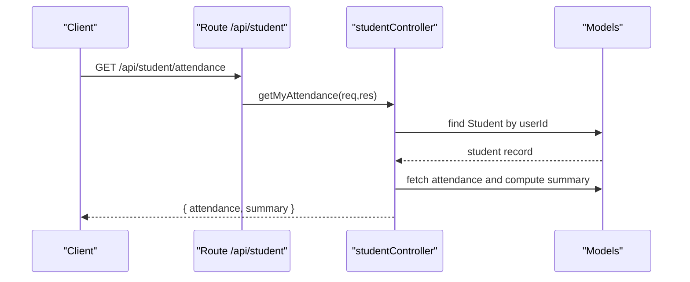

**Diagram sources**
- [student.js:6-11](file://server/routes/student.js#L6-L11)

**Section sources**
- [student.js:1-14](file://server/routes/student.js#L1-L14)

### Parent Module
- Retrieve child information, child’s attendance, results, fees, and notices.

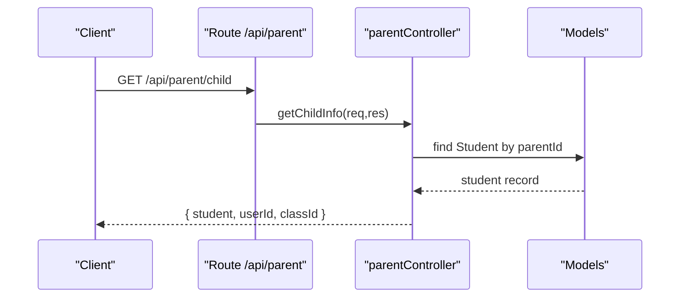

**Diagram sources**
- [parent.js:6-10](file://server/routes/parent.js#L6-L10)

**Section sources**
- [parent.js:1-13](file://server/routes/parent.js#L1-L13)

### Data Models and Password Hashing
- User schema defines common attributes and includes a pre-save hook to hash passwords and a method to compare passwords.
- Student and Teacher schemas embed ObjectId references to User and define role-specific fields.
- These models are used by controllers to persist and retrieve data.

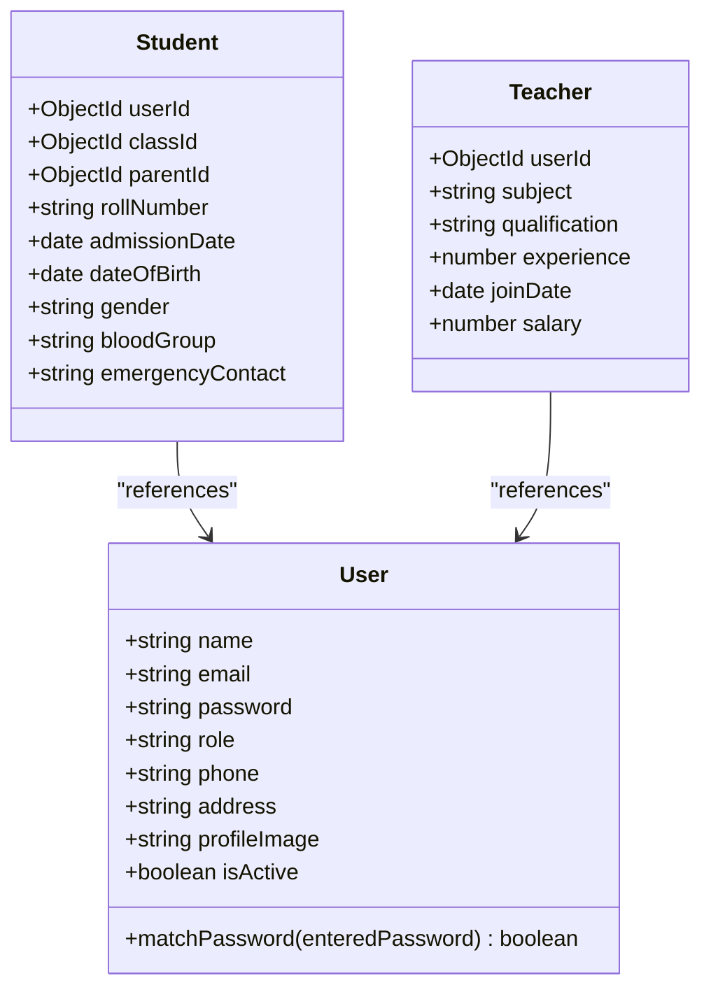

**Diagram sources**
- [User.js:4-24](file://server/models/User.js#L4-L24)
- [Student.js:3-13](file://server/models/Student.js#L3-L13)
- [Teacher.js:3-10](file://server/models/Teacher.js#L3-L10)

**Section sources**
- [User.js:1-27](file://server/models/User.js#L1-L27)
- [Student.js:1-16](file://server/models/Student.js#L1-L16)
- [Teacher.js:1-13](file://server/models/Teacher.js#L1-L13)

### Server Configuration and Modes
- Environment variables loaded via dotenv.
- Database connection established using Mongoose with URI from environment.
- Health check endpoint exposed at /api/health.
- Two server modes:
  - MongoDB-backed: server.js connects to MongoDB and exposes routes.
  - In-memory: server-memory.js runs without external DB, simulating endpoints and token verification.

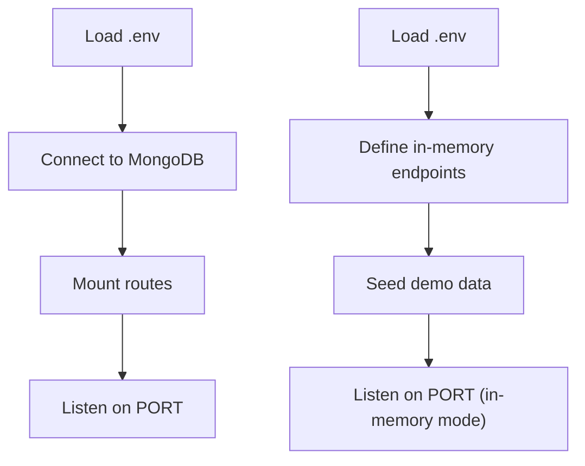

**Diagram sources**
- [server.js:6-10](file://server/server.js#L6-L10)
- [db.js:3-11](file://server/config/db.js#L3-L11)
- [server.js:34-37](file://server/server.js#L34-L37)
- [server-memory.js:91-127](file://server/server-memory.js#L91-L127)

**Section sources**
- [server.js:1-38](file://server/server.js#L1-L38)
- [db.js:1-14](file://server/config/db.js#L1-L14)
- [server-memory.js:1-128](file://server/server-memory.js#L1-L128)
- [package.json:6-10](file://server/package.json#L6-L10)

## Dependency Analysis
- Entry point depends on dotenv, database connector, and route modules.
- Routes depend on controllers and the auth middleware.
- Controllers depend on models and expose domain logic.
- Middleware depends on JWT and the User model.
- Models depend on Mongoose and bcrypt for hashing.

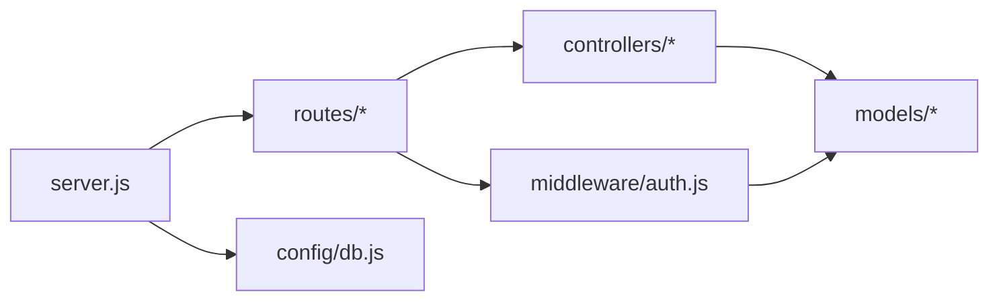

**Diagram sources**
- [server.js:12-27](file://server/server.js#L12-L27)
- [auth.js:1-31](file://server/middleware/auth.js#L1-L31)

**Section sources**
- [server.js:1-38](file://server/server.js#L1-L38)
- [auth.js:1-31](file://server/middleware/auth.js#L1-L31)

## Performance Considerations
- Prefer pagination for listing endpoints to avoid large payloads.
- Use selective field projections (avoid returning passwords) to reduce response sizes.
- Index frequently queried fields (e.g., email, role) in models.
- Offload heavy aggregations to database queries rather than in-memory processing.
- Cache static or infrequently changing data where appropriate.
- Monitor token verification costs; keep JWT secret secure and rotate as needed.

## Troubleshooting Guide
Common issues and resolutions:
- Missing or invalid Authorization header: Ensure requests include a Bearer token.
- Token verification failure: Confirm JWT_SECRET is set and matches the signing secret.
- Insufficient permissions: Verify the authenticated user’s role matches the route’s allowed roles.
- Database connection errors: Check MONGODB_URI and network connectivity.
- Health check failures: Confirm the /api/health endpoint is reachable and mode-specific logs indicate successful startup.

**Section sources**
- [auth.js:10-18](file://server/middleware/auth.js#L10-L18)
- [auth.js:23-26](file://server/middleware/auth.js#L23-L26)
- [db.js:7-10](file://server/config/db.js#L7-L10)
- [server.js:30-32](file://server/server.js#L30-L32)

## Conclusion
The backend follows a modular, layered architecture with clear separation between routing, controllers, middleware, and data access. Role-based authentication and authorization are enforced consistently across routes. The system supports both MongoDB-backed and in-memory modes for flexible deployment and development. Adhering to the documented patterns ensures maintainability, scalability, and predictable behavior across environments.

## Appendices

### API Design Patterns and Standards
- Request validation: Validate presence and types of required fields in controllers before database operations.
- Response formatting: Standardize success responses with consistent keys and error responses with clear messages and appropriate HTTP status codes.
- Pagination: Use query parameters for page and limit to control result sets.
- Filtering and search: Support query filters and regex-based search for user listings.
- Role scoping: Apply authorize(role...) guards to restrict access to sensitive endpoints.

### Environment Setup
- Required environment variables:
  - MONGODB_URI for MongoDB connection.
  - JWT_SECRET for signing tokens.
  - JWT_EXPIRE for token expiry duration.
- Scripts:
  - start: Run in-memory server.
  - start:mongo: Run MongoDB-backed server.
  - seed: Populate initial data for development.

**Section sources**
- [package.json:6-10](file://server/package.json#L6-L10)
- [server.js:6-7](file://server/server.js#L6-L7)
- [server-memory.js:15](file://server/server-memory.js#L15)