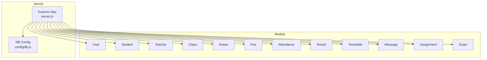
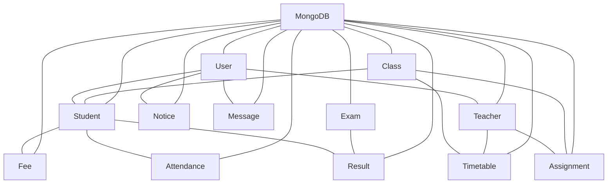
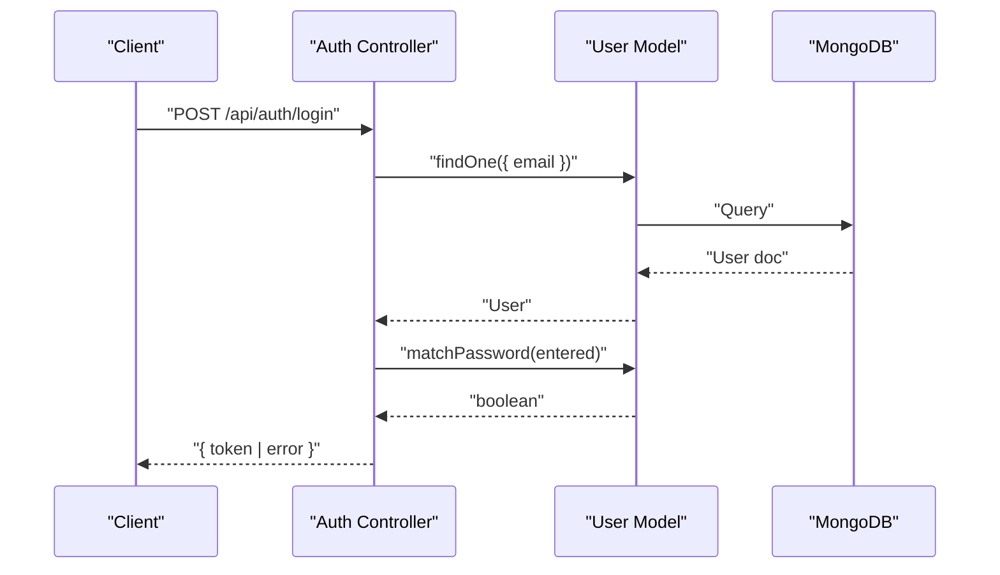
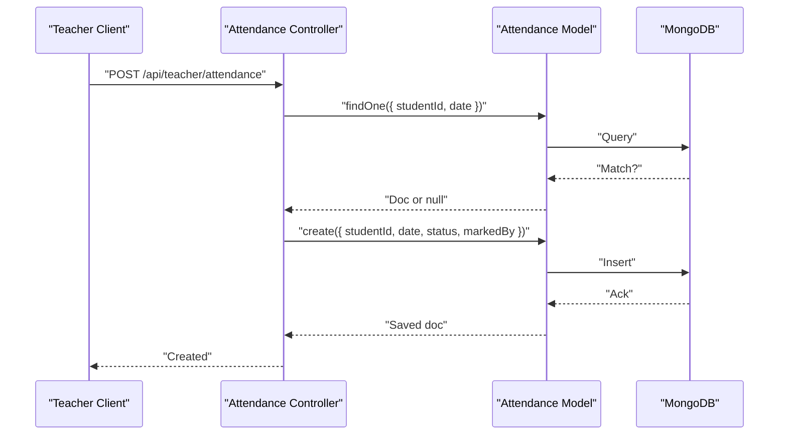
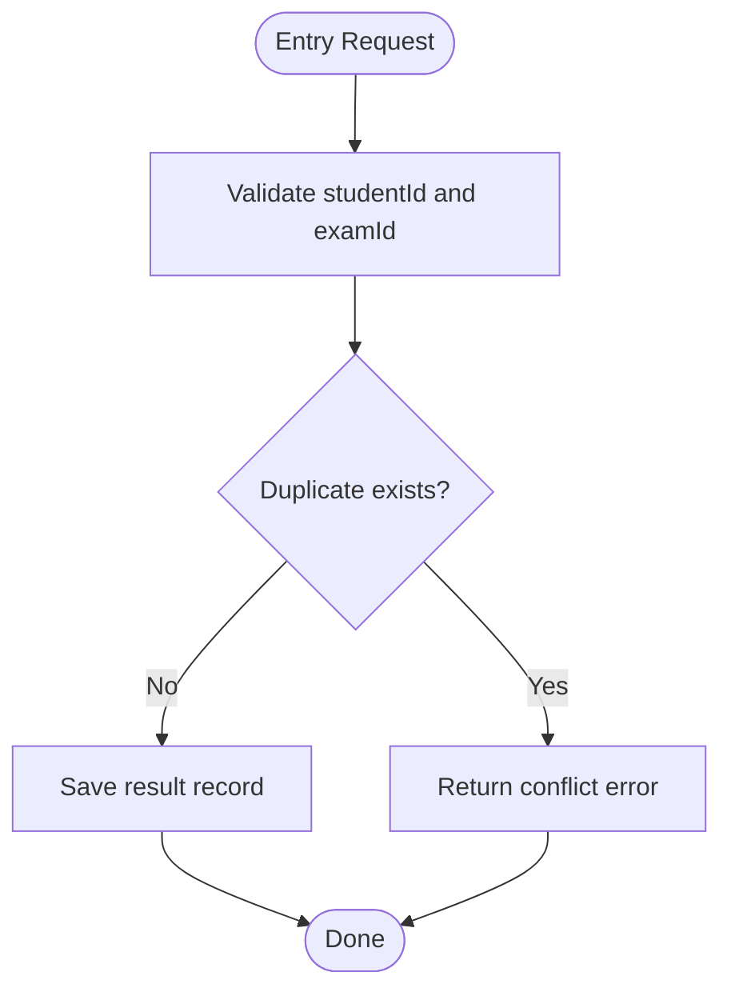
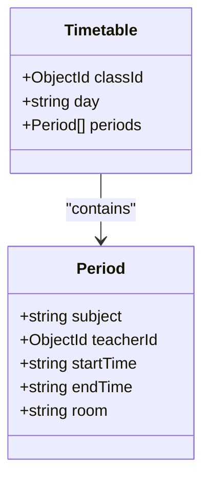
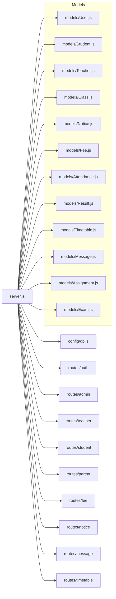

# Database Design

<cite>
**Referenced Files in This Document**
- [server.js](file://server/server.js)
- [db.js](file://server/config/db.js)
- [User.js](file://server/models/User.js)
- [Student.js](file://server/models/Student.js)
- [Teacher.js](file://server/models/Teacher.js)
- [Class.js](file://server/models/Class.js)
- [Notice.js](file://server/models/Notice.js)
- [Fee.js](file://server/models/Fee.js)
- [Attendance.js](file://server/models/Attendance.js)
- [Result.js](file://server/models/Result.js)
- [Timetable.js](file://server/models/Timetable.js)
- [Message.js](file://server/models/Message.js)
- [Assignment.js](file://server/models/Assignment.js)
- [Exam.js](file://server/models/Exam.js)
</cite>

## Table of Contents
1. [Introduction](#introduction)
2. [Project Structure](#project-structure)
3. [Core Components](#core-components)
4. [Architecture Overview](#architecture-overview)
5. [Detailed Component Analysis](#detailed-component-analysis)
6. [Dependency Analysis](#dependency-analysis)
7. [Performance Considerations](#performance-considerations)
8. [Troubleshooting Guide](#troubleshooting-guide)
9. [Conclusion](#conclusion)
10. [Appendices](#appendices)

## Introduction
This document describes the MongoDB database design for the Educational Management System. It focuses on the schema definitions, entity relationships, indexing strategies, and operational patterns implemented in the backend models. The design leverages Mongoose ODM and uses explicit ObjectId references to establish relationships between entities. Validation rules, encryption for sensitive data, and common query patterns are documented to guide development and maintenance.

## Project Structure
The database design is encapsulated in the server-side models under the models directory. Each model defines a Mongoose schema and exports a model for a specific domain entity. The server connects to MongoDB via a dedicated connection module and exposes REST endpoints routed through Express.



**Diagram sources**
- [server.js:1-38](file://server/server.js#L1-L38)
- [db.js:1-14](file://server/config/db.js#L1-L14)
- [User.js:1-27](file://server/models/User.js#L1-L27)
- [Student.js:1-16](file://server/models/Student.js#L1-L16)
- [Teacher.js:1-13](file://server/models/Teacher.js#L1-L13)
- [Class.js:1-11](file://server/models/Class.js#L1-L11)
- [Notice.js:1-14](file://server/models/Notice.js#L1-L14)
- [Fee.js:1-17](file://server/models/Fee.js#L1-L17)
- [Attendance.js:1-14](file://server/models/Attendance.js#L1-L14)
- [Result.js:1-14](file://server/models/Result.js#L1-L14)
- [Timetable.js:1-16](file://server/models/Timetable.js#L1-L16)
- [Message.js:1-11](file://server/models/Message.js#L1-L11)
- [Assignment.js:1-15](file://server/models/Assignment.js#L1-L15)
- [Exam.js:1-13](file://server/models/Exam.js#L1-L13)

**Section sources**
- [server.js:1-38](file://server/server.js#L1-L38)
- [db.js:1-14](file://server/config/db.js#L1-L14)

## Core Components
This section outlines each collection’s schema, validation rules, and relationship references. It also highlights indexes and special behaviors such as pre-save hooks.

- User
  - Purpose: Base identity and authentication for all users.
  - Key fields: name, email (unique), password (hashed), role, phone, address, profileImage, isActive.
  - Validation: Required fields, unique email, minimum password length, role enum.
  - Security: Pre-save hook hashes passwords; method compares entered password with stored hash.
  - Indexes: None declared in schema; uniqueness enforced by MongoDB.
  - Notes: Used as a base entity for Student and Teacher via userId references.

- Student
  - Purpose: Stores student-specific information linked to User.
  - Key fields: userId (ref: User), classId (ref: Class), parentId (ref: User), rollNumber (unique), admissionDate, dateOfBirth, gender, bloodGroup, emergencyContact.
  - Validation: Required fields, unique rollNumber, gender enum.
  - References: userId and classId are ObjectIds referencing User and Class respectively; parentId optionally references User.

- Teacher
  - Purpose: Stores teacher-specific information linked to User.
  - Key fields: userId (ref: User), subject, qualification, experience, joinDate, salary.
  - Validation: Required fields, numeric experience and salary defaults.
  - References: userId references User.

- Class
  - Purpose: Academic grouping of students with an optional homeroom teacher.
  - Key fields: name, section, teacherId (optional ref: Teacher), academicYear.
  - Validation: Required name and section; teacherId is optional.
  - References: teacherId optionally references Teacher.

- Notice
  - Purpose: Announcements targeted to specific roles with optional attachments.
  - Key fields: title, message, category (enum), targetRoles (array of enums), postedBy (ref: User), isPinned, attachments (array of strings).
  - Validation: Required fields, category enum, targetRoles enum array.
  - References: postedBy references User.

- Fee
  - Purpose: Financial records per student per fee cycle.
  - Key fields: studentId (ref: Student), amount, feeType (enum), status (enum), paidAmount, dueDate, paidDate, month, academicYear, receiptNumber.
  - Validation: Required amount, dueDate, month; enums for feeType and status.
  - References: studentId references Student.

- Attendance
  - Purpose: Daily attendance records per student.
  - Key fields: studentId (ref: Student), date, status (enum), markedBy (ref: User), remarks.
  - Validation: Required date and status; status enum.
  - References: studentId and markedBy reference Student and User respectively.
  - Index: Unique compound index on studentId + date.

- Result
  - Purpose: Exam scores per student per exam.
  - Key fields: studentId (ref: Student), examId (ref: Exam), marks, grade, remarks.
  - Validation: Required marks.
  - References: studentId references Student; examId references Exam.
  - Index: Unique compound index on studentId + examId.

- Timetable
  - Purpose: Period schedules per class.
  - Key fields: classId (ref: Class), day (enum), periods (array of nested docs with subject, teacherId, startTime, endTime, room).
  - Validation: Required day; periods include teacherId (optional) and time strings.
  - References: classId references Class; teacherId inside periods optionally references Teacher.

- Message
  - Purpose: Private messaging between users.
  - Key fields: senderId (ref: User), receiverId (ref: User), message, isRead.
  - Validation: Required senderId, receiverId, message.
  - References: Both senderId and receiverId reference User.

- Assignment
  - Purpose: Homework assignments per class and subject.
  - Key fields: title, description, classId (ref: Class), subject, teacherId (ref: Teacher), dueDate, totalMarks, attachments.
  - Validation: Required fields; totalMarks default.
  - References: classId and teacherId reference Class and Teacher respectively.

- Exam
  - Purpose: Examinations with passing criteria.
  - Key fields: name, classId (ref: Class), subject, date, totalMarks, passMarks.
  - Validation: Required fields; defaults for marks.
  - References: classId references Class.

**Section sources**
- [User.js:1-27](file://server/models/User.js#L1-L27)
- [Student.js:1-16](file://server/models/Student.js#L1-L16)
- [Teacher.js:1-13](file://server/models/Teacher.js#L1-L13)
- [Class.js:1-11](file://server/models/Class.js#L1-L11)
- [Notice.js:1-14](file://server/models/Notice.js#L1-L14)
- [Fee.js:1-17](file://server/models/Fee.js#L1-L17)
- [Attendance.js:1-14](file://server/models/Attendance.js#L1-L14)
- [Result.js:1-14](file://server/models/Result.js#L1-L14)
- [Timetable.js:1-16](file://server/models/Timetable.js#L1-L16)
- [Message.js:1-11](file://server/models/Message.js#L1-L11)
- [Assignment.js:1-15](file://server/models/Assignment.js#L1-L15)
- [Exam.js:1-13](file://server/models/Exam.js#L1-L13)

## Architecture Overview
The system uses a document-oriented design with explicit references between collections. Relationships are modeled using ObjectId references rather than embedding, enabling normalization and flexibility. The server initializes the database connection and registers routes for each domain.



**Diagram sources**
- [server.js:18-27](file://server/server.js#L18-L27)
- [db.js:3-11](file://server/config/db.js#L3-L11)
- [User.js:4-12](file://server/models/User.js#L4-L12)
- [Student.js:3-13](file://server/models/Student.js#L3-L13)
- [Teacher.js:3-10](file://server/models/Teacher.js#L3-L10)
- [Class.js:3-8](file://server/models/Class.js#L3-L8)
- [Notice.js:3-11](file://server/models/Notice.js#L3-L11)
- [Fee.js:3-14](file://server/models/Fee.js#L3-L14)
- [Attendance.js:3-9](file://server/models/Attendance.js#L3-L9)
- [Result.js:3-9](file://server/models/Result.js#L3-L9)
- [Timetable.js:3-13](file://server/models/Timetable.js#L3-L13)
- [Message.js:3-8](file://server/models/Message.js#L3-L8)
- [Assignment.js:3-12](file://server/models/Assignment.js#L3-L12)
- [Exam.js:3-10](file://server/models/Exam.js#L3-L10)

## Detailed Component Analysis

### Entity Relationship Model
The following ER diagram maps the relationships among entities using ObjectId references.

```mermaid
erDiagram
USER {
ObjectId _id PK
string name
string email UK
string password
string role
string phone
string address
string profileImage
boolean isActive
}
STUDENT {
ObjectId _id PK
ObjectId userId FK
ObjectId classId FK
ObjectId parentId FK
string rollNumber UK
date admissionDate
date dateOfBirth
string gender
string bloodGroup
string emergencyContact
}
TEACHER {
ObjectId _id PK
ObjectId userId FK
string subject
string qualification
number experience
date joinDate
number salary
}
CLASS {
ObjectId _id PK
string name
string section
ObjectId teacherId FK
string academicYear
}
NOTICE {
ObjectId _id PK
string title
string message
string category
string[] targetRoles
ObjectId postedBy FK
boolean isPinned
string[] attachments
}
FEE {
ObjectId _id PK
ObjectId studentId FK
number amount
string feeType
string status
number paidAmount
date dueDate
date paidDate
string month
string academicYear
string receiptNumber
}
ATTENDANCE {
ObjectId _id PK
ObjectId studentId FK
date date
string status
ObjectId markedBy FK
string remarks
}
RESULT {
ObjectId _id PK
ObjectId studentId FK
ObjectId examId FK
number marks
string grade
string remarks
}
EXAM {
ObjectId _id PK
string name
ObjectId classId FK
string subject
date date
number totalMarks
number passMarks
}
TIMETABLE {
ObjectId _id PK
ObjectId classId FK
string day
json periods
}
MESSAGE {
ObjectId _id PK
ObjectId senderId FK
ObjectId receiverId FK
string message
boolean isRead
}
ASSIGNMENT {
ObjectId _id PK
string title
string description
ObjectId classId FK
string subject
ObjectId teacherId FK
date dueDate
number totalMarks
string[] attachments
}
USER ||--o{ STUDENT : "userId"
USER ||--o{ TEACHER : "userId"
CLASS ||--o{ STUDENT : "classId"
CLASS ||--o{ ASSIGNMENT : "classId"
TEACHER ||--o{ ASSIGNMENT : "teacherId"
TEACHER ||--o{ TIMETABLE : "teacherId"
CLASS ||--o{ TIMETABLE : "classId"
STUDENT ||--o{ FEE : "studentId"
STUDENT ||--o{ ATTENDANCE : "studentId"
STUDENT ||--o{ RESULT : "studentId"
EXAM ||--o{ RESULT : "examId"
USER ||--o{ NOTICE : "postedBy"
USER ||--o{ MESSAGE : "senderId"
USER ||--o{ MESSAGE : "receiverId"
```

**Diagram sources**
- [User.js:4-12](file://server/models/User.js#L4-L12)
- [Student.js:3-13](file://server/models/Student.js#L3-L13)
- [Teacher.js:3-10](file://server/models/Teacher.js#L3-L10)
- [Class.js:3-8](file://server/models/Class.js#L3-L8)
- [Notice.js:3-11](file://server/models/Notice.js#L3-L11)
- [Fee.js:3-14](file://server/models/Fee.js#L3-L14)
- [Attendance.js:3-9](file://server/models/Attendance.js#L3-L9)
- [Result.js:3-9](file://server/models/Result.js#L3-L9)
- [Timetable.js:3-13](file://server/models/Timetable.js#L3-L13)
- [Message.js:3-8](file://server/models/Message.js#L3-L8)
- [Assignment.js:3-12](file://server/models/Assignment.js#L3-L12)
- [Exam.js:3-10](file://server/models/Exam.js#L3-L10)

### Authentication and Password Handling
The User model includes a pre-save hook to hash passwords and a method to compare entered passwords with stored hashes. This ensures secure credential storage and verification.



**Diagram sources**
- [User.js:15-24](file://server/models/User.js#L15-L24)

**Section sources**
- [User.js:15-24](file://server/models/User.js#L15-L24)

### Attendance Recording Workflow
Recording attendance involves validating presence/absence and marking the record with the operator’s identity.



**Diagram sources**
- [Attendance.js:11](file://server/models/Attendance.js#L11)

**Section sources**
- [Attendance.js:11](file://server/models/Attendance.js#L11)

### Result Entry and Uniqueness
Results are recorded per student and exam with a unique constraint to prevent duplicates.



**Diagram sources**
- [Result.js:11](file://server/models/Result.js#L11)

**Section sources**
- [Result.js:11](file://server/models/Result.js#L11)

### Timetable Modeling
The Timetable schema stores periods as an array of nested documents, allowing flexible scheduling per day. Periods include subject, teacherId, start/end times, and room.



**Diagram sources**
- [Timetable.js:6-12](file://server/models/Timetable.js#L6-L12)

**Section sources**
- [Timetable.js:6-12](file://server/models/Timetable.js#L6-L12)

## Dependency Analysis
- Internal dependencies
  - server.js depends on config/db.js for database connection and routes for API endpoints.
  - Each model file depends on mongoose and exports a Mongoose model.
- External dependencies
  - bcryptjs for password hashing.
  - express, cors, dotenv for server runtime.
  - mongoose for ODM and schema definition.



**Diagram sources**
- [server.js:18-27](file://server/server.js#L18-L27)
- [db.js:3-11](file://server/config/db.js#L3-L11)

**Section sources**
- [server.js:18-27](file://server/server.js#L18-L27)
- [db.js:3-11](file://server/config/db.js#L3-L11)

## Performance Considerations
- Indexing
  - Attendance: Unique compound index on studentId + date prevents duplicate daily entries and accelerates lookups by student and date.
  - Result: Unique compound index on studentId + examId prevents duplicate scores and supports fast retrieval by student-exam pair.
  - User: email is unique; while not explicitly indexed in the schema, uniqueness implies an index; consider explicit index if missing.
- Query patterns
  - Populate joins: Controllers commonly populate referenced fields (e.g., notices by postedBy, attendance by studentId). Ensure indexes exist on populated fields to reduce lookup cost.
  - Filtering by role/category: Use targeted queries on targetRoles (Notice), category (Notice), and status (Fee) to minimize result sets.
- Denormalization opportunities
  - Consider storing minimal denormalized fields (e.g., student name/email on Result) for frequent read-heavy reports to reduce joins.
- Aggregation
  - Use aggregation pipelines for analytics (e.g., monthly fees collection, attendance summaries) to offload computation to the database.

[No sources needed since this section provides general guidance]

## Troubleshooting Guide
- Connection issues
  - Verify MONGODB_URI environment variable and network connectivity.
  - Confirm the connection module logs successful connection.
- Duplicate key errors
  - Attendance and Result enforce uniqueness via compound indexes; handle conflicts when inserting duplicates.
  - User.email and Student.rollNumber are unique; ensure validation before insert/update.
- Population failures
  - Ensure referenced ObjectId fields exist; otherwise population will yield null or partial data.
- Password mismatches
  - Confirm the pre-save hashing and matchPassword method are functioning; re-hash if necessary.

**Section sources**
- [db.js:3-11](file://server/config/db.js#L3-L11)
- [Attendance.js:11](file://server/models/Attendance.js#L11)
- [Result.js:11](file://server/models/Result.js#L11)
- [User.js:15-24](file://server/models/User.js#L15-L24)

## Conclusion
The Educational Management System employs a normalized, reference-driven MongoDB schema with strong validation and security practices. Explicit ObjectId relationships enable flexible reporting and modular growth. Strategic indexes improve query performance for critical paths, while pre-save hooks and password comparison methods safeguard credentials. The design supports scalable enhancements such as denormalized analytics and advanced aggregations.

[No sources needed since this section summarizes without analyzing specific files]

## Appendices

### Schema Evolution Practices
- Add new fields with defaults to maintain backward compatibility.
- Introduce sparse indexes for optional fields to save space.
- Use migrations or seed scripts to update existing documents when changing structure.
- Version collections or add metadata fields to track schema changes.

[No sources needed since this section provides general guidance]