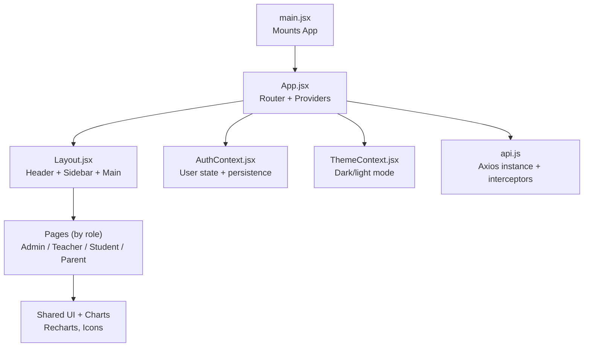
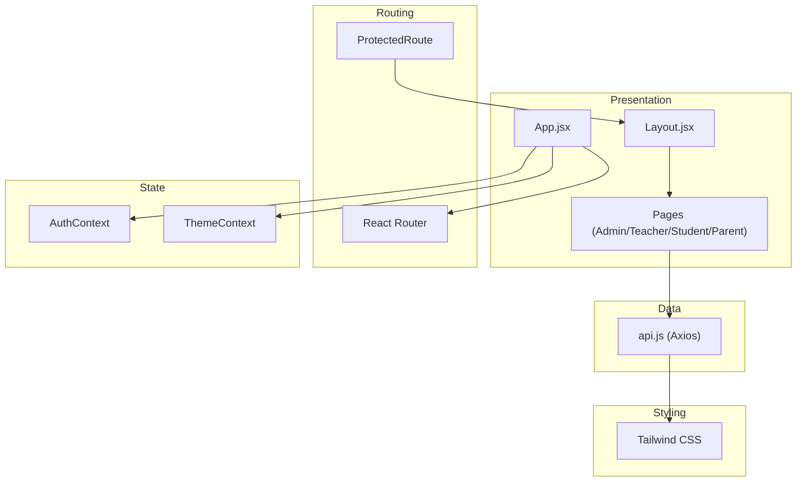
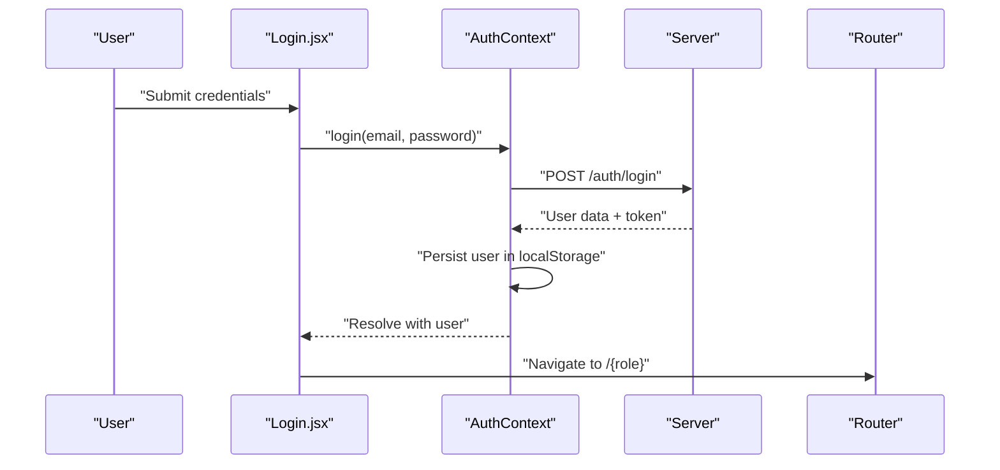
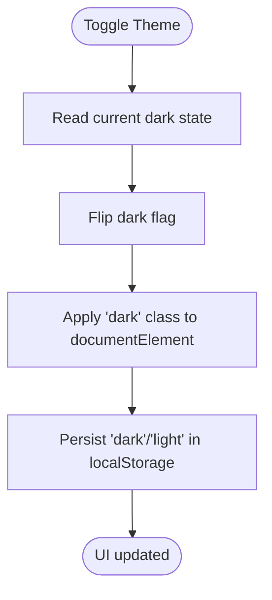
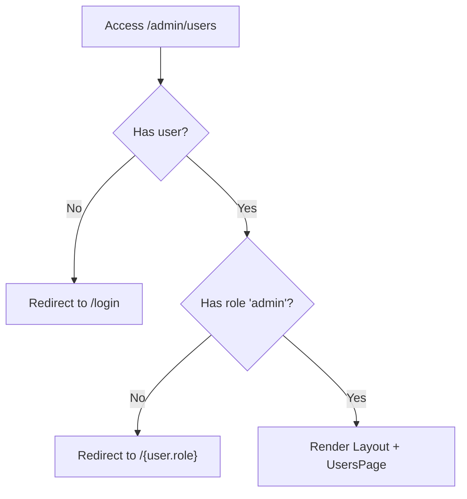
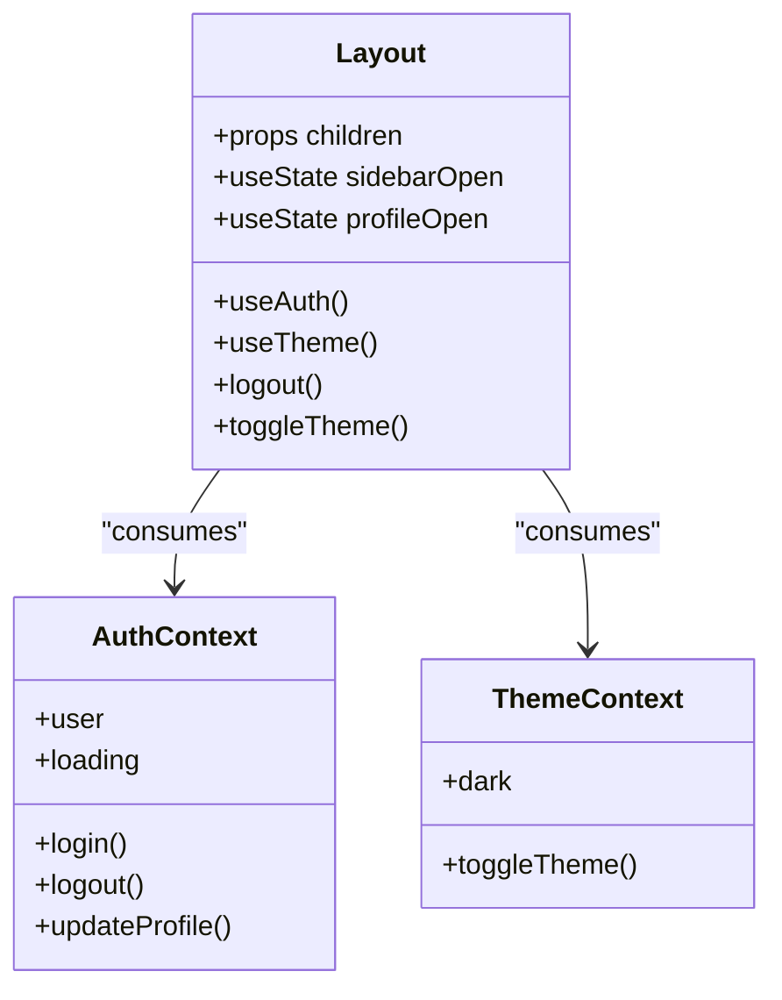
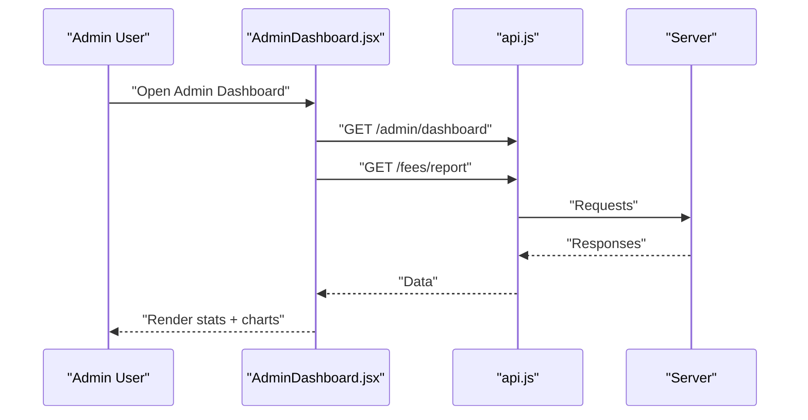
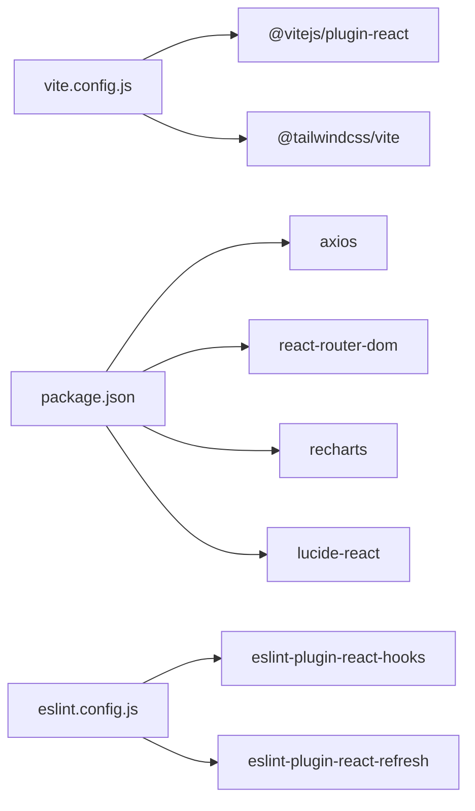

# Frontend Architecture

<cite>
**Referenced Files in This Document**
- [main.jsx](file://client/src/main.jsx)
- [App.jsx](file://client/src/App.jsx)
- [Layout.jsx](file://client/src/components/Layout.jsx)
- [AuthContext.jsx](file://client/src/context/AuthContext.jsx)
- [ThemeContext.jsx](file://client/src/context/ThemeContext.jsx)
- [Login.jsx](file://client/src/pages/auth/Login.jsx)
- [AdminDashboard.jsx](file://client/src/pages/admin/Dashboard.jsx)
- [UsersPage.jsx](file://client/src/pages/admin/UsersPage.jsx)
- [ClassesPage.jsx](file://client/src/pages/admin/ClassesPage.jsx)
- [StudentDashboard.jsx](file://client/src/pages/student/Dashboard.jsx)
- [TeacherDashboard.jsx](file://client/src/pages/teacher/Dashboard.jsx)
- [ParentDashboard.jsx](file://client/src/pages/parent/Dashboard.jsx)
- [StudentAttendance.jsx](file://client/src/pages/student/AttendancePage.jsx)
- [StudentResults.jsx](file://client/src/pages/student/ResultsPage.jsx)
- [TeacherAttendance.jsx](file://client/src/pages/teacher/AttendancePage.jsx)
- [api.js](file://client/src/api.js)
- [vite.config.js](file://client/vite.config.js)
- [package.json](file://client/package.json)
- [index.css](file://client/src/index.css)
- [eslint.config.js](file://client/eslint.config.js)
</cite>

## Table of Contents
1. [Introduction](#introduction)
2. [Project Structure](#project-structure)
3. [Core Components](#core-components)
4. [Architecture Overview](#architecture-overview)
5. [Detailed Component Analysis](#detailed-component-analysis)
6. [Dependency Analysis](#dependency-analysis)
7. [Performance Considerations](#performance-considerations)
8. [Troubleshooting Guide](#troubleshooting-guide)
9. [Conclusion](#conclusion)
10. [Appendices](#appendices)

## Introduction
This document describes the frontend architecture of the Educational Management System built with React.js and Vite. It explains the application structure, routing system, state management patterns, context providers, layout components, user role interfaces, component composition, performance strategies, responsive design, accessibility, and cross-browser compatibility.

## Project Structure
The frontend is organized by feature and responsibility:
- Root entry initializes the app and mounts it to the DOM.
- Routing is centralized with protected routes and role-based navigation.
- Context providers encapsulate authentication and theme state.
- Pages are grouped by user role to implement role-specific interfaces.
- Shared layout composes navigation, sidebar, and main content area.
- Styling leverages Tailwind CSS with a dark mode variant.

**Diagram sources**
- [main.jsx:1-11](file://client/src/main.jsx#L1-L11)
- [App.jsx:1-85](file://client/src/App.jsx#L1-L85)
- [Layout.jsx:1-143](file://client/src/components/Layout.jsx#L1-L143)
- [AuthContext.jsx:1-53](file://client/src/context/AuthContext.jsx#L1-L53)
- [ThemeContext.jsx:1-26](file://client/src/context/ThemeContext.jsx#L1-L26)
- [api.js:1-28](file://client/src/api.js#L1-L28)

**Section sources**
- [main.jsx:1-11](file://client/src/main.jsx#L1-L11)
- [App.jsx:1-85](file://client/src/App.jsx#L1-L85)
- [Layout.jsx:1-143](file://client/src/components/Layout.jsx#L1-L143)
- [AuthContext.jsx:1-53](file://client/src/context/AuthContext.jsx#L1-L53)
- [ThemeContext.jsx:1-26](file://client/src/context/ThemeContext.jsx#L1-L26)
- [api.js:1-28](file://client/src/api.js#L1-L28)

## Core Components
- Application shell and routing:
  - Central router with nested protected routes and role checks.
  - ProtectedRoute enforces authentication and role-based redirection.
- Context providers:
  - AuthContext manages user session, login/logout, and profile updates with local storage persistence.
  - ThemeContext toggles dark/light mode and persists preference.
- Layout:
  - Role-aware sidebar menu, responsive header, and main content container.
- Pages by role:
  - Admin: dashboard, user management, class management, reports.
  - Teacher: dashboard, class lists, attendance marking.
  - Student: dashboard, attendance, results, fees.
  - Parent: dashboard, child summary, attendance, fees.
- API abstraction:
  - Axios instance with base URL and interceptors for auth and 401 handling.

**Section sources**
- [App.jsx:18-84](file://client/src/App.jsx#L18-L84)
- [AuthContext.jsx:8-52](file://client/src/context/AuthContext.jsx#L8-L52)
- [ThemeContext.jsx:7-25](file://client/src/context/ThemeContext.jsx#L7-L25)
- [Layout.jsx:51-142](file://client/src/components/Layout.jsx#L51-L142)
- [api.js:3-28](file://client/src/api.js#L3-L28)

## Architecture Overview
The frontend follows a layered pattern:
- Presentation layer: React components and pages.
- Routing layer: React Router with protected routes and role-based navigation.
- State management layer: React Context (AuthContext, ThemeContext).
- Data access layer: Axios API client with interceptors.
- Styling layer: Tailwind CSS with dark mode variant.

**Diagram sources**
- [App.jsx:1-85](file://client/src/App.jsx#L1-L85)
- [Layout.jsx:1-143](file://client/src/components/Layout.jsx#L1-L143)
- [AuthContext.jsx:1-53](file://client/src/context/AuthContext.jsx#L1-L53)
- [ThemeContext.jsx:1-26](file://client/src/context/ThemeContext.jsx#L1-L26)
- [api.js:1-28](file://client/src/api.js#L1-L28)
- [index.css:1-36](file://client/src/index.css#L1-L36)

## Detailed Component Analysis

### Authentication and Session Management
- AuthContext:
  - Provides login, register, logout, and updateProfile functions.
  - Persists user data to local storage and hydrates on startup.
  - Exposes loading state for initial hydration.
- API interceptors:
  - Attaches Authorization header when present.
  - Clears session and redirects on 401.
- Login page:
  - Uses AuthContext to authenticate and navigate to role route.

**Diagram sources**
- [Login.jsx:15-27](file://client/src/pages/auth/Login.jsx#L15-L27)
- [AuthContext.jsx:20-32](file://client/src/context/AuthContext.jsx#L20-L32)
- [api.js:8-14](file://client/src/api.js#L8-L14)

**Section sources**
- [AuthContext.jsx:8-52](file://client/src/context/AuthContext.jsx#L8-L52)
- [api.js:8-25](file://client/src/api.js#L8-L25)
- [Login.jsx:6-27](file://client/src/pages/auth/Login.jsx#L6-L27)

### Theme and Dark Mode
- ThemeContext:
  - Reads saved theme preference from local storage.
  - Applies dark class to document root and persists toggle.
- Layout:
  - Toggles theme via ThemeContext and reflects icon change.

**Diagram sources**
- [ThemeContext.jsx:7-25](file://client/src/context/ThemeContext.jsx#L7-L25)
- [Layout.jsx:109-111](file://client/src/components/Layout.jsx#L109-L111)

**Section sources**
- [ThemeContext.jsx:7-25](file://client/src/context/ThemeContext.jsx#L7-L25)
- [Layout.jsx:109-111](file://client/src/components/Layout.jsx#L109-L111)
- [index.css:3-3](file://client/src/index.css#L3-L3)

### Routing and Protected Access
- ProtectedRoute:
  - Checks loading, user presence, and role match.
  - Wraps children with Layout for consistent UI.
- AppRoutes:
  - Defines role-specific routes and redirects unauthenticated users to login.
  - Redirects authenticated users to their role route.

**Diagram sources**
- [App.jsx:18-24](file://client/src/App.jsx#L18-L24)
- [App.jsx:32-42](file://client/src/App.jsx#L32-L42)

**Section sources**
- [App.jsx:18-84](file://client/src/App.jsx#L18-L84)

### Layout and Navigation
- Layout:
  - Renders role-specific sidebar menu items.
  - Provides responsive mobile sidebar and profile dropdown.
  - Integrates ThemeContext toggle and AuthContext logout.
- Menu items:
  - Admin, teacher, student, and parent menus are defined centrally.

**Diagram sources**
- [Layout.jsx:51-142](file://client/src/components/Layout.jsx#L51-L142)
- [AuthContext.jsx:6-52](file://client/src/context/AuthContext.jsx#L6-L52)
- [ThemeContext.jsx:5-25](file://client/src/context/ThemeContext.jsx#L5-L25)

**Section sources**
- [Layout.jsx:11-142](file://client/src/components/Layout.jsx#L11-L142)

### Role-Based Interfaces

#### Admin
- Dashboard:
  - Loads statistics and fee reports concurrently.
  - Renders charts for user distribution and fee collection.
- User Management:
  - Paginated table with filters and modal forms.
  - Dynamic form fields based on selected role.
- Class Management:
  - CRUD for classes with teacher assignment.

**Diagram sources**
- [AdminDashboard.jsx:13-29](file://client/src/pages/admin/Dashboard.jsx#L13-L29)
- [api.js:3-6](file://client/src/api.js#L3-L6)

**Section sources**
- [AdminDashboard.jsx:8-109](file://client/src/pages/admin/Dashboard.jsx#L8-L109)
- [UsersPage.jsx:5-195](file://client/src/pages/admin/UsersPage.jsx#L5-L195)
- [ClassesPage.jsx:5-82](file://client/src/pages/admin/ClassesPage.jsx#L5-L82)

#### Teacher
- Dashboard:
  - Lists assigned classes and today’s date.
- Attendance:
  - Select class and date, mark present/absent/late per student, submit batch.

**Section sources**
- [TeacherDashboard.jsx:5-56](file://client/src/pages/teacher/Dashboard.jsx#L5-L56)
- [TeacherAttendance.jsx:5-75](file://client/src/pages/teacher/AttendancePage.jsx#L5-L75)

#### Student
- Dashboard:
  - Shows attendance percentage, number of results, pending fees, and today’s date.
- Attendance:
  - Filterable monthly attendance with bar chart.
- Results:
  - List of exams with grades and remarks.

**Section sources**
- [StudentDashboard.jsx:5-57](file://client/src/pages/student/Dashboard.jsx#L5-L57)
- [StudentAttendance.jsx:6-67](file://client/src/pages/student/AttendancePage.jsx#L6-L67)
- [StudentResults.jsx:4-48](file://client/src/pages/student/ResultsPage.jsx#L4-L48)

#### Parent
- Dashboard:
  - Displays child info and aggregated attendance/fees.

**Section sources**
- [ParentDashboard.jsx:5-59](file://client/src/pages/parent/Dashboard.jsx#L5-L59)

## Dependency Analysis
- Build and tooling:
  - Vite with React plugin and Tailwind CSS plugin.
  - Dev server proxy configured for API requests.
- Runtime dependencies:
  - React, React Router, Axios, Recharts, Lucide icons.
- ESLint configuration:
  - Recommended rules for React and hooks, with Vite refresh support.

**Diagram sources**
- [vite.config.js:1-17](file://client/vite.config.js#L1-L17)
- [package.json:12-32](file://client/package.json#L12-L32)
- [eslint.config.js:1-22](file://client/eslint.config.js#L1-L22)

**Section sources**
- [vite.config.js:5-16](file://client/vite.config.js#L5-L16)
- [package.json:12-32](file://client/package.json#L12-L32)
- [eslint.config.js:7-21](file://client/eslint.config.js#L7-L21)

## Performance Considerations
- Concurrent data fetching:
  - Use Promise.all to load dashboard metrics efficiently.
- Minimal re-renders:
  - Keep state granular; avoid lifting unnecessary state.
- Lazy loading:
  - Consider lazy-loading heavy charts or modals.
- Memoization:
  - Use useMemo/useCallback for derived data and event handlers.
- Bundle optimization:
  - Vite tree-shakes by default; keep imports scoped.
- Network:
  - Centralized API client reduces duplication and improves caching strategies.

[No sources needed since this section provides general guidance]

## Troubleshooting Guide
- Authentication errors:
  - 401 interceptor clears user and navigates to login.
  - Verify Authorization header injection and token validity.
- Local storage persistence:
  - Ensure user/theme keys exist; clear and retry if corrupted.
- Routing loops:
  - Confirm ProtectedRoute conditions and default redirect behavior.
- Styling issues:
  - Verify dark variant class is applied and Tailwind directives are loaded.

**Section sources**
- [api.js:16-25](file://client/src/api.js#L16-L25)
- [AuthContext.jsx:12-18](file://client/src/context/AuthContext.jsx#L12-L18)
- [ThemeContext.jsx:13-16](file://client/src/context/ThemeContext.jsx#L13-L16)
- [App.jsx:18-24](file://client/src/App.jsx#L18-L24)

## Conclusion
The frontend employs a clean separation of concerns with React Router for navigation, React Context for global state, and a shared Layout for consistent UX. Role-based pages provide focused functionality while maintaining a unified design system powered by Tailwind CSS. The architecture supports scalability, maintainability, and a good developer experience through Vite tooling and ESLint configuration.

## Appendices

### Responsive Design Implementation
- Mobile-first approach with Tailwind utilities.
- Responsive grid layouts for dashboards and tables.
- Collapsible sidebar and overlay for small screens.
- Adaptive charts using responsive containers.

**Section sources**
- [Layout.jsx:68-98](file://client/src/components/Layout.jsx#L68-L98)
- [StudentDashboard.jsx:34-47](file://client/src/pages/student/Dashboard.jsx#L34-L47)
- [AdminDashboard.jsx:69-106](file://client/src/pages/admin/Dashboard.jsx#L69-L106)

### Accessibility Considerations
- Semantic HTML and proper labeling for inputs.
- Focus management in modals and dropdowns.
- Keyboard navigation support for menus and buttons.
- Sufficient color contrast for light/dark themes.

[No sources needed since this section provides general guidance]

### Cross-Browser Compatibility Approaches
- Use Tailwind’s default utilities and CSS custom properties.
- Avoid experimental APIs; rely on widely supported features.
- Test on modern browsers; polyfills only when necessary.

[No sources needed since this section provides general guidance]