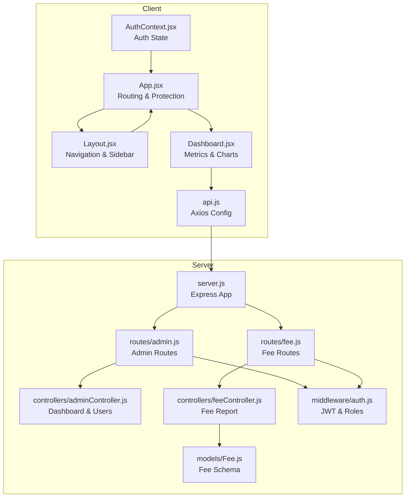
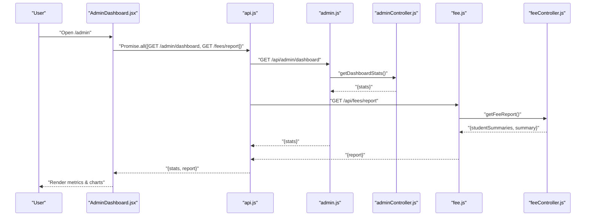
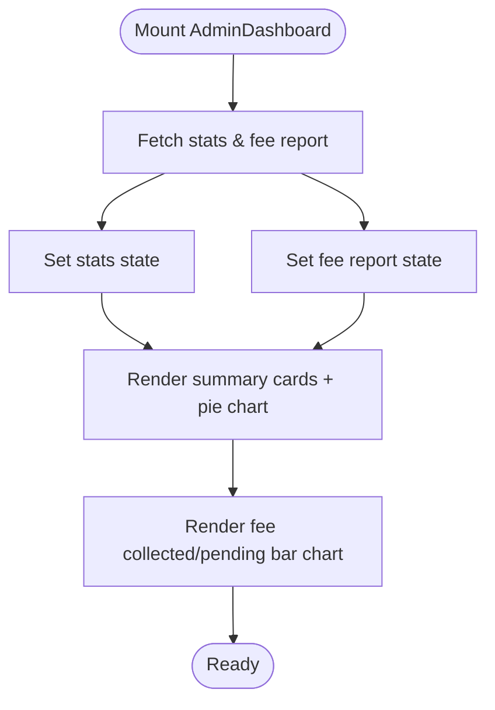
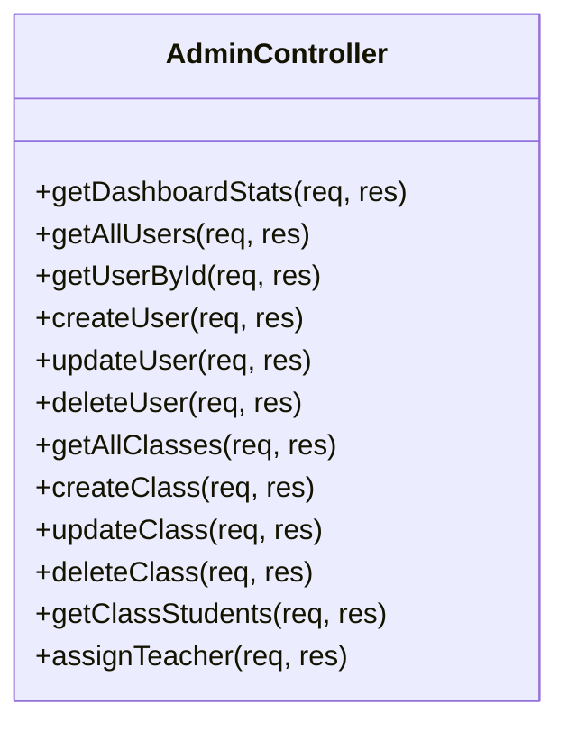
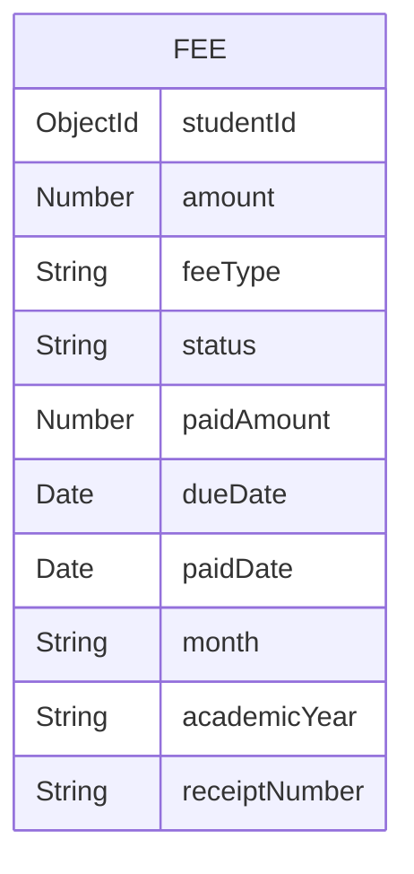
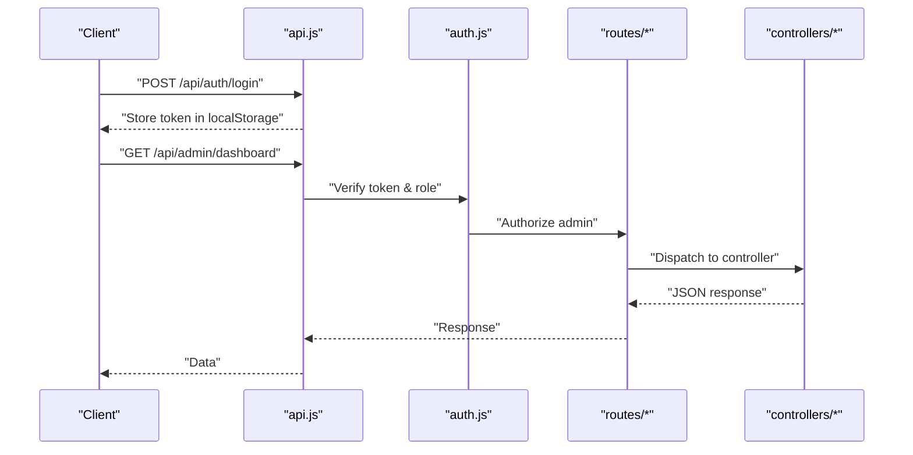
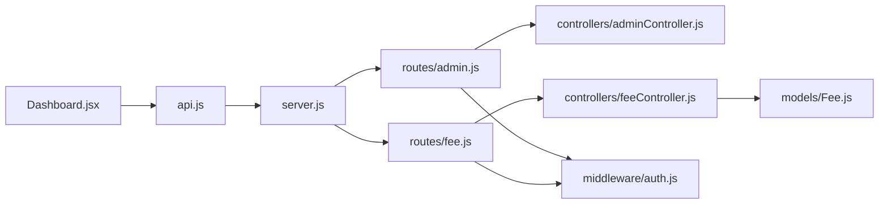

# Admin Dashboard

<cite>
**Referenced Files in This Document**
- [Dashboard.jsx](file://client/src/pages/admin/Dashboard.jsx)
- [adminController.js](file://server/controllers/adminController.js)
- [admin.js](file://server/routes/admin.js)
- [feeController.js](file://server/controllers/feeController.js)
- [fee.js](file://server/routes/fee.js)
- [Fee.js](file://server/models/Fee.js)
- [api.js](file://client/src/api.js)
- [Layout.jsx](file://client/src/components/Layout.jsx)
- [App.jsx](file://client/src/App.jsx)
- [AuthContext.jsx](file://client/src/context/AuthContext.jsx)
- [auth.js](file://server/middleware/auth.js)
- [server.js](file://server/server.js)
- [UsersPage.jsx](file://client/src/pages/admin/UsersPage.jsx)
- [ClassesPage.jsx](file://client/src/pages/admin/ClassesPage.jsx)
- [FeesPage.jsx](file://client/src/pages/admin/FeesPage.jsx)
</cite>

## Table of Contents
1. [Introduction](#introduction)
2. [Project Structure](#project-structure)
3. [Core Components](#core-components)
4. [Architecture Overview](#architecture-overview)
5. [Detailed Component Analysis](#detailed-component-analysis)
6. [Dependency Analysis](#dependency-analysis)
7. [Performance Considerations](#performance-considerations)
8. [Troubleshooting Guide](#troubleshooting-guide)
9. [Conclusion](#conclusion)

## Introduction
This document explains the Admin Dashboard functionality in the School Management System. It covers the dashboard layout, key metrics display, system overview widgets, administrative shortcuts, controller functions, data aggregation methods, and integration between frontend and backend. It also outlines how real-time-like updates are achieved via client-side requests and how the admin routes are protected.

## Project Structure
The Admin Dashboard resides in the client under the admin pages and integrates with backend routes and controllers. The frontend uses React with Recharts for visualization, while the backend exposes REST endpoints secured by JWT and role-based authorization.

**Diagram sources**
- [App.jsx:26-72](file://client/src/App.jsx#L26-L72)
- [Layout.jsx:51-142](file://client/src/components/Layout.jsx#L51-L142)
- [Dashboard.jsx:8-110](file://client/src/pages/admin/Dashboard.jsx#L8-L110)
- [api.js:1-28](file://client/src/api.js#L1-L28)
- [server.js:18-28](file://server/server.js#L18-L28)
- [admin.js:1-20](file://server/routes/admin.js#L1-L20)
- [adminController.js:6-17](file://server/controllers/adminController.js#L6-L17)
- [fee.js:1-13](file://server/routes/fee.js#L1-L13)
- [feeController.js:42-118](file://server/controllers/feeController.js#L42-L118)
- [Fee.js:1-17](file://server/models/Fee.js#L1-L17)
- [auth.js:4-31](file://server/middleware/auth.js#L4-L31)

**Section sources**
- [App.jsx:26-72](file://client/src/App.jsx#L26-L72)
- [Layout.jsx:51-142](file://client/src/components/Layout.jsx#L51-L142)
- [Dashboard.jsx:8-110](file://client/src/pages/admin/Dashboard.jsx#L8-L110)
- [api.js:1-28](file://client/src/api.js#L1-L28)
- [server.js:18-28](file://server/server.js#L18-L28)

## Core Components
- Admin Dashboard page renders:
  - Four summary cards for total students, teachers, classes, and users
  - A pie chart showing users by role
  - A bar chart and summary cards for fee collection (collected vs pending)
- Backend controllers:
  - Admin dashboard stats aggregation
  - Fee report generation with student summaries and totals
- Frontend API client:
  - Axios instance with base URL and auth token injection
- Routing and protection:
  - Protected routes ensuring only admins can access admin pages
  - Navigation sidebar tailored per role

**Section sources**
- [Dashboard.jsx:39-106](file://client/src/pages/admin/Dashboard.jsx#L39-L106)
- [adminController.js:6-17](file://server/controllers/adminController.js#L6-L17)
- [feeController.js:42-118](file://server/controllers/feeController.js#L42-L118)
- [api.js:3-14](file://client/src/api.js#L3-L14)
- [App.jsx:32-43](file://client/src/App.jsx#L32-L43)

## Architecture Overview
The Admin Dashboard follows a clean separation of concerns:
- Client fetches two datasets concurrently on mount:
  - Admin dashboard stats from the admin controller
  - Fee report from the fee controller
- The client renders charts and summary cards using the returned data.
- Backend routes are protected by JWT and role checks.

**Diagram sources**
- [Dashboard.jsx:13-29](file://client/src/pages/admin/Dashboard.jsx#L13-L29)
- [api.js:3-14](file://client/src/api.js#L3-L14)
- [admin.js:6](file://server/routes/admin.js#L6)
- [adminController.js:6-17](file://server/controllers/adminController.js#L6-L17)
- [fee.js:10](file://server/routes/fee.js#L10)
- [feeController.js:42-118](file://server/controllers/feeController.js#L42-L118)

## Detailed Component Analysis

### Admin Dashboard Page
- Fetches data:
  - Concurrently loads dashboard stats and fee report
  - Sets loading state until both promises resolve
- Renders:
  - Summary cards for total students, teachers, classes, users
  - Pie chart of users by role
  - Fee collected/pending summary and bar chart
- Uses:
  - Recharts for visualization
  - Icons from lucide-react
  - Responsive containers for charts

**Diagram sources**
- [Dashboard.jsx:13-29](file://client/src/pages/admin/Dashboard.jsx#L13-L29)
- [Dashboard.jsx:39-106](file://client/src/pages/admin/Dashboard.jsx#L39-L106)

**Section sources**
- [Dashboard.jsx:8-110](file://client/src/pages/admin/Dashboard.jsx#L8-L110)

### Admin Controller Functions
- Dashboard stats:
  - Counts documents for users, students, teachers, classes
  - Aggregates user distribution by role
- User management endpoints:
  - List users with filters and pagination
  - Get user by ID with role-specific profiles
  - Create/update/delete users with role-specific profiles
- Class management endpoints:
  - List/create/update/delete classes
  - Get class students with populated user info
  - Assign teacher to class

**Diagram sources**
- [adminController.js:6-158](file://server/controllers/adminController.js#L6-L158)

**Section sources**
- [adminController.js:6-158](file://server/controllers/adminController.js#L6-L158)

### Fee Report Controller and Data Model
- Fee report:
  - Builds student-centric summaries
  - Computes totals and statuses (paid/partial/unpaid)
  - Supports filtering by class, status, and month
- Fee model:
  - Defines schema for fee records including amounts, status, dates, and month/year

**Diagram sources**
- [Fee.js:3-14](file://server/models/Fee.js#L3-L14)

**Section sources**
- [feeController.js:42-118](file://server/controllers/feeController.js#L42-L118)
- [Fee.js:1-17](file://server/models/Fee.js#L1-L17)

### Frontend API Integration and Authentication
- API client:
  - Base URL set to "/api"
  - Injects Authorization header from local storage
  - Handles 401 by redirecting to login
- Authentication:
  - JWT verification middleware
  - Role-based authorization guard
  - Protected routes ensure only admins access admin pages

**Diagram sources**
- [api.js:8-25](file://client/src/api.js#L8-L25)
- [auth.js:4-31](file://server/middleware/auth.js#L4-L31)
- [admin.js:6](file://server/routes/admin.js#L6)
- [adminController.js:6-17](file://server/controllers/adminController.js#L6-L17)

**Section sources**
- [api.js:1-28](file://client/src/api.js#L1-L28)
- [auth.js:4-31](file://server/middleware/auth.js#L4-L31)
- [App.jsx:32-43](file://client/src/App.jsx#L32-L43)

### Administrative Shortcuts and Navigation
- Sidebar menu items are role-aware and include:
  - Dashboard, Users, Students, Teachers, Classes, Attendance, Exams, Fees, Notices, Timetable, Messages
- Admins see the full admin menu; other roles see their respective dashboards and limited menus

**Section sources**
- [Layout.jsx:11-49](file://client/src/components/Layout.jsx#L11-L49)
- [Layout.jsx:51-142](file://client/src/components/Layout.jsx#L51-L142)

### Real-Time Updates
- The dashboard does not implement WebSocket subscriptions.
- Updates occur when the user navigates to the dashboard or refreshes the page.
- The client fetches fresh data on mount, ensuring near-real-time accuracy after actions like marking fees paid or updating user records.

**Section sources**
- [Dashboard.jsx:13-29](file://client/src/pages/admin/Dashboard.jsx#L13-L29)

## Dependency Analysis
- Client depends on:
  - api.js for HTTP communication
  - Recharts for visualization
  - Lucide icons for UI
- Server depends on:
  - Express for routing
  - MongoDB/Mongoose for data persistence
  - JWT for authentication
  - CORS for cross-origin support

**Diagram sources**
- [Dashboard.jsx:1-2](file://client/src/pages/admin/Dashboard.jsx#L1-L2)
- [api.js:1-6](file://client/src/api.js#L1-L6)
- [server.js:18-28](file://server/server.js#L18-L28)
- [admin.js:1-20](file://server/routes/admin.js#L1-L20)
- [adminController.js:1-5](file://server/controllers/adminController.js#L1-L5)
- [fee.js:1-13](file://server/routes/fee.js#L1-L13)
- [feeController.js:1-3](file://server/controllers/feeController.js#L1-L3)
- [Fee.js:1-3](file://server/models/Fee.js#L1-L3)
- [auth.js:1-31](file://server/middleware/auth.js#L1-L31)

**Section sources**
- [server.js:18-28](file://server/server.js#L18-L28)
- [admin.js:1-20](file://server/routes/admin.js#L1-L20)
- [fee.js:1-13](file://server/routes/fee.js#L1-L13)

## Performance Considerations
- Concurrent data fetching reduces initial load time.
- Aggregation queries on the backend minimize client-side computation.
- Pagination in user listings prevents large payloads.
- Chart rendering is lightweight; consider virtualization for very large datasets.

## Troubleshooting Guide
- 401 Unauthorized:
  - Occurs when the token is missing or invalid. The client clears local storage and redirects to login.
- 403 Forbidden:
  - Occurs when the logged-in user lacks admin role for admin routes.
- Dashboard shows empty charts:
  - Verify backend aggregation results and that the frontend maps data keys correctly.
- Fee report discrepancies:
  - Confirm filters applied and that fee statuses and paid amounts are consistent in the database.

**Section sources**
- [api.js:16-25](file://client/src/api.js#L16-L25)
- [auth.js:21-28](file://server/middleware/auth.js#L21-L28)
- [feeController.js:42-118](file://server/controllers/feeController.js#L42-L118)

## Conclusion
The Admin Dashboard provides a concise overview of the school’s state through aggregated metrics and visualizations. Its architecture cleanly separates concerns between the client and server, with robust authentication and role-based access control. While real-time updates are not implemented, the current design ensures reliable and responsive data presentation.