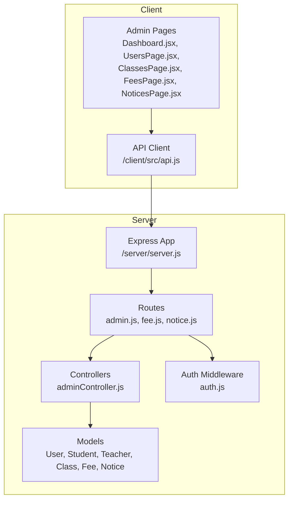
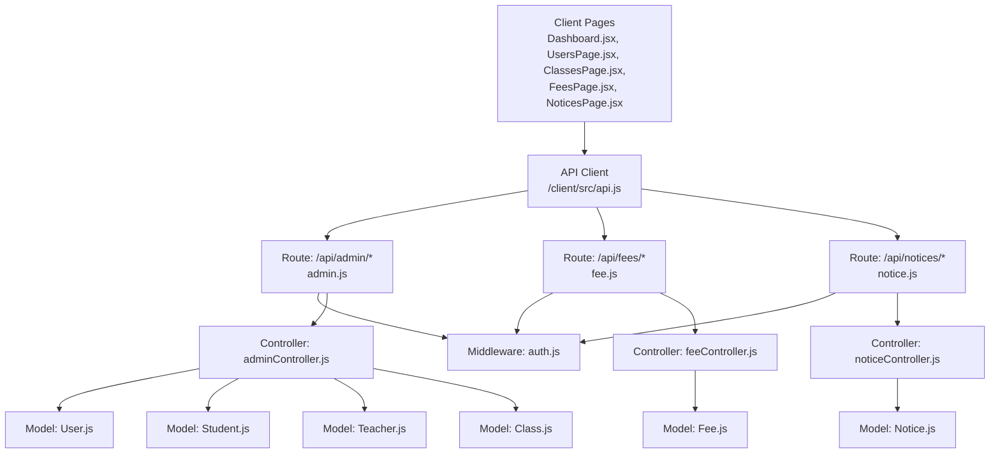
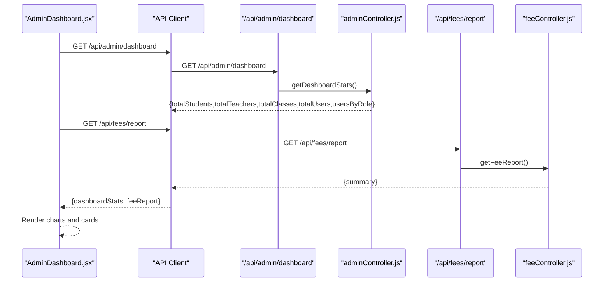
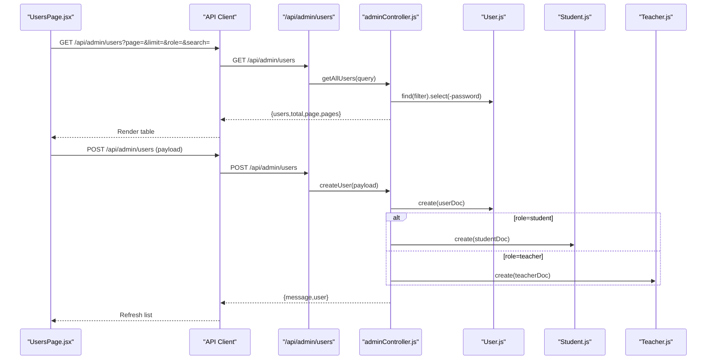
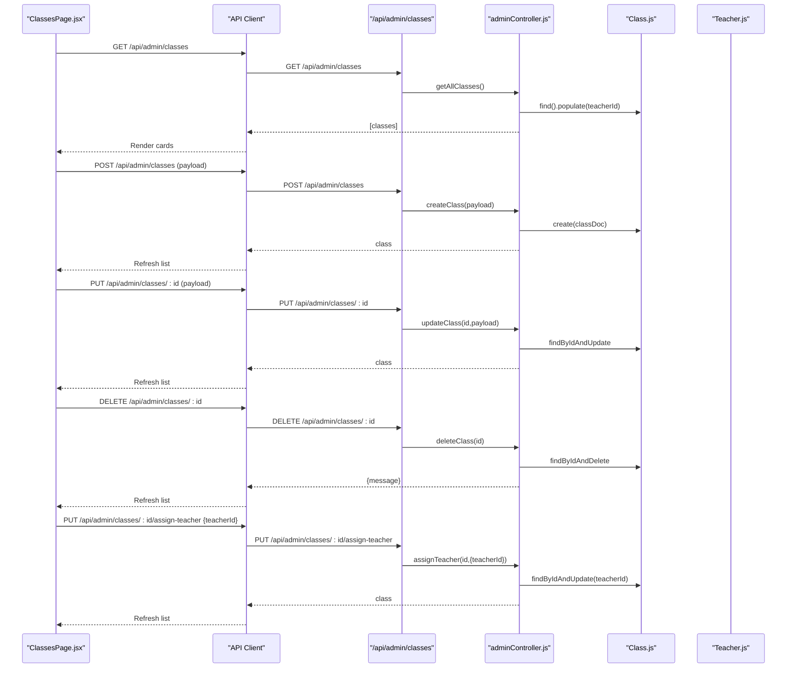
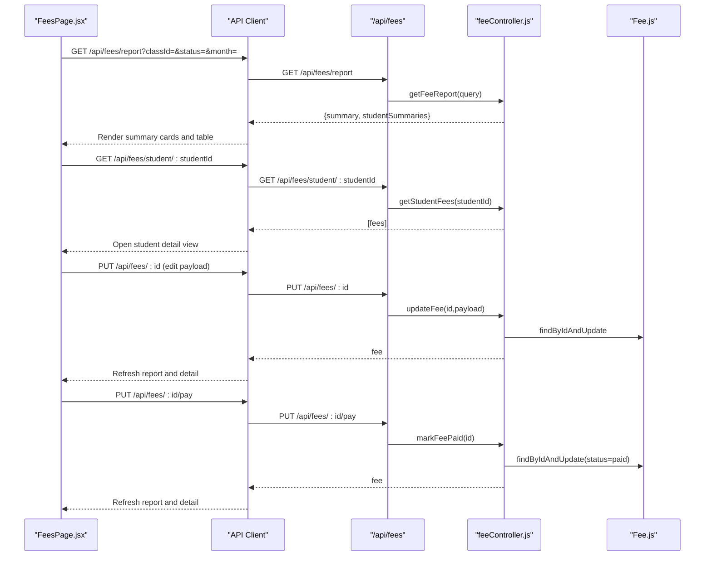
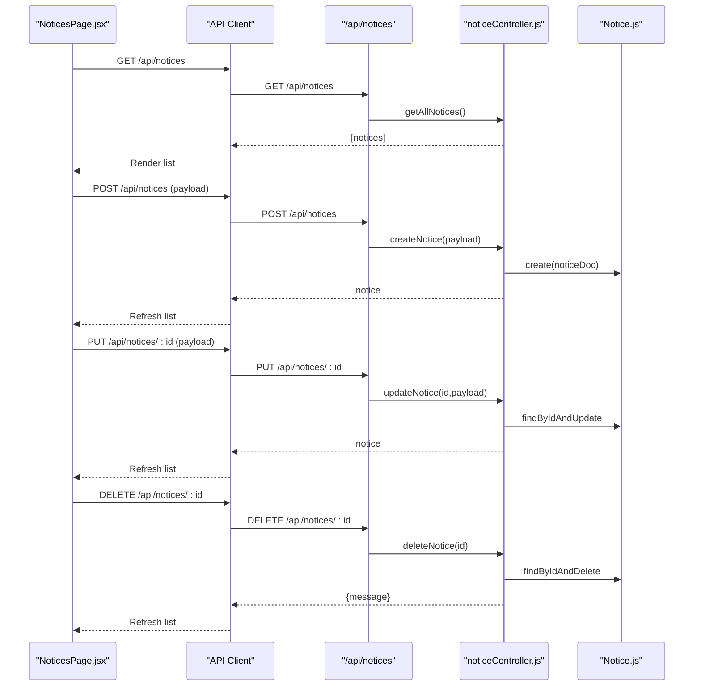
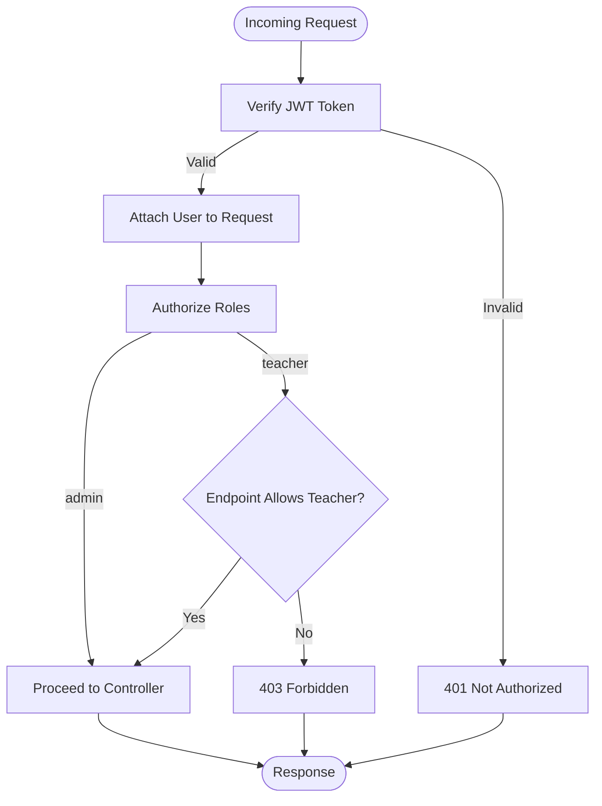
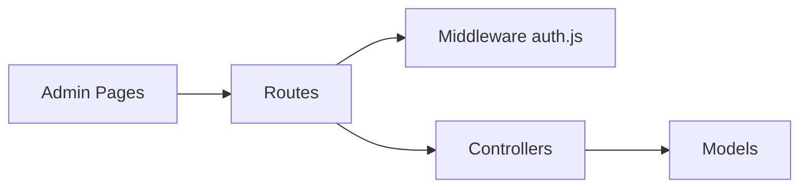

# Admin Portal

<cite>
**Referenced Files in This Document**
- [server.js](file://server/server.js)
- [api.js](file://client/src/api.js)
- [admin.js](file://server/routes/admin.js)
- [fee.js](file://server/routes/fee.js)
- [notice.js](file://server/routes/notice.js)
- [auth.js](file://server/middleware/auth.js)
- [adminController.js](file://server/controllers/adminController.js)
- [Dashboard.jsx](file://client/src/pages/admin/Dashboard.jsx)
- [UsersPage.jsx](file://client/src/pages/admin/UsersPage.jsx)
- [ClassesPage.jsx](file://client/src/pages/admin/ClassesPage.jsx)
- [FeesPage.jsx](file://client/src/pages/admin/FeesPage.jsx)
- [NoticesPage.jsx](file://client/src/pages/admin/NoticesPage.jsx)
- [User.js](file://server/models/User.js)
- [Student.js](file://server/models/Student.js)
- [Teacher.js](file://server/models/Teacher.js)
- [Class.js](file://server/models/Class.js)
- [Fee.js](file://server/models/Fee.js)
- [Notice.js](file://server/models/Notice.js)
</cite>

## Table of Contents
1. [Introduction](#introduction)
2. [Project Structure](#project-structure)
3. [Core Components](#core-components)
4. [Architecture Overview](#architecture-overview)
5. [Detailed Component Analysis](#detailed-component-analysis)
6. [Dependency Analysis](#dependency-analysis)
7. [Performance Considerations](#performance-considerations)
8. [Troubleshooting Guide](#troubleshooting-guide)
9. [Conclusion](#conclusion)

## Introduction
This document describes the Admin Portal functionality for a School Management System. It covers administrative dashboard features, user management, class administration, fee processing, and notice board management. It documents the admin controller functions, route endpoints, and the data models used for administrative operations. It also explains user role management, class scheduling, fee collection processes, and communication systems, and includes workflow diagrams showing admin tasks, permission hierarchies, and system administration procedures.

## Project Structure
The Admin Portal spans a React frontend and an Express backend with MongoDB via Mongoose. The backend exposes REST endpoints under /api, organized by domain (admin, fees, notices, etc.). The frontend consumes these endpoints through a shared API client and renders admin-specific pages.



**Diagram sources**
- [server.js:18-27](file://server/server.js#L18-L27)
- [admin.js:1-19](file://server/routes/admin.js#L1-L19)
- [fee.js:1-12](file://server/routes/fee.js#L1-L12)
- [notice.js:1-11](file://server/routes/notice.js#L1-L11)
- [auth.js:1-31](file://server/middleware/auth.js#L1-L31)
- [adminController.js:1-158](file://server/controllers/adminController.js#L1-L158)
- [api.js:1-28](file://client/src/api.js#L1-L28)
- [Dashboard.jsx:1-110](file://client/src/pages/admin/Dashboard.jsx#L1-L110)
- [UsersPage.jsx:1-195](file://client/src/pages/admin/UsersPage.jsx#L1-L195)
- [ClassesPage.jsx:1-82](file://client/src/pages/admin/ClassesPage.jsx#L1-L82)
- [FeesPage.jsx:1-379](file://client/src/pages/admin/FeesPage.jsx#L1-L379)
- [NoticesPage.jsx:1-86](file://client/src/pages/admin/NoticesPage.jsx#L1-L86)

**Section sources**
- [server.js:18-27](file://server/server.js#L18-L27)
- [api.js:1-28](file://client/src/api.js#L1-L28)

## Core Components
- Admin Dashboard: Aggregates system statistics and fee summaries for quick oversight.
- User Management: CRUD operations for users with role-specific profiles (student/teacher).
- Class Administration: Manage classes and assign teachers.
- Fee Processing: Generate reports, update fee records, and mark payments.
- Notice Board: Create, update, pin, and distribute notices to targeted roles.

**Section sources**
- [adminController.js:6-17](file://server/controllers/adminController.js#L6-L17)
- [adminController.js:19-98](file://server/controllers/adminController.js#L19-L98)
- [adminController.js:100-157](file://server/controllers/adminController.js#L100-L157)
- [fee.js:6-10](file://server/routes/fee.js#L6-L10)
- [notice.js:6-9](file://server/routes/notice.js#L6-L9)

## Architecture Overview
The Admin Portal follows a layered architecture:
- Presentation Layer: React pages render dashboards and forms.
- API Layer: Express routes define endpoints and apply authentication/authorization.
- Business Logic Layer: Controllers orchestrate data retrieval and persistence.
- Data Access Layer: Mongoose models define schemas and relationships.



**Diagram sources**
- [server.js:18-27](file://server/server.js#L18-L27)
- [admin.js:1-19](file://server/routes/admin.js#L1-L19)
- [fee.js:1-12](file://server/routes/fee.js#L1-L12)
- [notice.js:1-11](file://server/routes/notice.js#L1-L11)
- [auth.js:1-31](file://server/middleware/auth.js#L1-L31)
- [adminController.js:1-158](file://server/controllers/adminController.js#L1-L158)
- [api.js:1-28](file://client/src/api.js#L1-L28)
- [User.js:1-27](file://server/models/User.js#L1-L27)
- [Student.js:1-16](file://server/models/Student.js#L1-L16)
- [Teacher.js:1-13](file://server/models/Teacher.js#L1-L13)
- [Class.js:1-11](file://server/models/Class.js#L1-L11)
- [Fee.js:1-17](file://server/models/Fee.js#L1-L17)
- [Notice.js:1-14](file://server/models/Notice.js#L1-L14)

## Detailed Component Analysis

### Admin Dashboard
The dashboard aggregates:
- Counts for total users, students, teachers, and classes.
- Distribution of users by role.
- Fee collection summary (collected vs pending).



**Diagram sources**
- [Dashboard.jsx:13-29](file://client/src/pages/admin/Dashboard.jsx#L13-L29)
- [admin.js:6](file://server/routes/admin.js#L6)
- [adminController.js:6-17](file://server/controllers/adminController.js#L6-L17)
- [fee.js:10](file://server/routes/fee.js#L10)

**Section sources**
- [Dashboard.jsx:13-29](file://client/src/pages/admin/Dashboard.jsx#L13-L29)
- [adminController.js:6-17](file://server/controllers/adminController.js#L6-L17)

### User Management
Admins can list, search, filter, create, update, and delete users. Role-specific profiles are created/updated alongside base user records.



**Diagram sources**
- [UsersPage.jsx:17-38](file://client/src/pages/admin/UsersPage.jsx#L17-L38)
- [admin.js:7-11](file://server/routes/admin.js#L7-L11)
- [adminController.js:19-98](file://server/controllers/adminController.js#L19-L98)
- [User.js:1-27](file://server/models/User.js#L1-L27)
- [Student.js:1-16](file://server/models/Student.js#L1-L16)
- [Teacher.js:1-13](file://server/models/Teacher.js#L1-L13)

**Section sources**
- [UsersPage.jsx:17-80](file://client/src/pages/admin/UsersPage.jsx#L17-L80)
- [adminController.js:19-98](file://server/controllers/adminController.js#L19-L98)

### Class Administration
Admins manage classes and assign teachers to classes.



**Diagram sources**
- [ClassesPage.jsx:12-29](file://client/src/pages/admin/ClassesPage.jsx#L12-L29)
- [admin.js:12-17](file://server/routes/admin.js#L12-L17)
- [adminController.js:100-157](file://server/controllers/adminController.js#L100-L157)
- [Class.js:1-11](file://server/models/Class.js#L1-L11)
- [Teacher.js:1-13](file://server/models/Teacher.js#L1-L13)

**Section sources**
- [ClassesPage.jsx:12-29](file://client/src/pages/admin/ClassesPage.jsx#L12-L29)
- [adminController.js:100-157](file://server/controllers/adminController.js#L100-L157)

### Fee Processing
Admins view consolidated fee reports, drill down to student-level details, update fee records, and mark payments.



**Diagram sources**
- [FeesPage.jsx:14-41](file://client/src/pages/admin/FeesPage.jsx#L14-L41)
- [fee.js:6-10](file://server/routes/fee.js#L6-L10)
- [Fee.js:1-17](file://server/models/Fee.js#L1-L17)

**Section sources**
- [FeesPage.jsx:14-76](file://client/src/pages/admin/FeesPage.jsx#L14-L76)
- [fee.js:6-10](file://server/routes/fee.js#L6-L10)

### Notice Board Management
Admins create, update, delete, and pin notices targeting specific roles.



**Diagram sources**
- [NoticesPage.jsx:11-22](file://client/src/pages/admin/NoticesPage.jsx#L11-L22)
- [notice.js:6-9](file://server/routes/notice.js#L6-L9)
- [Notice.js:1-14](file://server/models/Notice.js#L1-L14)

**Section sources**
- [NoticesPage.jsx:11-22](file://client/src/pages/admin/NoticesPage.jsx#L11-L22)
- [notice.js:6-9](file://server/routes/notice.js#L6-L9)

### Permission Hierarchies and Authorization
Access to admin endpoints requires:
- Authentication: Bearer token extracted from Authorization header.
- Authorization: Role must be admin; some endpoints additionally allow teacher.



**Diagram sources**
- [auth.js:4-28](file://server/middleware/auth.js#L4-L28)
- [admin.js:6-17](file://server/routes/admin.js#L6-L17)
- [fee.js:6-10](file://server/routes/fee.js#L6-L10)
- [notice.js:6-9](file://server/routes/notice.js#L6-L9)

**Section sources**
- [auth.js:4-28](file://server/middleware/auth.js#L4-L28)
- [admin.js:6-17](file://server/routes/admin.js#L6-L17)
- [fee.js:6-10](file://server/routes/fee.js#L6-L10)
- [notice.js:6-9](file://server/routes/notice.js#L6-L9)

### Data Models Overview
The Admin Portal relies on the following models:

```mermaid
erDiagram
USER {
ObjectId id PK
string name
string email UK
string password
enum role
string phone
string address
string profileImage
boolean isActive
timestamp createdAt
timestamp updatedAt
}
STUDENT {
ObjectId id PK
ObjectId userId FK
ObjectId classId FK
ObjectId parentId FK
string rollNumber
date admissionDate
date dateOfBirth
string gender
string bloodGroup
string emergencyContact
timestamp createdAt
timestamp updatedAt
}
TEACHER {
ObjectId id PK
ObjectId userId FK
string subject
string qualification
number experience
date joinDate
number salary
timestamp createdAt
timestamp updatedAt
}
CLASS {
ObjectId id PK
string name
string section
ObjectId teacherId FK
string academicYear
timestamp createdAt
timestamp updatedAt
}
FEE {
ObjectId id PK
ObjectId studentId FK
number amount
enum feeType
enum status
number paidAmount
date dueDate
date paidDate
string month
string academicYear
string receiptNumber
timestamp createdAt
timestamp updatedAt
}
NOTICE {
ObjectId id PK
string title
string message
enum category
array targetRoles
ObjectId postedBy FK
boolean isPinned
array attachments
timestamp createdAt
timestamp updatedAt
}
USER ||--o{ STUDENT : "has profile"
USER ||--o{ TEACHER : "has profile"
CLASS ||--o{ STUDENT : "enrolls"
STUDENT ||--o{ FEE : "owes"
USER ||--o{ NOTICE : "posts"
```

**Diagram sources**
- [User.js:4-13](file://server/models/User.js#L4-L13)
- [Student.js:3-13](file://server/models/Student.js#L3-L13)
- [Teacher.js:3-10](file://server/models/Teacher.js#L3-L10)
- [Class.js:3-8](file://server/models/Class.js#L3-L8)
- [Fee.js:3-14](file://server/models/Fee.js#L3-L14)
- [Notice.js:3-11](file://server/models/Notice.js#L3-L11)

**Section sources**
- [User.js:4-13](file://server/models/User.js#L4-L13)
- [Student.js:3-13](file://server/models/Student.js#L3-L13)
- [Teacher.js:3-10](file://server/models/Teacher.js#L3-L10)
- [Class.js:3-8](file://server/models/Class.js#L3-L8)
- [Fee.js:3-14](file://server/models/Fee.js#L3-L14)
- [Notice.js:3-11](file://server/models/Notice.js#L3-L11)

## Dependency Analysis
- Routes depend on middleware for auth and authorization.
- Controllers depend on models for data operations.
- Frontend pages depend on the API client for network requests.
- Endpoints enforce role-based access to protect sensitive operations.



**Diagram sources**
- [admin.js:1-19](file://server/routes/admin.js#L1-L19)
- [fee.js:1-12](file://server/routes/fee.js#L1-L12)
- [notice.js:1-11](file://server/routes/notice.js#L1-L11)
- [auth.js:1-31](file://server/middleware/auth.js#L1-L31)
- [adminController.js:1-158](file://server/controllers/adminController.js#L1-L158)
- [Dashboard.jsx:1-110](file://client/src/pages/admin/Dashboard.jsx#L1-L110)
- [UsersPage.jsx:1-195](file://client/src/pages/admin/UsersPage.jsx#L1-L195)
- [ClassesPage.jsx:1-82](file://client/src/pages/admin/ClassesPage.jsx#L1-L82)
- [FeesPage.jsx:1-379](file://client/src/pages/admin/FeesPage.jsx#L1-L379)
- [NoticesPage.jsx:1-86](file://client/src/pages/admin/NoticesPage.jsx#L1-L86)

**Section sources**
- [admin.js:1-19](file://server/routes/admin.js#L1-L19)
- [fee.js:1-12](file://server/routes/fee.js#L1-L12)
- [notice.js:1-11](file://server/routes/notice.js#L1-L11)
- [auth.js:1-31](file://server/middleware/auth.js#L1-L31)
- [adminController.js:1-158](file://server/controllers/adminController.js#L1-L158)
- [api.js:1-28](file://client/src/api.js#L1-L28)

## Performance Considerations
- Pagination and filtering: The user listing endpoint supports pagination and search to avoid large payloads.
- Aggregation queries: Dashboard statistics use aggregation to compute counts efficiently.
- Populate usage: Class listing populates teacher info; use lean queries or selective population to reduce payload size when appropriate.
- Client-side caching: Consider memoizing report data per filter to minimize redundant requests.
- Batch updates: Prefer bulk operations for fee updates when scaling.

## Troubleshooting Guide
Common issues and resolutions:
- Authentication failures: Ensure the Authorization header includes a valid Bearer token stored in local storage. The API client attaches the token automatically; a 401 response triggers logout.
- Authorization errors: Confirm the logged-in user has role admin for admin endpoints; some endpoints also allow teacher.
- Validation errors: Verify form inputs match model constraints (e.g., unique email, valid enums).
- Network errors: Check CORS and server availability; the server health endpoint can confirm service status.

**Section sources**
- [api.js:8-25](file://client/src/api.js#L8-L25)
- [auth.js:4-28](file://server/middleware/auth.js#L4-L28)
- [server.js:29-32](file://server/server.js#L29-L32)

## Conclusion
The Admin Portal provides a comprehensive interface for managing users, classes, fees, and notices. Its architecture cleanly separates concerns across the frontend and backend, enforces role-based access control, and leverages Mongoose models to represent core entities. The included diagrams and references enable both technical and non-technical stakeholders to understand workflows, permissions, and data structures.