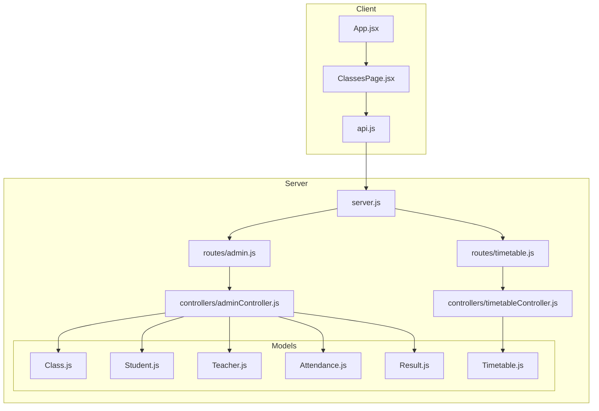
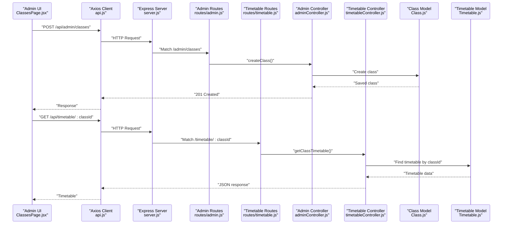
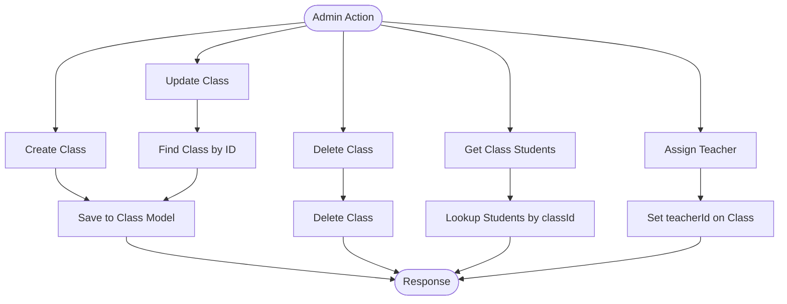
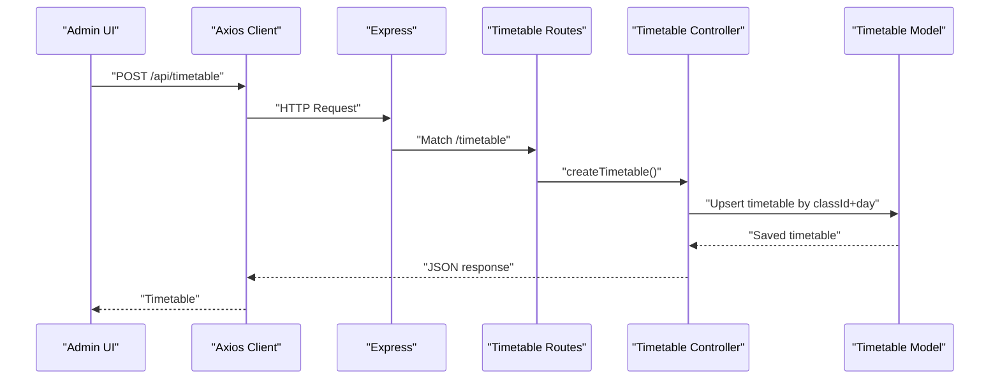
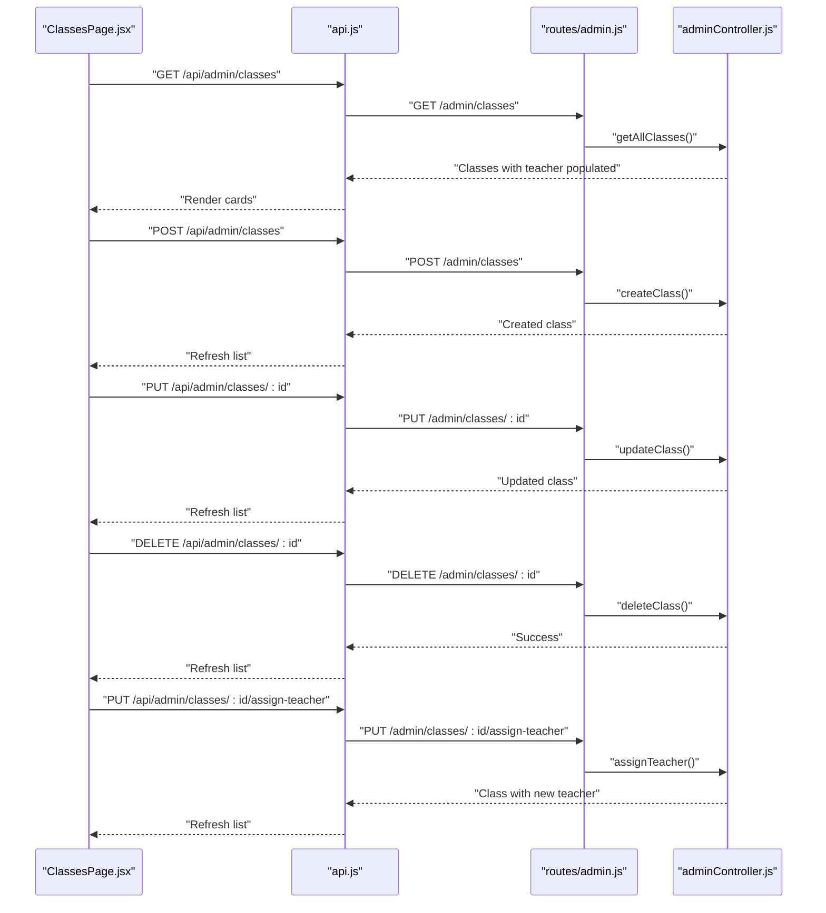
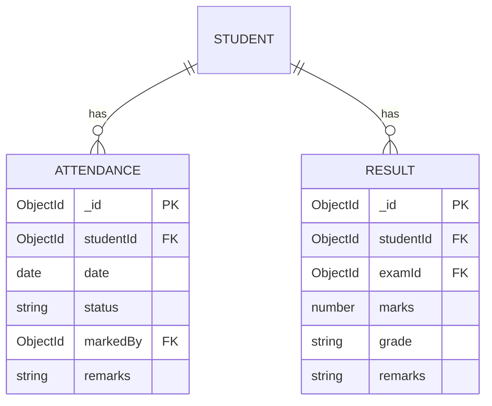
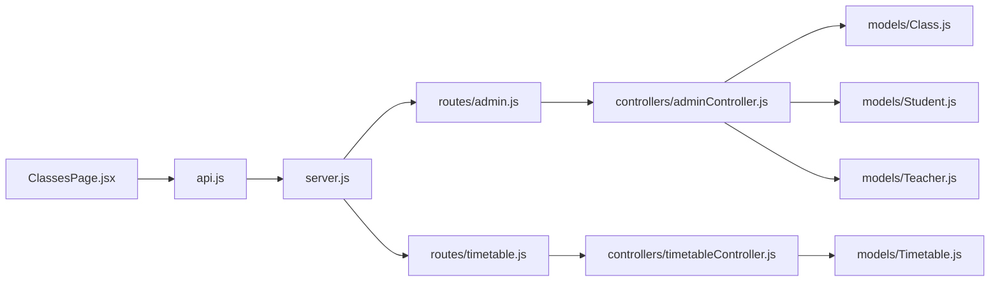

# Class Administration

<cite>
**Referenced Files in This Document**
- [Class.js](file://server/models/Class.js)
- [Timetable.js](file://server/models/Timetable.js)
- [Student.js](file://server/models/Student.js)
- [Teacher.js](file://server/models/Teacher.js)
- [Attendance.js](file://server/models/Attendance.js)
- [Result.js](file://server/models/Result.js)
- [adminController.js](file://server/controllers/adminController.js)
- [timetableController.js](file://server/controllers/timetableController.js)
- [admin.js](file://server/routes/admin.js)
- [timetable.js](file://server/routes/timetable.js)
- [ClassesPage.jsx](file://client/src/pages/admin/ClassesPage.jsx)
- [api.js](file://client/src/api.js)
- [server.js](file://server/server.js)
- [App.jsx](file://client/src/App.jsx)
</cite>

## Table of Contents
1. [Introduction](#introduction)
2. [Project Structure](#project-structure)
3. [Core Components](#core-components)
4. [Architecture Overview](#architecture-overview)
5. [Detailed Component Analysis](#detailed-component-analysis)
6. [Dependency Analysis](#dependency-analysis)
7. [Performance Considerations](#performance-considerations)
8. [Troubleshooting Guide](#troubleshooting-guide)
9. [Conclusion](#conclusion)

## Introduction
This document provides comprehensive documentation for the Class Administration functionality. It covers class creation, scheduling, room allocation, teacher assignment, class management operations (modify, delete, enrollment tracking), the class model structure, timetable integration, capacity management, class roster management, attendance tracking, and academic performance monitoring. It also documents the admin controller functions for class operations and the frontend class administration interface.

## Project Structure
The Class Administration feature spans both the backend (Express server with Mongoose models and controllers) and the frontend (React admin interface). The backend exposes REST endpoints under /api/admin and /api/timetable, while the frontend admin page consumes these endpoints to manage classes and timetables.



**Diagram sources**
- [server.js:18-27](file://server/server.js#L18-L27)
- [admin.js:1-19](file://server/routes/admin.js#L1-L19)
- [timetable.js:1-11](file://server/routes/timetable.js#L1-L11)
- [adminController.js:100-157](file://server/controllers/adminController.js#L100-L157)
- [timetableController.js:1-46](file://server/controllers/timetableController.js#L1-L46)
- [Class.js:1-11](file://server/models/Class.js#L1-L11)
- [Timetable.js:1-16](file://server/models/Timetable.js#L1-L16)
- [Student.js:1-16](file://server/models/Student.js#L1-L16)
- [Teacher.js:1-13](file://server/models/Teacher.js#L1-L13)
- [Attendance.js:1-14](file://server/models/Attendance.js#L1-L14)
- [Result.js:1-14](file://server/models/Result.js#L1-L14)
- [ClassesPage.jsx:1-82](file://client/src/pages/admin/ClassesPage.jsx#L1-L82)
- [api.js:1-28](file://client/src/api.js#L1-L28)
- [App.jsx:26-43](file://client/src/App.jsx#L26-L43)

**Section sources**
- [server.js:18-27](file://server/server.js#L18-L27)
- [admin.js:1-19](file://server/routes/admin.js#L1-L19)
- [timetable.js:1-11](file://server/routes/timetable.js#L1-L11)
- [ClassesPage.jsx:1-82](file://client/src/pages/admin/ClassesPage.jsx#L1-L82)
- [api.js:1-28](file://client/src/api.js#L1-L28)
- [App.jsx:26-43](file://client/src/App.jsx#L26-L43)

## Core Components
- Class model: Defines class identity (name, section), academic year, and optional teacher assignment.
- Timetable model: Stores daily schedule per class with periods containing subject, teacher, time range, and room.
- Student model: Links students to a class via classId and stores enrollment metadata.
- Teacher model: Provides teacher profiles associated with users.
- Attendance and Result models: Track student attendance and academic performance.
- Admin controller: Implements class CRUD, teacher assignment, and class student retrieval.
- Timetable controller: Manages timetable creation/update per class/day and retrieval.
- Frontend ClassesPage: Admin UI for creating/updating/deleting classes and assigning teachers.

**Section sources**
- [Class.js:1-11](file://server/models/Class.js#L1-L11)
- [Timetable.js:1-16](file://server/models/Timetable.js#L1-L16)
- [Student.js:1-16](file://server/models/Student.js#L1-L16)
- [Teacher.js:1-13](file://server/models/Teacher.js#L1-L13)
- [Attendance.js:1-14](file://server/models/Attendance.js#L1-L14)
- [Result.js:1-14](file://server/models/Result.js#L1-L14)
- [adminController.js:100-157](file://server/controllers/adminController.js#L100-L157)
- [timetableController.js:1-46](file://server/controllers/timetableController.js#L1-L46)
- [ClassesPage.jsx:1-82](file://client/src/pages/admin/ClassesPage.jsx#L1-L82)

## Architecture Overview
The system follows a layered architecture:
- Presentation layer: React admin page invokes API endpoints via a shared Axios client.
- API layer: Express routes expose admin and timetable endpoints.
- Business logic layer: Controllers implement class and timetable operations.
- Data access layer: Mongoose models define schemas and relationships.



**Diagram sources**
- [ClassesPage.jsx:14-29](file://client/src/pages/admin/ClassesPage.jsx#L14-L29)
- [api.js:1-28](file://client/src/api.js#L1-L28)
- [server.js:18-27](file://server/server.js#L18-L27)
- [admin.js:12-17](file://server/routes/admin.js#L12-L17)
- [timetable.js:6](file://server/routes/timetable.js#L6)
- [adminController.js:110-117](file://server/controllers/adminController.js#L110-L117)
- [timetableController.js:3-10](file://server/controllers/timetableController.js#L3-L10)
- [Class.js:1-11](file://server/models/Class.js#L1-L11)
- [Timetable.js:1-16](file://server/models/Timetable.js#L1-L16)

## Detailed Component Analysis

### Class Model and Enrollment Tracking
- Class identity: name, section, academic year, and optional teacherId.
- Enrollment: Students are linked to classes via classId.
- Capacity management: No explicit capacity field in the Class model; enrollment limits are implicit via student records.

```mermaid
erDiagram
CLASS {
ObjectId _id PK
string name
string section
ObjectId teacherId
string academicYear
}
STUDENT {
ObjectId _id PK
ObjectId userId FK
ObjectId classId FK
ObjectId parentId
string rollNumber
date admissionDate
date dateOfBirth
string gender
string bloodGroup
string emergencyContact
}
TEACHER {
ObjectId _id PK
ObjectId userId FK
string subject
string qualification
number experience
date joinDate
number salary
}
CLASS ||--o{ STUDENT : "enrolls"
TEACHER ||--o{ CLASS : "assigned_to"
```

**Diagram sources**
- [Class.js:3-8](file://server/models/Class.js#L3-L8)
- [Student.js:3-13](file://server/models/Student.js#L3-L13)
- [Teacher.js:3-10](file://server/models/Teacher.js#L3-L10)

**Section sources**
- [Class.js:1-11](file://server/models/Class.js#L1-L11)
- [Student.js:1-16](file://server/models/Student.js#L1-L16)
- [Teacher.js:1-13](file://server/models/Teacher.js#L1-L13)

### Admin Controller: Class Operations
- getAllClasses: Returns all classes with teacher populated.
- createClass: Creates a new class from request body.
- updateClass: Updates an existing class by ID.
- deleteClass: Removes a class by ID.
- getClassStudents: Retrieves all students enrolled in a class with user and parent info.
- assignTeacher: Assigns a teacher to a class by updating teacherId.



**Diagram sources**
- [adminController.js:100-157](file://server/controllers/adminController.js#L100-L157)
- [Class.js:1-11](file://server/models/Class.js#L1-L11)
- [Student.js:1-16](file://server/models/Student.js#L1-L16)

**Section sources**
- [adminController.js:100-157](file://server/controllers/adminController.js#L100-L157)

### Timetable Integration
- Timetable per class and day with ordered periods.
- Each period includes subject, teacherId, start/end time, and optional room.
- Controller supports retrieving, creating/updating, and deleting timetables.



**Diagram sources**
- [timetableController.js:12-27](file://server/controllers/timetableController.js#L12-L27)
- [Timetable.js:3-13](file://server/models/Timetable.js#L3-L13)

**Section sources**
- [Timetable.js:1-16](file://server/models/Timetable.js#L1-L16)
- [timetableController.js:1-46](file://server/controllers/timetableController.js#L1-L46)

### Frontend Class Administration Interface
- Lists classes with basic info and teacher assignment dropdown.
- Supports adding/editing classes via modal form.
- Fetches available teachers and class students.
- Calls admin endpoints for create, update, delete, and teacher assignment.



**Diagram sources**
- [ClassesPage.jsx:14-29](file://client/src/pages/admin/ClassesPage.jsx#L14-L29)
- [admin.js:12-17](file://server/routes/admin.js#L12-L17)
- [adminController.js:100-157](file://server/controllers/adminController.js#L100-L157)

**Section sources**
- [ClassesPage.jsx:1-82](file://client/src/pages/admin/ClassesPage.jsx#L1-L82)
- [api.js:1-28](file://client/src/api.js#L1-L28)
- [admin.js:12-17](file://server/routes/admin.js#L12-L17)
- [adminController.js:100-157](file://server/controllers/adminController.js#L100-L157)

### Attendance and Academic Performance Monitoring
- Attendance tracking: Each record includes studentId, date, status, markedBy, and remarks.
- Academic performance: Results include studentId, examId, marks, grade, and remarks.
- These models enable class-level analytics and reporting when combined with class and student queries.



**Diagram sources**
- [Attendance.js:3-9](file://server/models/Attendance.js#L3-L9)
- [Result.js:3-9](file://server/models/Result.js#L3-L9)
- [Student.js:3-5](file://server/models/Student.js#L3-L5)

**Section sources**
- [Attendance.js:1-14](file://server/models/Attendance.js#L1-L14)
- [Result.js:1-14](file://server/models/Result.js#L1-L14)

## Dependency Analysis
- Routes depend on controllers.
- Controllers depend on models.
- Frontend depends on server routes via Axios interceptors.
- Class and timetable models are central to class administration workflows.



**Diagram sources**
- [admin.js:1-19](file://server/routes/admin.js#L1-L19)
- [timetable.js:1-11](file://server/routes/timetable.js#L1-L11)
- [adminController.js:100-157](file://server/controllers/adminController.js#L100-L157)
- [timetableController.js:1-46](file://server/controllers/timetableController.js#L1-L46)
- [Class.js:1-11](file://server/models/Class.js#L1-L11)
- [Timetable.js:1-16](file://server/models/Timetable.js#L1-L16)
- [Student.js:1-16](file://server/models/Student.js#L1-L16)
- [Teacher.js:1-13](file://server/models/Teacher.js#L1-L13)
- [ClassesPage.jsx:1-82](file://client/src/pages/admin/ClassesPage.jsx#L1-L82)
- [api.js:1-28](file://client/src/api.js#L1-L28)
- [server.js:18-27](file://server/server.js#L18-L27)

**Section sources**
- [admin.js:1-19](file://server/routes/admin.js#L1-L19)
- [timetable.js:1-11](file://server/routes/timetable.js#L1-L11)
- [adminController.js:100-157](file://server/controllers/adminController.js#L100-L157)
- [timetableController.js:1-46](file://server/controllers/timetableController.js#L1-L46)
- [ClassesPage.jsx:1-82](file://client/src/pages/admin/ClassesPage.jsx#L1-L82)
- [api.js:1-28](file://client/src/api.js#L1-L28)
- [server.js:18-27](file://server/server.js#L18-L27)

## Performance Considerations
- Populate vs. join: Controllers populate teacher and student relations; avoid unnecessary deep population for large datasets.
- Pagination: Consider adding pagination to class and student listings to reduce payload sizes.
- Indexes: Ensure classId and teacherId are indexed for frequent lookups.
- Batch operations: For bulk timetable updates, consider batch writes to minimize round trips.

## Troubleshooting Guide
- Authentication failures: Requests without a valid token redirect to login.
- Authorization: Admin-only endpoints enforce role checks; ensure the logged-in user has the admin role.
- Class not found: Deleting or updating a non-existent class returns a 404-style message from the controller.
- Teacher assignment: Ensure teacherId is valid and belongs to a teacher profile.

**Section sources**
- [api.js:16-25](file://client/src/api.js#L16-L25)
- [admin.js:3](file://server/routes/admin.js#L3)
- [adminController.js:119-136](file://server/controllers/adminController.js#L119-L136)

## Conclusion
The Class Administration feature integrates a clean separation of concerns across the frontend and backend. The admin controller provides robust class lifecycle management, while the timetable controller enables flexible scheduling. The frontend offers a straightforward interface for managing classes and assigning teachers. Extending capacity management, room allocation, and performance dashboards would further enhance the system’s capabilities.