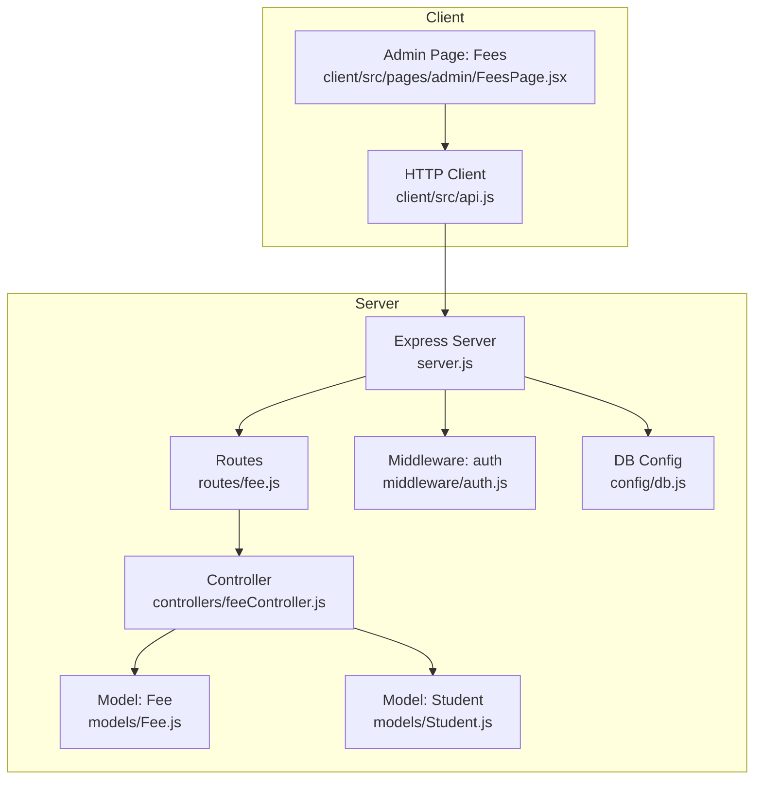
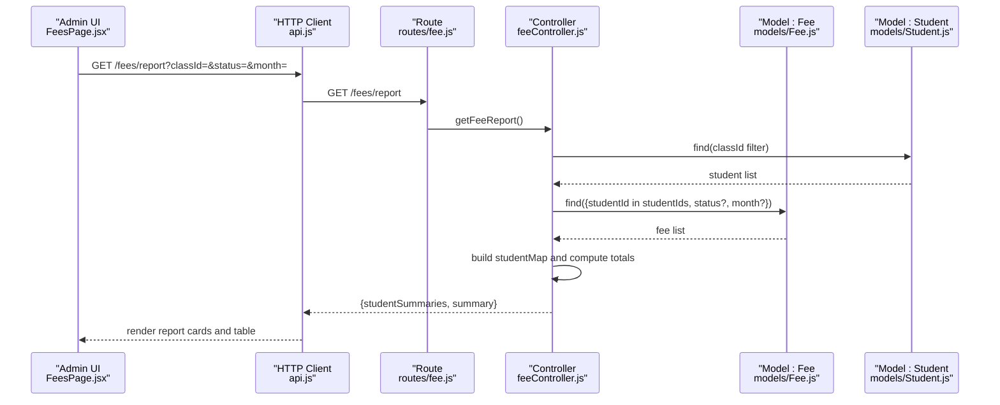
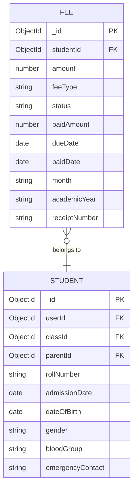
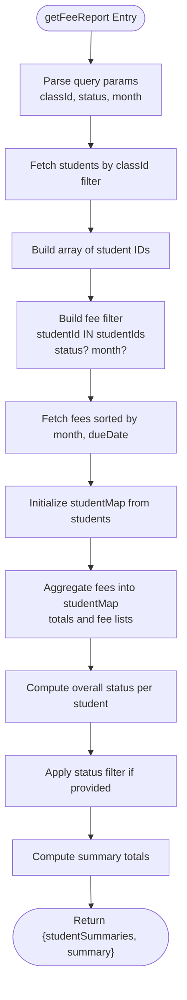
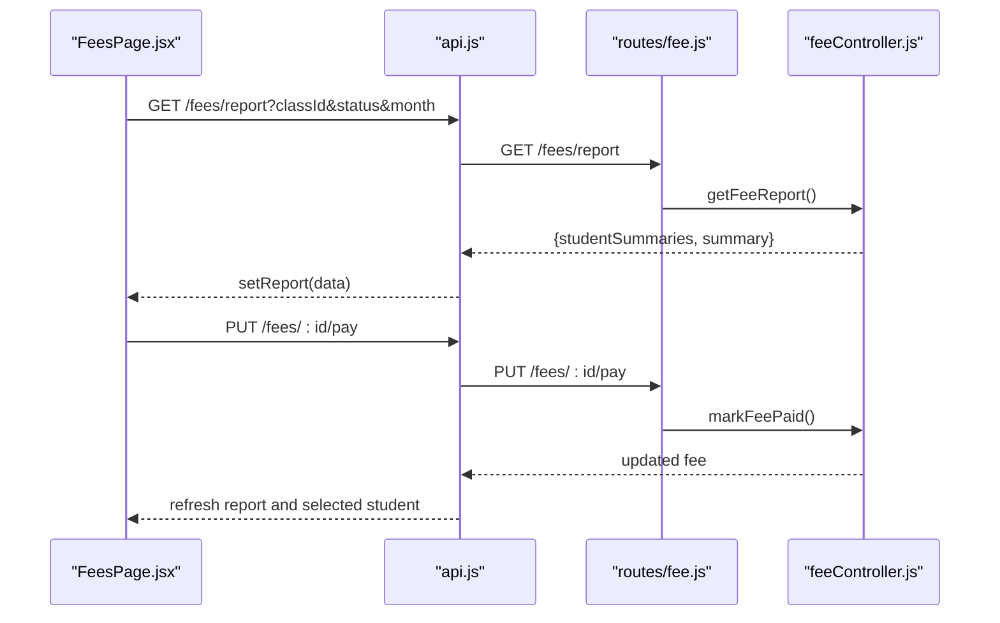
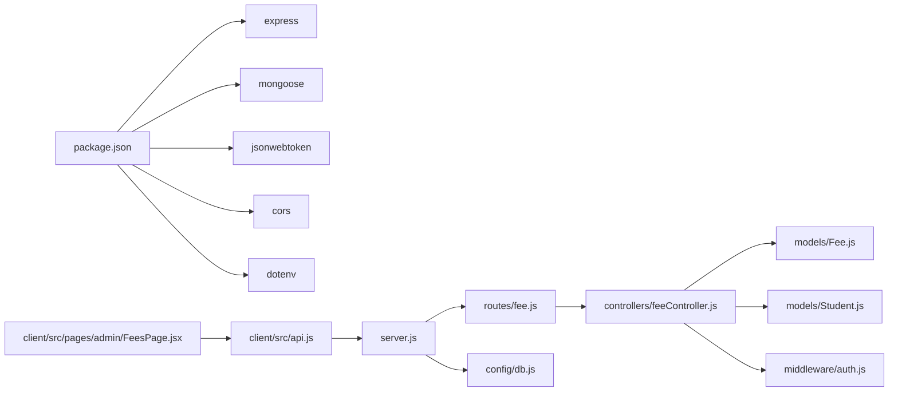

# Fee Processing

<cite>
**Referenced Files in This Document**
- [Fee.js](file://server/models/Fee.js)
- [Student.js](file://server/models/Student.js)
- [feeController.js](file://server/controllers/feeController.js)
- [fee.js](file://server/routes/fee.js)
- [FeesPage.jsx](file://client/src/pages/admin/FeesPage.jsx)
- [api.js](file://client/src/api.js)
- [auth.js](file://server/middleware/auth.js)
- [server.js](file://server/server.js)
- [db.js](file://server/config/db.js)
- [package.json](file://server/package.json)
</cite>

## Table of Contents
1. [Introduction](#introduction)
2. [Project Structure](#project-structure)
3. [Core Components](#core-components)
4. [Architecture Overview](#architecture-overview)
5. [Detailed Component Analysis](#detailed-component-analysis)
6. [Dependency Analysis](#dependency-analysis)
7. [Performance Considerations](#performance-considerations)
8. [Troubleshooting Guide](#troubleshooting-guide)
9. [Conclusion](#conclusion)
10. [Appendices](#appendices)

## Introduction
This document describes the Fee Processing system, covering fee structure creation, payment tracking, invoice generation, and financial reporting. It explains fee collection workflows, payment methods, due date management, and late payment handling. It also documents the fee model schema, payment validation, financial reconciliation processes, bulk fee processing, payment reminders, and financial aid management. Finally, it details the fee controller functions and the frontend fee management interface.

## Project Structure
The Fee Processing system spans backend and frontend components:
- Backend: Express server, Mongoose models, fee controller, routes, and middleware for authentication and authorization.
- Frontend: React-based admin interface for viewing reports, editing fee records, and marking payments.

**Diagram sources**
- [server.js:1-38](file://server/server.js#L1-L38)
- [fee.js:1-13](file://server/routes/fee.js#L1-L13)
- [feeController.js:1-119](file://server/controllers/feeController.js#L1-L119)
- [Fee.js:1-17](file://server/models/Fee.js#L1-L17)
- [Student.js:1-16](file://server/models/Student.js#L1-L16)
- [auth.js:1-31](file://server/middleware/auth.js#L1-L31)
- [db.js:1-14](file://server/config/db.js#L1-L14)
- [FeesPage.jsx:1-379](file://client/src/pages/admin/FeesPage.jsx#L1-L379)
- [api.js:1-28](file://client/src/api.js#L1-L28)

**Section sources**
- [server.js:1-38](file://server/server.js#L1-L38)
- [fee.js:1-13](file://server/routes/fee.js#L1-L13)
- [feeController.js:1-119](file://server/controllers/feeController.js#L1-L119)
- [Fee.js:1-17](file://server/models/Fee.js#L1-L17)
- [Student.js:1-16](file://server/models/Student.js#L1-L16)
- [auth.js:1-31](file://server/middleware/auth.js#L1-L31)
- [db.js:1-14](file://server/config/db.js#L1-L14)
- [FeesPage.jsx:1-379](file://client/src/pages/admin/FeesPage.jsx#L1-L379)
- [api.js:1-28](file://client/src/api.js#L1-L28)

## Core Components
- Fee Model: Defines fee records with student association, amount, type, status, paid amount, due date, month, academic year, and optional receipt number.
- Student Model: Links users to classes and parents, enabling class-based filtering for reports.
- Fee Controller: Implements endpoints for creating, updating, marking paid, and generating fee reports.
- Routes: Exposes protected endpoints for admin users.
- Frontend Fees Page: Provides filters, report summaries, and actions to edit records and mark payments.

Key capabilities:
- Create fee records per student and month.
- Update fee records (amount, type, due date, month, status, paid amount).
- Mark individual fees as paid with automatic paid date and paid amount update.
- Generate consolidated student-level fee reports with totals and status.
- Filter reports by class, status, and month.

**Section sources**
- [Fee.js:1-17](file://server/models/Fee.js#L1-L17)
- [Student.js:1-16](file://server/models/Student.js#L1-L16)
- [feeController.js:4-119](file://server/controllers/feeController.js#L4-L119)
- [fee.js:6-10](file://server/routes/fee.js#L6-L10)
- [FeesPage.jsx:16-23](file://client/src/pages/admin/FeesPage.jsx#L16-L23)

## Architecture Overview
The system follows a layered architecture:
- Presentation Layer: Admin UI renders reports and allows edits/mark-as-paid.
- Application Layer: Controllers orchestrate data retrieval and transformations.
- Domain Layer: Models define schemas and relationships.
- Infrastructure Layer: Routes, middleware, and database connections.

**Diagram sources**
- [FeesPage.jsx:16-23](file://client/src/pages/admin/FeesPage.jsx#L16-L23)
- [api.js:1-28](file://client/src/api.js#L1-L28)
- [fee.js:10](file://server/routes/fee.js#L10)
- [feeController.js:42-118](file://server/controllers/feeController.js#L42-L118)
- [Fee.js:1-17](file://server/models/Fee.js#L1-L17)
- [Student.js:1-16](file://server/models/Student.js#L1-L16)

## Detailed Component Analysis

### Fee Model Schema
The Fee model defines the fee record structure and relationships:
- Fields: studentId (refers to Student), amount, feeType (enumeration), status (enumeration), paidAmount, dueDate, paidDate, month, academicYear, receiptNumber.
- Indexing and constraints: Required fields enforce data integrity; enums constrain valid values.

**Diagram sources**
- [Fee.js:3-14](file://server/models/Fee.js#L3-L14)
- [Student.js:3-13](file://server/models/Student.js#L3-L13)

**Section sources**
- [Fee.js:1-17](file://server/models/Fee.js#L1-L17)
- [Student.js:1-16](file://server/models/Student.js#L1-L16)

### Fee Controller Functions
- createFee: Creates a new fee record.
- getStudentFees: Retrieves all fees for a given student, sorted by due date descending.
- updateFee: Updates an existing fee record.
- markFeePaid: Marks a fee as paid, sets paidDate and paidAmount, and returns the updated record.
- getFeeReport: Builds a student-centric report filtered by class, status, and month, computes totals, and aggregates status.

**Diagram sources**
- [feeController.js:42-118](file://server/controllers/feeController.js#L42-L118)

**Section sources**
- [feeController.js:4-119](file://server/controllers/feeController.js#L4-L119)

### Routes and Authorization
- POST /fees: Create fee (admin only).
- GET /fees/student/:studentId: Get student fees.
- PUT /fees/:id: Update fee (admin only).
- PUT /fees/:id/pay: Mark fee as paid (admin only).
- GET /fees/report: Generate fee report (admin only).

Authorization uses JWT middleware to verify tokens and role checks.

**Section sources**
- [fee.js:6-10](file://server/routes/fee.js#L6-L10)
- [auth.js:4-28](file://server/middleware/auth.js#L4-L28)

### Frontend Fee Management Interface
The admin Fees page provides:
- Filters: Class, Status, Month.
- Report cards: Total collected, total pending, number of students.
- Student summary table: Name, class, parent, total fee, paid, pending, status, action.
- Detail view: Per-student breakdown with month, amount, type, status, actions.
- Actions: Edit fee record, mark as paid.
- Edit modal: Update amount, fee type, month, due date, status, and paid amount (conditional).

**Diagram sources**
- [FeesPage.jsx:16-41](file://client/src/pages/admin/FeesPage.jsx#L16-L41)
- [api.js:1-28](file://client/src/api.js#L1-L28)
- [fee.js:9](file://server/routes/fee.js#L9)
- [feeController.js:32-40](file://server/controllers/feeController.js#L32-L40)

**Section sources**
- [FeesPage.jsx:16-379](file://client/src/pages/admin/FeesPage.jsx#L16-L379)
- [api.js:1-28](file://client/src/api.js#L1-L28)

## Dependency Analysis
- Server dependencies include Express, Mongoose, JWT, CORS, and dotenv.
- Authentication middleware verifies JWT and authorizes roles.
- Routes depend on controller functions.
- Controller functions depend on models for data access.
- Frontend depends on the API client for HTTP communication.

**Diagram sources**
- [package.json:11-19](file://server/package.json#L11-L19)
- [server.js:18-28](file://server/server.js#L18-L28)
- [fee.js:1-13](file://server/routes/fee.js#L1-L13)
- [feeController.js:1-119](file://server/controllers/feeController.js#L1-L119)
- [Fee.js:1-17](file://server/models/Fee.js#L1-L17)
- [Student.js:1-16](file://server/models/Student.js#L1-L16)
- [auth.js:1-31](file://server/middleware/auth.js#L1-L31)
- [db.js:1-14](file://server/config/db.js#L1-L14)
- [FeesPage.jsx:1-379](file://client/src/pages/admin/FeesPage.jsx#L1-L379)
- [api.js:1-28](file://client/src/api.js#L1-L28)

**Section sources**
- [package.json:11-19](file://server/package.json#L11-L19)
- [server.js:18-28](file://server/server.js#L18-L28)
- [auth.js:1-31](file://server/middleware/auth.js#L1-L31)

## Performance Considerations
- Report aggregation: The report endpoint performs population and aggregation across students and fees; consider indexing studentId, status, and month for improved query performance.
- Sorting and filtering: Sorting by month and dueDate helps pagination and rendering; ensure appropriate indexes exist.
- Bulk updates: For bulk fee processing, batch operations or bulk write operations can reduce round trips.
- Pagination: For large datasets, implement pagination in report queries to avoid large payloads.

## Troubleshooting Guide
Common issues and resolutions:
- Authentication failures: Ensure a valid Bearer token is present in the Authorization header; the interceptor adds the token automatically.
- Authorization errors: Verify the user role is admin for protected endpoints.
- Token expiration: On 401 responses, the client clears local storage and redirects to login.
- Missing or invalid parameters: Ensure required fields (amount, dueDate, month) are provided when creating or editing fees.

**Section sources**
- [api.js:8-25](file://client/src/api.js#L8-L25)
- [auth.js:4-28](file://server/middleware/auth.js#L4-L28)
- [feeController.js:4-119](file://server/controllers/feeController.js#L4-L119)

## Conclusion
The Fee Processing system provides a clear, role-protected pathway for managing student fees. It supports creating and updating fee records, marking payments, and generating comprehensive financial reports. The frontend offers intuitive controls for filtering, editing, and reconciling fee data. Extending the system with bulk operations, payment reminders, and financial aid management would further enhance operational efficiency.

## Appendices

### Fee Collection Workflows
- Create fee: Admin creates monthly fee records per student.
- Payment tracking: Admin marks fees as paid; paidDate and paidAmount are recorded.
- Reporting: Admin filters by class, status, and month to view consolidated summaries.

**Section sources**
- [feeController.js:4-40](file://server/controllers/feeController.js#L4-L40)
- [feeController.js:42-118](file://server/controllers/feeController.js#L42-L118)
- [fee.js:6-10](file://server/routes/fee.js#L6-L10)

### Payment Methods and Validation
- Payment methods: The system currently supports marking fees as paid via the admin interface. Additional payment integrations can be added by extending the payment processing pipeline.
- Validation: Required fields and enums are enforced at the model and controller levels.

**Section sources**
- [Fee.js:3-14](file://server/models/Fee.js#L3-L14)
- [feeController.js:32-40](file://server/controllers/feeController.js#L32-L40)

### Due Date Management and Late Payment Handling
- Due dates: Managed via dueDate and month fields; sorting ensures chronological processing.
- Late payment handling: Implement cron jobs or scheduled tasks to flag overdue fees and trigger reminders.

**Section sources**
- [Fee.js:9-11](file://server/models/Fee.js#L9-L11)
- [feeController.js:55](file://server/controllers/feeController.js#L55)

### Financial Reconciliation
- Reconciliation: The report endpoint computes total collected and pending amounts per student and globally, supporting reconciliation against cash books.

**Section sources**
- [feeController.js:104-114](file://server/controllers/feeController.js#L104-L114)

### Bulk Fee Processing
- Bulk processing: Extend the controller to accept arrays of fee IDs and apply batch updates for status and paidAmount.

**Section sources**
- [feeController.js:22-30](file://server/controllers/feeController.js#L22-L30)

### Payment Reminders
- Reminders: Integrate email/SMS notifications for overdue fees using scheduled tasks.

[No sources needed since this section provides general guidance]

### Financial Aid Management
- Financial aid: Add a field in the fee model or a separate financial aid model to track waivers and discounts, and adjust totals accordingly in reports.

[No sources needed since this section provides general guidance]