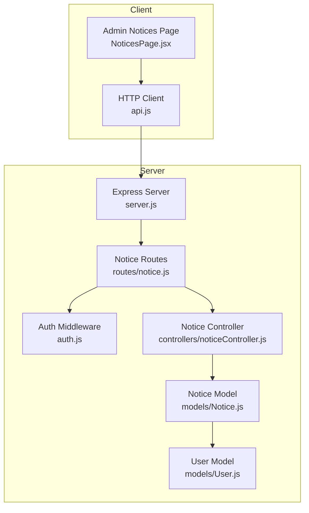
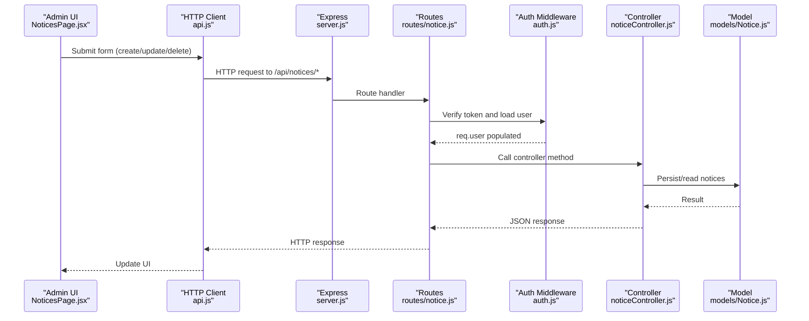
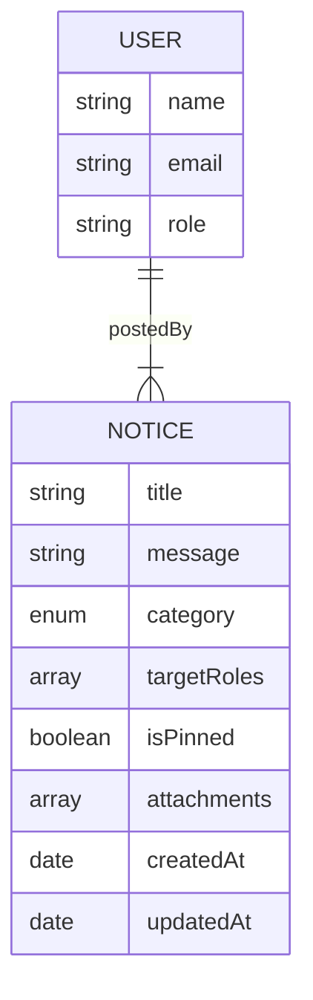
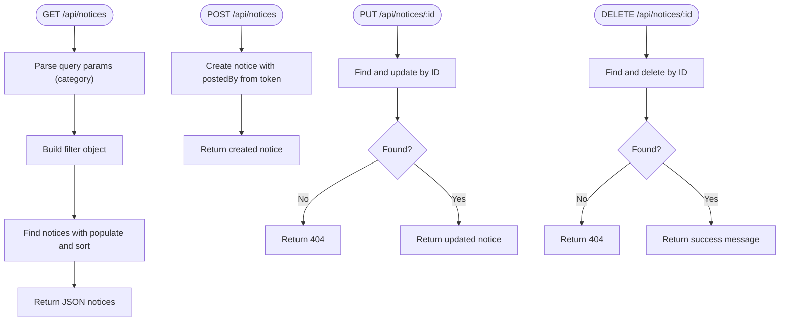
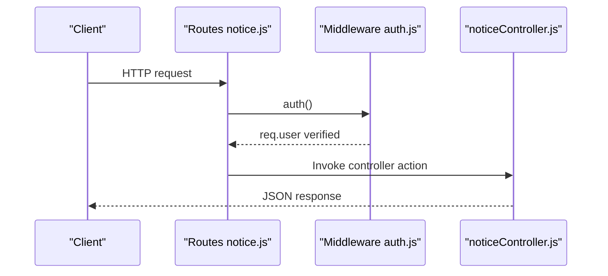
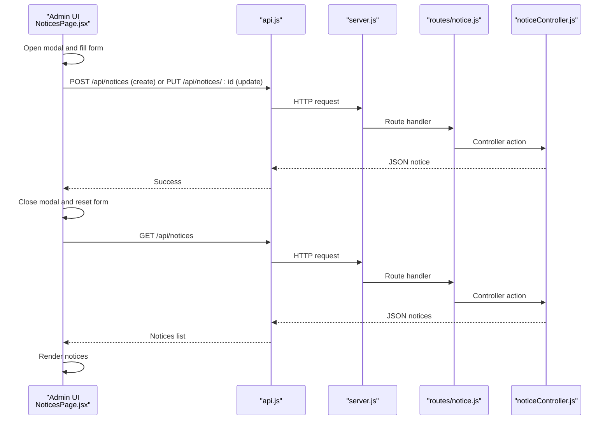
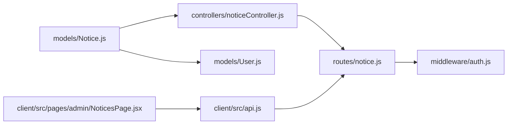

# Notice Board

<cite>
**Referenced Files in This Document**
- [Notice.js](file://server/models/Notice.js)
- [noticeController.js](file://server/controllers/noticeController.js)
- [notice.js](file://server/routes/notice.js)
- [NoticesPage.jsx](file://client/src/pages/admin/NoticesPage.jsx)
- [api.js](file://client/src/api.js)
- [auth.js](file://server/middleware/auth.js)
- [server.js](file://server/server.js)
- [User.js](file://server/models/User.js)
- [seed.js](file://server/seed.js)
- [server-memory.js](file://server/server-memory.js)
- [teacherController.js](file://server/controllers/teacherController.js)
- [parentController.js](file://server/controllers/parentController.js)
</cite>

## Table of Contents
1. [Introduction](#introduction)
2. [Project Structure](#project-structure)
3. [Core Components](#core-components)
4. [Architecture Overview](#architecture-overview)
5. [Detailed Component Analysis](#detailed-component-analysis)
6. [Dependency Analysis](#dependency-analysis)
7. [Performance Considerations](#performance-considerations)
8. [Troubleshooting Guide](#troubleshooting-guide)
9. [Conclusion](#conclusion)

## Introduction
This document describes the Notice Board system in the School Management Application. It covers how notices are modeled, created, published, filtered, and managed by administrators and teachers. It also explains audience targeting via roles, notice categories, pinning behavior, and the current frontend management interface for administrators. Where applicable, it highlights missing features such as scheduling, expiration dates, and bulk operations, and suggests how to extend the system.

## Project Structure
The Notice Board spans backend and frontend components:
- Backend: Express server, Mongoose model, controller, route, and middleware
- Frontend: React page for administrators to create, update, delete, and list notices
- Supporting: Authentication middleware, user model, seeding, and alternative in-memory server

**Diagram sources**
- [server.js:1-38](file://server/server.js#L1-L38)
- [notice.js:1-12](file://server/routes/notice.js#L1-L12)
- [noticeController.js:1-43](file://server/controllers/noticeController.js#L1-L43)
- [Notice.js:1-14](file://server/models/Notice.js#L1-L14)
- [User.js:1-27](file://server/models/User.js#L1-L27)
- [auth.js:1-31](file://server/middleware/auth.js#L1-L31)
- [NoticesPage.jsx:1-86](file://client/src/pages/admin/NoticesPage.jsx#L1-L86)
- [api.js:1-28](file://client/src/api.js#L1-L28)

**Section sources**
- [server.js:1-38](file://server/server.js#L1-L38)
- [notice.js:1-12](file://server/routes/notice.js#L1-L12)
- [noticeController.js:1-43](file://server/controllers/noticeController.js#L1-L43)
- [Notice.js:1-14](file://server/models/Notice.js#L1-L14)
- [User.js:1-27](file://server/models/User.js#L1-L27)
- [auth.js:1-31](file://server/middleware/auth.js#L1-L31)
- [NoticesPage.jsx:1-86](file://client/src/pages/admin/NoticesPage.jsx#L1-L86)
- [api.js:1-28](file://client/src/api.js#L1-L28)

## Core Components
- Notice model defines the structure for notices, including title, message, category, target roles, poster reference, pin state, and optional attachments. Timestamps are auto-managed.
- Notice controller exposes endpoints to list, create, update, and delete notices. It populates the creator’s name and sorts by pinned status and recency.
- Notice routes are protected by authentication middleware and expose GET/POST/PUT/DELETE handlers.
- Admin frontend page allows administrators to add, edit, and remove notices, and to pin or categorize them.

Key capabilities currently implemented:
- Notice CRUD
- Category filtering (via query parameter)
- Role-based visibility (targetRoles)
- Pinned notices sorting
- Creator attribution

Missing capabilities (see Enhancement Recommendations):
- Scheduling and expiration dates
- Bulk operations
- Recipient tracking
- Notification delivery

**Section sources**
- [Notice.js:1-14](file://server/models/Notice.js#L1-L14)
- [noticeController.js:1-43](file://server/controllers/noticeController.js#L1-L43)
- [notice.js:1-12](file://server/routes/notice.js#L1-L12)
- [NoticesPage.jsx:1-86](file://client/src/pages/admin/NoticesPage.jsx#L1-L86)

## Architecture Overview
The Notice Board follows a layered architecture:
- Presentation: Admin UI renders notices and handles forms
- API: REST endpoints for notices
- Business logic: Controllers implement notice operations
- Persistence: Mongoose model with MongoDB
- Security: JWT-based authentication middleware

**Diagram sources**
- [NoticesPage.jsx:13-20](file://client/src/pages/admin/NoticesPage.jsx#L13-L20)
- [api.js:1-28](file://client/src/api.js#L1-L28)
- [server.js:18-27](file://server/server.js#L18-L27)
- [notice.js:6-9](file://server/routes/notice.js#L6-L9)
- [auth.js:4-19](file://server/middleware/auth.js#L4-L19)
- [noticeController.js:3-42](file://server/controllers/noticeController.js#L3-L42)
- [Notice.js:1-14](file://server/models/Notice.js#L1-L14)

## Detailed Component Analysis

### Notice Model
The Notice model defines:
- title: required string
- message: required string
- category: enum with values general, exam, holiday, event, urgent
- targetRoles: array of role enums (admin, teacher, student, parent)
- postedBy: ObjectId referencing User
- isPinned: boolean flag
- attachments: array of strings (for file URLs)
- timestamps: createdAt and updatedAt

**Diagram sources**
- [Notice.js:3-11](file://server/models/Notice.js#L3-L11)
- [User.js:4-13](file://server/models/User.js#L4-L13)

**Section sources**
- [Notice.js:1-14](file://server/models/Notice.js#L1-L14)
- [User.js:1-27](file://server/models/User.js#L1-L27)

### Notice Controller Functions
- getAllNotices: filters by category if provided, populates postedBy, sorts by pinned desc and creation time desc
- createNotice: creates a notice with postedBy set to the authenticated user
- updateNotice: updates an existing notice by ID
- deleteNotice: removes a notice by ID

**Diagram sources**
- [noticeController.js:3-42](file://server/controllers/noticeController.js#L3-L42)

**Section sources**
- [noticeController.js:1-43](file://server/controllers/noticeController.js#L1-L43)

### Notice Routes and Authentication
- Routes: GET /api/notices, POST /api/notices, PUT /api/notices/:id, DELETE /api/notices/:id
- All routes are protected by auth middleware that verifies JWT and attaches user info to the request
- Authorization helpers are available for role-based access control

**Diagram sources**
- [notice.js:6-9](file://server/routes/notice.js#L6-L9)
- [auth.js:4-19](file://server/middleware/auth.js#L4-L19)
- [noticeController.js:3-42](file://server/controllers/noticeController.js#L3-L42)

**Section sources**
- [notice.js:1-12](file://server/routes/notice.js#L1-L12)
- [auth.js:1-31](file://server/middleware/auth.js#L1-L31)

### Frontend Notice Management Interface
- Fetches notices from /api/notices on mount
- Supports create/edit via modal form with fields for title, message, category, and pin toggle
- Displays notices with title, category badge, message preview, creator, creation date, and targeted roles
- Provides delete confirmation and refreshes the list after changes

**Diagram sources**
- [NoticesPage.jsx:13-20](file://client/src/pages/admin/NoticesPage.jsx#L13-L20)
- [api.js:1-28](file://client/src/api.js#L1-L28)
- [server.js:18-27](file://server/server.js#L18-L27)
- [notice.js:6-9](file://server/routes/notice.js#L6-L9)
- [noticeController.js:3-42](file://server/controllers/noticeController.js#L3-L42)

**Section sources**
- [NoticesPage.jsx:1-86](file://client/src/pages/admin/NoticesPage.jsx#L1-L86)
- [api.js:1-28](file://client/src/api.js#L1-L28)

### Audience Targeting and Visibility
- targetRoles field controls who sees a notice. The current implementation relies on the admin UI to set target roles during creation/edit.
- There are separate controllers for parent and teacher dashboards that demonstrate role-based notice retrieval patterns:
  - Parent controller lists notices matching parent or all targets
  - Teacher controller includes a createNotice endpoint for teachers

Note: The admin route does not enforce role-based filtering; it returns all notices per the current controller implementation.

**Section sources**
- [Notice.js:6-7](file://server/models/Notice.js#L6-L7)
- [parentController.js:56-63](file://server/controllers/parentController.js#L56-L63)
- [teacherController.js:172-180](file://server/controllers/teacherController.js#L172-L180)

### Categories, Priority, and Formatting
- Categories: general, exam, holiday, event, urgent
- Priority: represented by category and isPinned flag; pinned notices appear first
- Content formatting: message is stored as plain text; attachments are optional string URLs

**Section sources**
- [Notice.js:6](file://server/models/Notice.js#L6)
- [NoticesPage.jsx:24-27](file://client/src/pages/admin/NoticesPage.jsx#L24-L27)
- [seed.js:227-247](file://server/seed.js#L227-L247)

### Distribution Mechanisms
- Current distribution: notices are fetched by role-specific controllers and rendered in respective dashboards
- No centralized push notification system is implemented in the provided code

**Section sources**
- [parentController.js:56-63](file://server/controllers/parentController.js#L56-L63)
- [teacherController.js:172-180](file://server/controllers/teacherController.js#L172-L180)

## Dependency Analysis
- Controllers depend on the Notice model
- Routes depend on controllers and authentication middleware
- Frontend depends on the HTTP client and server routes
- Authentication middleware depends on JWT and the User model

**Diagram sources**
- [Notice.js:1-14](file://server/models/Notice.js#L1-L14)
- [noticeController.js:1-43](file://server/controllers/noticeController.js#L1-L43)
- [notice.js:1-12](file://server/routes/notice.js#L1-L12)
- [auth.js:1-31](file://server/middleware/auth.js#L1-L31)
- [User.js:1-27](file://server/models/User.js#L1-L27)
- [NoticesPage.jsx:1-86](file://client/src/pages/admin/NoticesPage.jsx#L1-L86)
- [api.js:1-28](file://client/src/api.js#L1-L28)

**Section sources**
- [noticeController.js:1-43](file://server/controllers/noticeController.js#L1-L43)
- [notice.js:1-12](file://server/routes/notice.js#L1-L12)
- [auth.js:1-31](file://server/middleware/auth.js#L1-L31)
- [Notice.js:1-14](file://server/models/Notice.js#L1-L14)
- [User.js:1-27](file://server/models/User.js#L1-L27)
- [NoticesPage.jsx:1-86](file://client/src/pages/admin/NoticesPage.jsx#L1-L86)
- [api.js:1-28](file://client/src/api.js#L1-L28)

## Performance Considerations
- Sorting by pinned and creation date is efficient with appropriate indexes on these fields.
- Populate on postedBy adds a reference lookup; ensure indexes on User._id for optimal performance.
- Filtering by category is straightforward; consider indexing category for frequent queries.
- Frontend re-fetches notices after each operation; batching updates could reduce network overhead.

[No sources needed since this section provides general guidance]

## Troubleshooting Guide
Common issues and remedies:
- Authentication failures: Ensure Authorization header includes a valid Bearer token; the middleware returns 401 if missing or invalid.
- Authorization errors: Some routes use role-based authorization helpers; verify the user’s role matches expected values.
- Notice not found: Update/Delete endpoints return 404 when the notice ID does not exist.
- CORS: The server enables CORS; ensure requests originate from allowed origins.
- Token expiry: On receiving 401 responses, the client clears local storage and redirects to login.

**Section sources**
- [auth.js:4-19](file://server/middleware/auth.js#L4-L19)
- [noticeController.js:24-41](file://server/controllers/noticeController.js#L24-L41)
- [api.js:16-25](file://client/src/api.js#L16-L25)

## Conclusion
The Notice Board system provides a solid foundation for creating, managing, and distributing notices. Administrators can create, edit, and delete notices, while pinned notices and categories help organize information. Role-based targeting is supported conceptually via targetRoles, though enforcement varies by route/controller. The frontend offers a streamlined admin interface for notice management. To reach parity with advanced requirements, consider adding scheduling and expiration, bulk operations, recipient tracking, and a notification delivery mechanism.