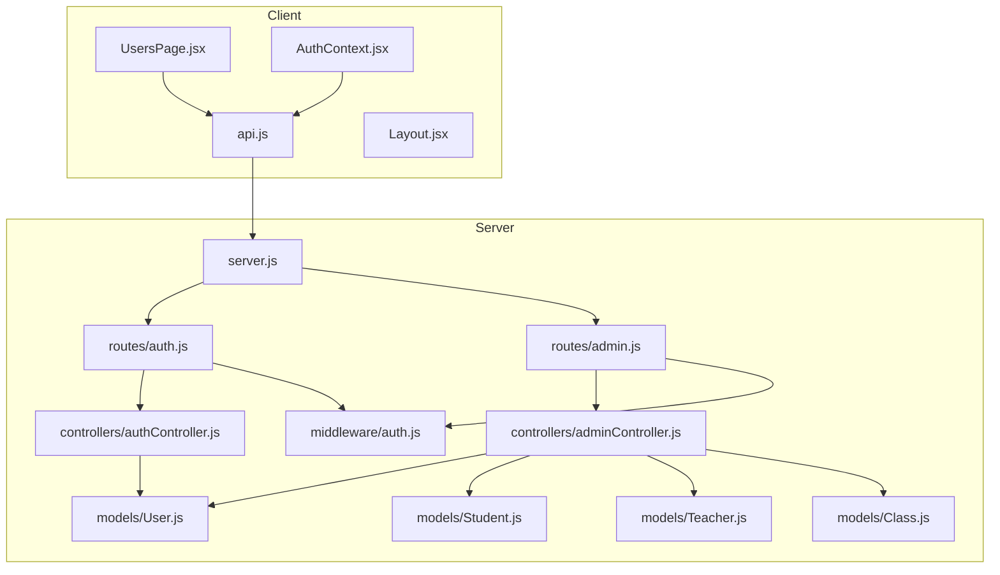
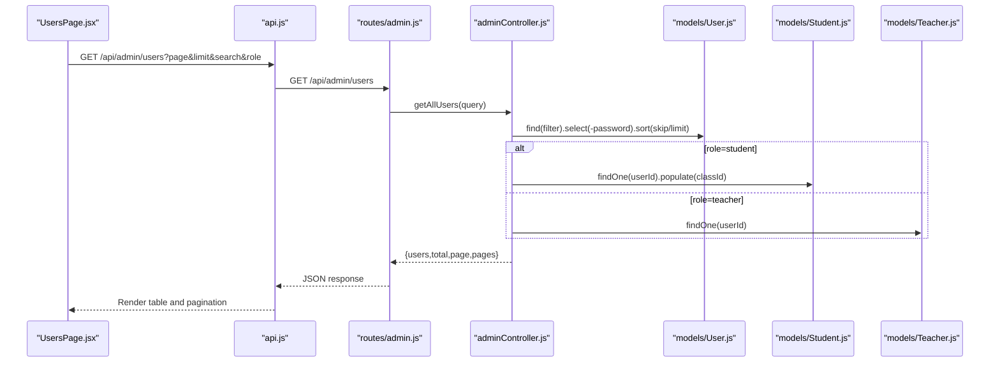
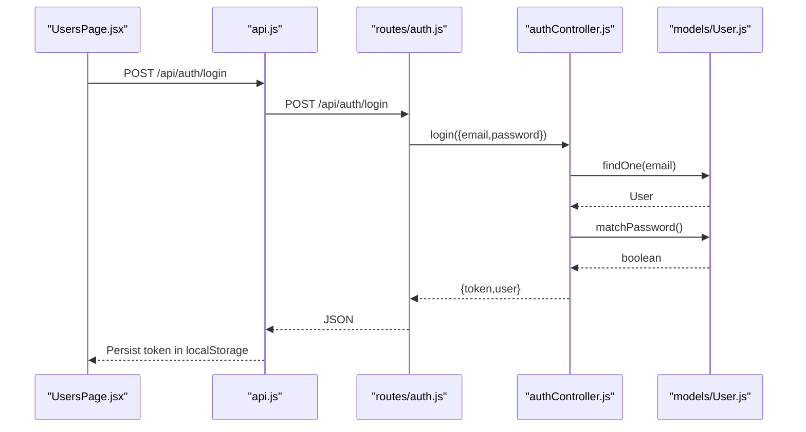
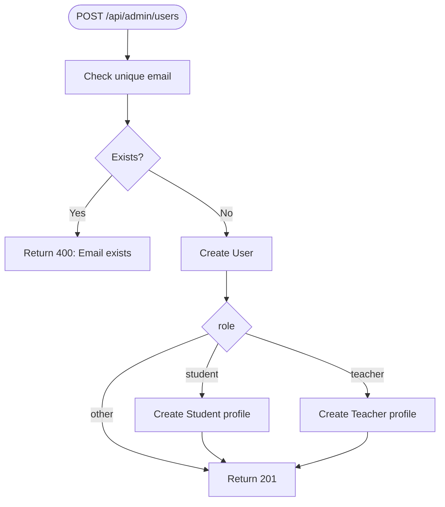
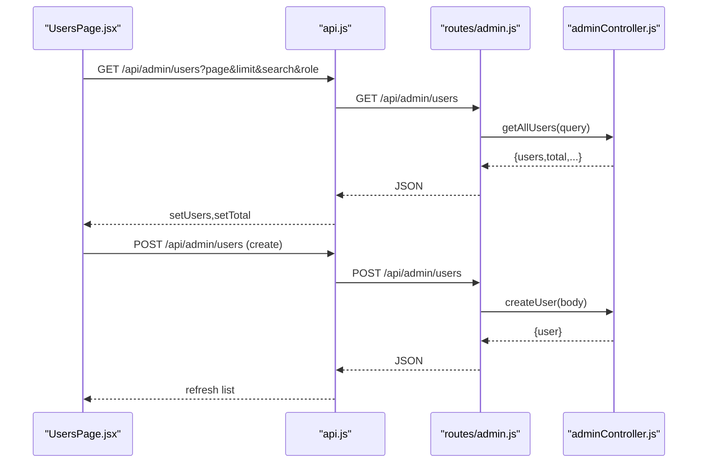
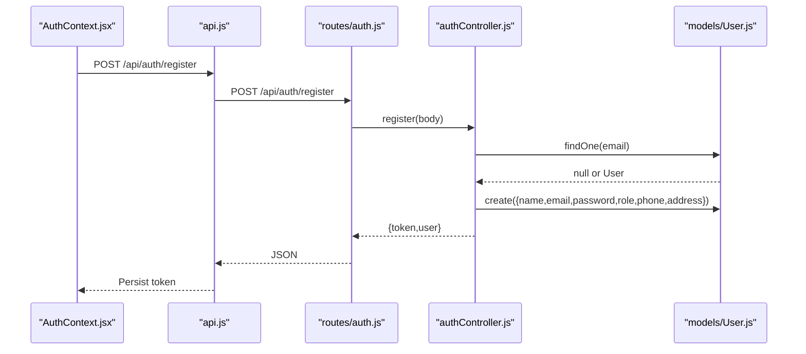
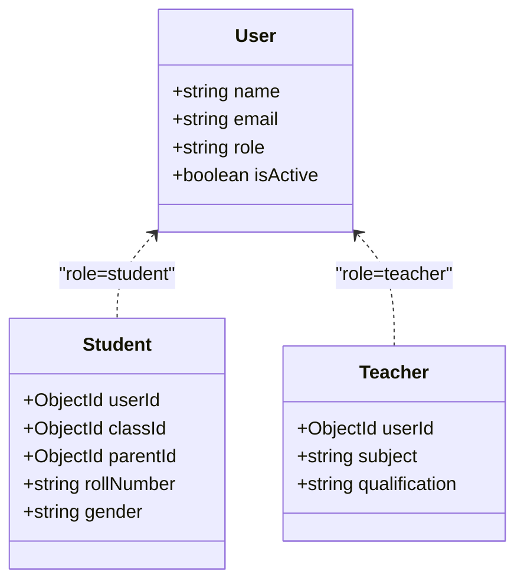
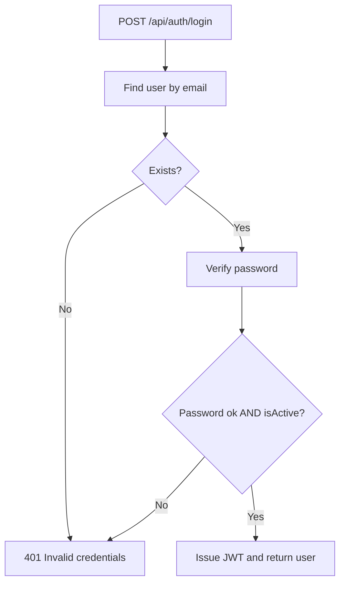
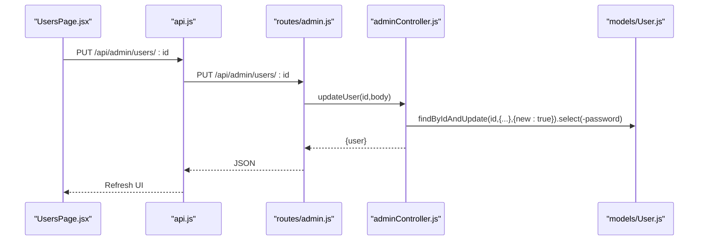
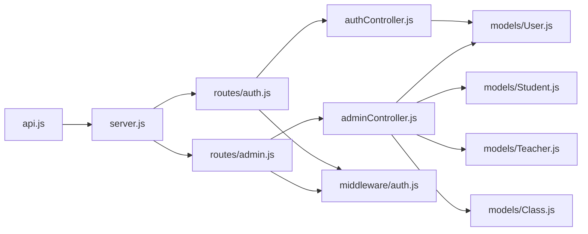

# User Management

<cite>
**Referenced Files in This Document**
- [User.js](file://server/models/User.js)
- [Student.js](file://server/models/Student.js)
- [Teacher.js](file://server/models/Teacher.js)
- [Class.js](file://server/models/Class.js)
- [adminController.js](file://server/controllers/adminController.js)
- [authController.js](file://server/controllers/authController.js)
- [admin.js](file://server/routes/admin.js)
- [auth.js](file://server/routes/auth.js)
- [auth.js](file://server/middleware/auth.js)
- [server.js](file://server/server.js)
- [UsersPage.jsx](file://client/src/pages/admin/UsersPage.jsx)
- [Layout.jsx](file://client/src/components/Layout.jsx)
- [AuthContext.jsx](file://client/src/context/AuthContext.jsx)
- [api.js](file://client/src/api.js)
</cite>

## Table of Contents
1. [Introduction](#introduction)
2. [Project Structure](#project-structure)
3. [Core Components](#core-components)
4. [Architecture Overview](#architecture-overview)
5. [Detailed Component Analysis](#detailed-component-analysis)
6. [Dependency Analysis](#dependency-analysis)
7. [Performance Considerations](#performance-considerations)
8. [Troubleshooting Guide](#troubleshooting-guide)
9. [Conclusion](#conclusion)
10. [Appendices](#appendices)

## Introduction
This document describes the User Management system for an educational platform. It covers user registration workflows, role assignment, profile management, account status controls, CRUD operations, search and filtering, user model schema and validation, security measures, and the admin controller functions. It also documents the frontend user management interface and how it integrates with backend APIs.

## Project Structure
The User Management system spans both the backend (Express/Mongoose) and the frontend (React). The backend exposes REST endpoints under `/api/admin` and `/api/auth`, while the frontend provides an administrative interface for managing users.



**Diagram sources**
- [server.js:18-28](file://server/server.js#L18-L28)
- [auth.js:1-20](file://server/routes/auth.js#L1-L20)
- [admin.js:1-20](file://server/routes/admin.js#L1-L20)
- [authController.js:1-107](file://server/controllers/authController.js#L1-L107)
- [adminController.js:1-158](file://server/controllers/adminController.js#L1-L158)
- [User.js:1-27](file://server/models/User.js#L1-L27)
- [Student.js:1-16](file://server/models/Student.js#L1-L16)
- [Teacher.js:1-13](file://server/models/Teacher.js#L1-L13)
- [Class.js:1-11](file://server/models/Class.js#L1-L11)
- [UsersPage.jsx:1-195](file://client/src/pages/admin/UsersPage.jsx#L1-L195)
- [AuthContext.jsx:1-53](file://client/src/context/AuthContext.jsx#L1-L53)
- [api.js:1-28](file://client/src/api.js#L1-L28)
- [Layout.jsx:1-143](file://client/src/components/Layout.jsx#L1-L143)

**Section sources**
- [server.js:18-28](file://server/server.js#L18-L28)
- [admin.js:1-20](file://server/routes/admin.js#L1-L20)
- [auth.js:1-20](file://server/routes/auth.js#L1-L20)

## Core Components
- User model defines core identity fields, role enumeration, and password hashing lifecycle hook.
- Admin controller implements user listing, retrieval, creation, update, and deletion with role-aware population.
- Authentication controller handles registration, login, profile retrieval, profile updates, and password change.
- Frontend UsersPage provides search, filtering, pagination, and modal-based create/edit/delete UX.
- Middleware enforces JWT-based authentication and role-based authorization.

**Section sources**
- [User.js:4-26](file://server/models/User.js#L4-L26)
- [adminController.js:19-98](file://server/controllers/adminController.js#L19-L98)
- [authController.js:10-106](file://server/controllers/authController.js#L10-L106)
- [UsersPage.jsx:17-80](file://client/src/pages/admin/UsersPage.jsx#L17-L80)
- [auth.js:4-28](file://server/middleware/auth.js#L4-L28)

## Architecture Overview
The system uses a layered architecture:
- Presentation layer: React components (UsersPage, Layout, AuthContext).
- API layer: Express routes for admin and auth.
- Business logic: Controllers implementing domain operations.
- Data access: Mongoose models for User, Student, Teacher, Class.
- Security: JWT middleware and role gating.



**Diagram sources**
- [UsersPage.jsx:22-29](file://client/src/pages/admin/UsersPage.jsx#L22-L29)
- [admin.js:7-7](file://server/routes/admin.js#L7-L7)
- [adminController.js:20-37](file://server/controllers/adminController.js#L20-L37)
- [User.js:4-13](file://server/models/User.js#L4-L13)
- [Student.js:3-13](file://server/models/Student.js#L3-L13)
- [Teacher.js:3-10](file://server/models/Teacher.js#L3-L10)

## Detailed Component Analysis

### User Model Schema and Validation
- Fields: name, email (unique, lowercase), password (min length), role (enum), phone, address, profileImage, isActive, timestamps.
- Lifecycle: Pre-save hook hashes passwords; instance method compares passwords.
- Implications: Strong defaults for UI forms; uniqueness enforced at DB level for email; role-driven profile linkage handled in controllers.

```mermaid
erDiagram
USER {
string _id PK
string name
string email UK
string password
string role
string phone
string address
string profileImage
boolean isActive
datetime createdAt
datetime updatedAt
}
STUDENT {
string _id PK
ObjectId userId FK
ObjectId classId FK
ObjectId parentId FK
string rollNumber UK
date admissionDate
date dateOfBirth
string gender
string bloodGroup
string emergencyContact
}
TEACHER {
string _id PK
ObjectId userId FK
string subject
string qualification
number experience
date joinDate
number salary
}
CLASS {
string _id PK
string name
string section
ObjectId teacherId FK
string academicYear
}
USER ||--o| STUDENT : "has profile"
USER ||--o| TEACHER : "has profile"
CLASS ||--o{ STUDENT : "enrolls"
```

**Diagram sources**
- [User.js:4-13](file://server/models/User.js#L4-L13)
- [Student.js:3-13](file://server/models/Student.js#L3-L13)
- [Teacher.js:3-10](file://server/models/Teacher.js#L3-L10)
- [Class.js:3-8](file://server/models/Class.js#L3-L8)

**Section sources**
- [User.js:4-26](file://server/models/User.js#L4-L26)
- [Student.js:3-13](file://server/models/Student.js#L3-L13)
- [Teacher.js:3-10](file://server/models/Teacher.js#L3-L10)
- [Class.js:3-8](file://server/models/Class.js#L3-L8)

### Authentication and Authorization
- JWT-based auth middleware verifies tokens and attaches user to request.
- Authorize middleware restricts routes to specific roles.
- Auth controller supports registration, login, profile retrieval, profile update, and password change.



**Diagram sources**
- [auth.js:4-28](file://server/middleware/auth.js#L4-L28)
- [authController.js:31-59](file://server/controllers/authController.js#L31-L59)
- [User.js:22-24](file://server/models/User.js#L22-L24)
- [api.js:8-14](file://client/src/api.js#L8-L14)

**Section sources**
- [auth.js:4-28](file://server/middleware/auth.js#L4-L28)
- [authController.js:10-106](file://server/controllers/authController.js#L10-L106)
- [api.js:8-25](file://client/src/api.js#L8-L25)

### Admin Controller Functions for User Operations
- getAllUsers: filters by role and search term, paginates, excludes passwords, enriches profiles for student/teacher.
- getUserById: returns user and populates student or teacher profile.
- createUser: validates uniqueness, creates base user, then creates role-specific profile.
- updateUser: updates base user and corresponding profile fields.
- deleteUser: deletes base user and associated role profile.



**Diagram sources**
- [adminController.js:55-70](file://server/controllers/adminController.js#L55-L70)
- [Student.js:3-13](file://server/models/Student.js#L3-L13)
- [Teacher.js:3-10](file://server/models/Teacher.js#L3-L10)

**Section sources**
- [adminController.js:19-98](file://server/controllers/adminController.js#L19-L98)

### Frontend User Management Interface
- UsersPage manages state for users, pagination, search, role filter, and modal forms.
- Supports add/edit via a unified form that adapts to role-specific fields.
- Fetches dropdown data for classes and parents to populate form options.
- Uses API module to communicate with backend admin endpoints.



**Diagram sources**
- [UsersPage.jsx:17-55](file://client/src/pages/admin/UsersPage.jsx#L17-L55)
- [admin.js:7-11](file://server/routes/admin.js#L7-L11)
- [adminController.js:20-70](file://server/controllers/adminController.js#L20-L70)

**Section sources**
- [UsersPage.jsx:1-195](file://client/src/pages/admin/UsersPage.jsx#L1-L195)

### User Registration Workflows
- Registration endpoint accepts name, email, password, role, phone, address.
- Duplicate email check prevents conflicts.
- On success, a JWT token is issued and returned with user metadata.



**Diagram sources**
- [AuthContext.jsx:27-32](file://client/src/context/AuthContext.jsx#L27-L32)
- [auth.js:1-20](file://server/routes/auth.js#L1-L20)
- [authController.js:10-29](file://server/controllers/authController.js#L10-L29)
- [User.js:4-13](file://server/models/User.js#L4-L13)

**Section sources**
- [authController.js:10-29](file://server/controllers/authController.js#L10-L29)
- [AuthContext.jsx:27-32](file://client/src/context/AuthContext.jsx#L27-L32)

### Role Assignment and Profile Management
- Role determines which profile collection is populated/updated:
  - student: Student profile with classId, rollNumber, parentId, dateOfBirth, gender.
  - teacher: Teacher profile with subject, qualification, experience, salary.
- Admin endpoints create/update role-specific profiles alongside base user.



**Diagram sources**
- [User.js:4-13](file://server/models/User.js#L4-L13)
- [Student.js:3-13](file://server/models/Student.js#L3-L13)
- [Teacher.js:3-10](file://server/models/Teacher.js#L3-L10)

**Section sources**
- [adminController.js:44-82](file://server/controllers/adminController.js#L44-L82)
- [Student.js:3-13](file://server/models/Student.js#L3-L13)
- [Teacher.js:3-10](file://server/models/Teacher.js#L3-L10)

### Account Status Controls
- User isActive flag controls whether a user can log in.
- Login flow checks isActive and rejects inactive accounts.



**Diagram sources**
- [authController.js:31-59](file://server/controllers/authController.js#L31-L59)

**Section sources**
- [authController.js:38-40](file://server/controllers/authController.js#L38-L40)
- [User.js:12-12](file://server/models/User.js#L12-L12)

### User CRUD Operations
- List/Search/Filter/Pagination: GET /api/admin/users with role, search, page, limit.
- Retrieve: GET /api/admin/users/:id with enriched profile.
- Create: POST /api/admin/users with role-specific fields.
- Update: PUT /api/admin/users/:id with base and profile updates.
- Delete: DELETE /api/admin/users/:id with cascading profile removal.



**Diagram sources**
- [UsersPage.jsx:40-55](file://client/src/pages/admin/UsersPage.jsx#L40-L55)
- [admin.js:10-10](file://server/routes/admin.js#L10-L10)
- [adminController.js:72-86](file://server/controllers/adminController.js#L72-L86)

**Section sources**
- [adminController.js:19-98](file://server/controllers/adminController.js#L19-L98)

### Bulk User Management
- Pagination and filtering enable efficient browsing of large user sets.
- No explicit bulk actions are exposed in the current routes; batch operations would require new endpoints.

**Section sources**
- [adminController.js:20-37](file://server/controllers/adminController.js#L20-L37)
- [UsersPage.jsx:17-29](file://client/src/pages/admin/UsersPage.jsx#L17-L29)

### User Search and Filtering
- Query parameters: role, search (case-insensitive substring match on name or email), page, limit.
- Backend applies regex filters and pagination.

**Section sources**
- [adminController.js:22-31](file://server/controllers/adminController.js#L22-L31)
- [UsersPage.jsx:22-26](file://client/src/pages/admin/UsersPage.jsx#L22-L26)

### User Import/Export Functionality
- No import/export endpoints are present in the current routes or controllers.
- Implementation would require CSV/Excel handlers and batch create/update endpoints.

**Section sources**
- [admin.js:1-20](file://server/routes/admin.js#L1-L20)
- [adminController.js:19-98](file://server/controllers/adminController.js#L19-L98)

### User Activity Tracking and Audit Trails
- Timestamps are maintained by Mongoose (createdAt, updatedAt).
- No dedicated audit trail or activity logs are implemented in the current codebase.
- Consider adding an Audit model and middleware hooks for future enhancements.

**Section sources**
- [User.js:13-13](file://server/models/User.js#L13-L13)
- [Student.js:13-13](file://server/models/Student.js#L13-L13)
- [Teacher.js:10-10](file://server/models/Teacher.js#L10-L10)
- [Class.js:8-8](file://server/models/Class.js#L8-L8)

## Dependency Analysis
- Routes depend on middleware for auth and authorization.
- Controllers depend on models for data access.
- Frontend depends on API module for HTTP communication.
- Admin endpoints are protected by role-based authorization.



**Diagram sources**
- [server.js:18-28](file://server/server.js#L18-L28)
- [auth.js:1-20](file://server/routes/auth.js#L1-L20)
- [admin.js:1-20](file://server/routes/admin.js#L1-L20)
- [auth.js:4-28](file://server/middleware/auth.js#L4-L28)
- [authController.js:1-107](file://server/controllers/authController.js#L1-L107)
- [adminController.js:1-158](file://server/controllers/adminController.js#L1-L158)
- [User.js:1-27](file://server/models/User.js#L1-L27)
- [Student.js:1-16](file://server/models/Student.js#L1-L16)
- [Teacher.js:1-13](file://server/models/Teacher.js#L1-L13)
- [Class.js:1-11](file://server/models/Class.js#L1-L11)

**Section sources**
- [server.js:18-28](file://server/server.js#L18-L28)
- [auth.js:4-28](file://server/middleware/auth.js#L4-L28)
- [admin.js:1-20](file://server/routes/admin.js#L1-L20)

## Performance Considerations
- Pagination: Implemented via skip/limit; consider indexed search fields for better performance.
- Regex filters: Case-insensitive regex on name/email can be slow; consider normalized searchable fields.
- Password hashing: Pre-save hook ensures secure storage but adds CPU overhead per save.
- Population: Enriching profiles increases query cost; optimize by selecting only needed fields.

[No sources needed since this section provides general guidance]

## Troubleshooting Guide
- Authentication failures:
  - Missing or invalid Bearer token.
  - Invalid/expired token.
  - Unauthorized role for admin endpoints.
- Authorization failures:
  - Non-admin users attempting admin routes.
- User operations:
  - Email already exists during registration or creation.
  - User not found for update/delete.
  - Inactive account login attempts blocked.

**Section sources**
- [auth.js:10-18](file://server/middleware/auth.js#L10-L18)
- [auth.js:21-28](file://server/middleware/auth.js#L21-L28)
- [authController.js:14-16](file://server/controllers/authController.js#L14-L16)
- [adminController.js:58-60](file://server/controllers/adminController.js#L58-L60)
- [adminController.js:90-94](file://server/controllers/adminController.js#L90-L94)

## Conclusion
The User Management system provides a robust foundation for user lifecycle operations with clear separation of concerns between frontend and backend. It supports role-aware profiles, strong authentication, and basic search/filtering. Future enhancements could include import/export, audit trails, and expanded bulk operations.

[No sources needed since this section summarizes without analyzing specific files]

## Appendices

### API Definitions
- GET /api/admin/users
  - Query: role (enum: admin, teacher, student, parent), search (string), page (number), limit (number)
  - Response: { users: [...], total: number, page: number, pages: number }
- GET /api/admin/users/:id
  - Response: { user with optional studentProfile or teacherProfile }
- POST /api/admin/users
  - Body: { name, email, password, role, phone, address, subject, qualification, classId, rollNumber, parentId, dateOfBirth, gender }
  - Response: { message, user }
- PUT /api/admin/users/:id
  - Body: { name, email, phone, address, isActive, subject, qualification, classId, rollNumber }
  - Response: { message, user }
- DELETE /api/admin/users/:id
  - Response: { message }

**Section sources**
- [admin.js:7-11](file://server/routes/admin.js#L7-L11)
- [adminController.js:20-98](file://server/controllers/adminController.js#L20-L98)