# Core Features

<cite>
**Referenced Files in This Document**
- [App.jsx](file://client/src/App.jsx)
- [main.jsx](file://client/src/main.jsx)
- [AuthContext.jsx](file://client/src/context/AuthContext.jsx)
- [server.js](file://server/server.js)
- [User.js](file://server/models/User.js)
- [adminController.js](file://server/controllers/adminController.js)
- [Dashboard.jsx (Admin)](file://client/src/pages/admin/Dashboard.jsx)
- [ClassesPage.jsx](file://client/src/pages/admin/ClassesPage.jsx)
- [FeesPage.jsx](file://client/src/pages/admin/FeesPage.jsx)
- [NoticesPage.jsx](file://client/src/pages/admin/NoticesPage.jsx)
- [UsersPage.jsx](file://client/src/pages/admin/UsersPage.jsx)
- [Dashboard.jsx (Teacher)](file://client/src/pages/teacher/Dashboard.jsx)
- [AttendancePage.jsx (Teacher)](file://client/src/pages/teacher/AttendancePage.jsx)
- [Dashboard.jsx (Student)](file://client/src/pages/student/Dashboard.jsx)
- [AttendancePage.jsx (Student)](file://client/src/pages/student/AttendancePage.jsx)
- [ResultsPage.jsx (Student)](file://client/src/pages/student/ResultsPage.jsx)
- [Dashboard.jsx (Parent)](file://client/src/pages/parent/Dashboard.jsx)
</cite>

## Table of Contents
1. [Introduction](#introduction)
2. [Project Structure](#project-structure)
3. [Core Components](#core-components)
4. [Architecture Overview](#architecture-overview)
5. [Detailed Component Analysis](#detailed-component-analysis)
6. [Dependency Analysis](#dependency-analysis)
7. [Performance Considerations](#performance-considerations)
8. [Troubleshooting Guide](#troubleshooting-guide)
9. [Conclusion](#conclusion)

## Introduction
This document explains the core features of the Educational Management System with a focus on the four primary roles: administrator, teacher, student, and parent. It covers the administration dashboard, teacher portal, student portal, and parent portal, detailing available features, user workflows, and system interactions. The documented features include attendance tracking, grade management, class scheduling, fee management, and communication systems.

## Project Structure
The system is a React frontend with an Express backend. Routing and protected access are handled via React Router and a custom authentication provider. Backend routes are grouped by role and domain (authentication, administration, teaching, learning, finance, notices, messages, timetables). Data models define users and related entities such as students, teachers, classes, attendance, results, fees, notices, and messages.

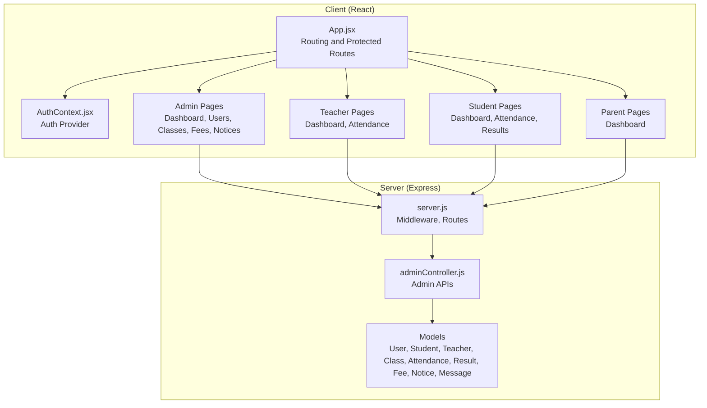

**Diagram sources**
- [App.jsx:1-85](file://client/src/App.jsx#L1-L85)
- [AuthContext.jsx:1-53](file://client/src/context/AuthContext.jsx#L1-L53)
- [server.js:1-38](file://server/server.js#L1-L38)
- [adminController.js:1-158](file://server/controllers/adminController.js#L1-L158)

**Section sources**
- [App.jsx:1-85](file://client/src/App.jsx#L1-L85)
- [server.js:1-38](file://server/server.js#L1-L38)

## Core Components
- Authentication and routing:
  - Protected route enforcement ensures only authorized roles access specific pages.
  - Local storage persists user session state.
- Role-based dashboards:
  - Admin dashboard aggregates statistics and fee summaries.
  - Teacher dashboard lists assigned classes and quick metrics.
  - Student dashboard shows attendance percentage, recent results, pending fees, and today’s date.
  - Parent dashboard displays child profile and fee summaries.
- Administrative features:
  - User management with filtering, pagination, and role-specific forms.
  - Class management with teacher assignment.
  - Fee management with reporting, per-student details, editing, and payment marking.
  - Notice management with categories and pinning.
- Teaching and learning features:
  - Attendance marking for teacher-selected classes and dates.
  - Student results and attendance views.
- Communication and scheduling:
  - Notices serve as the primary communication channel.
  - Timetable-related navigation exists in student and admin routes.

**Section sources**
- [App.jsx:18-84](file://client/src/App.jsx#L18-L84)
- [AuthContext.jsx:8-52](file://client/src/context/AuthContext.jsx#L8-L52)
- [Dashboard.jsx (Admin):8-109](file://client/src/pages/admin/Dashboard.jsx#L8-L109)
- [Dashboard.jsx (Teacher):5-55](file://client/src/pages/teacher/Dashboard.jsx#L5-L55)
- [Dashboard.jsx (Student):5-56](file://client/src/pages/student/Dashboard.jsx#L5-L56)
- [Dashboard.jsx (Parent):5-58](file://client/src/pages/parent/Dashboard.jsx#L5-L58)
- [UsersPage.jsx:5-194](file://client/src/pages/admin/UsersPage.jsx#L5-L194)
- [ClassesPage.jsx:5-81](file://client/src/pages/admin/ClassesPage.jsx#L5-L81)
- [FeesPage.jsx:5-378](file://client/src/pages/admin/FeesPage.jsx#L5-L378)
- [NoticesPage.jsx:5-85](file://client/src/pages/admin/NoticesPage.jsx#L5-L85)
- [AttendancePage.jsx (Teacher):5-74](file://client/src/pages/teacher/AttendancePage.jsx#L5-L74)
- [Dashboard.jsx (Student):11-22](file://client/src/pages/student/Dashboard.jsx#L11-L22)
- [Dashboard.jsx (Parent):11-22](file://client/src/pages/parent/Dashboard.jsx#L11-L22)

## Architecture Overview
The system follows a layered architecture:
- Frontend (React):
  - ProtectedRoute enforces role-based access.
  - AuthContext centralizes authentication state and API calls.
  - Pages consume role-specific endpoints.
- Backend (Express):
  - Centralized middleware and CORS handling.
  - Route groups by role and domain.
  - Controllers orchestrate model queries and responses.

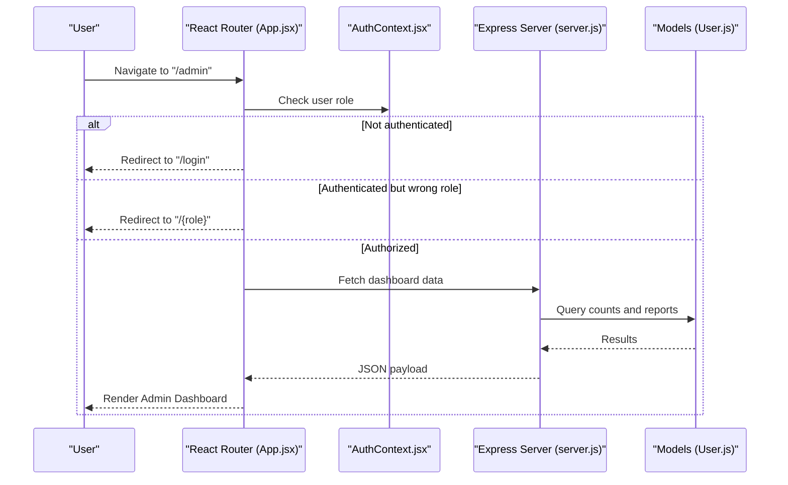

**Diagram sources**
- [App.jsx:18-84](file://client/src/App.jsx#L18-L84)
- [AuthContext.jsx:20-45](file://client/src/context/AuthContext.jsx#L20-L45)
- [server.js:14-28](file://server/server.js#L14-L28)
- [User.js:4-26](file://server/models/User.js#L4-L26)

## Detailed Component Analysis

### Administration Dashboard
- Purpose: Provide administrative overview with key metrics and financial summaries.
- Key features:
  - Statistics cards for total students, teachers, classes, and users.
  - Pie chart of users by role.
  - Fee collection bar chart and summary cards (collected vs pending).
- Data sources:
  - Admin dashboard stats endpoint and fees report endpoint.
- User workflow:
  - On load, fetch stats and fee report concurrently.
  - Render summary cards and charts.
- Integration points:
  - Calls admin dashboard and fees report endpoints.

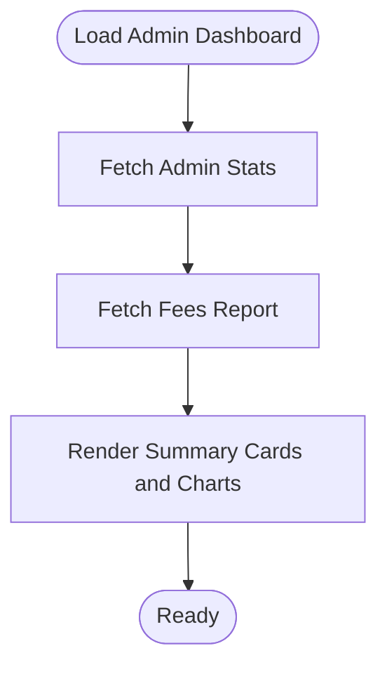

**Diagram sources**
- [Dashboard.jsx (Admin):13-29](file://client/src/pages/admin/Dashboard.jsx#L13-L29)

**Section sources**
- [Dashboard.jsx (Admin):8-109](file://client/src/pages/admin/Dashboard.jsx#L8-L109)

### User Management (Admin)
- Purpose: Manage users across roles with role-specific profiles.
- Key features:
  - List users with search and role filters, pagination.
  - Create/update users with dynamic forms based on role (student/teacher).
  - Delete users.
- Data sources:
  - Admin users endpoint with query parameters for filtering and pagination.
  - Dropdown data for classes and parents.
- User workflow:
  - Open modal, select role, fill form, submit.
  - Update or delete existing user.
- Integration points:
  - Calls admin users CRUD endpoints.

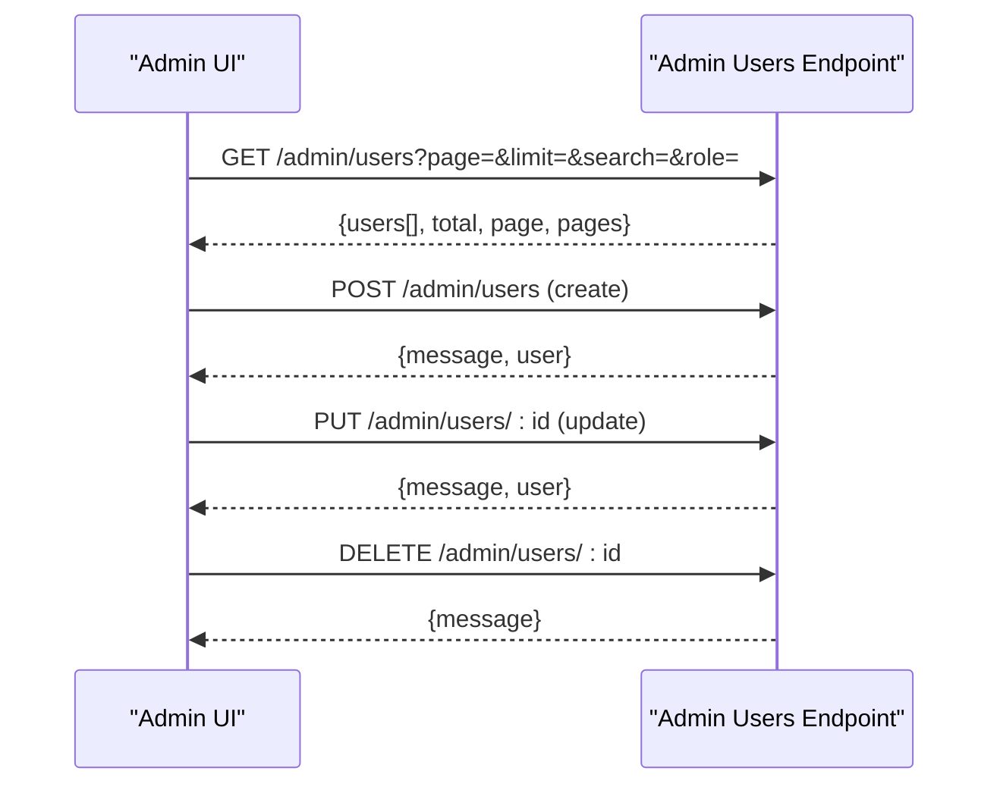

**Diagram sources**
- [UsersPage.jsx:22-74](file://client/src/pages/admin/UsersPage.jsx#L22-L74)

**Section sources**
- [UsersPage.jsx:5-194](file://client/src/pages/admin/UsersPage.jsx#L5-L194)
- [adminController.js:20-98](file://server/controllers/adminController.js#L20-L98)

### Class Management (Admin)
- Purpose: Maintain class records and assign teachers.
- Key features:
  - Create, update, delete classes.
  - Assign teacher to a class.
  - View class list with teacher assignments.
- Data sources:
  - Admin classes endpoint and teacher assignment endpoint.
- User workflow:
  - Open modal to add/edit class; submit form.
  - Select teacher from dropdown and assign.
- Integration points:
  - Calls admin classes CRUD and assignment endpoints.

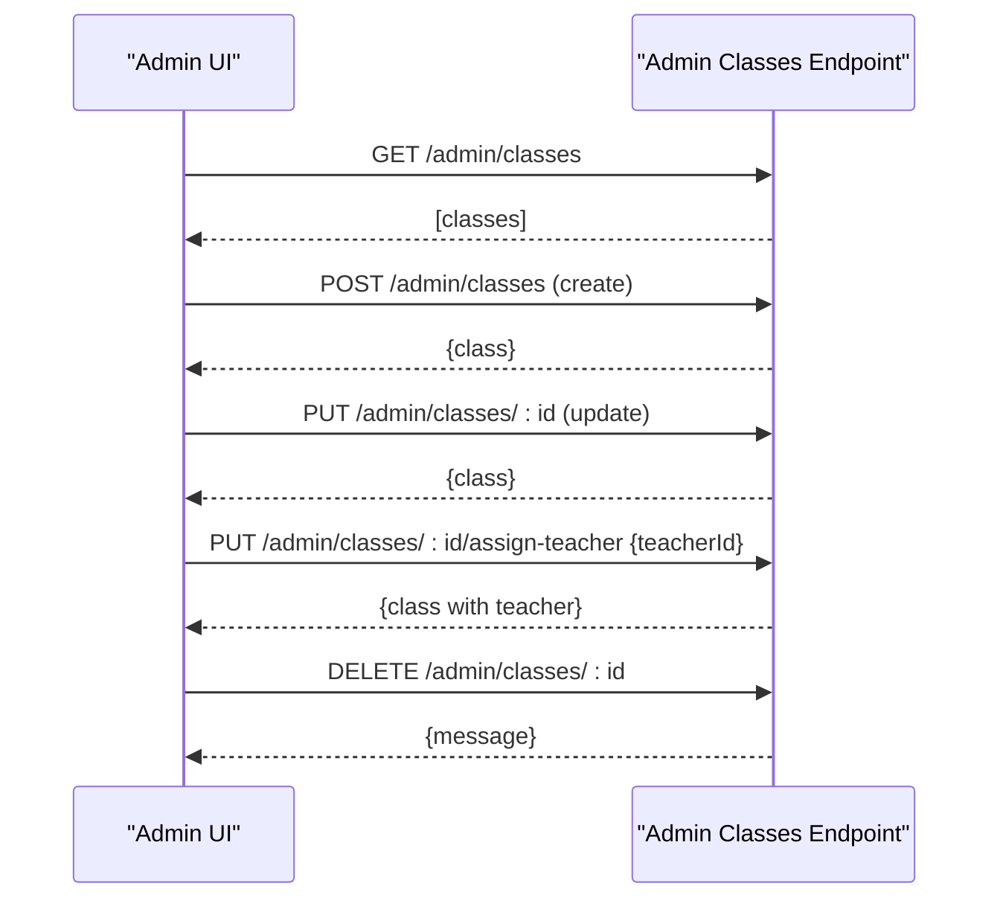

**Diagram sources**
- [ClassesPage.jsx:14-29](file://client/src/pages/admin/ClassesPage.jsx#L14-L29)

**Section sources**
- [ClassesPage.jsx:5-81](file://client/src/pages/admin/ClassesPage.jsx#L5-L81)
- [adminController.js:100-158](file://server/controllers/adminController.js#L100-L158)

### Fee Management (Admin)
- Purpose: Oversee fee collection, view reports, manage individual records, and mark payments.
- Key features:
  - Filterable fee report by class, status, and month.
  - Summary cards (collected, pending, total students).
  - Per-student detail view with fee breakdown.
  - Edit fee records and mark as paid.
- Data sources:
  - Fees report endpoint with query parameters.
  - Per-student detail endpoint.
- User workflow:
  - Apply filters to generate report.
  - Click “View Details” to inspect a student’s fee history.
  - Edit fee record or mark as paid; updates propagate.
- Integration points:
  - Calls fees report and per-student detail endpoints.

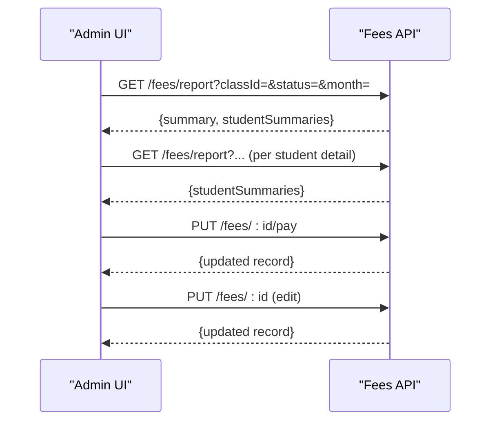

**Diagram sources**
- [FeesPage.jsx:16-41](file://client/src/pages/admin/FeesPage.jsx#L16-L41)

**Section sources**
- [FeesPage.jsx:5-378](file://client/src/pages/admin/FeesPage.jsx#L5-L378)

### Notice Management (Admin)
- Purpose: Publish and manage notices for students, parents, and teachers.
- Key features:
  - Create, edit, delete notices.
  - Category classification and pinning.
  - Visibility targeting roles.
- Data sources:
  - Notices endpoint for listing and CRUD operations.
- User workflow:
  - Open modal to compose notice with category and target roles.
  - Toggle pinning; submit to publish.
- Integration points:
  - Calls notices endpoint.

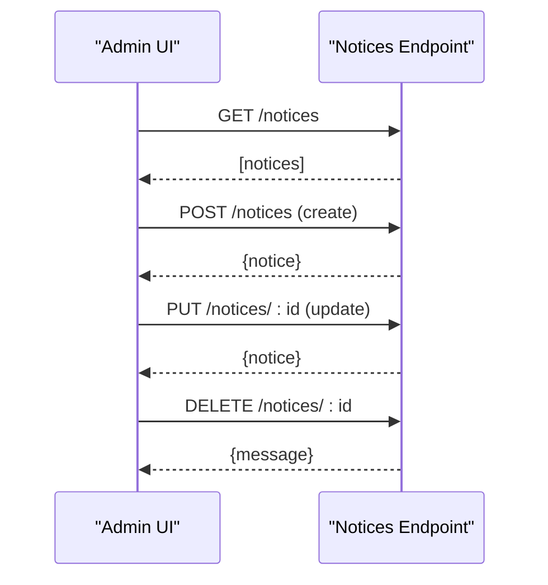

**Diagram sources**
- [NoticesPage.jsx:13-22](file://client/src/pages/admin/NoticesPage.jsx#L13-L22)

**Section sources**
- [NoticesPage.jsx:5-85](file://client/src/pages/admin/NoticesPage.jsx#L5-L85)

### Teacher Portal
- Teacher Dashboard:
  - Lists assigned classes and quick metrics.
- Attendance Page:
  - Select class and date, choose status per student, save attendance.
- User workflow:
  - Choose class and date, toggle statuses, submit.
- Integration points:
  - Calls teacher classes endpoint and attendance submission endpoint.

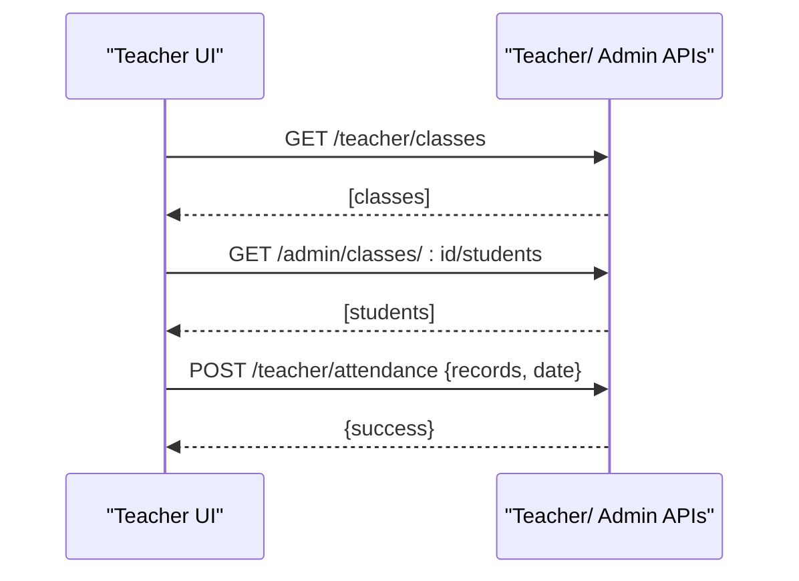

**Diagram sources**
- [Dashboard.jsx (Teacher):9-11](file://client/src/pages/teacher/Dashboard.jsx#L9-L11)
- [AttendancePage.jsx (Teacher):15-27](file://client/src/pages/teacher/AttendancePage.jsx#L15-L27)

**Section sources**
- [Dashboard.jsx (Teacher):5-55](file://client/src/pages/teacher/Dashboard.jsx#L5-L55)
- [AttendancePage.jsx (Teacher):5-74](file://client/src/pages/teacher/AttendancePage.jsx#L5-L74)

### Student Portal
- Student Dashboard:
  - Shows attendance percentage, number of results, pending fees, and today’s date.
- Attendance Page:
  - Loads monthly attendance for current month.
- Results Page:
  - Displays exam results for the logged-in student.
- User workflow:
  - On load, fetch attendance, results, and fees concurrently.
- Integration points:
  - Calls student endpoints for attendance, results, and fees.

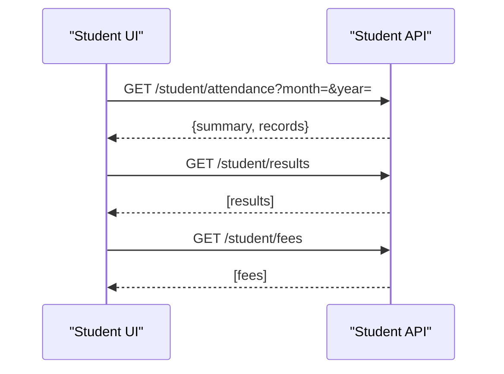

**Diagram sources**
- [Dashboard.jsx (Student):11-22](file://client/src/pages/student/Dashboard.jsx#L11-L22)

**Section sources**
- [Dashboard.jsx (Student):5-56](file://client/src/pages/student/Dashboard.jsx#L5-L56)
- [AttendancePage.jsx (Student):11-22](file://client/src/pages/student/AttendancePage.jsx#L11-L22)
- [ResultsPage.jsx (Student)](file://client/src/pages/student/ResultsPage.jsx)

### Parent Portal
- Parent Dashboard:
  - Displays child profile and aggregated fee summary (paid/unpaid).
- User workflow:
  - On load, fetch child profile, monthly attendance, and fees.
- Integration points:
  - Calls parent endpoints for child, attendance, and fees.

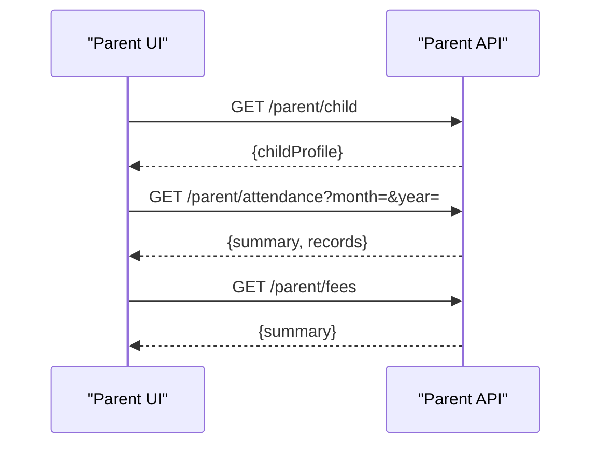

**Diagram sources**
- [Dashboard.jsx (Parent):11-22](file://client/src/pages/parent/Dashboard.jsx#L11-L22)

**Section sources**
- [Dashboard.jsx (Parent):5-58](file://client/src/pages/parent/Dashboard.jsx#L5-L58)

### Conceptual Overview
- Attendance tracking:
  - Teachers mark daily attendance for selected classes.
  - Students and parents can view monthly attendance summaries.
- Grade management:
  - Students view results; teachers likely input results via teacher routes (not fully implemented in the provided files).
- Class scheduling:
  - Admin manages classes and assigns teachers; student and admin routes include timetable navigation.
- Fee management:
  - Admin generates reports, edits records, marks payments; students and parents view fee summaries.
- Communication systems:
  - Notices are published by admins and visible to targeted roles.

[No sources needed since this section doesn't analyze specific source files]

## Dependency Analysis
- Frontend-to-backend dependencies:
  - App.jsx defines protected routes and navigates to role-specific pages.
  - AuthContext.jsx handles login/logout and stores user in local storage.
  - Pages call role-specific endpoints exposed by server.js route groups.
- Backend dependencies:
  - server.js registers route groups for auth, admin, teacher, student, parent, fees, notices, messages, timetable.
  - adminController.js orchestrates user, class, and dashboard operations.

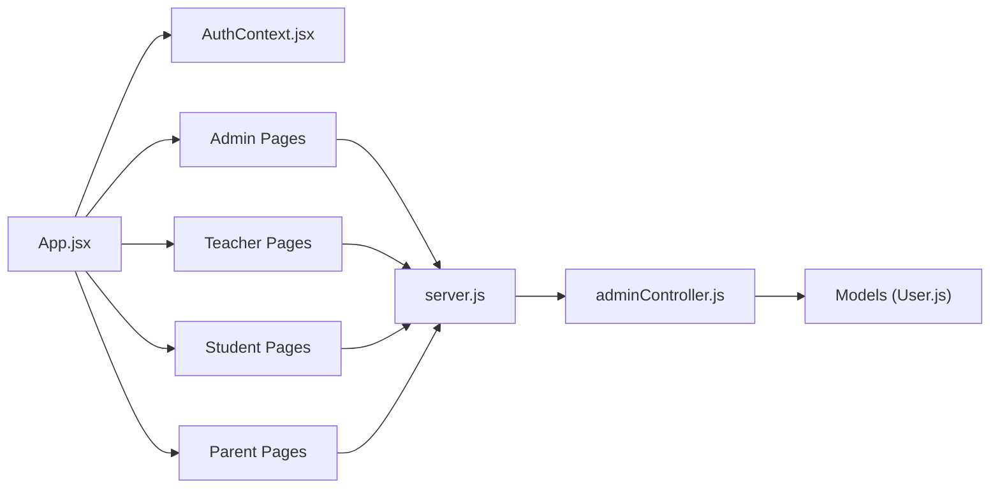

**Diagram sources**
- [App.jsx:26-71](file://client/src/App.jsx#L26-L71)
- [AuthContext.jsx:20-45](file://client/src/context/AuthContext.jsx#L20-L45)
- [server.js:19-27](file://server/server.js#L19-L27)
- [adminController.js:6-17](file://server/controllers/adminController.js#L6-L17)
- [User.js:4-26](file://server/models/User.js#L4-L26)

**Section sources**
- [App.jsx:18-84](file://client/src/App.jsx#L18-L84)
- [server.js:14-28](file://server/server.js#L14-L28)
- [adminController.js:1-158](file://server/controllers/adminController.js#L1-L158)
- [User.js:1-27](file://server/models/User.js#L1-L27)

## Performance Considerations
- Concurrent data fetching:
  - Admin dashboard and student/parent dashboards use concurrent requests to reduce load time.
- Pagination and filtering:
  - Admin user listing supports pagination and search to scale with larger datasets.
- Client-side caching:
  - Local storage persists user session to avoid re-authentication on reload.
- Recommendations:
  - Implement server-side pagination for notices and fees reports.
  - Add optimistic updates for attendance marking to improve responsiveness.
  - Debounce search inputs for user listings.

[No sources needed since this section provides general guidance]

## Troubleshooting Guide
- Authentication issues:
  - Verify login credentials and ensure user object is persisted in local storage.
  - Confirm ProtectedRoute redirects unauthorized users to their role page or login.
- Route access errors:
  - Ensure role matches the intended route; otherwise, ProtectedRoute redirects to the user’s role path.
- API connectivity:
  - Confirm server is running and CORS is enabled.
  - Check that route groups under /api/* are registered in server.js.
- Data not loading:
  - Inspect network tab for failed requests to admin, teacher, student, or parent endpoints.
  - Validate that adminController and role-specific controllers are implemented and exported.

**Section sources**
- [AuthContext.jsx:20-45](file://client/src/context/AuthContext.jsx#L20-L45)
- [App.jsx:18-24](file://client/src/App.jsx#L18-L24)
- [server.js:19-27](file://server/server.js#L19-L27)

## Conclusion
The Educational Management System provides a clear, role-based interface for administrators, teachers, students, and parents. Core features such as user/class management, fee oversight, notice publishing, and attendance tracking are integrated with intuitive dashboards and protected routing. Extending grade management and timetable features would further enhance the platform’s capabilities.