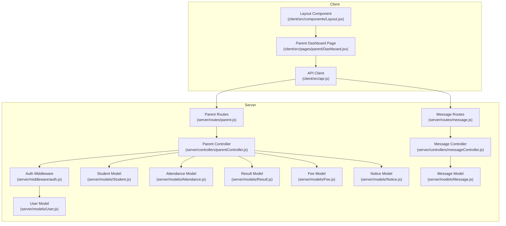
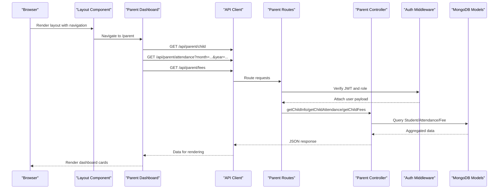
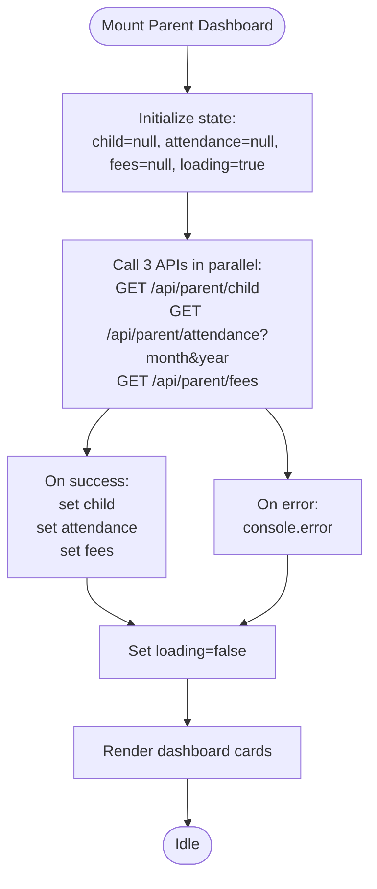
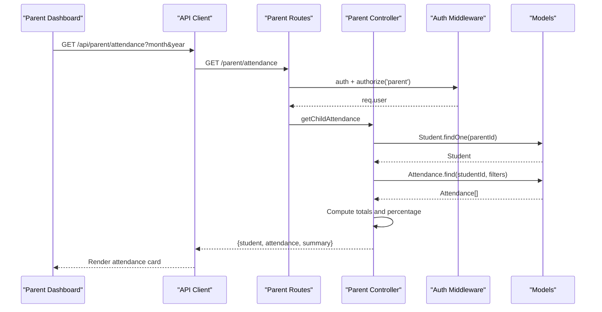
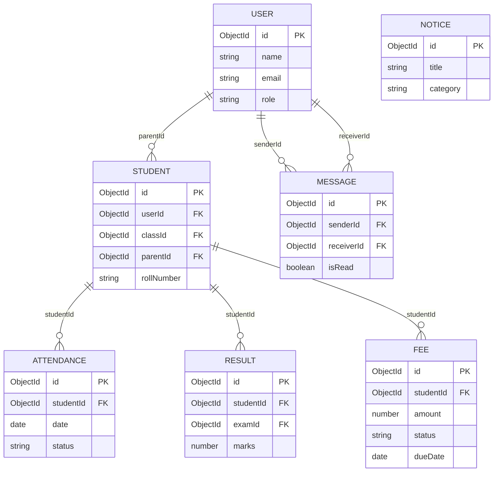
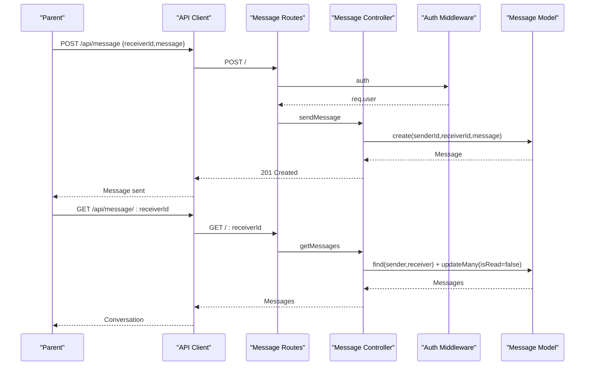
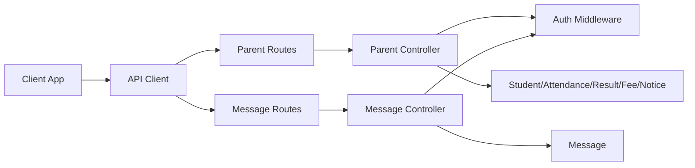

# Parent Portal

<cite>
**Referenced Files in This Document**
- [client/src/pages/parent/Dashboard.jsx](file://client/src/pages/parent/Dashboard.jsx)
- [client/src/api.js](file://client/src/api.js)
- [client/src/components/Layout.jsx](file://client/src/components/Layout.jsx)
- [server/controllers/parentController.js](file://server/controllers/parentController.js)
- [server/routes/parent.js](file://server/routes/parent.js)
- [server/middleware/auth.js](file://server/middleware/auth.js)
- [server/models/Student.js](file://server/models/Student.js)
- [server/models/Attendance.js](file://server/models/Attendance.js)
- [server/models/Result.js](file://server/models/Result.js)
- [server/models/Fee.js](file://server/models/Fee.js)
- [server/models/Notice.js](file://server/models/Notice.js)
- [server/models/User.js](file://server/models/User.js)
- [server/controllers/messageController.js](file://server/controllers/messageController.js)
- [server/routes/message.js](file://server/routes/message.js)
</cite>

## Table of Contents
1. [Introduction](#introduction)
2. [Project Structure](#project-structure)
3. [Core Components](#core-components)
4. [Architecture Overview](#architecture-overview)
5. [Detailed Component Analysis](#detailed-component-analysis)
6. [Dependency Analysis](#dependency-analysis)
7. [Performance Considerations](#performance-considerations)
8. [Troubleshooting Guide](#troubleshooting-guide)
9. [Conclusion](#conclusion)

## Introduction
This document explains the Parent Portal functionality of the application. It covers the parent dashboard, child monitoring capabilities (attendance, fees, notices), academic progress tracking (results), and communication features. It also documents the parent controller functions, child enrollment linkage, and how parents can monitor their children’s attendance, grades, and school notices. Communication workflows and notification systems are included to help parents stay informed and engaged.

## Project Structure
The Parent Portal spans a React frontend and an Express backend:
- Frontend (client): Pages, layout, and API integration for the parent role.
- Backend (server): Routes, controllers, middleware, and models supporting parent features.

**Diagram sources**
- [client/src/pages/parent/Dashboard.jsx:1-59](file://client/src/pages/parent/Dashboard.jsx#L1-L59)
- [client/src/components/Layout.jsx:1-143](file://client/src/components/Layout.jsx#L1-L143)
- [client/src/api.js:1-28](file://client/src/api.js#L1-L28)
- [server/routes/parent.js:1-13](file://server/routes/parent.js#L1-L13)
- [server/controllers/parentController.js:1-74](file://server/controllers/parentController.js#L1-L74)
- [server/middleware/auth.js:1-31](file://server/middleware/auth.js#L1-L31)
- [server/models/User.js:1-27](file://server/models/User.js#L1-L27)
- [server/models/Student.js:1-16](file://server/models/Student.js#L1-L16)
- [server/models/Attendance.js:1-14](file://server/models/Attendance.js#L1-L14)
- [server/models/Result.js:1-14](file://server/models/Result.js#L1-L14)
- [server/models/Fee.js:1-17](file://server/models/Fee.js#L1-L17)
- [server/models/Notice.js:1-14](file://server/models/Notice.js#L1-L14)
- [server/routes/message.js:1-11](file://server/routes/message.js#L1-L11)
- [server/controllers/messageController.js:1-38](file://server/controllers/messageController.js#L1-L38)
- [server/models/Message.js:1-11](file://server/models/Message.js#L1-L11)

**Section sources**
- [client/src/pages/parent/Dashboard.jsx:1-59](file://client/src/pages/parent/Dashboard.jsx#L1-L59)
- [client/src/components/Layout.jsx:1-143](file://client/src/components/Layout.jsx#L1-L143)
- [client/src/api.js:1-28](file://client/src/api.js#L1-L28)
- [server/routes/parent.js:1-13](file://server/routes/parent.js#L1-L13)
- [server/controllers/parentController.js:1-74](file://server/controllers/parentController.js#L1-L74)
- [server/middleware/auth.js:1-31](file://server/middleware/auth.js#L1-L31)
- [server/models/Student.js:1-16](file://server/models/Student.js#L1-L16)
- [server/models/Attendance.js:1-14](file://server/models/Attendance.js#L1-L14)
- [server/models/Result.js:1-14](file://server/models/Result.js#L1-L14)
- [server/models/Fee.js:1-17](file://server/models/Fee.js#L1-L17)
- [server/models/Notice.js:1-14](file://server/models/Notice.js#L1-L14)
- [server/routes/message.js:1-11](file://server/routes/message.js#L1-L11)
- [server/controllers/messageController.js:1-38](file://server/controllers/messageController.js#L1-L38)
- [server/models/Message.js:1-11](file://server/models/Message.js#L1-L11)

## Core Components
- Parent Dashboard: Loads child info, monthly attendance summary, and fee summary via concurrent API calls.
- Parent Controller: Provides endpoints for child info, attendance, results, fees, and notices.
- Authentication and Authorization: JWT-based middleware enforces role-based access.
- Data Models: Student, Attendance, Result, Fee, Notice, and Message define the domain entities.
- Communication: Message endpoints enable parent-to-user messaging with read status and unread counts.

Key capabilities:
- Child monitoring: Attendance percentage, fee summaries, and notices.
- Academic progress: Results per subject/exam.
- Communication: Messaging endpoints for notifications and discussions.

**Section sources**
- [client/src/pages/parent/Dashboard.jsx:1-59](file://client/src/pages/parent/Dashboard.jsx#L1-L59)
- [server/controllers/parentController.js:1-74](file://server/controllers/parentController.js#L1-L74)
- [server/middleware/auth.js:1-31](file://server/middleware/auth.js#L1-L31)
- [server/models/Student.js:1-16](file://server/models/Student.js#L1-L16)
- [server/models/Attendance.js:1-14](file://server/models/Attendance.js#L1-L14)
- [server/models/Result.js:1-14](file://server/models/Result.js#L1-L14)
- [server/models/Fee.js:1-17](file://server/models/Fee.js#L1-L17)
- [server/models/Notice.js:1-14](file://server/models/Notice.js#L1-L14)
- [server/controllers/messageController.js:1-38](file://server/controllers/messageController.js#L1-L38)

## Architecture Overview
The Parent Portal follows a layered architecture:
- Client-side React app renders the dashboard and navigates via a shared layout.
- API client injects authentication tokens and handles redirects on unauthorized responses.
- Server routes delegate to parent controller functions after verifying JWT and role.
- Controllers query models and return structured data to the client.

**Diagram sources**
- [client/src/components/Layout.jsx:1-143](file://client/src/components/Layout.jsx#L1-L143)
- [client/src/pages/parent/Dashboard.jsx:1-59](file://client/src/pages/parent/Dashboard.jsx#L1-L59)
- [client/src/api.js:1-28](file://client/src/api.js#L1-L28)
- [server/routes/parent.js:1-13](file://server/routes/parent.js#L1-L13)
- [server/controllers/parentController.js:1-74](file://server/controllers/parentController.js#L1-L74)
- [server/middleware/auth.js:1-31](file://server/middleware/auth.js#L1-L31)
- [server/models/Student.js:1-16](file://server/models/Student.js#L1-L16)
- [server/models/Attendance.js:1-14](file://server/models/Attendance.js#L1-L14)
- [server/models/Fee.js:1-17](file://server/models/Fee.js#L1-L17)

## Detailed Component Analysis

### Parent Dashboard
Responsibilities:
- Fetches child profile, monthly attendance summary, and fee summary concurrently.
- Displays child details, attendance percentage, paid fees, and pending fees.

Behavior highlights:
- Uses current month and year for attendance filtering.
- Concurrent loading improves perceived performance.
- Graceful loading state during fetch.

**Diagram sources**
- [client/src/pages/parent/Dashboard.jsx:1-59](file://client/src/pages/parent/Dashboard.jsx#L1-L59)

**Section sources**
- [client/src/pages/parent/Dashboard.jsx:1-59](file://client/src/pages/parent/Dashboard.jsx#L1-L59)

### Parent Controller Functions
Endpoints and responsibilities:
- GET /api/parent/child → getChildInfo: Returns the child record linked to the logged-in parent.
- GET /api/parent/attendance → getChildAttendance: Returns attendance records and a summary (total days, present, absent, percentage). Supports optional month/year filters.
- GET /api/parent/results → getChildResults: Returns results for the child, including exam and class metadata.
- GET /api/parent/fees → getChildFees: Returns fee records and a summary (total, paid, unpaid).
- GET /api/parent/notices → getNotices: Returns notices targeting parents or all roles.

Authorization:
- Requires a valid JWT and role parent enforced by middleware.

Data aggregation:
- Computes attendance percentage and fee totals/paid/unpaid.

**Diagram sources**
- [server/routes/parent.js:1-13](file://server/routes/parent.js#L1-L13)
- [server/controllers/parentController.js:1-74](file://server/controllers/parentController.js#L1-L74)
- [server/middleware/auth.js:1-31](file://server/middleware/auth.js#L1-L31)
- [server/models/Student.js:1-16](file://server/models/Student.js#L1-L16)
- [server/models/Attendance.js:1-14](file://server/models/Attendance.js#L1-L14)

**Section sources**
- [server/controllers/parentController.js:1-74](file://server/controllers/parentController.js#L1-L74)
- [server/routes/parent.js:1-13](file://server/routes/parent.js#L1-L13)
- [server/middleware/auth.js:1-31](file://server/middleware/auth.js#L1-L31)

### Data Models and Relationships
The Parent Portal relies on the following models:

**Diagram sources**
- [server/models/User.js:1-27](file://server/models/User.js#L1-L27)
- [server/models/Student.js:1-16](file://server/models/Student.js#L1-L16)
- [server/models/Attendance.js:1-14](file://server/models/Attendance.js#L1-L14)
- [server/models/Result.js:1-14](file://server/models/Result.js#L1-L14)
- [server/models/Fee.js:1-17](file://server/models/Fee.js#L1-L17)
- [server/models/Notice.js:1-14](file://server/models/Notice.js#L1-L14)
- [server/models/Message.js:1-11](file://server/models/Message.js#L1-L11)

**Section sources**
- [server/models/User.js:1-27](file://server/models/User.js#L1-L27)
- [server/models/Student.js:1-16](file://server/models/Student.js#L1-L16)
- [server/models/Attendance.js:1-14](file://server/models/Attendance.js#L1-L14)
- [server/models/Result.js:1-14](file://server/models/Result.js#L1-L14)
- [server/models/Fee.js:1-17](file://server/models/Fee.js#L1-L17)
- [server/models/Notice.js:1-14](file://server/models/Notice.js#L1-L14)
- [server/models/Message.js:1-11](file://server/models/Message.js#L1-L11)

### Communication Systems
Messaging endpoints:
- GET /api/message/:receiverId → getMessages: Retrieves conversation history with a user and marks unread messages as read.
- POST /api/message → sendMessage: Sends a new message.
- GET /api/message/unread/count → getUnreadCount: Returns the number of unread messages for the current user.

Integration points:
- Parents can message other users (e.g., teachers/admins) through these endpoints.
- Unread counters support notification UX.

**Diagram sources**
- [server/routes/message.js:1-11](file://server/routes/message.js#L1-L11)
- [server/controllers/messageController.js:1-38](file://server/controllers/messageController.js#L1-L38)
- [server/middleware/auth.js:1-31](file://server/middleware/auth.js#L1-L31)
- [server/models/Message.js:1-11](file://server/models/Message.js#L1-L11)

**Section sources**
- [server/controllers/messageController.js:1-38](file://server/controllers/messageController.js#L1-L38)
- [server/routes/message.js:1-11](file://server/routes/message.js#L1-L11)
- [server/middleware/auth.js:1-31](file://server/middleware/auth.js#L1-L31)

### Academic Progress Tracking
- Results endpoint aggregates results per student and includes exam and class metadata.
- Parents can review subject-wise marks and grades.

Implementation note:
- Results are fetched per student and populated with exam and class details.

**Section sources**
- [server/controllers/parentController.js:31-40](file://server/controllers/parentController.js#L31-L40)
- [server/models/Result.js:1-14](file://server/models/Result.js#L1-L14)

### Family Account Features
- Child enrollment linkage: Each student references a parent via parentId.
- Notices targeting parents: Notices include targetRoles allowing filtered visibility.

Operational impact:
- Ensures only enrolled children appear under a parent’s account.
- Notices are filtered by target roles for appropriate delivery.

**Section sources**
- [server/models/Student.js:1-16](file://server/models/Student.js#L1-L16)
- [server/models/Notice.js:1-14](file://server/models/Notice.js#L1-L14)
- [server/controllers/parentController.js:56-63](file://server/controllers/parentController.js#L56-L63)

### Notification Systems
- Notices endpoint returns notices targeted at parents or all roles, sorted by pinned and recency.
- Messaging unread count endpoint supports real-time notification UX.

**Section sources**
- [server/controllers/parentController.js:56-63](file://server/controllers/parentController.js#L56-L63)
- [server/controllers/messageController.js:30-37](file://server/controllers/messageController.js#L30-L37)

## Dependency Analysis
High-level dependencies:
- Client depends on API client and layout for navigation.
- API client depends on local storage for JWT and redirects on 401.
- Parent routes depend on auth middleware and parent controller.
- Parent controller depends on models for Student, Attendance, Result, Fee, and Notice.
- Message routes depend on auth middleware and message controller.
- Message controller depends on Message model.

**Diagram sources**
- [client/src/api.js:1-28](file://client/src/api.js#L1-L28)
- [server/routes/parent.js:1-13](file://server/routes/parent.js#L1-L13)
- [server/controllers/parentController.js:1-74](file://server/controllers/parentController.js#L1-L74)
- [server/routes/message.js:1-11](file://server/routes/message.js#L1-L11)
- [server/controllers/messageController.js:1-38](file://server/controllers/messageController.js#L1-L38)
- [server/middleware/auth.js:1-31](file://server/middleware/auth.js#L1-L31)
- [server/models/Student.js:1-16](file://server/models/Student.js#L1-L16)
- [server/models/Attendance.js:1-14](file://server/models/Attendance.js#L1-L14)
- [server/models/Result.js:1-14](file://server/models/Result.js#L1-L14)
- [server/models/Fee.js:1-17](file://server/models/Fee.js#L1-L17)
- [server/models/Notice.js:1-14](file://server/models/Notice.js#L1-L14)
- [server/models/Message.js:1-11](file://server/models/Message.js#L1-L11)

**Section sources**
- [client/src/api.js:1-28](file://client/src/api.js#L1-L28)
- [server/routes/parent.js:1-13](file://server/routes/parent.js#L1-L13)
- [server/controllers/parentController.js:1-74](file://server/controllers/parentController.js#L1-L74)
- [server/routes/message.js:1-11](file://server/routes/message.js#L1-L11)
- [server/controllers/messageController.js:1-38](file://server/controllers/messageController.js#L1-L38)
- [server/middleware/auth.js:1-31](file://server/middleware/auth.js#L1-L31)

## Performance Considerations
- Concurrent API calls in the parent dashboard reduce total load time.
- Attendance and fee summaries are computed client-side from returned arrays; keep payloads lean.
- Pagination or server-side filtering could be considered for large datasets.
- Indexes on Attendance.studentId+date and Result.studentId+examId improve query performance.

## Troubleshooting Guide
Common issues and resolutions:
- Unauthorized access: Ensure a valid JWT is present in Authorization header; the API client clears local storage and redirects to login on 401.
- No child linked: The parent controller returns a not-found-like response when no child is associated with the parent account.
- Missing attendance/fees/notices: Confirm the requested month/year filters and that records exist for the linked student.

**Section sources**
- [client/src/api.js:16-25](file://client/src/api.js#L16-L25)
- [server/controllers/parentController.js:10-12](file://server/controllers/parentController.js#L10-L12)
- [server/middleware/auth.js:4-19](file://server/middleware/auth.js#L4-L19)

## Conclusion
The Parent Portal integrates a responsive dashboard with robust monitoring of attendance, fees, and notices, alongside academic progress tracking and secure communication channels. Role-based authentication ensures parents access only their child’s data, while concurrent API calls and summarized metrics deliver a smooth user experience. The modular design of routes, controllers, and models supports maintainability and future enhancements.