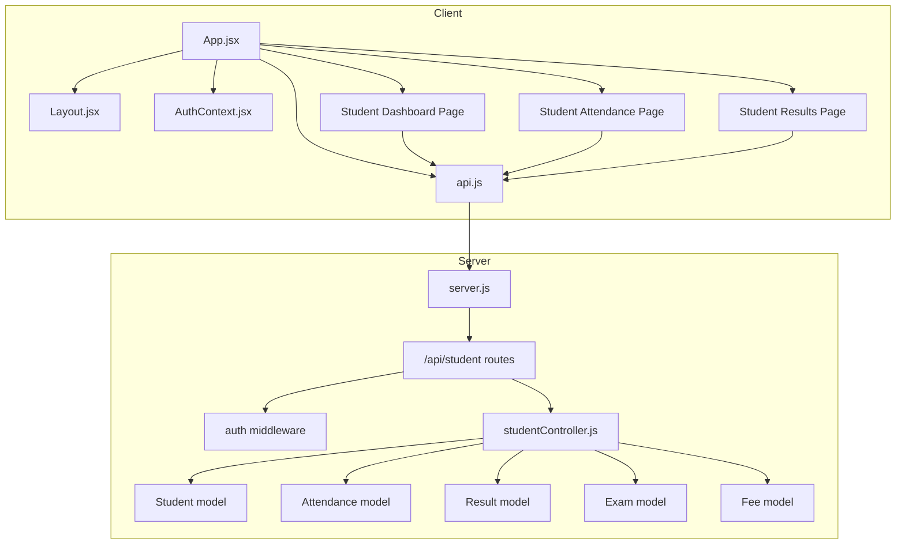
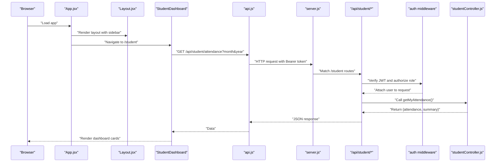
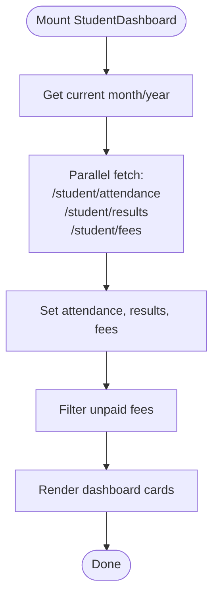
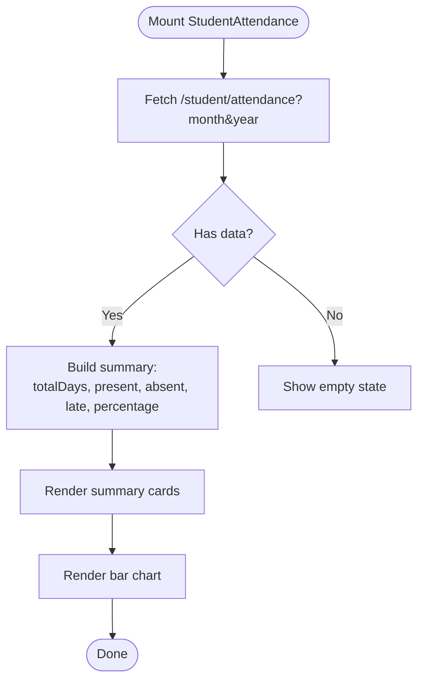
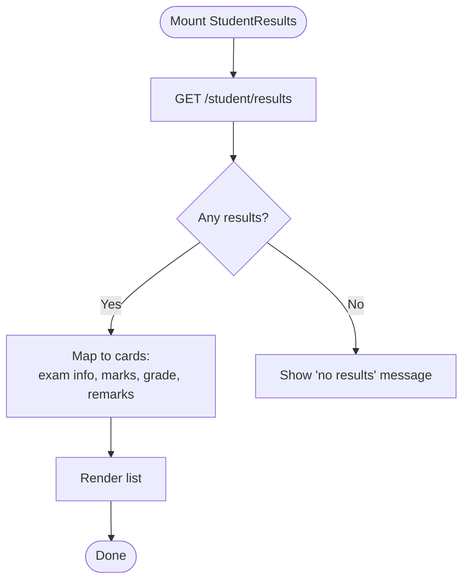
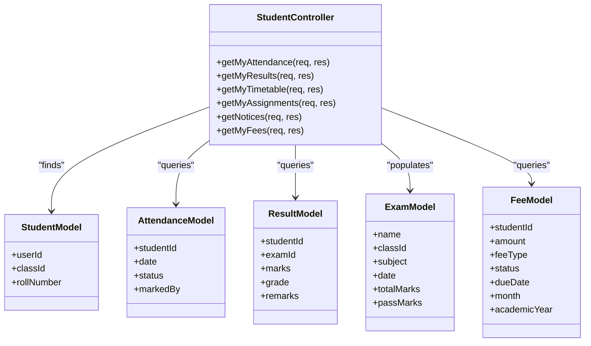
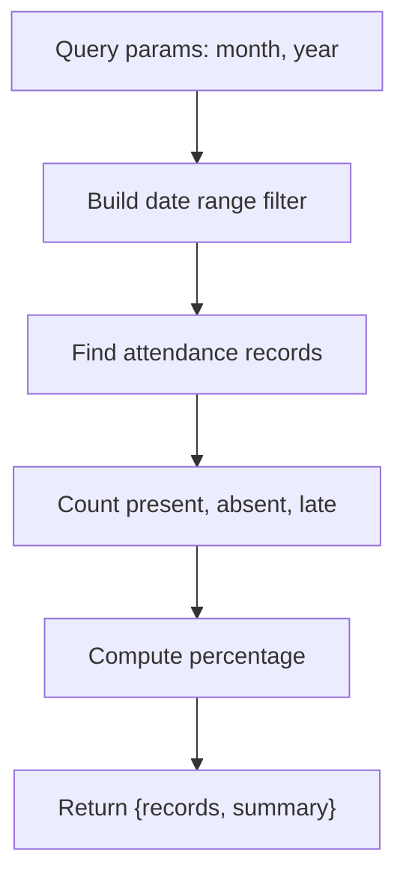
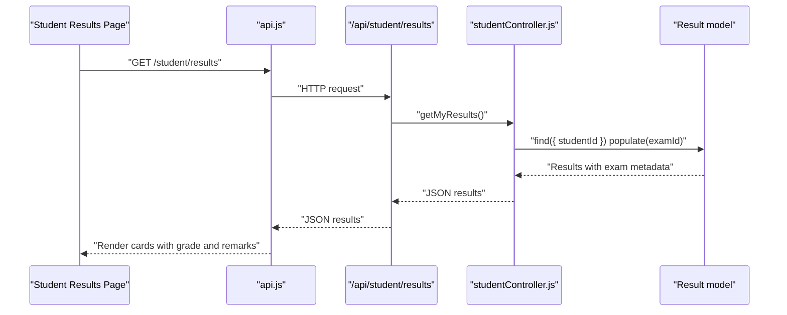
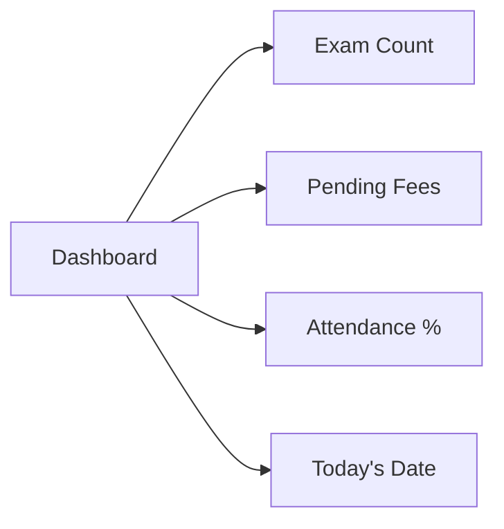
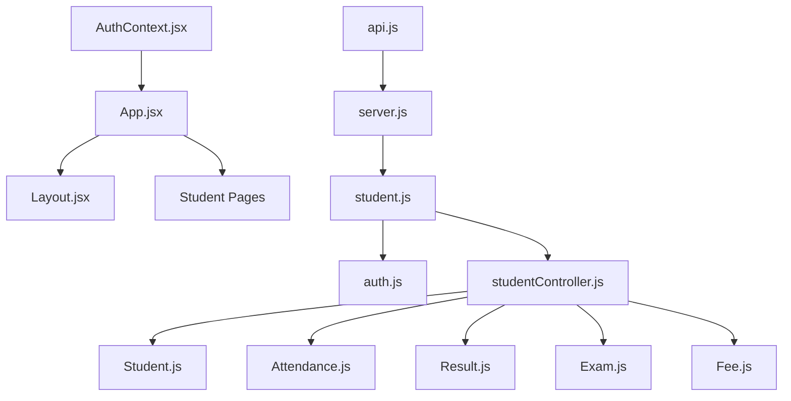

# Student Portal

<cite>
**Referenced Files in This Document**
- [Dashboard.jsx](file://client/src/pages/student/Dashboard.jsx)
- [AttendancePage.jsx](file://client/src/pages/student/AttendancePage.jsx)
- [ResultsPage.jsx](file://client/src/pages/student/ResultsPage.jsx)
- [studentController.js](file://server/controllers/studentController.js)
- [student.js](file://server/routes/student.js)
- [api.js](file://client/src/api.js)
- [auth.js](file://server/middleware/auth.js)
- [Student.js](file://server/models/Student.js)
- [Attendance.js](file://server/models/Attendance.js)
- [Result.js](file://server/models/Result.js)
- [Exam.js](file://server/models/Exam.js)
- [Fee.js](file://server/models/Fee.js)
- [AuthContext.jsx](file://client/src/context/AuthContext.jsx)
- [Layout.jsx](file://client/src/components/Layout.jsx)
- [App.jsx](file://client/src/App.jsx)
- [server.js](file://server/server.js)
</cite>

## Table of Contents
1. [Introduction](#introduction)
2. [Project Structure](#project-structure)
3. [Core Components](#core-components)
4. [Architecture Overview](#architecture-overview)
5. [Detailed Component Analysis](#detailed-component-analysis)
6. [Dependency Analysis](#dependency-analysis)
7. [Performance Considerations](#performance-considerations)
8. [Troubleshooting Guide](#troubleshooting-guide)
9. [Conclusion](#conclusion)

## Introduction
This document provides comprehensive documentation for the Student Portal functionality. It explains how students can access their dashboard, view attendance records, check exam results, and manage academic information. It also documents the backend controller functions responsible for attendance tracking, grade reporting, and academic data retrieval, along with the frontend components that render these features. Workflow examples, grade calculation methods, and academic progress tracking are included to help users understand the end-to-end process.

## Project Structure
The Student Portal spans a React-based frontend and an Express-based backend:
- Frontend (React): Pages for student dashboard, attendance, and results; shared API client and authentication context; responsive layout with role-based navigation.
- Backend (Express): Authentication middleware, student routes, and controllers; Mongoose models for Students, Attendance, Results, Exams, and Fees.

**Diagram sources**
- [App.jsx:1-85](file://client/src/App.jsx#L1-L85)
- [Layout.jsx:1-143](file://client/src/components/Layout.jsx#L1-L143)
- [AuthContext.jsx:1-53](file://client/src/context/AuthContext.jsx#L1-L53)
- [api.js:1-28](file://client/src/api.js#L1-L28)
- [server.js:1-38](file://server/server.js#L1-L38)
- [student.js:1-14](file://server/routes/student.js#L1-L14)
- [auth.js:1-31](file://server/middleware/auth.js#L1-L31)
- [studentController.js:1-85](file://server/controllers/studentController.js#L1-L85)
- [Student.js:1-16](file://server/models/Student.js#L1-L16)
- [Attendance.js:1-14](file://server/models/Attendance.js#L1-L14)
- [Result.js:1-14](file://server/models/Result.js#L1-L14)
- [Exam.js:1-13](file://server/models/Exam.js#L1-L13)
- [Fee.js:1-17](file://server/models/Fee.js#L1-L17)

**Section sources**
- [App.jsx:1-85](file://client/src/App.jsx#L1-L85)
- [Layout.jsx:1-143](file://client/src/components/Layout.jsx#L1-L143)
- [AuthContext.jsx:1-53](file://client/src/context/AuthContext.jsx#L1-L53)
- [api.js:1-28](file://client/src/api.js#L1-L28)
- [server.js:1-38](file://server/server.js#L1-L38)
- [student.js:1-14](file://server/routes/student.js#L1-L14)
- [auth.js:1-31](file://server/middleware/auth.js#L1-L31)
- [studentController.js:1-85](file://server/controllers/studentController.js#L1-L85)
- [Student.js:1-16](file://server/models/Student.js#L1-L16)
- [Attendance.js:1-14](file://server/models/Attendance.js#L1-L14)
- [Result.js:1-14](file://server/models/Result.js#L1-L14)
- [Exam.js:1-13](file://server/models/Exam.js#L1-L13)
- [Fee.js:1-17](file://server/models/Fee.js#L1-L17)

## Core Components
- Student Dashboard: Fetches and displays attendance summary, recent results count, pending fees, and today’s date.
- Student Attendance Page: Filters monthly attendance, computes totals and percentages, and renders a bar chart.
- Student Results Page: Lists exam results with grades and remarks, color-coded by grade category.
- Student Routes: Expose GET endpoints for attendance, results, timetable, assignments, notices, and fees.
- Student Controller: Implements business logic to fetch student-specific data, compute attendance summaries, and populate related entities.
- Authentication and Authorization: JWT-based middleware enforces role-based access for student endpoints.
- Models: Define schema relationships for Students, Attendance, Results, Exams, and Fees.

**Section sources**
- [Dashboard.jsx:1-57](file://client/src/pages/student/Dashboard.jsx#L1-L57)
- [AttendancePage.jsx:1-67](file://client/src/pages/student/AttendancePage.jsx#L1-L67)
- [ResultsPage.jsx:1-48](file://client/src/pages/student/ResultsPage.jsx#L1-L48)
- [student.js:1-14](file://server/routes/student.js#L1-L14)
- [studentController.js:1-85](file://server/controllers/studentController.js#L1-L85)
- [auth.js:1-31](file://server/middleware/auth.js#L1-L31)
- [Student.js:1-16](file://server/models/Student.js#L1-L16)
- [Attendance.js:1-14](file://server/models/Attendance.js#L1-L14)
- [Result.js:1-14](file://server/models/Result.js#L1-L14)
- [Exam.js:1-13](file://server/models/Exam.js#L1-L13)
- [Fee.js:1-17](file://server/models/Fee.js#L1-L17)

## Architecture Overview
The system follows a client-server architecture:
- Client-side React app handles routing, protected rendering, and UI composition.
- Axios client injects authentication tokens and centralizes API calls.
- Server routes are protected by authentication and authorization middleware.
- Controllers query models and return structured data to clients.

**Diagram sources**
- [App.jsx:18-24](file://client/src/App.jsx#L18-L24)
- [Layout.jsx:33-41](file://client/src/components/Layout.jsx#L33-L41)
- [Dashboard.jsx:11-22](file://client/src/pages/student/Dashboard.jsx#L11-L22)
- [api.js:8-14](file://client/src/api.js#L8-L14)
- [server.js:18-27](file://server/server.js#L18-L27)
- [student.js:6-11](file://server/routes/student.js#L6-L11)
- [auth.js:4-19](file://server/middleware/auth.js#L4-L19)
- [studentController.js:10-31](file://server/controllers/studentController.js#L10-L31)

## Detailed Component Analysis

### Student Dashboard
- Fetches attendance summary, results count, and fees via concurrent requests.
- Computes pending fees and total unpaid amounts.
- Displays key metrics in a responsive grid.

**Diagram sources**
- [Dashboard.jsx:11-22](file://client/src/pages/student/Dashboard.jsx#L11-L22)

**Section sources**
- [Dashboard.jsx:1-57](file://client/src/pages/student/Dashboard.jsx#L1-L57)

### Student Attendance Page
- Allows filtering by month and year.
- Computes totals and percentage using presence/lateness rules.
- Renders a bar chart of attendance categories.

**Diagram sources**
- [AttendancePage.jsx:12-14](file://client/src/pages/student/AttendancePage.jsx#L12-L14)
- [studentController.js:10-31](file://server/controllers/studentController.js#L10-L31)

**Section sources**
- [AttendancePage.jsx:1-67](file://client/src/pages/student/AttendancePage.jsx#L1-L67)
- [studentController.js:10-31](file://server/controllers/studentController.js#L10-L31)

### Student Results Page
- Loads all results for the logged-in student.
- Displays exam name, subject, date, marks, and grade with color coding.
- Shows remarks when available.

**Diagram sources**
- [ResultsPage.jsx:8-10](file://client/src/pages/student/ResultsPage.jsx#L8-L10)
- [studentController.js:33-42](file://server/controllers/studentController.js#L33-L42)

**Section sources**
- [ResultsPage.jsx:1-48](file://client/src/pages/student/ResultsPage.jsx#L1-L48)
- [studentController.js:33-42](file://server/controllers/studentController.js#L33-L42)

### Student Controller Functions
- getMyAttendance: Builds a monthly filter, aggregates counts, and calculates percentage.
- getMyResults: Returns student results with populated exam and class details.
- getMyTimetable/getMyAssignments/getNotices/getMyFees: Provide related academic information.

**Diagram sources**
- [studentController.js:10-84](file://server/controllers/studentController.js#L10-L84)
- [Student.js:1-16](file://server/models/Student.js#L1-L16)
- [Attendance.js:1-14](file://server/models/Attendance.js#L1-L14)
- [Result.js:1-14](file://server/models/Result.js#L1-L14)
- [Exam.js:1-13](file://server/models/Exam.js#L1-L13)
- [Fee.js:1-17](file://server/models/Fee.js#L1-L17)

**Section sources**
- [studentController.js:1-85](file://server/controllers/studentController.js#L1-L85)

### Attendance Monitoring Features
- Monthly filtering via query parameters.
- Aggregation of presence, absence, lateness, and percentage.
- Unique constraint on student-date ensures single daily record.

**Diagram sources**
- [studentController.js:14-27](file://server/controllers/studentController.js#L14-L27)
- [Attendance.js:11-11](file://server/models/Attendance.js#L11-L11)

**Section sources**
- [studentController.js:10-31](file://server/controllers/studentController.js#L10-L31)
- [Attendance.js:1-14](file://server/models/Attendance.js#L1-L14)

### Grade Reporting System
- Results include marks and grade per exam.
- Color-coded grade display supports quick readability.
- Populated exam metadata (name, subject, date, total marks) enriches presentation.

**Diagram sources**
- [ResultsPage.jsx:8-10](file://client/src/pages/student/ResultsPage.jsx#L8-L10)
- [studentController.js:33-42](file://server/controllers/studentController.js#L33-L42)
- [Result.js:1-14](file://server/models/Result.js#L1-L14)
- [Exam.js:1-13](file://server/models/Exam.js#L1-L13)

**Section sources**
- [ResultsPage.jsx:14-20](file://client/src/pages/student/ResultsPage.jsx#L14-L20)
- [studentController.js:33-42](file://server/controllers/studentController.js#L33-L42)
- [Result.js:1-14](file://server/models/Result.js#L1-L14)
- [Exam.js:1-13](file://server/models/Exam.js#L1-L13)

### Academic Progress Tracking
- Dashboard shows number of exams taken and pending fees.
- Attendance percentage provides a quick progress indicator.
- Timetable and assignments support ongoing course engagement.

**Diagram sources**
- [Dashboard.jsx:34-53](file://client/src/pages/student/Dashboard.jsx#L34-L53)

**Section sources**
- [Dashboard.jsx:1-57](file://client/src/pages/student/Dashboard.jsx#L1-L57)

## Dependency Analysis
- Client depends on:
  - API client for HTTP communication and token injection.
  - Authentication context for user state and profile updates.
  - Protected routing to enforce role-based access.
- Server depends on:
  - Authentication middleware for JWT verification and role checks.
  - Student routes mapped to student controller actions.
  - Mongoose models for data persistence and relationships.

**Diagram sources**
- [api.js:1-28](file://client/src/api.js#L1-L28)
- [server.js:18-27](file://server/server.js#L18-L27)
- [student.js:1-14](file://server/routes/student.js#L1-L14)
- [auth.js:1-31](file://server/middleware/auth.js#L1-L31)
- [studentController.js:1-85](file://server/controllers/studentController.js#L1-L85)
- [Student.js:1-16](file://server/models/Student.js#L1-L16)
- [Attendance.js:1-14](file://server/models/Attendance.js#L1-L14)
- [Result.js:1-14](file://server/models/Result.js#L1-L14)
- [Exam.js:1-13](file://server/models/Exam.js#L1-L13)
- [Fee.js:1-17](file://server/models/Fee.js#L1-L17)

**Section sources**
- [api.js:1-28](file://client/src/api.js#L1-L28)
- [server.js:1-38](file://server/server.js#L1-L38)
- [student.js:1-14](file://server/routes/student.js#L1-L14)
- [auth.js:1-31](file://server/middleware/auth.js#L1-L31)
- [studentController.js:1-85](file://server/controllers/studentController.js#L1-L85)
- [Student.js:1-16](file://server/models/Student.js#L1-L16)
- [Attendance.js:1-14](file://server/models/Attendance.js#L1-L14)
- [Result.js:1-14](file://server/models/Result.js#L1-L14)
- [Exam.js:1-13](file://server/models/Exam.js#L1-L13)
- [Fee.js:1-17](file://server/models/Fee.js#L1-L17)

## Performance Considerations
- Client-side:
  - Use concurrent requests for dashboard widgets to reduce load time.
  - Memoize computed values (e.g., unpaid fees) to avoid redundant recalculations.
  - Lazy-load charts and heavy components to improve initial render performance.
- Server-side:
  - Add indexes on frequently queried fields (e.g., studentId-date for Attendance).
  - Paginate long result lists (e.g., results, fees) to limit payload sizes.
  - Cache static or infrequently changing data (e.g., notices) at the application level.

## Troubleshooting Guide
- Authentication failures:
  - Ensure the Authorization header is present and contains a valid Bearer token.
  - Verify JWT_SECRET and token expiration on the server.
- Role-based access errors:
  - Confirm the logged-in user has role "student".
- Missing student profile:
  - Controllers return a 404 if no matching Student record exists for the user.
- Attendance summary anomalies:
  - Check for duplicate entries due to missing unique index on studentId-date.
- Results not appearing:
  - Confirm Result records exist for the student and that examId population succeeds.

**Section sources**
- [auth.js:4-28](file://server/middleware/auth.js#L4-L28)
- [studentController.js:12-13](file://server/controllers/studentController.js#L12-L13)
- [Attendance.js:11-11](file://server/models/Attendance.js#L11-L11)
- [Result.js:11-11](file://server/models/Result.js#L11-L11)

## Conclusion
The Student Portal integrates a secure, role-aware frontend with a robust backend to deliver essential academic insights. Students can monitor attendance, review results, track fees, and access related academic resources through intuitive pages. The documented controller functions and data models provide a clear foundation for extending functionality, ensuring maintainability and scalability.