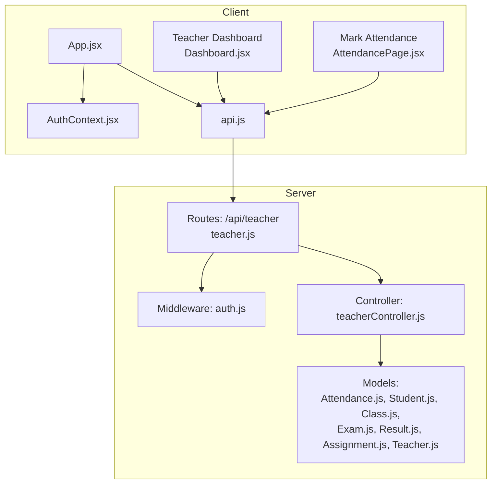
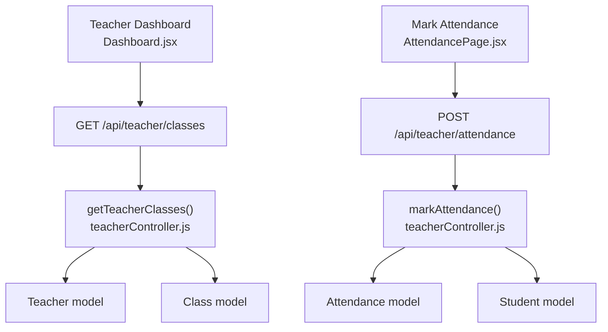
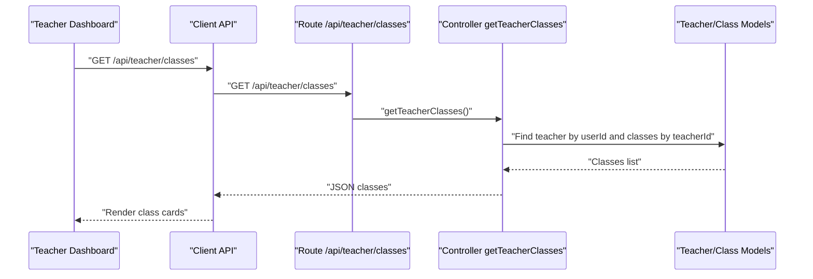
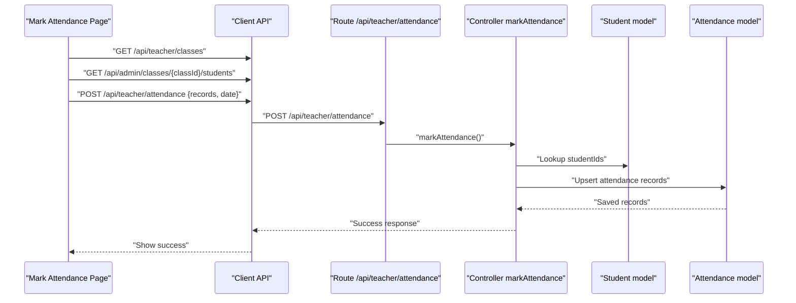
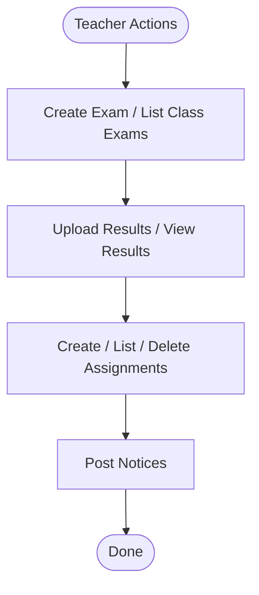
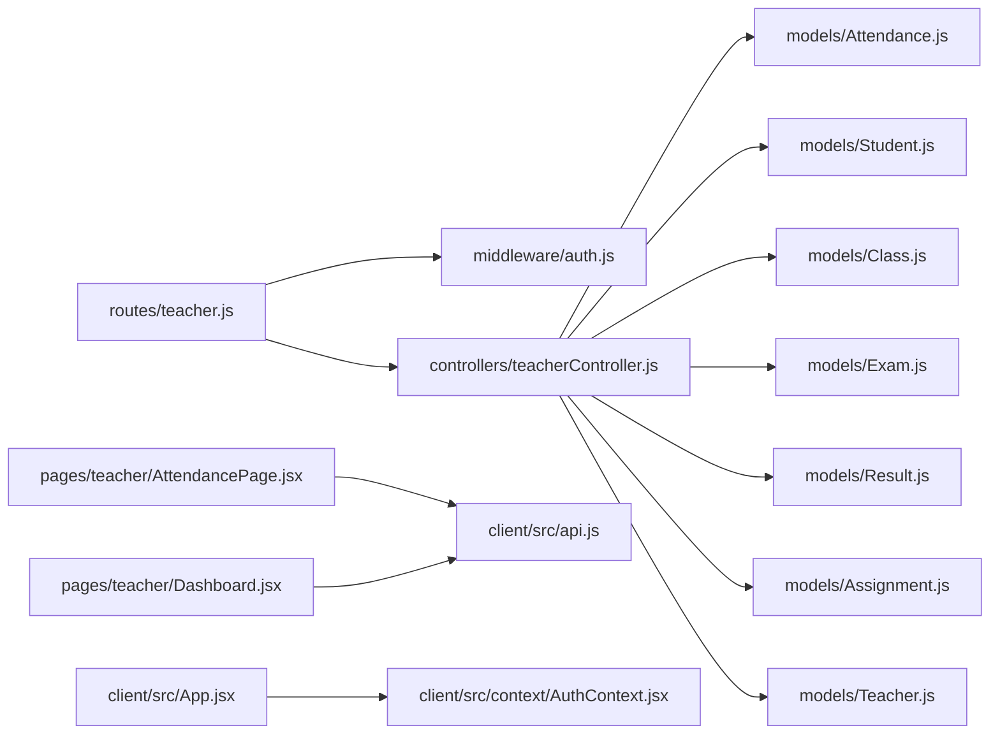

# Teacher Portal

<cite>
**Referenced Files in This Document**
- [Dashboard.jsx](file://client/src/pages/teacher/Dashboard.jsx)
- [AttendancePage.jsx](file://client/src/pages/teacher/AttendancePage.jsx)
- [teacherController.js](file://server/controllers/teacherController.js)
- [teacher.js](file://server/routes/teacher.js)
- [Attendance.js](file://server/models/Attendance.js)
- [Student.js](file://server/models/Student.js)
- [Class.js](file://server/models/Class.js)
- [Exam.js](file://server/models/Exam.js)
- [Result.js](file://server/models/Result.js)
- [Assignment.js](file://server/models/Assignment.js)
- [Teacher.js](file://server/models/Teacher.js)
- [auth.js](file://server/middleware/auth.js)
- [authController.js](file://server/controllers/authController.js)
- [api.js](file://client/src/api.js)
- [AuthContext.jsx](file://client/src/context/AuthContext.jsx)
- [App.jsx](file://client/src/App.jsx)
</cite>

## Table of Contents
1. [Introduction](#introduction)
2. [Project Structure](#project-structure)
3. [Core Components](#core-components)
4. [Architecture Overview](#architecture-overview)
5. [Detailed Component Analysis](#detailed-component-analysis)
6. [Dependency Analysis](#dependency-analysis)
7. [Performance Considerations](#performance-considerations)
8. [Troubleshooting Guide](#troubleshooting-guide)
9. [Conclusion](#conclusion)

## Introduction
This document explains the Teacher Portal functionality, focusing on the teacher dashboard, attendance management, class monitoring, academic record management, and communication features. It describes how teachers can manage student attendance, input grades, and communicate with students and parents, along with the backend APIs and data models that support these features.

## Project Structure
The Teacher Portal spans a React frontend and an Express/Node.js backend:
- Frontend pages for teachers include the dashboard and attendance page.
- Backend routes expose teacher-specific endpoints for attendance, exams/results, assignments, notices, and class retrieval.
- Authentication middleware ensures secure access and role-based authorization.
- Mongoose models define the domain entities for students, classes, attendance, exams, results, and assignments.



**Diagram sources**
- [App.jsx:1-85](file://client/src/App.jsx#L1-L85)
- [AuthContext.jsx:1-53](file://client/src/context/AuthContext.jsx#L1-L53)
- [api.js:1-28](file://client/src/api.js#L1-L28)
- [teacher.js:1-20](file://server/routes/teacher.js#L1-L20)
- [auth.js:1-31](file://server/middleware/auth.js#L1-L31)
- [teacherController.js:1-181](file://server/controllers/teacherController.js#L1-L181)
- [Attendance.js:1-14](file://server/models/Attendance.js#L1-L14)
- [Student.js:1-16](file://server/models/Student.js#L1-L16)
- [Class.js:1-11](file://server/models/Class.js#L1-L11)
- [Exam.js:1-13](file://server/models/Exam.js#L1-L13)
- [Result.js:1-14](file://server/models/Result.js#L1-L14)
- [Assignment.js:1-15](file://server/models/Assignment.js#L1-L15)
- [Teacher.js:1-13](file://server/models/Teacher.js#L1-L13)

**Section sources**
- [App.jsx:1-85](file://client/src/App.jsx#L1-L85)
- [teacher.js:1-20](file://server/routes/teacher.js#L1-L20)

## Core Components
- Teacher Dashboard: Lists the teacher’s assigned classes and displays quick stats.
- Mark Attendance Page: Allows selecting a class and date, marking present/absent/late per student, and saving records.
- Backend Controller: Implements attendance creation/updating, class attendance retrieval, monthly summaries, exam/result management, assignment CRUD, and teacher class retrieval.
- Authentication and Authorization: JWT-based auth and role checks ensure only authorized users access teacher endpoints.
- Data Models: Define relationships among Students, Classes, Attendance, Exams, Results, Assignments, and Teachers.

**Section sources**
- [Dashboard.jsx:1-56](file://client/src/pages/teacher/Dashboard.jsx#L1-L56)
- [AttendancePage.jsx:1-75](file://client/src/pages/teacher/AttendancePage.jsx#L1-L75)
- [teacherController.js:1-181](file://server/controllers/teacherController.js#L1-L181)
- [auth.js:1-31](file://server/middleware/auth.js#L1-L31)

## Architecture Overview
The teacher portal follows a layered architecture:
- Presentation Layer: React pages for teacher dashboard and attendance.
- API Layer: Express routes under /api/teacher.
- Business Logic Layer: Controller functions implementing teacher workflows.
- Persistence Layer: Mongoose models and MongoDB collections.



**Diagram sources**
- [Dashboard.jsx:1-56](file://client/src/pages/teacher/Dashboard.jsx#L1-L56)
- [AttendancePage.jsx:1-75](file://client/src/pages/teacher/AttendancePage.jsx#L1-L75)
- [teacher.js:1-20](file://server/routes/teacher.js#L1-L20)
- [teacherController.js:1-181](file://server/controllers/teacherController.js#L1-L181)
- [Attendance.js:1-14](file://server/models/Attendance.js#L1-L14)
- [Student.js:1-16](file://server/models/Student.js#L1-L16)
- [Class.js:1-11](file://server/models/Class.js#L1-L11)
- [Teacher.js:1-13](file://server/models/Teacher.js#L1-L13)

## Detailed Component Analysis

### Teacher Dashboard
- Fetches the teacher’s classes via GET /api/teacher/classes.
- Displays counts for classes, today’s day, and placeholder for active tasks.
- Renders a grid of class cards with name, section, and academic year.



**Diagram sources**
- [Dashboard.jsx:9-11](file://client/src/pages/teacher/Dashboard.jsx#L9-L11)
- [teacher.js:16](file://server/routes/teacher.js#L16)
- [teacherController.js:160-170](file://server/controllers/teacherController.js#L160-L170)
- [Teacher.js:1-13](file://server/models/Teacher.js#L1-L13)
- [Class.js:1-11](file://server/models/Class.js#L1-L11)

**Section sources**
- [Dashboard.jsx:1-56](file://client/src/pages/teacher/Dashboard.jsx#L1-L56)
- [teacher.js:16](file://server/routes/teacher.js#L16)
- [teacherController.js:160-170](file://server/controllers/teacherController.js#L160-L170)

### Attendance Management
- Select class and date, load students in the class.
- Mark attendance per student (present/absent/late).
- Save via POST /api/teacher/attendance with records array and date.
- Backend merges or creates attendance records and associates the teacher as the marker.



**Diagram sources**
- [AttendancePage.jsx:13-27](file://client/src/pages/teacher/AttendancePage.jsx#L13-L27)
- [teacher.js:6](file://server/routes/teacher.js#L6)
- [teacherController.js:11-41](file://server/controllers/teacherController.js#L11-L41)
- [Student.js:1-16](file://server/models/Student.js#L1-L16)
- [Attendance.js:1-14](file://server/models/Attendance.js#L1-L14)

**Section sources**
- [AttendancePage.jsx:1-75](file://client/src/pages/teacher/AttendancePage.jsx#L1-L75)
- [teacher.js:6](file://server/routes/teacher.js#L6)
- [teacherController.js:11-41](file://server/controllers/teacherController.js#L11-L41)

### Academic Record Management
- Exams: Create exam and fetch class exams.
- Results: Upload results per exam with marks and optional grade/remarks; retrieve results by exam.
- Assignments: Create, list by class, and delete assignments.



**Diagram sources**
- [teacher.js:9-17](file://server/routes/teacher.js#L9-L17)
- [teacherController.js:76-128](file://server/controllers/teacherController.js#L76-L128)
- [Exam.js:1-13](file://server/models/Exam.js#L1-L13)
- [Result.js:1-14](file://server/models/Result.js#L1-L14)
- [Assignment.js:1-15](file://server/models/Assignment.js#L1-L15)

**Section sources**
- [teacher.js:9-17](file://server/routes/teacher.js#L9-L17)
- [teacherController.js:76-128](file://server/controllers/teacherController.js#L76-L128)

### Data Models Overview
```mermaid
erDiagram
USER ||--o{ STUDENT : "has"
USER ||--o{ TEACHER : "has"
STUDENT }|--|| CLASS : "belongs_to"
TEACHER }|--|| CLASS : "teaches"
ATTENDANCE {
objectid studentId
date date
enum status
objectid markedBy
string remarks
}
STUDENT {
objectid userId
objectid classId
objectid parentId
string rollNumber
date admissionDate
date dateOfBirth
enum gender
string bloodGroup
string emergencyContact
}
CLASS {
string name
string section
objectid teacherId
string academicYear
}
EXAM {
string name
objectid classId
string subject
date date
number totalMarks
number passMarks
}
RESULT {
objectid studentId
objectid examId
number marks
string grade
string remarks
}
ASSIGNMENT {
string title
string description
objectid classId
string subject
objectid teacherId
date dueDate
number totalMarks
array attachments
}
TEACHER {
objectid userId
string subject
string qualification
number experience
date joinDate
number salary
}
```

**Diagram sources**
- [Attendance.js:1-14](file://server/models/Attendance.js#L1-L14)
- [Student.js:1-16](file://server/models/Student.js#L1-L16)
- [Class.js:1-11](file://server/models/Class.js#L1-L11)
- [Exam.js:1-13](file://server/models/Exam.js#L1-L13)
- [Result.js:1-14](file://server/models/Result.js#L1-L14)
- [Assignment.js:1-15](file://server/models/Assignment.js#L1-L15)
- [Teacher.js:1-13](file://server/models/Teacher.js#L1-L13)

## Dependency Analysis
- Routes depend on middleware for authentication and authorization.
- Controllers depend on models for persistence and population of related entities.
- Frontend pages depend on shared API client and auth context for protected routing and token injection.



**Diagram sources**
- [teacher.js:1-20](file://server/routes/teacher.js#L1-L20)
- [auth.js:1-31](file://server/middleware/auth.js#L1-L31)
- [teacherController.js:1-181](file://server/controllers/teacherController.js#L1-L181)
- [Attendance.js:1-14](file://server/models/Attendance.js#L1-L14)
- [Student.js:1-16](file://server/models/Student.js#L1-L16)
- [Class.js:1-11](file://server/models/Class.js#L1-L11)
- [Exam.js:1-13](file://server/models/Exam.js#L1-L13)
- [Result.js:1-14](file://server/models/Result.js#L1-L14)
- [Assignment.js:1-15](file://server/models/Assignment.js#L1-L15)
- [Teacher.js:1-13](file://server/models/Teacher.js#L1-L13)
- [AttendancePage.jsx:1-75](file://client/src/pages/teacher/AttendancePage.jsx#L1-L75)
- [Dashboard.jsx:1-56](file://client/src/pages/teacher/Dashboard.jsx#L1-L56)
- [api.js:1-28](file://client/src/api.js#L1-L28)
- [App.jsx:1-85](file://client/src/App.jsx#L1-L85)
- [AuthContext.jsx:1-53](file://client/src/context/AuthContext.jsx#L1-L53)

**Section sources**
- [teacher.js:1-20](file://server/routes/teacher.js#L1-L20)
- [auth.js:1-31](file://server/middleware/auth.js#L1-L31)
- [teacherController.js:1-181](file://server/controllers/teacherController.js#L1-L181)
- [api.js:1-28](file://client/src/api.js#L1-L28)
- [App.jsx:1-85](file://client/src/App.jsx#L1-L85)

## Performance Considerations
- Batch upserts for attendance reduce round-trips; ensure efficient indexing on studentId and date.
- Populate operations in controllers (e.g., student userId, exam results) should be minimized to avoid large payloads.
- Pagination for class assignments and monthly attendance summaries can improve responsiveness for large datasets.
- Caching frequently accessed class lists for a logged-in teacher can reduce repeated network requests.

## Troubleshooting Guide
- Authentication failures: If the token is missing or invalid, the auth middleware responds with unauthorized; the client redirects to login.
- Role authorization errors: The authorize middleware rejects access if the user role does not match required roles.
- Attendance duplicates: The controller deduplicates by date and studentId; verify uniqueness constraints and date boundaries.
- Missing teacher profile: Many teacher endpoints require a linked teacher profile; ensure profile creation precedes usage.
- Network errors: The client interceptor handles 401 by clearing local storage and redirecting to login.

**Section sources**
- [auth.js:4-28](file://server/middleware/auth.js#L4-L28)
- [authController.js:31-59](file://server/controllers/authController.js#L31-L59)
- [teacherController.js:11-41](file://server/controllers/teacherController.js#L11-L41)
- [api.js:16-25](file://client/src/api.js#L16-L25)

## Conclusion
The Teacher Portal provides a focused interface for managing classes, attendance, academic records, assignments, and notices. The backend enforces secure access via JWT and role-based authorization, while the frontend offers intuitive forms for daily tasks. The modular design and clear separation of concerns enable maintainability and future enhancements.