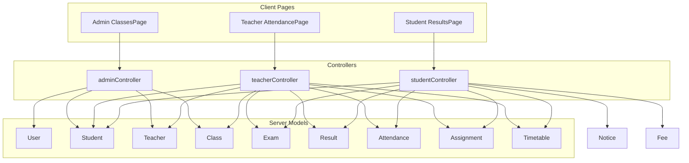
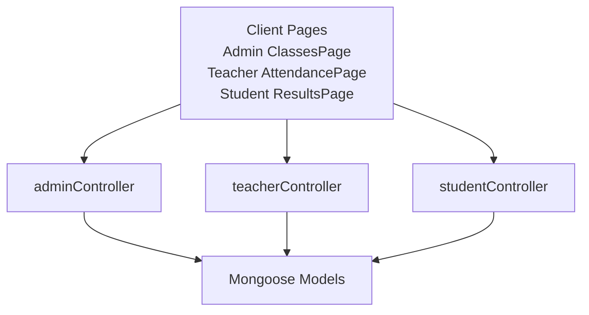
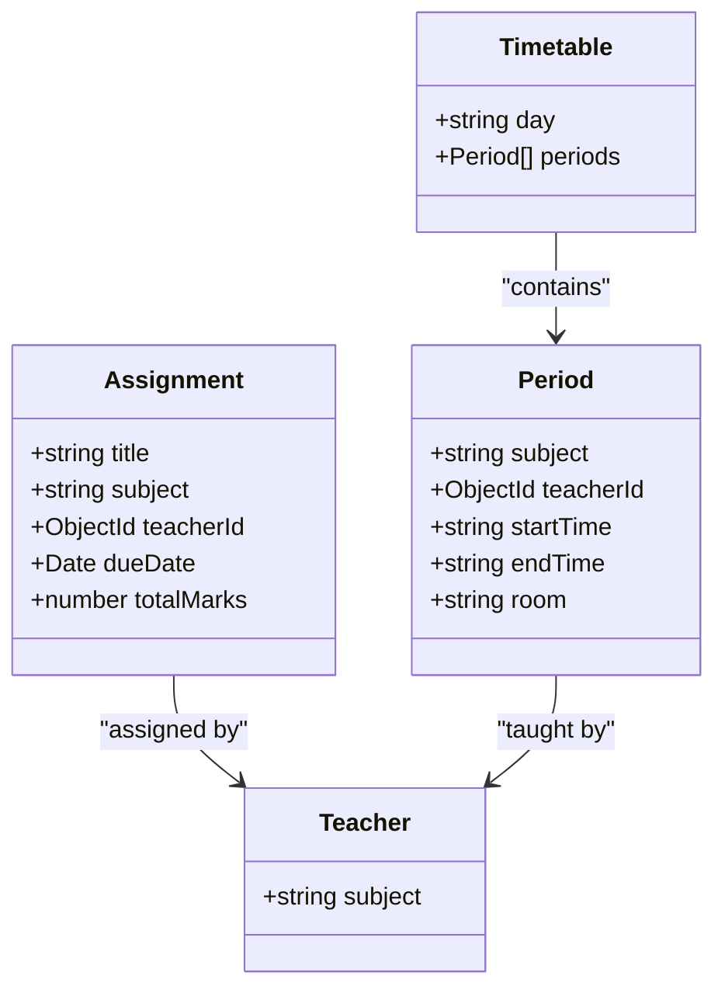
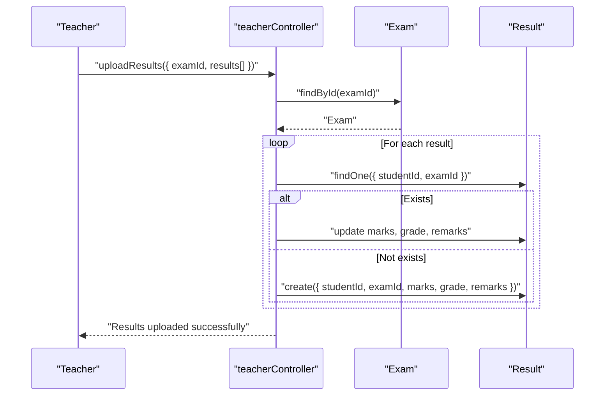
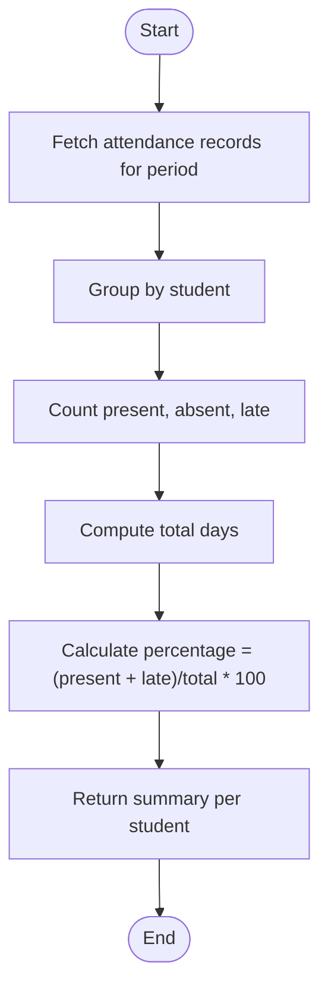
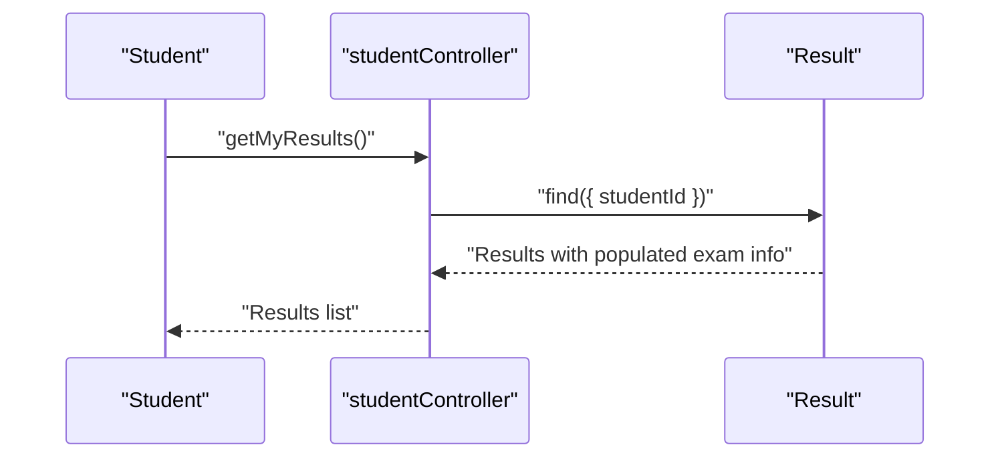
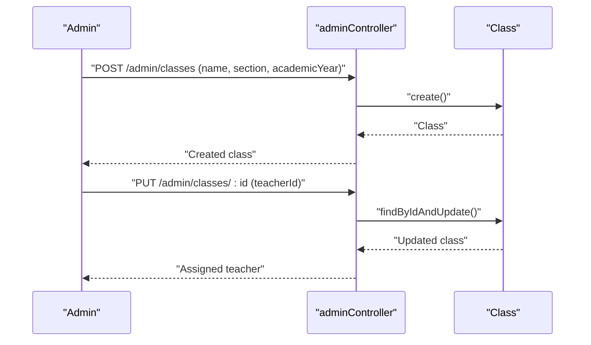
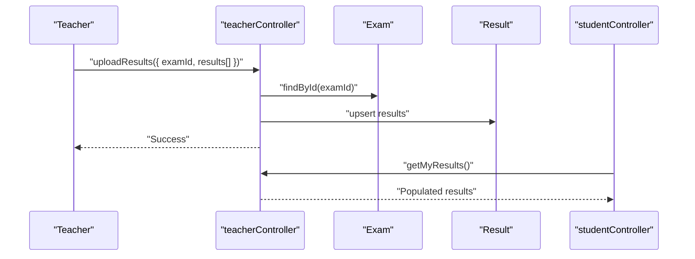
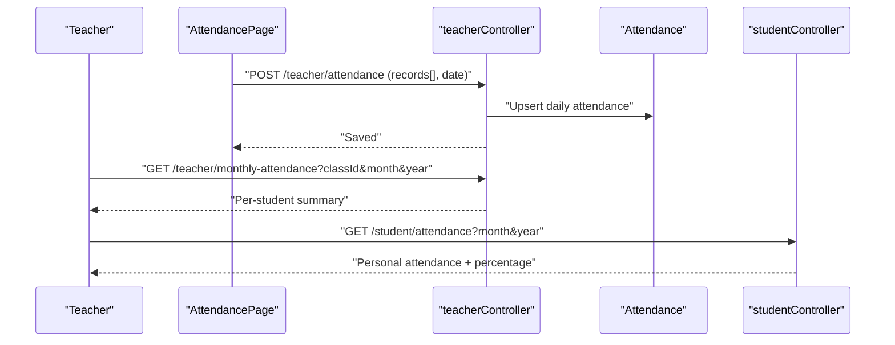
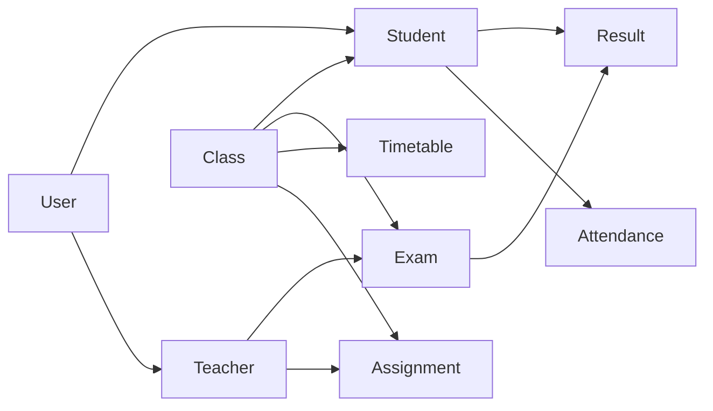

# Academic Models

<cite>
**Referenced Files in This Document**
- [Class.js](file://server/models/Class.js)
- [Student.js](file://server/models/Student.js)
- [Teacher.js](file://server/models/Teacher.js)
- [User.js](file://server/models/User.js)
- [Exam.js](file://server/models/Exam.js)
- [Result.js](file://server/models/Result.js)
- [Attendance.js](file://server/models/Attendance.js)
- [Assignment.js](file://server/models/Assignment.js)
- [Timetable.js](file://server/models/Timetable.js)
- [studentController.js](file://server/controllers/studentController.js)
- [teacherController.js](file://server/controllers/teacherController.js)
- [adminController.js](file://server/controllers/adminController.js)
- [ResultsPage.jsx](file://client/src/pages/student/ResultsPage.jsx)
- [AttendancePage.jsx](file://client/src/pages/teacher/AttendancePage.jsx)
- [ClassesPage.jsx](file://client/src/pages/admin/ClassesPage.jsx)
</cite>

## Table of Contents
1. [Introduction](#introduction)
2. [Project Structure](#project-structure)
3. [Core Components](#core-components)
4. [Architecture Overview](#architecture-overview)
5. [Detailed Component Analysis](#detailed-component-analysis)
6. [Dependency Analysis](#dependency-analysis)
7. [Performance Considerations](#performance-considerations)
8. [Troubleshooting Guide](#troubleshooting-guide)
9. [Conclusion](#conclusion)
10. [Appendices](#appendices)

## Introduction
This document provides comprehensive data model documentation for academic entities in the system, focusing on Class, Subject, Result, and Attendance models. It explains class enrollment systems, subject allocation, grade calculation mechanisms, and attendance tracking. It also details relationships among students, classes, subjects, and teachers, and outlines result calculation algorithms, attendance percentage computations, and academic performance metrics. Examples of class management, grading workflows, and attendance reporting systems are included to illustrate practical usage.

## Project Structure
The academic system is organized around Mongoose models representing core entities and controllers implementing domain workflows. The client-side React pages demonstrate how users interact with the backend APIs for class management, attendance marking, and result viewing.



**Diagram sources**
- [adminController.js:1-158](file://server/controllers/adminController.js#L1-L158)
- [teacherController.js:1-181](file://server/controllers/teacherController.js#L1-L181)
- [studentController.js:1-85](file://server/controllers/studentController.js#L1-L85)
- [ClassesPage.jsx:1-82](file://client/src/pages/admin/ClassesPage.jsx#L1-L82)
- [AttendancePage.jsx:1-75](file://client/src/pages/teacher/AttendancePage.jsx#L1-L75)
- [ResultsPage.jsx:1-48](file://client/src/pages/student/ResultsPage.jsx#L1-L48)

**Section sources**
- [adminController.js:1-158](file://server/controllers/adminController.js#L1-L158)
- [teacherController.js:1-181](file://server/controllers/teacherController.js#L1-L181)
- [studentController.js:1-85](file://server/controllers/studentController.js#L1-L85)
- [ClassesPage.jsx:1-82](file://client/src/pages/admin/ClassesPage.jsx#L1-L82)
- [AttendancePage.jsx:1-75](file://client/src/pages/teacher/AttendancePage.jsx#L1-L75)
- [ResultsPage.jsx:1-48](file://client/src/pages/student/ResultsPage.jsx#L1-L48)

## Core Components
This section documents the primary academic data models and their relationships.

- Class
  - Purpose: Represents academic classes with name, section, academic year, and associated teacher.
  - Key fields: name, section, teacherId (reference to Teacher), academicYear.
  - Enrollment linkage: Students are enrolled via classId in the Student model.

- Student
  - Purpose: Stores student profiles linked to User accounts and class enrollment.
  - Key fields: userId (reference to User), classId (reference to Class), parentId (reference to User), rollNumber (unique), admissionDate, dateOfBirth, gender, bloodGroup, emergencyContact.
  - Enrollment linkage: Connects a student to a class and user account.

- Teacher
  - Purpose: Stores teacher profiles linked to User accounts and subject specialization.
  - Key fields: userId (reference to User), subject, qualification, experience, joinDate, salary.
  - Allocation linkage: Assigned to classes via teacherId in Class.

- Exam
  - Purpose: Defines assessments with subject, date, total marks, and pass marks per class.
  - Key fields: name, classId (reference to Class), subject, date, totalMarks, passMarks.

- Result
  - Purpose: Stores individual student scores per exam with optional grade and remarks.
  - Key fields: studentId (reference to Student), examId (reference to Exam), marks, grade, remarks.
  - Uniqueness: Composite unique index on studentId and examId.

- Attendance
  - Purpose: Tracks daily attendance with status and marked-by information.
  - Key fields: studentId (reference to Student), date, status (present, absent, late), markedBy (reference to User), remarks.
  - Uniqueness: Composite unique index on studentId and date.

- Assignment
  - Purpose: Manages subject-specific assignments for classes with due dates and total marks.
  - Key fields: title, description, classId (reference to Class), subject, teacherId (reference to Teacher), dueDate, totalMarks, attachments.

- Timetable
  - Purpose: Defines daily schedule periods for a class with subject, teacher, and timing.
  - Key fields: classId (reference to Class), day, periods (array of subject, teacherId, startTime, endTime, room).

- User
  - Purpose: Base entity for all roles (admin, teacher, student, parent) with authentication and profile attributes.
  - Key fields: name, email (unique), password (hashed), role, phone, address, profileImage, isActive.
  - Security: Pre-save hook hashes passwords; matchPassword method compares entered password with stored hash.

**Section sources**
- [Class.js:1-11](file://server/models/Class.js#L1-L11)
- [Student.js:1-16](file://server/models/Student.js#L1-L16)
- [Teacher.js:1-13](file://server/models/Teacher.js#L1-L13)
- [Exam.js:1-13](file://server/models/Exam.js#L1-L13)
- [Result.js:1-14](file://server/models/Result.js#L1-L14)
- [Attendance.js:1-14](file://server/models/Attendance.js#L1-L14)
- [Assignment.js:1-15](file://server/models/Assignment.js#L1-L15)
- [Timetable.js:1-16](file://server/models/Timetable.js#L1-L16)
- [User.js:1-27](file://server/models/User.js#L1-L27)

## Architecture Overview
The system follows a layered architecture:
- Data layer: Mongoose models define schemas and indexes.
- Business logic layer: Controllers orchestrate CRUD operations, validations, and aggregations.
- Presentation layer: React pages consume REST endpoints for user interactions.



**Diagram sources**
- [ClassesPage.jsx:1-82](file://client/src/pages/admin/ClassesPage.jsx#L1-L82)
- [AttendancePage.jsx:1-75](file://client/src/pages/teacher/AttendancePage.jsx#L1-L75)
- [ResultsPage.jsx:1-48](file://client/src/pages/student/ResultsPage.jsx#L1-L48)
- [adminController.js:1-158](file://server/controllers/adminController.js#L1-L158)
- [teacherController.js:1-181](file://server/controllers/teacherController.js#L1-L181)
- [studentController.js:1-85](file://server/controllers/studentController.js#L1-L85)

## Detailed Component Analysis

### Class Model and Enrollment System
- Enrollment linkage: Students are enrolled in a class via classId in the Student model.
- Class teacher assignment: Admin assigns a teacher to a class via teacherId in the Class model.
- Class listing and management: Admin endpoints support listing, creating, updating, deleting classes, and fetching class students.

```mermaid
erDiagram
USER {
ObjectId _id PK
string name
string email UK
string password
string role
}
TEACHER {
ObjectId _id PK
ObjectId userId FK
string subject
string qualification
number experience
date joinDate
number salary
}
CLASS {
ObjectId _id PK
string name
string section
ObjectId teacherId FK
string academicYear
}
STUDENT {
ObjectId _id PK
ObjectId userId FK
ObjectId classId FK
ObjectId parentId FK
string rollNumber UK
date admissionDate
date dateOfBirth
string gender
string bloodGroup
string emergencyContact
}
TEACHER }o--|| CLASS : "assigned to"
CLASS ||--o{ STUDENT : "enrolls"
USER ||--|| TEACHER : "profile"
USER ||--|| STUDENT : "profile"
```

**Diagram sources**
- [Class.js:1-11](file://server/models/Class.js#L1-L11)
- [Student.js:1-16](file://server/models/Student.js#L1-L16)
- [Teacher.js:1-13](file://server/models/Teacher.js#L1-L13)
- [User.js:1-27](file://server/models/User.js#L1-L27)

**Section sources**
- [Class.js:1-11](file://server/models/Class.js#L1-L11)
- [Student.js:1-16](file://server/models/Student.js#L1-L16)
- [Teacher.js:1-13](file://server/models/Teacher.js#L1-L13)
- [User.js:1-27](file://server/models/User.js#L1-L27)
- [adminController.js:100-158](file://server/controllers/adminController.js#L100-L158)
- [ClassesPage.jsx:1-82](file://client/src/pages/admin/ClassesPage.jsx#L1-L82)

### Subject Allocation and Timetable
- Subject allocation: Teachers are specialized by subject in the Teacher model; assignments and timetables reference subject and teacherId.
- Timetable definition: Timetable defines daily periods with subject, teacherId, start/end times, and room for a classId.



**Diagram sources**
- [Timetable.js:1-16](file://server/models/Timetable.js#L1-L16)
- [Assignment.js:1-15](file://server/models/Assignment.js#L1-L15)
- [Teacher.js:1-13](file://server/models/Teacher.js#L1-L13)

**Section sources**
- [Timetable.js:1-16](file://server/models/Timetable.js#L1-L16)
- [Assignment.js:1-15](file://server/models/Assignment.js#L1-L15)
- [Teacher.js:1-13](file://server/models/Teacher.js#L1-L13)

### Result Calculation Mechanisms
- Result storage: Each Result record stores marks, optional grade, and remarks for a student in an exam.
- Unique constraint: Ensures a student has one result per exam.
- Retrieval: Controllers populate exam and student/user details for display.



**Diagram sources**
- [teacherController.js:95-119](file://server/controllers/teacherController.js#L95-L119)
- [Result.js:1-14](file://server/models/Result.js#L1-L14)
- [Exam.js:1-13](file://server/models/Exam.js#L1-L13)

**Section sources**
- [Result.js:1-14](file://server/models/Result.js#L1-L14)
- [teacherController.js:95-119](file://server/controllers/teacherController.js#L95-L119)
- [ResultsPage.jsx:1-48](file://client/src/pages/student/ResultsPage.jsx#L1-L48)

### Attendance Tracking and Percentage Calculation
- Daily attendance: Each Attendance record captures studentId, date, status, and markedBy.
- Unique constraint: Prevents duplicate entries per student per day.
- Reporting: Controllers compute totals, presence, absence, lateness, and percentages.



**Diagram sources**
- [studentController.js:10-31](file://server/controllers/studentController.js#L10-L31)
- [teacherController.js:56-74](file://server/controllers/teacherController.js#L56-L74)
- [Attendance.js:1-14](file://server/models/Attendance.js#L1-L14)

**Section sources**
- [Attendance.js:1-14](file://server/models/Attendance.js#L1-L14)
- [studentController.js:10-31](file://server/controllers/studentController.js#L10-L31)
- [teacherController.js:43-74](file://server/controllers/teacherController.js#L43-L74)
- [AttendancePage.jsx:1-75](file://client/src/pages/teacher/AttendancePage.jsx#L1-L75)

### Academic Performance Metrics
- Grade calculation: The Result model supports storing grades alongside marks; the UI maps grades to color-coded badges for quick interpretation.
- Attendance metrics: The system computes daily and monthly summaries, enabling class-wide performance monitoring.



**Diagram sources**
- [studentController.js:33-42](file://server/controllers/studentController.js#L33-L42)
- [Result.js:1-14](file://server/models/Result.js#L1-L14)

**Section sources**
- [ResultsPage.jsx:1-48](file://client/src/pages/student/ResultsPage.jsx#L1-L48)
- [studentController.js:33-42](file://server/controllers/studentController.js#L33-L42)

### Class Management Examples
- Creating and editing classes: Admin UI posts to create/update endpoints; academic year defaults are supported.
- Assigning a teacher to a class: Admin selects a teacher and updates the class’s teacherId.



**Diagram sources**
- [adminController.js:110-127](file://server/controllers/adminController.js#L110-L127)
- [adminController.js:149-157](file://server/controllers/adminController.js#L149-L157)
- [ClassesPage.jsx:1-82](file://client/src/pages/admin/ClassesPage.jsx#L1-L82)

**Section sources**
- [adminController.js:100-158](file://server/controllers/adminController.js#L100-L158)
- [ClassesPage.jsx:1-82](file://client/src/pages/admin/ClassesPage.jsx#L1-L82)

### Grading Workflow Example
- Teacher uploads results for an exam; the system updates existing records or creates new ones.
- Student views results with grade and remarks.



**Diagram sources**
- [teacherController.js:95-119](file://server/controllers/teacherController.js#L95-L119)
- [studentController.js:33-42](file://server/controllers/studentController.js#L33-L42)

**Section sources**
- [teacherController.js:95-119](file://server/controllers/teacherController.js#L95-L119)
- [studentController.js:33-42](file://server/controllers/studentController.js#L33-L42)
- [ResultsPage.jsx:1-48](file://client/src/pages/student/ResultsPage.jsx#L1-L48)

### Attendance Reporting Example
- Teacher selects a class and date, marks statuses for students, and saves records.
- Monthly reports summarize presence, absence, and lateness per student.



**Diagram sources**
- [AttendancePage.jsx:1-75](file://client/src/pages/teacher/AttendancePage.jsx#L1-L75)
- [teacherController.js:11-41](file://server/controllers/teacherController.js#L11-L41)
- [teacherController.js:56-74](file://server/controllers/teacherController.js#L56-L74)
- [studentController.js:10-31](file://server/controllers/studentController.js#L10-L31)

**Section sources**
- [AttendancePage.jsx:1-75](file://client/src/pages/teacher/AttendancePage.jsx#L1-L75)
- [teacherController.js:11-41](file://server/controllers/teacherController.js#L11-L41)
- [teacherController.js:56-74](file://server/controllers/teacherController.js#L56-L74)
- [studentController.js:10-31](file://server/controllers/studentController.js#L10-L31)

## Dependency Analysis
The following diagram shows key dependencies among models and controllers:



**Diagram sources**
- [User.js:1-27](file://server/models/User.js#L1-L27)
- [Student.js:1-16](file://server/models/Student.js#L1-L16)
- [Teacher.js:1-13](file://server/models/Teacher.js#L1-L13)
- [Class.js:1-11](file://server/models/Class.js#L1-L11)
- [Exam.js:1-13](file://server/models/Exam.js#L1-L13)
- [Result.js:1-14](file://server/models/Result.js#L1-L14)
- [Attendance.js:1-14](file://server/models/Attendance.js#L1-L14)
- [Timetable.js:1-16](file://server/models/Timetable.js#L1-L16)
- [Assignment.js:1-15](file://server/models/Assignment.js#L1-L15)

**Section sources**
- [User.js:1-27](file://server/models/User.js#L1-L27)
- [Student.js:1-16](file://server/models/Student.js#L1-L16)
- [Teacher.js:1-13](file://server/models/Teacher.js#L1-L13)
- [Class.js:1-11](file://server/models/Class.js#L1-L11)
- [Exam.js:1-13](file://server/models/Exam.js#L1-L13)
- [Result.js:1-14](file://server/models/Result.js#L1-L14)
- [Attendance.js:1-14](file://server/models/Attendance.js#L1-L14)
- [Timetable.js:1-16](file://server/models/Timetable.js#L1-L16)
- [Assignment.js:1-15](file://server/models/Assignment.js#L1-L15)

## Performance Considerations
- Indexes: Unique composite indexes on (studentId, examId) for Result and (studentId, date) for Attendance improve lookup performance.
- Population: Controllers populate related entities (e.g., exam -> classId, student -> userId) to reduce client-side joins but increase query complexity; batch requests and pagination help mitigate overhead.
- Aggregation: Monthly attendance summaries are computed client-side from fetched arrays; for large datasets, server-side aggregation could reduce payload sizes.
- Password hashing: Pre-save hooks on User ensure secure storage but add CPU overhead during creation/updating; tune salt rounds for balance between security and performance.

[No sources needed since this section provides general guidance]

## Troubleshooting Guide
- Duplicate result entries: Ensure unique index on (studentId, examId) is enforced; controller upserts should update existing records.
- Duplicate attendance per day: Unique index on (studentId, date) prevents duplicates; controller checks for existing records before insert/update.
- Missing teacher profile: When marking attendance or uploading results, verify teacher existence via userId before proceeding.
- Student not found: Controllers return 404 when student profile is missing; confirm userId maps to a valid Student record.
- Authentication errors: Confirm User password hashing and matchPassword method are functioning; validate tokens and role-based access.

**Section sources**
- [Result.js:11-11](file://server/models/Result.js#L11-L11)
- [Attendance.js:11-11](file://server/models/Attendance.js#L11-L11)
- [teacherController.js:11-21](file://server/controllers/teacherController.js#L11-L21)
- [studentController.js:10-13](file://server/controllers/studentController.js#L10-L13)
- [User.js:15-24](file://server/models/User.js#L15-L24)

## Conclusion
The academic models and controllers provide a robust foundation for managing classes, students, teachers, exams, results, and attendance. The system enforces referential integrity via Mongoose population and indexes, supports role-based workflows, and exposes clear APIs for client-side interactions. Extending the models to include explicit Subject entities would further refine subject allocation and reporting capabilities.

[No sources needed since this section summarizes without analyzing specific files]

## Appendices
- API usage examples:
  - Admin manages classes and assigns teachers.
  - Teacher marks attendance and uploads results.
  - Student views personal attendance and results.

**Section sources**
- [adminController.js:100-158](file://server/controllers/adminController.js#L100-L158)
- [teacherController.js:11-41](file://server/controllers/teacherController.js#L11-L41)
- [teacherController.js:95-119](file://server/controllers/teacherController.js#L95-L119)
- [studentController.js:10-31](file://server/controllers/studentController.js#L10-L31)
- [studentController.js:33-42](file://server/controllers/studentController.js#L33-L42)