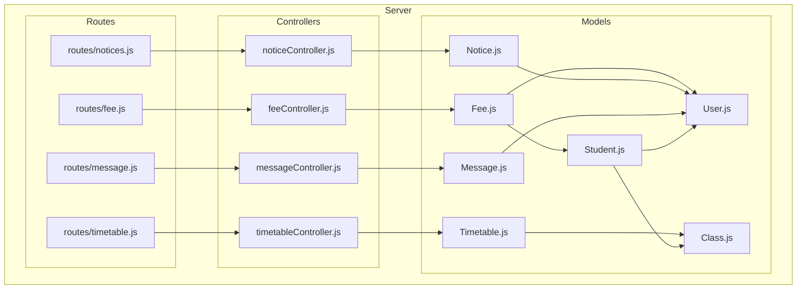
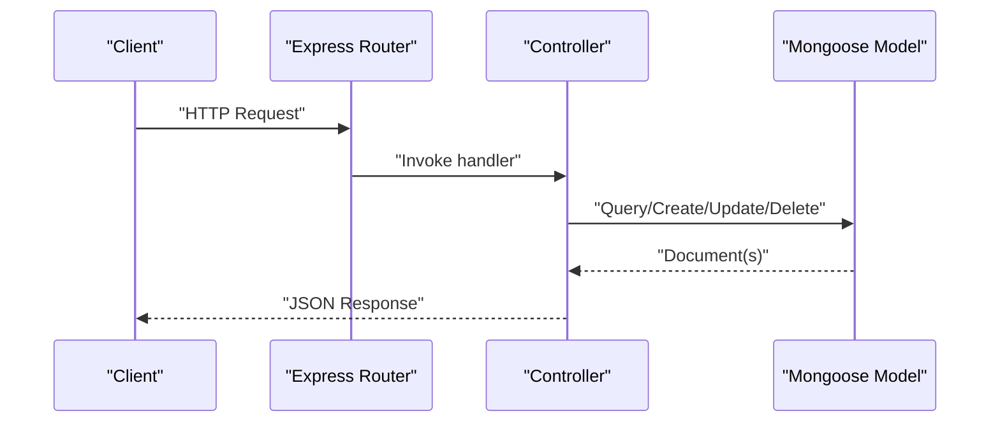
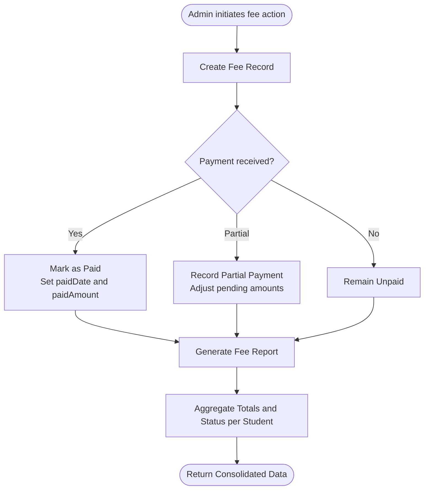
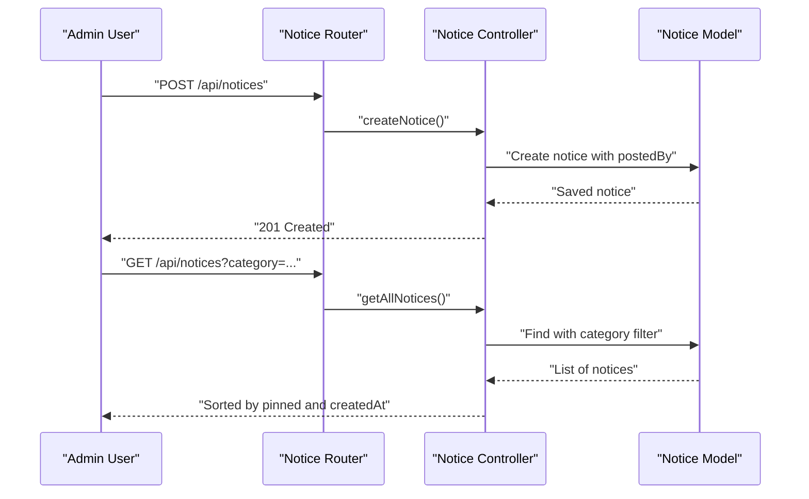
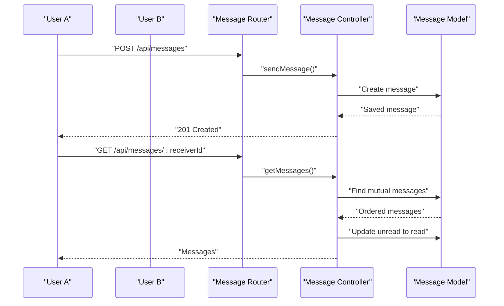
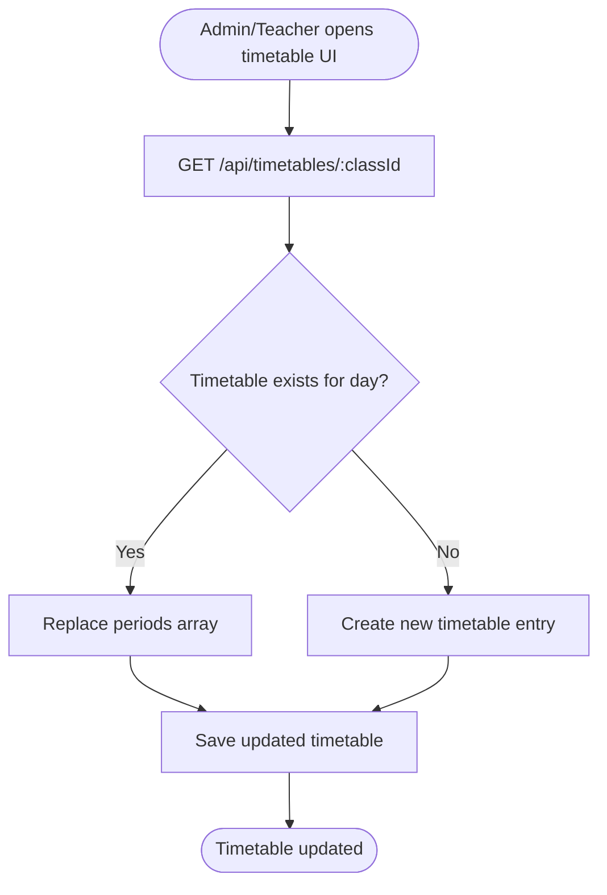

# Administrative Models

<cite>
**Referenced Files in This Document**
- [Fee.js](file://server/models/Fee.js)
- [Notice.js](file://server/models/Notice.js)
- [Message.js](file://server/models/Message.js)
- [Timetable.js](file://server/models/Timetable.js)
- [Student.js](file://server/models/Student.js)
- [User.js](file://server/models/User.js)
- [Class.js](file://server/models/Class.js)
- [feeController.js](file://server/controllers/feeController.js)
- [noticeController.js](file://server/controllers/noticesController.js)
- [messageController.js](file://server/controllers/messageController.js)
- [timetableController.js](file://server/controllers/timetableController.js)
- [fee.js](file://server/routes/fee.js)
- [notice.js](file://server/routes/notices.js)
- [message.js](file://server/routes/message.js)
- [timetable.js](file://server/routes/timetable.js)
</cite>

## Table of Contents
1. [Introduction](#introduction)
2. [Project Structure](#project-structure)
3. [Core Components](#core-components)
4. [Architecture Overview](#architecture-overview)
5. [Detailed Component Analysis](#detailed-component-analysis)
6. [Dependency Analysis](#dependency-analysis)
7. [Performance Considerations](#performance-considerations)
8. [Troubleshooting Guide](#troubleshooting-guide)
9. [Conclusion](#conclusion)

## Introduction
This document provides comprehensive data model documentation for administrative entities focused on four core models: Fee, Notice, Message, and Timetable. It explains their schema definitions, relationships, and controller-level processing logic. It also covers administrative workflows such as fee payment tracking, notice distribution, internal messaging, and timetable generation. Examples are provided to illustrate real-world usage scenarios for fee collection, announcement publishing, inter-user communication, and class scheduling.

## Project Structure
The administrative models reside under the server models directory and are consumed by dedicated controllers and routes. Controllers encapsulate business logic and expose REST endpoints via Express routes. Authentication and role-based authorization middleware protect sensitive administrative actions.



**Diagram sources**
- [fee.js:1-13](file://server/routes/fee.js#L1-L13)
- [notice.js:1-12](file://server/routes/notices.js#L1-L12)
- [message.js:1-11](file://server/routes/message.js#L1-L11)
- [timetable.js:1-12](file://server/routes/timetable.js#L1-L12)
- [feeController.js:1-119](file://server/controllers/feeController.js#L1-L119)
- [noticeController.js:1-43](file://server/controllers/noticesController.js#L1-L43)
- [messageController.js:1-38](file://server/controllers/messageController.js#L1-L38)
- [timetableController.js:1-47](file://server/controllers/timetableController.js#L1-L47)
- [Fee.js:1-17](file://server/models/Fee.js#L1-L17)
- [Notice.js:1-14](file://server/models/Notice.js#L1-L14)
- [Message.js:1-11](file://server/models/Message.js#L1-L11)
- [Timetable.js:1-16](file://server/models/Timetable.js#L1-L16)
- [Student.js:1-16](file://server/models/Student.js#L1-L16)
- [User.js:1-27](file://server/models/User.js#L1-L27)
- [Class.js:1-11](file://server/models/Class.js#L1-L11)

**Section sources**
- [fee.js:1-13](file://server/routes/fee.js#L1-L13)
- [notice.js:1-12](file://server/routes/notices.js#L1-L12)
- [message.js:1-11](file://server/routes/message.js#L1-L11)
- [timetable.js:1-12](file://server/routes/timetable.js#L1-L12)

## Core Components
This section documents the schema-level structure and key attributes for each administrative model.

- Fee
  - Purpose: Track student fee records, payment status, partial payments, due dates, and monthly academic cycles.
  - Key attributes: student identifier, amount, fee type, status, paid amount, due date, paid date, month, academic year, receipt number.
  - Relationships: References Student and User via studentId and potentially postedBy for audit trails.

- Notice
  - Purpose: Manage announcements with categories, targeted roles, pinning, and optional attachments.
  - Key attributes: title, message body, category, target roles, posted by user, pinned flag, attachments.
  - Relationships: Posted by a User; supports role-based filtering for distribution.

- Message
  - Purpose: Enable internal messaging between users with read/unread tracking.
  - Key attributes: sender, receiver, message content, read status.
  - Relationships: Both sender and receiver reference User.

- Timetable
  - Purpose: Define class schedules with days of the week and period entries containing subject, teacher, time slots, and room.
  - Key attributes: class reference, day, periods array.
  - Relationships: References Class and Teacher for each period.

**Section sources**
- [Fee.js:1-17](file://server/models/Fee.js#L1-L17)
- [Notice.js:1-14](file://server/models/Notice.js#L1-L14)
- [Message.js:1-11](file://server/models/Message.js#L1-L11)
- [Timetable.js:1-16](file://server/models/Timetable.js#L1-L16)

## Architecture Overview
The administrative subsystem follows a layered architecture:
- Routes define HTTP endpoints and apply authentication/authorization guards.
- Controllers implement request handling, orchestrate data retrieval/saving, and enforce business rules.
- Models define schemas and relationships; controllers use Mongoose ODM to persist and query data.
- Relationships among models support cross-entity operations (e.g., fee reports across students and classes).



[No sources needed since this diagram shows conceptual workflow, not actual code structure]

## Detailed Component Analysis

### Fee Model and Workflow
The Fee model captures tuition and miscellaneous fee items per student with granular payment tracking. The controller exposes endpoints for creation, retrieval, updates, marking as paid, and generating consolidated reports.

Key capabilities:
- Payment tracking: status transitions (unpaid, partial, paid), paid amount accumulation, paid date recording.
- Reporting: class-based filters, month filters, and aggregated summaries per student including totals and overall status.
- Sorting and population: chronological sorting by due date and month; population of related entities for richer reporting.



**Diagram sources**
- [feeController.js:32-40](file://server/controllers/feeController.js#L32-L40)
- [feeController.js:42-118](file://server/controllers/feeController.js#L42-L118)
- [Fee.js:3-14](file://server/models/Fee.js#L3-L14)

Practical examples:
- Fee collection process: Admin creates a fee record for a student with a due date and month. As payments arrive, the admin marks the record as paid or partial, updating paid amounts and dates. Monthly reports summarize collected and pending amounts per student and class.
- Example endpoint usage: POST /api/fee for creation, PUT /api/fee/:id/pay for marking as paid, GET /api/fee/report with optional classId, status, and month filters.

**Section sources**
- [Fee.js:1-17](file://server/models/Fee.js#L1-L17)
- [feeController.js:1-119](file://server/controllers/feeController.js#L1-L119)
- [fee.js:1-13](file://server/routes/fee.js#L1-L13)

### Notice Model and Distribution
The Notice model supports categorized announcements targeted to specific roles with optional pinning and attachments. The controller enables listing, creating, updating, and deleting notices.

Key capabilities:
- Role-based distribution: targetRoles field allows targeting admin, teacher, student, or parent.
- Sorting and pinning: notices are sorted by pinned status first, then recency.
- Attachment support: optional file references for supporting documents.



**Diagram sources**
- [noticeController.js:15-22](file://server/controllers/noticesController.js#L15-L22)
- [noticeController.js:3-13](file://server/controllers/noticesController.js#L3-L13)
- [Notice.js:3-11](file://server/models/Notice.js#L3-L11)

Practical examples:
- Announcement publishing: An admin posts a notice with category and target roles; recipients receive the notice based on their roles. Pinned notices appear at the top of lists.
- Example endpoint usage: GET /api/notices for listing, POST /api/notices for creation, PUT /api/notices/:id for updates, DELETE /api/notices/:id for removal.

**Section sources**
- [Notice.js:1-14](file://server/models/Notice.js#L1-L14)
- [noticeController.js:1-43](file://server/controllers/noticesController.js#L1-L43)
- [notice.js:1-12](file://server/routes/notices.js#L1-L12)

### Message Model and Threading
The Message model enables private communication between users with read/unread tracking. The controller supports fetching conversations between two users, sending new messages, and retrieving unread counts.

Key capabilities:
- Threaded conversations: Messages are retrieved by mutual sender/receiver pairs and sorted chronologically.
- Read tracking: On retrieval, unread messages for the current user are marked as read.
- Unread count: Dedicated endpoint to fetch the number of unread messages for the authenticated user.



**Diagram sources**
- [messageController.js:20-28](file://server/controllers/messageController.js#L20-L28)
- [messageController.js:3-18](file://server/controllers/messageController.js#L3-L18)
- [Message.js:3-8](file://server/models/Message.js#L3-L8)

Practical examples:
- Inter-user communication: A teacher sends a message to a student; upon opening the conversation, unread messages are marked as read. The sender can check unread counts across their inbox.
- Example endpoint usage: POST /api/messages for sending, GET /api/messages/:receiverId for threaded messages, GET /api/messages/unread/count for unread tally.

**Section sources**
- [Message.js:1-11](file://server/models/Message.js#L1-L11)
- [messageController.js:1-38](file://server/controllers/messageController.js#L1-L38)
- [message.js:1-11](file://server/routes/message.js#L1-L11)

### Timetable Model and Generation
The Timetable model defines weekly schedules per class with periods containing subjects, teachers, time slots, and rooms. The controller supports fetching class timetables, creating/updating timetables, and deleting them.

Key capabilities:
- Per-class scheduling: One timetable per class per day; periods replace entire schedule on creation/update.
- Population of teacher details: Class timetable queries populate teacher identities for display.
- Constraints: Day enumeration ensures consistent weekly structure; periods array holds multiple lessons per day.



**Diagram sources**
- [timetableController.js:12-27](file://server/controllers/timetableController.js#L12-L27)
- [Timetable.js:3-13](file://server/models/Timetable.js#L3-L13)

Practical examples:
- Class scheduling: An administrator or teacher creates or updates a timetable for a class on a given day. Periods include subject, teacher, start/end times, and room. The system populates teacher details when retrieving class schedules.
- Example endpoint usage: GET /api/timetables/:classId for retrieval, POST /api/timetables for creation/update, PUT /api/timetables/:id for edits, DELETE /api/timetables/:id for removal.

**Section sources**
- [Timetable.js:1-16](file://server/models/Timetable.js#L1-L16)
- [timetableController.js:1-47](file://server/controllers/timetableController.js#L1-L47)
- [timetable.js:1-12](file://server/routes/timetable.js#L1-L12)

## Dependency Analysis
The models and controllers form a cohesive dependency graph centered around User, Student, Class, and administrative entities.

```mermaid
erDiagram
USER {
ObjectId _id PK
string name
string email
string password
string role
string phone
string address
string profileImage
boolean isActive
}
STUDENT {
ObjectId _id PK
ObjectId userId FK
ObjectId classId FK
ObjectId parentId FK
string rollNumber
date admissionDate
date dateOfBirth
string gender
string bloodGroup
string emergencyContact
}
CLASS {
ObjectId _id PK
string name
string section
ObjectId teacherId FK
string academicYear
}
FEE {
ObjectId _id PK
ObjectId studentId FK
number amount
string feeType
string status
number paidAmount
date dueDate
date paidDate
string month
string academicYear
string receiptNumber
}
NOTICE {
ObjectId _id PK
string title
string message
string category
string[] targetRoles
ObjectId postedBy FK
boolean isPinned
string[] attachments
}
MESSAGE {
ObjectId _id PK
ObjectId senderId FK
ObjectId receiverId FK
string message
boolean isRead
}
TIMETABLE {
ObjectId _id PK
ObjectId classId FK
string day
}
PERIOD {
string subject
ObjectId teacherId FK
string startTime
string endTime
string room
}
USER ||--o{ STUDENT : "has"
USER ||--o{ NOTICE : "posts"
USER ||--o{ MESSAGE : "sends"
USER ||--o{ MESSAGE : "receives"
CLASS ||--o{ STUDENT : "enrolls"
STUDENT ||--o{ FEE : "owes"
CLASS ||--o{ TIMETABLE : "has"
TIMETABLE ||--o{ PERIOD : "contains"
```

**Diagram sources**
- [User.js:4-13](file://server/models/User.js#L4-L13)
- [Student.js:3-13](file://server/models/Student.js#L3-L13)
- [Class.js:3-8](file://server/models/Class.js#L3-L8)
- [Fee.js:3-14](file://server/models/Fee.js#L3-L14)
- [Notice.js:3-11](file://server/models/Notice.js#L3-L11)
- [Message.js:3-8](file://server/models/Message.js#L3-L8)
- [Timetable.js:3-13](file://server/models/Timetable.js#L3-L13)

**Section sources**
- [User.js:1-27](file://server/models/User.js#L1-L27)
- [Student.js:1-16](file://server/models/Student.js#L1-L16)
- [Class.js:1-11](file://server/models/Class.js#L1-L11)
- [Fee.js:1-17](file://server/models/Fee.js#L1-L17)
- [Notice.js:1-14](file://server/models/Notice.js#L1-L14)
- [Message.js:1-11](file://server/models/Message.js#L1-L11)
- [Timetable.js:1-16](file://server/models/Timetable.js#L1-L16)

## Performance Considerations
- Indexing recommendations:
  - Fee: Add compound indexes on studentId+month and studentId+dueDate for efficient report generation and sorting.
  - Notice: Index category and targetRoles for filtered listings; ensure postedBy is indexed for auditability.
  - Message: Index senderId+receiverId for fast thread retrieval; ensure isRead is indexed for unread counts.
  - Timetable: Index classId+day to accelerate daily schedule lookups.
- Population strategies:
  - Controllers already populate related entities; avoid over-population in report queries to reduce payload sizes.
- Pagination:
  - For large notice/message lists, implement pagination to limit response sizes.
- Caching:
  - Frequently accessed class schedules could benefit from short-lived caching keyed by classId+day.

[No sources needed since this section provides general guidance]

## Troubleshooting Guide
Common issues and resolutions:
- Fee record not found:
  - Symptom: Updating or marking a fee as paid returns not found.
  - Resolution: Verify the fee ID and student association; ensure the correct endpoint is used.
  - Reference: [feeController.js:22-40](file://server/controllers/feeController.js#L22-L40)

- Notice not found:
  - Symptom: Updating or deleting a notice fails.
  - Resolution: Confirm the notice ID exists and belongs to the requesting admin.
  - Reference: [noticeController.js:24-42](file://server/controllers/noticesController.js#L24-L42)

- Message thread mismatch:
  - Symptom: Missing conversation history.
  - Resolution: Ensure both senderId and receiverId match the authenticated user’s intent; verify the conversation retrieval logic.
  - Reference: [messageController.js:3-18](file://server/controllers/messageController.js#L3-L18)

- Timetable not found:
  - Symptom: Retrieving or updating a timetable fails.
  - Resolution: Confirm the timetable ID and class-day combination; ensure proper authorization for updates/deletes.
  - Reference: [timetableController.js:29-46](file://server/controllers/timetableController.js#L29-L46)

**Section sources**
- [feeController.js:22-40](file://server/controllers/feeController.js#L22-L40)
- [noticeController.js:24-42](file://server/controllers/noticesController.js#L24-L42)
- [messageController.js:3-18](file://server/controllers/messageController.js#L3-L18)
- [timetableController.js:29-46](file://server/controllers/timetableController.js#L29-L46)

## Conclusion
The administrative models—Fee, Notice, Message, and Timetable—are designed to support core school management workflows. Their schemas capture essential attributes for payment tracking, announcement distribution, internal communication, and scheduling. Controllers implement robust business logic for CRUD operations, reporting, and thread management, while routes enforce authentication and authorization. The documented relationships and examples provide a clear blueprint for extending and integrating these models into broader administrative systems.