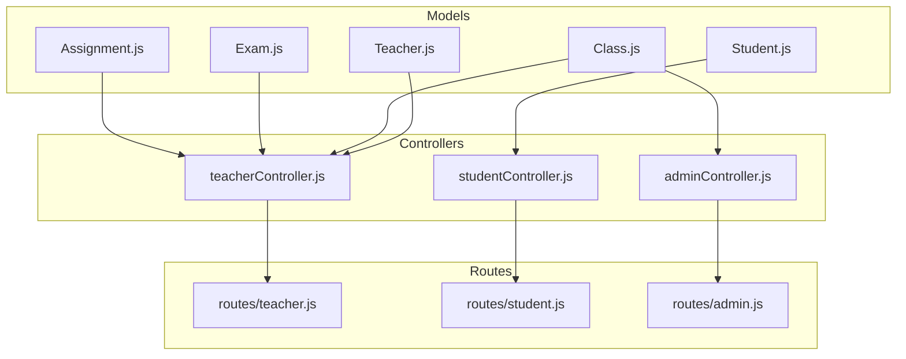
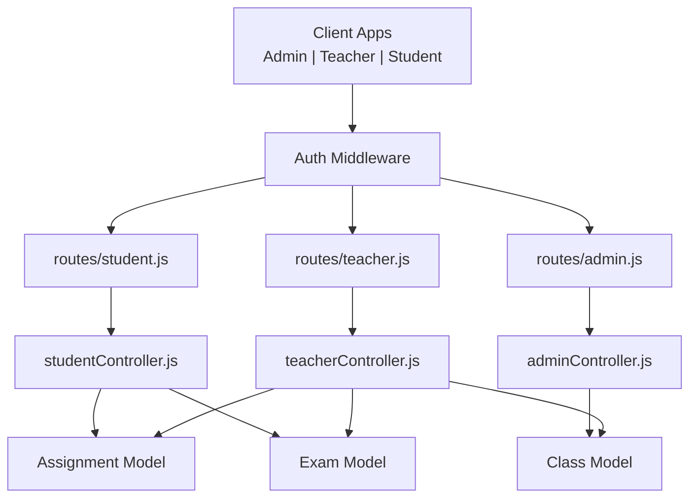
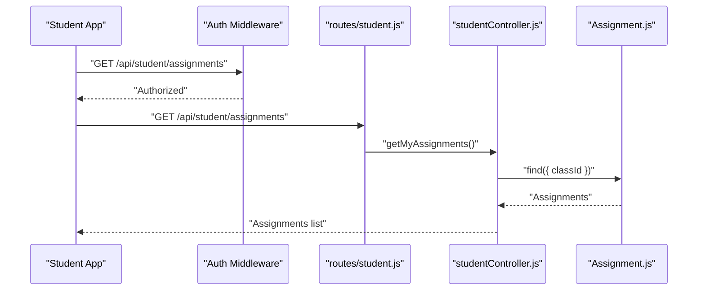
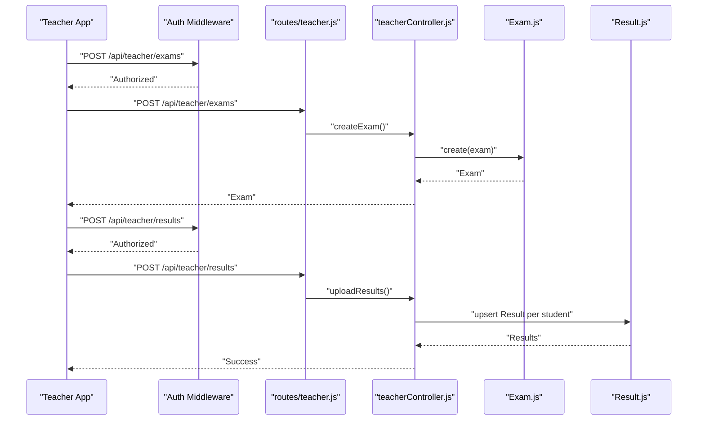
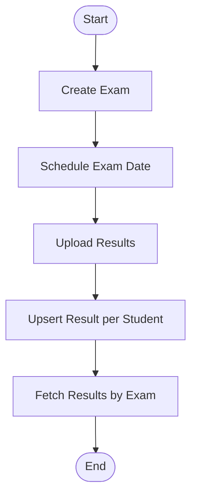
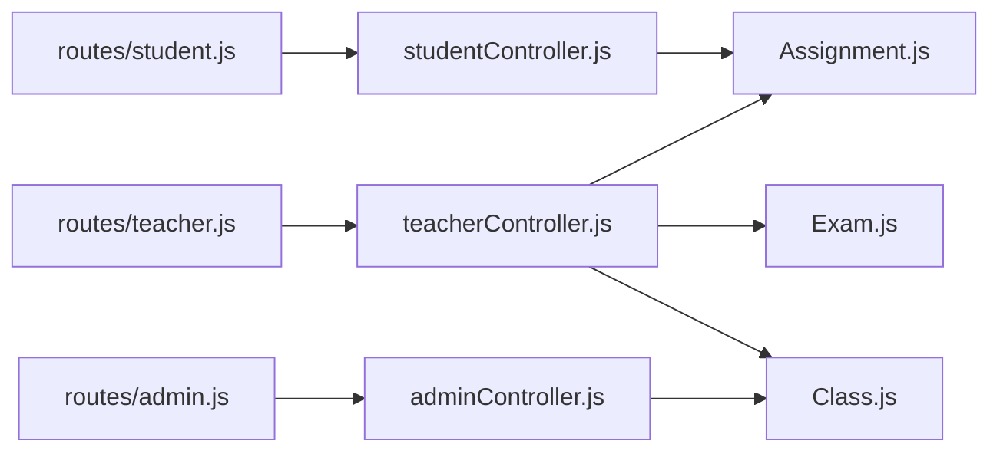

# Assignment & Assessment Models

<cite>
**Referenced Files in This Document**
- [Assignment.js](file://server/models/Assignment.js)
- [Exam.js](file://server/models/Exam.js)
- [Class.js](file://server/models/Class.js)
- [Student.js](file://server/models/Student.js)
- [Teacher.js](file://server/models/Teacher.js)
- [teacherController.js](file://server/controllers/teacherController.js)
- [studentController.js](file://server/controllers/studentController.js)
- [adminController.js](file://server/controllers/adminController.js)
- [teacher.js](file://server/routes/teacher.js)
- [student.js](file://server/routes/student.js)
- [admin.js](file://server/routes/admin.js)
</cite>

## Table of Contents
1. [Introduction](#introduction)
2. [Project Structure](#project-structure)
3. [Core Components](#core-components)
4. [Architecture Overview](#architecture-overview)
5. [Detailed Component Analysis](#detailed-component-analysis)
6. [Dependency Analysis](#dependency-analysis)
7. [Performance Considerations](#performance-considerations)
8. [Troubleshooting Guide](#troubleshooting-guide)
9. [Conclusion](#conclusion)
10. [Appendices](#appendices)

## Introduction
This document provides detailed data model documentation for the Assignment and Exam models used in assessment management. It explains how assignments are created and distributed to classes, how submissions are tracked conceptually, how exams are scheduled and administered, and how results are processed. It also documents the relationships among assignments, exams, classes, and subjects, and outlines workflows for assignment distribution, exam administration, and assessment result processing.

## Project Structure
The assessment domain spans several models and controllers:
- Models define the persistent entities and their attributes.
- Controllers implement the business logic for creating, retrieving, and managing assessments.
- Routes expose endpoints for teachers, students, and administrators.



**Diagram sources**
- [Assignment.js:1-15](file://server/models/Assignment.js#L1-L15)
- [Exam.js:1-13](file://server/models/Exam.js#L1-L13)
- [Class.js:1-11](file://server/models/Class.js#L1-L11)
- [Student.js:1-16](file://server/models/Student.js#L1-L16)
- [Teacher.js:1-13](file://server/models/Teacher.js#L1-L13)
- [teacherController.js:1-181](file://server/controllers/teacherController.js#L1-L181)
- [studentController.js:1-85](file://server/controllers/studentController.js#L1-L85)
- [adminController.js:1-158](file://server/controllers/adminController.js#L1-L158)
- [teacher.js:1-20](file://server/routes/teacher.js#L1-L20)
- [student.js:1-14](file://server/routes/student.js#L1-L14)
- [admin.js:1-20](file://server/routes/admin.js#L1-L20)

**Section sources**
- [Assignment.js:1-15](file://server/models/Assignment.js#L1-L15)
- [Exam.js:1-13](file://server/models/Exam.js#L1-L13)
- [Class.js:1-11](file://server/models/Class.js#L1-L11)
- [Student.js:1-16](file://server/models/Student.js#L1-L16)
- [Teacher.js:1-13](file://server/models/Teacher.js#L1-L13)
- [teacherController.js:1-181](file://server/controllers/teacherController.js#L1-L181)
- [studentController.js:1-85](file://server/controllers/studentController.js#L1-L85)
- [adminController.js:1-158](file://server/controllers/adminController.js#L1-L158)
- [teacher.js:1-20](file://server/routes/teacher.js#L1-L20)
- [student.js:1-14](file://server/routes/student.js#L1-L14)
- [admin.js:1-20](file://server/routes/admin.js#L1-L20)

## Core Components
This section documents the Assignment and Exam models, their attributes, and how they relate to classes and subjects.

- Assignment model
  - Purpose: Represents an assignment given by a teacher to a class for a specific subject.
  - Key attributes:
    - title: Required string.
    - description: Required string.
    - classId: Required ObjectId referencing Class.
    - subject: Required string.
    - teacherId: Required ObjectId referencing Teacher.
    - dueDate: Required Date.
    - totalMarks: Number with default value.
    - attachments: Array of strings for optional file links.
  - Timestamps: Created and updated timestamps are automatically maintained.

- Exam model
  - Purpose: Represents an exam scheduled for a class and subject.
  - Key attributes:
    - name: Required string (e.g., Mid Term, Final).
    - classId: Required ObjectId referencing Class.
    - subject: Required string.
    - date: Required Date.
    - totalMarks: Number with default value.
    - passMarks: Number with default value.

- Class model
  - Purpose: Defines academic classes with sections and academic year.
  - Key attributes:
    - name: Required string.
    - section: Required string.
    - teacherId: Optional ObjectId referencing Teacher (class teacher).
    - academicYear: String with default value.

- Student and Teacher models
  - Student model includes userId, classId, rollNumber, and personal details.
  - Teacher model includes userId, subject, qualification, experience, joinDate, and salary.

These models form the foundation for assignment distribution, exam scheduling, and result processing workflows.

**Section sources**
- [Assignment.js:1-15](file://server/models/Assignment.js#L1-L15)
- [Exam.js:1-13](file://server/models/Exam.js#L1-L13)
- [Class.js:1-11](file://server/models/Class.js#L1-L11)
- [Student.js:1-16](file://server/models/Student.js#L1-L16)
- [Teacher.js:1-13](file://server/models/Teacher.js#L1-L13)

## Architecture Overview
The assessment system follows a layered architecture:
- Model layer defines entities and relationships.
- Controller layer implements business logic for assessments.
- Route layer exposes REST endpoints with role-based authorization.



**Diagram sources**
- [teacher.js:1-20](file://server/routes/teacher.js#L1-L20)
- [student.js:1-14](file://server/routes/student.js#L1-L14)
- [admin.js:1-20](file://server/routes/admin.js#L1-L20)
- [teacherController.js:1-181](file://server/controllers/teacherController.js#L1-L181)
- [studentController.js:1-85](file://server/controllers/studentController.js#L1-L85)
- [adminController.js:1-158](file://server/controllers/adminController.js#L1-L158)
- [Assignment.js:1-15](file://server/models/Assignment.js#L1-L15)
- [Exam.js:1-13](file://server/models/Exam.js#L1-L13)
- [Class.js:1-11](file://server/models/Class.js#L1-L11)

## Detailed Component Analysis

### Assignment Model and Workflows
- Creation and distribution
  - Teachers create assignments via a dedicated endpoint. The controller associates the logged-in teacher’s ID with the assignment and persists it to the Assignment model.
  - Students retrieve assignments for their class via a GET endpoint that sorts by dueDate.

- Deadlines and submission formats
  - The dueDate field enforces deadline tracking.
  - The attachments array supports optional file submissions (e.g., PDFs, images).

- Relationship to classes and subjects
  - Assignments are scoped to a class and a subject, enabling targeted distribution.



**Diagram sources**
- [student.js:9-9](file://server/routes/student.js#L9-L9)
- [studentController.js:55-64](file://server/controllers/studentController.js#L55-L64)
- [Assignment.js:1-15](file://server/models/Assignment.js#L1-L15)

**Section sources**
- [teacherController.js:131-149](file://server/controllers/teacherController.js#L131-L149)
- [studentController.js:55-64](file://server/controllers/studentController.js#L55-L64)
- [Assignment.js:1-15](file://server/models/Assignment.js#L1-L15)

### Exam Model and Workflows
- Scheduling and administration
  - Teachers create exams with name, classId, subject, date, totalMarks, and passMarks.
  - Exams are retrieved per class for administrative oversight.

- Result processing
  - Teachers upload results for an exam. The controller updates or creates Result documents per student, storing marks, optional grade, and remarks.
  - Authorized users can fetch results for a specific exam, with population of student identifiers.



**Diagram sources**
- [teacher.js:9-12](file://server/routes/teacher.js#L9-L12)
- [teacherController.js:77-128](file://server/controllers/teacherController.js#L77-L128)
- [Exam.js:1-13](file://server/models/Exam.js#L1-L13)

**Section sources**
- [teacherController.js:77-128](file://server/controllers/teacherController.js#L77-L128)
- [teacher.js:9-12](file://server/routes/teacher.js#L9-L12)

### Data Model Relationships
The Assignment and Exam models integrate with Class and Teacher to establish relationships:
- Assignments are linked to a Class and a Teacher, and scoped to a Subject.
- Exams are linked to a Class and a Subject, and include total and passing marks.
- Students are associated with a Class and a User account.

```mermaid
erDiagram
CLASS {
ObjectId _id PK
string name
string section
ObjectId teacherId
string academicYear
}
TEACHER {
ObjectId _id PK
ObjectId userId
string subject
string qualification
number experience
date joinDate
number salary
}
ASSIGNMENT {
ObjectId _id PK
string title
string description
ObjectId classId FK
string subject
ObjectId teacherId FK
date dueDate
number totalMarks
}
EXAM {
ObjectId _id PK
string name
ObjectId classId FK
string subject
date date
number totalMarks
number passMarks
}
STUDENT {
ObjectId _id PK
ObjectId userId
ObjectId classId FK
string rollNumber
date admissionDate
}
TEACHER ||--o{ ASSIGNMENT : "creates"
CLASS ||--o{ ASSIGNMENT : "hosts"
CLASS ||--o{ EXAM : "hosts"
STUDENT }o--|| CLASS : "enrolled_in"
```

**Diagram sources**
- [Assignment.js:1-15](file://server/models/Assignment.js#L1-L15)
- [Exam.js:1-13](file://server/models/Exam.js#L1-L13)
- [Class.js:1-11](file://server/models/Class.js#L1-L11)
- [Student.js:1-16](file://server/models/Student.js#L1-L16)
- [Teacher.js:1-13](file://server/models/Teacher.js#L1-L13)

**Section sources**
- [Assignment.js:1-15](file://server/models/Assignment.js#L1-L15)
- [Exam.js:1-13](file://server/models/Exam.js#L1-L13)
- [Class.js:1-11](file://server/models/Class.js#L1-L11)
- [Student.js:1-16](file://server/models/Student.js#L1-L16)
- [Teacher.js:1-13](file://server/models/Teacher.js#L1-L13)

### Example Workflows

- Assignment distribution
  - A teacher creates an assignment specifying classId, subject, dueDate, and optional attachments.
  - Students in that class can retrieve the assignment list sorted by dueDate.

- Exam administration
  - A teacher schedules an exam with name, classId, subject, and date.
  - The teacher uploads results for the exam, updating or creating Result entries per student.

- Assessment result processing
  - Authorized users fetch results for a specific exam, with student roll numbers and names populated.



**Diagram sources**
- [teacherController.js:77-128](file://server/controllers/teacherController.js#L77-L128)

**Section sources**
- [teacherController.js:77-128](file://server/controllers/teacherController.js#L77-L128)

## Dependency Analysis
- Controllers depend on models to persist and retrieve data.
- Routes depend on controllers to handle requests.
- Authorization middleware ensures role-based access to endpoints.



**Diagram sources**
- [teacher.js:1-20](file://server/routes/teacher.js#L1-L20)
- [student.js:1-14](file://server/routes/student.js#L1-L14)
- [admin.js:1-20](file://server/routes/admin.js#L1-L20)
- [teacherController.js:1-181](file://server/controllers/teacherController.js#L1-L181)
- [studentController.js:1-85](file://server/controllers/studentController.js#L1-L85)
- [adminController.js:1-158](file://server/controllers/adminController.js#L1-L158)
- [Assignment.js:1-15](file://server/models/Assignment.js#L1-L15)
- [Exam.js:1-13](file://server/models/Exam.js#L1-L13)
- [Class.js:1-11](file://server/models/Class.js#L1-L11)

**Section sources**
- [teacher.js:1-20](file://server/routes/teacher.js#L1-L20)
- [student.js:1-14](file://server/routes/student.js#L1-L14)
- [admin.js:1-20](file://server/routes/admin.js#L1-L20)
- [teacherController.js:1-181](file://server/controllers/teacherController.js#L1-L181)
- [studentController.js:1-85](file://server/controllers/studentController.js#L1-L85)
- [adminController.js:1-158](file://server/controllers/adminController.js#L1-L158)

## Performance Considerations
- Indexing recommendations:
  - Add indexes on Assignment.classId, Assignment.teacherId, Assignment.dueDate, Exam.classId, Exam.date, and Result.examId for efficient querying.
- Pagination:
  - Use pagination for listing assignments and results to avoid large payloads.
- Population:
  - Limit populated fields to reduce payload sizes when listing assignments or results.

## Troubleshooting Guide
- Common errors and resolutions:
  - Teacher profile not found: Ensure the logged-in user has a Teacher profile before creating assignments or exams.
  - Student profile not found: Ensure the logged-in user has a Student profile before accessing assignments or results.
  - Exam not found: Verify the examId passed during result upload is valid.
  - Unauthorized access: Confirm role-based authorization middleware allows access to endpoints.

**Section sources**
- [teacherController.js:133-135](file://server/controllers/teacherController.js#L133-L135)
- [studentController.js:12-13](file://server/controllers/studentController.js#L12-L13)
- [teacherController.js:98-99](file://server/controllers/teacherController.js#L98-L99)

## Conclusion
The Assignment and Exam models provide a solid foundation for assessment management. They integrate with Class and Teacher to enable targeted assignment distribution and exam scheduling, and with Student for result retrieval. The controllers and routes implement clear workflows for creating, distributing, and evaluating assessments while enforcing role-based access.

## Appendices
- Endpoint summaries
  - Teacher endpoints:
    - POST /api/teacher/assignments
    - GET /api/teacher/assignments/:classId
    - DELETE /api/teacher/assignments/:id
    - POST /api/teacher/exams
    - GET /api/teacher/exams/:classId
    - POST /api/teacher/results
    - GET /api/teacher/results/:examId
  - Student endpoints:
    - GET /api/student/assignments
  - Admin endpoints:
    - GET /api/admin/classes
    - POST /api/admin/classes
    - PUT /api/admin/classes/:id
    - DELETE /api/admin/classes/:id
    - GET /api/admin/classes/:id/students
    - PUT /api/admin/classes/:id/assign-teacher

**Section sources**
- [teacher.js:13-17](file://server/routes/teacher.js#L13-L17)
- [student.js:9-9](file://server/routes/student.js#L9-L9)
- [admin.js:12-17](file://server/routes/admin.js#L12-L17)