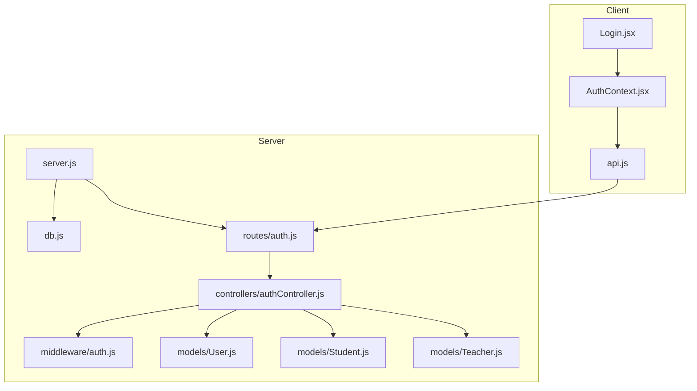
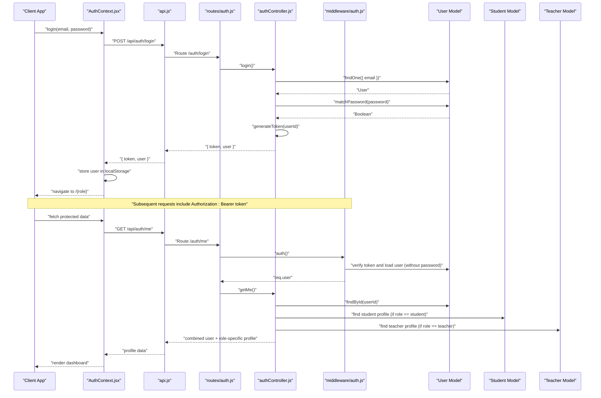
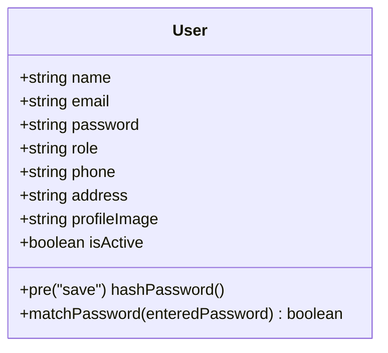
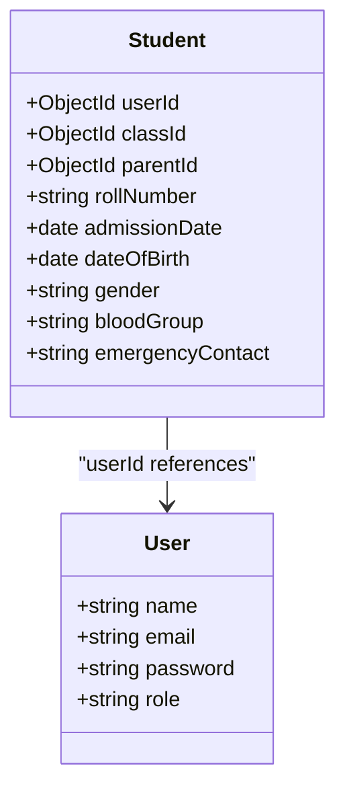
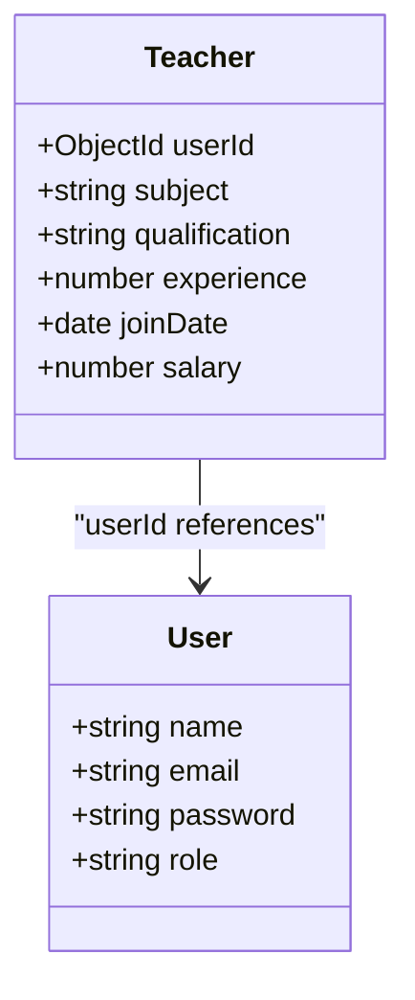
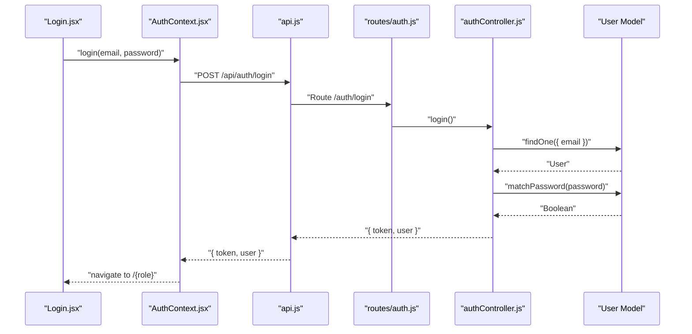
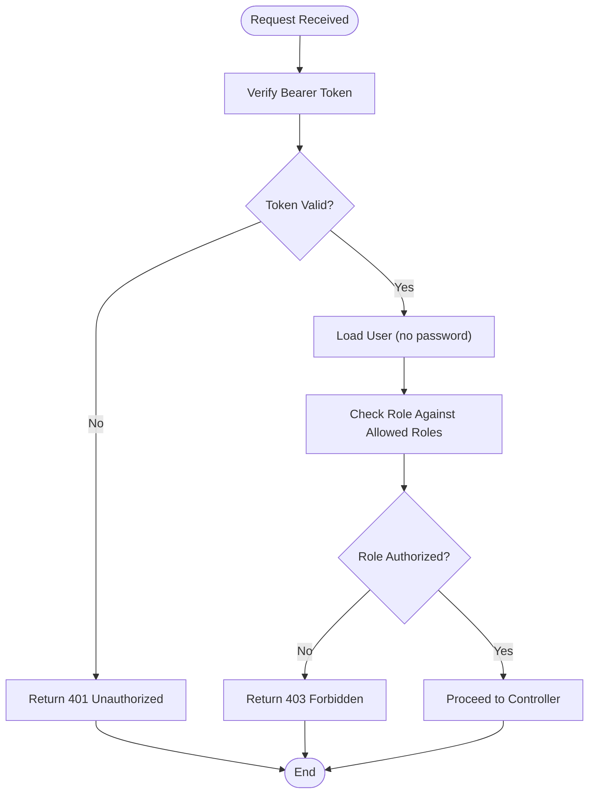
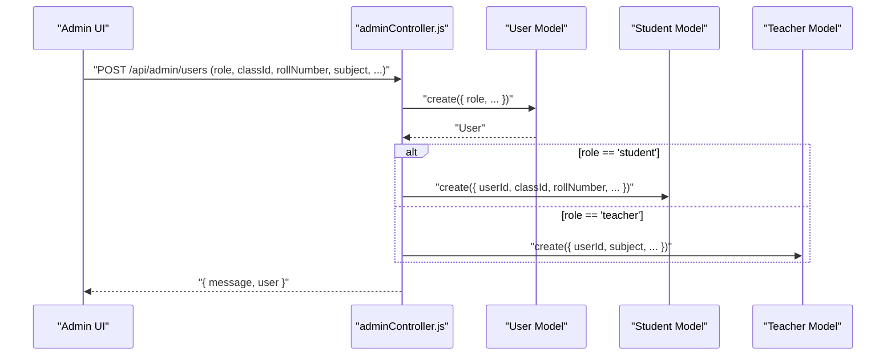
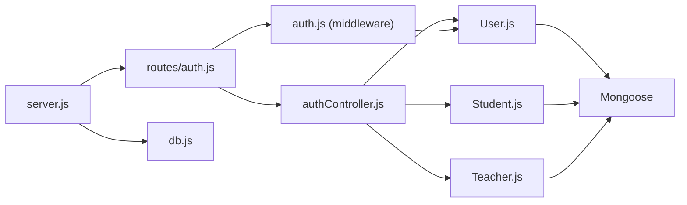

# Core Models

<cite>
**Referenced Files in This Document**
- [User.js](file://server/models/User.js)
- [Student.js](file://server/models/Student.js)
- [Teacher.js](file://server/models/Teacher.js)
- [authController.js](file://server/controllers/authController.js)
- [auth.js](file://server/middleware/auth.js)
- [auth.js](file://server/routes/auth.js)
- [AuthContext.jsx](file://client/src/context/AuthContext.jsx)
- [api.js](file://client/src/api.js)
- [Login.jsx](file://client/src/pages/auth/Login.jsx)
- [db.js](file://server/config/db.js)
- [server.js](file://server/server.js)
- [adminController.js](file://server/controllers/adminController.js)
</cite>

## Table of Contents
1. [Introduction](#introduction)
2. [Project Structure](#project-structure)
3. [Core Components](#core-components)
4. [Architecture Overview](#architecture-overview)
5. [Detailed Component Analysis](#detailed-component-analysis)
6. [Dependency Analysis](#dependency-analysis)
7. [Performance Considerations](#performance-considerations)
8. [Troubleshooting Guide](#troubleshooting-guide)
9. [Conclusion](#conclusion)

## Introduction
This document provides comprehensive data model documentation for the core User, Student, and Teacher models in the school management system. It explains the User base model with authentication fields, how Student and Teacher inherit from User, field definitions, validation rules, password hashing mechanisms, and role-based access patterns. It also documents the polymorphic relationship structure and demonstrates user creation, authentication workflows, and role-specific data access patterns.

## Project Structure
The system follows a layered architecture with clear separation between client-side React components and server-side Node.js/Express backend. Authentication is handled via JWT tokens, and user roles drive access control across routes.

**Diagram sources**
- [server.js:1-38](file://server/server.js#L1-L38)
- [db.js:1-14](file://server/config/db.js#L1-L14)
- [auth.js:1-13](file://server/routes/auth.js#L1-L13)
- [authController.js:1-107](file://server/controllers/authController.js#L1-L107)
- [auth.js:1-31](file://server/middleware/auth.js#L1-L31)
- [User.js:1-27](file://server/models/User.js#L1-L27)
- [Student.js:1-16](file://server/models/Student.js#L1-L16)
- [Teacher.js:1-13](file://server/models/Teacher.js#L1-L13)
- [AuthContext.jsx:1-53](file://client/src/context/AuthContext.jsx#L1-L53)
- [api.js:1-28](file://client/src/api.js#L1-L28)
- [Login.jsx:1-100](file://client/src/pages/auth/Login.jsx#L1-L100)

**Section sources**
- [server.js:1-38](file://server/server.js#L1-L38)
- [db.js:1-14](file://server/config/db.js#L1-L14)
- [auth.js:1-13](file://server/routes/auth.js#L1-L13)
- [authController.js:1-107](file://server/controllers/authController.js#L1-L107)
- [auth.js:1-31](file://server/middleware/auth.js#L1-L31)
- [User.js:1-27](file://server/models/User.js#L1-L27)
- [Student.js:1-16](file://server/models/Student.js#L1-L16)
- [Teacher.js:1-13](file://server/models/Teacher.js#L1-L13)
- [AuthContext.jsx:1-53](file://client/src/context/AuthContext.jsx#L1-L53)
- [api.js:1-28](file://client/src/api.js#L1-L28)
- [Login.jsx:1-100](file://client/src/pages/auth/Login.jsx#L1-L100)

## Core Components
This section documents the three core models and their relationships.

- User Model
  - Purpose: Base model for all users with authentication fields and shared attributes.
  - Fields:
    - name: String, required, trimmed
    - email: String, required, unique, lowercase
    - password: String, required, minimum length 6
    - role: Enum ['admin', 'teacher', 'student', 'parent'], required
    - phone: String, default empty
    - address: String, default empty
    - profileImage: String, default empty
    - isActive: Boolean, default true
  - Validation:
    - Unique email constraint enforced at the database level.
    - Password minimum length enforced at the model level.
    - Role enum enforced at the model level.
  - Security:
    - Password hashing via bcrypt before save using a pre-save hook.
    - Password comparison method exposed via matchPassword.
  - Timestamps: createdAt, updatedAt managed automatically.

- Student Model
  - Purpose: Extends User with student-specific attributes and relationships.
  - Relationship: One-to-one with User via userId (ObjectId referencing User).
  - Fields:
    - userId: ObjectId, required, references User
    - classId: ObjectId, required, references Class
    - parentId: ObjectId, optional, references User (parent)
    - rollNumber: String, required, unique
    - admissionDate: Date, default current date
    - dateOfBirth: Date
    - gender: Enum ['Male', 'Female', 'Other']
    - bloodGroup: String, default empty
    - emergencyContact: String, default empty
  - Validation:
    - Unique rollNumber enforced at the database level.
    - Required fields enforced at the model level.
  - Timestamps: createdAt, updatedAt managed automatically.

- Teacher Model
  - Purpose: Extends User with teacher-specific attributes and relationships.
  - Relationship: One-to-one with User via userId (ObjectId referencing User).
  - Fields:
    - userId: ObjectId, required, references User
    - subject: String, required
    - qualification: String, default empty
    - experience: Number, default 0
    - joinDate: Date, default current date
    - salary: Number, default 0
  - Validation:
    - Required fields enforced at the model level.
  - Timestamps: createdAt, updatedAt managed automatically.

Key Implementation Notes:
- Polymorphic-like structure: Student and Teacher both reference the User model via userId, enabling role-specific profiles while sharing base authentication and personal data.
- Role-based access control: The role field determines access to routes and features in the backend and UI.
- Password handling: Hashing occurs automatically during User creation/update, and password verification uses bcrypt compare.

**Section sources**
- [User.js:1-27](file://server/models/User.js#L1-L27)
- [Student.js:1-16](file://server/models/Student.js#L1-L16)
- [Teacher.js:1-13](file://server/models/Teacher.js#L1-L13)

## Architecture Overview
The authentication and role-based access architecture integrates client-side React components with server-side controllers and middleware.

**Diagram sources**
- [AuthContext.jsx:1-53](file://client/src/context/AuthContext.jsx#L1-L53)
- [api.js:1-28](file://client/src/api.js#L1-L28)
- [auth.js:1-13](file://server/routes/auth.js#L1-L13)
- [authController.js:1-107](file://server/controllers/authController.js#L1-L107)
- [auth.js:1-31](file://server/middleware/auth.js#L1-L31)
- [User.js:1-27](file://server/models/User.js#L1-L27)
- [Student.js:1-16](file://server/models/Student.js#L1-L16)
- [Teacher.js:1-13](file://server/models/Teacher.js#L1-L13)

## Detailed Component Analysis

### User Model
- Data Schema
  - name: String, required, trimmed
  - email: String, required, unique, lowercase
  - password: String, required, minimum length 6
  - role: Enum ['admin', 'teacher', 'student', 'parent'], required
  - phone: String, default empty
  - address: String, default empty
  - profileImage: String, default empty
  - isActive: Boolean, default true
- Validation Rules
  - Unique email enforced at the database level.
  - Minimum password length enforced at the model level.
  - Role enum enforced at the model level.
- Password Hashing
  - Pre-save hook generates salt and hashes password before saving.
  - matchPassword method compares entered password with stored hash.
- Access Patterns
  - Used as the base for role-specific profiles (Student, Teacher).
  - Role field drives middleware authorization checks.

**Diagram sources**
- [User.js:1-27](file://server/models/User.js#L1-L27)

**Section sources**
- [User.js:1-27](file://server/models/User.js#L1-L27)

### Student Model
- Relationship to User
  - One-to-one via userId referencing User.
- Additional Fields
  - classId: ObjectId, required, references Class
  - parentId: ObjectId, optional, references User (parent)
  - rollNumber: String, required, unique
  - admissionDate: Date, default current date
  - dateOfBirth: Date
  - gender: Enum ['Male', 'Female', 'Other']
  - bloodGroup: String, default empty
  - emergencyContact: String, default empty
- Validation Rules
  - Unique rollNumber enforced at the database level.
  - Required fields enforced at the model level.
- Role-Specific Access
  - Students can access dashboards and views relevant to their class and parent/guardian information.

**Diagram sources**
- [Student.js:1-16](file://server/models/Student.js#L1-L16)
- [User.js:1-27](file://server/models/User.js#L1-L27)

**Section sources**
- [Student.js:1-16](file://server/models/Student.js#L1-L16)

### Teacher Model
- Relationship to User
  - One-to-one via userId referencing User.
- Additional Fields
  - subject: String, required
  - qualification: String, default empty
  - experience: Number, default 0
  - joinDate: Date, default current date
  - salary: Number, default 0
- Validation Rules
  - Required fields enforced at the model level.
- Role-Specific Access
  - Teachers can manage attendance, exams, and class-related activities.

**Diagram sources**
- [Teacher.js:1-13](file://server/models/Teacher.js#L1-L13)
- [User.js:1-27](file://server/models/User.js#L1-L27)

**Section sources**
- [Teacher.js:1-13](file://server/models/Teacher.js#L1-L13)

### Authentication Workflow
- Registration
  - Client sends name, email, password, role, phone, address.
  - Backend checks for existing email, creates User, generates JWT token, returns user and token.
- Login
  - Client sends email and password.
  - Backend verifies credentials, checks isActive flag, generates JWT token, returns user and token.
- Profile Retrieval
  - Client sends Bearer token.
  - Backend decodes token, loads user without password, enriches with role-specific profile (student or teacher), returns combined profile.
- Password Change
  - Client sends currentPassword and newPassword.
  - Backend verifies current password, updates User.password, saves, returns success message.

**Diagram sources**
- [Login.jsx:1-100](file://client/src/pages/auth/Login.jsx#L1-L100)
- [AuthContext.jsx:1-53](file://client/src/context/AuthContext.jsx#L1-L53)
- [api.js:1-28](file://client/src/api.js#L1-L28)
- [auth.js:1-13](file://server/routes/auth.js#L1-L13)
- [authController.js:1-107](file://server/controllers/authController.js#L1-L107)
- [User.js:1-27](file://server/models/User.js#L1-L27)

**Section sources**
- [authController.js:1-107](file://server/controllers/authController.js#L1-L107)
- [auth.js:1-31](file://server/middleware/auth.js#L1-L31)
- [Login.jsx:1-100](file://client/src/pages/auth/Login.jsx#L1-L100)
- [AuthContext.jsx:1-53](file://client/src/context/AuthContext.jsx#L1-L53)
- [api.js:1-28](file://client/src/api.js#L1-L28)

### Role-Based Access Patterns
- Middleware Authorization
  - authorize(...roles): Checks if req.user.role is included in allowed roles.
  - Used to protect admin, teacher, and student routes.
- Route Protection Example
  - GET /api/admin/classes requires admin role.
  - GET /api/teacher/classes requires teacher role.
  - GET /api/student/dashboard requires student role.
- Client Navigation
  - After login, client navigates to /{role} based on user role.

**Diagram sources**
- [auth.js:1-31](file://server/middleware/auth.js#L1-L31)

**Section sources**
- [auth.js:1-31](file://server/middleware/auth.js#L1-L31)

### User Creation and Role-Specific Profiles
- Admin Controller Integration
  - On user creation, admin controller creates either a Student or Teacher profile depending on role.
  - Updates user fields and returns success response.
- Data Flow
  - Admin registers a new user (role, classId, rollNumber, subject, etc.).
  - Backend creates User and corresponding Student or Teacher profile.
  - Subsequent getMe returns combined user + role-specific profile.

**Diagram sources**
- [adminController.js:62-86](file://server/controllers/adminController.js#L62-L86)
- [User.js:1-27](file://server/models/User.js#L1-L27)
- [Student.js:1-16](file://server/models/Student.js#L1-L16)
- [Teacher.js:1-13](file://server/models/Teacher.js#L1-L13)

**Section sources**
- [adminController.js:62-86](file://server/controllers/adminController.js#L62-L86)

## Dependency Analysis
The core models and controllers depend on Mongoose for schema definitions and MongoDB for persistence. Authentication relies on JWT and bcrypt for secure token generation and password hashing.

**Diagram sources**
- [User.js:1-27](file://server/models/User.js#L1-L27)
- [Student.js:1-16](file://server/models/Student.js#L1-L16)
- [Teacher.js:1-13](file://server/models/Teacher.js#L1-L13)
- [authController.js:1-107](file://server/controllers/authController.js#L1-L107)
- [auth.js:1-31](file://server/middleware/auth.js#L1-L31)
- [auth.js:1-13](file://server/routes/auth.js#L1-L13)
- [server.js:1-38](file://server/server.js#L1-L38)
- [db.js:1-14](file://server/config/db.js#L1-L14)

**Section sources**
- [User.js:1-27](file://server/models/User.js#L1-L27)
- [Student.js:1-16](file://server/models/Student.js#L1-L16)
- [Teacher.js:1-13](file://server/models/Teacher.js#L1-L13)
- [authController.js:1-107](file://server/controllers/authController.js#L1-L107)
- [auth.js:1-31](file://server/middleware/auth.js#L1-L31)
- [auth.js:1-13](file://server/routes/auth.js#L1-L13)
- [server.js:1-38](file://server/server.js#L1-L38)
- [db.js:1-14](file://server/config/db.js#L1-L14)

## Performance Considerations
- Password Hashing Cost: The bcrypt salt rounds are set to a moderate value suitable for development. For production, consider tuning based on hardware capabilities and security requirements.
- Indexing: Ensure unique indexes exist for email and rollNumber to optimize lookups.
- Token Expiration: Configure JWT expiration appropriately to balance security and user experience.
- Population: When retrieving user profiles, limit populated fields to reduce payload size.

## Troubleshooting Guide
- Authentication Failures
  - Invalid credentials: Occurs when email not found or password mismatch.
  - Account deactivated: isActive flag prevents login.
  - Missing or invalid Bearer token: Authorization middleware returns 401.
- Role Access Issues
  - 403 Forbidden indicates the user's role is not authorized for the requested route.
- Client-Side
  - API interceptor clears local storage on 401, redirecting to login page.
  - Demo accounts are available for testing different roles.

**Section sources**
- [authController.js:31-59](file://server/controllers/authController.js#L31-L59)
- [auth.js:4-19](file://server/middleware/auth.js#L4-L19)
- [api.js:16-25](file://client/src/api.js#L16-L25)

## Conclusion
The User, Student, and Teacher models form a robust foundation for the school management system. The User model encapsulates shared authentication and personal data, while Student and Teacher extend it with role-specific attributes. The system enforces strong validation, secure password handling, and role-based access control. The authentication workflow integrates seamlessly across client and server, enabling secure and efficient role-specific data access patterns.