# Database Schema

<cite>
**Referenced Files in This Document**
- [User.js](file://server/models/User.js)
- [Student.js](file://server/models/Student.js)
- [Teacher.js](file://server/models/Teacher.js)
- [Class.js](file://server/models/Class.js)
- [Attendance.js](file://server/models/Attendance.js)
- [Result.js](file://server/models/Result.js)
- [Fee.js](file://server/models/Fee.js)
- [Notice.js](file://server/models/Notice.js)
- [Message.js](file://server/models/Message.js)
- [Timetable.js](file://server/models/Timetable.js)
- [Assignment.js](file://server/models/Assignment.js)
- [Exam.js](file://server/models/Exam.js)
- [db.js](file://server/config/db.js)
- [seed.js](file://server/seed.js)
</cite>

## Table of Contents
1. [Introduction](#introduction)
2. [Project Structure](#project-structure)
3. [Core Components](#core-components)
4. [Architecture Overview](#architecture-overview)
5. [Detailed Component Analysis](#detailed-component-analysis)
6. [Dependency Analysis](#dependency-analysis)
7. [Performance Considerations](#performance-considerations)
8. [Troubleshooting Guide](#troubleshooting-guide)
9. [Conclusion](#conclusion)
10. [Appendices](#appendices)

## Introduction
This document provides comprehensive data model documentation for the Educational Management System. It details entity relationships, field definitions, data types, constraints, and business logic for the core models: User, Student, Teacher, Class, Attendance, Result, Fee, Notice, Message, Timetable, and Assignment. It also covers indexes, validation rules, normalization strategies, and performance considerations derived from the schema definitions and seed data.

## Project Structure
The database models are implemented using Mongoose ODM on top of MongoDB. Each model file defines a Mongoose schema with validation rules, indexes, and relationships to other models. The database connection is configured centrally and used across the application.

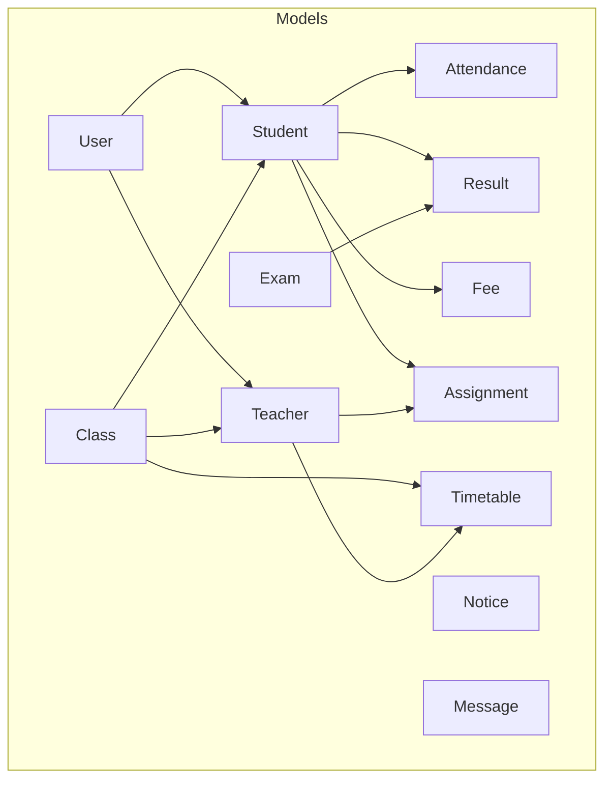

**Diagram sources**
- [User.js:4-13](file://server/models/User.js#L4-L13)
- [Student.js:3-13](file://server/models/Student.js#L3-L13)
- [Teacher.js:3-10](file://server/models/Teacher.js#L3-L10)
- [Class.js:3-8](file://server/models/Class.js#L3-L8)
- [Attendance.js:3-9](file://server/models/Attendance.js#L3-L9)
- [Result.js:3-9](file://server/models/Result.js#L3-L9)
- [Fee.js:3-14](file://server/models/Fee.js#L3-L14)
- [Notice.js:3-11](file://server/models/Notice.js#L3-L11)
- [Message.js:3-8](file://server/models/Message.js#L3-L8)
- [Timetable.js:3-13](file://server/models/Timetable.js#L3-L13)
- [Assignment.js:3-12](file://server/models/Assignment.js#L3-L12)
- [Exam.js:3-10](file://server/models/Exam.js#L3-L10)

**Section sources**
- [db.js:3-11](file://server/config/db.js#L3-L11)
- [seed.js:18-302](file://server/seed.js#L18-L302)

## Core Components
This section summarizes each model’s purpose, primary keys, foreign keys, indexes, and constraints.

- User
  - Purpose: Base identity and authentication for all system users.
  - Fields: name, email, password, role, phone, address, profileImage, isActive.
  - Constraints: email unique and lowercase; password min length; role enum; timestamps.
  - Indexes: None declared; email uniqueness enforced by schema.
  - Notes: Password hashing is handled pre-save.

- Student
  - Purpose: Stores student-specific information linked to User and Class.
  - Fields: userId (ref: User), classId (ref: Class), parentId (ref: User), rollNumber, admissionDate, dateOfBirth, gender, bloodGroup, emergencyContact.
  - Constraints: rollNumber unique; timestamps; gender enum.
  - Indexes: None declared.

- Teacher
  - Purpose: Stores teacher-specific information linked to User.
  - Fields: userId (ref: User), subject, qualification, experience, joinDate, salary.
  - Constraints: timestamps.
  - Indexes: None declared.

- Class
  - Purpose: Academic grouping with teacher assignment.
  - Fields: name, section, teacherId (ref: Teacher), academicYear.
  - Constraints: timestamps; teacherId optional.
  - Indexes: None declared.

- Attendance
  - Purpose: Daily attendance records per student.
  - Fields: studentId (ref: Student), date, status (enum), markedBy (ref: User), remarks.
  - Constraints: unique composite index on (studentId, date); timestamps; status enum.
  - Indexes: Unique compound index on (studentId, date).

- Result
  - Purpose: Student exam scores and grades.
  - Fields: studentId (ref: Student), examId (ref: Exam), marks, grade, remarks.
  - Constraints: unique composite index on (studentId, examId); timestamps.
  - Indexes: Unique compound index on (studentId, examId).

- Fee
  - Purpose: Tuition and other fee tracking per month.
  - Fields: studentId (ref: Student), amount, feeType (enum), status (enum), paidAmount, dueDate, paidDate, month, academicYear, receiptNumber.
  - Constraints: timestamps; feeType and status enums.
  - Indexes: None declared.

- Notice
  - Purpose: Announcements targeted to roles.
  - Fields: title, message, category (enum), targetRoles (array of enums), postedBy (ref: User), isPinned, attachments.
  - Constraints: timestamps; category enum; targetRoles array of enums.
  - Indexes: None declared.

- Message
  - Purpose: Private messaging between users.
  - Fields: senderId (ref: User), receiverId (ref: User), message, isRead.
  - Constraints: timestamps.
  - Indexes: None declared.

- Timetable
  - Purpose: Class schedules with periods.
  - Fields: classId (ref: Class), day (enum), periods (array of objects with subject, teacherId, startTime, endTime, room).
  - Constraints: timestamps; day enum; periods array.
  - Indexes: None declared.

- Assignment
  - Purpose: Homework assignments linked to class and teacher.
  - Fields: title, description, classId (ref: Class), subject, teacherId (ref: Teacher), dueDate, totalMarks, attachments.
  - Constraints: timestamps.
  - Indexes: None declared.

- Exam
  - Purpose: Examinations with class and subject linkage.
  - Fields: name, classId (ref: Class), subject, date, totalMarks, passMarks.
  - Constraints: timestamps.
  - Indexes: None declared.

**Section sources**
- [User.js:4-24](file://server/models/User.js#L4-L24)
- [Student.js:3-13](file://server/models/Student.js#L3-L13)
- [Teacher.js:3-10](file://server/models/Teacher.js#L3-L10)
- [Class.js:3-8](file://server/models/Class.js#L3-L8)
- [Attendance.js:3-11](file://server/models/Attendance.js#L3-L11)
- [Result.js:3-11](file://server/models/Result.js#L3-L11)
- [Fee.js:3-14](file://server/models/Fee.js#L3-L14)
- [Notice.js:3-11](file://server/models/Notice.js#L3-L11)
- [Message.js:3-8](file://server/models/Message.js#L3-L8)
- [Timetable.js:3-13](file://server/models/Timetable.js#L3-L13)
- [Assignment.js:3-12](file://server/models/Assignment.js#L3-L12)
- [Exam.js:3-10](file://server/models/Exam.js#L3-L10)

## Architecture Overview
The system follows a normalized relational-like design using embedded arrays and references in MongoDB/Mongoose. Entities are connected via ObjectId references. The seed script demonstrates creation order and interdependencies among entities.

```mermaid
erDiagram
USER {
ObjectId _id PK
string name
string email
string password
string role
string phone
string address
string profileImage
boolean isActive
timestamp createdAt
timestamp updatedAt
}
STUDENT {
ObjectId _id PK
ObjectId userId FK
ObjectId classId FK
ObjectId parentId FK
string rollNumber
date admissionDate
date dateOfBirth
string gender
string bloodGroup
string emergencyContact
timestamp createdAt
timestamp updatedAt
}
TEACHER {
ObjectId _id PK
ObjectId userId FK
string subject
string qualification
number experience
date joinDate
number salary
timestamp createdAt
timestamp updatedAt
}
CLASS {
ObjectId _id PK
string name
string section
ObjectId teacherId FK
string academicYear
timestamp createdAt
timestamp updatedAt
}
ATTENDANCE {
ObjectId _id PK
ObjectId studentId FK
date date
string status
ObjectId markedBy FK
string remarks
timestamp createdAt
timestamp updatedAt
}
EXAM {
ObjectId _id PK
string name
ObjectId classId FK
string subject
date date
number totalMarks
number passMarks
timestamp createdAt
timestamp updatedAt
}
RESULT {
ObjectId _id PK
ObjectId studentId FK
ObjectId examId FK
number marks
string grade
string remarks
timestamp createdAt
timestamp updatedAt
}
FEE {
ObjectId _id PK
ObjectId studentId FK
number amount
string feeType
string status
number paidAmount
date dueDate
date paidDate
string month
string academicYear
string receiptNumber
timestamp createdAt
timestamp updatedAt
}
NOTICE {
ObjectId _id PK
string title
string message
string category
array targetRoles
ObjectId postedBy FK
boolean isPinned
array attachments
timestamp createdAt
timestamp updatedAt
}
MESSAGE {
ObjectId _id PK
ObjectId senderId FK
ObjectId receiverId FK
string message
boolean isRead
timestamp createdAt
timestamp updatedAt
}
TIMETABLE {
ObjectId _id PK
ObjectId classId FK
string day
array periods
timestamp createdAt
timestamp updatedAt
}
ASSIGNMENT {
ObjectId _id PK
string title
string description
ObjectId classId FK
string subject
ObjectId teacherId FK
date dueDate
number totalMarks
array attachments
timestamp createdAt
timestamp updatedAt
}
USER ||--o{ STUDENT : "userId"
USER ||--o{ TEACHER : "userId"
USER ||--o{ ATTENDANCE : "markedBy"
USER ||--o{ NOTICE : "postedBy"
USER ||--o{ MESSAGE : "senderId"
USER ||--o{ MESSAGE : "receiverId"
CLASS ||--o{ STUDENT : "classId"
CLASS ||--o{ TEACHER : "teacherId"
CLASS ||--o{ TIMETABLE : "classId"
CLASS ||--o{ EXAM : "classId"
STUDENT ||--o{ ATTENDANCE : "studentId"
STUDENT ||--o{ RESULT : "studentId"
STUDENT ||--o{ FEE : "studentId"
STUDENT ||--o{ ASSIGNMENT : "classId"
TEACHER ||--o{ TIMETABLE : "teacherId"
TEACHER ||--o{ ASSIGNMENT : "teacherId"
EXAM ||--o{ RESULT : "examId"
```

**Diagram sources**
- [User.js:4-13](file://server/models/User.js#L4-L13)
- [Student.js:3-13](file://server/models/Student.js#L3-L13)
- [Teacher.js:3-10](file://server/models/Teacher.js#L3-L10)
- [Class.js:3-8](file://server/models/Class.js#L3-L8)
- [Attendance.js:3-9](file://server/models/Attendance.js#L3-L9)
- [Exam.js:3-10](file://server/models/Exam.js#L3-L10)
- [Result.js:3-9](file://server/models/Result.js#L3-L9)
- [Fee.js:3-14](file://server/models/Fee.js#L3-L14)
- [Notice.js:3-11](file://server/models/Notice.js#L3-L11)
- [Message.js:3-8](file://server/models/Message.js#L3-L8)
- [Timetable.js:3-13](file://server/models/Timetable.js#L3-L13)
- [Assignment.js:3-12](file://server/models/Assignment.js#L3-L12)

## Detailed Component Analysis

### User Model
- Purpose: Central identity and authentication.
- Validation: email unique and lowercase; password min length; role enum; timestamps.
- Security: Pre-save hook hashes passwords; helper method compares entered password with stored hash.
- Business logic: isActive flag controls account activity.

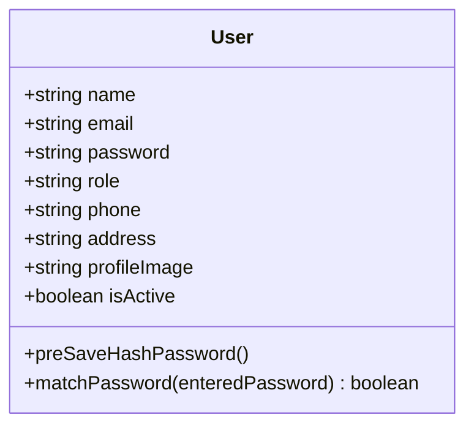

**Diagram sources**
- [User.js:4-24](file://server/models/User.js#L4-L24)

**Section sources**
- [User.js:4-24](file://server/models/User.js#L4-L24)

### Student Model
- Purpose: Student profile and enrollment.
- Validation: rollNumber unique; gender enum; timestamps.
- Relationships: userId links to User; classId links to Class; parentId links to User (optional).
- Business logic: admissionDate defaults to current date.

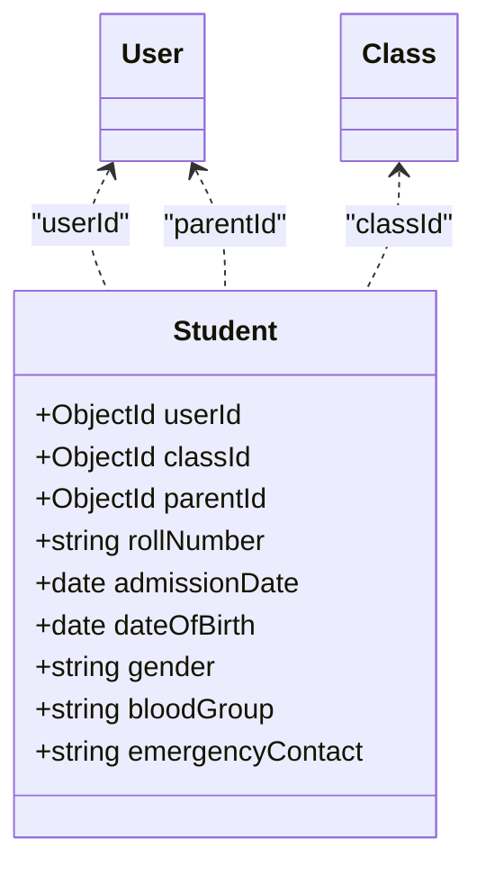

**Diagram sources**
- [Student.js:3-13](file://server/models/Student.js#L3-L13)
- [User.js:4-13](file://server/models/User.js#L4-L13)
- [Class.js:3-8](file://server/models/Class.js#L3-L8)

**Section sources**
- [Student.js:3-13](file://server/models/Student.js#L3-L13)

### Teacher Model
- Purpose: Teacher profile and employment details.
- Validation: timestamps.
- Relationships: userId links to User.
- Business logic: joinDate defaults to current date; salary and experience numeric.

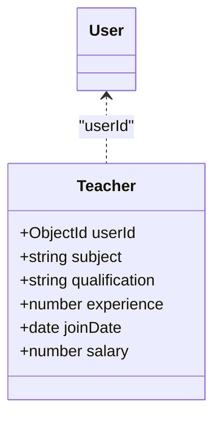

**Diagram sources**
- [Teacher.js:3-10](file://server/models/Teacher.js#L3-L10)
- [User.js:4-13](file://server/models/User.js#L4-L13)

**Section sources**
- [Teacher.js:3-10](file://server/models/Teacher.js#L3-L10)

### Class Model
- Purpose: Academic class definition and teacher assignment.
- Validation: timestamps; teacherId optional.
- Relationships: teacherId links to Teacher; used by Student and Timetable.

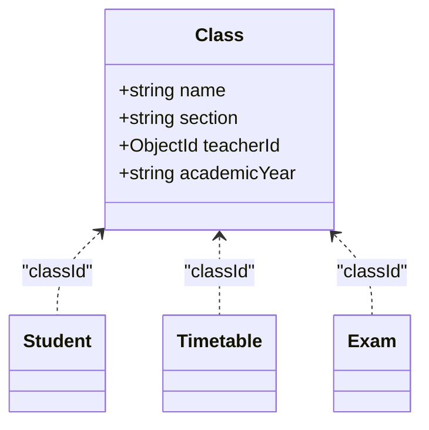

**Diagram sources**
- [Class.js:3-8](file://server/models/Class.js#L3-L8)
- [Student.js:3-13](file://server/models/Student.js#L3-L13)
- [Timetable.js:3-13](file://server/models/Timetable.js#L3-L13)
- [Exam.js:3-10](file://server/models/Exam.js#L3-L10)

**Section sources**
- [Class.js:3-8](file://server/models/Class.js#L3-L8)

### Attendance Model
- Purpose: Daily attendance tracking.
- Validation: status enum; unique composite index on (studentId, date); timestamps.
- Relationships: studentId links to Student; markedBy links to User.

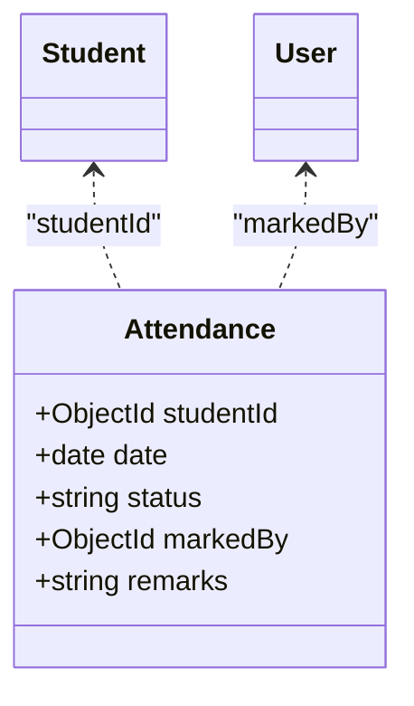

**Diagram sources**
- [Attendance.js:3-11](file://server/models/Attendance.js#L3-L11)
- [Student.js:3-13](file://server/models/Student.js#L3-L13)
- [User.js:4-13](file://server/models/User.js#L4-L13)

**Section sources**
- [Attendance.js:3-11](file://server/models/Attendance.js#L3-L11)

### Result Model
- Purpose: Student exam results.
- Validation: unique composite index on (studentId, examId); timestamps.
- Relationships: studentId links to Student; examId links to Exam.

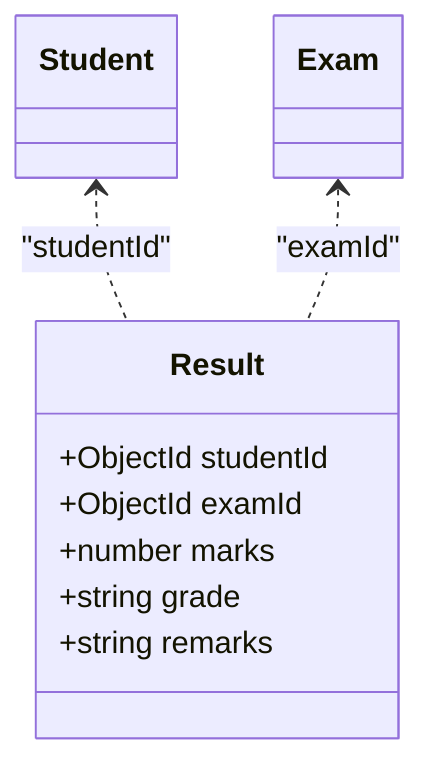

**Diagram sources**
- [Result.js:3-11](file://server/models/Result.js#L3-L11)
- [Student.js:3-13](file://server/models/Student.js#L3-L13)
- [Exam.js:3-10](file://server/models/Exam.js#L3-L10)

**Section sources**
- [Result.js:3-11](file://server/models/Result.js#L3-L11)

### Fee Model
- Purpose: Monthly fee tracking.
- Validation: feeType and status enums; timestamps.
- Relationships: studentId links to Student.

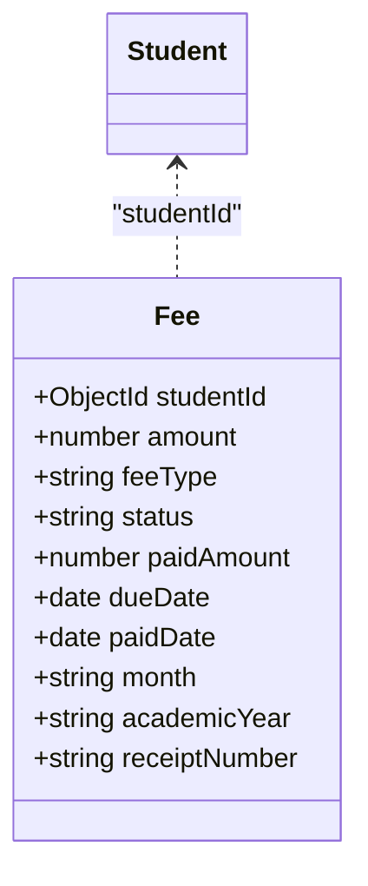

**Diagram sources**
- [Fee.js:3-14](file://server/models/Fee.js#L3-L14)
- [Student.js:3-13](file://server/models/Student.js#L3-L13)

**Section sources**
- [Fee.js:3-14](file://server/models/Fee.js#L3-L14)

### Notice Model
- Purpose: Role-targeted announcements.
- Validation: category enum; targetRoles array of enums; timestamps.
- Relationships: postedBy links to User.

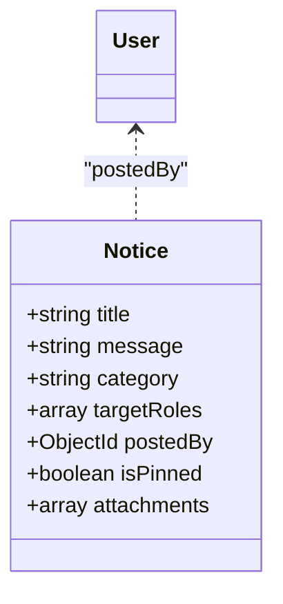

**Diagram sources**
- [Notice.js:3-11](file://server/models/Notice.js#L3-L11)
- [User.js:4-13](file://server/models/User.js#L4-L13)

**Section sources**
- [Notice.js:3-11](file://server/models/Notice.js#L3-L11)

### Message Model
- Purpose: Private messaging between users.
- Validation: timestamps.
- Relationships: senderId and receiverId link to User.

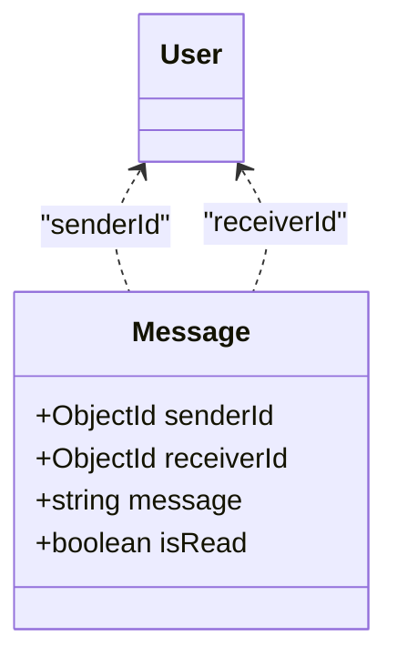

**Diagram sources**
- [Message.js:3-8](file://server/models/Message.js#L3-L8)
- [User.js:4-13](file://server/models/User.js#L4-L13)

**Section sources**
- [Message.js:3-8](file://server/models/Message.js#L3-L8)

### Timetable Model
- Purpose: Class schedule with periods.
- Validation: day enum; periods array; timestamps.
- Relationships: classId links to Class; periods.teacherId links to Teacher.

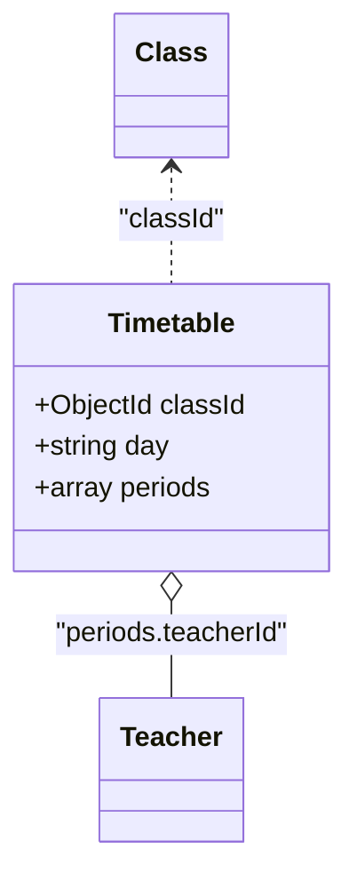

**Diagram sources**
- [Timetable.js:3-13](file://server/models/Timetable.js#L3-L13)
- [Class.js:3-8](file://server/models/Class.js#L3-L8)
- [Teacher.js:3-10](file://server/models/Teacher.js#L3-L10)

**Section sources**
- [Timetable.js:3-13](file://server/models/Timetable.js#L3-L13)

### Assignment Model
- Purpose: Homework assignments.
- Validation: timestamps.
- Relationships: classId links to Class; teacherId links to Teacher.

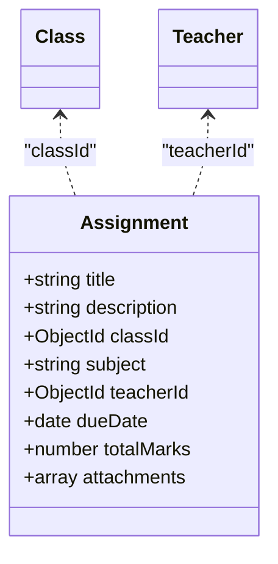

**Diagram sources**
- [Assignment.js:3-12](file://server/models/Assignment.js#L3-L12)
- [Class.js:3-8](file://server/models/Class.js#L3-L8)
- [Teacher.js:3-10](file://server/models/Teacher.js#L3-L10)

**Section sources**
- [Assignment.js:3-12](file://server/models/Assignment.js#L3-L12)

### Exam Model
- Purpose: Examinations with class and subject linkage.
- Validation: timestamps.
- Relationships: classId links to Class.

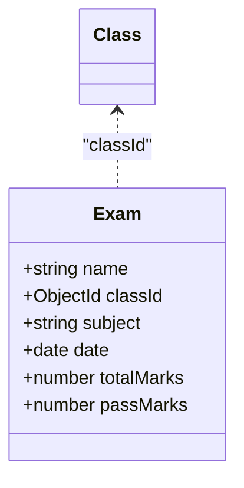

**Diagram sources**
- [Exam.js:3-10](file://server/models/Exam.js#L3-L10)
- [Class.js:3-8](file://server/models/Class.js#L3-L8)

**Section sources**
- [Exam.js:3-10](file://server/models/Exam.js#L3-L10)

## Dependency Analysis
The models form a loosely normalized schema with explicit references. The seed script demonstrates the creation order and interdependencies:
- Admin User is created first.
- Classes are created and then Teachers are created and assigned to classes.
- Parents and Students are created; Students link to Users, Classes, and Parents.
- Attendance, Exams, Results, Fees, Notices, Timetables, and Assignments are created afterward.

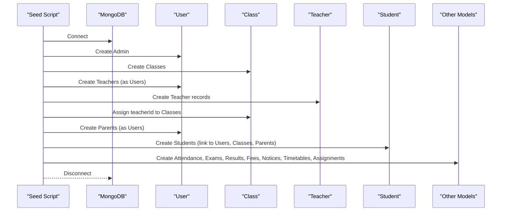

**Diagram sources**
- [seed.js:18-302](file://server/seed.js#L18-L302)

**Section sources**
- [seed.js:18-302](file://server/seed.js#L18-L302)

## Performance Considerations
- Indexes
  - Attendance: Unique compound index on (studentId, date) prevents duplicate entries per day and accelerates lookups by student/date.
  - Result: Unique compound index on (studentId, examId) ensures one score per student/exam and speeds up joins.
- Denormalization choices
  - Timetable stores periods as an array; while convenient, frequent updates to periods may require array operations. Consider separate Period collection if periods change frequently.
  - Notice.targetRoles is an array; filtering by targetRoles may benefit from an index if queries become frequent.
- Query patterns
  - Attendance and Result queries commonly filter by studentId and date/range; consider adding indexes on date if range queries increase.
  - Fee queries often filter by studentId and month; consider indexing month and studentId for performance.
- Data types
  - Numeric fields (experience, salary, marks, totalMarks, amount) are stored as numbers, enabling efficient aggregation and comparisons.
- Embedded vs referenced
  - Embedding periods in Timetable simplifies reads but complicates updates; evaluate trade-offs based on update frequency.
- Validation
  - Enum fields reduce invalid data and simplify UI selection; ensure consistent validation across controllers.

[No sources needed since this section provides general guidance]

## Troubleshooting Guide
- Authentication failures
  - Ensure password hashing occurs before save; verify pre-save hooks are executed.
  - Confirm email uniqueness and lowercase enforcement.
- Duplicate records
  - Attendance and Result enforce unique composite keys; verify inputs to avoid constraint violations.
- Reference integrity
  - Ensure ObjectId references exist before creating child documents (e.g., Student.userId must reference an existing User).
- Role-based access
  - Use User.role to gate access to endpoints; ensure controllers validate roles consistently.
- Seed data issues
  - The seed script clears collections before insertion; ensure environment variables are set and database connectivity is established.

**Section sources**
- [User.js:15-24](file://server/models/User.js#L15-L24)
- [Attendance.js:11](file://server/models/Attendance.js#L11)
- [Result.js:11](file://server/models/Result.js#L11)
- [seed.js:18-35](file://server/seed.js#L18-L35)

## Conclusion
The Educational Management System employs a clean, normalized schema with explicit references and strong validation rules. Unique composite indexes optimize critical queries, while enums ensure data consistency. The seed script illustrates realistic data creation and interdependencies. For production, consider adding indexes for common query filters (e.g., date ranges, fee month), and evaluate denormalization trade-offs for frequently updated arrays like timetable periods.

[No sources needed since this section summarizes without analyzing specific files]

## Appendices

### Sample Data Examples
The seed script creates representative datasets for demonstration and testing. Examples include:
- Admin user credentials and sample users for teacher, student, and parent roles.
- Multiple classes with teacher assignments.
- Students enrolled in various classes with roll numbers and demographics.
- Attendance entries for the last 30 days for selected students.
- Exams with subjects and dates.
- Results with randomized grades.
- Monthly fees with statuses and partial payments.
- Notices categorized by general, exam, holiday, event, and urgent.
- Timetables with daily periods and rooms.
- Assignments with due dates and total marks.

These examples illustrate typical relationships and data distributions across the system.

**Section sources**
- [seed.js:38-284](file://server/seed.js#L38-L284)