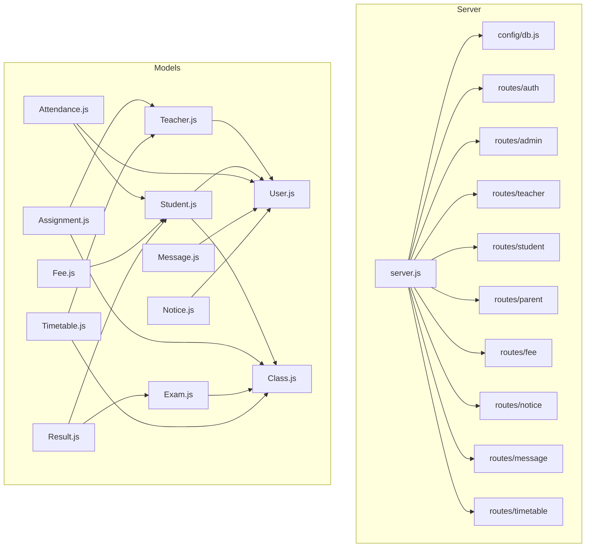
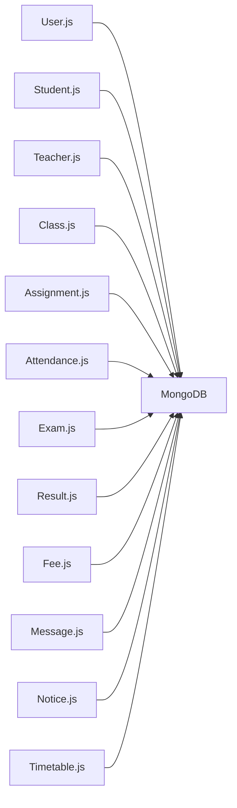
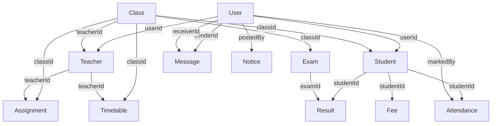

# Relationships & Constraints

<cite>
**Referenced Files in This Document**
- [db.js](file://server/config/db.js)
- [server.js](file://server/server.js)
- [seed.js](file://server/seed.js)
- [User.js](file://server/models/User.js)
- [Student.js](file://server/models/Student.js)
- [Teacher.js](file://server/models/Teacher.js)
- [Class.js](file://server/models/Class.js)
- [Assignment.js](file://server/models/Assignment.js)
- [Attendance.js](file://server/models/Attendance.js)
- [Exam.js](file://server/models/Exam.js)
- [Fee.js](file://server/models/Fee.js)
- [Message.js](file://server/models/Message.js)
- [Notice.js](file://server/models/Notice.js)
- [Result.js](file://server/models/Result.js)
- [Timetable.js](file://server/models/Timetable.js)
</cite>

## Table of Contents
1. [Introduction](#introduction)
2. [Project Structure](#project-structure)
3. [Core Components](#core-components)
4. [Architecture Overview](#architecture-overview)
5. [Detailed Component Analysis](#detailed-component-analysis)
6. [Dependency Analysis](#dependency-analysis)
7. [Performance Considerations](#performance-considerations)
8. [Troubleshooting Guide](#troubleshooting-guide)
9. [Conclusion](#conclusion)
10. [Appendices](#appendices)

## Introduction
This document explains database relationships and constraints across all models in the educational management system. It focuses on foreign keys via Mongoose ObjectId references, referential integrity rules enforced at the application level, many-to-many relationships, inheritance-like patterns, indexing strategies, and query optimization patterns. It also provides constraint examples, relationship diagrams, and best practices to maintain data consistency.

## Project Structure
The backend uses Express and Mongoose to define models and relationships. The database connection is initialized early in the server lifecycle, and routes expose CRUD APIs for resources. Seeding scripts populate the database with realistic data to validate relationships and constraints.



**Diagram sources**
- [server.js:1-38](file://server/server.js#L1-L38)
- [db.js:1-14](file://server/config/db.js#L1-L14)
- [User.js:1-27](file://server/models/User.js#L1-L27)
- [Student.js:1-16](file://server/models/Student.js#L1-L16)
- [Teacher.js:1-13](file://server/models/Teacher.js#L1-L13)
- [Class.js:1-11](file://server/models/Class.js#L1-L11)
- [Assignment.js:1-15](file://server/models/Assignment.js#L1-L15)
- [Attendance.js:1-14](file://server/models/Attendance.js#L1-L14)
- [Exam.js:1-13](file://server/models/Exam.js#L1-L13)
- [Fee.js:1-17](file://server/models/Fee.js#L1-L17)
- [Message.js:1-11](file://server/models/Message.js#L1-L11)
- [Notice.js:1-14](file://server/models/Notice.js#L1-L14)
- [Result.js:1-14](file://server/models/Result.js#L1-L14)
- [Timetable.js:1-16](file://server/models/Timetable.js#L1-L16)

**Section sources**
- [server.js:1-38](file://server/server.js#L1-L38)
- [db.js:1-14](file://server/config/db.js#L1-L14)

## Core Components
This section outlines the primary entities and their constraints. All relationships are modeled using Mongoose ObjectId references. Unique indexes enforce uniqueness where applicable. Enumerations constrain allowable values.

- User
  - Unique email, role enumeration, hashed passwords via pre-save hook.
- Student
  - Links to User and Class; rollNumber is unique; optional parent linkage.
- Teacher
  - Links to User; subject required.
- Class
  - Optional teacher assignment; academic year field.
- Assignment
  - Links to Class and Teacher; due date and total marks.
- Attendance
  - Composite unique index on studentId+date; status enum; marks by User.
- Exam
  - Links to Class; date, total/pass marks.
- Fee
  - Links to Student; fee type and status enums; monthly/yearly partitioning.
- Message
  - Sender/receiver User references; read flag.
- Notice
  - Category and target roles enums; pinned flag; attachments array.
- Result
  - Composite unique index on studentId+examId; grade and remarks.
- Timetable
  - Periods embedded array with subject, teacher, timing, room.

**Section sources**
- [User.js:1-27](file://server/models/User.js#L1-L27)
- [Student.js:1-16](file://server/models/Student.js#L1-L16)
- [Teacher.js:1-13](file://server/models/Teacher.js#L1-L13)
- [Class.js:1-11](file://server/models/Class.js#L1-L11)
- [Assignment.js:1-15](file://server/models/Assignment.js#L1-L15)
- [Attendance.js:1-14](file://server/models/Attendance.js#L1-L14)
- [Exam.js:1-13](file://server/models/Exam.js#L1-L13)
- [Fee.js:1-17](file://server/models/Fee.js#L1-L17)
- [Message.js:1-11](file://server/models/Message.js#L1-L11)
- [Notice.js:1-14](file://server/models/Notice.js#L1-L14)
- [Result.js:1-14](file://server/models/Result.js#L1-L14)
- [Timetable.js:1-16](file://server/models/Timetable.js#L1-L16)

## Architecture Overview
The system uses a document-oriented model with explicit references. There is no native foreign key enforcement; referential integrity is maintained through application-level checks and unique constraints. Indexes optimize frequent queries.

```mermaid
erDiagram
USER {
ObjectId _id PK
string name
string email UK
string password
string role
string phone
string address
string profileImage
boolean isActive
}
TEACHER {
ObjectId _id PK
ObjectId userId FK
string subject
string qualification
number experience
date joinDate
number salary
}
STUDENT {
ObjectId _id PK
ObjectId userId FK
ObjectId classId FK
ObjectId parentId FK
string rollNumber UK
date admissionDate
date dateOfBirth
string gender
string bloodGroup
string emergencyContact
}
CLASS {
ObjectId _id PK
string name
string section
ObjectId teacherId FK
string academicYear
}
ASSIGNMENT {
ObjectId _id PK
string title
string description
ObjectId classId FK
string subject
ObjectId teacherId FK
date dueDate
number totalMarks
}
ATTENDANCE {
ObjectId _id PK
ObjectId studentId FK
date date
string status
ObjectId markedBy FK
string remarks
}
EXAM {
ObjectId _id PK
string name
ObjectId classId FK
string subject
date date
number totalMarks
number passMarks
}
RESULT {
ObjectId _id PK
ObjectId studentId FK
ObjectId examId FK
number marks
string grade
string remarks
}
FEE {
ObjectId _id PK
ObjectId studentId FK
number amount
string feeType
string status
number paidAmount
date dueDate
date paidDate
string month
string academicYear
string receiptNumber
}
MESSAGE {
ObjectId _id PK
ObjectId senderId FK
ObjectId receiverId FK
string message
boolean isRead
}
NOTICE {
ObjectId _id PK
string title
string message
string category
string[] targetRoles
ObjectId postedBy FK
boolean isPinned
string[] attachments
}
TIMETABLE {
ObjectId _id PK
ObjectId classId FK
string day
json periods[]
}
USER ||--o{ TEACHER : "has"
USER ||--o{ STUDENT : "has"
CLASS ||--o{ STUDENT : "enrolls"
CLASS ||--o{ ASSIGNMENT : "hosts"
TEACHER ||--o{ ASSIGNMENT : "creates"
STUDENT ||--o{ ATTENDANCE : "incurs"
USER ||--o{ ATTENDANCE : "marks"
CLASS ||--o{ EXAM : "conducts"
STUDENT ||--o{ RESULT : "achieves"
EXAM ||--o{ RESULT : "scores"
STUDENT ||--o{ FEE : "owes"
USER ||--o{ MESSAGE : "sends"
USER ||--o{ MESSAGE : "receives"
USER ||--o{ NOTICE : "posts"
CLASS ||--o{ TIMETABLE : "uses"
TEACHER ||--o{ TIMETABLE : "teaches"
```

**Diagram sources**
- [User.js:1-27](file://server/models/User.js#L1-L27)
- [Student.js:1-16](file://server/models/Student.js#L1-L16)
- [Teacher.js:1-13](file://server/models/Teacher.js#L1-L13)
- [Class.js:1-11](file://server/models/Class.js#L1-L11)
- [Assignment.js:1-15](file://server/models/Assignment.js#L1-L15)
- [Attendance.js:1-14](file://server/models/Attendance.js#L1-L14)
- [Exam.js:1-13](file://server/models/Exam.js#L1-L13)
- [Result.js:1-14](file://server/models/Result.js#L1-L14)
- [Fee.js:1-17](file://server/models/Fee.js#L1-L17)
- [Message.js:1-11](file://server/models/Message.js#L1-L11)
- [Notice.js:1-14](file://server/models/Notice.js#L1-L14)
- [Timetable.js:1-16](file://server/models/Timetable.js#L1-L16)

## Detailed Component Analysis

### User Model
- Purpose: Base entity for all users (admin, teacher, student, parent).
- Constraints:
  - Unique email.
  - Role enum enforces allowed values.
  - Password hashing on save.
- Security: Pre-save hook hashes passwords; helper method compares entered password against stored hash.

**Section sources**
- [User.js:1-27](file://server/models/User.js#L1-L27)

### Student Model
- Purpose: Enrollee record linking to User and Class; optional parent linkage.
- Constraints:
  - Unique rollNumber.
  - Required userId and classId.
  - Gender enum.
- Referential Integrity: Application-level checks ensure userId and classId exist before insert/update.

**Section sources**
- [Student.js:1-16](file://server/models/Student.js#L1-L16)

### Teacher Model
- Purpose: Staff record linking to User.
- Constraints:
  - Required subject.
  - Numerical experience and salary defaults.
- Referential Integrity: Ensure userId exists prior to creation.

**Section sources**
- [Teacher.js:1-13](file://server/models/Teacher.js#L1-L13)

### Class Model
- Purpose: Academic grouping with optional homeroom teacher.
- Constraints:
  - Academic year default.
- Referential Integrity: teacherId is optional; ensure teacher exists if set.

**Section sources**
- [Class.js:1-11](file://server/models/Class.js#L1-L11)

### Assignment Model
- Purpose: Classroom task linked to Class and Teacher.
- Constraints:
  - Required dueDate and totalMarks.
- Referential Integrity: Ensure classId and teacherId exist.

**Section sources**
- [Assignment.js:1-15](file://server/models/Assignment.js#L1-L15)

### Attendance Model
- Purpose: Daily presence tracking per student.
- Constraints:
  - Status enum.
  - Composite unique index on studentId+date prevents duplicate entries per day.
- Referential Integrity: Ensure studentId and markedBy exist.

**Section sources**
- [Attendance.js:1-14](file://server/models/Attendance.js#L1-L14)

### Exam Model
- Purpose: Academic assessment linked to Class.
- Constraints:
  - Pass marks and total marks.
- Referential Integrity: Ensure classId exists.

**Section sources**
- [Exam.js:1-13](file://server/models/Exam.js#L1-L13)

### Result Model
- Purpose: Student scores per Exam.
- Constraints:
  - Composite unique index on studentId+examId ensures one score per student/exam.
- Referential Integrity: Ensure studentId and examId exist.

**Section sources**
- [Result.js:1-14](file://server/models/Result.js#L1-L14)

### Fee Model
- Purpose: Tuition and other fee tracking per student, monthly partitioning.
- Constraints:
  - Fee type and status enums.
  - Monthly/yearly fields support efficient filtering.
- Referential Integrity: Ensure studentId exists.

**Section sources**
- [Fee.js:1-17](file://server/models/Fee.js#L1-L17)

### Message Model
- Purpose: Inter-user communication.
- Constraints:
  - Read flag default false.
- Referential Integrity: Ensure senderId and receiverId exist.

**Section sources**
- [Message.js:1-11](file://server/models/Message.js#L1-L11)

### Notice Model
- Purpose: Announcements targeting specific roles.
- Constraints:
  - Category and targetRoles enums.
  - Pinned flag and optional attachments.
- Referential Integrity: Ensure postedBy exists.

**Section sources**
- [Notice.js:1-14](file://server/models/Notice.js#L1-L14)

### Timetable Model
- Purpose: Class schedules with embedded periods.
- Constraints:
  - Periods array includes subject, teacherId, timings, and room.
- Referential Integrity: Ensure classId and teacherIds in periods exist.

**Section sources**
- [Timetable.js:1-16](file://server/models/Timetable.js#L1-L16)

### Many-to-Many Relationships
- None are explicitly modeled as junction collections. Instead:
  - Notice.targetRoles is an array of role strings (not a separate collection).
  - Timetable.periods embeds teacher assignments per period.
- Implications:
  - Queries filtering by targetRoles require array matching.
  - Embedded periods simplify reads but complicate updates across many documents.

**Section sources**
- [Notice.js:1-14](file://server/models/Notice.js#L1-L14)
- [Timetable.js:1-16](file://server/models/Timetable.js#L1-L16)

### Inheritance Hierarchies
- No formal inheritance is used. Instead:
  - Student and Teacher embed a userId reference to User.
- Benefits:
  - Simplified joins via populate in application logic.
- Drawbacks:
  - Shared fields must be duplicated across related collections.

**Section sources**
- [Student.js:1-16](file://server/models/Student.js#L1-L16)
- [Teacher.js:1-13](file://server/models/Teacher.js#L1-L13)
- [User.js:1-27](file://server/models/User.js#L1-L27)

### Constraint Validation
- Schema-level:
  - Unique indexes on email (User), rollNumber (Student), composite (Attendance, Result).
  - Enums for role, gender, status, category, targetRoles, and day.
- Application-level:
  - Pre-save hooks (User) for password hashing.
  - Seed script validates relationships during data insertion.

**Section sources**
- [User.js:1-27](file://server/models/User.js#L1-L27)
- [Attendance.js:1-14](file://server/models/Attendance.js#L1-L14)
- [Result.js:1-14](file://server/models/Result.js#L1-L14)
- [seed.js:18-303](file://server/seed.js#L18-L303)

### Indexing Strategies
- Compound unique indexes:
  - Attendance(studentId, date)
  - Result(studentId, examId)
- Single-field indexes:
  - User(email)
  - Student(rollNumber)
- Recommendations:
  - Add single-field indexes on frequently filtered fields (e.g., Student(classId), Fee(studentId, month), Exam(classId, subject)).
  - Consider partial indexes for active records (e.g., where User.isActive equals true).

**Section sources**
- [Attendance.js:1-14](file://server/models/Attendance.js#L1-L14)
- [Result.js:1-14](file://server/models/Result.js#L1-L14)
- [seed.js:18-303](file://server/seed.js#L18-L303)

### Query Optimization Patterns
- Populate vs. manual joins:
  - Use populate for foreign keys (e.g., Attendance.studentId -> Student -> User).
- Projection:
  - Limit returned fields to reduce payload size.
- Aggregation:
  - Use aggregation pipelines for cross-collection analytics (e.g., average Result per Class).
- Pagination:
  - Apply skip/take or cursor-based pagination for large lists.

[No sources needed since this section provides general guidance]

### Data Consistency Mechanisms
- Atomic operations:
  - Use findOneAndUpdate and $set/$push/$pull for safe updates.
- Transactions:
  - For multi-document writes, wrap in a session transaction (if needed).
- Idempotency:
  - Leverage unique indexes to prevent duplicates (e.g., Attendance, Result).
- Validation:
  - Enforce enums and required fields at schema level; validate inputs in controllers.

[No sources needed since this section provides general guidance]

## Dependency Analysis
- Database initialization occurs at startup and is shared across all models.
- Models depend on Mongoose; controllers depend on models; routes depend on controllers.
- Referential integrity is not enforced by the database engine; it is enforced by application logic and unique indexes.



**Diagram sources**
- [db.js:1-14](file://server/config/db.js#L1-L14)
- [User.js:1-27](file://server/models/User.js#L1-L27)
- [Student.js:1-16](file://server/models/Student.js#L1-L16)
- [Teacher.js:1-13](file://server/models/Teacher.js#L1-L13)
- [Class.js:1-11](file://server/models/Class.js#L1-L11)
- [Assignment.js:1-15](file://server/models/Assignment.js#L1-L15)
- [Attendance.js:1-14](file://server/models/Attendance.js#L1-L14)
- [Exam.js:1-13](file://server/models/Exam.js#L1-L13)
- [Result.js:1-14](file://server/models/Result.js#L1-L14)
- [Fee.js:1-17](file://server/models/Fee.js#L1-L17)
- [Message.js:1-11](file://server/models/Message.js#L1-L11)
- [Notice.js:1-14](file://server/models/Notice.js#L1-L14)
- [Timetable.js:1-16](file://server/models/Timetable.js#L1-L16)

**Section sources**
- [server.js:1-38](file://server/server.js#L1-L38)
- [db.js:1-14](file://server/config/db.js#L1-L14)

## Performance Considerations
- Prefer embedding small, frequently accessed arrays (e.g., Timetable.periods) to avoid extra joins.
- Denormalize where appropriate (e.g., storing subject string in Timetable.periods for fast reads).
- Use compound indexes for frequent filter combinations (e.g., Fee(studentId, month)).
- Monitor slow queries and add missing indexes based on query patterns.
- Use aggregation pipelines for complex analytics to minimize round trips.

[No sources needed since this section provides general guidance]

## Troubleshooting Guide
- Duplicate key errors:
  - Email (User), rollNumber (Student), Attendance(studentId,date), Result(studentId,examId) are unique; ensure upsert logic handles conflicts.
- Referential integrity violations:
  - Ensure referenced ObjectId exists before insert/update; seed script demonstrates correct ordering.
- Authentication failures:
  - Verify password hashing and comparison logic in User model.
- Unexpected nulls:
  - Confirm populate paths and that foreign keys are present in source documents.

**Section sources**
- [User.js:1-27](file://server/models/User.js#L1-L27)
- [Attendance.js:1-14](file://server/models/Attendance.js#L1-L14)
- [Result.js:1-14](file://server/models/Result.js#L1-L14)
- [seed.js:18-303](file://server/seed.js#L18-L303)

## Conclusion
The system models relationships using Mongoose ObjectId references with schema-level enums and unique indexes. While MongoDB does not enforce foreign keys, the combination of unique indexes, pre-save hooks, and careful seeding ensures referential integrity and data consistency. Embedding and denormalization choices balance read performance with update complexity. Extending the schema with targeted indexes and transactional writes will further improve reliability for critical operations.

## Appendices

### Relationship Reference Diagram


**Diagram sources**
- [User.js:1-27](file://server/models/User.js#L1-L27)
- [Student.js:1-16](file://server/models/Student.js#L1-L16)
- [Teacher.js:1-13](file://server/models/Teacher.js#L1-L13)
- [Class.js:1-11](file://server/models/Class.js#L1-L11)
- [Assignment.js:1-15](file://server/models/Assignment.js#L1-L15)
- [Attendance.js:1-14](file://server/models/Attendance.js#L1-L14)
- [Exam.js:1-13](file://server/models/Exam.js#L1-L13)
- [Result.js:1-14](file://server/models/Result.js#L1-L14)
- [Fee.js:1-17](file://server/models/Fee.js#L1-L17)
- [Message.js:1-11](file://server/models/Message.js#L1-L11)
- [Notice.js:1-14](file://server/models/Notice.js#L1-L14)
- [Timetable.js:1-16](file://server/models/Timetable.js#L1-L16)