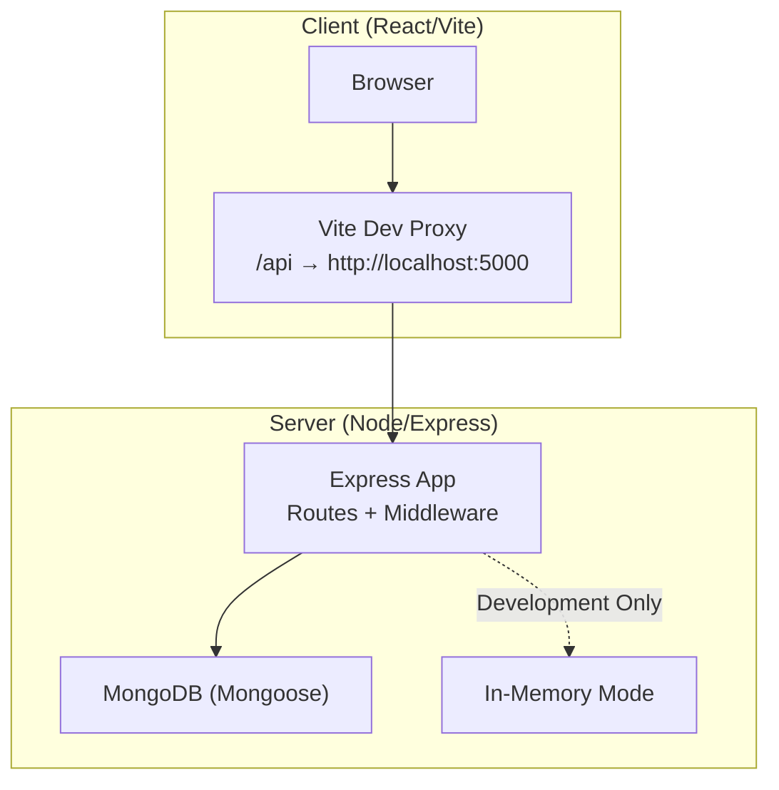
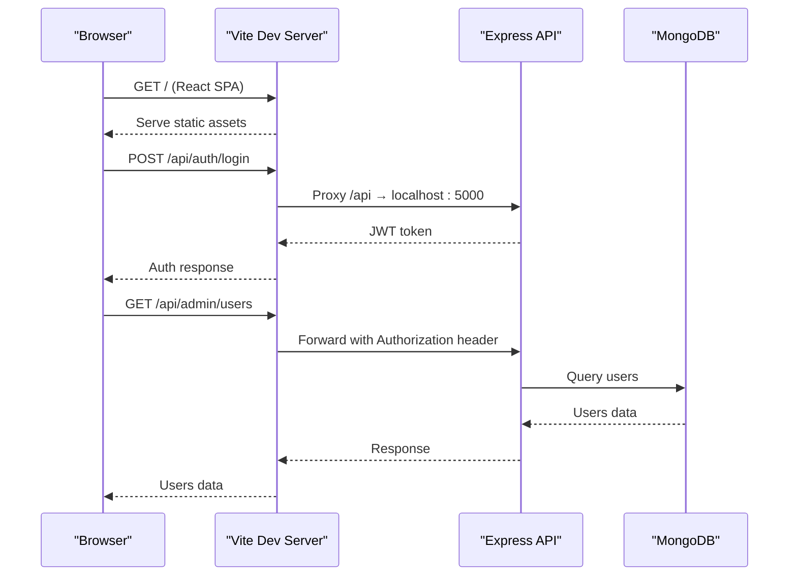
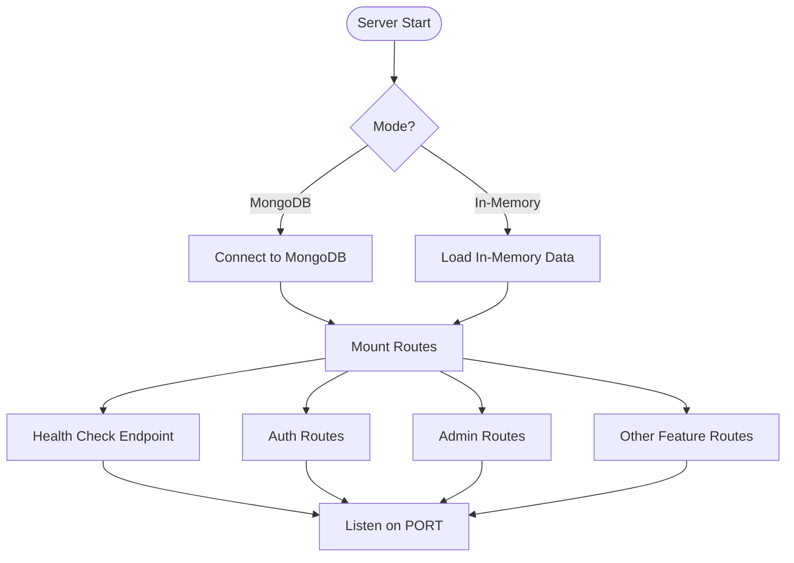
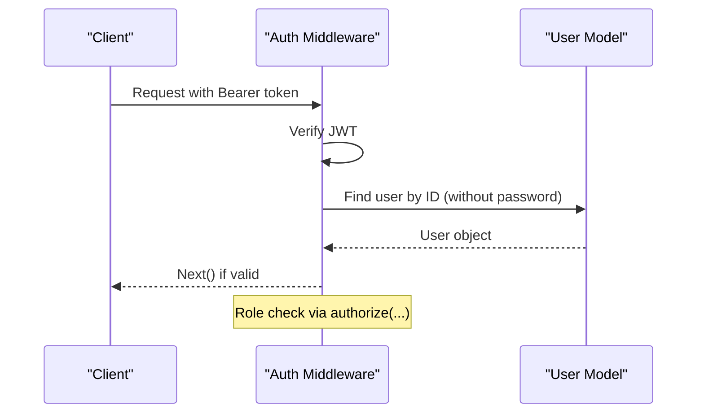
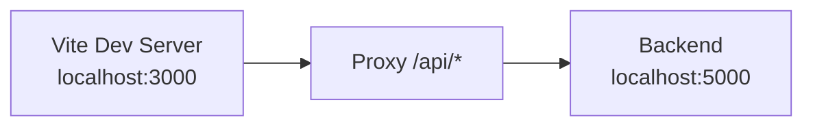
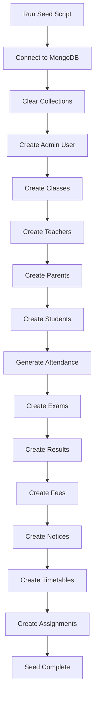

# Deployment & Configuration

<cite>
**Referenced Files in This Document**
- [server.js](file://server/server.js)
- [server-memory.js](file://server/server-memory.js)
- [db.js](file://server/config/db.js)
- [seed.js](file://server/seed.js)
- [auth.js](file://server/routes/auth.js)
- [auth.js](file://server/middleware/auth.js)
- [package.json](file://server/package.json)
- [package.json](file://client/package.json)
- [vite.config.js](file://client/vite.config.js)
- [start.bat](file://start.bat)
</cite>

## Table of Contents
1. [Introduction](#introduction)
2. [Project Structure](#project-structure)
3. [Core Components](#core-components)
4. [Architecture Overview](#architecture-overview)
5. [Detailed Component Analysis](#detailed-component-analysis)
6. [Environment Variables](#environment-variables)
7. [Database Setup](#database-setup)
8. [Reverse Proxy Configuration](#reverse-proxy-configuration)
9. [Production Deployment Options](#production-deployment-options)
10. [Scaling Considerations](#scaling-considerations)
11. [Monitoring, Logging, Backup, and Maintenance](#monitoring-logging-backup-and-maintenance)
12. [Troubleshooting Guide](#troubleshooting-guide)
13. [Performance Optimization](#performance-optimization)
14. [Conclusion](#conclusion)

## Introduction
This document provides comprehensive deployment guidance for the Educational Management System. It covers production-ready configurations, environment variables, database setup, reverse proxy configuration, Docker and cloud deployment options, CI/CD setup, monitoring/logging, backup strategies, maintenance procedures, troubleshooting, and performance optimization.

## Project Structure
The system consists of:
- A Node.js/Express backend exposing REST APIs and serving an in-memory development mode
- A React client built with Vite
- MongoDB connectivity via Mongoose for persistent mode
- Seed scripts for initial data population

**Diagram sources**
- [server.js:1-38](file://server/server.js#L1-L38)
- [server-memory.js:1-128](file://server/server-memory.js#L1-L128)
- [vite.config.js:1-17](file://client/vite.config.js#L1-L17)

**Section sources**
- [server.js:1-38](file://server/server.js#L1-L38)
- [server-memory.js:1-128](file://server/server-memory.js#L1-L128)
- [vite.config.js:1-17](file://client/vite.config.js#L1-L17)

## Core Components
- Backend server entry and routing
- Authentication middleware and authorization guards
- Database connection and seed utilities
- Client-side development proxy configuration

Key implementation references:
- Server bootstrap and routes: [server.js:1-38](file://server/server.js#L1-L38)
- In-memory development server: [server-memory.js:1-128](file://server/server-memory.js#L1-L128)
- Database connection: [db.js:1-14](file://server/config/db.js#L1-L14)
- Seed script for MongoDB: [seed.js:1-303](file://server/seed.js#L1-L303)
- Authentication middleware: [auth.js:1-31](file://server/middleware/auth.js#L1-L31)
- Client proxy: [vite.config.js:1-17](file://client/vite.config.js#L1-L17)

**Section sources**
- [server.js:1-38](file://server/server.js#L1-L38)
- [server-memory.js:1-128](file://server/server-memory.js#L1-L128)
- [db.js:1-14](file://server/config/db.js#L1-L14)
- [seed.js:1-303](file://server/seed.js#L1-L303)
- [auth.js:1-31](file://server/middleware/auth.js#L1-L31)
- [vite.config.js:1-17](file://client/vite.config.js#L1-L17)

## Architecture Overview
The system supports two operational modes:
- In-memory development mode for rapid iteration
- MongoDB-backed production mode for persistence

**Diagram sources**
- [server.js:1-38](file://server/server.js#L1-L38)
- [server-memory.js:1-128](file://server/server-memory.js#L1-L128)
- [vite.config.js:1-17](file://client/vite.config.js#L1-L17)

## Detailed Component Analysis

### Backend Server (Production vs In-Memory)
- Production mode connects to MongoDB using Mongoose and exposes REST endpoints under /api/*
- In-memory mode runs without a database, simulating entities and JWT verification

**Diagram sources**
- [server.js:1-38](file://server/server.js#L1-L38)
- [server-memory.js:1-128](file://server/server-memory.js#L1-L128)
- [db.js:1-14](file://server/config/db.js#L1-L14)

**Section sources**
- [server.js:1-38](file://server/server.js#L1-L38)
- [server-memory.js:1-128](file://server/server-memory.js#L1-L128)
- [db.js:1-14](file://server/config/db.js#L1-L14)

### Authentication and Authorization
- Middleware validates JWT tokens and attaches user context
- Authorization enforces role-based access control

**Diagram sources**
- [auth.js:1-31](file://server/middleware/auth.js#L1-L31)

**Section sources**
- [auth.js:1-31](file://server/middleware/auth.js#L1-L31)

### Client-Side Development Proxy
- Vite proxies /api requests to the backend during development

**Diagram sources**
- [vite.config.js:1-17](file://client/vite.config.js#L1-L17)

**Section sources**
- [vite.config.js:1-17](file://client/vite.config.js#L1-L17)

## Environment Variables
Define the following environment variables for production:

- Database
  - MONGODB_URI: MongoDB connection string for production mode

- Security
  - JWT_SECRET: Secret key for signing JWT tokens

- Server
  - PORT: Listening port for the backend service

Example values (use strong secrets in production):
- MONGODB_URI=mongodb://localhost:27017/school_management
- JWT_SECRET=your-super-secret-jwt-key-here
- PORT=5000

Notes:
- The in-memory server ignores MONGODB_URI and runs independently
- JWT_SECRET must be kept secret and rotated periodically

**Section sources**
- [server.js:1-38](file://server/server.js#L1-L38)
- [db.js:1-14](file://server/config/db.js#L1-L14)
- [auth.js:1-31](file://server/middleware/auth.js#L1-L31)

## Database Setup

### MongoDB (Production Mode)
- Connection: Uses MONGODB_URI to connect via Mongoose
- Seed Data: Use the seed script to populate initial data

**Diagram sources**
- [seed.js:1-303](file://server/seed.js#L1-L303)

Operational steps:
- Start MongoDB instance
- Set MONGODB_URI
- Run seed script to initialize data
- Start backend in MongoDB mode

**Section sources**
- [db.js:1-14](file://server/config/db.js#L1-L14)
- [seed.js:1-303](file://server/seed.js#L1-L303)

### In-Memory Development Mode
- No database required
- Built-in demo users and data
- Useful for local development and demos

**Section sources**
- [server-memory.js:1-128](file://server/server-memory.js#L1-L128)

## Reverse Proxy Configuration
Configure a reverse proxy (e.g., Nginx) to serve:
- Static assets from the React build
- API traffic to the backend service

Typical configuration outline:
- Static assets: serve client build directory
- API: proxy /api/* to backend service
- SSL termination and caching headers

Example Nginx directives:
- location /api/ { proxy_pass http://backend_service/; }
- location / { try_files $uri $uri/ /index.html; }

[No sources needed since this diagram shows conceptual workflow, not actual code structure]

## Production Deployment Options

### Option 1: Direct Node.js Deployment
- Build the client: npm run build
- Set environment variables
- Start backend using production script

Scripts and commands:
- Backend scripts: [package.json:6-10](file://server/package.json#L6-L10)
- Client build: [package.json:6-11](file://client/package.json#L6-L11)

**Section sources**
- [package.json:6-10](file://server/package.json#L6-L10)
- [package.json:6-11](file://client/package.json#L6-L11)

### Option 2: Docker Deployment
Compose structure:
- Backend service
- MongoDB service
- Nginx reverse proxy service

Compose outline:
- backend image: node:alpine, working dir /app/server
- mongodb image: mongo:latest
- nginx image: nginx:alpine, mount client build and proxy config

Volumes and ports:
- Backend: expose 5000
- MongoDB: persist /data/db
- Nginx: publish 80/443

[No sources needed since this diagram shows conceptual workflow, not actual code structure]

### Option 3: Cloud Platform Deployment
- Choose a container platform (e.g., ECS, EKS, Cloud Run)
- Deploy backend and MongoDB as managed services
- Use CDN/static hosting for the React app
- Configure health checks and auto-healing

[No sources needed since this diagram shows conceptual workflow, not actual code structure]

## Scaling Considerations
- Horizontal scaling: Stateless backend behind a load balancer
- Database scaling: Use replica sets and read replicas for MongoDB
- Caching: Introduce Redis for session storage and rate limiting
- Background jobs: Offload heavy tasks to a queue (e.g., BullMQ)
- Auto-scaling: Configure CPU/memory-based autoscaling policies

[No sources needed since this section provides general guidance]

## Monitoring, Logging, Backup, and Maintenance

### Monitoring
- Health endpoint: GET /api/health
- Metrics: Expose Prometheus metrics and integrate with Grafana
- Logs: Centralize application logs to ELK or similar

**Section sources**
- [server.js:29-32](file://server/server.js#L29-L32)
- [server-memory.js:88-89](file://server/server-memory.js#L88-L89)

### Logging
- Standard out/stderr for containerized environments
- Structured JSON logs for parsing
- Log rotation and retention policies

[No sources needed since this section provides general guidance]

### Backup Strategies
- MongoDB: Use mongodump/mongorestore or cloud-native backups
- Application data: Regular snapshots of persistent volumes
- Secrets: Store in a secure secret manager

[No sources needed since this section provides general guidance]

### Maintenance Procedures
- Patch Node.js and dependencies regularly
- Rotate JWT_SECRET and refresh tokens
- Monitor disk space and database size
- Review and prune unused collections

[No sources needed since this section provides general guidance]

## Troubleshooting Guide

Common issues and resolutions:
- Cannot connect to MongoDB
  - Verify MONGODB_URI and network access
  - Check firewall and authentication settings
- 401 Unauthorized on protected routes
  - Confirm Authorization header format (Bearer token)
  - Validate JWT_SECRET consistency
- CORS errors in development
  - Ensure Vite proxy targets the correct backend host/port
- Health check failing
  - Check backend logs and database connectivity

**Section sources**
- [server.js:1-38](file://server/server.js#L1-L38)
- [auth.js:1-31](file://server/middleware/auth.js#L1-L31)
- [vite.config.js:1-17](file://client/vite.config.js#L1-L17)

## Performance Optimization
- Enable compression and caching in reverse proxy
- Optimize database queries and add indexes
- Minimize payload sizes and paginate large lists
- Use connection pooling for MongoDB
- Implement CDN for static assets

[No sources needed since this section provides general guidance]

## Conclusion
This guide outlines production-ready deployment practices for the Educational Management System. By following the environment variable configuration, database setup, reverse proxy configuration, and scaling recommendations, you can deploy a robust, scalable, and maintainable system. Combine these practices with monitoring, logging, and backup strategies to ensure reliable operations.