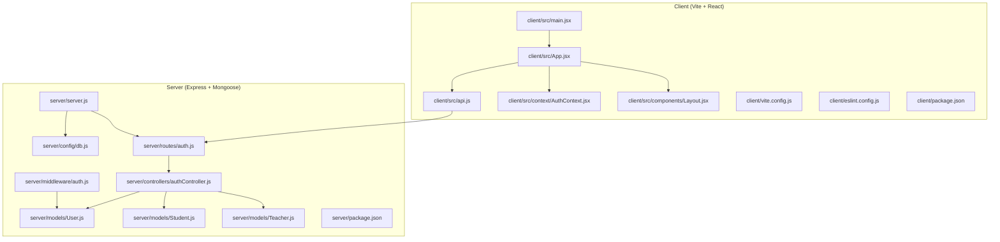
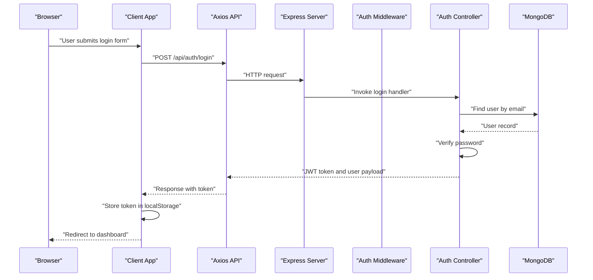
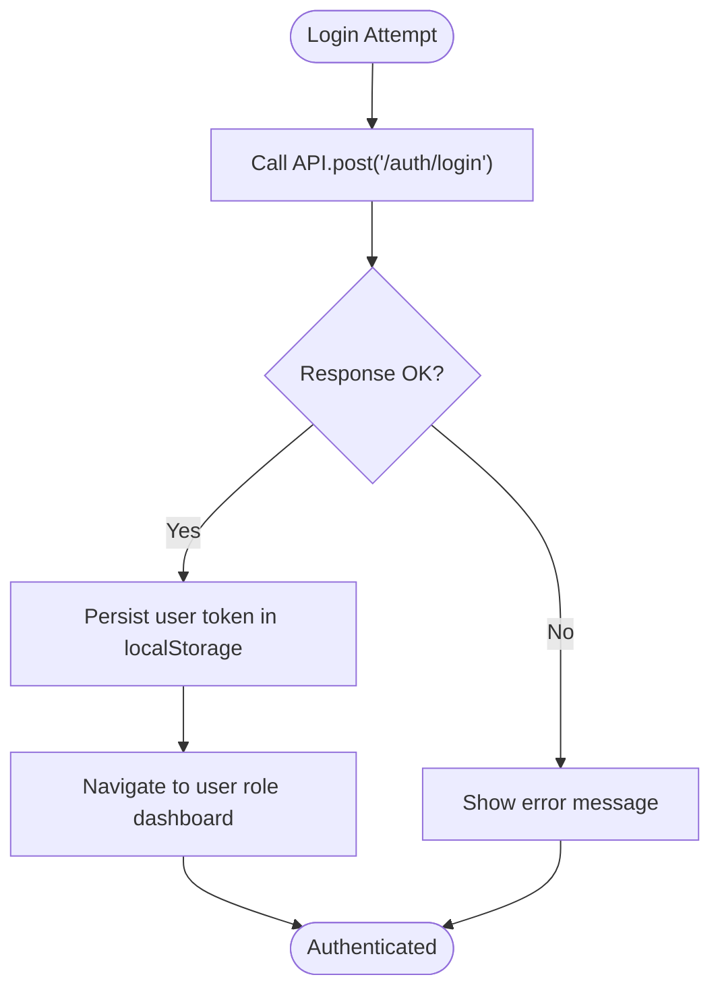
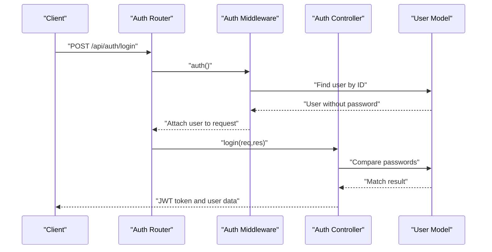
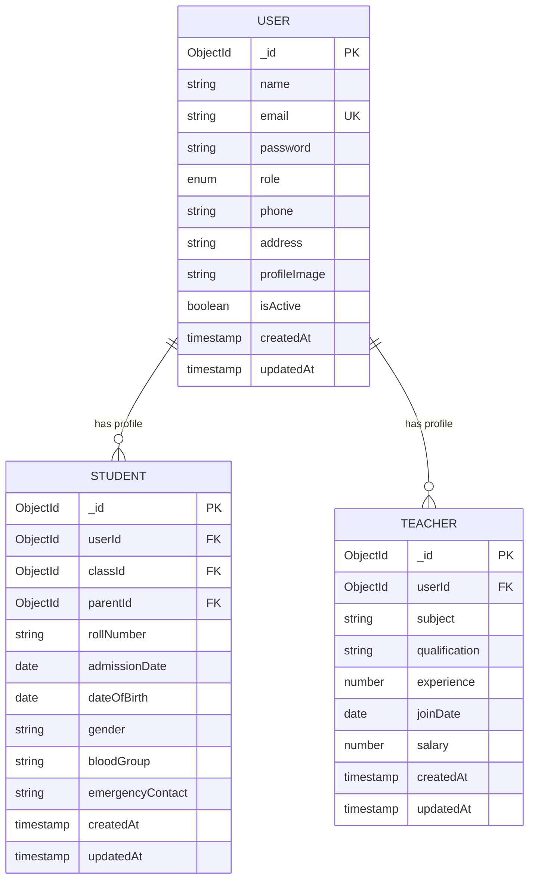
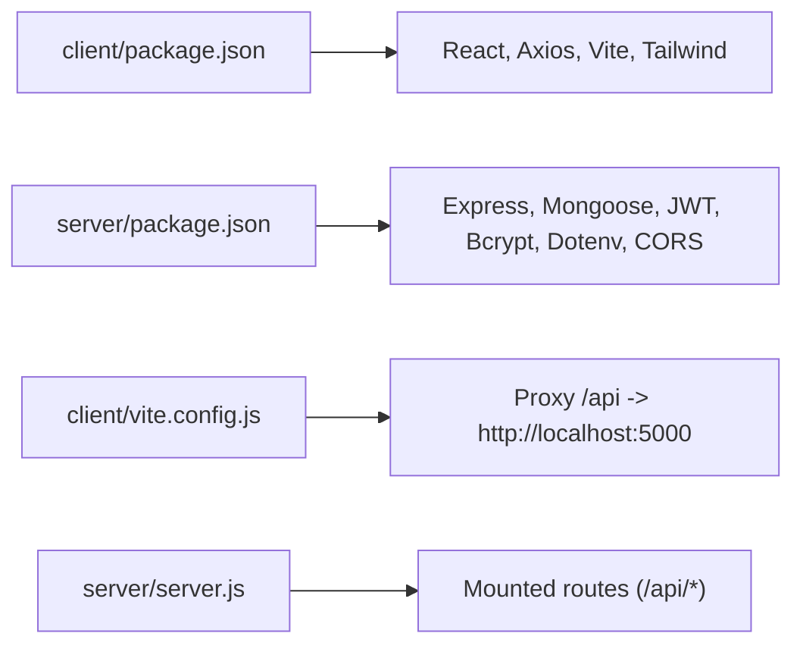

# Development Guide

<cite>
**Referenced Files in This Document**
- [client/package.json](file://client/package.json)
- [client/vite.config.js](file://client/vite.config.js)
- [client/eslint.config.js](file://client/eslint.config.js)
- [client/README.md](file://client/README.md)
- [server/package.json](file://server/package.json)
- [server/server.js](file://server/server.js)
- [server/config/db.js](file://server/config/db.js)
- [server/middleware/auth.js](file://server/middleware/auth.js)
- [server/routes/auth.js](file://server/routes/auth.js)
- [server/controllers/authController.js](file://server/controllers/authController.js)
- [server/models/User.js](file://server/models/User.js)
- [server/models/Student.js](file://server/models/Student.js)
- [server/models/Teacher.js](file://server/models/Teacher.js)
- [client/src/main.jsx](file://client/src/main.jsx)
- [client/src/App.jsx](file://client/src/App.jsx)
- [client/src/api.js](file://client/src/api.js)
- [client/src/context/AuthContext.jsx](file://client/src/context/AuthContext.jsx)
- [client/src/components/Layout.jsx](file://client/src/components/Layout.jsx)
</cite>

## Table of Contents
1. [Introduction](#introduction)
2. [Project Structure](#project-structure)
3. [Core Components](#core-components)
4. [Architecture Overview](#architecture-overview)
5. [Detailed Component Analysis](#detailed-component-analysis)
6. [Dependency Analysis](#dependency-analysis)
7. [Performance Considerations](#performance-considerations)
8. [Troubleshooting Guide](#troubleshooting-guide)
9. [Conclusion](#conclusion)
10. [Appendices](#appendices)

## Introduction
This guide helps contributors develop the Educational Management System. It covers environment setup, coding standards, ESLint configuration, Vite build process, project structure conventions, adding features, creating components, implementing API endpoints, database modeling, testing strategies, debugging techniques, deployment procedures, code review processes, contribution workflows, and maintenance practices.

## Project Structure
The project is split into two primary parts:
- Frontend (React + Vite): client/
- Backend (Express + MongoDB/Mongoose): server/

Key conventions observed:
- Frontend scripts and tooling defined in client/package.json
- Vite configuration in client/vite.config.js
- Linting via ESLint flat config in client/eslint.config.js
- Backend Express server bootstrapped in server/server.js
- Database connection in server/config/db.js
- Authentication middleware and routes/controllers under server/middleware/, server/routes/, and server/controllers/
- Models under server/models/
- Client-side routing and protected routes in client/src/App.jsx
- Global HTTP client and interceptors in client/src/api.js
- Authentication context in client/src/context/AuthContext.jsx
- Shared layout and navigation in client/src/components/Layout.jsx

**Diagram sources**
- [client/src/main.jsx:1-11](file://client/src/main.jsx#L1-L11)
- [client/src/App.jsx:1-85](file://client/src/App.jsx#L1-L85)
- [client/src/api.js:1-28](file://client/src/api.js#L1-L28)
- [client/src/context/AuthContext.jsx:1-53](file://client/src/context/AuthContext.jsx#L1-L53)
- [client/src/components/Layout.jsx:1-143](file://client/src/components/Layout.jsx#L1-L143)
- [client/vite.config.js:1-17](file://client/vite.config.js#L1-L17)
- [client/eslint.config.js:1-22](file://client/eslint.config.js#L1-L22)
- [client/package.json:1-34](file://client/package.json#L1-L34)
- [server/server.js:1-38](file://server/server.js#L1-L38)
- [server/config/db.js:1-14](file://server/config/db.js#L1-L14)
- [server/middleware/auth.js:1-31](file://server/middleware/auth.js#L1-L31)
- [server/routes/auth.js:1-13](file://server/routes/auth.js#L1-L13)
- [server/controllers/authController.js:1-107](file://server/controllers/authController.js#L1-L107)
- [server/models/User.js:1-27](file://server/models/User.js#L1-L27)
- [server/models/Student.js:1-16](file://server/models/Student.js#L1-L16)
- [server/models/Teacher.js:1-13](file://server/models/Teacher.js#L1-L13)
- [server/package.json:1-21](file://server/package.json#L1-L21)

**Section sources**
- [client/package.json:1-34](file://client/package.json#L1-L34)
- [client/vite.config.js:1-17](file://client/vite.config.js#L1-L17)
- [client/eslint.config.js:1-22](file://client/eslint.config.js#L1-L22)
- [client/README.md:1-17](file://client/README.md#L1-L17)
- [server/package.json:1-21](file://server/package.json#L1-L21)
- [server/server.js:1-38](file://server/server.js#L1-L38)

## Core Components
- Client entrypoint initializes React and mounts the root component.
- App sets up routing, protected routes, and layout wrapping.
- API module centralizes HTTP requests and handles auth tokens and 401 responses.
- AuthContext manages login, registration, logout, and profile updates.
- Layout renders role-specific navigation and theme switching.
- Server bootstraps Express, loads environment variables, connects to the database, registers routes, and exposes health checks.
- Authentication middleware validates JWTs and authorizes roles.
- Auth controller implements register, login, profile retrieval, updates, and password changes.
- Models define User, Student, and Teacher schemas with pre-save hooks and helpers.

**Section sources**
- [client/src/main.jsx:1-11](file://client/src/main.jsx#L1-L11)
- [client/src/App.jsx:1-85](file://client/src/App.jsx#L1-L85)
- [client/src/api.js:1-28](file://client/src/api.js#L1-L28)
- [client/src/context/AuthContext.jsx:1-53](file://client/src/context/AuthContext.jsx#L1-L53)
- [client/src/components/Layout.jsx:1-143](file://client/src/components/Layout.jsx#L1-L143)
- [server/server.js:1-38](file://server/server.js#L1-L38)
- [server/middleware/auth.js:1-31](file://server/middleware/auth.js#L1-L31)
- [server/controllers/authController.js:1-107](file://server/controllers/authController.js#L1-L107)
- [server/models/User.js:1-27](file://server/models/User.js#L1-L27)
- [server/models/Student.js:1-16](file://server/models/Student.js#L1-L16)
- [server/models/Teacher.js:1-13](file://server/models/Teacher.js#L1-L13)

## Architecture Overview
High-level flow:
- Client runs on Vite, proxies API requests to the backend server.
- Backend serves REST endpoints under /api prefixed routes.
- Authentication uses JWT; middleware verifies tokens and enforces roles.
- Database is MongoDB via Mongoose; models encapsulate collections and relationships.

**Diagram sources**
- [client/src/api.js:1-28](file://client/src/api.js#L1-L28)
- [server/server.js:1-38](file://server/server.js#L1-L38)
- [server/routes/auth.js:1-13](file://server/routes/auth.js#L1-L13)
- [server/controllers/authController.js:1-107](file://server/controllers/authController.js#L1-L107)
- [server/middleware/auth.js:1-31](file://server/middleware/auth.js#L1-L31)
- [server/models/User.js:1-27](file://server/models/User.js#L1-L27)

## Detailed Component Analysis

### Client Build and Dev Environment
- Scripts: dev, build, lint, preview are defined in client/package.json.
- Vite dev server listens on port 3000 and proxies /api to the backend server on port 5000.
- ESLint flat config enables recommended rules for JS/JSX, React Hooks, and React Refresh.

Recommended commands:
- npm run dev (frontend)
- npm run build (frontend)
- npm run lint (frontend)
- npm run preview (frontend)

**Section sources**
- [client/package.json:6-11](file://client/package.json#L6-L11)
- [client/vite.config.js:7-15](file://client/vite.config.js#L7-L15)
- [client/eslint.config.js:7-21](file://client/eslint.config.js#L7-L21)
- [client/README.md:1-17](file://client/README.md#L1-L17)

### ESLint Configuration
- Uses flat config with @eslint/js, globals, eslint-plugin-react-hooks, eslint-plugin-react-refresh.
- Recommended for modern React projects; consider TypeScript for production-grade type safety.

**Section sources**
- [client/eslint.config.js:1-22](file://client/eslint.config.js#L1-L22)

### Vite Build Process
- Plugin stack includes @vitejs/plugin-react and @tailwindcss/vite.
- Proxy configuration ensures frontend can call backend endpoints during development.
- Production builds optimize assets and bundle code.

**Section sources**
- [client/vite.config.js:1-17](file://client/vite.config.js#L1-L17)

### Authentication Flow (Client-Side)
- AuthContext provides login, register, logout, and updateProfile.
- API module attaches Authorization header from localStorage and redirects to login on 401.
- ProtectedRoute enforces role-based access and wraps children with Layout.

**Diagram sources**
- [client/src/context/AuthContext.jsx:20-32](file://client/src/context/AuthContext.jsx#L20-L32)
- [client/src/api.js:8-25](file://client/src/api.js#L8-L25)
- [client/src/App.jsx:18-24](file://client/src/App.jsx#L18-L24)

**Section sources**
- [client/src/context/AuthContext.jsx:1-53](file://client/src/context/AuthContext.jsx#L1-L53)
- [client/src/api.js:1-28](file://client/src/api.js#L1-L28)
- [client/src/App.jsx:18-24](file://client/src/App.jsx#L18-L24)

### Backend Authentication and Routing
- server.js loads environment variables, connects to DB, applies CORS and JSON middleware, mounts routes, and exposes a health endpoint.
- Routes under /api/auth delegate to authController.
- Controllers interact with models and return structured JSON responses.
- Middleware verifies JWT and authorizes roles.

**Diagram sources**
- [server/server.js:19-27](file://server/server.js#L19-L27)
- [server/routes/auth.js:1-13](file://server/routes/auth.js#L1-L13)
- [server/middleware/auth.js:4-19](file://server/middleware/auth.js#L4-L19)
- [server/controllers/authController.js:31-59](file://server/controllers/authController.js#L31-L59)
- [server/models/User.js:22-24](file://server/models/User.js#L22-L24)

**Section sources**
- [server/server.js:1-38](file://server/server.js#L1-L38)
- [server/routes/auth.js:1-13](file://server/routes/auth.js#L1-L13)
- [server/controllers/authController.js:1-107](file://server/controllers/authController.js#L1-L107)
- [server/middleware/auth.js:1-31](file://server/middleware/auth.js#L1-L31)
- [server/models/User.js:1-27](file://server/models/User.js#L1-L27)

### Data Models Overview
- User: base entity with role enumeration, hashed password, and metadata.
- Student: references User and Class, includes personal info and enrollment details.
- Teacher: references User, includes subject and employment details.

**Diagram sources**
- [server/models/User.js:4-26](file://server/models/User.js#L4-L26)
- [server/models/Student.js:3-15](file://server/models/Student.js#L3-L15)
- [server/models/Teacher.js:3-12](file://server/models/Teacher.js#L3-L12)

**Section sources**
- [server/models/User.js:1-27](file://server/models/User.js#L1-L27)
- [server/models/Student.js:1-16](file://server/models/Student.js#L1-L16)
- [server/models/Teacher.js:1-13](file://server/models/Teacher.js#L1-L13)

### Adding New Features (Frontend)
- Create a new page component under client/src/pages/<role>/.
- Add a route in client/src/App.jsx with appropriate role protection.
- Wrap the page with Layout via ProtectedRoute.
- Import and render the component inside the route.
- Use client/src/api.js for HTTP calls; ensure Authorization header is handled automatically.

**Section sources**
- [client/src/App.jsx:26-72](file://client/src/App.jsx#L26-L72)
- [client/src/api.js:1-28](file://client/src/api.js#L1-L28)

### Creating Components
- Place reusable components under client/src/components/.
- Use Lucide icons for UI consistency.
- Respect role-based navigation in client/src/components/Layout.jsx.
- Keep components functional and props-driven; avoid embedding business logic in views.

**Section sources**
- [client/src/components/Layout.jsx:1-143](file://client/src/components/Layout.jsx#L1-L143)

### Implementing API Endpoints (Backend)
- Define route handlers in server/routes/<resource>.js.
- Implement controller logic in server/controllers/<resource>Controller.js.
- Apply middleware (auth and authorize) as needed.
- Return consistent JSON responses with appropriate HTTP status codes.
- Add unit tests for controllers and integration tests for routes.

**Section sources**
- [server/routes/auth.js:1-13](file://server/routes/auth.js#L1-L13)
- [server/controllers/authController.js:1-107](file://server/controllers/authController.js#L1-L107)
- [server/middleware/auth.js:21-28](file://server/middleware/auth.js#L21-L28)

### Database Modeling and Migrations
- Extend server/models/ with new schemas following existing patterns.
- Use Mongoose virtuals and population where appropriate (e.g., Student.populate('classId parentId')).
- For production, adopt a migration tool (e.g., migrate-mongo) to manage schema changes safely.
- Seed initial data using server/seed.js if present.

**Section sources**
- [server/models/User.js:1-27](file://server/models/User.js#L1-L27)
- [server/models/Student.js:1-16](file://server/models/Student.js#L1-L16)
- [server/models/Teacher.js:1-13](file://server/models/Teacher.js#L1-L13)
- [server/server.js:1-38](file://server/server.js#L1-L38)

## Dependency Analysis
- Client depends on React, React Router, Axios, TailwindCSS, and Vite toolchain.
- Server depends on Express, Mongoose, bcryptjs, jsonwebtoken, dotenv, cors.
- Frontend proxy in Vite targets backend server for API calls.

**Diagram sources**
- [client/package.json:12-32](file://client/package.json#L12-L32)
- [server/package.json:11-19](file://server/package.json#L11-L19)
- [client/vite.config.js:9-14](file://client/vite.config.js#L9-L14)
- [server/server.js:19-27](file://server/server.js#L19-L27)

**Section sources**
- [client/package.json:1-34](file://client/package.json#L1-L34)
- [server/package.json:1-21](file://server/package.json#L1-L21)
- [client/vite.config.js:1-17](file://client/vite.config.js#L1-L17)
- [server/server.js:1-38](file://server/server.js#L1-L38)

## Performance Considerations
- Prefer lazy loading for heavy pages and charts.
- Minimize re-renders by memoizing props and using React.memo where appropriate.
- Use pagination and virtualization for large lists.
- Optimize images and assets; leverage Vite’s built-in bundling.
- Avoid unnecessary middleware overhead; keep CORS and body parsing scoped.

## Troubleshooting Guide
Common issues and resolutions:
- Authentication failures:
  - Verify JWT_SECRET and MONGODB_URI are set in environment.
  - Ensure client stores and sends Authorization header; check client/src/api.js interceptor behavior.
- 401 Unauthorized:
  - Confirm token validity and expiration; client clears localStorage on 401.
- CORS errors:
  - Confirm server applies CORS middleware and client proxy targets the correct backend host/port.
- Database connection:
  - Check server/config/db.js connection logs and environment variables.
- Vite proxy not working:
  - Ensure client/vite.config.js proxy target matches backend port and origin.

**Section sources**
- [client/src/api.js:8-25](file://client/src/api.js#L8-L25)
- [server/middleware/auth.js:4-19](file://server/middleware/auth.js#L4-L19)
- [server/config/db.js:3-11](file://server/config/db.js#L3-L11)
- [client/vite.config.js:9-14](file://client/vite.config.js#L9-L14)

## Conclusion
This guide outlines the development workflow, architecture, and conventions for contributing to the Educational Management System. By following the outlined practices—environment setup, ESLint configuration, Vite build process, component creation, API implementation, and secure authentication—you can efficiently extend the platform while maintaining code quality and reliability.

## Appendices

### Development Environment Setup
- Install dependencies:
  - Frontend: cd client && npm install
  - Backend: cd server && npm install
- Set environment variables:
  - Copy .env.example to .env in server/ and configure MONGODB_URI, JWT_SECRET, JWT_EXPIRE, and PORT.
- Run locally:
  - Frontend: cd client && npm run dev
  - Backend: cd server && npm run start (or npm run start:mongo for MongoDB)

**Section sources**
- [server/server.js:6-10](file://server/server.js#L6-L10)
- [server/config/db.js:3-11](file://server/config/db.js#L3-L11)
- [client/vite.config.js:7-15](file://client/vite.config.js#L7-L15)
- [server/package.json:6-9](file://server/package.json#L6-L9)

### Coding Standards and Conventions
- Use ESLint flat config for linting; enable TypeScript in production for stronger guarantees.
- Group related components under feature folders (e.g., client/src/pages/admin/).
- Keep controllers thin; move business logic to services if needed.
- Use consistent naming for routes, handlers, and models.

**Section sources**
- [client/eslint.config.js:1-22](file://client/eslint.config.js#L1-L22)
- [client/README.md:14-16](file://client/README.md#L14-L16)

### Testing Strategies
- Unit tests: Jest/React Testing Library for frontend components and controllers.
- Integration tests: Supertest for backend routes.
- Mock external services (e.g., JWT, database) to isolate tests.
- CI pipeline: Run lint, unit tests, and integration tests on pull requests.

[No sources needed since this section provides general guidance]

### Debugging Techniques
- Frontend: React DevTools, browser network tab, console logs; verify localStorage token presence.
- Backend: Enable logging in server.js and middleware; inspect JWT decoding and database queries.
- Database: Use MongoDB Compass or CLI to inspect collections and indexes.

[No sources needed since this section provides general guidance]

### Deployment Procedures
- Build artifacts:
  - Frontend: npm run build (outputs to client/dist)
  - Serve static files via Nginx/Apache or a hosting provider.
- Backend:
  - Set production environment variables.
  - Use PM2 or Docker for process management and scaling.
- Database:
  - Use managed MongoDB Atlas or self-hosted MongoDB with backups and monitoring.

[No sources needed since this section provides general guidance]

### Code Review Processes and Contribution Workflows
- Branching: Feature branches per task; rebase or merge after review.
- Pull Request checklist: Lint passes, tests added/updated, security reviewed, documentation updated.
- Review feedback: Address comments promptly; keep commits focused and atomic.
- Merge policy: Squash or rebase merges; ensure main branch stays green.

[No sources needed since this section provides general guidance]

### Maintenance Practices
- Regularly update dependencies and audit vulnerabilities.
- Monitor logs and metrics; set up alerts for critical errors.
- Rotate secrets and refresh JWT expiration as needed.
- Back up database regularly and test restore procedures.

[No sources needed since this section provides general guidance]