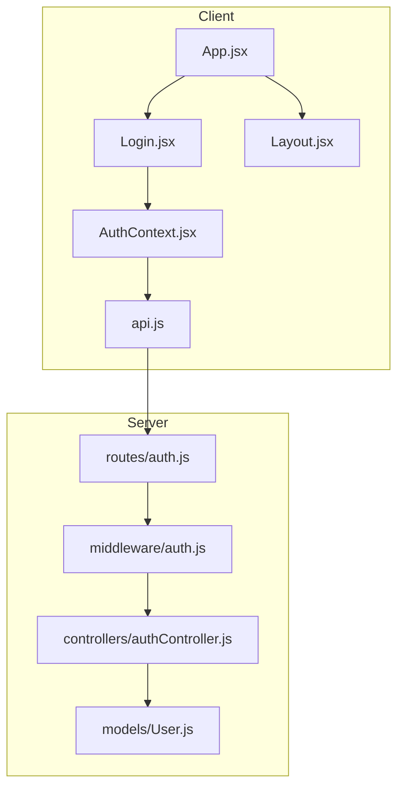
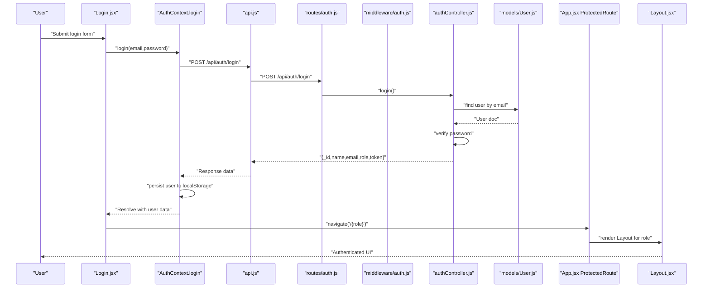
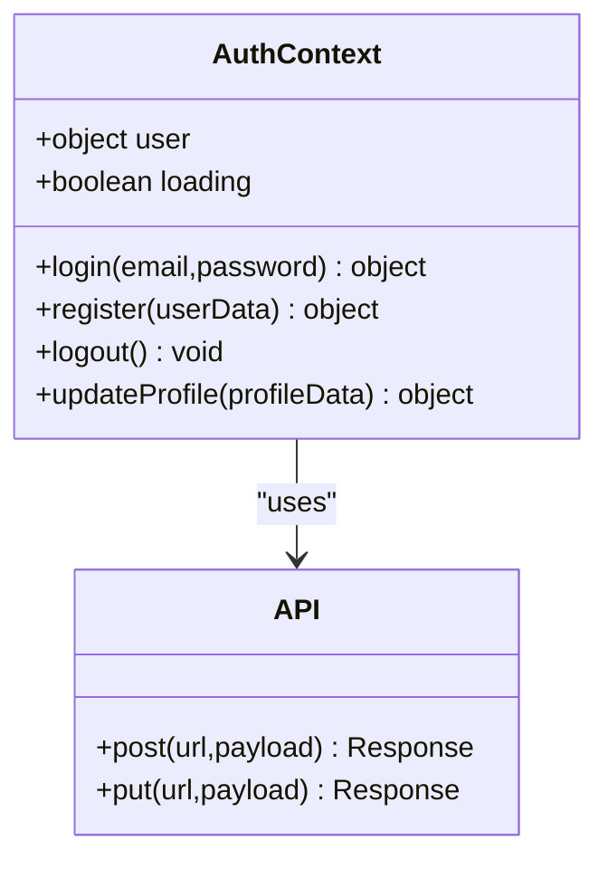
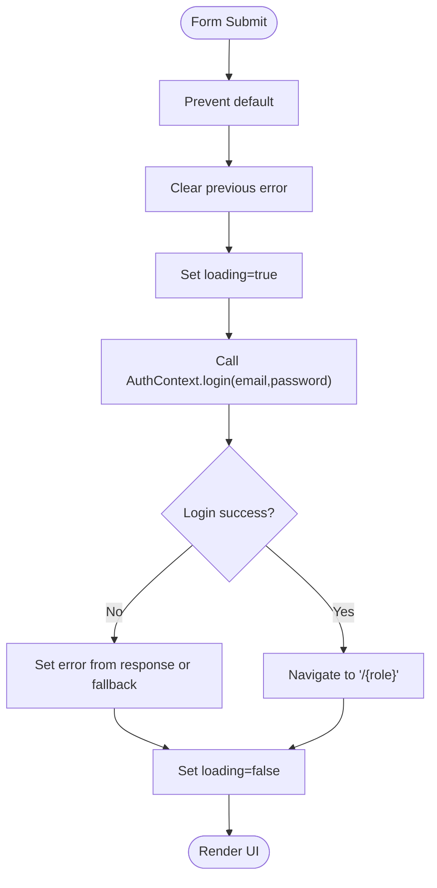
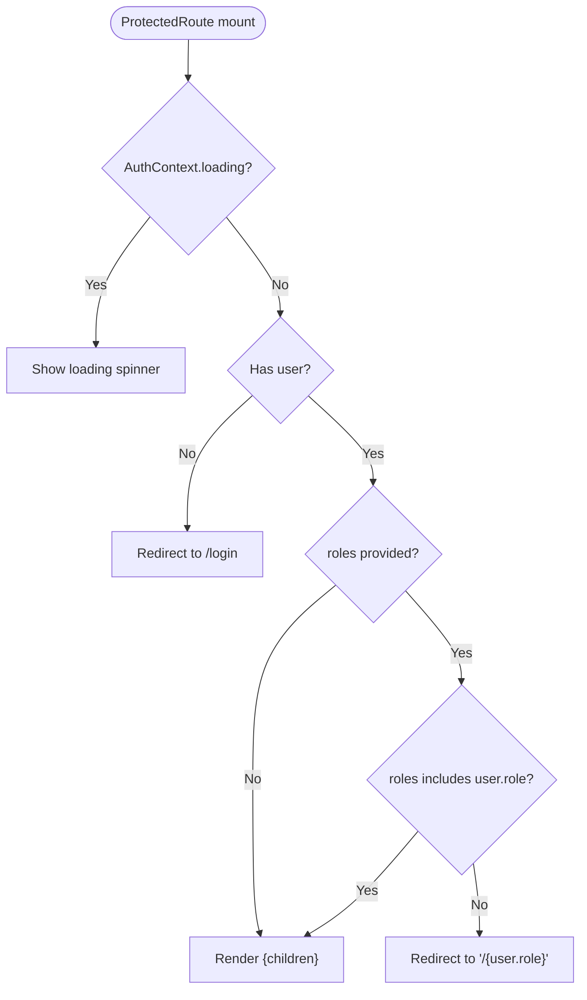
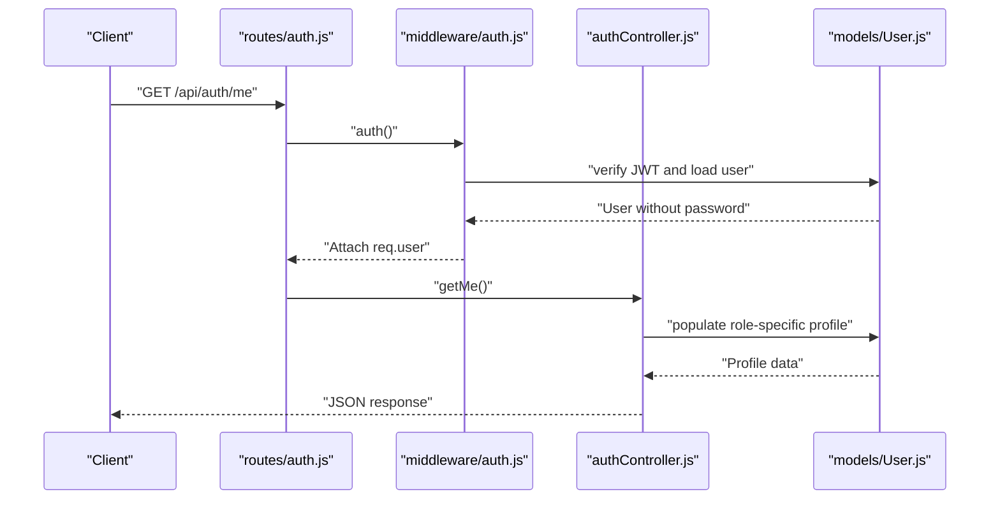
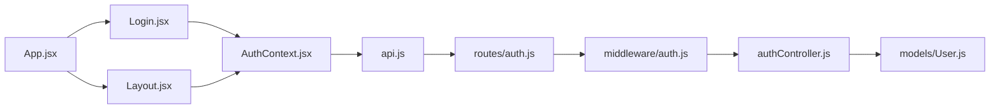

# Authentication Components

<cite>
**Referenced Files in This Document**
- [AuthContext.jsx](file://client/src/context/AuthContext.jsx)
- [Login.jsx](file://client/src/pages/auth/Login.jsx)
- [App.jsx](file://client/src/App.jsx)
- [Layout.jsx](file://client/src/components/Layout.jsx)
- [api.js](file://client/src/api.js)
- [authController.js](file://server/controllers/authController.js)
- [auth.js](file://server/middleware/auth.js)
- [auth.js](file://server/routes/auth.js)
- [User.js](file://server/models/User.js)
</cite>

## Table of Contents
1. [Introduction](#introduction)
2. [Project Structure](#project-structure)
3. [Core Components](#core-components)
4. [Architecture Overview](#architecture-overview)
5. [Detailed Component Analysis](#detailed-component-analysis)
6. [Dependency Analysis](#dependency-analysis)
7. [Performance Considerations](#performance-considerations)
8. [Troubleshooting Guide](#troubleshooting-guide)
9. [Conclusion](#conclusion)

## Introduction
This document explains the authentication system for the EduManage application. It covers the login page implementation, input validation, error handling, submission processing, and the integration with the global authentication state. It also documents the authentication flow, redirect logic after successful login, and how routing guards protect authenticated routes. Security considerations such as token handling and middleware enforcement are included, along with practical examples of form validation patterns, loading states, and error messaging.

## Project Structure
The authentication system spans the client-side React application and the server-side Node.js/Express backend. On the client:
- AuthContext manages user state, login/logout, and profile updates.
- Login page captures credentials, validates inputs, handles errors, and triggers login.
- App sets up routing with protected routes guarded by a custom ProtectedRoute wrapper.
- Layout renders the authenticated navigation and handles logout.
- api.js centralizes HTTP requests and attaches Authorization headers.

On the server:
- auth routes expose login, registration, profile retrieval, and updates.
- auth middleware verifies JWT tokens and enforces role-based access.
- authController implements login logic, password verification, and token generation.
- User model defines schema, hashing, and password comparison.

**Diagram sources**
- [AuthContext.jsx:1-53](file://client/src/context/AuthContext.jsx#L1-L53)
- [Login.jsx:1-100](file://client/src/pages/auth/Login.jsx#L1-L100)
- [App.jsx:18-24](file://client/src/App.jsx#L18-L24)
- [Layout.jsx:51-143](file://client/src/components/Layout.jsx#L51-L143)
- [api.js:1-28](file://client/src/api.js#L1-L28)
- [auth.js:1-13](file://server/routes/auth.js#L1-L13)
- [auth.js:1-31](file://server/middleware/auth.js#L1-L31)
- [authController.js:1-107](file://server/controllers/authController.js#L1-L107)
- [User.js:1-27](file://server/models/User.js#L1-L27)

**Section sources**
- [AuthContext.jsx:1-53](file://client/src/context/AuthContext.jsx#L1-L53)
- [Login.jsx:1-100](file://client/src/pages/auth/Login.jsx#L1-L100)
- [App.jsx:18-24](file://client/src/App.jsx#L18-L24)
- [Layout.jsx:51-143](file://client/src/components/Layout.jsx#L51-L143)
- [api.js:1-28](file://client/src/api.js#L1-L28)
- [auth.js:1-13](file://server/routes/auth.js#L1-L13)
- [auth.js:1-31](file://server/middleware/auth.js#L1-L31)
- [authController.js:1-107](file://server/controllers/authController.js#L1-L107)
- [User.js:1-27](file://server/models/User.js#L1-L27)

## Core Components
- AuthContext: Provides user state, login, register, logout, and profile update functions. Persists user data to localStorage and exposes loading state during initialization.
- Login Page: Captures email and password, toggles password visibility, disables submit while loading, displays server-provided error messages, and navigates to the user’s role-specific dashboard upon success.
- ProtectedRoute: Guards routes by checking authentication and role, rendering a loader while initializing, redirecting unauthenticated users to login, and redirecting unauthorized roles to the user’s dashboard.
- API Layer: Centralizes HTTP calls, injects Authorization header from localStorage, and auto-redirects to login on 401 responses.
- Layout: Renders role-based sidebar and profile actions, and logs out the user back to the login page.

**Section sources**
- [AuthContext.jsx:8-52](file://client/src/context/AuthContext.jsx#L8-L52)
- [Login.jsx:6-27](file://client/src/pages/auth/Login.jsx#L6-L27)
- [App.jsx:18-24](file://client/src/App.jsx#L18-L24)
- [api.js:8-25](file://client/src/api.js#L8-L25)
- [Layout.jsx:51-63](file://client/src/components/Layout.jsx#L51-L63)

## Architecture Overview
The authentication flow integrates client-side state management with server-side token-based authentication and role-based routing protection.

**Diagram sources**
- [Login.jsx:15-27](file://client/src/pages/auth/Login.jsx#L15-L27)
- [AuthContext.jsx:20-25](file://client/src/context/AuthContext.jsx#L20-L25)
- [api.js:3-6](file://client/src/api.js#L3-L6)
- [auth.js:6-10](file://server/routes/auth.js#L6-L10)
- [auth.js:4-19](file://server/middleware/auth.js#L4-L19)
- [authController.js:31-59](file://server/controllers/authController.js#L31-L59)
- [User.js:22-24](file://server/models/User.js#L22-L24)
- [App.jsx:26-72](file://client/src/App.jsx#L26-L72)
- [Layout.jsx:51-143](file://client/src/components/Layout.jsx#L51-L143)

## Detailed Component Analysis

### AuthContext Analysis
AuthContext encapsulates authentication state and operations:
- State: user object and loading flag initialized from localStorage.
- Methods:
  - login: posts credentials to /api/auth/login, stores returned user and token, returns user data.
  - register: posts new user data to /api/auth/register, stores response user.
  - logout: clears user state and localStorage.
  - updateProfile: PUTs profile changes to /api/auth/profile and merges updated data.
- Integration: Exposes loading to avoid premature redirects and UI rendering.

**Diagram sources**
- [AuthContext.jsx:8-52](file://client/src/context/AuthContext.jsx#L8-L52)
- [api.js:1-28](file://client/src/api.js#L1-L28)

**Section sources**
- [AuthContext.jsx:8-52](file://client/src/context/AuthContext.jsx#L8-L52)

### Login Page Analysis
The Login page implements:
- Form state: email, password, showPassword, error, loading.
- Validation: HTML required attributes on inputs; client-side checks ensure fields are non-empty before submission.
- Submission:
  - Prevents default form submission.
  - Clears previous errors and enables loading.
  - Calls AuthContext.login(email, password).
  - On success, navigates to "/{role}".
  - On failure, sets error message from server response or a generic message.
  - Ensures loading is reset in finally block.
- UI feedback: Disabled submit button while loading, password visibility toggle, demo account buttons.

**Diagram sources**
- [Login.jsx:15-27](file://client/src/pages/auth/Login.jsx#L15-L27)
- [AuthContext.jsx:20-25](file://client/src/context/AuthContext.jsx#L20-L25)

**Section sources**
- [Login.jsx:6-27](file://client/src/pages/auth/Login.jsx#L6-L27)

### ProtectedRoute and Routing Guards
ProtectedRoute enforces authentication and role checks:
- Loading state: While AuthContext.loading is true, renders a spinner.
- Unauthenticated: Redirects to /login.
- Role check: If roles array is provided and user.role is not included, redirects to "/{user.role}".
- Authorized: Wraps children with Layout to render role-specific pages.

AppRoutes defines:
- Public login route: Redirects authenticated users to their role dashboard.
- Protected routes: Admin, Teacher, Student, and Parent dashboards guarded by ProtectedRoute with role filters.
- Wildcard: Redirects unknown paths to /login.

**Diagram sources**
- [App.jsx:18-24](file://client/src/App.jsx#L18-L24)
- [App.jsx:26-72](file://client/src/App.jsx#L26-L72)

**Section sources**
- [App.jsx:18-24](file://client/src/App.jsx#L18-L24)
- [App.jsx:26-72](file://client/src/App.jsx#L26-L72)

### API Layer and Token Handling
The API client:
- Sets baseURL to "/api".
- Injects Authorization header from localStorage if present.
- Intercepts responses and redirects to "/login" on 401 status.

This ensures all authenticated requests carry the token and invalid sessions are handled centrally.

**Section sources**
- [api.js:3-6](file://client/src/api.js#L3-L6)
- [api.js:8-25](file://client/src/api.js#L8-L25)

### Server-Side Authentication Flow
Server-side components:
- Routes: Expose /api/auth/login and related endpoints.
- Middleware: Verifies Bearer token and populates req.user; authorize(role) enforces role-based access.
- Controller: Implements login by finding user, verifying isActive and password, and returning JWT-signed payload with user details and token.
- Model: Defines schema, hashes passwords on save, and compares passwords via bcrypt.

**Diagram sources**
- [auth.js:6-10](file://server/routes/auth.js#L6-L10)
- [auth.js:4-19](file://server/middleware/auth.js#L4-L19)
- [authController.js:61-76](file://server/controllers/authController.js#L61-L76)
- [User.js:22-24](file://server/models/User.js#L22-L24)

**Section sources**
- [auth.js:1-13](file://server/routes/auth.js#L1-L13)
- [auth.js:1-31](file://server/middleware/auth.js#L1-L31)
- [authController.js:31-59](file://server/controllers/authController.js#L31-L59)
- [User.js:1-27](file://server/models/User.js#L1-L27)

## Dependency Analysis
Key dependencies and interactions:
- Login.jsx depends on AuthContext for login and on react-router-dom for navigation.
- AuthContext depends on api.js for HTTP operations and localStorage for persistence.
- App.jsx defines ProtectedRoute and routes; ProtectedRoute depends on AuthContext for user and loading state.
- Layout.jsx depends on AuthContext for user info and logout action.
- api.js depends on localStorage for token injection and redirects to "/login" on 401.
- Server routes depend on auth middleware for token verification and role enforcement.
- authController depends on User model for password verification and token generation.

**Diagram sources**
- [Login.jsx:1-13](file://client/src/pages/auth/Login.jsx#L1-L13)
- [AuthContext.jsx:1-53](file://client/src/context/AuthContext.jsx#L1-L53)
- [api.js:1-28](file://client/src/api.js#L1-L28)
- [auth.js:1-13](file://server/routes/auth.js#L1-L13)
- [auth.js:1-31](file://server/middleware/auth.js#L1-L31)
- [authController.js:1-107](file://server/controllers/authController.js#L1-L107)
- [User.js:1-27](file://server/models/User.js#L1-L27)
- [App.jsx:18-24](file://client/src/App.jsx#L18-L24)
- [Layout.jsx:51-63](file://client/src/components/Layout.jsx#L51-L63)

**Section sources**
- [Login.jsx:1-13](file://client/src/pages/auth/Login.jsx#L1-L13)
- [AuthContext.jsx:1-53](file://client/src/context/AuthContext.jsx#L1-L53)
- [api.js:1-28](file://client/src/api.js#L1-L28)
- [auth.js:1-13](file://server/routes/auth.js#L1-L13)
- [auth.js:1-31](file://server/middleware/auth.js#L1-L31)
- [authController.js:1-107](file://server/controllers/authController.js#L1-L107)
- [User.js:1-27](file://server/models/User.js#L1-L27)
- [App.jsx:18-24](file://client/src/App.jsx#L18-L24)
- [Layout.jsx:51-63](file://client/src/components/Layout.jsx#L51-L63)

## Performance Considerations
- Minimize re-renders: Keep AuthContext state granular; avoid unnecessary provider wrapping around heavy subtrees.
- Debounce or throttle input handlers if extended validation is added later.
- Use lazy loading for route components to reduce initial bundle size.
- Persist only essential user data to localStorage to keep network requests efficient.
- Ensure middleware caching on the server reduces repeated database lookups for verified users.

## Troubleshooting Guide
Common issues and resolutions:
- Stuck on loading spinner: Verify AuthContext initializes localStorage correctly and does not indefinitely keep loading.
- 401 Unauthorized after login: Confirm Authorization header is attached by api.js and that the token is valid and not expired.
- Redirect loops to "/login": Check ProtectedRoute logic and ensure user.role matches expected roles.
- Password mismatch or invalid credentials: Validate server-side error messages and confirm bcrypt password comparison works as expected.
- Role-based access denied: Ensure routes specify correct roles and middleware authorize(role) is applied.

**Section sources**
- [AuthContext.jsx:12-18](file://client/src/context/AuthContext.jsx#L12-L18)
- [api.js:8-25](file://client/src/api.js#L8-L25)
- [App.jsx:18-24](file://client/src/App.jsx#L18-L24)
- [authController.js:35-44](file://server/controllers/authController.js#L35-L44)
- [auth.js:21-28](file://server/middleware/auth.js#L21-L28)

## Conclusion
The authentication system combines a robust client-side state manager with secure server-side token verification and role-based routing guards. The Login page provides clear user feedback, handles errors gracefully, and redirects users to their role-specific dashboards. The API layer centralizes token handling and automatic session invalidation. Together, these components deliver a secure, responsive, and maintainable authentication experience.