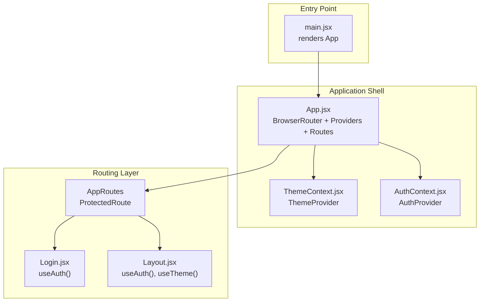
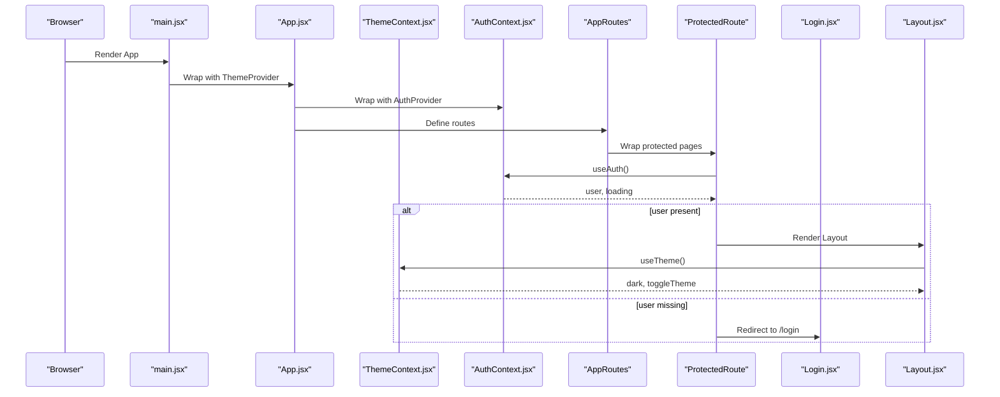
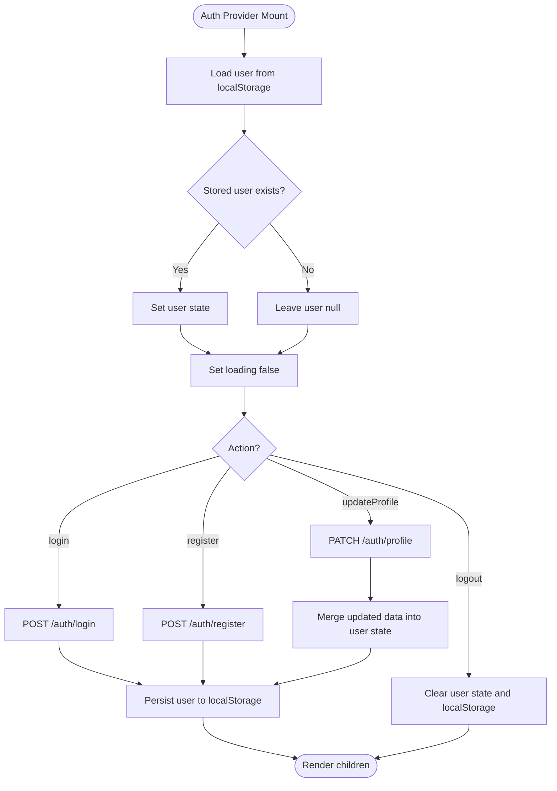
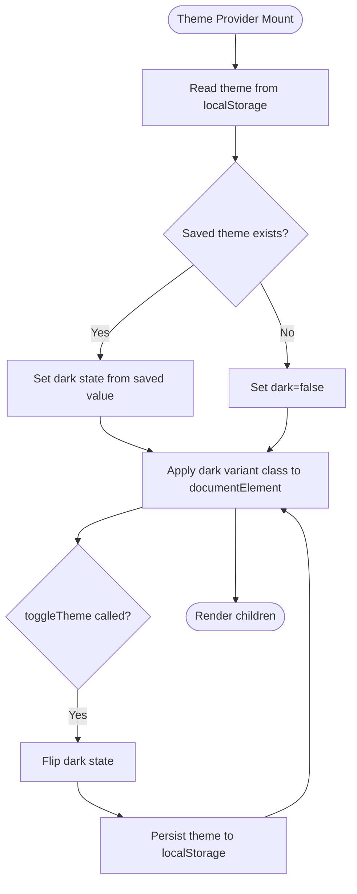
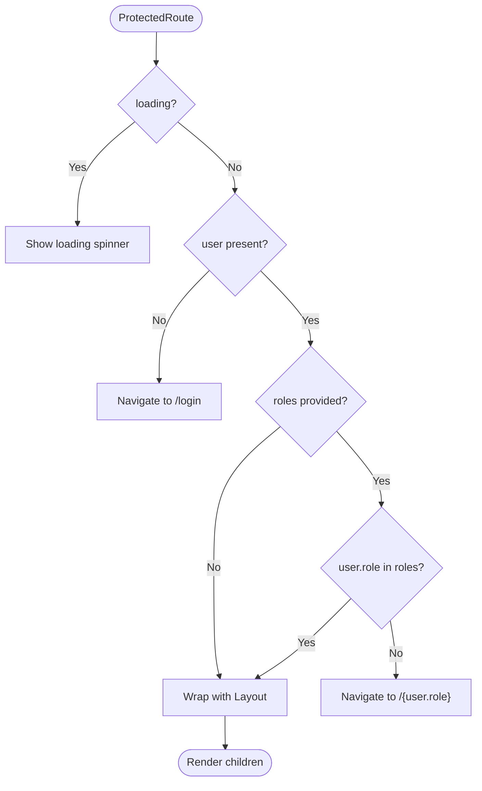
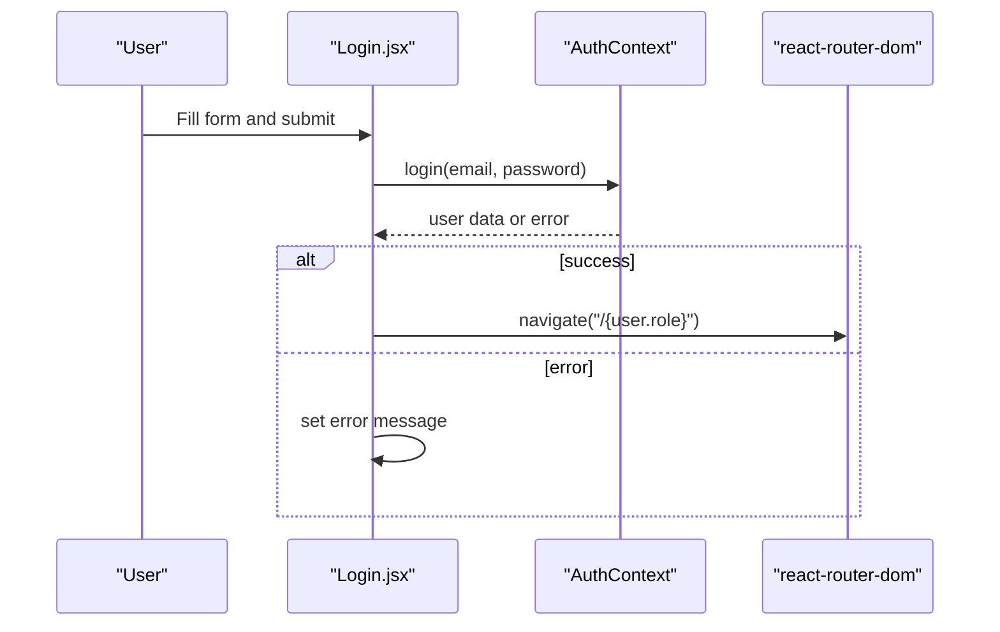
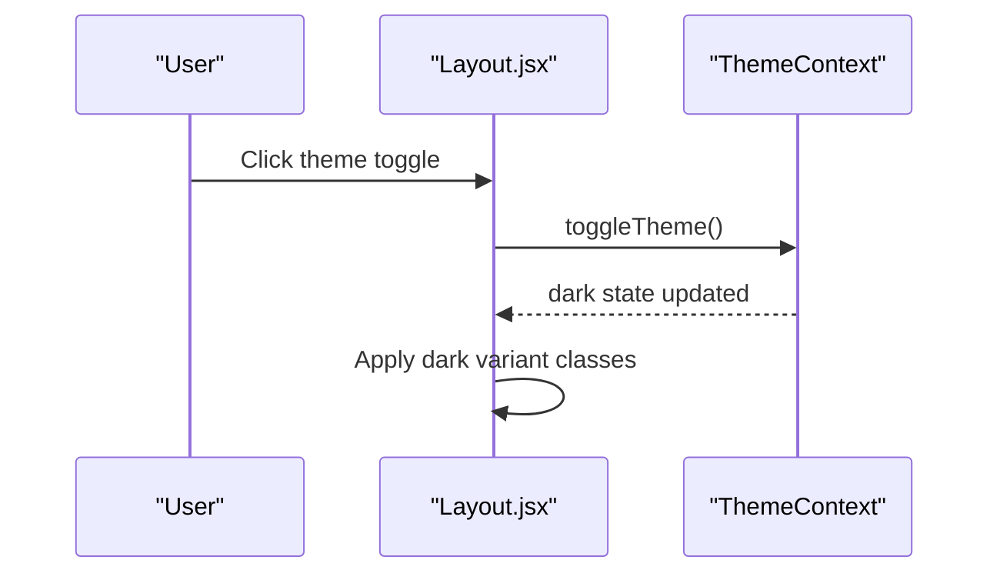
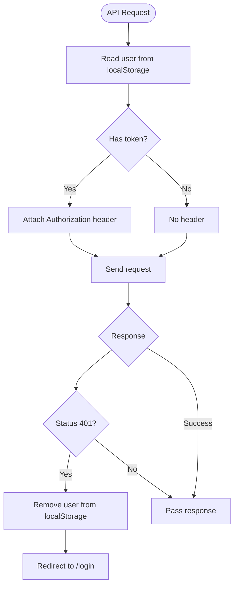
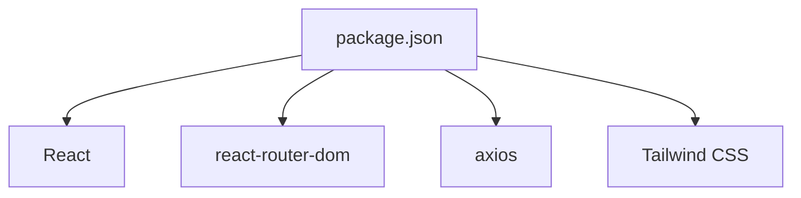

# Context Providers

<cite>
**Referenced Files in This Document**
- [AuthContext.jsx](file://client/src/context/AuthContext.jsx)
- [ThemeContext.jsx](file://client/src/context/ThemeContext.jsx)
- [App.jsx](file://client/src/App.jsx)
- [Layout.jsx](file://client/src/components/Layout.jsx)
- [Login.jsx](file://client/src/pages/auth/Login.jsx)
- [api.js](file://client/src/api.js)
- [main.jsx](file://client/src/main.jsx)
- [index.css](file://client/src/index.css)
- [package.json](file://client/package.json)
</cite>

## Table of Contents
1. [Introduction](#introduction)
2. [Project Structure](#project-structure)
3. [Core Components](#core-components)
4. [Architecture Overview](#architecture-overview)
5. [Detailed Component Analysis](#detailed-component-analysis)
6. [Dependency Analysis](#dependency-analysis)
7. [Performance Considerations](#performance-considerations)
8. [Troubleshooting Guide](#troubleshooting-guide)
9. [Conclusion](#conclusion)

## Introduction
This document provides comprehensive documentation for the React context providers used in the application: AuthContext and ThemeContext. It explains authentication state management, user session handling, login/logout functionality, protected route access, and theme switching mechanisms including dark/light mode persistence. Practical examples demonstrate how to consume context in components, handle authentication redirects, and implement theme-aware components. The document also covers provider composition, error boundaries, and performance optimization techniques.

## Project Structure
The client-side application is organized around context providers that wrap the routing layer. The main entry point renders the application, which then composes the ThemeProvider and AuthProvider around the route definitions. Protected routes enforce role-based access and redirect unauthenticated users to the login page.

**Diagram sources**
- [main.jsx:1-11](file://client/src/main.jsx#L1-L11)
- [App.jsx:74-84](file://client/src/App.jsx#L74-L84)
- [ThemeContext.jsx:7-25](file://client/src/context/ThemeContext.jsx#L7-L25)
- [AuthContext.jsx:8-52](file://client/src/context/AuthContext.jsx#L8-L52)
- [App.jsx:26-72](file://client/src/App.jsx#L26-L72)
- [Login.jsx:6-27](file://client/src/pages/auth/Login.jsx#L6-L27)
- [Layout.jsx:51-142](file://client/src/components/Layout.jsx#L51-L142)

**Section sources**
- [main.jsx:1-11](file://client/src/main.jsx#L1-L11)
- [App.jsx:74-84](file://client/src/App.jsx#L74-L84)

## Core Components
This section documents the two primary context providers and their responsibilities.

- AuthContext
  - Manages authentication state, including user data, loading state, and actions for login, registration, logout, and profile updates.
  - Persists user data to localStorage to maintain session across browser reloads.
  - Exposes a hook useAuth for consuming context values.

- ThemeContext
  - Manages theme state (dark/light) and provides a toggle function.
  - Persists theme preference to localStorage and applies the appropriate variant class to the document root for Tailwind dark mode.
  - Exposes a hook useTheme for consuming context values.

**Section sources**
- [AuthContext.jsx:1-53](file://client/src/context/AuthContext.jsx#L1-L53)
- [ThemeContext.jsx:1-26](file://client/src/context/ThemeContext.jsx#L1-L26)

## Architecture Overview
The application composes providers around the routing layer. The ThemeProvider wraps the entire app to enable theme-aware rendering. The AuthProvider wraps the routing layer to enable authentication-aware routing and component consumption. ProtectedRoute enforces authentication and role-based access, redirecting unauthenticated users to the login page and unauthorized roles to the user’s default route.

**Diagram sources**
- [main.jsx:6-10](file://client/src/main.jsx#L6-L10)
- [App.jsx:74-84](file://client/src/App.jsx#L74-L84)
- [ThemeContext.jsx:7-25](file://client/src/context/ThemeContext.jsx#L7-L25)
- [AuthContext.jsx:8-52](file://client/src/context/AuthContext.jsx#L8-L52)
- [App.jsx:18-24](file://client/src/App.jsx#L18-L24)
- [App.jsx:26-72](file://client/src/App.jsx#L26-L72)
- [Login.jsx:6-27](file://client/src/pages/auth/Login.jsx#L6-L27)
- [Layout.jsx:51-142](file://client/src/components/Layout.jsx#L51-L142)

## Detailed Component Analysis

### AuthContext Provider
AuthContext manages authentication state and exposes actions for login, registration, logout, and profile updates. It initializes from localStorage and persists changes back to localStorage. The provider exposes user, loading, login, register, logout, updateProfile.

Key behaviors:
- Initialization: On mount, reads user from localStorage and sets loading to false.
- Login: Posts credentials to the backend, sets user state, and stores user in localStorage.
- Register: Posts user data to the backend, sets user state, and stores user in localStorage.
- Logout: Clears user state and removes user from localStorage.
- Update Profile: Patches profile data via API, merges changes into user state, and updates localStorage.
- Loading: Provides a loading flag during initial hydration.

**Diagram sources**
- [AuthContext.jsx:8-52](file://client/src/context/AuthContext.jsx#L8-L52)

**Section sources**
- [AuthContext.jsx:8-52](file://client/src/context/AuthContext.jsx#L8-L52)

### ThemeContext Provider
ThemeContext manages theme state and toggles between dark and light modes. It reads the saved theme from localStorage on mount and applies the appropriate variant class to the document root. The provider exposes dark and toggleTheme.

Key behaviors:
- Initialization: Reads theme from localStorage; defaults to light if not present.
- Persistence: Updates localStorage and applies the dark variant class to document.documentElement on change.
- Toggle: Switches between dark and light modes.

**Diagram sources**
- [ThemeContext.jsx:7-25](file://client/src/context/ThemeContext.jsx#L7-L25)

**Section sources**
- [ThemeContext.jsx:7-25](file://client/src/context/ThemeContext.jsx#L7-L25)

### ProtectedRoute and Authentication Redirects
ProtectedRoute enforces authentication and role-based access. It checks the user state and loading flag, redirects unauthenticated users to the login page, and redirects unauthorized roles to the user’s default route.

Key behaviors:
- Loading state: Renders a spinner while user state is being hydrated.
- Unauthenticated: Redirects to /login.
- Unauthorized roles: Redirects to the user’s role path.
- Authorized: Wraps children with Layout.

**Diagram sources**
- [App.jsx:18-24](file://client/src/App.jsx#L18-L24)

**Section sources**
- [App.jsx:18-24](file://client/src/App.jsx#L18-L24)

### Login Component Integration
The Login component consumes AuthContext to perform login, handles errors, and navigates to the user’s role path upon successful authentication. It displays form inputs, password visibility toggle, demo accounts, and error messages.

Key behaviors:
- Form state: Tracks email, password, showPassword, error, loading.
- Submit handler: Calls login action, sets error on failure, and navigates on success.
- Demo accounts: Populates form fields for quick testing.

**Diagram sources**
- [Login.jsx:6-27](file://client/src/pages/auth/Login.jsx#L6-L27)
- [AuthContext.jsx:20-25](file://client/src/context/AuthContext.jsx#L20-L25)

**Section sources**
- [Login.jsx:6-27](file://client/src/pages/auth/Login.jsx#L6-L27)

### Theme-Aware Components
Theme-aware components consume ThemeContext to toggle themes and apply dark mode styles. The Layout component demonstrates theme-aware navigation, sidebar, header, and profile dropdown styling.

Key behaviors:
- Theme toggle: Calls toggleTheme to flip dark state.
- Dark mode styling: Uses Tailwind dark variant classes for consistent styling across components.

**Diagram sources**
- [Layout.jsx:51-142](file://client/src/components/Layout.jsx#L51-L142)
- [ThemeContext.jsx:18](file://client/src/context/ThemeContext.jsx#L18)

**Section sources**
- [Layout.jsx:51-142](file://client/src/components/Layout.jsx#L51-L142)

### API Integration and Token Handling
The API module integrates with localStorage to attach Authorization headers and handles 401 responses by removing the user and redirecting to the login page.

Key behaviors:
- Request interceptor: Reads user from localStorage and attaches Authorization header if token exists.
- Response interceptor: On 401, clears user and redirects to /login.

**Diagram sources**
- [api.js:8-25](file://client/src/api.js#L8-L25)

**Section sources**
- [api.js:8-25](file://client/src/api.js#L8-L25)

## Dependency Analysis
The application depends on React, react-router-dom, axios, and Tailwind CSS. The providers rely on these libraries for state management, routing, HTTP requests, and styling.

**Diagram sources**
- [package.json:12-32](file://client/package.json#L12-L32)

**Section sources**
- [package.json:12-32](file://client/package.json#L12-L32)

## Performance Considerations
- Provider Composition: Keep providers close to the root to minimize re-renders. The current composition in App.jsx ensures ThemeProvider and AuthProvider wrap the entire routing layer efficiently.
- LocalStorage Access: Both contexts read/write localStorage on mount and on state changes. This is lightweight but avoid excessive writes by batching updates where possible.
- Loading States: Use loading flags during hydration to prevent unnecessary computations until user state is ready.
- Theme Persistence: Applying the dark variant class to document.documentElement is efficient and avoids deep DOM traversal.
- ProtectedRoute Rendering: The loading spinner prevents unnecessary layout calculations while user state is being hydrated.

## Troubleshooting Guide
Common issues and resolutions:
- Authentication Redirect Loops
  - Cause: User state is null during hydration, causing immediate redirect to /login.
  - Resolution: Ensure ProtectedRoute renders a loading state while user is hydrating.
  - Reference: [App.jsx:18-24](file://client/src/App.jsx#L18-L24)

- 401 Unauthorized Errors
  - Cause: Missing or expired token in localStorage.
  - Resolution: API interceptor automatically removes user and redirects to /login on 401.
  - Reference: [api.js:16-25](file://client/src/api.js#L16-L25)

- Theme Not Persisting
  - Cause: localStorage not accessible or blocked.
  - Resolution: Verify localStorage availability and ensure ThemeProvider runs before any theme-dependent rendering.
  - Reference: [ThemeContext.jsx:7-25](file://client/src/context/ThemeContext.jsx#L7-L25)

- Styling Issues with Dark Mode
  - Cause: Tailwind dark variant not applied to document root.
  - Resolution: Confirm ThemeProvider updates document.documentElement.classList and that index.css defines the dark variant.
  - References: [ThemeContext.jsx:13-16](file://client/src/context/ThemeContext.jsx#L13-L16), [index.css:3](file://client/src/index.css#L3)

- Login Form Errors
  - Cause: Network errors or invalid credentials.
  - Resolution: Display error messages from the server response and disable submit button during loading.
  - Reference: [Login.jsx:15-27](file://client/src/pages/auth/Login.jsx#L15-L27)

**Section sources**
- [App.jsx:18-24](file://client/src/App.jsx#L18-L24)
- [api.js:16-25](file://client/src/api.js#L16-L25)
- [ThemeContext.jsx:7-25](file://client/src/context/ThemeContext.jsx#L7-L25)
- [index.css:3](file://client/src/index.css#L3)
- [Login.jsx:15-27](file://client/src/pages/auth/Login.jsx#L15-L27)

## Conclusion
The AuthContext and ThemeContext provide robust state management for authentication and theming. They integrate seamlessly with the routing layer to enforce protected routes and deliver a responsive, theme-aware user interface. By following the patterns outlined here—provider composition, controlled hydration, and persistent state—you can extend the application with additional contexts and maintain consistent behavior across components.