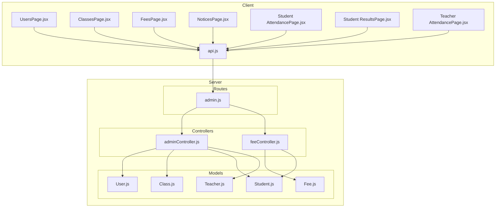
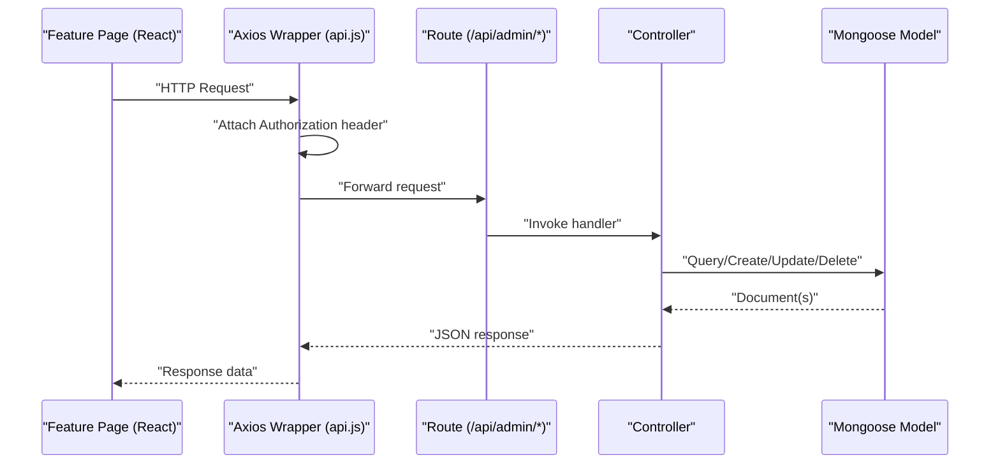
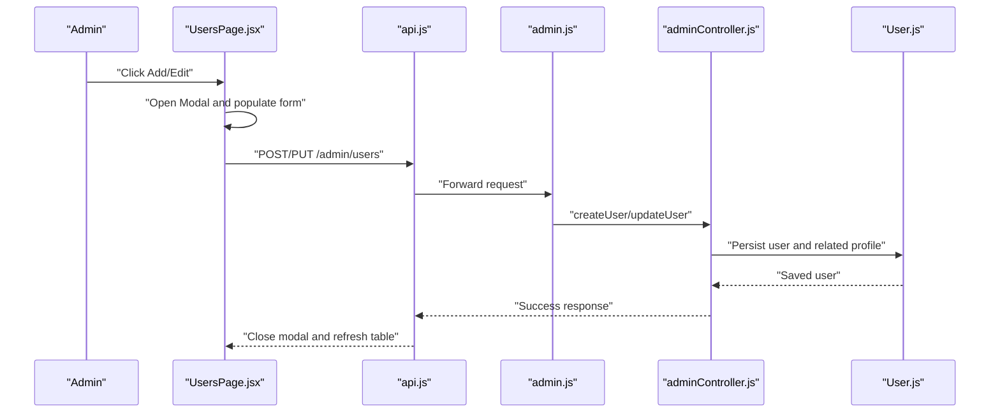
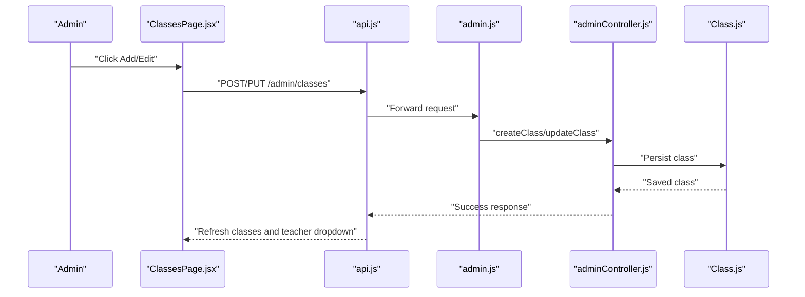
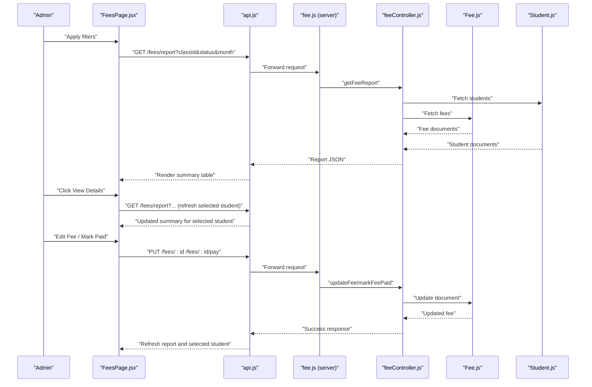
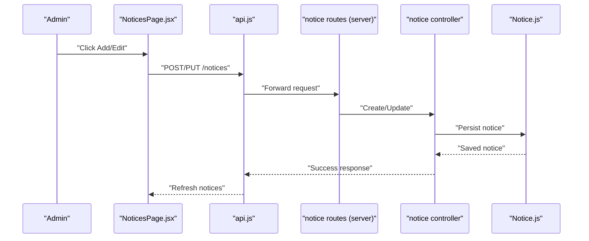
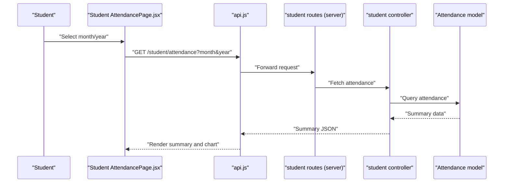
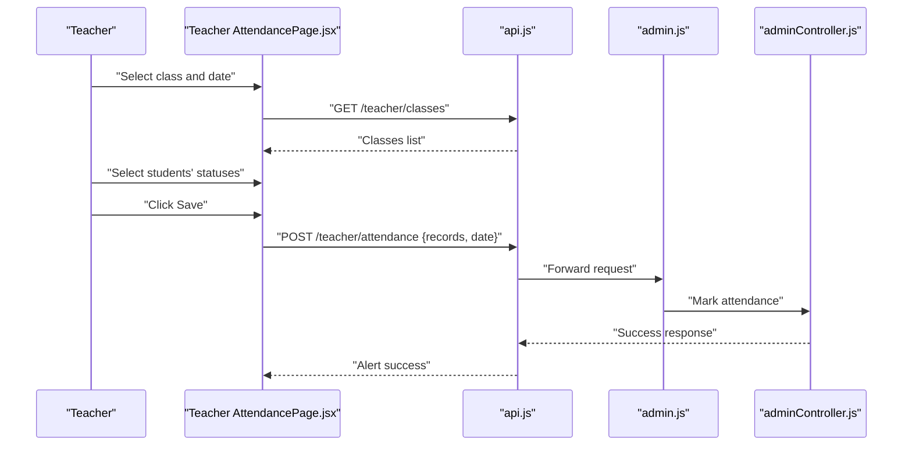
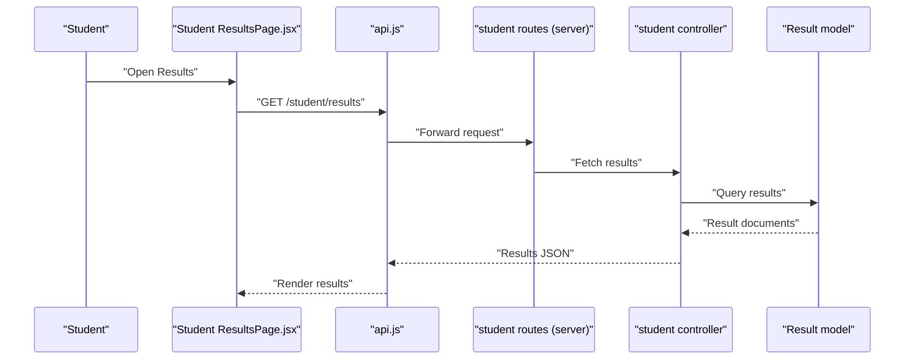
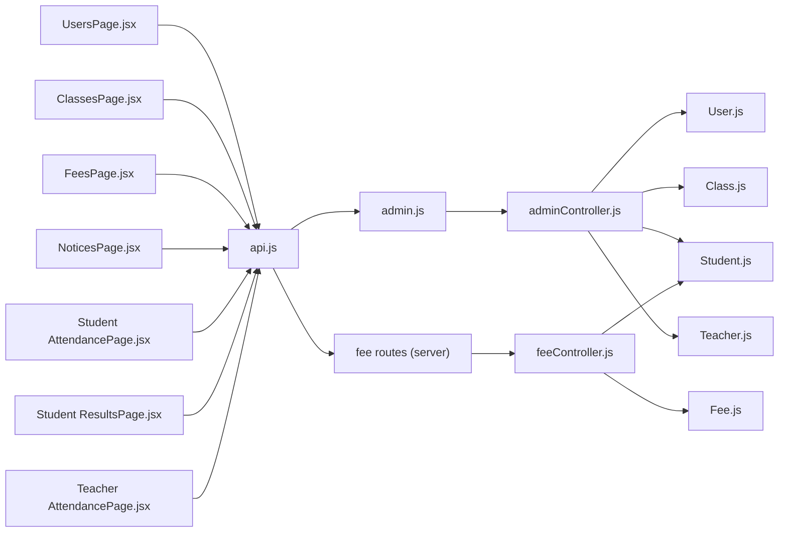

# Feature Pages

<cite>
**Referenced Files in This Document**
- [UsersPage.jsx](file://client/src/pages/admin/UsersPage.jsx)
- [ClassesPage.jsx](file://client/src/pages/admin/ClassesPage.jsx)
- [FeesPage.jsx](file://client/src/pages/admin/FeesPage.jsx)
- [NoticesPage.jsx](file://client/src/pages/admin/NoticesPage.jsx)
- [AttendancePage.jsx (Student)](file://client/src/pages/student/AttendancePage.jsx)
- [ResultsPage.jsx (Student)](file://client/src/pages/student/ResultsPage.jsx)
- [AttendancePage.jsx (Teacher)](file://client/src/pages/teacher/AttendancePage.jsx)
- [api.js](file://client/src/api.js)
- [adminController.js](file://server/controllers/adminController.js)
- [feeController.js](file://server/controllers/feeController.js)
- [User.js](file://server/models/User.js)
- [Class.js](file://server/models/Class.js)
- [Fee.js](file://server/models/Fee.js)
- [Student.js](file://server/models/Student.js)
- [Teacher.js](file://server/models/Teacher.js)
- [admin.js](file://server/routes/admin.js)
</cite>

## Table of Contents
1. [Introduction](#introduction)
2. [Project Structure](#project-structure)
3. [Core Components](#core-components)
4. [Architecture Overview](#architecture-overview)
5. [Detailed Component Analysis](#detailed-component-analysis)
6. [Dependency Analysis](#dependency-analysis)
7. [Performance Considerations](#performance-considerations)
8. [Troubleshooting Guide](#troubleshooting-guide)
9. [Conclusion](#conclusion)

## Introduction
This document explains the specialized feature pages for user management, class management, fee processing, notice board, attendance tracking, and academic results. It covers CRUD operations, data tables, filtering/sorting, form-based entry, role-specific implementations, validation, bulk operations, and export functionality. It also includes diagrams for component interactions, API flows, and data models to aid understanding for both technical and non-technical readers.

## Project Structure
The feature pages are React components under the client application, communicating with a Node/Express backend via an Axios-based API wrapper. The backend exposes REST endpoints grouped by roles and features, backed by Mongoose models.

**Diagram sources**
- [UsersPage.jsx:1-195](file://client/src/pages/admin/UsersPage.jsx#L1-L195)
- [ClassesPage.jsx:1-82](file://client/src/pages/admin/ClassesPage.jsx#L1-L82)
- [FeesPage.jsx:1-379](file://client/src/pages/admin/FeesPage.jsx#L1-L379)
- [NoticesPage.jsx:1-86](file://client/src/pages/admin/NoticesPage.jsx#L1-L86)
- [AttendancePage.jsx (Student):1-67](file://client/src/pages/student/AttendancePage.jsx#L1-L67)
- [ResultsPage.jsx (Student):1-48](file://client/src/pages/student/ResultsPage.jsx#L1-L48)
- [AttendancePage.jsx (Teacher):1-75](file://client/src/pages/teacher/AttendancePage.jsx#L1-L75)
- [api.js:1-28](file://client/src/api.js#L1-L28)
- [admin.js:1-20](file://server/routes/admin.js#L1-L20)
- [adminController.js:1-158](file://server/controllers/adminController.js#L1-L158)
- [feeController.js:1-119](file://server/controllers/feeController.js#L1-L119)
- [User.js:1-27](file://server/models/User.js#L1-L27)
- [Class.js:1-11](file://server/models/Class.js#L1-L11)
- [Fee.js:1-17](file://server/models/Fee.js#L1-L17)
- [Student.js:1-16](file://server/models/Student.js#L1-L16)
- [Teacher.js:1-13](file://server/models/Teacher.js#L1-L13)

**Section sources**
- [UsersPage.jsx:1-195](file://client/src/pages/admin/UsersPage.jsx#L1-L195)
- [ClassesPage.jsx:1-82](file://client/src/pages/admin/ClassesPage.jsx#L1-L82)
- [FeesPage.jsx:1-379](file://client/src/pages/admin/FeesPage.jsx#L1-L379)
- [NoticesPage.jsx:1-86](file://client/src/pages/admin/NoticesPage.jsx#L1-L86)
- [AttendancePage.jsx (Student):1-67](file://client/src/pages/student/AttendancePage.jsx#L1-L67)
- [ResultsPage.jsx (Student):1-48](file://client/src/pages/student/ResultsPage.jsx#L1-L48)
- [AttendancePage.jsx (Teacher):1-75](file://client/src/pages/teacher/AttendancePage.jsx#L1-L75)
- [api.js:1-28](file://client/src/api.js#L1-L28)
- [admin.js:1-20](file://server/routes/admin.js#L1-L20)

## Core Components
- User Management (Admin): CRUD for users with role-aware forms, pagination, search, and role filters. Uses a modal dialog for create/edit and a confirmation dialog for delete.
- Class Management (Admin): CRUD for classes with teacher assignment dropdown and class cards layout.
- Fee Management (Admin): Fee report with filters (class, status, month), student-level detail view, inline editing, and “mark paid” actions.
- Notice Board (Admin): CRUD for notices with categories, target roles, and pinning.
- Attendance Tracking (Student): Monthly attendance summary and chart for a logged-in student.
- Attendance Tracking (Teacher): Bulk marking of attendance for a selected class and date.
- Academic Results (Student): List of results with grades and remarks.

**Section sources**
- [UsersPage.jsx:1-195](file://client/src/pages/admin/UsersPage.jsx#L1-L195)
- [ClassesPage.jsx:1-82](file://client/src/pages/admin/ClassesPage.jsx#L1-L82)
- [FeesPage.jsx:1-379](file://client/src/pages/admin/FeesPage.jsx#L1-L379)
- [NoticesPage.jsx:1-86](file://client/src/pages/admin/NoticesPage.jsx#L1-L86)
- [AttendancePage.jsx (Student):1-67](file://client/src/pages/student/AttendancePage.jsx#L1-L67)
- [ResultsPage.jsx (Student):1-48](file://client/src/pages/student/ResultsPage.jsx#L1-L48)
- [AttendancePage.jsx (Teacher):1-75](file://client/src/pages/teacher/AttendancePage.jsx#L1-L75)

## Architecture Overview
The client components call the API wrapper, which injects authentication tokens and handles 401 responses. Routes delegate to controllers that query Mongoose models and return structured JSON.

**Diagram sources**
- [api.js:1-28](file://client/src/api.js#L1-L28)
- [admin.js:1-20](file://server/routes/admin.js#L1-L20)
- [adminController.js:1-158](file://server/controllers/adminController.js#L1-L158)
- [feeController.js:1-119](file://server/controllers/feeController.js#L1-L119)
- [User.js:1-27](file://server/models/User.js#L1-L27)
- [Class.js:1-11](file://server/models/Class.js#L1-L11)
- [Fee.js:1-17](file://server/models/Fee.js#L1-L17)

## Detailed Component Analysis

### User Management (Admin)
- Purpose: Manage users across roles (admin, teacher, student, parent) with role-specific fields.
- Data table: Displays name, email, role, phone, and active status with action buttons.
- Filtering/sorting: Role filter and free-text search; pagination handled by backend.
- Forms: Modal dialog with dynamic fields based on role selection.
- Validation: Required fields enforced in the form; backend enforces uniqueness and constraints.
- Bulk operations: Not implemented here; single-user operations.
- Export: Not implemented; can be added via CSV generation client-side.
- Real-time updates: After create/update/delete, the table reloads data.

**Diagram sources**
- [UsersPage.jsx:1-195](file://client/src/pages/admin/UsersPage.jsx#L1-L195)
- [api.js:1-28](file://client/src/api.js#L1-L28)
- [admin.js:1-20](file://server/routes/admin.js#L1-L20)
- [adminController.js:55-98](file://server/controllers/adminController.js#L55-L98)
- [User.js:1-27](file://server/models/User.js#L1-L27)
- [Student.js:1-16](file://server/models/Student.js#L1-L16)
- [Teacher.js:1-13](file://server/models/Teacher.js#L1-L13)

**Section sources**
- [UsersPage.jsx:1-195](file://client/src/pages/admin/UsersPage.jsx#L1-L195)
- [adminController.js:19-98](file://server/controllers/adminController.js#L19-L98)
- [User.js:1-27](file://server/models/User.js#L1-L27)
- [Student.js:1-16](file://server/models/Student.js#L1-L16)
- [Teacher.js:1-13](file://server/models/Teacher.js#L1-L13)

### Class Management (Admin)
- Purpose: CRUD for classes and assigning a teacher to a class.
- Data presentation: Grid of class cards with teacher assignment dropdown.
- Forms: Modal dialog for create/edit; teacher dropdown populated from users endpoint.
- Validation: Required fields enforced in the form; backend validates uniqueness and referential integrity.
- Bulk operations: Not implemented; single-class operations.
- Export: Not implemented.
- Real-time updates: After save, the list reloads.

**Diagram sources**
- [ClassesPage.jsx:1-82](file://client/src/pages/admin/ClassesPage.jsx#L1-L82)
- [api.js:1-28](file://client/src/api.js#L1-L28)
- [admin.js:1-20](file://server/routes/admin.js#L1-L20)
- [adminController.js:100-157](file://server/controllers/adminController.js#L100-L157)
- [Class.js:1-11](file://server/models/Class.js#L1-L11)

**Section sources**
- [ClassesPage.jsx:1-82](file://client/src/pages/admin/ClassesPage.jsx#L1-L82)
- [adminController.js:100-157](file://server/controllers/adminController.js#L100-L157)
- [Class.js:1-11](file://server/models/Class.js#L1-L11)

### Fee Management (Admin)
- Purpose: Generate a consolidated fee report by class, status, and month; drill down to student-level details; edit fee records; mark payments.
- Data table: Student summaries with totals and status badges; click to view details.
- Filtering/sorting: Class, status, and month filters; backend sorts by month and due date.
- Forms: Inline editing modal for fee records; “mark paid” button updates status.
- Validation: Backend enforces numeric amounts, valid statuses, and required fields.
- Bulk operations: Not implemented; individual edits and payments.
- Export: Not implemented; can be added via CSV generation client-side.
- Real-time updates: After edits or payments, the report refreshes.

**Diagram sources**
- [FeesPage.jsx:1-379](file://client/src/pages/admin/FeesPage.jsx#L1-L379)
- [api.js:1-28](file://client/src/api.js#L1-L28)
- [feeController.js:42-119](file://server/controllers/feeController.js#L42-L119)
- [Fee.js:1-17](file://server/models/Fee.js#L1-L17)
- [Student.js:1-16](file://server/models/Student.js#L1-L16)

**Section sources**
- [FeesPage.jsx:1-379](file://client/src/pages/admin/FeesPage.jsx#L1-L379)
- [feeController.js:42-119](file://server/controllers/feeController.js#L42-L119)
- [Fee.js:1-17](file://server/models/Fee.js#L1-L17)
- [Student.js:1-16](file://server/models/Student.js#L1-L16)

### Notice Board (Admin)
- Purpose: Create, update, delete notices; categorize; target roles; pin important notices.
- Data presentation: List of notices with category badges and pinned highlight.
- Forms: Modal dialog with category and target roles selection.
- Validation: Backend enforces required fields and valid enums.
- Bulk operations: Not implemented; single-notice operations.
- Export: Not implemented.
- Real-time updates: After save, the list reloads.

**Diagram sources**
- [NoticesPage.jsx:1-86](file://client/src/pages/admin/NoticesPage.jsx#L1-L86)
- [api.js:1-28](file://client/src/api.js#L1-L28)
- [Notice.js:1-14](file://server/models/Notice.js#L1-L14)

**Section sources**
- [NoticesPage.jsx:1-86](file://client/src/pages/admin/NoticesPage.jsx#L1-L86)
- [Notice.js:1-14](file://server/models/Notice.js#L1-L14)

### Attendance Tracking (Student)
- Purpose: View monthly attendance summary and a bar chart for present/absent/late counts.
- Data table: Summary cards and a chart rendered with Recharts.
- Filtering/sorting: Month/year selectors; backend receives query parameters.
- Forms: None; read-only view.
- Validation: None; data is fetched from backend.
- Bulk operations: None; read-only.
- Export: Not implemented.
- Real-time updates: Data refreshes when month/year changes.

**Diagram sources**
- [AttendancePage.jsx (Student):1-67](file://client/src/pages/student/AttendancePage.jsx#L1-L67)
- [api.js:1-28](file://client/src/api.js#L1-L28)

**Section sources**
- [AttendancePage.jsx (Student):1-67](file://client/src/pages/student/AttendancePage.jsx#L1-L67)

### Attendance Tracking (Teacher)
- Purpose: Mark attendance for all students in a selected class on a given date.
- Data table: Roll number, name, and status buttons (present/absent/late).
- Forms: None; interactive buttons to set status.
- Validation: Client-side prevents saving without a class; backend validates records.
- Bulk operations: Save all selections at once.
- Export: Not implemented.
- Real-time updates: On successful save, a success alert is shown.

**Diagram sources**
- [AttendancePage.jsx (Teacher):1-75](file://client/src/pages/teacher/AttendancePage.jsx#L1-L75)
- [api.js:1-28](file://client/src/api.js#L1-L28)
- [admin.js:1-20](file://server/routes/admin.js#L1-L20)
- [adminController.js:139-146](file://server/controllers/adminController.js#L139-L146)

**Section sources**
- [AttendancePage.jsx (Teacher):1-75](file://client/src/pages/teacher/AttendancePage.jsx#L1-L75)
- [adminController.js:139-146](file://server/controllers/adminController.js#L139-L146)

### Academic Results (Student)
- Purpose: Display results with marks, total, and letter grades.
- Data presentation: List of result cards with grade badges.
- Filtering/sorting: None; displays all results.
- Forms: None; read-only view.
- Validation: None; data is fetched from backend.
- Bulk operations: None; read-only.
- Export: Not implemented.
- Real-time updates: Data loads on component mount.

**Diagram sources**
- [ResultsPage.jsx (Student):1-48](file://client/src/pages/student/ResultsPage.jsx#L1-L48)
- [api.js:1-28](file://client/src/api.js#L1-L28)

**Section sources**
- [ResultsPage.jsx (Student):1-48](file://client/src/pages/student/ResultsPage.jsx#L1-L48)

## Dependency Analysis
- Frontend dependencies:
  - React components depend on the Axios wrapper for HTTP requests.
  - Components use Lucide icons and Recharts for UI and charts.
- Backend dependencies:
  - Routes enforce authentication and authorization.
  - Controllers orchestrate queries and build responses.
  - Models define schemas and constraints.

**Diagram sources**
- [UsersPage.jsx:1-195](file://client/src/pages/admin/UsersPage.jsx#L1-L195)
- [ClassesPage.jsx:1-82](file://client/src/pages/admin/ClassesPage.jsx#L1-L82)
- [FeesPage.jsx:1-379](file://client/src/pages/admin/FeesPage.jsx#L1-L379)
- [NoticesPage.jsx:1-86](file://client/src/pages/admin/NoticesPage.jsx#L1-L86)
- [AttendancePage.jsx (Student):1-67](file://client/src/pages/student/AttendancePage.jsx#L1-L67)
- [ResultsPage.jsx (Student):1-48](file://client/src/pages/student/ResultsPage.jsx#L1-L48)
- [AttendancePage.jsx (Teacher):1-75](file://client/src/pages/teacher/AttendancePage.jsx#L1-L75)
- [api.js:1-28](file://client/src/api.js#L1-L28)
- [admin.js:1-20](file://server/routes/admin.js#L1-L20)
- [adminController.js:1-158](file://server/controllers/adminController.js#L1-L158)
- [feeController.js:1-119](file://server/controllers/feeController.js#L1-L119)
- [User.js:1-27](file://server/models/User.js#L1-L27)
- [Class.js:1-11](file://server/models/Class.js#L1-L11)
- [Fee.js:1-17](file://server/models/Fee.js#L1-L17)
- [Student.js:1-16](file://server/models/Student.js#L1-L16)
- [Teacher.js:1-13](file://server/models/Teacher.js#L1-L13)

**Section sources**
- [api.js:1-28](file://client/src/api.js#L1-L28)
- [admin.js:1-20](file://server/routes/admin.js#L1-L20)
- [adminController.js:1-158](file://server/controllers/adminController.js#L1-L158)
- [feeController.js:1-119](file://server/controllers/feeController.js#L1-L119)
- [User.js:1-27](file://server/models/User.js#L1-L27)
- [Class.js:1-11](file://server/models/Class.js#L1-L11)
- [Fee.js:1-17](file://server/models/Fee.js#L1-L17)
- [Student.js:1-16](file://server/models/Student.js#L1-L16)
- [Teacher.js:1-13](file://server/models/Teacher.js#L1-L13)

## Performance Considerations
- Pagination: User listing uses limit/page parameters to avoid large payloads.
- Filtering: Client-side filters (search, role) are mirrored server-side to reduce payload sizes.
- Rendering: Large tables should consider virtualization for better UX.
- Network: Centralized interceptors prevent redundant auth checks and unify error handling.
- Charts: Lazy-load Recharts to minimize initial bundle size.

[No sources needed since this section provides general guidance]

## Troubleshooting Guide
- Authentication errors:
  - The API interceptor clears local user data and redirects to login on 401 responses.
- Form submission failures:
  - Components show alerts with error messages returned by the server.
- Data not updating:
  - Ensure the component re-fetches data after create/update/delete operations.
- Missing dropdown options:
  - Verify that related endpoints (e.g., classes, parents) are called and resolved before rendering dependent forms.

**Section sources**
- [api.js:16-25](file://client/src/api.js#L16-L25)
- [UsersPage.jsx:52-54](file://client/src/pages/admin/UsersPage.jsx#L52-L54)
- [ClassesPage.jsx:26-29](file://client/src/pages/admin/ClassesPage.jsx#L26-L29)
- [FeesPage.jsx:27-41](file://client/src/pages/admin/FeesPage.jsx#L27-L41)
- [NoticesPage.jsx:15-22](file://client/src/pages/admin/NoticesPage.jsx#L15-L22)

## Conclusion
These feature pages provide a cohesive admin and role-specific student/teacher experience. They leverage a clean separation of concerns: React components for UI, Axios for HTTP, Express routes for endpoints, and Mongoose models for persistence. The design supports role-aware forms, filtering, and real-time updates, with straightforward paths to add export and advanced bulk operations.

[No sources needed since this section summarizes without analyzing specific files]