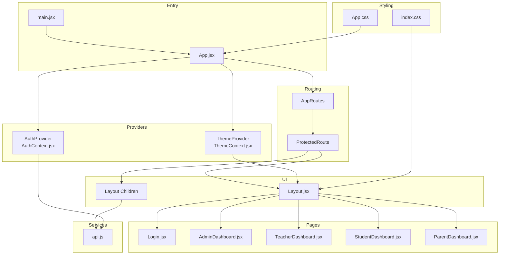
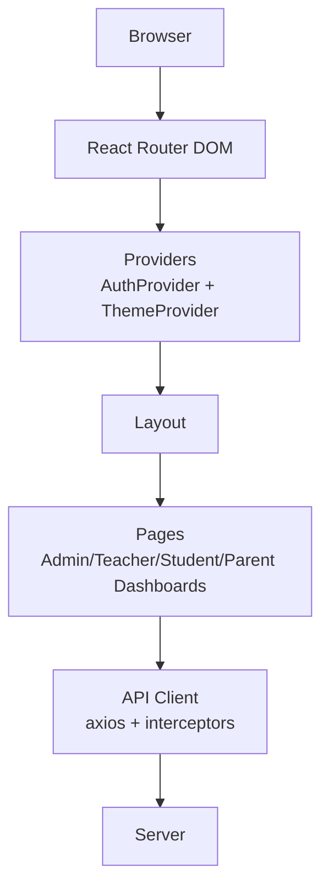
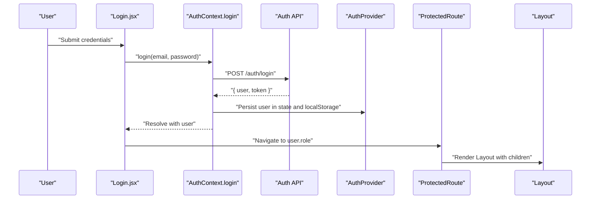
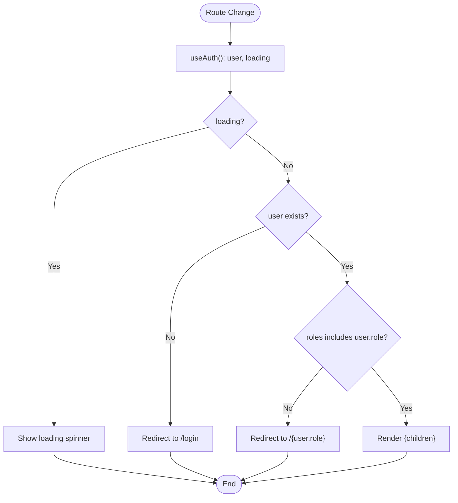
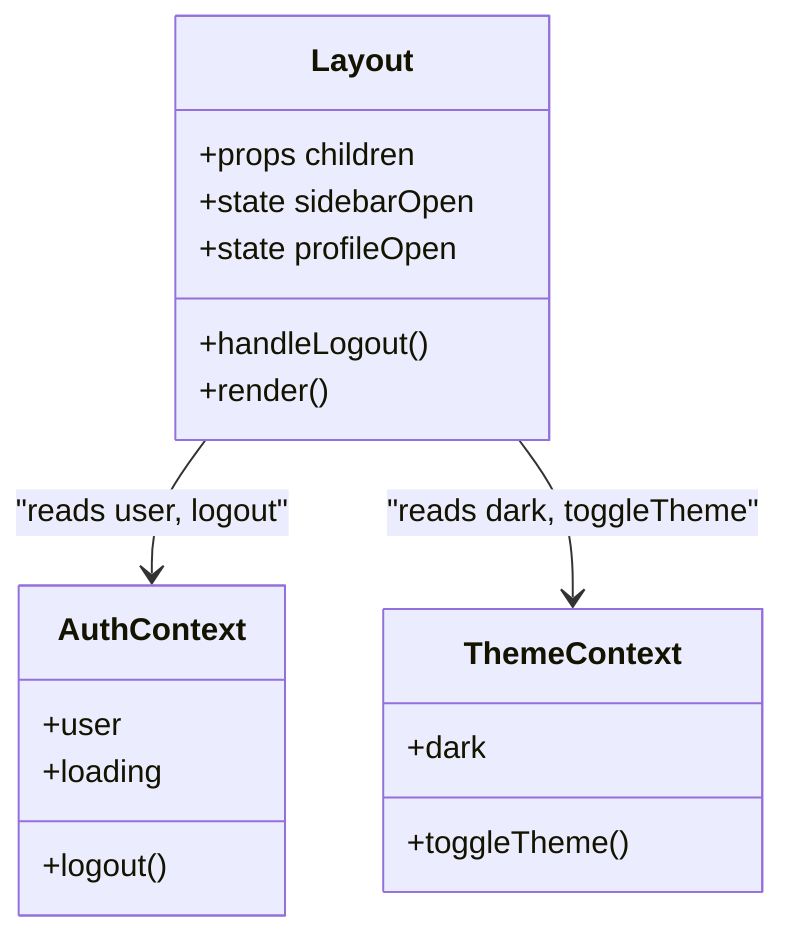
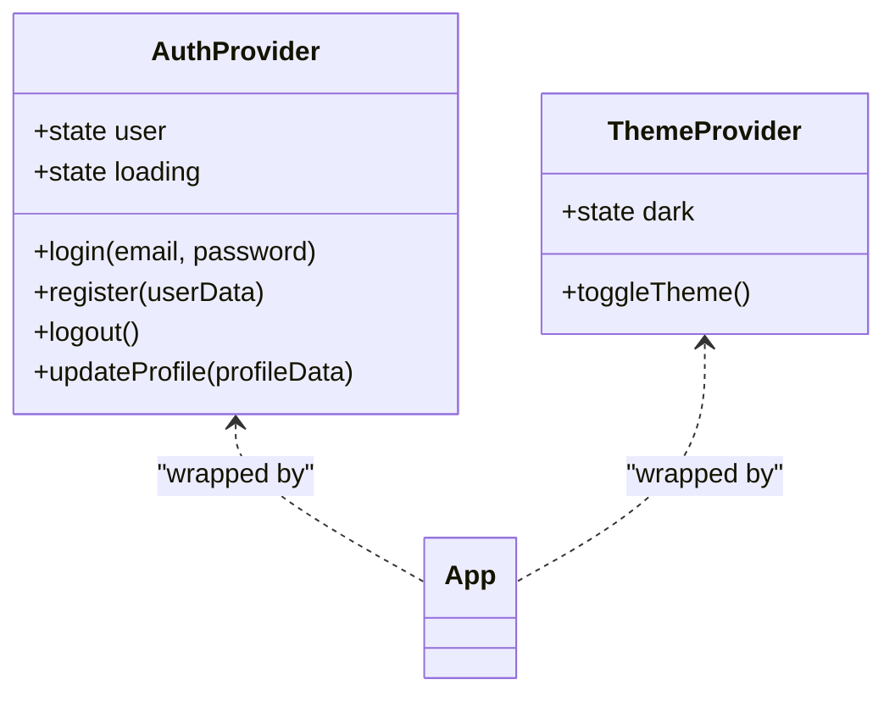
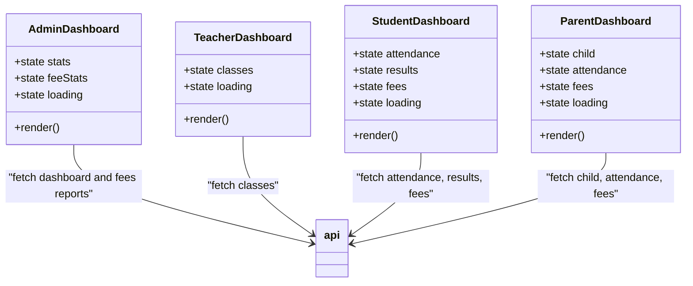
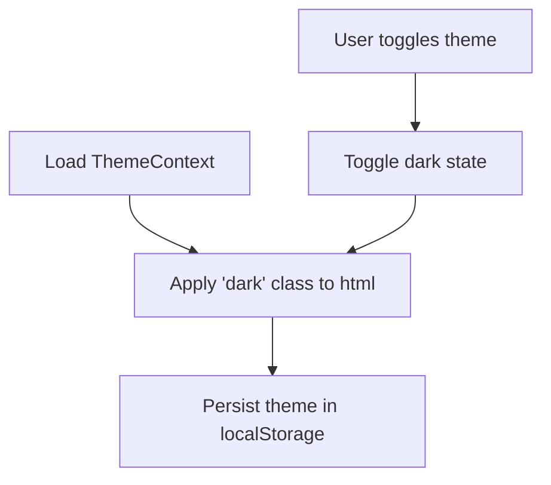
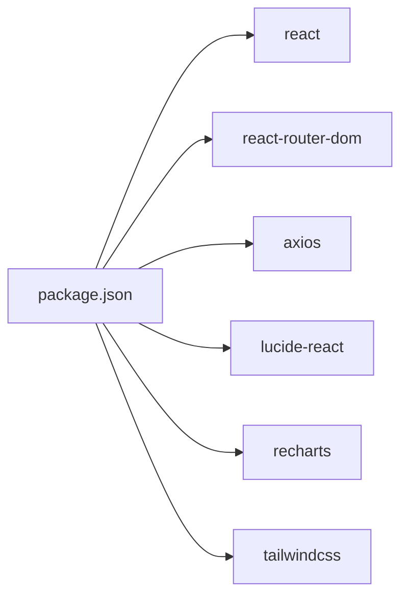

# Frontend Components

<cite>
**Referenced Files in This Document**
- [App.jsx](file://client/src/App.jsx)
- [main.jsx](file://client/src/main.jsx)
- [Layout.jsx](file://client/src/components/Layout.jsx)
- [AuthContext.jsx](file://client/src/context/AuthContext.jsx)
- [ThemeContext.jsx](file://client/src/context/ThemeContext.jsx)
- [Login.jsx](file://client/src/pages/auth/Login.jsx)
- [AdminDashboard.jsx](file://client/src/pages/admin/Dashboard.jsx)
- [TeacherDashboard.jsx](file://client/src/pages/teacher/Dashboard.jsx)
- [StudentDashboard.jsx](file://client/src/pages/student/Dashboard.jsx)
- [ParentDashboard.jsx](file://client/src/pages/parent/Dashboard.jsx)
- [api.js](file://client/src/api.js)
- [index.css](file://client/src/index.css)
- [App.css](file://client/src/App.css)
- [package.json](file://client/package.json)
</cite>

## Table of Contents
1. [Introduction](#introduction)
2. [Project Structure](#project-structure)
3. [Core Components](#core-components)
4. [Architecture Overview](#architecture-overview)
5. [Detailed Component Analysis](#detailed-component-analysis)
6. [Dependency Analysis](#dependency-analysis)
7. [Performance Considerations](#performance-considerations)
8. [Troubleshooting Guide](#troubleshooting-guide)
9. [Conclusion](#conclusion)
10. [Appendices](#appendices)

## Introduction
This document explains the frontend component architecture and reusable UI components for the EduManage application. It covers the component hierarchy, layout system, context providers (AuthContext, ThemeContext), routing and navigation patterns, responsive design, and styling approaches. It also provides usage examples, customization options, and best practices for extending the component library.

## Project Structure
The frontend is a React application bootstrapped with Vite. The structure organizes concerns by feature and cross-cutting concerns:
- Entry point renders the app inside providers.
- Routing defines protected routes per role and maps pages to roles.
- Layout composes the sidebar, header, and main content area.
- Context providers manage authentication and theme state.
- Pages implement role-specific dashboards and views.
- Styling leverages Tailwind CSS with a dark mode variant and custom CSS.

**Diagram sources**
- [main.jsx:1-11](file://client/src/main.jsx#L1-L11)
- [App.jsx:1-85](file://client/src/App.jsx#L1-L85)
- [AuthContext.jsx:1-53](file://client/src/context/AuthContext.jsx#L1-L53)
- [ThemeContext.jsx:1-26](file://client/src/context/ThemeContext.jsx#L1-L26)
- [Layout.jsx:1-143](file://client/src/components/Layout.jsx#L1-L143)
- [Login.jsx:1-100](file://client/src/pages/auth/Login.jsx#L1-L100)
- [AdminDashboard.jsx:1-110](file://client/src/pages/admin/Dashboard.jsx#L1-L110)
- [TeacherDashboard.jsx:1-56](file://client/src/pages/teacher/Dashboard.jsx#L1-L56)
- [StudentDashboard.jsx:1-57](file://client/src/pages/student/Dashboard.jsx#L1-L57)
- [ParentDashboard.jsx:1-59](file://client/src/pages/parent/Dashboard.jsx#L1-L59)
- [api.js:1-28](file://client/src/api.js#L1-L28)
- [index.css:1-36](file://client/src/index.css#L1-L36)
- [App.css:1-2](file://client/src/App.css#L1-L2)

**Section sources**
- [main.jsx:1-11](file://client/src/main.jsx#L1-L11)
- [App.jsx:1-85](file://client/src/App.jsx#L1-L85)
- [index.css:1-36](file://client/src/index.css#L1-L36)
- [App.css:1-2](file://client/src/App.css#L1-L2)

## Core Components
- App: Wraps the application with routing, theme provider, and auth provider. Defines protected routes and redirects.
- Layout: Provides a responsive sidebar, header, and main content area. Integrates AuthContext and ThemeContext.
- AuthContext: Centralizes authentication state, persistence, and actions (login, register, logout, updateProfile).
- ThemeContext: Manages light/dark theme preference and applies it to the document element.
- Login: Role-aware sign-in form with demo credentials and error handling.
- Pages: Role-specific dashboards and views (Admin, Teacher, Student, Parent).

Props and state management:
- App: Uses route guards via a ProtectedRoute wrapper and navigates based on user role.
- Layout: Maintains local state for sidebar and profile dropdown visibility; reads user and theme from contexts.
- AuthContext: Stores user and loading state; persists user to localStorage; exposes async actions.
- ThemeContext: Stores dark/light state; toggles document class and persists preference.
- Login: Manages form fields, submission state, and error messages.
- Pages: Manage local state for data fetching and rendering charts or lists.

Styling approach:
- Tailwind utility classes drive component styling with dark mode support via a custom dark variant.
- index.css defines global styles, custom CSS variables, and scrollbar styling.
- App.css is intentionally minimal and delegated to Tailwind.

Integration patterns:
- Providers are composed around AppRoutes to ensure all routes have access to context.
- Layout is injected into protected routes to standardize navigation and theming.
- API client injects Authorization headers and handles 401 responses.

**Section sources**
- [App.jsx:18-84](file://client/src/App.jsx#L18-L84)
- [Layout.jsx:51-142](file://client/src/components/Layout.jsx#L51-L142)
- [AuthContext.jsx:8-52](file://client/src/context/AuthContext.jsx#L8-L52)
- [ThemeContext.jsx:7-25](file://client/src/context/ThemeContext.jsx#L7-L25)
- [Login.jsx:6-99](file://client/src/pages/auth/Login.jsx#L6-L99)
- [AdminDashboard.jsx:8-109](file://client/src/pages/admin/Dashboard.jsx#L8-L109)
- [TeacherDashboard.jsx:5-55](file://client/src/pages/teacher/Dashboard.jsx#L5-L55)
- [StudentDashboard.jsx:5-56](file://client/src/pages/student/Dashboard.jsx#L5-L56)
- [ParentDashboard.jsx:5-58](file://client/src/pages/parent/Dashboard.jsx#L5-L58)
- [api.js:3-28](file://client/src/api.js#L3-L28)
- [index.css:1-36](file://client/src/index.css#L1-L36)
- [App.css:1-2](file://client/src/App.css#L1-L2)

## Architecture Overview
The frontend follows a layered architecture:
- Presentation layer: App, Layout, and page components.
- Routing layer: BrowserRouter, Routes, Route, and ProtectedRoute.
- State layer: AuthContext and ThemeContext.
- Services layer: API client with interceptors for auth and error handling.
- Styling layer: Tailwind CSS with dark mode variant and global customizations.

**Diagram sources**
- [App.jsx:1-85](file://client/src/App.jsx#L1-L85)
- [AuthContext.jsx:1-53](file://client/src/context/AuthContext.jsx#L1-L53)
- [ThemeContext.jsx:1-26](file://client/src/context/ThemeContext.jsx#L1-L26)
- [Layout.jsx:1-143](file://client/src/components/Layout.jsx#L1-L143)
- [AdminDashboard.jsx:1-110](file://client/src/pages/admin/Dashboard.jsx#L1-L110)
- [api.js:1-28](file://client/src/api.js#L1-L28)

## Detailed Component Analysis

### Authentication Flow
The authentication flow integrates the Login page, AuthContext, and API client.

**Diagram sources**
- [Login.jsx:15-27](file://client/src/pages/auth/Login.jsx#L15-L27)
- [AuthContext.jsx:20-25](file://client/src/context/AuthContext.jsx#L20-L25)
- [App.jsx:18-24](file://client/src/App.jsx#L18-L24)
- [Layout.jsx:51-142](file://client/src/components/Layout.jsx#L51-L142)

**Section sources**
- [Login.jsx:6-99](file://client/src/pages/auth/Login.jsx#L6-L99)
- [AuthContext.jsx:8-52](file://client/src/context/AuthContext.jsx#L8-L52)
- [App.jsx:18-84](file://client/src/App.jsx#L18-L84)

### Protected Routes and Navigation
ProtectedRoute enforces authentication and role checks, then renders Layout with children. AppRoutes maps role-based paths to page components.

**Diagram sources**
- [App.jsx:18-24](file://client/src/App.jsx#L18-L24)

**Section sources**
- [App.jsx:26-72](file://client/src/App.jsx#L26-L72)

### Layout Component
Layout composes:
- Sidebar with role-specific menu items.
- Header with theme toggle and profile dropdown.
- Main content area that renders children.

Responsibilities:
- Toggle sidebar on mobile.
- Toggle dark mode via ThemeContext.
- Provide profile actions (logout, profile link).
- Build menu items from user role.

**Diagram sources**
- [Layout.jsx:51-142](file://client/src/components/Layout.jsx#L51-L142)
- [AuthContext.jsx:6-6](file://client/src/context/AuthContext.jsx#L6-L6)
- [ThemeContext.jsx:5-5](file://client/src/context/ThemeContext.jsx#L5-L5)

**Section sources**
- [Layout.jsx:11-49](file://client/src/components/Layout.jsx#L11-L49)
- [Layout.jsx:51-142](file://client/src/components/Layout.jsx#L51-L142)

### Context Providers
- AuthProvider: Manages user session lifecycle and persistence.
- ThemeProvider: Manages theme preference and applies it to the document element.

**Diagram sources**
- [AuthContext.jsx:8-52](file://client/src/context/AuthContext.jsx#L8-L52)
- [ThemeContext.jsx:7-25](file://client/src/context/ThemeContext.jsx#L7-L25)
- [App.jsx:74-84](file://client/src/App.jsx#L74-L84)

**Section sources**
- [AuthContext.jsx:1-53](file://client/src/context/AuthContext.jsx#L1-L53)
- [ThemeContext.jsx:1-26](file://client/src/context/ThemeContext.jsx#L1-L26)

### Page Components
Each role dashboard fetches data and renders role-specific summaries and charts. They share common patterns:
- Local state for data and loading.
- useEffect to fetch data on mount.
- Conditional rendering for loading states.
- Tailwind-based layouts with responsive grids.

**Diagram sources**
- [AdminDashboard.jsx:8-109](file://client/src/pages/admin/Dashboard.jsx#L8-L109)
- [TeacherDashboard.jsx:5-55](file://client/src/pages/teacher/Dashboard.jsx#L5-L55)
- [StudentDashboard.jsx:5-56](file://client/src/pages/student/Dashboard.jsx#L5-L56)
- [ParentDashboard.jsx:5-58](file://client/src/pages/parent/Dashboard.jsx#L5-L58)
- [api.js:3-28](file://client/src/api.js#L3-L28)

**Section sources**
- [AdminDashboard.jsx:1-110](file://client/src/pages/admin/Dashboard.jsx#L1-L110)
- [TeacherDashboard.jsx:1-56](file://client/src/pages/teacher/Dashboard.jsx#L1-L56)
- [StudentDashboard.jsx:1-57](file://client/src/pages/student/Dashboard.jsx#L1-L57)
- [ParentDashboard.jsx:1-59](file://client/src/pages/parent/Dashboard.jsx#L1-L59)

### Styling and Responsive Design
- Tailwind utilities define component styles and responsive breakpoints.
- Dark mode is enabled via a custom dark variant and document class toggling.
- Global custom CSS variables and scrollbar styling enhance the theme.

**Diagram sources**
- [ThemeContext.jsx:7-25](file://client/src/context/ThemeContext.jsx#L7-L25)
- [index.css:3-35](file://client/src/index.css#L3-L35)

**Section sources**
- [index.css:1-36](file://client/src/index.css#L1-L36)
- [ThemeContext.jsx:7-25](file://client/src/context/ThemeContext.jsx#L7-L25)

## Dependency Analysis
External dependencies include React, React Router DOM, Axios, Lucide icons, and Recharts. Tailwind CSS is configured via Vite plugin.

**Diagram sources**
- [package.json:12-32](file://client/package.json#L12-L32)

**Section sources**
- [package.json:1-34](file://client/package.json#L1-L34)

## Performance Considerations
- Prefer lazy loading for heavy charts or large lists in pages.
- Debounce or throttle frequent UI updates (e.g., resize handlers).
- Use memoization for derived data computations in pages.
- Keep context providers granular to avoid unnecessary re-renders.
- Minimize DOM nodes in repeated lists; use virtualization for very large datasets.

## Troubleshooting Guide
Common issues and resolutions:
- Unauthorized requests: The API interceptor clears user state and redirects to login on 401 responses.
- Authentication loops: Ensure ProtectedRoute checks align with user role and that Layout receives children.
- Theme not persisting: Verify ThemeContext persists theme to localStorage and toggles the document class.
- Styling conflicts: Confirm Tailwind dark variant is applied and custom CSS does not override critical styles unintentionally.

**Section sources**
- [api.js:16-25](file://client/src/api.js#L16-L25)
- [App.jsx:18-24](file://client/src/App.jsx#L18-L24)
- [ThemeContext.jsx:13-16](file://client/src/context/ThemeContext.jsx#L13-L16)
- [index.css:3-35](file://client/src/index.css#L3-L35)

## Conclusion
The frontend employs a clean separation of concerns with role-based routing, shared layout, and context-driven state management. The component library emphasizes composability, responsive design, and consistent styling through Tailwind. Extending the library involves adding pages under the appropriate role folders, integrating with the existing Layout, and leveraging AuthContext and ThemeContext for state and theming.

## Appendices

### Usage Examples
- Add a new role page: Create a new file under the role’s folder and register a route in AppRoutes with ProtectedRoute and Layout.
- Customize Layout: Extend menuItems for new roles or modify header actions.
- Integrate charts: Use Recharts within page components and wrap containers with ResponsiveContainer for responsiveness.
- Theming: Use ThemeContext to toggle dark mode and rely on Tailwind’s dark variant for conditional styles.

### Customization Options
- Extend AuthContext: Add new actions (e.g., changePassword) and persist updated user data.
- Enhance Layout: Add new menu items, notifications, or quick actions.
- Styling: Adjust custom CSS variables in index.css and extend Tailwind utilities as needed.

### Best Practices
- Keep components small and focused; compose them in Layout.
- Centralize data fetching in page components and pass data down as props.
- Use semantic HTML and accessible ARIA attributes in interactive elements.
- Test responsive behavior across device sizes and ensure keyboard navigation works.