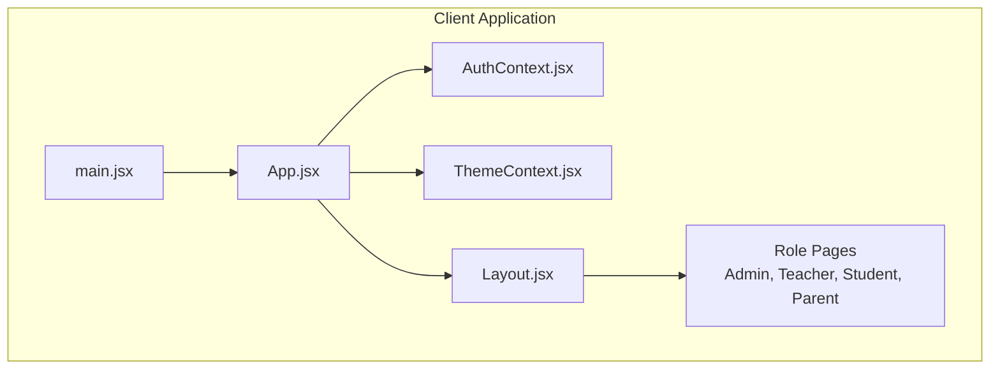
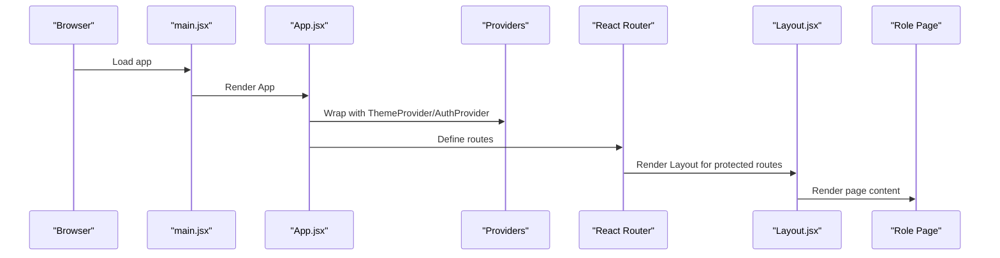
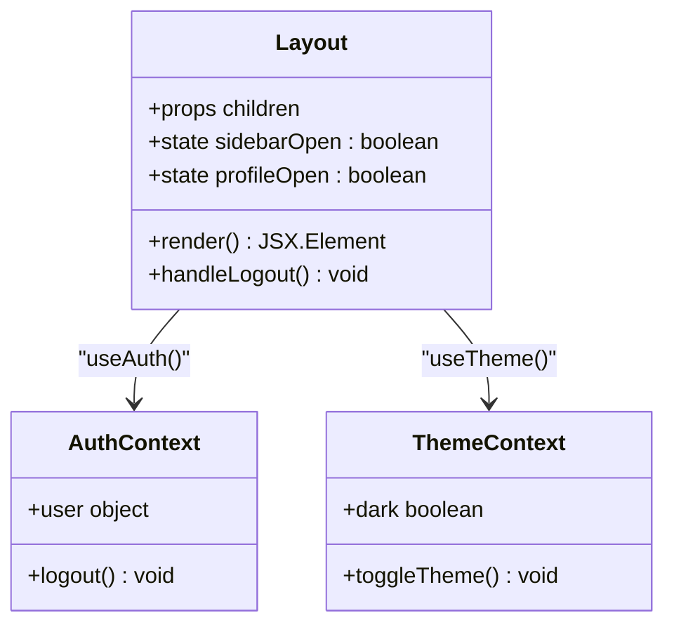
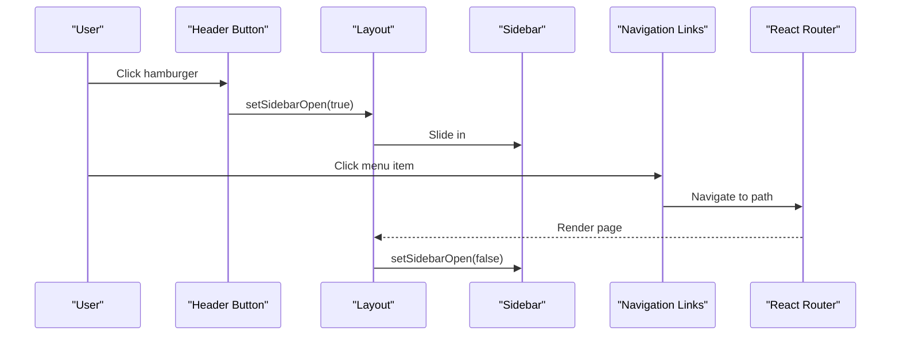
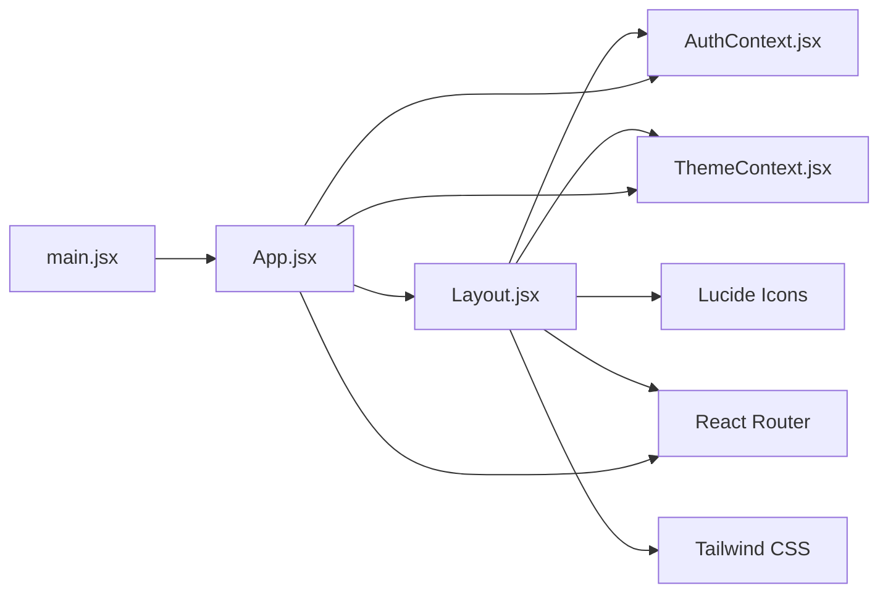

# Layout System

<cite>
**Referenced Files in This Document**
- [Layout.jsx](file://client/src/components/Layout.jsx)
- [ThemeContext.jsx](file://client/src/context/ThemeContext.jsx)
- [AuthContext.jsx](file://client/src/context/AuthContext.jsx)
- [App.jsx](file://client/src/App.jsx)
- [main.jsx](file://client/src/main.jsx)
- [index.css](file://client/src/index.css)
- [api.js](file://client/src/api.js)
- [Login.jsx](file://client/src/pages/auth/Login.jsx)
- [Dashboard.jsx (Admin)](file://client/src/pages/admin/Dashboard.jsx)
- [Dashboard.jsx (Teacher)](file://client/src/pages/teacher/Dashboard.jsx)
- [Dashboard.jsx (Student)](file://client/src/pages/student/Dashboard.jsx)
- [Dashboard.jsx (Parent)](file://client/src/pages/parent/Dashboard.jsx)
</cite>

## Table of Contents
1. [Introduction](#introduction)
2. [Project Structure](#project-structure)
3. [Core Components](#core-components)
4. [Architecture Overview](#architecture-overview)
5. [Detailed Component Analysis](#detailed-component-analysis)
6. [Dependency Analysis](#dependency-analysis)
7. [Performance Considerations](#performance-considerations)
8. [Troubleshooting Guide](#troubleshooting-guide)
9. [Conclusion](#conclusion)
10. [Appendices](#appendices)

## Introduction
This document explains the layout system that powers the responsive sidebar navigation, mobile hamburger menu, theme toggle, and user profile dropdown. It covers role-based menu rendering, navigation patterns, state management, customization examples, responsive breakpoints, Tailwind CSS styling, dark mode implementation, and accessibility considerations.

## Project Structure
The layout system is implemented as a React component integrated with React Router and two contexts: authentication and theme. The application bootstraps in main.jsx and wires providers around the routing tree in App.jsx. Pages under role-specific folders demonstrate how the layout wraps content.

**Diagram sources**
- [main.jsx:1-11](file://client/src/main.jsx#L1-L11)
- [App.jsx:74-84](file://client/src/App.jsx#L74-L84)
- [Layout.jsx:51-142](file://client/src/components/Layout.jsx#L51-L142)
- [AuthContext.jsx:8-51](file://client/src/context/AuthContext.jsx#L8-L51)
- [ThemeContext.jsx:7-25](file://client/src/context/ThemeContext.jsx#L7-L25)

**Section sources**
- [main.jsx:1-11](file://client/src/main.jsx#L1-L11)
- [App.jsx:1-85](file://client/src/App.jsx#L1-L85)

## Core Components
- Layout component: Provides responsive sidebar, header actions, and role-based menu rendering.
- ThemeContext: Manages dark/light mode state and persistence.
- AuthContext: Handles user session lifecycle and profile updates.
- ProtectedRoute wrapper: Guards routes by role and renders Layout around protected content.
- Tailwind CSS: Provides responsive utilities and dark mode variants.

Key responsibilities:
- Layout manages sidebar open/close state, profile dropdown visibility, and theme toggle.
- AuthContext persists user data and exposes login/logout/updateProfile.
- ThemeContext toggles the dark variant on the document element and persists preference.
- App.jsx defines route-to-role mapping and wraps pages with Layout via ProtectedRoute.

**Section sources**
- [Layout.jsx:51-142](file://client/src/components/Layout.jsx#L51-L142)
- [ThemeContext.jsx:7-25](file://client/src/context/ThemeContext.jsx#L7-L25)
- [AuthContext.jsx:8-51](file://client/src/context/AuthContext.jsx#L8-L51)
- [App.jsx:18-24](file://client/src/App.jsx#L18-L24)

## Architecture Overview
The layout system integrates with React Router to render role-specific pages inside a shared Layout. Authentication and theme states are globally available via contexts. The layout’s responsive behavior is driven by Tailwind’s breakpoint utilities.

**Diagram sources**
- [main.jsx:6-10](file://client/src/main.jsx#L6-L10)
- [App.jsx:74-84](file://client/src/App.jsx#L74-L84)
- [Layout.jsx:51-142](file://client/src/components/Layout.jsx#L51-L142)

## Detailed Component Analysis

### Layout Component
Responsibilities:
- Renders a responsive sidebar with role-based menu items.
- Implements a mobile hamburger menu with overlay and close button.
- Provides a theme toggle button in the header.
- Displays a user profile dropdown with profile and logout actions.
- Uses Tailwind classes for responsive behavior and dark mode styling.

State management:
- Local state for sidebarOpen and profileOpen toggles.
- Consumes user and logout from AuthContext.
- Consumes dark and toggleTheme from ThemeContext.

Role-based menu rendering:
- Menu items are defined per role and selected based on user.role.
- Navigation links are generated dynamically from the menuItems map.

Responsive behavior:
- Sidebar transforms off-screen on small screens and becomes static on large screens.
- Mobile overlay appears when sidebar is open.
- Header hamburger button is hidden on large screens.

Accessibility considerations:
- Buttons use semantic click handlers; consider adding aria-expanded and aria-controls attributes for improved screen reader support.
- Keyboard navigation is supported by default for interactive elements.

Styling approach:
- Tailwind utilities define responsive widths, spacing, colors, and dark mode variants.
- Dark mode is toggled via a custom dark variant selector in index.css.

**Section sources**
- [Layout.jsx:11-49](file://client/src/components/Layout.jsx#L11-L49)
- [Layout.jsx:51-142](file://client/src/components/Layout.jsx#L51-L142)
- [index.css:3](file://client/src/index.css#L3)

#### Layout Class Diagram

**Diagram sources**
- [Layout.jsx:51-142](file://client/src/components/Layout.jsx#L51-L142)
- [AuthContext.jsx:6](file://client/src/context/AuthContext.jsx#L6)
- [ThemeContext.jsx:5](file://client/src/context/ThemeContext.jsx#L5)

#### Layout Navigation Flow

**Diagram sources**
- [Layout.jsx:103-106](file://client/src/components/Layout.jsx#L103-L106)
- [Layout.jsx:68-93](file://client/src/components/Layout.jsx#L68-L93)
- [Layout.jsx:81-91](file://client/src/components/Layout.jsx#L81-L91)

### Theme Context
Responsibilities:
- Stores dark mode preference in localStorage.
- Applies the dark variant to the document element.
- Exposes toggleTheme to flip the mode.

Persistence:
- Reads initial theme from localStorage on mount.
- Writes theme selection back to localStorage on change.

Integration:
- Toggles the dark variant class on the root element, enabling Tailwind dark mode styles.

**Section sources**
- [ThemeContext.jsx:7-25](file://client/src/context/ThemeContext.jsx#L7-L25)
- [index.css:3](file://client/src/index.css#L3)

### Authentication Context
Responsibilities:
- Manages user session state and loading state.
- Persists user data to localStorage on login/register.
- Provides login, register, logout, and updateProfile functions.
- Integrates with API client for network requests.

Routing protection:
- ProtectedRoute checks user presence and role eligibility before rendering Layout.

**Section sources**
- [AuthContext.jsx:8-51](file://client/src/context/AuthContext.jsx#L8-L51)
- [App.jsx:18-24](file://client/src/App.jsx#L18-L24)

### ProtectedRoute Wrapper
Responsibilities:
- Blocks unauthenticated users and redirects to login.
- Blocks unauthorized roles and redirects to the user’s dashboard.
- Wraps children with Layout for authenticated, authorized users.

**Section sources**
- [App.jsx:18-24](file://client/src/App.jsx#L18-L24)

### Role-Based Menu Items
Structure:
- Four roles: admin, teacher, student, parent.
- Each role has a predefined list of menu items with path, icon, and label.
- The active role’s items are rendered in the sidebar.

Customization examples:
- Add a new role: Extend the menuItems object with a new role key and its items.
- Modify existing items: Adjust path, icon, or label for a given role.
- Add nested menus: Introduce a submenu structure and render conditionally in Layout.

**Section sources**
- [Layout.jsx:11-49](file://client/src/components/Layout.jsx#L11-L49)

### Navigation Patterns
- Dynamic menu generation based on user role.
- Programmatic navigation via useNavigate and Link.
- Protected routes ensure only authorized users can access role-specific pages.

**Section sources**
- [Layout.jsx:81-91](file://client/src/components/Layout.jsx#L81-L91)
- [App.jsx:26-72](file://client/src/App.jsx#L26-L72)

### Component State Management
- Layout maintains local state for sidebar and profile dropdown visibility.
- AuthContext maintains global user session state.
- ThemeContext maintains global dark mode state.

**Section sources**
- [Layout.jsx:55-56](file://client/src/components/Layout.jsx#L55-L56)
- [AuthContext.jsx:9-18](file://client/src/context/AuthContext.jsx#L9-L18)
- [ThemeContext.jsx:8-11](file://client/src/context/ThemeContext.jsx#L8-L11)

### Styling Approach Using Tailwind CSS
- Responsive utilities: lg: for large-screen behavior, hidden classes for mobile.
- Dark mode variants: dark:bg-gray-900, dark:text-white, dark:border-gray-700.
- Color tokens: indigo primary palette for branding and hover states.
- Layout container: min-h-screen, bg-gray-50 dark:bg-gray-900.

**Section sources**
- [Layout.jsx:66-142](file://client/src/components/Layout.jsx#L66-L142)
- [index.css:3](file://client/src/index.css#L3)

### Dark Mode Implementation
- ThemeContext toggles a boolean dark flag and applies the dark variant to the document element.
- Tailwind dark variant selector enables dark mode styles for components.
- Preference persisted in localStorage for continuity across sessions.

**Section sources**
- [ThemeContext.jsx:13-16](file://client/src/context/ThemeContext.jsx#L13-L16)
- [index.css:3](file://client/src/index.css#L3)

### Accessibility Considerations
- Buttons are interactive; consider adding aria-labels and aria-expanded for the profile dropdown and sidebar toggle.
- Keyboard navigation works for focusable elements; ensure focus management when opening/closing modals/dropdowns.
- Screen readers benefit from descriptive labels and proper heading hierarchy in pages.

[No sources needed since this section provides general guidance]

## Dependency Analysis
The layout system depends on React Router for navigation, Lucide icons for UI symbols, and Tailwind CSS for styling. Authentication and theme contexts provide global state.

**Diagram sources**
- [Layout.jsx:2-9](file://client/src/components/Layout.jsx#L2-L9)
- [App.jsx:1-4](file://client/src/App.jsx#L1-L4)
- [main.jsx:6-10](file://client/src/main.jsx#L6-L10)

**Section sources**
- [Layout.jsx:2-9](file://client/src/components/Layout.jsx#L2-L9)
- [App.jsx:1-4](file://client/src/App.jsx#L1-L4)
- [main.jsx:6-10](file://client/src/main.jsx#L6-L10)

## Performance Considerations
- Prefer lazy loading for heavy pages to reduce initial bundle size.
- Memoize menu items if dynamic generation becomes expensive.
- Debounce theme toggle if extended logic is added.
- Use CSS containment for large page containers to improve rendering performance.

[No sources needed since this section provides general guidance]

## Troubleshooting Guide
Common issues and resolutions:
- Theme not persisting: Verify localStorage availability and that the dark variant is applied to the document element.
- Sidebar not closing on mobile: Ensure overlay click handler and menu item click handlers call setSidebarOpen(false).
- Unauthorized access: Confirm ProtectedRoute roles match user.role and that the user object is present.
- Authentication errors: Check API interceptors for 401 handling and localStorage cleanup.

**Section sources**
- [ThemeContext.jsx:13-16](file://client/src/context/ThemeContext.jsx#L13-L16)
- [Layout.jsx:96-98](file://client/src/components/Layout.jsx#L96-L98)
- [App.jsx:18-24](file://client/src/App.jsx#L18-L24)
- [api.js:16-25](file://client/src/api.js#L16-L25)

## Conclusion
The layout system provides a robust, role-aware navigation foundation with responsive behavior, theme switching, and user profile controls. Its modular design allows easy customization of menu items, addition of new routes, and extension of responsive breakpoints. Combined with Tailwind CSS and context providers, it delivers a scalable and accessible UI framework.

## Appendices

### Customizing Menu Items
Steps:
- Extend the menuItems object with a new role or modify existing role entries.
- Add new paths in App.jsx ProtectedRoute definitions.
- Ensure icons are imported and used consistently.

Example references:
- [menuItems definition:11-49](file://client/src/components/Layout.jsx#L11-L49)
- [ProtectedRoute definitions:26-72](file://client/src/App.jsx#L26-L72)

### Adding New Navigation Routes
Steps:
- Define a new page component under the appropriate role folder.
- Register a new route in App.jsx ProtectedRoute with the desired roles.
- Add a corresponding menu item in the role’s menuItems entry.

Example references:
- [Admin dashboard page:8-109](file://client/src/pages/admin/Dashboard.jsx#L8-L109)
- [ProtectedRoute registration:32-43](file://client/src/App.jsx#L32-L43)

### Implementing Responsive Breakpoints
Breakpoints used:
- lg: Large screens (sidebar static, header actions visible).
- Hidden classes: Control mobile visibility of header and overlay.

Example references:
- [Sidebar responsive classes](file://client/src/components/Layout.jsx#L68)
- [Header hamburger responsive classes:103-106](file://client/src/components/Layout.jsx#L103-L106)
- [Overlay responsive behavior:96-98](file://client/src/components/Layout.jsx#L96-L98)

### Styling Reference
- Dark mode variant selector: dark: [&:where(.dark, .dark *)].
- Primary color tokens: --color-primary and related shades.
- Scrollbar styling for light/dark themes.

Example references:
- [Dark variant selector](file://client/src/index.css#L3)
- [Primary color tokens:5-9](file://client/src/index.css#L5-L9)
- [Scrollbar styling:22-35](file://client/src/index.css#L22-L35)

### Authentication Flow
- Login page collects credentials and invokes AuthContext.login.
- On success, user data is persisted and navigation redirects to the user’s role dashboard.
- API interceptor attaches Authorization header when user token exists.

Example references:
- [Login form submission:15-27](file://client/src/pages/auth/Login.jsx#L15-L27)
- [AuthContext login:20-25](file://client/src/context/AuthContext.jsx#L20-L25)
- [API interceptor:8-14](file://client/src/api.js#L8-L14)