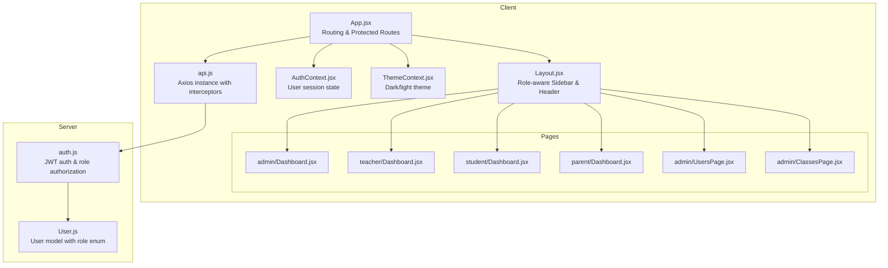
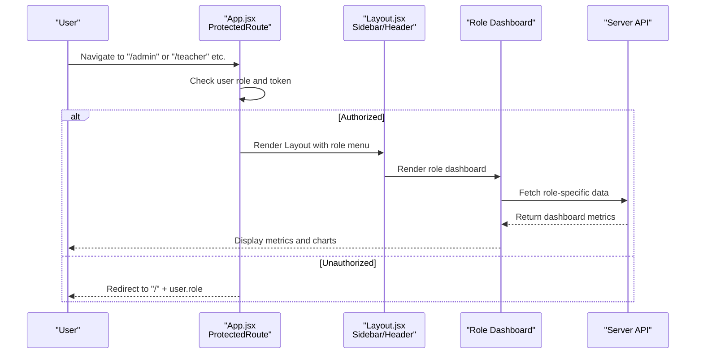
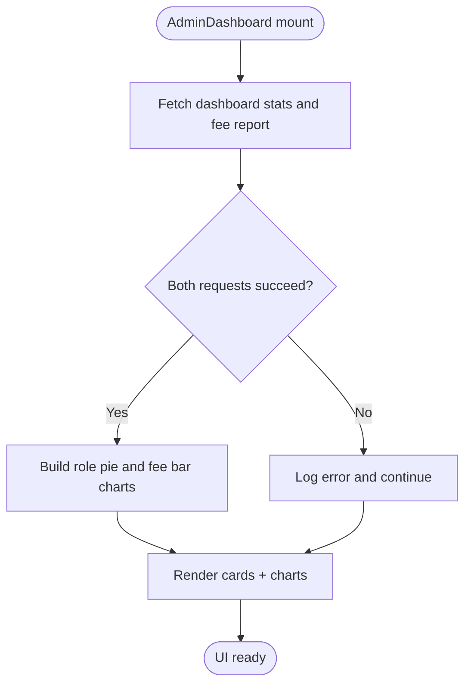
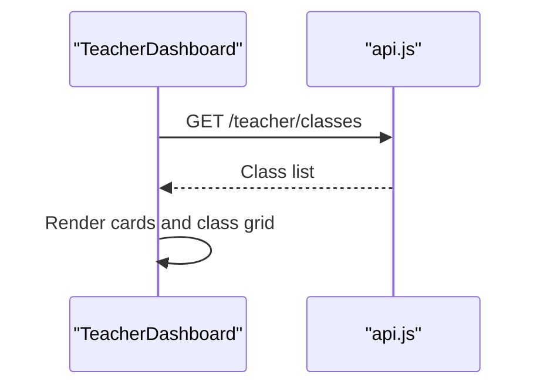
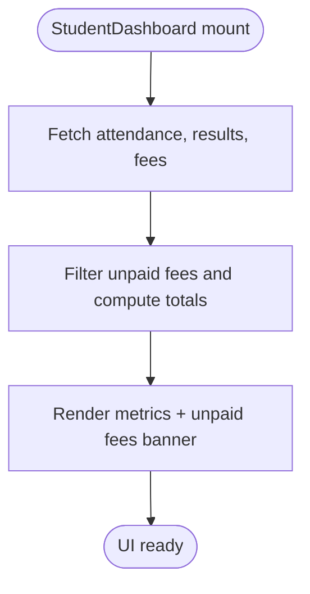
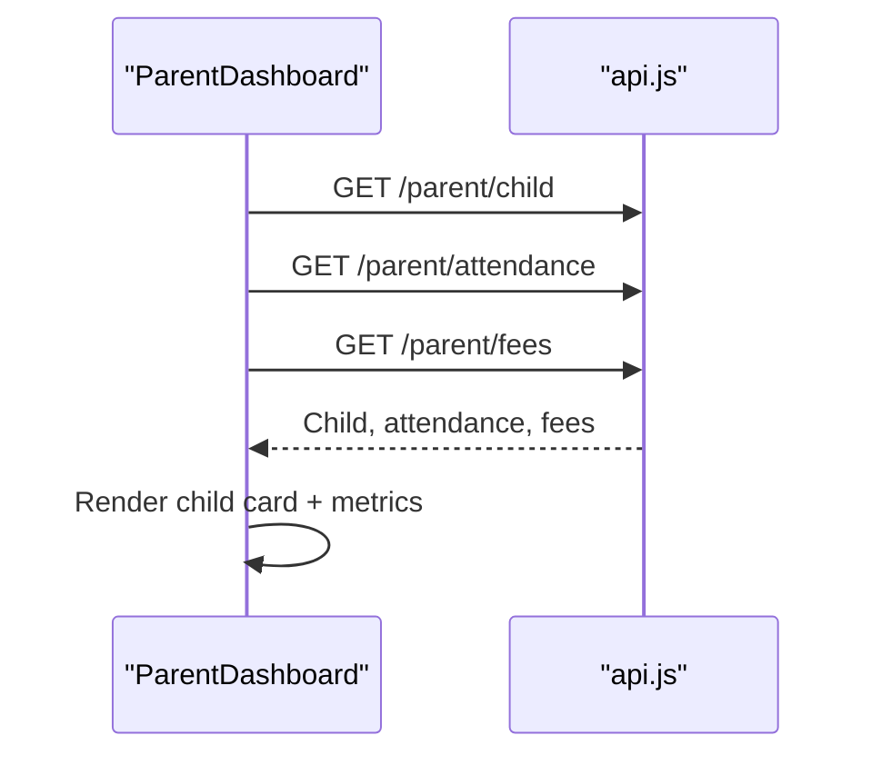
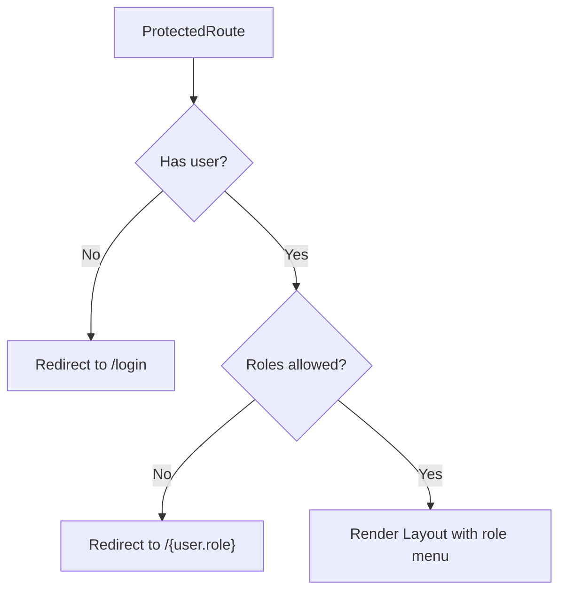
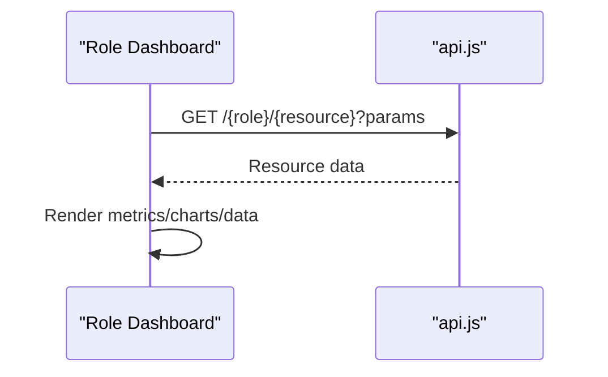
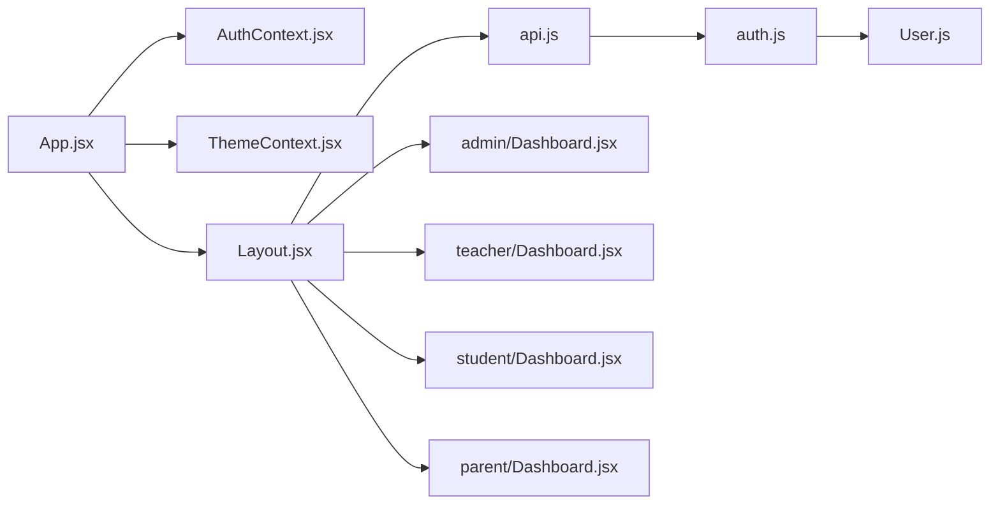

# Page Components

<cite>
**Referenced Files in This Document**
- [App.jsx](file://client/src/App.jsx)
- [Layout.jsx](file://client/src/components/Layout.jsx)
- [AuthContext.jsx](file://client/src/context/AuthContext.jsx)
- [ThemeContext.jsx](file://client/src/context/ThemeContext.jsx)
- [api.js](file://client/src/api.js)
- [admin/Dashboard.jsx](file://client/src/pages/admin/Dashboard.jsx)
- [teacher/Dashboard.jsx](file://client/src/pages/teacher/Dashboard.jsx)
- [student/Dashboard.jsx](file://client/src/pages/student/Dashboard.jsx)
- [parent/Dashboard.jsx](file://client/src/pages/parent/Dashboard.jsx)
- [admin/UsersPage.jsx](file://client/src/pages/admin/UsersPage.jsx)
- [admin/ClassesPage.jsx](file://client/src/pages/admin/ClassesPage.jsx)
- [auth.js](file://server/middleware/auth.js)
- [User.js](file://server/models/User.js)
</cite>

## Table of Contents
1. [Introduction](#introduction)
2. [Project Structure](#project-structure)
3. [Core Components](#core-components)
4. [Architecture Overview](#architecture-overview)
5. [Detailed Component Analysis](#detailed-component-analysis)
6. [Dependency Analysis](#dependency-analysis)
7. [Performance Considerations](#performance-considerations)
8. [Troubleshooting Guide](#troubleshooting-guide)
9. [Conclusion](#conclusion)

## Introduction
This document explains the role-specific dashboard components and page layouts for an educational management system. It covers:
- Admin dashboard for school administration
- Teacher dashboard for academic management
- Student dashboard for academic records
- Parent dashboard for family access

It also documents common dashboard patterns, data visualization components, recent activity displays, quick action buttons, role-based content rendering, permission checks, and dynamic content loading based on user roles.

## Project Structure
The frontend is a React application structured by role under client/src/pages. Each role has its own dashboard and related pages. A shared Layout component renders role-aware navigation and header actions. Authentication and theme contexts provide global state for user sessions and UI preferences. The API module centralizes HTTP requests and handles authentication tokens and 401 responses.

**Diagram sources**
- [App.jsx:26-72](file://client/src/App.jsx#L26-L72)
- [Layout.jsx:51-142](file://client/src/components/Layout.jsx#L51-L142)
- [AuthContext.jsx:8-52](file://client/src/context/AuthContext.jsx#L8-L52)
- [ThemeContext.jsx:7-25](file://client/src/context/ThemeContext.jsx#L7-L25)
- [api.js:3-28](file://client/src/api.js#L3-L28)
- [admin/Dashboard.jsx:8-110](file://client/src/pages/admin/Dashboard.jsx#L8-L110)
- [teacher/Dashboard.jsx:5-56](file://client/src/pages/teacher/Dashboard.jsx#L5-L56)
- [student/Dashboard.jsx:5-57](file://client/src/pages/student/Dashboard.jsx#L5-L57)
- [parent/Dashboard.jsx:5-59](file://client/src/pages/parent/Dashboard.jsx#L5-L59)
- [admin/UsersPage.jsx:5-195](file://client/src/pages/admin/UsersPage.jsx#L5-L195)
- [admin/ClassesPage.jsx:5-82](file://client/src/pages/admin/ClassesPage.jsx#L5-L82)
- [auth.js:4-31](file://server/middleware/auth.js#L4-L31)
- [User.js:4-13](file://server/models/User.js#L4-L13)

**Section sources**
- [App.jsx:26-72](file://client/src/App.jsx#L26-L72)
- [Layout.jsx:51-142](file://client/src/components/Layout.jsx#L51-L142)
- [AuthContext.jsx:8-52](file://client/src/context/AuthContext.jsx#L8-L52)
- [ThemeContext.jsx:7-25](file://client/src/context/ThemeContext.jsx#L7-L25)
- [api.js:3-28](file://client/src/api.js#L3-L28)

## Core Components
- ProtectedRoute: Guards routes by role and redirects unauthenticated or unauthorized users to the appropriate role dashboard or login.
- Layout: Renders role-specific sidebar menus, header profile dropdown, and theme toggle.
- AuthContext: Manages user login/logout, profile updates, and persists user data in local storage.
- ThemeContext: Manages dark/light theme preference persisted in local storage.
- API: Axios instance with request/response interceptors for token injection and automatic redirect on 401.

Common dashboard patterns:
- Loading spinners while fetching data
- Grid-based metric cards with icons and trends
- Data visualization using Recharts (pie charts, bar charts)
- Role-aware quick action buttons and modals for administrative tasks

**Section sources**
- [App.jsx:18-24](file://client/src/App.jsx#L18-L24)
- [Layout.jsx:51-142](file://client/src/components/Layout.jsx#L51-L142)
- [AuthContext.jsx:8-52](file://client/src/context/AuthContext.jsx#L8-L52)
- [ThemeContext.jsx:7-25](file://client/src/context/ThemeContext.jsx#L7-L25)
- [api.js:8-25](file://client/src/api.js#L8-L25)

## Architecture Overview
The system enforces role-based access at two levels:
- Frontend routing: ProtectedRoute validates user role and renders Layout with role-specific menu items.
- Backend middleware: JWT verification and role authorization ensure only authorized users reach protected endpoints.

**Diagram sources**
- [App.jsx:18-24](file://client/src/App.jsx#L18-L24)
- [Layout.jsx:51-142](file://client/src/components/Layout.jsx#L51-L142)
- [admin/Dashboard.jsx:13-29](file://client/src/pages/admin/Dashboard.jsx#L13-L29)
- [teacher/Dashboard.jsx:9-11](file://client/src/pages/teacher/Dashboard.jsx#L9-L11)
- [student/Dashboard.jsx:11-22](file://client/src/pages/student/Dashboard.jsx#L11-L22)
- [parent/Dashboard.jsx:11-22](file://client/src/pages/parent/Dashboard.jsx#L11-L22)
- [auth.js:4-31](file://server/middleware/auth.js#L4-L31)

## Detailed Component Analysis

### Admin Dashboard
Purpose:
- Provide school-wide overview: total users, students, teachers, classes, and fee collection statistics.
- Visualize user distribution by role and fee collection trends.

Key features:
- Concurrent data fetching for dashboard stats and fee report
- Metric cards with icons and trends
- Pie chart for users by role
- Bar chart for collected vs pending fees
- Loading spinner during initial fetch

**Diagram sources**
- [admin/Dashboard.jsx:13-29](file://client/src/pages/admin/Dashboard.jsx#L13-L29)
- [admin/Dashboard.jsx:33-37](file://client/src/pages/admin/Dashboard.jsx#L33-L37)
- [admin/Dashboard.jsx:69-106](file://client/src/pages/admin/Dashboard.jsx#L69-L106)

**Section sources**
- [admin/Dashboard.jsx:8-110](file://client/src/pages/admin/Dashboard.jsx#L8-L110)

### Teacher Dashboard
Purpose:
- Show teacher’s classes, today’s date, and quick counts for classes and tasks.
- Provide a compact overview for academic management.

Key features:
- Fetch teacher’s classes on mount
- Metric cards for classes, today, and active tasks
- List of class cards with academic year

**Diagram sources**
- [teacher/Dashboard.jsx:9-11](file://client/src/pages/teacher/Dashboard.jsx#L9-L11)
- [teacher/Dashboard.jsx:15-54](file://client/src/pages/teacher/Dashboard.jsx#L15-L54)

**Section sources**
- [teacher/Dashboard.jsx:5-56](file://client/src/pages/teacher/Dashboard.jsx#L5-L56)

### Student Dashboard
Purpose:
- Display student’s attendance percentage, exam results count, pending fees, and today’s date.
- Highlight unpaid fees with totals.

Key features:
- Fetch monthly attendance, results, and fees concurrently
- Compute unpaid fees and total pending amount
- Conditional banner for unpaid fees

**Diagram sources**
- [student/Dashboard.jsx:11-22](file://client/src/pages/student/Dashboard.jsx#L11-L22)
- [student/Dashboard.jsx:26-54](file://client/src/pages/student/Dashboard.jsx#L26-L54)

**Section sources**
- [student/Dashboard.jsx:5-57](file://client/src/pages/student/Dashboard.jsx#L5-L57)

### Parent Dashboard
Purpose:
- Show child’s profile and key metrics: attendance percentage, paid fees, and pending fees.

Key features:
- Fetch child profile, monthly attendance, and fees concurrently
- Display child identity card-like layout
- Metrics for attendance, paid fees, and pending fees

**Diagram sources**
- [parent/Dashboard.jsx:11-22](file://client/src/pages/parent/Dashboard.jsx#L11-L22)
- [parent/Dashboard.jsx:32-55](file://client/src/pages/parent/Dashboard.jsx#L32-L55)

**Section sources**
- [parent/Dashboard.jsx:5-59](file://client/src/pages/parent/Dashboard.jsx#L5-L59)

### Role-Based Content Rendering and Permission Checks
- ProtectedRoute enforces role-based access and redirects to the user’s role path if unauthorized.
- Layout dynamically builds the sidebar menu based on user role.
- API interceptor injects Authorization header and redirects to login on 401.

**Diagram sources**
- [App.jsx:18-24](file://client/src/App.jsx#L18-L24)
- [Layout.jsx:58](file://client/src/components/Layout.jsx#L58)
- [api.js:8-25](file://client/src/api.js#L8-L25)

**Section sources**
- [App.jsx:18-24](file://client/src/App.jsx#L18-L24)
- [Layout.jsx:51-142](file://client/src/components/Layout.jsx#L51-L142)
- [api.js:8-25](file://client/src/api.js#L8-L25)

### Dynamic Content Loading Based on User Roles
- Each dashboard mounts and performs role-specific API calls to load data.
- Admin dashboard uses concurrent requests for efficiency.
- Student and Parent dashboards compute derived metrics (e.g., unpaid fees) client-side.

**Diagram sources**
- [admin/Dashboard.jsx:13-29](file://client/src/pages/admin/Dashboard.jsx#L13-L29)
- [teacher/Dashboard.jsx:9-11](file://client/src/pages/teacher/Dashboard.jsx#L9-L11)
- [student/Dashboard.jsx:11-22](file://client/src/pages/student/Dashboard.jsx#L11-L22)
- [parent/Dashboard.jsx:11-22](file://client/src/pages/parent/Dashboard.jsx#L11-L22)

**Section sources**
- [admin/Dashboard.jsx:13-29](file://client/src/pages/admin/Dashboard.jsx#L13-L29)
- [teacher/Dashboard.jsx:9-11](file://client/src/pages/teacher/Dashboard.jsx#L9-L11)
- [student/Dashboard.jsx:11-22](file://client/src/pages/student/Dashboard.jsx#L11-L22)
- [parent/Dashboard.jsx:11-22](file://client/src/pages/parent/Dashboard.jsx#L11-L22)

### Common Dashboard Patterns and UI Elements
- Metric cards: Icons, labels, values, and optional trend indicators
- Data visualization: Recharts pie and bar charts for aggregated metrics
- Quick action buttons: Add/Edit/Delete modals for administrative pages
- Recent activity displays: Attendance summaries and notices navigation
- Role-aware navigation: Sidebar items tailored to user role

Examples of components:
- Admin dashboard cards and charts
- Teacher dashboard class list and metrics
- Student dashboard unpaid fees banner
- Parent dashboard child profile and fee metrics
- Admin user and class management pages with modals and forms

**Section sources**
- [admin/Dashboard.jsx:39-44](file://client/src/pages/admin/Dashboard.jsx#L39-L44)
- [admin/Dashboard.jsx:69-106](file://client/src/pages/admin/Dashboard.jsx#L69-L106)
- [teacher/Dashboard.jsx:21-52](file://client/src/pages/teacher/Dashboard.jsx#L21-L52)
- [student/Dashboard.jsx:34-54](file://client/src/pages/student/Dashboard.jsx#L34-L54)
- [parent/Dashboard.jsx:32-55](file://client/src/pages/parent/Dashboard.jsx#L32-L55)
- [admin/UsersPage.jsx:87-194](file://client/src/pages/admin/UsersPage.jsx#L87-L194)
- [admin/ClassesPage.jsx:31-79](file://client/src/pages/admin/ClassesPage.jsx#L31-L79)

## Dependency Analysis
Frontend dependencies:
- App.jsx depends on AuthContext, ThemeContext, Layout, and role-specific dashboards.
- Layout depends on AuthContext and ThemeContext for user and theme state.
- API module depends on local storage for token persistence and redirects on 401.
- Role dashboards depend on API for data fetching and Recharts for visualization.

Backend dependencies:
- auth.js middleware verifies JWT and authorizes roles.
- User model defines role enum used for authorization.

**Diagram sources**
- [App.jsx:26-72](file://client/src/App.jsx#L26-L72)
- [Layout.jsx:51-142](file://client/src/components/Layout.jsx#L51-L142)
- [AuthContext.jsx:8-52](file://client/src/context/AuthContext.jsx#L8-L52)
- [ThemeContext.jsx:7-25](file://client/src/context/ThemeContext.jsx#L7-L25)
- [api.js:3-28](file://client/src/api.js#L3-L28)
- [admin/Dashboard.jsx:8-110](file://client/src/pages/admin/Dashboard.jsx#L8-L110)
- [teacher/Dashboard.jsx:5-56](file://client/src/pages/teacher/Dashboard.jsx#L5-L56)
- [student/Dashboard.jsx:5-57](file://client/src/pages/student/Dashboard.jsx#L5-L57)
- [parent/Dashboard.jsx:5-59](file://client/src/pages/parent/Dashboard.jsx#L5-L59)
- [auth.js:4-31](file://server/middleware/auth.js#L4-L31)
- [User.js:4-13](file://server/models/User.js#L4-L13)

**Section sources**
- [App.jsx:26-72](file://client/src/App.jsx#L26-L72)
- [Layout.jsx:51-142](file://client/src/components/Layout.jsx#L51-L142)
- [api.js:3-28](file://client/src/api.js#L3-L28)
- [auth.js:4-31](file://server/middleware/auth.js#L4-L31)
- [User.js:4-13](file://server/models/User.js#L4-L13)

## Performance Considerations
- Concurrent API calls: Admin dashboard uses Promise.all to reduce total loading time.
- Local storage caching: AuthContext and ThemeContext persist user and theme preferences to avoid re-computation on reload.
- Minimal re-renders: Dashboards render only when data is fetched and state updates occur.
- Chart libraries: Recharts components are efficient for small-to-medium datasets typical in dashboards.

[No sources needed since this section provides general guidance]

## Troubleshooting Guide
- 401 Unauthorized: The API interceptor removes user from local storage and navigates to login. Verify token presence and expiration.
- Role mismatch: ProtectedRoute redirects to the user’s role dashboard if the requested route requires a different role.
- Missing user data: AuthContext loads user from local storage on app start; ensure login completes successfully and user object is persisted.
- Theme not sticking: ThemeContext saves theme preference to local storage; check browser storage availability.

**Section sources**
- [api.js:16-25](file://client/src/api.js#L16-L25)
- [App.jsx:18-24](file://client/src/App.jsx#L18-L24)
- [AuthContext.jsx:12-18](file://client/src/context/AuthContext.jsx#L12-L18)
- [ThemeContext.jsx:8-16](file://client/src/context/ThemeContext.jsx#L8-L16)

## Conclusion
The system implements role-specific dashboards with consistent UI patterns, robust role-based routing, and efficient data loading. Admin dashboards focus on institutional metrics and finance, while teacher, student, and parent dashboards present role-appropriate summaries and quick access to relevant resources. The shared Layout component and context providers enable a cohesive user experience across roles, and backend middleware ensures secure access to protected endpoints.