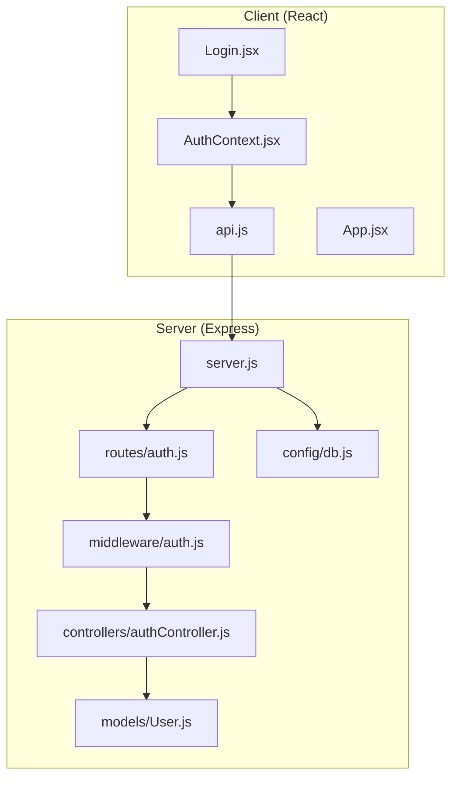
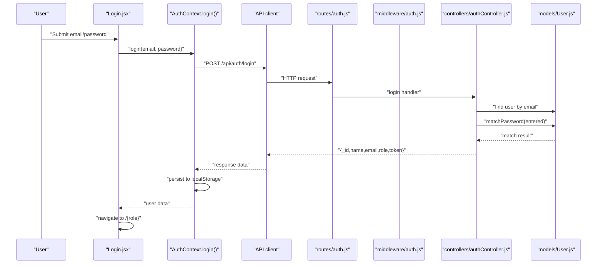
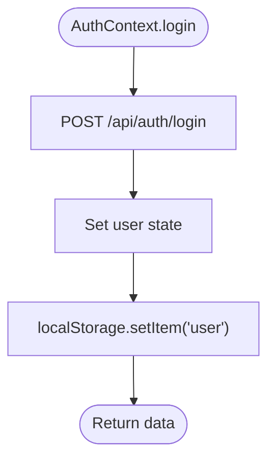
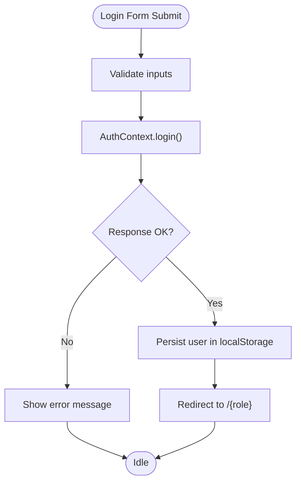
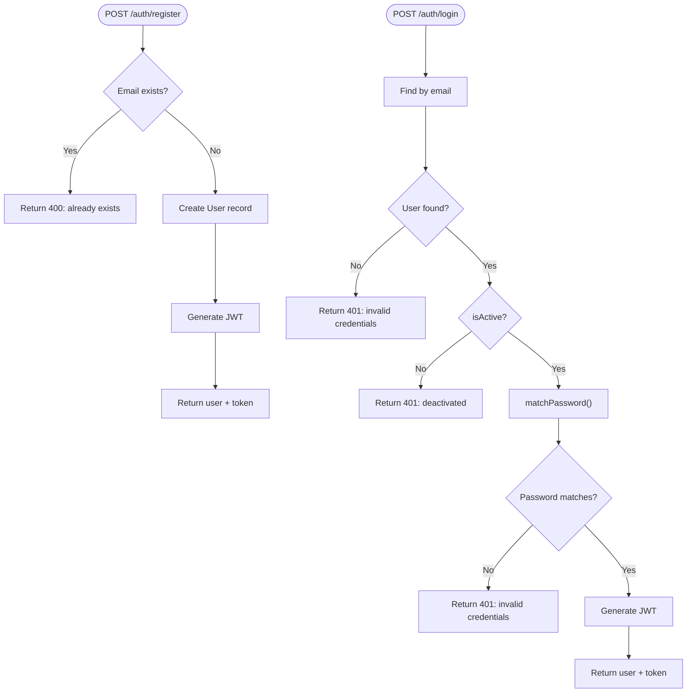
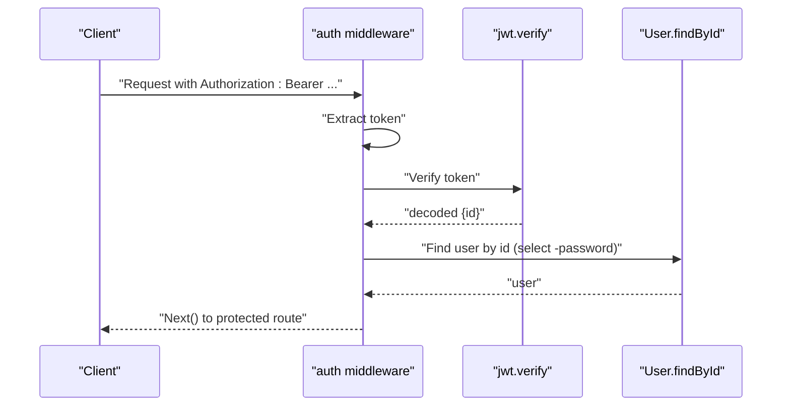
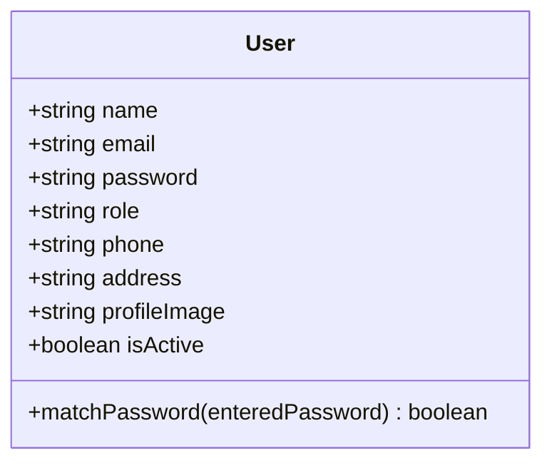
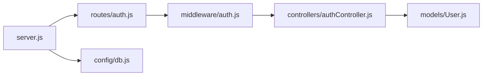
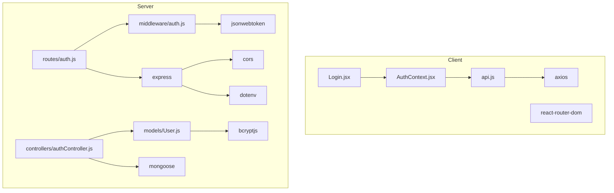

# Authentication System

<cite>
**Referenced Files in This Document**
- [AuthContext.jsx](file://client/src/context/AuthContext.jsx)
- [Login.jsx](file://client/src/pages/auth/Login.jsx)
- [api.js](file://client/src/api.js)
- [App.jsx](file://client/src/App.jsx)
- [authController.js](file://server/controllers/authController.js)
- [auth.js](file://server/middleware/auth.js)
- [auth.js](file://server/routes/auth.js)
- [User.js](file://server/models/User.js)
- [server.js](file://server/server.js)
- [db.js](file://server/config/db.js)
- [package.json](file://server/package.json)
- [package.json](file://client/package.json)
</cite>

## Table of Contents
1. [Introduction](#introduction)
2. [Project Structure](#project-structure)
3. [Core Components](#core-components)
4. [Architecture Overview](#architecture-overview)
5. [Detailed Component Analysis](#detailed-component-analysis)
6. [Dependency Analysis](#dependency-analysis)
7. [Performance Considerations](#performance-considerations)
8. [Troubleshooting Guide](#troubleshooting-guide)
9. [Conclusion](#conclusion)

## Introduction
This document explains the authentication system for the School Management System. It covers the end-to-end login/logout flow, password hashing, JWT token generation and validation, frontend state management with React’s Context API, and backend middleware protection. It also documents error handling, security measures, and provides examples of successful authentication flows and common errors.

## Project Structure
The authentication system spans two applications:
- Frontend (React): Handles user input, form submission, local storage persistence, and API communication.
- Backend (Express + MongoDB): Validates credentials, manages tokens, protects routes, and persists hashed passwords.

**Diagram sources**
- [server.js:19-27](file://server/server.js#L19-L27)
- [routes/auth.js:1-13](file://server/routes/auth.js#L1-L13)
- [middleware/auth.js:1-31](file://server/middleware/auth.js#L1-L31)
- [controllers/authController.js:1-107](file://server/controllers/authController.js#L1-L107)
- [models/User.js:1-27](file://server/models/User.js#L1-L27)
- [config/db.js:1-14](file://server/config/db.js#L1-L14)
- [api.js:1-28](file://client/src/api.js#L1-L28)
- [AuthContext.jsx:1-53](file://client/src/context/AuthContext.jsx#L1-L53)
- [Login.jsx:1-100](file://client/src/pages/auth/Login.jsx#L1-L100)
- [App.jsx:18-24](file://client/src/App.jsx#L18-L24)

**Section sources**
- [server.js:19-27](file://server/server.js#L19-L27)
- [routes/auth.js:1-13](file://server/routes/auth.js#L1-L13)
- [middleware/auth.js:1-31](file://server/middleware/auth.js#L1-L31)
- [controllers/authController.js:1-107](file://server/controllers/authController.js#L1-L107)
- [models/User.js:1-27](file://server/models/User.js#L1-L27)
- [config/db.js:1-14](file://server/config/db.js#L1-L14)
- [api.js:1-28](file://client/src/api.js#L1-L28)
- [AuthContext.jsx:1-53](file://client/src/context/AuthContext.jsx#L1-L53)
- [Login.jsx:1-100](file://client/src/pages/auth/Login.jsx#L1-L100)
- [App.jsx:18-24](file://client/src/App.jsx#L18-L24)

## Core Components
- Frontend authentication state and HTTP client:
  - AuthContext manages user session, login, register, logout, and profile updates with localStorage persistence.
  - API client injects Authorization header automatically and handles 401 responses.
  - Login page captures credentials, submits via AuthContext, and navigates on success.
  - ProtectedRoute enforces authentication and role checks.
- Backend authentication pipeline:
  - Routes expose /auth/register, /auth/login, /auth/me, /auth/profile, and /auth/change-password.
  - Middleware verifies JWT and attaches user to request.
  - Controller validates credentials, generates tokens, and returns protected data.
  - User model hashes passwords and compares entered passwords.

Security highlights:
- Passwords are hashed with bcrypt before storage.
- JWT secret and expiry are configured via environment variables.
- Token is sent in Authorization header as Bearer token.
- Protected routes enforce role-based authorization.

**Section sources**
- [AuthContext.jsx:8-52](file://client/src/context/AuthContext.jsx#L8-L52)
- [api.js:8-25](file://client/src/api.js#L8-L25)
- [Login.jsx:15-27](file://client/src/pages/auth/Login.jsx#L15-L27)
- [App.jsx:18-24](file://client/src/App.jsx#L18-L24)
- [auth.js:4-19](file://server/middleware/auth.js#L4-L19)
- [authController.js:10-59](file://server/controllers/authController.js#L10-L59)
- [User.js:15-24](file://server/models/User.js#L15-L24)

## Architecture Overview
The authentication flow connects the React frontend to Express backend with JWT-based stateless sessions.

**Diagram sources**
- [Login.jsx:15-27](file://client/src/pages/auth/Login.jsx#L15-L27)
- [AuthContext.jsx:20-25](file://client/src/context/AuthContext.jsx#L20-L25)
- [api.js:3-6](file://client/src/api.js#L3-L6)
- [routes/auth.js:6-7](file://server/routes/auth.js#L6-L7)
- [authController.js:31-59](file://server/controllers/authController.js#L31-L59)
- [User.js:22-24](file://server/models/User.js#L22-L24)

## Detailed Component Analysis

### Frontend: AuthContext and API Client
- AuthContext:
  - Provides login, register, logout, updateProfile, and loading state.
  - Persists user object to localStorage after successful requests.
  - Reads initial user state from localStorage on mount.
- API client:
  - Injects Authorization: Bearer token from localStorage into outgoing requests.
  - On 401 response, clears localStorage and redirects to /login.

**Diagram sources**
- [AuthContext.jsx:20-25](file://client/src/context/AuthContext.jsx#L20-L25)

**Section sources**
- [AuthContext.jsx:8-52](file://client/src/context/AuthContext.jsx#L8-L52)
- [api.js:8-25](file://client/src/api.js#L8-L25)

### Frontend: Login Page and Protected Routes
- Login page:
  - Captures email and password, toggles password visibility.
  - Submits via AuthContext.login, sets error messages, disables button during load.
  - On success, navigates to role-specific dashboard.
- ProtectedRoute:
  - Blocks unauthenticated users and enforces role-based access.

**Diagram sources**
- [Login.jsx:15-27](file://client/src/pages/auth/Login.jsx#L15-L27)
- [App.jsx:18-24](file://client/src/App.jsx#L18-L24)

**Section sources**
- [Login.jsx:15-27](file://client/src/pages/auth/Login.jsx#L15-L27)
- [App.jsx:18-24](file://client/src/App.jsx#L18-L24)

### Backend: Authentication Controller
- Registration:
  - Checks for existing user by email.
  - Creates user record and returns token.
- Login:
  - Finds user by email, checks isActive, compares password.
  - Generates JWT token and returns user profile plus token.
- Profile endpoints:
  - getMe merges role-specific profiles for student/teacher.
  - updateProfile and changePassword operate on authenticated user.

**Diagram sources**
- [authController.js:10-29](file://server/controllers/authController.js#L10-L29)
- [authController.js:31-59](file://server/controllers/authController.js#L31-L59)

**Section sources**
- [authController.js:10-29](file://server/controllers/authController.js#L10-L29)
- [authController.js:31-59](file://server/controllers/authController.js#L31-L59)
- [authController.js:61-90](file://server/controllers/authController.js#L61-L90)

### Backend: JWT Middleware and Authorization
- auth middleware:
  - Extracts Bearer token from Authorization header.
  - Verifies token against JWT_SECRET and decodes user id.
  - Attaches user object (without password) to request.
- authorize higher-order function:
  - Enforces role-based access control by checking allowed roles.

**Diagram sources**
- [auth.js:4-19](file://server/middleware/auth.js#L4-L19)

**Section sources**
- [auth.js:4-19](file://server/middleware/auth.js#L4-L19)
- [auth.js:21-28](file://server/middleware/auth.js#L21-L28)

### Backend: User Model and Password Hashing
- Pre-save hook:
  - Hashes password using bcrypt with salt rounds.
- Instance method:
  - Compares entered password with stored hash.

**Diagram sources**
- [User.js:4-24](file://server/models/User.js#L4-L24)

**Section sources**
- [User.js:15-24](file://server/models/User.js#L15-L24)

### Backend: Server Bootstrap and Environment
- Server initializes CORS and JSON middleware, mounts auth routes, and listens on configured port.
- Database connection is established via config module.
- Dependencies include bcryptjs, jsonwebtoken, mongoose, dotenv.

**Diagram sources**
- [server.js:14-27](file://server/server.js#L14-L27)
- [config/db.js:3-11](file://server/config/db.js#L3-L11)

**Section sources**
- [server.js:14-27](file://server/server.js#L14-L27)
- [config/db.js:3-11](file://server/config/db.js#L3-L11)
- [package.json:11-19](file://server/package.json#L11-L19)

## Dependency Analysis
- Client depends on axios for HTTP, react-router-dom for routing, and lucide-react for icons.
- Server depends on express, jsonwebtoken, bcryptjs, mongoose, dotenv, and cors.
- Frontend AuthContext depends on API client; API client depends on localStorage for token retrieval.
- Backend routes depend on auth middleware; controller depends on User model.

**Diagram sources**
- [package.json:12-19](file://client/package.json#L12-L19)
- [package.json:11-19](file://server/package.json#L11-L19)
- [AuthContext.jsx:1-2](file://client/src/context/AuthContext.jsx#L1-L2)
- [api.js:1](file://client/src/api.js#L1)
- [routes/auth.js:1](file://server/routes/auth.js#L1)
- [middleware/auth.js:1](file://server/middleware/auth.js#L1)
- [controllers/authController.js:1](file://server/controllers/authController.js#L1)
- [models/User.js](file://server/models/User.js)

**Section sources**
- [package.json:12-19](file://client/package.json#L12-L19)
- [package.json:11-19](file://server/package.json#L11-L19)

## Performance Considerations
- Token verification occurs on every protected request; keep JWT_SECRET strong and rotate periodically.
- bcrypt cost can be tuned; current salt rounds are standard but may impact login latency under load.
- Avoid sending sensitive fields in responses; the controller already excludes password.
- Consider adding rate limiting on /auth/login to mitigate brute-force attempts.
- Use HTTPS in production to protect tokens in transit.

## Troubleshooting Guide
Common authentication errors and causes:
- 401 Not authorized, no token:
  - Cause: Missing or malformed Authorization header.
  - Fix: Ensure API client injects Bearer token from localStorage.
- 401 Not authorized, token failed:
  - Cause: Invalid/expired JWT or wrong JWT_SECRET.
  - Fix: Verify environment variables and token validity.
- 401 Invalid credentials:
  - Cause: Wrong email/password combination.
  - Fix: Prompt user to re-enter credentials.
- 401 Account is deactivated:
  - Cause: User marked inactive.
  - Fix: Contact administrator to activate account.
- 403 Role is not authorized:
  - Cause: Insufficient privileges for requested route.
  - Fix: Ensure user has correct role.

Frontend error handling:
- Login page displays error messages returned by backend.
- API interceptor clears localStorage and redirects to /login on 401.

**Section sources**
- [auth.js:10-18](file://server/middleware/auth.js#L10-L18)
- [authController.js:35-44](file://server/controllers/authController.js#L35-L44)
- [api.js:18-24](file://client/src/api.js#L18-L24)
- [Login.jsx:22-23](file://client/src/pages/auth/Login.jsx#L22-L23)

## Conclusion
The authentication system combines secure password hashing, JWT-based session tokens, and robust middleware protection. The React frontend centralizes authentication state and integrates seamlessly with the backend via a clean API client. By enforcing role-based access and handling errors gracefully, the system provides a reliable foundation for the School Management System.