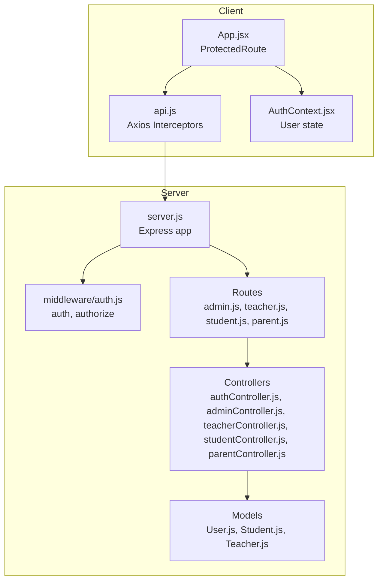
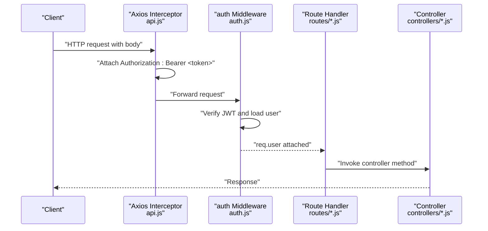
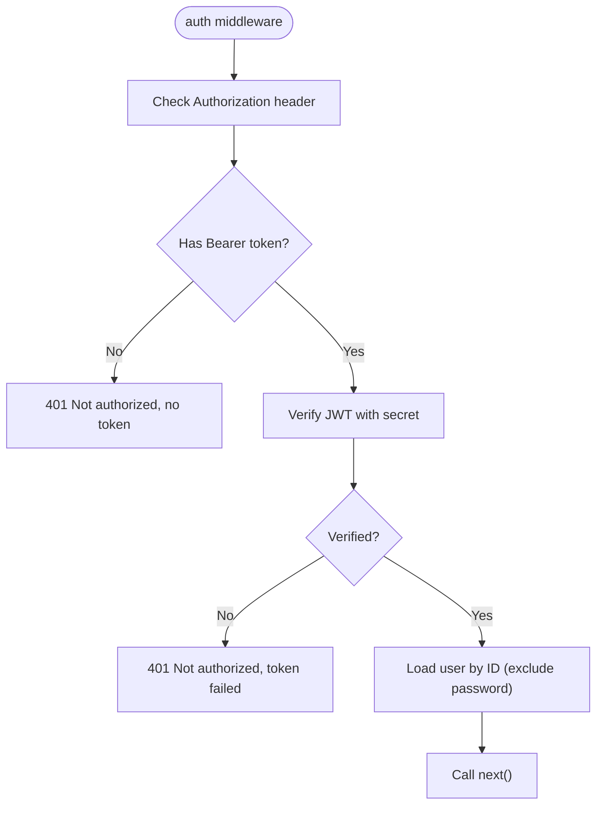
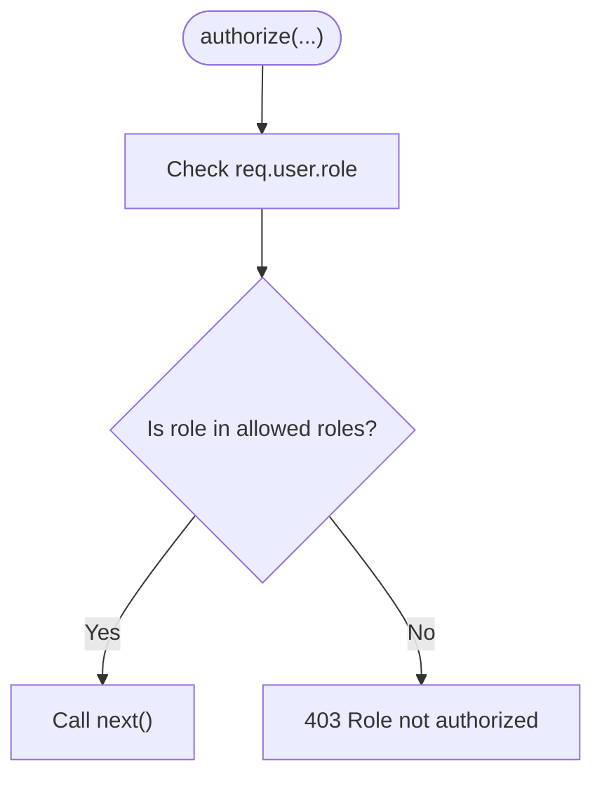
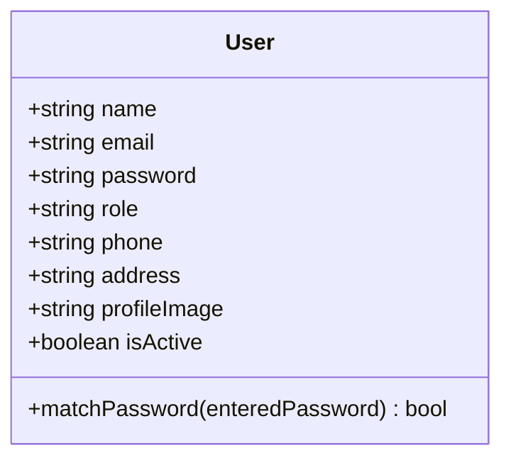
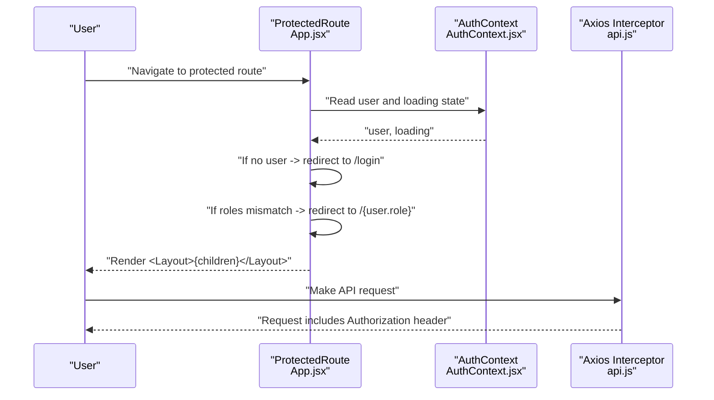
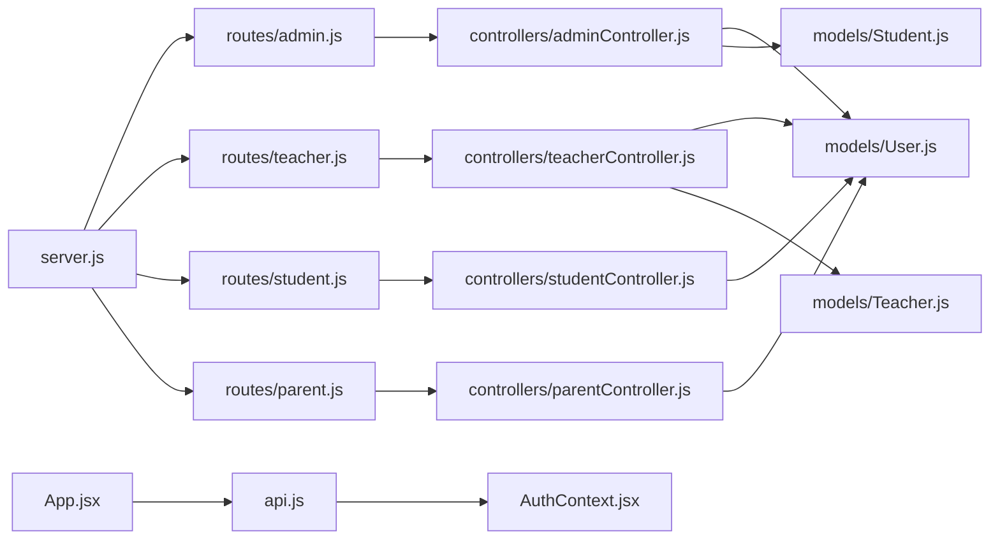

# Authorization Mechanisms

<cite>
**Referenced Files in This Document**
- [auth.js](file://server/middleware/auth.js)
- [User.js](file://server/models/User.js)
- [authController.js](file://server/controllers/authController.js)
- [admin.js](file://server/routes/admin.js)
- [teacher.js](file://server/routes/teacher.js)
- [student.js](file://server/routes/student.js)
- [parent.js](file://server/routes/parent.js)
- [auth.js](file://client/src/context/AuthContext.jsx)
- [api.js](file://client/src/api.js)
- [App.jsx](file://client/src/App.jsx)
- [server.js](file://server/server.js)
- [Student.js](file://server/models/Student.js)
- [Teacher.js](file://server/models/Teacher.js)
</cite>

## Table of Contents
1. [Introduction](#introduction)
2. [Project Structure](#project-structure)
3. [Core Components](#core-components)
4. [Architecture Overview](#architecture-overview)
5. [Detailed Component Analysis](#detailed-component-analysis)
6. [Dependency Analysis](#dependency-analysis)
7. [Performance Considerations](#performance-considerations)
8. [Troubleshooting Guide](#troubleshooting-guide)
9. [Conclusion](#conclusion)

## Introduction
This document explains the authorization and role-based access control (RBAC) system implemented in the application. It covers how middleware validates user roles, checks permissions, and enforces access restrictions. It also documents role-based routing, protected route handling, and the authorization flow for different user types. Examples of protected endpoints and role validation patterns are included, along with security middleware implementation details.

## Project Structure
The authorization system spans the backend Express server and the frontend React application:
- Backend middleware enforces authentication and role-based authorization.
- Backend routes apply middleware to protect endpoints and delegate to controllers.
- Frontend provides role-aware routing and attaches tokens to requests.
- Models define user roles and related profiles.

**Diagram sources**
- [server.js:18-28](file://server/server.js#L18-L28)
- [auth.js:1-31](file://server/middleware/auth.js#L1-L31)
- [admin.js:1-20](file://server/routes/admin.js#L1-L20)
- [teacher.js:1-20](file://server/routes/teacher.js#L1-L20)
- [student.js:1-14](file://server/routes/student.js#L1-L14)
- [parent.js:1-13](file://server/routes/parent.js#L1-L13)
- [authController.js:1-107](file://server/controllers/authController.js#L1-L107)
- [User.js:1-27](file://server/models/User.js#L1-L27)
- [Student.js:1-16](file://server/models/Student.js#L1-L16)
- [Teacher.js:1-13](file://server/models/Teacher.js#L1-L13)
- [App.jsx:18-24](file://client/src/App.jsx#L18-L24)
- [api.js:8-25](file://client/src/api.js#L8-L25)
- [auth.js:1-53](file://client/src/context/AuthContext.jsx#L1-L53)

**Section sources**
- [server.js:18-28](file://server/server.js#L18-L28)
- [auth.js:1-31](file://server/middleware/auth.js#L1-L31)
- [admin.js:1-20](file://server/routes/admin.js#L1-L20)
- [teacher.js:1-20](file://server/routes/teacher.js#L1-L20)
- [student.js:1-14](file://server/routes/student.js#L1-L14)
- [parent.js:1-13](file://server/routes/parent.js#L1-L13)
- [authController.js:1-107](file://server/controllers/authController.js#L1-L107)
- [User.js:1-27](file://server/models/User.js#L1-L27)
- [Student.js:1-16](file://server/models/Student.js#L1-L16)
- [Teacher.js:1-13](file://server/models/Teacher.js#L1-L13)
- [App.jsx:18-24](file://client/src/App.jsx#L18-L24)
- [api.js:8-25](file://client/src/api.js#L8-L25)
- [auth.js:1-53](file://client/src/context/AuthContext.jsx#L1-L53)

## Core Components
- Authentication middleware
  - Extracts and verifies JWT from Authorization header.
  - Loads user without password and attaches to request.
  - Returns 401 if missing or invalid token.
- Role-based authorization middleware
  - Checks if the authenticated user’s role is included in allowed roles.
  - Returns 403 if unauthorized.
- User model
  - Defines role enum with values: admin, teacher, student, parent.
  - Includes password hashing lifecycle hook.
- Protected routes
  - Apply both auth and authorize middlewares.
  - Some endpoints allow multiple roles (e.g., admin, teacher).
- Frontend protection
  - Axios interceptor adds Authorization header when a token exists.
  - Global response interceptor handles 401 by clearing local user and redirecting to login.
  - ProtectedRoute enforces role-based navigation and layout wrapping.

**Section sources**
- [auth.js:4-19](file://server/middleware/auth.js#L4-L19)
- [auth.js:21-28](file://server/middleware/auth.js#L21-L28)
- [User.js:4-13](file://server/models/User.js#L4-L13)
- [admin.js:6-17](file://server/routes/admin.js#L6-L17)
- [teacher.js:6-17](file://server/routes/teacher.js#L6-L17)
- [student.js:6-11](file://server/routes/student.js#L6-L11)
- [parent.js:6-10](file://server/routes/parent.js#L6-L10)
- [api.js:8-25](file://client/src/api.js#L8-L25)
- [App.jsx:18-24](file://client/src/App.jsx#L18-L24)

## Architecture Overview
The authorization pipeline consists of three layers:
- Transport and identity: JWT bearer tokens passed via Authorization header.
- Request validation: auth middleware decodes token and loads user.
- Permission enforcement: authorize middleware checks role against allowed set.

**Diagram sources**
- [api.js:8-14](file://client/src/api.js#L8-L14)
- [auth.js:4-19](file://server/middleware/auth.js#L4-L19)
- [admin.js:6](file://server/routes/admin.js#L6)
- [authController.js:61-76](file://server/controllers/authController.js#L61-L76)

## Detailed Component Analysis

### Authentication Middleware
Responsibilities:
- Parse Authorization header for Bearer token.
- Verify JWT and decode payload containing user identifier.
- Load user from database excluding password and attach to request.
- Short-circuit with 401 on missing/invalid token.

**Diagram sources**
- [auth.js:4-19](file://server/middleware/auth.js#L4-L19)

**Section sources**
- [auth.js:4-19](file://server/middleware/auth.js#L4-L19)

### Role-Based Authorization Middleware
Responsibilities:
- Accepts a variadic list of allowed roles.
- Compares req.user.role against allowed roles.
- Allows request to proceed if match; otherwise blocks with 403.

**Diagram sources**
- [auth.js:21-28](file://server/middleware/auth.js#L21-L28)

**Section sources**
- [auth.js:21-28](file://server/middleware/auth.js#L21-L28)

### User Model and Roles
- Role enum: admin, teacher, student, parent.
- Password hashing on save.
- Utility method to compare passwords.

**Diagram sources**
- [User.js:4-24](file://server/models/User.js#L4-L24)

**Section sources**
- [User.js:4-24](file://server/models/User.js#L4-L24)

### Protected Routes and Controllers
- Admin routes: require admin; some endpoints additionally allow teacher.
- Teacher routes: require teacher; some endpoints allow admin and optionally student.
- Student routes: require student.
- Parent routes: require parent.
- Controllers implement domain logic using req.user to enforce ownership or role constraints.

Examples of protected endpoints:
- Admin
  - GET /api/admin/dashboard (admin)
  - GET /api/admin/users (admin)
  - GET /api/admin/classes/:id/students (admin, teacher)
- Teacher
  - POST /api/teacher/attendance (teacher)
  - GET /api/teacher/attendance/monthly (teacher, admin)
  - POST /api/teacher/exams (teacher, admin)
- Student
  - GET /api/student/attendance (student)
  - GET /api/student/results (student)
- Parent
  - GET /api/parent/child (parent)
  - GET /api/parent/attendance (parent)

**Section sources**
- [admin.js:6-17](file://server/routes/admin.js#L6-L17)
- [teacher.js:6-17](file://server/routes/teacher.js#L6-L17)
- [student.js:6-11](file://server/routes/student.js#L6-L11)
- [parent.js:6-10](file://server/routes/parent.js#L6-L10)
- [authController.js:61-76](file://server/controllers/authController.js#L61-L76)

### Frontend Authorization and Routing
- Axios interceptor automatically attaches Authorization header when a token exists.
- Global response interceptor detects 401 and clears local user state and redirects to login.
- ProtectedRoute enforces:
  - Authentication: redirects unauthenticated users to login.
  - Authorization: ensures user role matches route roles; otherwise navigates to user’s default role path.
  - Layout: wraps children with shared layout.

**Diagram sources**
- [App.jsx:18-24](file://client/src/App.jsx#L18-L24)
- [api.js:8-25](file://client/src/api.js#L8-L25)
- [auth.js:1-53](file://client/src/context/AuthContext.jsx#L1-L53)

**Section sources**
- [App.jsx:18-24](file://client/src/App.jsx#L18-L24)
- [api.js:8-25](file://client/src/api.js#L8-L25)
- [auth.js:1-53](file://client/src/context/AuthContext.jsx#L1-L53)

### Authorization Flow by User Type
- Admin
  - Can access admin endpoints and some teacher endpoints.
  - Example: GET /api/admin/users, GET /api/admin/classes/:id/students.
- Teacher
  - Can access teacher endpoints and some admin endpoints.
  - Example: POST /api/teacher/attendance, GET /api/teacher/attendance/monthly.
- Student
  - Can access student endpoints only.
  - Example: GET /api/student/attendance, GET /api/student/results.
- Parent
  - Can access parent endpoints only.
  - Example: GET /api/parent/child, GET /api/parent/attendance.

**Section sources**
- [admin.js:6-17](file://server/routes/admin.js#L6-L17)
- [teacher.js:6-17](file://server/routes/teacher.js#L6-L17)
- [student.js:6-11](file://server/routes/student.js#L6-L11)
- [parent.js:6-10](file://server/routes/parent.js#L6-L10)

## Dependency Analysis
- Backend
  - server.js mounts routes under /api/*.
  - Routes import auth and authorize from middleware/auth.js.
  - Controllers depend on models and use req.user for authorization logic.
- Frontend
  - api.js depends on AuthContext for token retrieval.
  - App.jsx defines ProtectedRoute that uses AuthContext and role arrays.

**Diagram sources**
- [server.js:18-28](file://server/server.js#L18-L28)
- [admin.js:1-20](file://server/routes/admin.js#L1-L20)
- [teacher.js:1-20](file://server/routes/teacher.js#L1-L20)
- [student.js:1-14](file://server/routes/student.js#L1-L14)
- [parent.js:1-13](file://server/routes/parent.js#L1-L13)
- [authController.js:1-107](file://server/controllers/authController.js#L1-L107)
- [User.js:1-27](file://server/models/User.js#L1-L27)
- [Student.js:1-16](file://server/models/Student.js#L1-L16)
- [Teacher.js:1-13](file://server/models/Teacher.js#L1-L13)
- [App.jsx:18-24](file://client/src/App.jsx#L18-L24)
- [api.js:8-25](file://client/src/api.js#L8-L25)
- [auth.js:1-53](file://client/src/context/AuthContext.jsx#L1-L53)

**Section sources**
- [server.js:18-28](file://server/server.js#L18-L28)
- [admin.js:1-20](file://server/routes/admin.js#L1-L20)
- [teacher.js:1-20](file://server/routes/teacher.js#L1-L20)
- [student.js:1-14](file://server/routes/student.js#L1-L14)
- [parent.js:1-13](file://server/routes/parent.js#L1-L13)
- [authController.js:1-107](file://server/controllers/authController.js#L1-L107)
- [User.js:1-27](file://server/models/User.js#L1-L27)
- [Student.js:1-16](file://server/models/Student.js#L1-L16)
- [Teacher.js:1-13](file://server/models/Teacher.js#L1-L13)
- [App.jsx:18-24](file://client/src/App.jsx#L18-L24)
- [api.js:8-25](file://client/src/api.js#L8-L25)
- [auth.js:1-53](file://client/src/context/AuthContext.jsx#L1-L53)

## Performance Considerations
- Token verification occurs per request; keep JWT_SECRET secure and avoid excessive middleware overhead.
- Role checks are O(n) over allowed roles; typical lists are short and negligible.
- Database queries in controllers should use targeted projections and appropriate indexes (e.g., unique indices on email and roll number).
- Avoid unnecessary population in controllers; fetch only required fields to reduce payload sizes.

## Troubleshooting Guide
Common issues and resolutions:
- 401 Not authorized, no token
  - Cause: Missing Authorization header or malformed Bearer token.
  - Resolution: Ensure client sends Authorization: Bearer <token> and token is valid.
- 401 Not authorized, token failed
  - Cause: Expired or tampered token.
  - Resolution: Re-authenticate the user to obtain a new token.
- 403 Role not authorized to access this route
  - Cause: User’s role not included in route’s allowed roles.
  - Resolution: Verify user role and adjust route permissions or user role accordingly.
- 401 response handling on frontend
  - Behavior: Axios interceptor removes user and redirects to login.
  - Resolution: Confirm token validity and session state; re-login if needed.
- ProtectedRoute navigation
  - Behavior: Redirects unauthenticated users to /login; redirects mismatched roles to /{role}.
  - Resolution: Ensure user is logged in and has the correct role.

**Section sources**
- [auth.js:4-19](file://server/middleware/auth.js#L4-L19)
- [auth.js:21-28](file://server/middleware/auth.js#L21-L28)
- [api.js:19-23](file://client/src/api.js#L19-L23)
- [App.jsx:18-24](file://client/src/App.jsx#L18-L24)

## Conclusion
The system implements a layered RBAC strategy:
- Authentication middleware validates JWT and loads the user.
- Authorization middleware enforces role constraints per endpoint.
- Frontend enforces role-based routing and propagates tokens securely.
This design provides clear separation of concerns, predictable access control, and consistent user experience across roles.