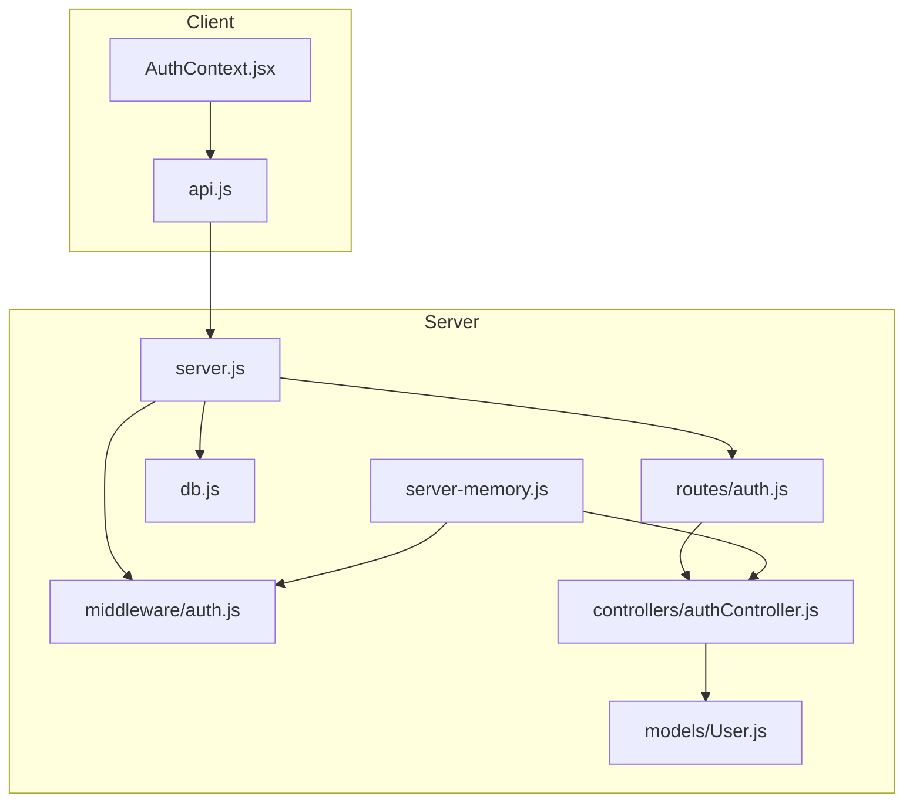
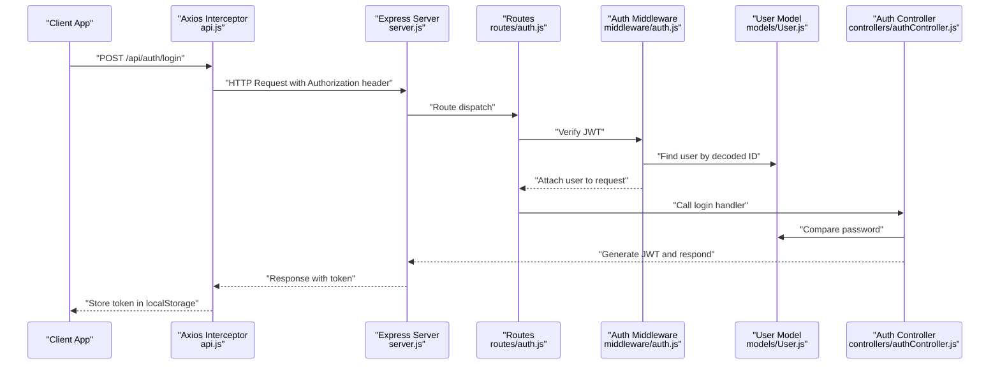
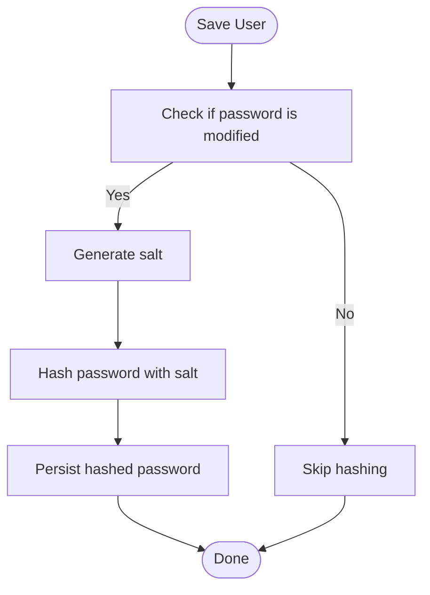
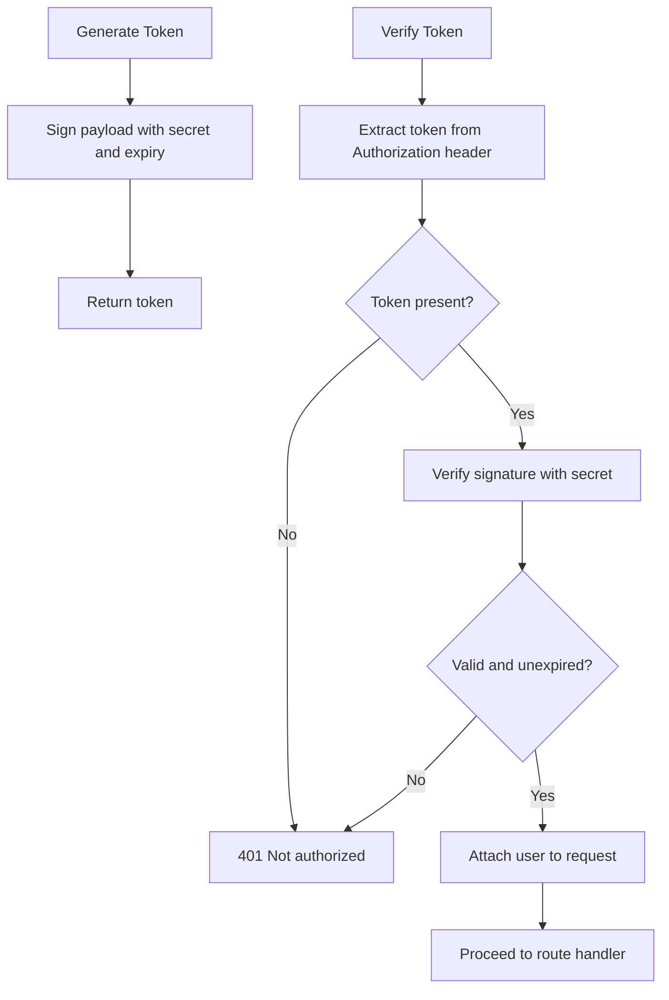
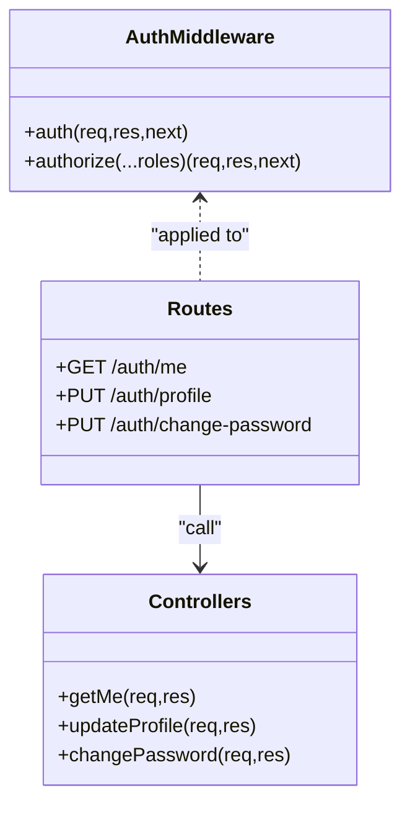
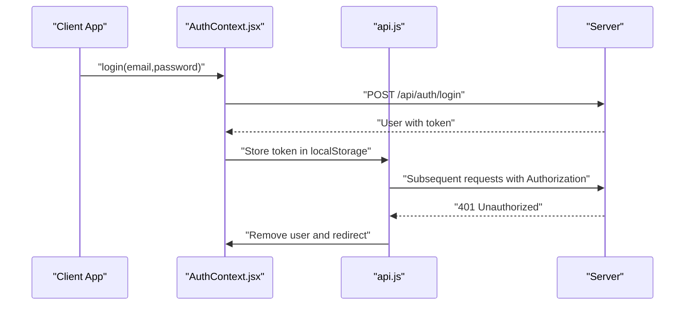
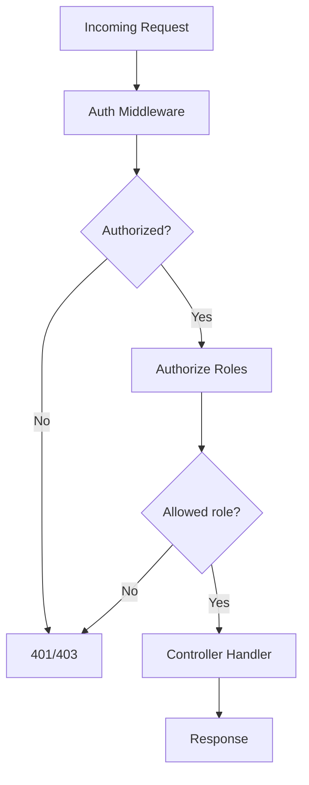
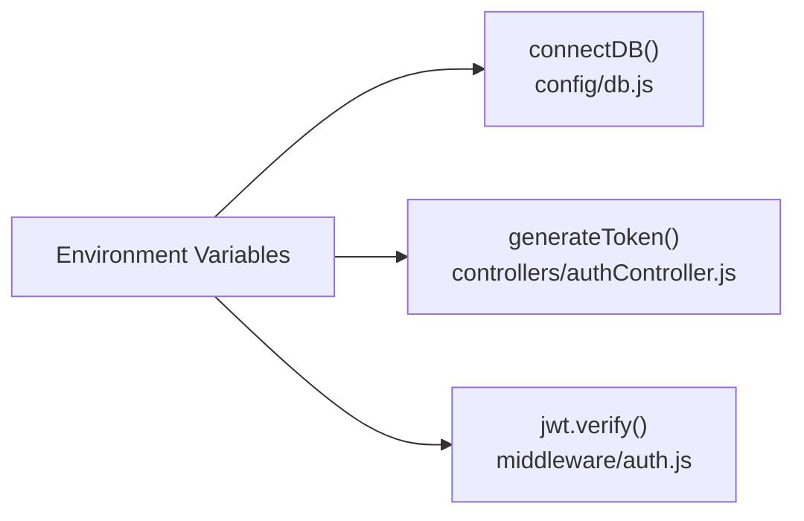
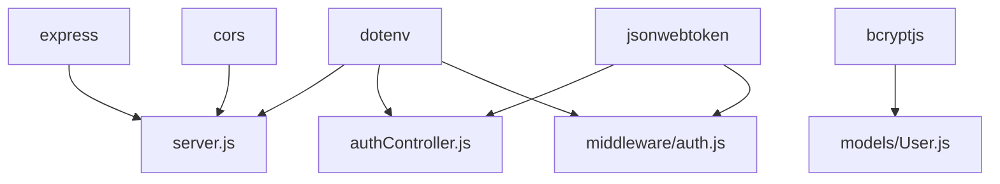

# Security Implementation

<cite>
**Referenced Files in This Document**
- [server.js](file://server/server.js)
- [server-memory.js](file://server/server-memory.js)
- [auth.js](file://server/middleware/auth.js)
- [authController.js](file://server/controllers/authController.js)
- [User.js](file://server/models/User.js)
- [auth.js](file://server/routes/auth.js)
- [AuthContext.jsx](file://client/src/context/AuthContext.jsx)
- [api.js](file://client/src/api.js)
- [adminController.js](file://server/controllers/adminController.js)
- [db.js](file://server/config/db.js)
- [package.json](file://server/package.json)
</cite>

## Table of Contents
1. [Introduction](#introduction)
2. [Project Structure](#project-structure)
3. [Core Components](#core-components)
4. [Architecture Overview](#architecture-overview)
5. [Detailed Component Analysis](#detailed-component-analysis)
6. [Dependency Analysis](#dependency-analysis)
7. [Performance Considerations](#performance-considerations)
8. [Troubleshooting Guide](#troubleshooting-guide)
9. [Conclusion](#conclusion)

## Introduction
This document details the security implementation of the School Management System, focusing on authentication and authorization mechanisms. It covers password encryption, sessionless JWT-based authentication, middleware protection, input handling, and client-side token management. It also outlines areas for improvement regarding input sanitization, SQL injection prevention (as applicable), XSS protection, security headers, CORS configuration, and operational monitoring.

## Project Structure
The system comprises:
- A Node.js/Express backend with MongoDB via Mongoose and an in-memory alternative for development
- React frontend with local storage for tokens and automatic bearer token injection
- Centralized authentication middleware enforcing JWT verification and role-based access control
- Controllers implementing registration, login, profile updates, and password changes
- A user model with bcrypt-based password hashing

**Diagram sources**
- [server.js:1-38](file://server/server.js#L1-L38)
- [server-memory.js:1-128](file://server/server-memory.js#L1-L128)
- [auth.js:1-13](file://server/routes/auth.js#L1-L13)
- [auth.js:1-31](file://server/middleware/auth.js#L1-L31)
- [authController.js:1-107](file://server/controllers/authController.js#L1-L107)
- [User.js:1-27](file://server/models/User.js#L1-L27)
- [db.js:1-14](file://server/config/db.js#L1-L14)

**Section sources**
- [server.js:1-38](file://server/server.js#L1-L38)
- [server-memory.js:1-128](file://server/server-memory.js#L1-L128)
- [auth.js:1-13](file://server/routes/auth.js#L1-L13)
- [auth.js:1-31](file://server/middleware/auth.js#L1-L31)
- [authController.js:1-107](file://server/controllers/authController.js#L1-L107)
- [User.js:1-27](file://server/models/User.js#L1-L27)
- [db.js:1-14](file://server/config/db.js#L1-L14)

## Core Components
- Password Encryption: bcryptjs is used in the user model to hash passwords during save hooks and compare during login.
- JWT Token Security: Tokens are generated with a secret and expiration, verified by middleware, and attached to requests via Authorization headers.
- Middleware Protection: Authentication middleware validates Bearer tokens; authorization middleware enforces role-based access.
- Access Control: Route handlers are protected by middleware, and admin endpoints enforce admin-only access.
- Client-Side Token Management: Axios interceptors automatically attach tokens; unauthorized responses trigger logout.

**Section sources**
- [User.js:15-24](file://server/models/User.js#L15-L24)
- [authController.js:6-8](file://server/controllers/authController.js#L6-L8)
- [auth.js:4-19](file://server/middleware/auth.js#L4-L19)
- [auth.js:21-28](file://server/middleware/auth.js#L21-L28)
- [auth.js:1-13](file://server/routes/auth.js#L1-L13)
- [AuthContext.jsx:20-37](file://client/src/context/AuthContext.jsx#L20-L37)
- [api.js:8-25](file://client/src/api.js#L8-L25)

## Architecture Overview
The authentication flow integrates client and server components to securely manage user sessions without cookies.

**Diagram sources**
- [server.js:14-28](file://server/server.js#L14-L28)
- [auth.js:1-13](file://server/routes/auth.js#L1-L13)
- [auth.js:4-19](file://server/middleware/auth.js#L4-L19)
- [User.js:22-24](file://server/models/User.js#L22-L24)
- [authController.js:31-59](file://server/controllers/authController.js#L31-L59)
- [api.js:8-14](file://client/src/api.js#L8-L14)
- [AuthContext.jsx:20-25](file://client/src/context/AuthContext.jsx#L20-L25)

## Detailed Component Analysis

### Password Encryption with bcrypt
- Hashing occurs in a pre-save hook to ensure plaintext passwords are never persisted.
- Password comparison uses bcrypt compare for login verification.
- Minimum password length is enforced in the schema.

**Diagram sources**
- [User.js:15-20](file://server/models/User.js#L15-L20)

**Section sources**
- [User.js:15-24](file://server/models/User.js#L15-L24)

### JWT Token Generation and Verification
- Token generation uses a secret and expiration configured via environment variables.
- Middleware extracts Bearer token from Authorization header, verifies signature, and attaches user to request.
- Role-based authorization middleware checks allowed roles.

**Diagram sources**
- [authController.js:6-8](file://server/controllers/authController.js#L6-L8)
- [auth.js:4-19](file://server/middleware/auth.js#L4-L19)
- [auth.js:21-28](file://server/middleware/auth.js#L21-L28)

**Section sources**
- [authController.js:6-8](file://server/controllers/authController.js#L6-L8)
- [auth.js:4-19](file://server/middleware/auth.js#L4-L19)
- [auth.js:21-28](file://server/middleware/auth.js#L21-L28)

### Authentication Middleware and Authorization
- Authentication middleware validates tokens and populates req.user.
- Authorization middleware enforces role-based access control for protected routes.
- Routes for auth endpoints are mounted with appropriate middleware.

**Diagram sources**
- [auth.js:1-31](file://server/middleware/auth.js#L1-L31)
- [auth.js:1-13](file://server/routes/auth.js#L1-L13)
- [authController.js:61-106](file://server/controllers/authController.js#L61-L106)

**Section sources**
- [auth.js:1-31](file://server/middleware/auth.js#L1-L31)
- [auth.js:1-13](file://server/routes/auth.js#L1-L13)
- [authController.js:61-106](file://server/controllers/authController.js#L61-L106)

### Client-Side Token Management
- Axios interceptor injects Authorization header when a token exists.
- Unauthorized responses remove stored user data and redirect to login.
- Local storage persists user data after login/register.

**Diagram sources**
- [AuthContext.jsx:20-37](file://client/src/context/AuthContext.jsx#L20-L37)
- [api.js:8-25](file://client/src/api.js#L8-L25)

**Section sources**
- [AuthContext.jsx:20-37](file://client/src/context/AuthContext.jsx#L20-L37)
- [api.js:8-25](file://client/src/api.js#L8-L25)

### Access Control and Protected Routes
- Admin endpoints are protected by both authentication and role-based authorization.
- Controllers handle user CRUD operations with proper error handling.

**Diagram sources**
- [auth.js:21-28](file://server/middleware/auth.js#L21-L28)
- [adminController.js:20-37](file://server/controllers/adminController.js#L20-L37)

**Section sources**
- [auth.js:21-28](file://server/middleware/auth.js#L21-L28)
- [adminController.js:20-37](file://server/controllers/adminController.js#L20-L37)

### Database Connectivity and Environment Variables
- MongoDB connection uses environment variables for URI.
- JWT secret and expiration are environment variables used by controllers and middleware.

**Diagram sources**
- [db.js:4-5](file://server/config/db.js#L4-L5)
- [authController.js:6-8](file://server/controllers/authController.js#L6-L8)
- [auth.js:13](file://server/middleware/auth.js#L13)

**Section sources**
- [db.js:4-5](file://server/config/db.js#L4-L5)
- [authController.js:6-8](file://server/controllers/authController.js#L6-L8)
- [auth.js:13](file://server/middleware/auth.js#L13)

## Dependency Analysis
- Express handles HTTP routing and middleware.
- jsonwebtoken signs and verifies tokens.
- bcryptjs hashes and compares passwords.
- dotenv loads environment variables.
- cors enables cross-origin requests.

**Diagram sources**
- [package.json:11-19](file://server/package.json#L11-L19)
- [server.js:14-16](file://server/server.js#L14-L16)
- [authController.js:1](file://server/controllers/authController.js#L1)
- [auth.js:1](file://server/middleware/auth.js#L1)
- [User.js:2](file://server/models/User.js#L2)

**Section sources**
- [package.json:11-19](file://server/package.json#L11-L19)
- [server.js:14-16](file://server/server.js#L14-L16)

## Performance Considerations
- Token verification overhead is minimal; ensure JWT_SECRET is strong and long-lived tokens are avoided.
- bcrypt cost can be tuned to balance security and performance.
- Avoid excessive role checks in deeply nested middleware chains.

## Troubleshooting Guide
Common issues and resolutions:
- 401 Not authorized, no token: Ensure Authorization header is set with Bearer token.
- 401 token failed: Verify JWT_SECRET matches server configuration and token is unexpired.
- 403 Role not authorized: Confirm user role matches required roles for the endpoint.
- 500 errors: Check server logs for controller exceptions and database connectivity.

**Section sources**
- [auth.js:10-18](file://server/middleware/auth.js#L10-L18)
- [auth.js:23-25](file://server/middleware/auth.js#L23-L25)
- [authController.js:26-28](file://server/controllers/authController.js#L26-L28)

## Conclusion
The system implements robust authentication and authorization using bcrypt for password hashing and JWT for sessionless authentication. Middleware enforces token validation and role-based access control. Client-side token management ensures seamless user experiences while maintaining security boundaries. To further strengthen the system, consider input validation and sanitization, explicit CORS policy configuration, and comprehensive logging and monitoring for authentication events.