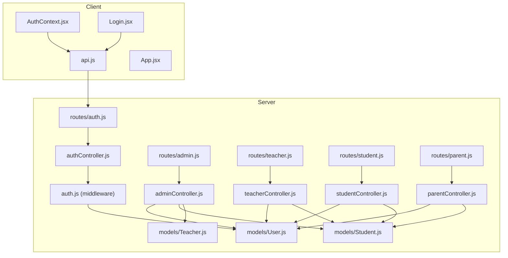
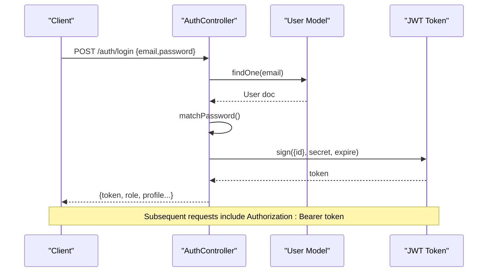
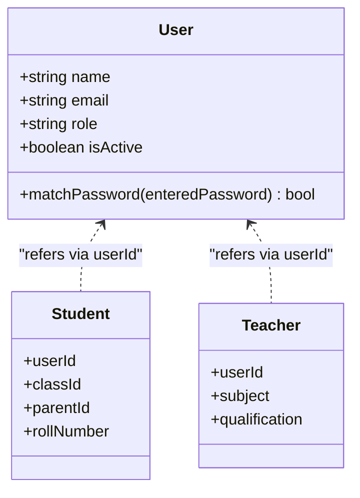
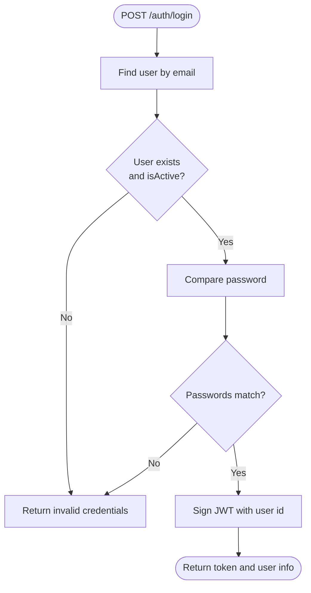
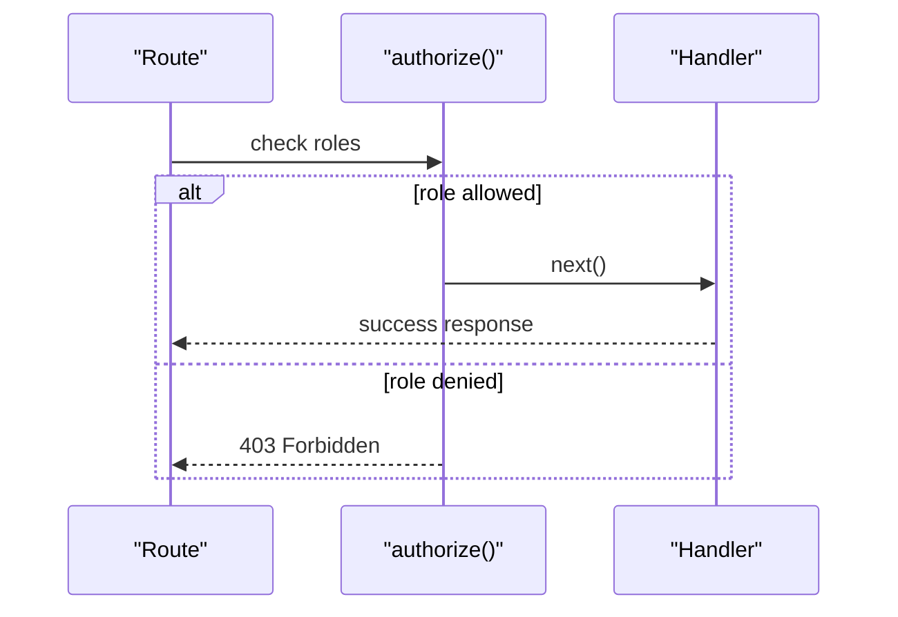
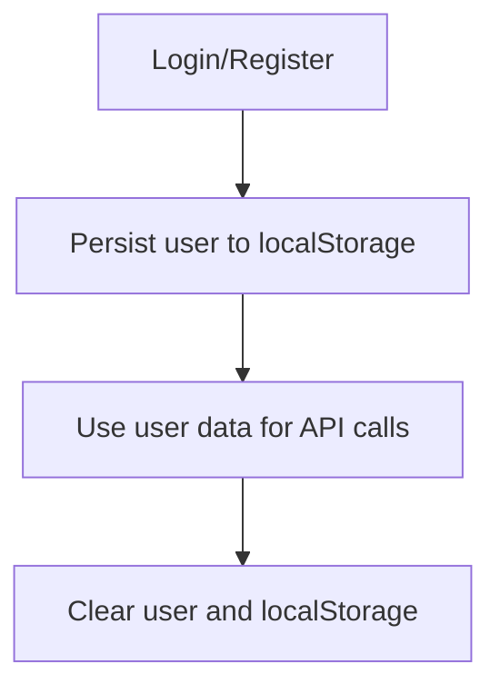
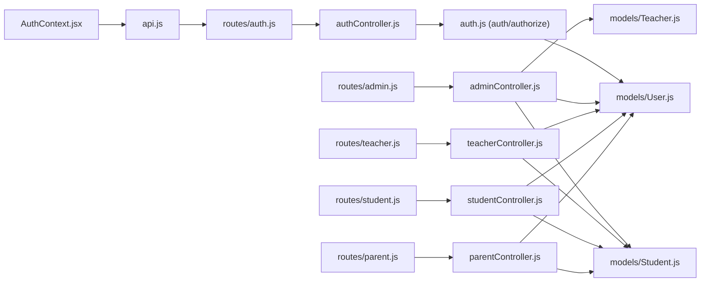

# User Roles & Permissions

<cite>
**Referenced Files in This Document**
- [User.js](file://server/models/User.js)
- [Student.js](file://server/models/Student.js)
- [Teacher.js](file://server/models/Teacher.js)
- [auth.js](file://server/middleware/auth.js)
- [authController.js](file://server/controllers/authController.js)
- [adminController.js](file://server/controllers/adminController.js)
- [teacherController.js](file://server/controllers/teacherController.js)
- [studentController.js](file://server/controllers/studentController.js)
- [parentController.js](file://server/controllers/parentController.js)
- [auth.js](file://server/routes/auth.js)
- [admin.js](file://server/routes/admin.js)
- [teacher.js](file://server/routes/teacher.js)
- [student.js](file://server/routes/student.js)
- [parent.js](file://server/routes/parent.js)
- [AuthContext.jsx](file://client/src/context/AuthContext.jsx)
- [Login.jsx](file://client/src/pages/auth/Login.jsx)
- [App.jsx](file://client/src/App.jsx)
- [api.js](file://client/src/api.js)
</cite>

## Table of Contents
1. [Introduction](#introduction)
2. [Project Structure](#project-structure)
3. [Core Components](#core-components)
4. [Architecture Overview](#architecture-overview)
5. [Detailed Component Analysis](#detailed-component-analysis)
6. [Dependency Analysis](#dependency-analysis)
7. [Performance Considerations](#performance-considerations)
8. [Troubleshooting Guide](#troubleshooting-guide)
9. [Conclusion](#conclusion)

## Introduction
This document explains the user role system in the Educational Management System. It covers the four user types (Admin, Teacher, Student, Parent), their permissions, access levels, and functional capabilities. It also documents the authentication flow, authorization mechanisms, role-based routing, session management, and security considerations.

## Project Structure
The system is split into a React frontend and an Express backend:
- Frontend: Authentication context, login page, and API client manage user sessions and route navigation.
- Backend: JWT-based authentication middleware, role-based authorization, and per-role controllers/routers define capabilities.

**Diagram sources**
- [AuthContext.jsx:1-53](file://client/src/context/AuthContext.jsx#L1-L53)
- [Login.jsx](file://client/src/pages/auth/Login.jsx)
- [api.js](file://client/src/api.js)
- [App.jsx](file://client/src/App.jsx)
- [auth.js:1-31](file://server/middleware/auth.js#L1-L31)
- [authController.js:1-107](file://server/controllers/authController.js#L1-L107)
- [auth.js:1-13](file://server/routes/auth.js#L1-L13)
- [adminController.js:1-158](file://server/controllers/adminController.js#L1-L158)
- [teacherController.js:1-181](file://server/controllers/teacherController.js#L1-L181)
- [studentController.js:1-85](file://server/controllers/studentController.js#L1-L85)
- [parentController.js:1-74](file://server/controllers/parentController.js#L1-L74)
- [admin.js:1-20](file://server/routes/admin.js#L1-L20)
- [teacher.js:1-20](file://server/routes/teacher.js#L1-L20)
- [student.js:1-14](file://server/routes/student.js#L1-L14)
- [parent.js:1-13](file://server/routes/parent.js#L1-L13)
- [User.js:1-27](file://server/models/User.js#L1-L27)
- [Student.js:1-16](file://server/models/Student.js#L1-L16)
- [Teacher.js:1-13](file://server/models/Teacher.js#L1-L13)

**Section sources**
- [AuthContext.jsx:1-53](file://client/src/context/AuthContext.jsx#L1-L53)
- [auth.js:1-31](file://server/middleware/auth.js#L1-L31)
- [authController.js:1-107](file://server/controllers/authController.js#L1-L107)
- [admin.js:1-20](file://server/routes/admin.js#L1-L20)
- [teacher.js:1-20](file://server/routes/teacher.js#L1-L20)
- [student.js:1-14](file://server/routes/student.js#L1-L14)
- [parent.js:1-13](file://server/routes/parent.js#L1-L13)
- [User.js:1-27](file://server/models/User.js#L1-L27)
- [Student.js:1-16](file://server/models/Student.js#L1-L16)
- [Teacher.js:1-13](file://server/models/Teacher.js#L1-L13)

## Core Components
- User model defines role enumeration and password hashing lifecycle hook.
- JWT middleware authenticates requests via Authorization header and attaches user to request.
- Authorization helper enforces role-based access to routes.
- Role-specific controllers implement domain logic for Admin, Teacher, Student, and Parent.
- Role-specific routers attach middleware and expose endpoints gated by roles.
- Client-side AuthContext persists user state and synchronizes with local storage.

Key implementation references:
- User model and password hashing: [User.js:1-27](file://server/models/User.js#L1-L27)
- JWT auth and authorize helpers: [auth.js:1-31](file://server/middleware/auth.js#L1-L31)
- Auth controller endpoints and profile composition: [authController.js:1-107](file://server/controllers/authController.js#L1-L107)
- Admin routes and controller: [admin.js:1-20](file://server/routes/admin.js#L1-L20), [adminController.js:1-158](file://server/controllers/adminController.js#L1-L158)
- Teacher routes and controller: [teacher.js:1-20](file://server/routes/teacher.js#L1-L20), [teacherController.js:1-181](file://server/controllers/teacherController.js#L1-L181)
- Student routes and controller: [student.js:1-14](file://server/routes/student.js#L1-L14), [studentController.js:1-85](file://server/controllers/studentController.js#L1-L85)
- Parent routes and controller: [parent.js:1-13](file://server/routes/parent.js#L1-L13), [parentController.js:1-74](file://server/controllers/parentController.js#L1-L74)
- Client auth context and persistence: [AuthContext.jsx:1-53](file://client/src/context/AuthContext.jsx#L1-L53)

**Section sources**
- [User.js:1-27](file://server/models/User.js#L1-L27)
- [auth.js:1-31](file://server/middleware/auth.js#L1-L31)
- [authController.js:1-107](file://server/controllers/authController.js#L1-L107)
- [admin.js:1-20](file://server/routes/admin.js#L1-L20)
- [adminController.js:1-158](file://server/controllers/adminController.js#L1-L158)
- [teacher.js:1-20](file://server/routes/teacher.js#L1-L20)
- [teacherController.js:1-181](file://server/controllers/teacherController.js#L1-L181)
- [student.js:1-14](file://server/routes/student.js#L1-L14)
- [studentController.js:1-85](file://server/controllers/studentController.js#L1-L85)
- [parent.js:1-13](file://server/routes/parent.js#L1-L13)
- [parentController.js:1-74](file://server/controllers/parentController.js#L1-L74)
- [AuthContext.jsx:1-53](file://client/src/context/AuthContext.jsx#L1-L53)

## Architecture Overview
The system uses bearer token authentication and role-based authorization:
- Clients send Authorization: Bearer <token> headers.
- Middleware verifies tokens and loads user without password.
- Route handlers apply authorize(...) to restrict access to permitted roles.
- Controllers implement role-specific business logic and compose extended profiles for student/teacher.

**Diagram sources**
- [authController.js:31-59](file://server/controllers/authController.js#L31-L59)
- [User.js:22-24](file://server/models/User.js#L22-L24)

**Section sources**
- [authController.js:31-59](file://server/controllers/authController.js#L31-L59)
- [auth.js:4-19](file://server/middleware/auth.js#L4-L19)
- [User.js:22-24](file://server/models/User.js#L22-L24)

## Detailed Component Analysis

### User Roles and Permissions
- Admin
  - Capabilities: Manage users, classes, assign teachers, view dashboard stats.
  - Routes: [admin.js:6-17](file://server/routes/admin.js#L6-L17)
  - Controllers: [adminController.js:6-158](file://server/controllers/adminController.js#L6-L158)
- Teacher
  - Capabilities: Mark attendance, manage exams/results, set assignments, view own classes, post notices.
  - Routes: [teacher.js:6-17](file://server/routes/teacher.js#L6-L17)
  - Controllers: [teacherController.js:10-181](file://server/controllers/teacherController.js#L10-L181)
- Student
  - Capabilities: View personal attendance, results, timetable, assignments, notices, fees.
  - Routes: [student.js:6-11](file://server/routes/student.js#L6-L11)
  - Controllers: [studentController.js:10-85](file://server/controllers/studentController.js#L10-L85)
- Parent
  - Capabilities: View child info, child attendance, results, fees, notices.
  - Routes: [parent.js:6-10](file://server/routes/parent.js#L6-L10)
  - Controllers: [parentController.js:8-74](file://server/controllers/parentController.js#L8-L74)

**Diagram sources**
- [User.js:4-13](file://server/models/User.js#L4-L13)
- [Student.js:3-13](file://server/models/Student.js#L3-L13)
- [Teacher.js:3-10](file://server/models/Teacher.js#L3-L10)

**Section sources**
- [admin.js:6-17](file://server/routes/admin.js#L6-L17)
- [adminController.js:6-158](file://server/controllers/adminController.js#L6-L158)
- [teacher.js:6-17](file://server/routes/teacher.js#L6-L17)
- [teacherController.js:10-181](file://server/controllers/teacherController.js#L10-L181)
- [student.js:6-11](file://server/routes/student.js#L6-L11)
- [studentController.js:10-85](file://server/controllers/studentController.js#L10-L85)
- [parent.js:6-10](file://server/routes/parent.js#L6-L10)
- [parentController.js:8-74](file://server/controllers/parentController.js#L8-L74)
- [User.js:4-13](file://server/models/User.js#L4-L13)
- [Student.js:3-13](file://server/models/Student.js#L3-L13)
- [Teacher.js:3-10](file://server/models/Teacher.js#L3-L10)

### Authentication Flow
- Login validates credentials and issues a signed JWT with an expiration configured via environment variables.
- Subsequent requests must include the token in the Authorization header; otherwise, the auth middleware rejects them.
- The auth middleware decodes the token, fetches the user (without password), and attaches to the request.

**Diagram sources**
- [authController.js:31-59](file://server/controllers/authController.js#L31-L59)

**Section sources**
- [authController.js:31-59](file://server/controllers/authController.js#L31-L59)
- [auth.js:4-19](file://server/middleware/auth.js#L4-L19)

### Authorization and Role-Based Routing
- The authorize helper checks whether the authenticated user’s role is included in the allowed roles for the route.
- Routes are decorated with auth and authorize to enforce access control.

**Diagram sources**
- [auth.js:21-28](file://server/middleware/auth.js#L21-L28)
- [admin.js:6-17](file://server/routes/admin.js#L6-L17)
- [teacher.js:6-17](file://server/routes/teacher.js#L6-L17)
- [student.js:6-11](file://server/routes/student.js#L6-L11)
- [parent.js:6-10](file://server/routes/parent.js#L6-L10)

**Section sources**
- [auth.js:21-28](file://server/middleware/auth.js#L21-L28)
- [admin.js:6-17](file://server/routes/admin.js#L6-L17)
- [teacher.js:6-17](file://server/routes/teacher.js#L6-L17)
- [student.js:6-11](file://server/routes/student.js#L6-L11)
- [parent.js:6-10](file://server/routes/parent.js#L6-L10)

### Session Management (Client-Side)
- The AuthContext stores user data in memory and persists it to local storage after login/register.
- Logout clears the user state and removes persisted data.
- The API client uses the stored user data to configure requests (e.g., setting Authorization header).

**Diagram sources**
- [AuthContext.jsx:20-37](file://client/src/context/AuthContext.jsx#L20-L37)
- [api.js](file://client/src/api.js)

**Section sources**
- [AuthContext.jsx:1-53](file://client/src/context/AuthContext.jsx#L1-L53)
- [api.js](file://client/src/api.js)

### Functional Capabilities by Role
- Admin
  - User management: create/update/delete users; fetch lists with filters.
  - Class management: CRUD classes; assign teachers.
  - Dashboard: statistics aggregation by role and counts.
  - References: [admin.js:6-17](file://server/routes/admin.js#L6-L17), [adminController.js:19-98](file://server/controllers/adminController.js#L19-L98)
- Teacher
  - Attendance: mark daily attendance; query class and monthly summaries.
  - Exams and Results: create exams; upload and retrieve results.
  - Assignments: create/list/delete assignments for a class.
  - Notices: post notices.
  - References: [teacher.js:6-17](file://server/routes/teacher.js#L6-L17), [teacherController.js:10-181](file://server/controllers/teacherController.js#L10-L181)
- Student
  - Personal views: attendance, results, timetable, assignments, notices, fees.
  - References: [student.js:6-11](file://server/routes/student.js#L6-L11), [studentController.js:10-85](file://server/controllers/studentController.js#L10-L85)
- Parent
  - Child-centric views: child info, attendance, results, fees, notices.
  - References: [parent.js:6-10](file://server/routes/parent.js#L6-L10), [parentController.js:8-74](file://server/controllers/parentController.js#L8-L74)

**Section sources**
- [adminController.js:6-158](file://server/controllers/adminController.js#L6-L158)
- [teacherController.js:10-181](file://server/controllers/teacherController.js#L10-L181)
- [studentController.js:10-85](file://server/controllers/studentController.js#L10-L85)
- [parentController.js:8-74](file://server/controllers/parentController.js#L8-L74)

## Dependency Analysis
- Authentication and authorization depend on JWT verification and the User model.
- Controllers depend on models for Student and Teacher to enrich profiles and implement role logic.
- Routes depend on middleware to enforce auth and authorization.
- Client depends on AuthContext and API client to maintain session state.

**Diagram sources**
- [AuthContext.jsx:1-53](file://client/src/context/AuthContext.jsx#L1-L53)
- [api.js](file://client/src/api.js)
- [auth.js:1-31](file://server/middleware/auth.js#L1-L31)
- [authController.js:1-107](file://server/controllers/authController.js#L1-L107)
- [admin.js:1-20](file://server/routes/admin.js#L1-L20)
- [adminController.js:1-158](file://server/controllers/adminController.js#L1-L158)
- [teacher.js:1-20](file://server/routes/teacher.js#L1-L20)
- [teacherController.js:1-181](file://server/controllers/teacherController.js#L1-L181)
- [student.js:1-14](file://server/routes/student.js#L1-L14)
- [studentController.js:1-85](file://server/controllers/studentController.js#L1-L85)
- [parent.js:1-13](file://server/routes/parent.js#L1-L13)
- [parentController.js:1-74](file://server/controllers/parentController.js#L1-L74)
- [User.js:1-27](file://server/models/User.js#L1-L27)
- [Student.js:1-16](file://server/models/Student.js#L1-L16)
- [Teacher.js:1-13](file://server/models/Teacher.js#L1-L13)

**Section sources**
- [auth.js:1-31](file://server/middleware/auth.js#L1-L31)
- [authController.js:1-107](file://server/controllers/authController.js#L1-L107)
- [admin.js:1-20](file://server/routes/admin.js#L1-L20)
- [teacher.js:1-20](file://server/routes/teacher.js#L1-L20)
- [student.js:1-14](file://server/routes/student.js#L1-L14)
- [parent.js:1-13](file://server/routes/parent.js#L1-L13)
- [User.js:1-27](file://server/models/User.js#L1-L27)
- [Student.js:1-16](file://server/models/Student.js#L1-L16)
- [Teacher.js:1-13](file://server/models/Teacher.js#L1-L13)

## Performance Considerations
- Token verification occurs on every protected route; keep JWT_SECRET secure and avoid overly long expirations.
- Populate-heavy queries (e.g., admin user listings, teacher class attendance) can be optimized with projection and pagination.
- Consider caching frequently accessed dashboards for admins.
- Client-side local storage usage is minimal; ensure token storage remains secure and avoid storing sensitive fields.

## Troubleshooting Guide
Common issues and resolutions:
- Not authorized, no token
  - Cause: Missing or malformed Authorization header.
  - Resolution: Ensure requests include Authorization: Bearer <token>.
  - Reference: [auth.js:10-12](file://server/middleware/auth.js#L10-L12)
- Not authorized, token failed
  - Cause: Invalid/expired token or signature mismatch.
  - Resolution: Re-authenticate the user; verify JWT_SECRET and expiration settings.
  - Reference: [auth.js:16-18](file://server/middleware/auth.js#L16-L18)
- Role is not authorized to access this route
  - Cause: Requested endpoint requires a different role.
  - Resolution: Verify the user’s role and the route’s allowed roles.
  - Reference: [auth.js:23-25](file://server/middleware/auth.js#L23-L25)
- Invalid credentials
  - Cause: Nonexistent user or wrong password.
  - Resolution: Confirm email/password; ensure account is active.
  - Reference: [authController.js:35-44](file://server/controllers/authController.js#L35-L44)
- Account is deactivated
  - Cause: User marked inactive.
  - Resolution: Contact administrator to reactivate.
  - Reference: [authController.js:38-40](file://server/controllers/authController.js#L38-L40)

**Section sources**
- [auth.js:10-18](file://server/middleware/auth.js#L10-L18)
- [auth.js:23-25](file://server/middleware/auth.js#L23-L25)
- [authController.js:35-44](file://server/controllers/authController.js#L35-L44)
- [authController.js:38-40](file://server/controllers/authController.js#L38-L40)

## Conclusion
The system implements a clear, layered role-based access control model:
- Authentication via JWT with robust middleware.
- Authorization enforced per-route with flexible role sets.
- Role-specific controllers and routes encapsulate capabilities.
- Client-side context manages session state and integrates with backend APIs.

This design supports secure, scalable access control across Admin, Teacher, Student, and Parent roles while maintaining separation of concerns and predictable behavior.