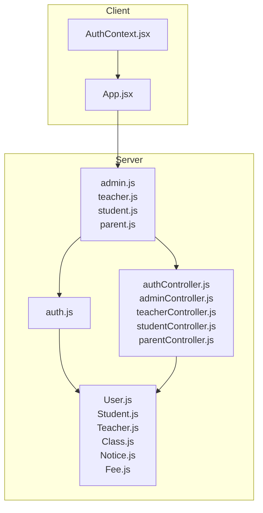
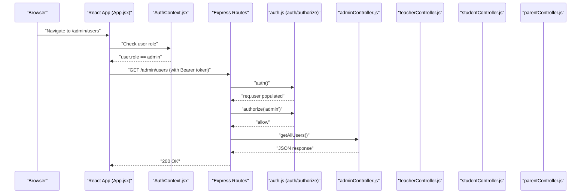
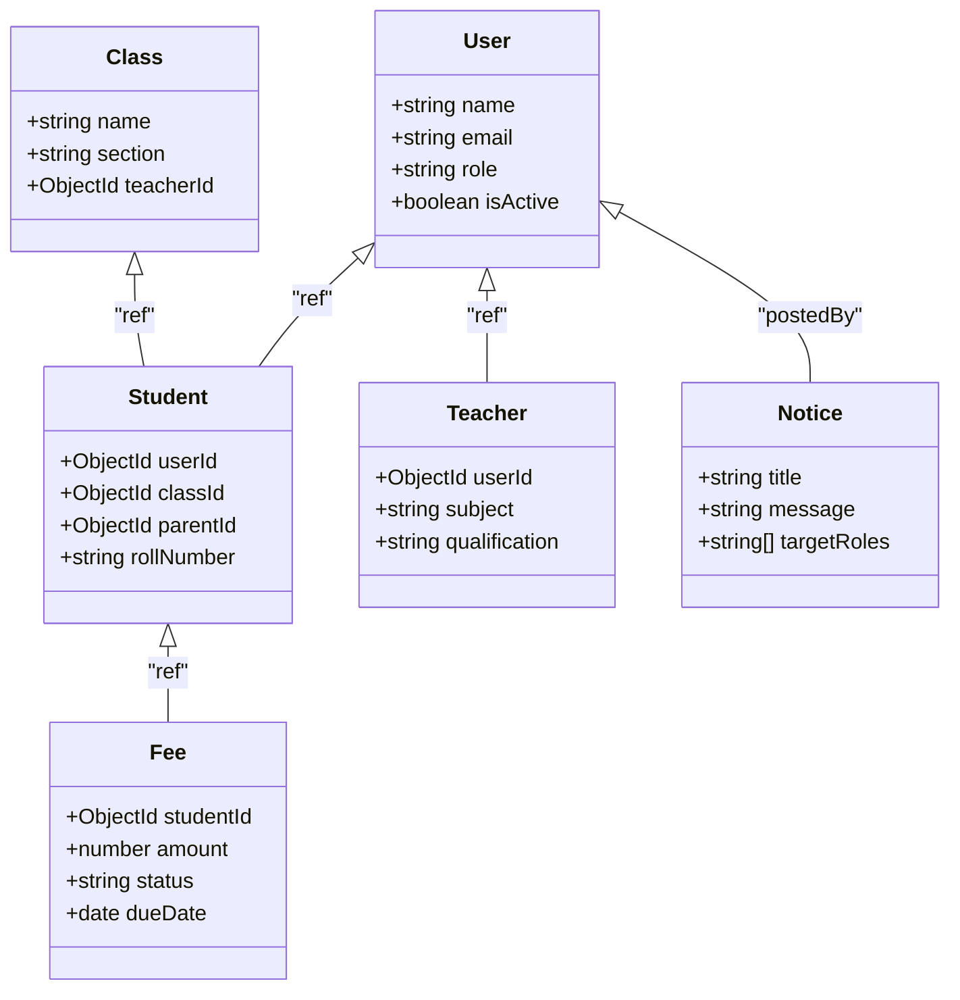
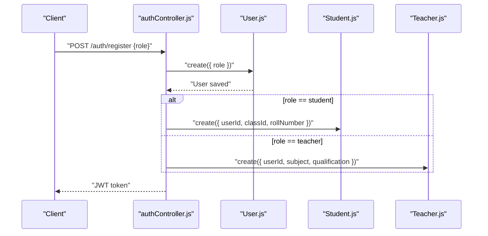
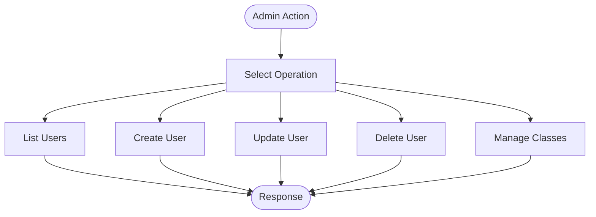
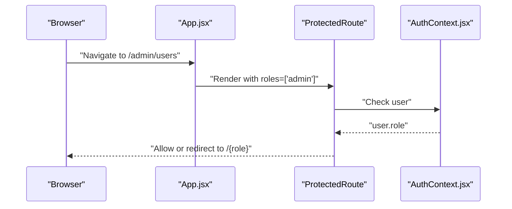
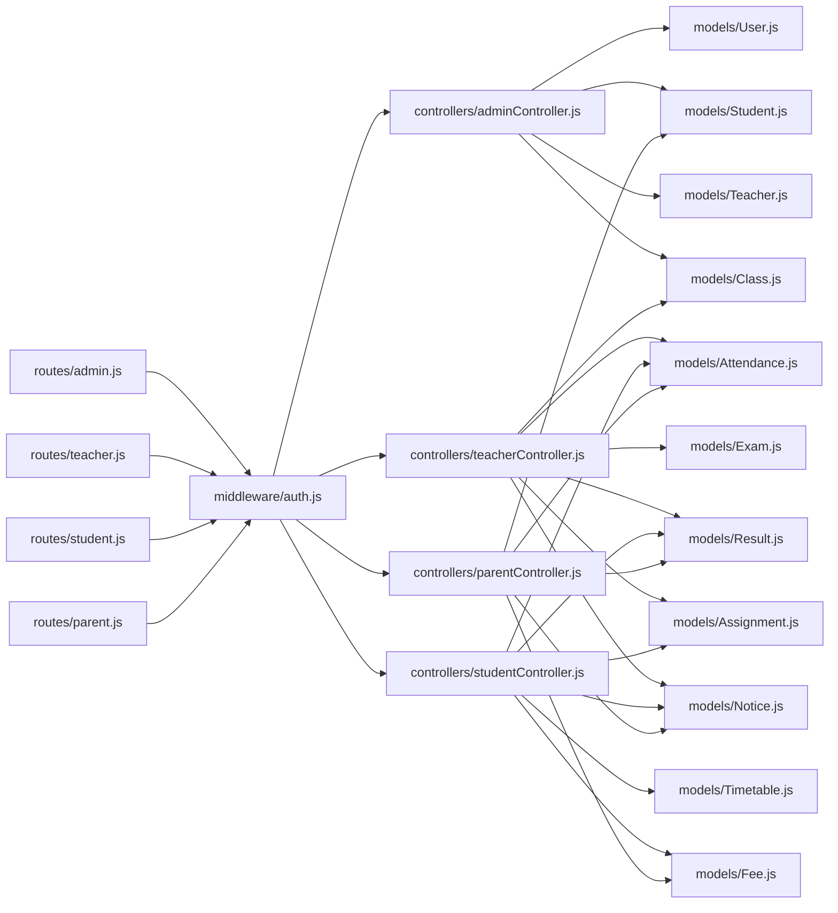

# User Roles Hierarchy

<cite>
**Referenced Files in This Document**
- [User.js](file://server/models/User.js)
- [auth.js](file://server/middleware/auth.js)
- [authController.js](file://server/controllers/authController.js)
- [adminController.js](file://server/controllers/adminController.js)
- [teacherController.js](file://server/controllers/teacherController.js)
- [studentController.js](file://server/controllers/studentController.js)
- [parentController.js](file://server/controllers/parentController.js)
- [admin.js](file://server/routes/admin.js)
- [teacher.js](file://server/routes/teacher.js)
- [student.js](file://server/routes/student.js)
- [parent.js](file://server/routes/parent.js)
- [Student.js](file://server/models/Student.js)
- [Teacher.js](file://server/models/Teacher.js)
- [Class.js](file://server/models/Class.js)
- [Notice.js](file://server/models/Notice.js)
- [Fee.js](file://server/models/Fee.js)
- [AuthContext.jsx](file://client/src/context/AuthContext.jsx)
- [App.jsx](file://client/src/App.jsx)
</cite>

## Table of Contents
1. [Introduction](#introduction)
2. [Project Structure](#project-structure)
3. [Core Components](#core-components)
4. [Architecture Overview](#architecture-overview)
5. [Detailed Component Analysis](#detailed-component-analysis)
6. [Dependency Analysis](#dependency-analysis)
7. [Performance Considerations](#performance-considerations)
8. [Troubleshooting Guide](#troubleshooting-guide)
9. [Conclusion](#conclusion)
10. [Appendices](#appendices)

## Introduction
This document defines the user role hierarchy and permissions matrix for the academic management system. It explains the four roles (admin, teacher, student, parent), their capabilities, access levels, and how they interact with system modules. It also documents role-based feature access, data visibility restrictions, functional limitations, role assignment processes, and administrative controls for managing roles.

## Project Structure
The system is a full-stack application with:
- Backend: Express.js server with Mongoose models, controllers, routes, and JWT-based authentication middleware.
- Frontend: React SPA protected by an authentication context and route guards.

Key backend components relevant to roles and permissions:
- Authentication and authorization middleware
- Role-aware routes delegating to role-specific controllers
- Role-specific controllers implementing CRUD and domain logic
- Mongoose models representing Users, Students, Teachers, Classes, Notices, and Fees

**Diagram sources**
- [AuthContext.jsx:1-53](file://client/src/context/AuthContext.jsx#L1-L53)
- [App.jsx:1-85](file://client/src/App.jsx#L1-L85)
- [auth.js:1-31](file://server/middleware/auth.js#L1-L31)
- [User.js:1-27](file://server/models/User.js#L1-L27)
- [Student.js:1-16](file://server/models/Student.js#L1-L16)
- [Teacher.js:1-13](file://server/models/Teacher.js#L1-L13)
- [Class.js:1-11](file://server/models/Class.js#L1-L11)
- [Notice.js:1-14](file://server/models/Notice.js#L1-L14)
- [Fee.js:1-17](file://server/models/Fee.js#L1-L17)
- [admin.js:1-20](file://server/routes/admin.js#L1-L20)
- [teacher.js:1-20](file://server/routes/teacher.js#L1-L20)
- [student.js:1-14](file://server/routes/student.js#L1-L14)
- [parent.js:1-13](file://server/routes/parent.js#L1-L13)
- [authController.js:1-107](file://server/controllers/authController.js#L1-L107)
- [adminController.js:1-158](file://server/controllers/adminController.js#L1-L158)
- [teacherController.js:1-181](file://server/controllers/teacherController.js#L1-L181)
- [studentController.js:1-85](file://server/controllers/studentController.js#L1-L85)
- [parentController.js:1-74](file://server/controllers/parentController.js#L1-L74)

**Section sources**
- [App.jsx:18-72](file://client/src/App.jsx#L18-L72)
- [AuthContext.jsx:8-51](file://client/src/context/AuthContext.jsx#L8-L51)
- [auth.js:4-30](file://server/middleware/auth.js#L4-L30)
- [User.js:4-13](file://server/models/User.js#L4-L13)

## Core Components
- User model defines the role field with allowed values and stores basic profile info. Password hashing occurs pre-save.
- Authentication middleware verifies JWT and attaches user to request; authorization middleware enforces role-based access to routes.
- Controllers implement role-specific logic:
  - Admin: user/class management, dashboard stats, class enrollment/teacher assignment
  - Teacher: attendance marking, exam/result management, assignments, notices, class lookup
  - Student: personal attendance/results/timetable/assignments/notices/fees
  - Parent: child’s attendance/results/fees/notices and child info
- Models for Student and Teacher link to User via foreign keys; Class and Notice include cross-role targeting; Fee targets Students.

**Section sources**
- [User.js:4-13](file://server/models/User.js#L4-L13)
- [auth.js:4-30](file://server/middleware/auth.js#L4-L30)
- [adminController.js:6-17](file://server/controllers/adminController.js#L6-L17)
- [teacherController.js:11-41](file://server/controllers/teacherController.js#L11-L41)
- [studentController.js:10-31](file://server/controllers/studentController.js#L10-L31)
- [parentController.js:8-29](file://server/controllers/parentController.js#L8-L29)
- [Student.js:3-13](file://server/models/Student.js#L3-L13)
- [Teacher.js:3-10](file://server/models/Teacher.js#L3-L10)
- [Class.js:3-8](file://server/models/Class.js#L3-L8)
- [Notice.js:3-11](file://server/models/Notice.js#L3-L11)
- [Fee.js:3-14](file://server/models/Fee.js#L3-L14)

## Architecture Overview
The system enforces role-based access at two layers:
- Client-side routing protection using a ProtectedRoute wrapper and role checks
- Server-side route protection using middleware that validates JWT and role authorization

**Diagram sources**
- [App.jsx:18-24](file://client/src/App.jsx#L18-L24)
- [AuthContext.jsx:20-31](file://client/src/context/AuthContext.jsx#L20-L31)
- [admin.js:6-11](file://server/routes/admin.js#L6-L11)
- [auth.js:4-30](file://server/middleware/auth.js#L4-L30)
- [adminController.js:20-37](file://server/controllers/adminController.js#L20-L37)

## Detailed Component Analysis

### Role Definitions and Access Matrix
- Admin
  - Capabilities: manage users, classes, dashboard analytics; assign teachers to classes; view class student lists
  - Access: GET/POST/PUT/DELETE /admin/users; GET/POST/PUT/DELETE /admin/classes; GET /admin/classes/:id/students; PUT /admin/classes/:id/assign-teacher; GET /admin/dashboard
  - Data visibility: all users, classes, student profiles, teacher profiles; global notices; financial summaries
  - Functional limitations: none for admin-managed endpoints; can delete users and classes

- Teacher
  - Capabilities: mark attendance, view class attendance, monthly attendance summary; create and manage exams/results; create assignments; view class assignments; manage own notices; view assigned classes
  - Access: POST /teacher/attendance; GET /teacher/attendance; GET /teacher/attendance/monthly; POST/GET /teacher/exams/:classId; POST/GET /teacher/results/:examId; POST/GET /teacher/assignments/:classId; DELETE /teacher/assignments/:id; GET /teacher/classes; POST /teacher/notices
  - Data visibility: own classes, students in those classes, own results and notices; can view monthly attendance for classes they teach
  - Functional limitations: cannot manage users or classes; cannot delete other users; cannot access admin-only dashboards

- Student
  - Capabilities: view personal attendance, results, timetable, assignments, notices, fees
  - Access: GET /student/attendance; GET /student/results; GET /student/timetable; GET /student/assignments; GET /student/notices; GET /student/fees
  - Data visibility: personal data only; class-related data derived from enrolled class
  - Functional limitations: cannot access teacher/admin features; cannot edit others’ data

- Parent
  - Capabilities: view child’s attendance, results, fees, notices; view child info
  - Access: GET /parent/child; GET /parent/attendance; GET /parent/results; GET /parent/fees; GET /parent/notices
  - Data visibility: child’s data only; cannot access student or teacher features
  - Functional limitations: cannot edit child’s data; cannot access admin/teacher features

**Diagram sources**
- [User.js:4-13](file://server/models/User.js#L4-L13)
- [Student.js:3-13](file://server/models/Student.js#L3-L13)
- [Teacher.js:3-10](file://server/models/Teacher.js#L3-L10)
- [Class.js:3-8](file://server/models/Class.js#L3-L8)
- [Notice.js:3-11](file://server/models/Notice.js#L3-L11)
- [Fee.js:3-14](file://server/models/Fee.js#L3-L14)

**Section sources**
- [admin.js:6-17](file://server/routes/admin.js#L6-L17)
- [teacher.js:6-17](file://server/routes/teacher.js#L6-L17)
- [student.js:6-11](file://server/routes/student.js#L6-L11)
- [parent.js:6-10](file://server/routes/parent.js#L6-L10)
- [User.js:8](file://server/models/User.js#L8)
- [Notice.js:7](file://server/models/Notice.js#L7)

### Role Assignment and Inheritance Patterns
- Role assignment
  - During registration, the role is set on the User document. The auth controller creates a User and issues a JWT containing the user identifier.
  - For students and teachers, dedicated profiles are created linking to the User via foreign keys after initial User creation.
- Role inheritance
  - There is no explicit inheritance between roles. Access is enforced by route-level authorization middleware that checks the user’s role against allowed roles per endpoint.

**Diagram sources**
- [authController.js:10-29](file://server/controllers/authController.js#L10-L29)
- [User.js:4-13](file://server/models/User.js#L4-L13)
- [Student.js:3-13](file://server/models/Student.js#L3-L13)
- [Teacher.js:3-10](file://server/models/Teacher.js#L3-L10)

**Section sources**
- [authController.js:10-29](file://server/controllers/authController.js#L10-L29)
- [User.js:4-13](file://server/models/User.js#L4-L13)
- [Student.js:3-13](file://server/models/Student.js#L3-L13)
- [Teacher.js:3-10](file://server/models/Teacher.js#L3-L10)

### Administrative Controls for Role Management
- Admin can:
  - List users with optional filters (role, search)
  - Retrieve user details with role-specific profile data
  - Create users with role and associated profile fields
  - Update user profile and activation status; update role-specific attributes
  - Delete users and their related profiles
  - Manage classes and assign teachers to classes
- Access is controlled by the authorize middleware allowing only admin on admin-managed endpoints.

**Diagram sources**
- [admin.js:6-17](file://server/routes/admin.js#L6-L17)
- [adminController.js:20-98](file://server/controllers/adminController.js#L20-L98)

**Section sources**
- [admin.js:6-17](file://server/routes/admin.js#L6-L17)
- [adminController.js:20-98](file://server/controllers/adminController.js#L20-L98)

### Client-Side Role-Based Navigation and Protection
- ProtectedRoute enforces role checks and redirects unauthorized users.
- AuthContext persists user session and exposes login/register/logout/updateProfile.

**Diagram sources**
- [App.jsx:18-24](file://client/src/App.jsx#L18-L24)
- [AuthContext.jsx:20-31](file://client/src/context/AuthContext.jsx#L20-L31)

**Section sources**
- [App.jsx:18-24](file://client/src/App.jsx#L18-L24)
- [AuthContext.jsx:20-31](file://client/src/context/AuthContext.jsx#L20-L31)

## Dependency Analysis
- Routes depend on auth middleware and delegate to controllers.
- Controllers depend on models for data access and manipulation.
- Client depends on AuthContext and route guards for navigation.

**Diagram sources**
- [admin.js:1-20](file://server/routes/admin.js#L1-L20)
- [teacher.js:1-20](file://server/routes/teacher.js#L1-L20)
- [student.js:1-14](file://server/routes/student.js#L1-L14)
- [parent.js:1-13](file://server/routes/parent.js#L1-L13)
- [auth.js:1-31](file://server/middleware/auth.js#L1-L31)
- [adminController.js:1-158](file://server/controllers/adminController.js#L1-L158)
- [teacherController.js:1-181](file://server/controllers/teacherController.js#L1-L181)
- [studentController.js:1-85](file://server/controllers/studentController.js#L1-L85)
- [parentController.js:1-74](file://server/controllers/parentController.js#L1-L74)
- [User.js:1-27](file://server/models/User.js#L1-L27)
- [Student.js:1-16](file://server/models/Student.js#L1-L16)
- [Teacher.js:1-13](file://server/models/Teacher.js#L1-L13)
- [Class.js:1-11](file://server/models/Class.js#L1-L11)
- [Notice.js:1-14](file://server/models/Notice.js#L1-L14)
- [Fee.js:1-17](file://server/models/Fee.js#L1-L17)

**Section sources**
- [admin.js:1-20](file://server/routes/admin.js#L1-L20)
- [teacher.js:1-20](file://server/routes/teacher.js#L1-L20)
- [student.js:1-14](file://server/routes/student.js#L1-L14)
- [parent.js:1-13](file://server/routes/parent.js#L1-L13)
- [auth.js:1-31](file://server/middleware/auth.js#L1-L31)

## Performance Considerations
- Token verification occurs on every protected request; keep JWT_SECRET secure and rotate as needed.
- Controllers use population and aggregation; ensure indexes on foreign keys (e.g., userId, studentId, classId) for efficient queries.
- Pagination is supported for listing users; apply similar pagination for notices and fees to avoid large payloads.

## Troubleshooting Guide
- Not authorized, no token
  - Cause: Missing or malformed Authorization header.
  - Resolution: Ensure requests include a Bearer token.
- Not authorized, token failed
  - Cause: Invalid or expired token.
  - Resolution: Re-authenticate and obtain a new token.
- Role is not authorized to access this route
  - Cause: Requested route requires a different role.
  - Resolution: Verify the user’s role and navigate to appropriate section.
- Account is deactivated
  - Cause: User marked inactive.
  - Resolution: Contact administrator to reactivate account.
- User not found
  - Cause: Attempted operation on non-existent user/resource.
  - Resolution: Confirm identifiers and existence before invoking endpoints.

**Section sources**
- [auth.js:10-18](file://server/middleware/auth.js#L10-L18)
- [authController.js:34-44](file://server/controllers/authController.js#L34-L44)
- [adminController.js:39-52](file://server/controllers/adminController.js#L39-L52)

## Conclusion
The system implements a clear role hierarchy with explicit permissions per role. Admin has broad administrative powers, while Teacher, Student, and Parent have narrowly scoped access aligned to their responsibilities. Role enforcement is consistently applied on both client and server sides, ensuring secure and predictable access patterns.

## Appendices

### Permissions Matrix Summary
- Admin
  - Users: list, view, create, update, delete
  - Classes: list, create, update, delete, assign teacher
  - Dashboards: analytics
- Teacher
  - Attendance: mark, view class, monthly summary
  - Exams/Results: create, view class, upload, view results
  - Assignments: create, list class, delete
  - Notices: create
  - Classes: list assigned
- Student
  - Personal: attendance, results, timetable, assignments, notices, fees
- Parent
  - Child data: attendance, results, fees, notices, info

**Section sources**
- [admin.js:6-17](file://server/routes/admin.js#L6-L17)
- [teacher.js:6-17](file://server/routes/teacher.js#L6-L17)
- [student.js:6-11](file://server/routes/student.js#L6-L11)
- [parent.js:6-10](file://server/routes/parent.js#L6-L10)